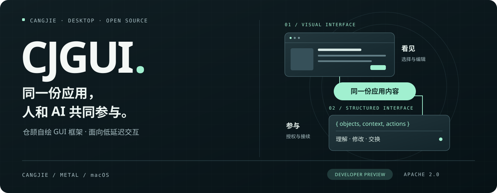
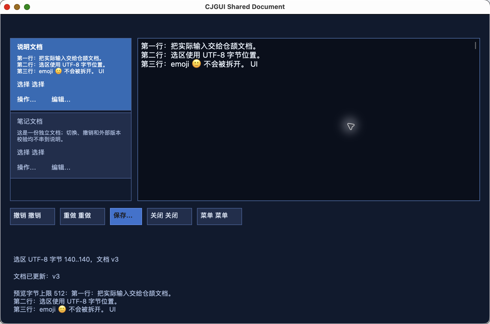
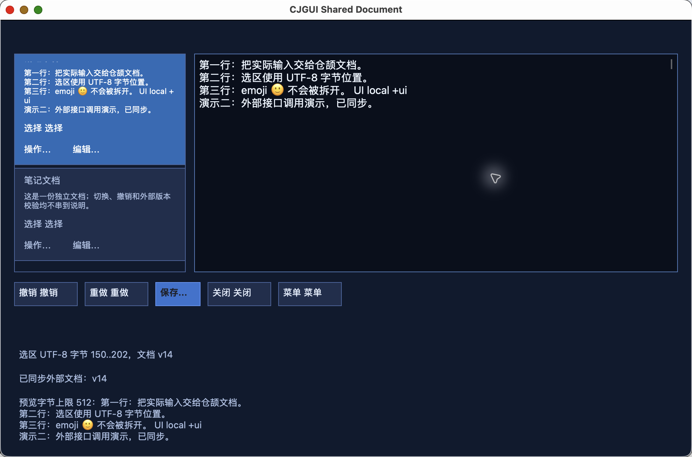
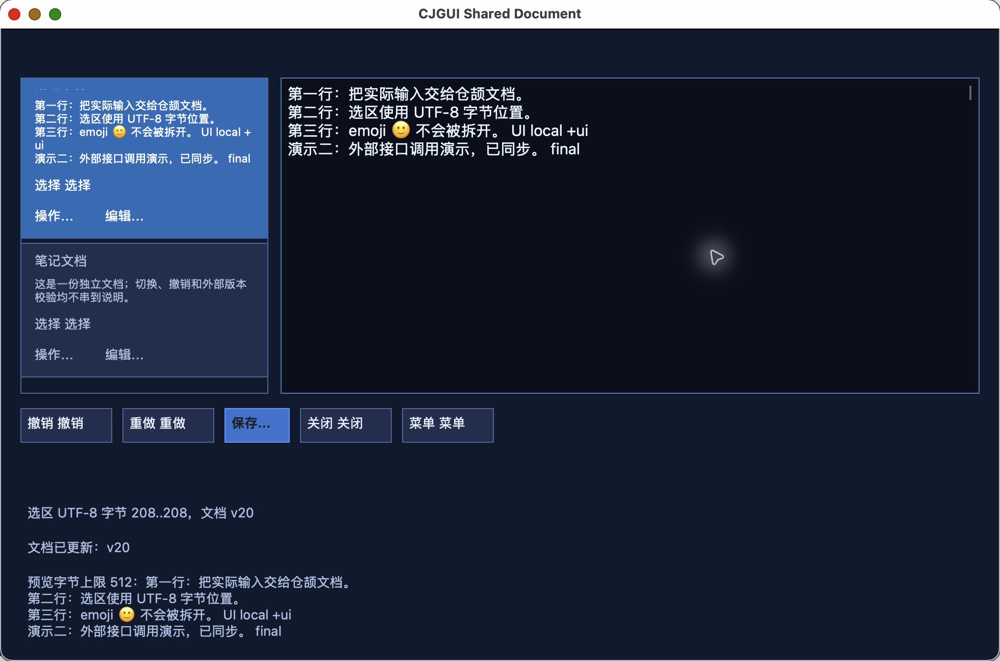
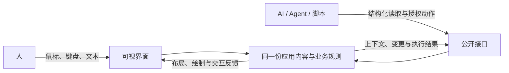

<p align="center">
  <strong>以仓颉为核心，面向 macOS 与鸿蒙的自绘 GUI 框架。</strong><br>
  人和 AI 共同构建、操作界面；手写、运行时生成与混合界面共享组件和应用内容。
</p>

<p align="center">
  <a href="#鸿蒙自绘后端">鸿蒙支持</a> ·
  <a href="#运行一个窗口">macOS 示例</a> ·
  <a href="#创建自己的应用">创建应用</a> ·
  <a href="runtime/cjgui/README.md">开发文档</a> ·
  <a href="LICENSE">Apache 2.0</a>
</p>

## 最近的进展

- **鸿蒙自绘后端**：共享仓颉核心已进入鸿蒙 HAP，在模拟器中运行自绘界面、接收触摸与文字编辑，并与外部程序共同操作应用数据。[了解鸿蒙支持](#鸿蒙自绘后端)
- **长文本增量渲染**：局部编辑复用已有排版与文字纹理，长文档的滚动、选区和持续编辑共用这套机制。多片文字共享准备结果，让一次修改集中更新受影响的内容。
- **统一样式与多窗口**：命名样式将基础外观和交互状态一起绑定，手写界面、生成组件与页签同步响应主题变化。一个应用可以打开多个窗口，分别编辑并接续处理操作。[了解实现](docs/plans/2026-09-23-incremental-text-style-binding-milestone.md)
- **运行时生成界面**：外部程序通过公开接口发现组件、字段与动作，提交新的界面结构；生成区域与手写界面共用组件、数据绑定和绘制，支持在运行中调整布局与样式。[开发指南](runtime/cjgui/README.md#运行时生成式接入experimental已接通公开闭环)

## 鸿蒙自绘后端

**一套仓颉核心，连接 macOS 与鸿蒙。** 鸿蒙是 CJGUI 的重点平台：应用用仓颉定义组件、布局、场景和业务规则，平台后端负责接入各自的窗口、绘制与输入服务。macOS 上积累的组件体系、状态管理和人机协作能力，为鸿蒙应用提供了可以继续复用的框架基础。

鸿蒙后端已经把这条路线带进实际应用：**仓颉核心加载到 HAP，自绘界面接收触摸和文字输入，外部程序通过共同操作接口读取、修改同一份应用数据。** 当前提供模拟器开发预览，设置与计数示例已覆盖中文显示、按钮操作、名称编辑、选区高亮和外部修改。

### 在鸿蒙上，仓颉负责什么

组件树、布局计算、业务状态、字段校验和操作协议都由仓颉核心维护。ArkTS 承载应用入口与系统文字代理，XComponent 提供自绘承载面，原生后端通过 OH_Drawing 完成绘制。界面中的触摸、输入和外部调用再回到仓颉应用，更新同一份内容。

这种分工让平台适配集中在系统服务一侧。应用可以复用组件和领域代码，桌面端积累的布局、样式、动态界面与共同操作设计也能持续延伸到鸿蒙。

### 已经接入的能力

| 能力 | 鸿蒙侧的实现 |
| --- | --- |
| **仓颉组件与自绘场景** | 共享核心生成组件、布局和场景，鸿蒙原生后端绘制中文文字、形状与控件，并将触摸位置映射到应用动作。 |
| **系统文字输入** | 单行字段接入系统文字代理，支持文字变化、选区同步与可见高亮，提交和失焦将编辑内容写回仓颉应用。 |
| **人与 AI 共同操作** | 用户点击和外部指令调用同一套业务操作；支持字段读取与修改、计数动作、授权检查和版本冲突处理，修改同步反馈到界面。 |
| **平台宿主** | ArkTS 应用入口、XComponent 自绘承载面与仓颉运行时连接起来，为应用提供绘制、触摸和系统输入的接入位置。 |
| **HAP 构建与部署** | 框架源码同步、原生后端编译、运行时依赖打包、HAP 生成与模拟器安装启动已串成工程流程。 |

以设置示例为例，你可以在鸿蒙窗口点击增加、减少，编辑设备名称；外部程序也可以读取当前值、修改名称或执行计数动作，随后继续在窗口中操作。这套接续方式沿用桌面端的共同操作协议，让 Agent 和自动化工具能够参与鸿蒙应用。

对开发者而言，CJGUI 提供了一条**用仓颉沉淀应用逻辑与 UI，再向桌面和鸿蒙扩展**的路径。设置工具、数据面板、结构化编辑器与 Agent 工作界面，都可以围绕这套共享核心组织代码。

[平台架构与构建说明](runtime/cjgui/platforms/ohos/README.md) · [鸿蒙示例工程](labs/ohos_cjgui_app/) · [共享仓颉应用源码](runtime/cjgui/examples/settings_counter_application/)

## 演示：接续编辑同一份文档


*26 秒实录：先在窗口中编辑，再通过公开接口追加内容，最后回到窗口继续输入。窗口与外部调用读写同一份文档，修改同步显示。[观看 MP4](docs/assets/demo/cjgui-shared-document-real-demo.mp4) · [演示说明](docs/assets/demo/README.md)*

<details>
<summary>分步截图（视频无法自动播放的环境）</summary>

1. **界面编辑**：在窗口中输入文字，应用同步更新内容与选区。

   

2. **外部接续**：通过公开接口追加内容，窗口随之更新。

   

3. **回到窗口**：继续编辑刚刚更新的文档，外部程序也能读取最新内容。

   

</details>

## 一个框架，两种参与方式

CJGUI 是一个以仓颉为核心、面向 macOS 与鸿蒙的**自绘 GUI 框架**。人通过窗口选择和编辑；AI、脚本或其他应用通过结构化接口理解内容、执行动作。双方读写同一份应用状态，也能接续修改界面。

开发者可以用仓颉手写界面，通过公开接口在运行时生成界面，或将两者组合。它们共用组件、布局、输入与自绘机制，适合构建编辑器、规则工具、数据面板和 AI 工作台。

| 自绘与低延迟 | 人与 AI 共同操作和构建 | 应用由你定义 |
| :--- | :--- | :--- |
| 仓颉组件与布局，Metal 场景合成。局部更新、文字与图片缓存、虚拟列表共同减少重复工作。 | 窗口和公开接口共享内容、选择与动作，外部程序可以直接参与数据操作和界面组合。 | 自由组合界面，按需接入模型或 Agent，自行定义业务规则、交流方式与工作流。 |

## 人和 AI 都是一等公民

你在窗口里选中一条规则，修改草稿；AI 读取当前上下文，批量调整记录；你继续在界面里检查和编辑。处理 100 条屏外记录，也可以直接调用应用的数据操作。授权、版本冲突与业务校验由框架和应用统一处理。

关键是建立可靠的对应关系：**人看到的字段、AI 读取的对象，以及最终执行的动作，属于同一个应用。**

共同参与也包括**构建界面**：应用发布可用的组件、字段、样式和动作，AI 可以据此组合面板、调整布局。生成的控件使用应用已有的数据与操作，人可以直接在窗口中继续工作。



开发者可以保留手写主体，只开放局部生成区域，也可以让外部程序组织整个面板。框架负责结构更新时的版本、焦点、草稿与绑定关系，并为调用方提供明确的处理结果。[了解生成与共同操作设计](docs/core/AI_NATIVE_UI_SEMANTICS.md#运行时生成与修改界面)

## 构建应用所需的能力

| 能力 | 可以用来做什么 |
| --- | --- |
| **自绘与 GPU 合成** | 共享场景对接平台绘制后端：macOS 使用 Metal 合成形状、图片与文字纹理；鸿蒙通过 XComponent 与 OH_Drawing 呈现自绘内容。 |
| **仓颉组件与布局** | 用容器、文字、按钮、表单、页签、滑块、滚动区、分隔视图和弹层组合界面；绘制、命中与语义信息共享布局结果。 |
| **文字编辑与输入** | 多行文档、增量更新、焦点、选区、快捷键和连续拖动；复用系统文字排版与输入服务，支持中文、emoji 等混合内容。 |
| **主题与交互样式** | 通过命名样式统一配置基础外观、悬停、按下、聚焦、选中与禁用状态，让手写控件和生成组件保持一致。 |
| **动态数据与大列表** | 固定与可变行高虚拟列表、树形数据、多选和稳定条目身份；按视口创建需要显示的内容。 |
| **运行时生成与混合界面** | 发现组件能力，提交和更新界面结构；注册应用自己的组合组件，与手写区域共享字段、动作和样式。 |
| **共同操作** | 对象读取、授权调用、版本冲突检测、批量修改与变更观察；通过本地 Python API / CLI 连接 Agent 或自动化工具。 |
| **多窗口与应用宿主** | 在同一应用中管理多个窗口；使用模板创建应用，由统一 runner 完成构建、bundle 和资源管理，也可导出框架源码预览供独立项目使用。 |

## 按你的方式接入 AI

应用定义组件、字段和业务动作，CJGUI 将它们同时提供给可视界面与结构化接口。Agent 可以读取当前选择、观察内容变化、调用业务动作，也可以提交新的界面结构。你可以选择自己的模型、Agent、聊天界面和连接方式，将这些能力嵌入现有工作流。

例如，规则编辑器可以向 Agent 开放批量修改与校验；文档工具可以共享当前选区和范围编辑；数据面板可以根据任务动态组合表单与操作区。每一种接入都沿用应用已有的数据与规则。

## 试用场景

- **鸿蒙设置与计数应用**：中文自绘、触摸按钮、名称编辑，以及外部程序的读取与修改，体验共享仓颉核心在鸿蒙上的运行方式。[工程](labs/ohos_cjgui_app/)
- **规则集编辑器**：多记录列表、详情草稿、校验、撤销重做、文件保存与外部批量操作。[源码](runtime/cjgui/examples/rule_set_window_app/)
- **共享文档窗口**：多行文字编辑、文档切换、选区与外部范围修改，体验窗口和公开接口的接续编辑。[源码](runtime/cjgui/examples/shared_document_window_app/)
- **最小应用模板**：从纯 UI 应用开始，或者选择包含共享操作接入的模板，自行定义业务对象与界面。[模板](runtime/cjgui/templates/macos_application/)

## 运行一个窗口

准备 macOS / Apple Silicon、仓颉 1.1.3 和 Xcode Command Line Tools，将下面的 SDK 路径替换为你的安装目录：

```sh
export CANGJIE_HOME=/absolute/path/to/cangjie-1.1.3
source "$CANGJIE_HOME/envsetup.sh"

git clone https://gitcode.com/aiulms/cjgui.git
cd cjgui
zsh runtime/cjgui/examples/rule_set_window_app/run.sh
```

只构建可在最后一条命令追加 `--build-only`。文档窗口的入口是 `runtime/cjgui/examples/shared_document_window_app/run.sh`。

runner 会构建平台桥接并生成本地应用 bundle。[宿主与构建说明](runtime/cjgui/MACOS_APPLICATION_HOST.md) 包含环境配置与资源打包方式；构建问题可查阅[工具链说明](docs/setup/CANGJIE_ISSUE_LEDGER.md)。

## 创建自己的应用

在仓库根目录，沿用上面的工具链环境：

```sh
zsh runtime/cjgui/scripts/create_macos_application.sh ui-only /tmp/MyCJGUIApp
zsh /tmp/MyCJGUIApp/run.sh
```

需要共同操作入口时，将 `ui-only` 换成 `collaboration`，并使用另一个新目录。应用通过仓颉 controller 定义界面和业务动作，平台桥接与打包由框架 runner 管理。

[应用宿主与模板指南](runtime/cjgui/MACOS_APPLICATION_HOST.md) 包含依赖、资源、源码预览导出和外部连接示例；[公开客户端说明](runtime/cjgui/shared_operation_core/README.md) 介绍授权、读取与调用。

## 性能设计

CJGUI 围绕持续编辑、滚动和多窗口交互减少重复工作：

- **按变化更新**：局部文字编辑保留有效排版，按影响范围刷新可见纹理。
- **复用资源**：稳定布局、文字与图片缓存跨帧复用，多片文字共用准备结果。
- **按视口组织内容**：虚拟列表只创建当前需要显示的条目，支持固定与可变行高。
- **让交互轻量化**：合并连续指针事件，悬停、按下与聚焦通过绘制更新呈现，减少无变化时的重绘。

长文本与双窗口开发记录覆盖了 3700 行文档中的局部修改、滚动和接续编辑。实现细节与测量结果见[长文本与样式更新记录](docs/plans/2026-09-23-incremental-text-style-binding-milestone.md)。

## 参与与深入了解

欢迎用 CJGUI 构建自己的编辑器、规则工具和数据面板，分享应用、组件与接入经验。项目处于开发预览阶段，API 与工具链随功能一起演进；开发动态与技术细节可从以下入口了解。

- [框架开发文档](runtime/cjgui/README.md)：组件、布局、输入、渲染与公开消费入口。
- [设计意图与资产导航](docs/plans/DESIGN_INTENT_INDEX.md)：设计目的、已有实现与历史研究。
- [人与 AI 的共同操作设计](docs/core/AI_NATIVE_UI_SEMANTICS.md)：对象、上下文、动作与授权边界。
- [开发动态](runtime/cjgui/ACTIVE_DIRECTION.md)：近期成果与正在推进的功能。
- [问题反馈与工具链记录](docs/setup/CANGJIE_ISSUE_LEDGER.md)：复现、影响与上下游跟进。
- [贡献协作入口](AGENTS.md) · [完整文档导航](docs/README.md) · [历史资料](docs/archive/2026-09-11-direction-governance/README.md)。

## 许可证

Copyright 2026 CJGUI contributors。

CJGUI 原创代码、文档和随附原创资源采用 [Apache License 2.0](LICENSE)，归属声明见 [NOTICE](NOTICE)。第三方软件及平台 SDK 保持各自许可证；已有的第三方声明不受本项目许可替代。
