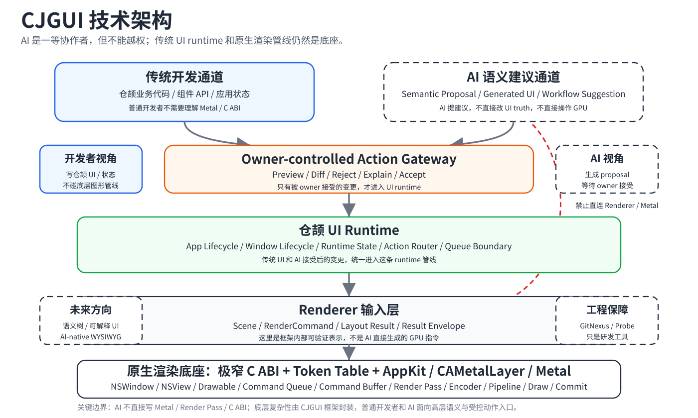

# CJGUI 项目入口

最后更新：2026-06-21

CJGUI 是一个围绕仓颉语言（Cangjie）的原生 GUI runtime / framework 实验项目。
它的长期目标是探索一条上层尽量保持仓颉原生、底层通过极窄平台桥接接入窗口系统和渲染后端的桌面 GUI 路线：先把 runtime 语义、平台边界、渲染后端和验证链路拆清楚，再决定哪些能力值得进入稳定接口。

当前项目处于 `P1 runtime 受限实现 / renderer real backend shell runway`。仓库已经完成 macOS AppKit / Metal smoke、主线程 UI message queue、自动化 GUI 验证、用户可见窗口截图验证和 frame hash 可行性等实验链路；`runtime/cjgui` 也已经从最小 skeleton 推进到 app / window lifecycle、runtime state、Action Router、Queue boundary、Renderer backend shell / backend adapter preview 和 AI-generated UI demo owner-controlled dry-run / shared component action-state-render bridge / checkable demo surface runtime probe runway 的一组 internal-only owner files。

这还不是可用的 GUI 框架，也不提供稳定 public API。现阶段更像一个有严格边界和审计记录的系统编程实验室：已经把 app lifecycle、window lifecycle、platform adapter、runtime state、Action Router、handoff、queue boundary、renderer admission 和 real backend shell 的 stop-line 逐步讲清楚，但仍刻意不越线到真实 GPU submission、真实 render execution、public C ABI 或稳定 toolkit surface。

## 技术架构

这张图只表达当前 CJGUI 的主线方向：上层保持仓颉原生和 AI-native 协作边界，底层先以 macOS AppKit / Metal 打通第一条可验证渲染链路；虚线部分是未来表达层、跨平台层和 AI 工具链雷达，不代表当前已经提供稳定 public API。

UI 框架完整性方向尺见 [CJGUI_UI_FRAMEWORK_COMPLETENESS_CRITERIA.md](/Users/jiangxuanyang/Desktop/cangjie/docs/core/CJGUI_UI_FRAMEWORK_COMPLETENESS_CRITERIA.md)。它用于提醒后续执行者：Renderer 是地基，最终验收仍是能写真实应用、能处理输入/状态/样式，并让 AI 以结构化语义参与 UI 生成和修改；该文档不改变当前 Renderer runway，也不新增硬 gate。

## 当前推进到哪里

本节只保留当前快照和可追溯 evidence map。自动化执行默认读取最新 bullet、最近 report / compact manifest 与当前 next opening；下面的旧阶段长链只在排查冲突、追溯 owner / truth / stop-line 或确认路线来源时按需读取。

最新指针：CJGUI minimal UI framework 当前最高价值 next opening 是 `P1 CJGUI shared demo_support commit/readback assertion contract for owner-local result checks`；Renderer canonical endpoint 仍是 `CjguiInternalRendererStage892ComponentCommitApiRuntimeManagerReadiness`，Renderer next opening 仍是 `stage893_component_commit_api_owner_local_commit_bridge_after_stage892`。

- Renderer display-chain recovery 复核已完成：[drawable texture lifetime implementation recovery decision](/Users/jiangxuanyang/Desktop/cangjie/docs/plans/2026-05-15-p1-renderer-drawable-texture-lifetime-implementation-recovery-decision.md)、[closure](/Users/jiangxuanyang/Desktop/cangjie/docs/plans/2026-05-15-p1-internal-renderer-drawable-texture-lifetime-implementation-recovery-closure-review.md) 与 [manifest](/Users/jiangxuanyang/Desktop/cangjie/docs/plans/2026-05-15-p1-renderer-drawable-texture-lifetime-implementation-recovery-manifest.md) 在 2026-06-21 复核后仍选择 A：production drawable lifetime 暂停，isolated visible-window / no-present `nextDrawable` 只保留为 feasibility evidence，不升格为 production runtime truth。当前不新增 production drawable acquire / release、color attachment、encoder、present、render 或 renderer state write；display 链唯一后续入口固定为 `P1 internal Renderer visible-window production harness preflight decision`。

- CJGUI shared demo_support commit action route catalog 已完成：[commit action route catalog report](/Users/jiangxuanyang/Desktop/cangjie/docs/plans/2026-06-21-p1-cjgui-shared-demo-support-commit-action-route-catalog-report.md)，接续 [component action route catalog report](/Users/jiangxuanyang/Desktop/cangjie/docs/plans/2026-06-21-p1-cjgui-shared-demo-support-component-action-route-catalog-report.md)。新增 `CjguiExperimentalDemoCommitActionRoute` 与 `CjguiExperimentalDemoCommitActionRouteCatalog`，当前 10 个独立 runnable demo 都通过 `commitRouteCatalog.*` 获取 owner-local commit route，并调用 `commitHarness.commitComponentActionRoute(...)` / `commitHarness.resultMatchesRoute(...)`。aggregate verifier 实际编译并运行 10 个 demo binary，回显 `cjgui_shared_demo_commit_action_route_usage_count=10`、`cjgui_shared_demo_commit_action_route_match_usage_count=10`、`cjgui_shared_demo_commit_action_route_catalog_usage_count=10` 与 `cjgui_shared_demo_direct_commit_component_action_string_call_retired=true`。该切片不新增 public C ABI，不写 `runtime_state.cj` / renderer state，不改变 Renderer canonical tail。

- CJGUI shared demo_support component action route catalog 已完成：[component action route catalog report](/Users/jiangxuanyang/Desktop/cangjie/docs/plans/2026-06-21-p1-cjgui-shared-demo-support-component-action-route-catalog-report.md)，接续 [component action route value model report](/Users/jiangxuanyang/Desktop/cangjie/docs/plans/2026-06-21-p1-cjgui-shared-demo-support-component-action-route-value-model-report.md)。新增 `CjguiExperimentalDemoComponentActionRouteCatalog`，当前 10 个独立 runnable demo 都通过 `routeCatalog.*` 获取 component/action route value，demo 侧 direct `CjguiExperimentalDemoComponentActionRoute("...", "...")` 构造已退役。aggregate verifier 实际编译并运行 10 个 demo binary，回显 `cjgui_shared_demo_component_action_route_catalog=CjguiExperimentalDemoComponentActionRouteCatalog`、`cjgui_shared_demo_component_action_route_catalog_usage_count=41` 与 `cjgui_shared_demo_direct_component_action_route_constructor_retired=true`。该切片不新增 public C ABI，不写 `runtime_state.cj` / renderer state，不改变 Renderer canonical tail。

- CJGUI shared demo_support semantic interaction/state evidence value model 已完成：[semantic interaction/state evidence value model report](/Users/jiangxuanyang/Desktop/cangjie/docs/plans/2026-06-21-p1-cjgui-shared-demo-support-semantic-interaction-state-evidence-value-model-report.md)。新增 `CjguiExperimentalDemoComponentInteractionEvidence`、`CjguiExperimentalDemoStateReadbackEvidence` 与 `CjguiExperimentalDemoOwnerLocalWriteReadbackEvidence`，并让 `CjguiExperimentalDemoEvidenceSectionBuilder` 通过 `addInteractionEvidence(...)`、`addStateReadbackEvidence(...)` 与 `addOwnerLocalWriteReadbackEvidence(...)` 消费 typed value。当前 10 个独立 runnable demo 全部使用 typed component interaction evidence，9 个 demo 使用 typed state readback evidence，Todo 使用 typed owner-local write readback evidence；aggregate verifier 实际编译并运行 10 个 demo binary，回显 `cjgui_shared_demo_semantic_interaction_evidence_demo_count=10`、`cjgui_shared_demo_semantic_state_readback_evidence_demo_count=9`、`cjgui_shared_demo_semantic_owner_local_write_evidence_demo_count=1` 与 `cjgui_shared_demo_string_interaction_state_fact_preset_calls_retired=true`。该切片不新增 public C ABI，不写 `runtime_state.cj` / renderer state，不改变 Renderer canonical tail。

- CJGUI shared demo_support semantic domain evidence value model 已完成：[semantic domain evidence value model report](/Users/jiangxuanyang/Desktop/cangjie/docs/plans/2026-06-21-p1-cjgui-shared-demo-support-semantic-domain-evidence-value-model-report.md)。新增 `CjguiExperimentalDemoLayoutEvidence`、`CjguiExperimentalDemoControlsEvidence`、`CjguiExperimentalDemoServedDemoEvidence`、`CjguiExperimentalDemoServedDemosEvidence` 与 `CjguiExperimentalDemoReusableComponentEvidence`，并让 `CjguiExperimentalDemoEvidenceSectionBuilder` 通过 `addLayoutEvidence(...)`、`addControlsEvidence(...)`、`addServedDemoEvidence(...)`、`addServedDemosEvidence(...)` 与 `addReusableComponentEvidence(...)` 消费 typed value。Settings、Chat、FileBrowser、AI-generated UI、Shared demo harness、Shared multi-demo harness 与 Reusable component contract 已从字符串 domain preset 迁移到 semantic evidence object；aggregate verifier 实际编译并运行 10 个 demo binary，回显 `cjgui_shared_demo_semantic_layout_evidence_demo_count=4`、`cjgui_shared_demo_semantic_served_evidence_demo_count=2`、`cjgui_shared_demo_semantic_reuse_evidence_demo_count=1` 与 `cjgui_shared_demo_string_domain_fact_preset_calls_retired=true`。该切片不新增 public C ABI，不写 `runtime_state.cj` / renderer state，不改变 Renderer canonical tail。

- CJGUI shared demo_support domain evidence presets 已完成：[domain evidence presets report](/Users/jiangxuanyang/Desktop/cangjie/docs/plans/2026-06-21-p1-cjgui-shared-demo-support-domain-evidence-presets-report.md)。`CjguiExperimentalDemoEvidenceSectionBuilder` 新增 `addLayoutFact(...)`、`addControlsFact(...)`、`addServedDemoFact(...)`、`addServedDemosFacts(...)` 与 `addReusableComponentFacts(...)`；Settings、Chat、FileBrowser、AI-generated UI、Shared demo harness、Shared multi-demo harness 与 Reusable component contract 已通过 shared domain preset 写入 layout / controls / served / reuse facts。aggregate verifier 实际编译并运行 10 个 demo binary，回显 `cjgui_shared_demo_domain_fact_presets=CjguiExperimentalDemoEvidenceSectionBuilder`、`cjgui_shared_demo_domain_fact_preset_layout_demo_count=4`、`cjgui_shared_demo_domain_fact_preset_served_demo_count=2`、`cjgui_shared_demo_domain_fact_preset_reuse_demo_count=1` 与 `cjgui_shared_demo_direct_domain_fact_wiring_retired=true`。该切片不新增 public C ABI，不写 `runtime_state.cj` / renderer state，不改变 Renderer canonical tail。

- CJGUI shared demo_support evidence fact bundle presets 已完成：[evidence fact bundle presets report](/Users/jiangxuanyang/Desktop/cangjie/docs/plans/2026-06-21-p1-cjgui-shared-demo-support-evidence-fact-bundle-presets-report.md)。`CjguiExperimentalDemoEvidenceSectionBuilder` 新增 `addInteractionFact(...)`、`addStateReadbackFacts(...)` 与 `addOwnerLocalWriteReadbackFacts(...)`；当前全部 10 个 runnable demo 已通过 shared preset 写入 interaction 与 readback facts，demo-local direct `evidenceBuilder.addTextFact("interaction", ...)` / `evidenceBuilder.addBoolFact("state_readback", ...)` / `evidenceBuilder.addBoolFact("owner_local_write_readback", ...)` 已退役。aggregate verifier 实际编译并运行 10 个 demo binary，回显 `cjgui_shared_demo_evidence_fact_presets=CjguiExperimentalDemoEvidenceSectionBuilder`、`cjgui_shared_demo_evidence_fact_preset_demo_count=10`、`cjgui_shared_demo_interaction_fact_preset_shared=true`、`cjgui_shared_demo_state_readback_fact_bundle_shared=true` 与 `cjgui_shared_demo_direct_interaction_state_readback_fact_calls_retired=true`。该切片不新增 public C ABI，不写 `runtime_state.cj` / renderer state，不改变 Renderer canonical tail；已由 domain evidence presets 接续。

- CJGUI shared demo_support evidence section builder 已完成：[evidence section builder report](/Users/jiangxuanyang/Desktop/cangjie/docs/plans/2026-06-21-p1-cjgui-shared-demo-support-evidence-section-builder-report.md)。新增 `CjguiExperimentalDemoEvidenceSectionBuilder`，把 evidence profile 创建、业务 fact 追加与 typed section 创建下沉到 shared `demo_support`；当前 10 个 runnable demo 已全部改为 `evidenceBuilder.add*Fact(...)` + `evidenceBuilder.buildSection(...)`，不再直接 new `CjguiExperimentalDemoEvidenceProfile` 或 `CjguiExperimentalDemoEvidenceSection`。aggregate verifier 实际编译并运行 10 个 demo binary，回显 `cjgui_shared_demo_evidence_section_builder=CjguiExperimentalDemoEvidenceSectionBuilder`、`cjgui_shared_demo_evidence_section_builder_demo_count=10`、`cjgui_shared_demo_evidence_section_builder_profile_run_assembly_shared=true` 与 `cjgui_shared_demo_direct_profile_and_section_constructors_retired=true`。该切片不新增 public C ABI，不写 `runtime_state.cj` / renderer state，不改变 Renderer canonical tail；已由 evidence fact bundle presets 接续。

- CJGUI shared demo_support typed evidence section 合同已完成：[typed evidence section report](/Users/jiangxuanyang/Desktop/cangjie/docs/plans/2026-06-21-p1-cjgui-shared-demo-support-typed-evidence-section-contract-report.md)。新增 `CjguiExperimentalDemoEvidenceSection`，并让 `CjguiExperimentalDemoEvidencePresenter.printEvidenceSection(...)` 统一编排 evidence profile、shared demo output、component/action session、commit result、commit harness 与 run result；当前 10 个 runnable demo 已全部迁移到 shared typed section，不再保留 direct profile/proof 尾部调用。aggregate verifier 实际编译并运行 10 个 demo binary，回显 `cjgui_shared_demo_evidence_section=CjguiExperimentalDemoEvidenceSection`、`cjgui_shared_demo_evidence_section_demo_count=10`、`cjgui_shared_demo_evidence_section_typed_execution_batching_shared=true` 与 `cjgui_shared_demo_direct_profile_and_proof_calls_retired=true`。该切片不新增 public C ABI，不写 `runtime_state.cj` / renderer state，不改变 Renderer canonical tail。下一步转向 `P1 CJGUI shared demo_support evidence section builder for profile/run assembly`。

- CJGUI shared demo_support demo evidence profile 批量合同已完成：[evidence profile batching report](/Users/jiangxuanyang/Desktop/cangjie/docs/plans/2026-06-21-p1-cjgui-shared-demo-support-demo-evidence-profile-contract-batching-report.md)。新增 `CjguiExperimentalDemoEvidenceProfile`，并让 `CjguiExperimentalDemoEvidencePresenter.printEvidenceProfile(...)` 批量渲染 demo identity、static facts、status transition、text facts 与 bool facts；当前 10 个 runnable demo 已全部迁移到 shared profile，不再保留 demo-local direct presenter fact sequence。aggregate verifier 实际编译并运行 10 个 demo binary，回显 `cjgui_shared_demo_evidence_profile=CjguiExperimentalDemoEvidenceProfile`、`cjgui_shared_demo_evidence_profile_demo_count=10`、`cjgui_shared_demo_evidence_profile_business_fact_batching_shared=true` 与 `cjgui_shared_demo_direct_presenter_fact_sequence_retired=true`。该切片不新增 public C ABI，不写 `runtime_state.cj` / renderer state，不改变 Renderer canonical tail。下一步转向 `P1 CJGUI shared demo_support typed evidence section contract for component/action/readback batching`。

- CJGUI shared demo_support demo evidence presenter 收敛已完成：[evidence presenter consolidation report](/Users/jiangxuanyang/Desktop/cangjie/docs/plans/2026-06-21-p1-cjgui-shared-demo-support-demo-evidence-presenter-consolidation-report.md)。新增 `CjguiExperimentalDemoEvidencePresenter`，当前 10 个 runnable demo 都通过 shared presenter 统一编排 metadata / business snapshot / proof / run result stdout evidence，不再保留 demo-local direct reporter wiring。aggregate verifier 实际编译并运行 10 个 demo binary，并回显 `cjgui_shared_demo_evidence_presenter=CjguiExperimentalDemoEvidencePresenter`、`cjgui_shared_demo_evidence_presenter_demo_count=10`、`cjgui_shared_demo_evidence_presenter_output_orchestration_shared=true` 与 `cjgui_shared_demo_direct_reporter_wiring_retired=true`。该切片不新增 public C ABI，不写 `runtime_state.cj` / renderer state，不改变 Renderer canonical tail；该入口已由 evidence profile batching 接续。

- CJGUI shared demo_support demo metadata reporter 收敛已完成：[metadata reporter consolidation report](/Users/jiangxuanyang/Desktop/cangjie/docs/plans/2026-06-20-p1-cjgui-shared-demo-support-demo-metadata-reporter-consolidation-report.md)。新增 `CjguiExperimentalDemoMetadataReporter`，当前 10 个 runnable demo 都通过 shared reporter 渲染 `demo=...` identity 行；Settings 额外通过 shared reporter 渲染 `main_declared` 与 `deterministic_output` 静态 runnable facts，不再保留 demo-local metadata `println` 模板。aggregate verifier 实际编译并运行 10 个 demo binary，并回显 `cjgui_shared_demo_metadata_reporter=CjguiExperimentalDemoMetadataReporter`、`cjgui_shared_demo_metadata_reporter_demo_count=10`、`cjgui_shared_demo_metadata_output_rendering_shared=true` 与 `cjgui_shared_demo_local_metadata_println_retired=true`。该切片不新增 public C ABI，不写 `runtime_state.cj` / renderer state，不改变 Renderer canonical tail；该入口已由 evidence presenter 收敛接续。

- CJGUI shared demo_support business snapshot reporter 收敛已完成：[business snapshot reporter consolidation report](/Users/jiangxuanyang/Desktop/cangjie/docs/plans/2026-06-20-p1-cjgui-shared-demo-support-business-snapshot-reporter-consolidation-report.md)。新增 `CjguiExperimentalDemoBusinessSnapshotReporter`，当前 10 个 runnable demo 都通过 shared reporter 渲染 status transition、business text facts 与 readback bool facts，不再保留 demo-local `status_*` / `state_*` / `summary_*` / `served_demo(s)` / `reused_demos` / `owner_local_write_readback` / `public_api_available` 业务快照 `println` 模板。aggregate verifier 实际编译并运行 10 个 demo binary，并回显 `cjgui_shared_demo_business_snapshot_reporter=CjguiExperimentalDemoBusinessSnapshotReporter`、`cjgui_shared_demo_business_snapshot_reporter_demo_count=10`、`cjgui_shared_demo_business_snapshot_output_rendering_shared=true` 与 `cjgui_shared_demo_local_business_snapshot_println_retired=true`。该切片不新增 public C ABI，不写 `runtime_state.cj` / renderer state，不改变 Renderer canonical tail。该入口已由 metadata reporter 收敛接续。

- CJGUI shared demo_support demo proof reporter 收敛已完成：[proof reporter consolidation report](/Users/jiangxuanyang/Desktop/cangjie/docs/plans/2026-06-20-p1-cjgui-shared-demo-support-demo-proof-reporter-consolidation-report.md)。新增 `CjguiExperimentalDemoProofReporter.printSharedPrimitiveProof(...)`，当前 10 个 runnable demo 都通过 shared reporter 渲染 public API、component action、shared UI state 与 commit/readback/not-published stdout proof，不再保留 demo-local `public_api_*` / `shared_support_*` / `shared_component_action_*` / `shared_commit_*` proof `println` 模板。aggregate verifier 实际编译并运行 10 个 demo binary，并回显 `cjgui_shared_demo_proof_reporter=CjguiExperimentalDemoProofReporter`、`cjgui_shared_demo_proof_reporter_demo_count=10`、`cjgui_shared_demo_public_component_commit_output_rendering_shared=true` 与 `cjgui_shared_demo_local_shared_proof_println_retired=true`。该切片不新增 public C ABI，不写 `runtime_state.cj` / renderer state，不改变 Renderer canonical tail。该入口已由 business snapshot reporter 收敛接续。

- CJGUI shared demo_support demo run result reporter 输出渲染清理已完成：[reporter cleanup report](/Users/jiangxuanyang/Desktop/cangjie/docs/plans/2026-06-20-p1-cjgui-shared-demo-support-demo-run-result-reporter-output-rendering-cleanup-report.md)。新增 `CjguiExperimentalDemoRunResultReporter.printRunResult(...)`，当前 10 个 runnable demo 都通过 shared reporter 渲染 `shared_run_harness` / `shared_run_result` / `shared_run_readback` / `shared_run_not_published` stdout proof，不再保留 demo-local `println("cjgui ... shared_run_...")` 模板。aggregate verifier 实际编译并运行 10 个 demo binary，并回显 `cjgui_shared_demo_run_result_reporter=CjguiExperimentalDemoRunResultReporter`、`cjgui_shared_demo_run_result_reporter_demo_count=10`、`cjgui_shared_demo_run_result_output_rendering_shared=true` 与 `cjgui_shared_demo_run_local_shared_run_println_retired=true`。该切片不新增 public C ABI，不写 `runtime_state.cj` / renderer state，不改变 Renderer canonical tail。下一步转向 `P1 CJGUI shared demo_support demo proof reporter consolidation for commit/public API evidence cleanup`。

- CJGUI shared demo_support demo run harness API 形态清理已完成：[api shape cleanup report](/Users/jiangxuanyang/Desktop/cangjie/docs/plans/2026-06-20-p1-cjgui-shared-demo-support-demo-run-harness-api-shape-cleanup-report.md)。`CjguiExperimentalDemoRunHarness.finishCommittedSessionRun(...)` 现在直接消费 `CjguiExperimentalDemoComponentActionSession`、`CjguiExperimentalDemoOutput` 与 `CjguiExperimentalDemoCommitResult`，当前全部 10 个 runnable demo 不再保留 demo-local `buildRunResult` wrapper。aggregate verifier 实际编译并运行 10 个 demo binary，回显 `cjgui_shared_demo_run_harness_boilerplate_reduced=true`、`cjgui_shared_demo_run_session_api=finishCommittedSessionRun`、`cjgui_shared_demo_run_demo_count=10`、`cjgui_shared_demo_run_binary_execution=true`、`cjgui_shared_demo_run_readback=true` 与 `cjgui_shared_demo_run_not_published=true`；10 个 focused demo verifier 与 `cjpm build --skip-script` 复跑通过。该切片不新增 public C ABI，不写 `runtime_state.cj` / renderer state，不改变 Renderer canonical tail；该入口已由 reporter cleanup 接续。

- 当前最新 Renderer stage889-892 minimal public component commit API readiness -> experimental public API declaration -> demo consumption -> shared runtime manager 收敛包已完成，自动化记录见 [stage report 892](/Users/jiangxuanyang/Desktop/cangjie/docs/plans/2026-06-17-p1-renderer-automation-stage-report-892.md)。stage889 消费 stage888 accepted commit publication runtime manager 并生成 minimal public component commit API readiness、experimental descriptor、compatibility ledger、rollback boundary 与 not-published receipt；stage890 新增唯一 experimental Cangjie public surface `cjguiExperimentalComponentCommitApiReady()`；stage891 让 Todo/settings/AI-generated settings/chat composer/file browser 五类 demo surface 消费该 API；stage892 抽出 shared component commit API runtime manager/runtime contract/execution receipt contract、common executor、demo runtime bridge 与五类 runtime surfaces。Fresh chain 固定 `shared_component_commit_api_runtime_manager_materialized=true`、`component_commit_api_runtime_contract_materialized=true`、`component_commit_api_execution_receipt_contract_materialized=true`、`file_browser_component_commit_api_runtime_surface_materialized=true`、`common_component_commit_api_executor_materialized=true`、`component_commit_api_demo_runtime_bridge_materialized=true`、`future_per_demo_component_commit_api_template_need_reduced=true`、`public_surface_cjguiExperimentalComponentCommitApiReady_materialized=true`、`new_public_surface_added=true`、`stable_public_api_added=false`、`public_c_abi_added=false`、`owner_acceptance_granted=false`、`owner_acceptance_decision_committed=false`、`state_store_commit_published=false`、`state_store_write_executed=false`、`visibility_publication_admitted=false`、`visibility_published=false`、`renderer_submission=false`、`renderer_state_write=false`、`runtime_state_write=false`、`native_bridge_expansion=false`。当前 endpoint 是 `CjguiInternalRendererStage892ComponentCommitApiRuntimeManagerReadiness` / `cjguiInternalExecuteDefaultRendererStage892ComponentCommitApiRuntimeManagerDraft()`；当前 next opening 是 `stage893_component_commit_api_owner_local_commit_bridge_after_stage892`。

- CJGUI 最小 UI framework 转场证据已更新：[domain evidence presets report](/Users/jiangxuanyang/Desktop/cangjie/docs/plans/2026-06-21-p1-cjgui-shared-demo-support-domain-evidence-presets-report.md)、[evidence fact bundle presets report](/Users/jiangxuanyang/Desktop/cangjie/docs/plans/2026-06-21-p1-cjgui-shared-demo-support-evidence-fact-bundle-presets-report.md)、[evidence section builder report](/Users/jiangxuanyang/Desktop/cangjie/docs/plans/2026-06-21-p1-cjgui-shared-demo-support-evidence-section-builder-report.md)、[typed evidence section report](/Users/jiangxuanyang/Desktop/cangjie/docs/plans/2026-06-21-p1-cjgui-shared-demo-support-typed-evidence-section-contract-report.md)、[shared demo_support demo evidence profile batching report](/Users/jiangxuanyang/Desktop/cangjie/docs/plans/2026-06-21-p1-cjgui-shared-demo-support-demo-evidence-profile-contract-batching-report.md)、[shared demo_support demo evidence presenter consolidation report](/Users/jiangxuanyang/Desktop/cangjie/docs/plans/2026-06-21-p1-cjgui-shared-demo-support-demo-evidence-presenter-consolidation-report.md)、[shared demo_support demo metadata reporter consolidation report](/Users/jiangxuanyang/Desktop/cangjie/docs/plans/2026-06-20-p1-cjgui-shared-demo-support-demo-metadata-reporter-consolidation-report.md)、[shared demo_support business snapshot reporter consolidation report](/Users/jiangxuanyang/Desktop/cangjie/docs/plans/2026-06-20-p1-cjgui-shared-demo-support-business-snapshot-reporter-consolidation-report.md)、[shared demo_support demo proof reporter consolidation report](/Users/jiangxuanyang/Desktop/cangjie/docs/plans/2026-06-20-p1-cjgui-shared-demo-support-demo-proof-reporter-consolidation-report.md)、[shared demo_support demo run result reporter cleanup report](/Users/jiangxuanyang/Desktop/cangjie/docs/plans/2026-06-20-p1-cjgui-shared-demo-support-demo-run-result-reporter-output-rendering-cleanup-report.md)、[shared demo_support demo run harness API shape cleanup report](/Users/jiangxuanyang/Desktop/cangjie/docs/plans/2026-06-20-p1-cjgui-shared-demo-support-demo-run-harness-api-shape-cleanup-report.md)、[shared demo_support demo run harness coverage expansion report](/Users/jiangxuanyang/Desktop/cangjie/docs/plans/2026-06-20-p1-cjgui-shared-demo-support-demo-run-harness-coverage-expansion-report.md)、[shared demo_support demo run harness first slice report](/Users/jiangxuanyang/Desktop/cangjie/docs/plans/2026-06-20-p1-cjgui-shared-demo-support-demo-run-harness-first-slice-report.md) 与 [demo 进度看板](/Users/jiangxuanyang/Desktop/cangjie/docs/plans/CJGUI_DEMO_PROGRESS.md)。Shared demo_support 的 [runtime_cjgui_experimental_demo_evidence_section_builder.cj](/Users/jiangxuanyang/Desktop/cangjie/runtime/cjgui/src/demo_support/runtime_cjgui_experimental_demo_evidence_section_builder.cj) / `CjguiExperimentalDemoEvidenceSectionBuilder` 现在为当前全部 10 个 runnable demo 统一组装 profile、interaction / state readback fact presets、layout / controls / served / reuse domain fact presets 与 typed section，并由 [runtime_cjgui_experimental_demo_evidence_presenter.cj](/Users/jiangxuanyang/Desktop/cangjie/runtime/cjgui/src/demo_support/runtime_cjgui_experimental_demo_evidence_presenter.cj) / `CjguiExperimentalDemoEvidencePresenter.printEvidenceSection(...)` 统一渲染；demo-local direct profile/section constructor、direct interaction/readback wiring 与 direct domain fact wiring 已退役。当前不新增 public C ABI，不写 `runtime_state.cj` / renderer state，不替代 Renderer canonical tail。当前下一步是 `P1 CJGUI shared demo_support semantic evidence value model for layout/control/served/reuse facts`。

- 上一段 Renderer stage885-888 owner-local accepted commit publication preflight -> rollback/not-published boundary -> demo-host surface -> shared publication runtime manager 收敛包已完成，自动化记录见 [stage report 888](/Users/jiangxuanyang/Desktop/cangjie/docs/plans/2026-06-17-p1-renderer-automation-stage-report-888.md)。当前 endpoint 已由 stage889-892 接续；stage889 opening 已关闭。

- 上一段 Renderer stage881-884 owner-local accepted commit inspection gate -> application plan -> demo-host surface -> shared accepted commit runtime manager 收敛包已完成，自动化记录见 [stage report 884](/Users/jiangxuanyang/Desktop/cangjie/docs/plans/2026-06-17-p1-renderer-automation-stage-report-884.md)。当前 endpoint 已由 stage885-888 接续；stage885 opening 已关闭。

- 上一段 Renderer stage877-880 owner-local commit acceptance gate -> decision reducer -> demo-host surface -> shared acceptance runtime manager 收敛包已完成，自动化记录见 [stage report 880](/Users/jiangxuanyang/Desktop/cangjie/docs/plans/2026-06-17-p1-renderer-automation-stage-report-880.md)。当前 endpoint 已由 stage881-884 接续；stage881 opening 已关闭。

- 上一段 Renderer stage873-876 owner-local state-store commit first-slice proof -> rollback ledger -> demo-host surface -> shared owner-local commit runtime manager 收敛包已完成，自动化记录见 [stage report 876](/Users/jiangxuanyang/Desktop/cangjie/docs/plans/2026-06-17-p1-renderer-automation-stage-report-876.md)。当前 endpoint 已由 stage877-880 接续；stage877 opening 已关闭。

- 上一段 Renderer stage869-872 text-input commit state-store public API readiness -> admission/no-write receipt -> demo inspection surface -> shared state-store public API commit runtime manager 收敛包已完成，自动化记录见 [stage report 872](/Users/jiangxuanyang/Desktop/cangjie/docs/plans/2026-06-17-p1-renderer-automation-stage-report-872.md)。当前 endpoint 已由 stage873-876 接续；stage873 opening 已关闭。

- 上一段 Renderer stage865-868 text-input commit public API consumption contract -> compatibility ledger -> demo proof surface -> shared public API consumption runtime manager 收敛包已完成，自动化记录见 [stage report 868](/Users/jiangxuanyang/Desktop/cangjie/docs/plans/2026-06-17-p1-renderer-automation-stage-report-868.md)。当前 endpoint 已由 stage869-872 接续；stage869 opening 已关闭。

- 上一段 Renderer stage861-864 text-input owner acceptance review gate -> acceptance decision reducer -> demo-host acceptance surface -> shared owner acceptance runtime manager 收敛包已完成，自动化记录见 [stage report 864](/Users/jiangxuanyang/Desktop/cangjie/docs/plans/2026-06-17-p1-renderer-automation-stage-report-864.md)。当前 endpoint 已由 stage865-868 接续；stage865 opening 已关闭。

- 上一段 Renderer stage857-860 owner-local text-input commit dry-run -> state-store commit snapshot -> demo-host result surface -> shared owner-local commit runtime manager 收敛包已完成，自动化记录见 [stage report 860](/Users/jiangxuanyang/Desktop/cangjie/docs/plans/2026-06-17-p1-renderer-automation-stage-report-860.md)。当前 endpoint 已由 stage861-864 接续；stage861 opening 已关闭。

- 上一段 Renderer stage853-856 text-input commit preflight -> rollback/not-published receipt -> demo-host commit inspection surface -> shared commit runtime manager 收敛包已完成，自动化记录见 [stage report 856](/Users/jiangxuanyang/Desktop/cangjie/docs/plans/2026-06-16-p1-renderer-automation-stage-report-856.md)。当前 endpoint 已由 stage857-860 接续；stage857 opening 已关闭。

- 上一段 Renderer stage849-852 publishable state text input state delta -> RenderCommand refresh preview -> demo result surface -> shared state-update render bridge runtime manager 收敛包已完成，自动化记录见 [stage report 852](/Users/jiangxuanyang/Desktop/cangjie/docs/plans/2026-06-12-p1-renderer-automation-stage-report-852.md)。stage849 消费 stage848 shared text-input runtime manager，生成 text insertion / selection replacement / caret-selection / composition 四类 owner-local state delta dry-run candidate 与 rollback token；stage850 消费 stage849 state delta，生成 text value / caret-selection / composition underline RenderCommand refresh preview、result refresh receipt 与 rollback receipt；stage851 消费 stage850 refresh preview，接入 Todo/settings/AI-generated settings/chat composer/file browser 五类 demo result surface、host inspection rows 与 semantic diff receipt；stage852 消费 stage851 result surface，抽出 shared text-input state-update render bridge runtime manager/runtime contract/execution receipt contract、`text_input_state_delta_render_result_runtime` cycle order 与五类 demo runtime surfaces。Fresh chain 固定 `stage851_publishable_state_text_input_demo_result_surface_consumed=true`、`stage850_publishable_state_text_input_render_command_refresh_preview_consumed_transitively=true`、`stage849_publishable_state_text_input_state_update_render_bridge_consumed_transitively=true`、`stage848_publishable_state_text_input_runtime_manager_consumed_transitively=true`、`shared_text_input_state_update_render_bridge_runtime_manager_materialized=true`、`text_input_state_update_render_bridge_runtime_contract_materialized=true`、`text_input_state_update_render_bridge_execution_receipt_contract_materialized=true`、`file_browser_text_input_state_update_runtime_surface_materialized=true`、`future_per_demo_text_input_state_update_template_need_reduced=true`、`text_input_pipeline_execution=false`、`text_mutation=false`、`state_update_committed=false`、`renderer_submission=false`、`renderer_state_write=false`、`runtime_state_write=false`、`new_public_surface_added=false`、`stable_public_api_added=false`、`public_c_abi_added=false`、`native_bridge_expansion=false`。当前 endpoint 已由 stage853-856 接续；stage853 opening 已关闭。

- 上一段 Renderer stage845-848 publishable state text input adapter -> composition preview -> demo text-input surface -> shared text-input runtime manager 收敛包已完成，自动化记录见 [stage report 848](/Users/jiangxuanyang/Desktop/cangjie/docs/plans/2026-06-10-p1-renderer-automation-stage-report-848.md)。stage845 消费 stage844 text runtime manager 与 stage573 text-input execution contract，生成 normalized keyboard text、caret movement、selection replacement 与 composition preedit intent adapter；stage846 消费 stage845 readiness，生成 text insertion / selection replacement / caret movement / composition commit-cancel preview、rollback snapshot 与 explain receipt；stage847 消费 stage846 readiness，接入 Todo/settings/AI-generated settings/chat composer/file browser 五类 text-input preview/result surfaces、host inspection rows 与 input feedback clear preview；stage848 消费 stage847 surface，抽出 shared publishable text-input runtime manager/runtime contract/execution receipt contract、`publishable_state_text_input_runtime` cycle order 与五类 demo runtime surfaces。Fresh chain 固定 `stage847_publishable_state_text_input_demo_surface_consumed=true`、`stage846_publishable_state_text_input_composition_preview_consumed_transitively=true`、`stage845_publishable_state_text_input_adapter_consumed_transitively=true`、`stage844_publishable_state_text_runtime_manager_consumed_transitively=true`、`shared_publishable_text_input_runtime_manager_materialized=true`、`publishable_text_input_runtime_contract_materialized=true`、`publishable_text_input_execution_receipt_contract_materialized=true`、`file_browser_text_input_runtime_surface_materialized=true`、`future_per_demo_text_input_template_need_reduced=true`、`text_input_pipeline_execution=false`、`text_mutation=false`、`state_update_committed=false`、`renderer_submission=false`、`renderer_state_write=false`、`runtime_state_write=false`、`new_public_surface_added=false`、`stable_public_api_added=false`、`public_c_abi_added=false`、`native_bridge_expansion=false`。当前 endpoint 已由 stage849-852 接续；stage849 opening 已关闭。

- 上一段 Renderer stage841-844 publishable state text model -> text edit preview -> demo text surface -> shared text runtime manager 收敛包已完成，自动化记录见 [stage report 844](/Users/jiangxuanyang/Desktop/cangjie/docs/plans/2026-06-10-p1-renderer-automation-stage-report-844.md)。当前 endpoint 已由 stage845-848 接续；stage845 opening 已关闭。

- 上一段 Renderer stage837-840 publishable state focus manager -> focus movement preview -> demo focus surface -> shared focus runtime manager 收敛包已完成，自动化记录见 [stage report 840](/Users/jiangxuanyang/Desktop/cangjie/docs/plans/2026-06-10-p1-renderer-automation-stage-report-840.md)。当前 endpoint 已由 stage841-844 接续；stage841 opening 已关闭。

- 上一段 Renderer stage833-836 publishable state layout/style resolver -> text/focus measurement plan -> demo surface -> shared layout/style runtime manager 收敛包已完成，自动化记录见 [stage report 836](/Users/jiangxuanyang/Desktop/cangjie/docs/plans/2026-06-10-p1-renderer-automation-stage-report-836.md)。当前 endpoint 已由 stage837-840 接续；stage837 opening 已关闭。

- 上一段 Renderer stage829-832 component state-store publishable state model -> slot value model -> commit candidate rollback snapshot -> shared publishable runtime manager 收敛包已完成，自动化记录见 [stage report 832](/Users/jiangxuanyang/Desktop/cangjie/docs/plans/2026-06-10-p1-renderer-automation-stage-report-832.md)。当前 endpoint 已由 stage833-836 接续；stage833 opening 已关闭。

- 上一段 Renderer stage825-828 commit first-slice publication gate -> visibility rehearsal ledger -> demo-host publication preview/result surface -> shared publication runtime manager 收敛包已完成，自动化记录见 [stage report 828](/Users/jiangxuanyang/Desktop/cangjie/docs/plans/2026-06-09-p1-renderer-automation-stage-report-828.md)。当前 endpoint 已由 stage829-832 接续；stage829 opening 已关闭。

- 上一段 Renderer stage821-824 commit first-slice owner review gate -> review decision router -> demo-host owner review surface -> shared runtime manager 收敛包已完成，自动化记录见 [stage report 824](/Users/jiangxuanyang/Desktop/cangjie/docs/plans/2026-06-09-p1-renderer-automation-stage-report-824.md)。当前 endpoint 已由 stage825-828 接续；stage825 opening 已关闭。

- 上一段 Renderer stage817-820 commit first-slice host inspection lens -> inspection filter controller -> demo-host inspection surface -> shared runtime presenter 收敛包已完成，自动化记录见 [stage report 820](/Users/jiangxuanyang/Desktop/cangjie/docs/plans/2026-06-09-p1-renderer-automation-stage-report-820.md)。当前 endpoint 已由 stage821-824 接续；stage821 opening 已关闭。

- 上一段 Renderer stage813-816 preview component API state-store commit first-slice preflight -> dry-run executor -> demo-host surface -> shared runtime manager 收敛包已完成，自动化记录见 [stage report 816](/Users/jiangxuanyang/Desktop/cangjie/docs/plans/2026-06-09-p1-renderer-automation-stage-report-816.md)。当前 endpoint 已由 stage817-820 接续；stage817 opening 已关闭。

- 上一段 Renderer stage809-812 preview component API state-store commit acceptance rehearsal -> decision dry-run -> demo-host surface -> shared acceptance runtime manager 收敛包已完成，自动化记录见 [stage report 812](/Users/jiangxuanyang/Desktop/cangjie/docs/plans/2026-06-09-p1-renderer-automation-stage-report-812.md)。当前 endpoint 已由 stage813-816 接续；stage813 opening 已关闭。

- 当前最新 Renderer stage805-808 preview component API state-store commit review history -> time-travel rehearsal -> demo-host surface -> shared review-history runtime manager 收敛包已完成，自动化记录见 [stage report 808](/Users/jiangxuanyang/Desktop/cangjie/docs/plans/2026-06-09-p1-renderer-automation-stage-report-808.md)。stage805 消费 stage804 runtime manager，生成 commit review history ledger、semantic diff history entries、reviewer decision history entries、affected component history index、rollback diff history entry 与 filter descriptor；stage806 消费 stage805 readiness，生成 selected history entry、rollback time-travel snapshot、pre/post state preview 与 history replay receipt；stage807 消费 stage806 readiness，接入 Todo/settings/AI-generated settings/chat composer/file browser demo-host review-history preview/result surfaces；stage808 消费 stage807 surface，抽出 shared review-history runtime manager/runtime contract/execution receipt contract、`review_history_time_travel_demo_runtime` cycle order 与五类 demo runtime surfaces。Fresh chain 固定 `shared_review_history_runtime_manager_materialized=true`、`review_history_runtime_contract_materialized=true`、`review_history_execution_receipt_contract_materialized=true`、`file_browser_review_history_runtime_surface_materialized=true`、`future_per_demo_review_history_template_need_reduced=true`、`new_public_surface_added=false`、`stable_public_api_added=false`、`public_c_abi_added=false`、`owner_acceptance_granted=false`、`preview_component_api_commit_committed=false`、`action_dispatch=false`、`state_update_committed=false`、`visibility_publication_admitted=false`、`visibility_published=false`、`renderer_submission=false`、`renderer_state_write=false`、`runtime_state_write=false`、`native_bridge_expansion=false`。当前 endpoint 是 `CjguiInternalRendererStage808PreviewComponentApiStateStoreCommitReviewHistoryRuntimeManagerReadiness` / `cjguiInternalExecuteDefaultRendererStage808PreviewComponentApiStateStoreCommitReviewHistoryRuntimeManagerDraft()`；当前 next opening 是 `stage809_preview_component_api_state_store_commit_acceptance_rehearsal_after_stage808`。

- 上一段 Renderer stage801-804 preview component API state-store commit diff/explain -> review decision loop -> demo-host surface -> shared diff/explain runtime manager 收敛包已完成，自动化记录见 [stage report 804](/Users/jiangxuanyang/Desktop/cangjie/docs/plans/2026-06-09-p1-renderer-automation-stage-report-804.md)。当前 endpoint 已由 stage805-808 接续；stage805 opening 已关闭。

- 当前最新 Renderer stage797-800 preview component API state-store commit admission preview -> owner review checkpoint -> demo-host preview -> shared commit admission runtime executor 收敛包已完成，自动化记录见 [stage report 800](/Users/jiangxuanyang/Desktop/cangjie/docs/plans/2026-06-08-p1-renderer-automation-stage-report-800.md)。stage797 消费 stage796 runtime manager，生成 non-committing commit admission preview gate、owner-local policy matrix 与 text/focus/style/layout mutation admission routes；stage798 消费 stage797 readiness，生成 owner review checkpoint、rollback checkpoint selection、compatibility decision receipt、deprecation rollback note 与 explainable accept/reject/request-changes receipt；stage799 消费 stage798 readiness，接入 Todo/settings/AI-generated settings/chat composer/file browser demo-host preview/result surfaces；stage800 消费 stage799 surface，抽出 shared state-store commit admission runtime executor/runtime contract/execution receipt contract、`admission_preview_review_demo_runtime` cycle order 与五类 demo runtime surfaces。Fresh chain 固定 `shared_state_store_commit_admission_runtime_executor_materialized=true`、`state_store_commit_admission_runtime_contract_materialized=true`、`state_store_commit_admission_execution_receipt_contract_materialized=true`、`file_browser_commit_admission_runtime_surface_materialized=true`、`future_per_demo_commit_admission_template_need_reduced=true`、`new_public_surface_added=false`、`stable_public_api_added=false`、`public_c_abi_added=false`、`owner_acceptance_granted=false`、`preview_component_api_commit_committed=false`、`action_dispatch=false`、`state_update_committed=false`、`visibility_publication_admitted=false`、`visibility_published=false`、`renderer_submission=false`、`renderer_state_write=false`、`runtime_state_write=false`、`native_bridge_expansion=false`。当前 endpoint 是 `CjguiInternalRendererStage800PreviewComponentApiStateStoreCommitAdmissionRuntimeExecutorReadiness` / `cjguiInternalExecuteDefaultRendererStage800PreviewComponentApiStateStoreCommitAdmissionRuntimeExecutorDraft()`；当前 next opening 是 `stage801_preview_component_api_state_store_commit_admission_diff_explain_after_stage800`。

- 上一段 Renderer stage793-796 preview component API commit decision state-store bridge -> state-store dry-run executor -> inspection surface -> shared state-store bridge runtime manager 收敛包已完成，自动化记录见 [stage report 796](/Users/jiangxuanyang/Desktop/cangjie/docs/plans/2026-06-08-p1-renderer-automation-stage-report-796.md)。当前 endpoint 已由 stage797-800 接续；stage797 opening 已关闭。

- 上一段 Renderer stage789-792 preview component API commit admission decision -> transaction patch plan -> demo-host transaction surface -> shared commit decision transaction runtime executor 收敛包已完成，自动化记录见 [stage report 792](/Users/jiangxuanyang/Desktop/cangjie/docs/plans/2026-06-08-p1-renderer-automation-stage-report-792.md)。当前 endpoint 已由 stage793-796 接续；stage793 opening 已关闭。

- 上一段 Renderer stage785-788 preview component API commit inspection public-preview contract -> compatibility ledger -> demo proof -> shared public-preview runtime manager 收敛包已完成，自动化记录见 [stage report 788](/Users/jiangxuanyang/Desktop/cangjie/docs/plans/2026-06-08-p1-renderer-automation-stage-report-788.md)。stage785 消费 stage784 runtime manager，生成 internal public-preview contract descriptor、inspection UI / review / result public-preview contract 与 existing experimental preview API unchanged-surface listing；stage786 消费 stage785 readiness，生成 public-preview compatibility ledger、backward compatibility receipt、deprecation rollback note 与 semantic diff explain route；stage787 消费 stage786 readiness，接入 Todo/settings/AI-generated settings/chat composer public-preview contract proof surfaces、host inspection receipt 与 result surface refresh；stage788 消费 stage787 demo proof，抽出 shared public-preview contract runtime manager/runtime contract/execution receipt contract、`commit_inspection_public_preview_contract_compatibility_demo_runtime` cycle order 与四个 demo runtime surfaces。Fresh chain 固定 `shared_public_preview_contract_runtime_manager_materialized=true`、`public_preview_contract_runtime_contract_materialized=true`、`public_preview_contract_execution_receipt_contract_materialized=true`、`future_per_demo_public_preview_contract_template_need_reduced=true`、`new_public_surface_added=false`、`stable_public_api_added=false`、`public_c_abi_added=false`、`owner_acceptance_granted=false`、`preview_component_api_commit_committed=false`、`action_dispatch=false`、`state_update_committed=false`、`visibility_publication_admitted=false`、`visibility_published=false`、`renderer_submission=false`、`renderer_state_write=false`、`runtime_state_write=false`、`native_bridge_expansion=false`。当前 endpoint 已由 stage789-792 接续；stage789 opening 已关闭。

- 上一段 Renderer stage781-784 preview component API commit inspection UI -> review actions -> result surface -> shared inspection runtime manager 收敛包已完成，自动化记录见 [stage report 784](/Users/jiangxuanyang/Desktop/cangjie/docs/plans/2026-06-08-p1-renderer-automation-stage-report-784.md)。stage781 消费 stage780 state-store commit runtime manager，生成 commit inspection UI row model、write-set review rows、rollback preview rows、not-published status banner 与四个 demo inspection UI surfaces；stage782 消费 stage781 readiness，生成 diff acknowledge、rollback select、acceptability review、reject reason draft 四类 non-dispatching review actions 与四个 demo review action surfaces；stage783 消费 stage782 readiness，生成 execution receipt、result surface refresh、semantic diff receipt、rollback decision preview 与四个 demo result surfaces；stage784 消费 stage783 result surface，抽出 shared preview component API commit inspection runtime manager/runtime contract/execution receipt contract、`preview_api_commit_inspection_ui_review_result_runtime` cycle order 与 Todo/settings/AI-generated settings/chat composer runtime surfaces。Fresh chain 固定 `shared_preview_component_api_commit_inspection_runtime_manager_materialized=true`、`preview_component_api_commit_inspection_runtime_contract_materialized=true`、`preview_component_api_commit_inspection_execution_receipt_contract_materialized=true`、`future_per_demo_commit_inspection_template_need_reduced=true`、`new_public_surface_added=false`、`stable_public_api_added=false`、`public_c_abi_added=false`、`owner_acceptance_granted=false`、`preview_component_api_commit_committed=false`、`action_dispatch=false`、`state_update_committed=false`、`visibility_publication_admitted=false`、`visibility_published=false`、`renderer_submission=false`、`renderer_state_write=false`、`runtime_state_write=false`、`native_bridge_expansion=false`。当前 endpoint 是 `CjguiInternalRendererStage784PreviewComponentApiCommitInspectionRuntimeManagerReadiness` / `cjguiInternalExecuteDefaultRendererStage784PreviewComponentApiCommitInspectionRuntimeManagerDraft()`；当前 next opening 是 `stage785_preview_component_api_commit_inspection_public_preview_contract_after_stage784`。

- 当前最新 Renderer stage777-780 preview component API state-store commit boundary -> rollback snapshot -> not-published host surface -> shared state-store commit runtime manager 收敛包已完成，自动化记录见 [stage report 780](/Users/jiangxuanyang/Desktop/cangjie/docs/plans/2026-06-05-p1-renderer-automation-stage-report-780.md)。stage777 消费 stage776 commit admission runtime manager，生成 non-committing state-store commit boundary、owner-local write-set candidate、state-slot admission ledger、commit admission -> state-store boundary bridge 与四个 demo boundary surfaces；stage778 消费 stage777 readiness，生成 rollback base / pending write snapshots、conflict version ledger、rollback token ledger 与四个 demo rollback surfaces；stage779 消费 stage778 readiness，生成 state-store not-published receipt、commit host inspection rows、result surface refresh、semantic diff preview 与四个 demo host surfaces；stage780 消费 stage779 host surface，抽出 shared preview component API state-store commit runtime manager/runtime contract/execution receipt contract、`preview_api_state_store_boundary_rollback_host_runtime` cycle order 与 Todo/settings/AI-generated settings/chat composer runtime surfaces。Fresh chain 固定 `shared_preview_component_api_state_store_commit_runtime_manager_materialized=true`、`preview_component_api_state_store_commit_runtime_contract_materialized=true`、`preview_component_api_state_store_execution_receipt_contract_materialized=true`、`future_per_demo_state_store_commit_template_need_reduced=true`、`new_public_surface_added=false`、`stable_public_api_added=false`、`public_c_abi_added=false`、`owner_acceptance_granted=false`、`preview_component_api_commit_committed=false`、`state_update_committed=false`、`visibility_publication_admitted=false`、`visibility_published=false`、`renderer_submission=false`、`renderer_state_write=false`、`runtime_state_write=false`、`native_bridge_expansion=false`。当前 endpoint 是 `CjguiInternalRendererStage780PreviewComponentApiStateStoreCommitRuntimeManagerReadiness` / `cjguiInternalExecuteDefaultRendererStage780PreviewComponentApiStateStoreCommitRuntimeManagerDraft()`；当前 next opening 是 `stage781_preview_component_api_commit_inspection_ui_after_stage780`。

- 上一段 Renderer stage773-776 preview component API commit admission dry-run -> denial / rollback receipt -> host inspection surface -> shared commit admission runtime manager 收敛包已完成，自动化记录见 [stage report 776](/Users/jiangxuanyang/Desktop/cangjie/docs/plans/2026-06-01-p1-renderer-automation-stage-report-776.md)。当前 endpoint 已由 stage777-780 接续；stage777 opening 已关闭。

- 上一段 Renderer stage769-772 preview component API owner acceptance boundary -> acceptance decision reducer -> acceptance feedback surface -> shared owner acceptance decision runtime manager 收敛包已完成，自动化记录见 [stage report 772](/Users/jiangxuanyang/Desktop/cangjie/docs/plans/2026-06-01-p1-renderer-automation-stage-report-772.md)。当前 endpoint 已由 stage773-776 接续；stage773 opening 已关闭。

- 当前最新 Renderer stage765-768 preview component API commit preflight -> rollback snapshot -> host inspection proof -> shared commit runtime manager 收敛包已完成，自动化记录见 [stage report 768](/Users/jiangxuanyang/Desktop/cangjie/docs/plans/2026-05-30-p1-renderer-automation-stage-report-768.md)。stage765 消费 stage764 visual resolver runtime manager，生成 commit candidate ledger、compatibility commit gate、visual resolver result-to-commit plan bridge 与四个 demo commit preflight surfaces；stage766 消费 stage765 readiness，生成 rollback base/pending snapshots、validation/owner reject rollback branches、conflict classifier 与 rollback token ledger；stage767 消费 stage766 readiness，生成 host inspection rows、slot diff rows、validation/compatibility review rows、RenderCommand refresh receipt 与 result surface refresh；stage768 消费 stage767 proof，抽出 shared preview component API commit runtime manager/runtime contract/execution receipt contract、`preview_api_commit_preflight_snapshot_inspection_runtime` cycle order 与 Todo/settings/AI-generated settings/chat composer runtime surfaces。Fresh chain 固定 `shared_preview_component_api_commit_runtime_manager_materialized=true`、`preview_component_api_commit_runtime_contract_materialized=true`、`preview_component_api_commit_execution_receipt_contract_materialized=true`、`future_per_demo_preview_api_commit_template_need_reduced=true`、`new_public_surface_added=false`、`stable_public_api_added=false`、`public_c_abi_added=false`、`preview_component_api_commit_committed=false`、`renderer_state_write=false`、`runtime_state_write=false`、`native_bridge_expansion=false`。当前 endpoint 是 `CjguiInternalRendererStage768PreviewComponentApiCommitRuntimeManagerReadiness` / `cjguiInternalExecuteDefaultRendererStage768PreviewComponentApiCommitRuntimeManagerDraft()`；当前 next opening 是 `stage769_preview_component_api_owner_acceptance_boundary_after_stage768`。

- 当前最新 Renderer stage761-764 preview component API layout/style consumption -> text/focus projection -> demo-host inspection surface -> shared visual resolver runtime manager 收敛包已完成，自动化记录见 [stage report 764](/Users/jiangxuanyang/Desktop/cangjie/docs/plans/2026-05-30-p1-renderer-automation-stage-report-764.md)。stage761 消费 stage760 public scan contract 与 `cjguiExperimentalComponentPreviewApiReady()`，生成 preview layout/style/spacing descriptors 与四个 demo layout-style surfaces；stage762 消费 stage761 descriptors，生成 text value、caret/selection、focus traversal、composition placeholder projections 与四个 demo text/focus surfaces；stage763 消费 stage762 projection，生成 demo-host inspection rows、RenderCommand preview receipt、semantic diff receipt、result surface refresh 与四个 demo inspection surfaces；stage764 消费 stage763 proof，抽出 shared preview component API visual resolver runtime manager/runtime contract/execution receipt contract、`public_preview_api_layout_style_text_focus_host_result_runtime` cycle order 与 Todo/settings/AI-generated settings/chat composer runtime surfaces。Fresh chain 固定 `stage760_minimal_public_preview_api_public_scan_contract_consumed_transitively=true`、`preview_component_layout_descriptor_materialized=true`、`preview_component_style_token_descriptor_materialized=true`、`preview_component_text_value_projection_materialized=true`、`preview_component_caret_selection_projection_materialized=true`、`preview_component_focus_traversal_projection_materialized=true`、`preview_component_api_demo_host_inspection_rows_materialized=true`、`preview_component_api_result_surface_refresh_materialized=true`、`shared_preview_component_api_visual_resolver_runtime_manager_materialized=true`、`future_per_demo_preview_api_consumption_template_need_reduced=true`、`public_component_api_added=true`、`new_public_surface_added=false`、`stable_public_api_added=false`、`public_c_abi_added=false`，并保持 `owner_acceptance_granted=false`、`acceptance_commit_committed=false`、`input_event_pipeline_execution=false`、`action_dispatch=false`、`state_update_committed=false`、`visibility_publication_admitted=false`、`visibility_published=false`、`renderer_submission=false`、`renderer_state_write=false`、`runtime_state_write=false`、`native_bridge_expansion=false`。当前 endpoint 是 `CjguiInternalRendererStage764PreviewComponentApiVisualResolverRuntimeManagerReadiness` / `cjguiInternalExecuteDefaultRendererStage764PreviewComponentApiVisualResolverRuntimeManagerDraft()`；当前 next opening 是 `stage765_preview_component_api_commit_preflight_after_stage764`。

- 上一段 Renderer stage757-760 minimal public preview API first slice 已完成，自动化记录见 [stage report 760](/Users/jiangxuanyang/Desktop/cangjie/docs/plans/2026-05-30-p1-renderer-automation-stage-report-760.md)。stage757 消费 stage756 acceptance commit runtime manager，生成 minimal public preview component descriptor、preview compatibility ledger、rollback/deprecation note 与 descriptor-to-runtime-contract bridge；stage758 消费 stage757 descriptor，新增 experimental Cangjie public surface `cjguiExperimentalComponentPreviewApiReady(): Bool`，稳定性级别为 `experimental_preview`，不承诺 stable compatibility，不扩 public C ABI；stage759 消费 stage758 public declaration，让 Todo 与 settings demo surfaces 共同消费该 preview API shape；stage760 消费 stage759 demo proof，生成 public declaration scan receipt、compatibility rollback note、future template reduction 与 next route。当前 endpoint 已由 stage761-764 接续；stage761 opening 已关闭。

- 当前最新 Renderer stage753-756 AI-generated UI acceptance commit preflight -> rollback snapshot -> host inspection proof -> shared acceptance commit runtime manager 收敛包已完成，自动化记录见 [stage report 756](/Users/jiangxuanyang/Desktop/cangjie/docs/plans/2026-05-30-p1-renderer-automation-stage-report-756.md)。stage753 消费 stage752 owner-acceptance runtime manager，生成 owner-local acceptance commit candidate ledger、commit capability ledger、commit validation gate、resolver-result-to-commit-plan bridge 与四个 demo commit preflight surfaces；stage754 消费 stage753 readiness，生成 rollback base snapshot、pending commit snapshot、owner-reject / validation-failure rollback branches、conflict classifier、rollback token ledger 与四个 demo rollback snapshot surfaces；stage755 消费 stage754 readiness，生成 host inspection rows、slot diff rows、result surface preview、RenderCommand refresh receipt、semantic diff explain、probe input contract 与四个 demo host inspection proof surfaces；stage756 消费 stage755 readiness，抽出 shared AI-generated UI acceptance commit runtime manager/runtime contract/execution receipt contract、`owner_runtime_commit_snapshot_host_proof_runtime` cycle order 与四个 demo runtime surfaces。Fresh chain 固定 `stage755_ai_generated_ui_acceptance_commit_host_inspection_proof_consumed=true`、`stage754_ai_generated_ui_acceptance_commit_rollback_snapshot_consumed_transitively=true`、`stage753_ai_generated_ui_acceptance_commit_preflight_consumed_transitively=true`、`stage752_ai_generated_ui_owner_acceptance_runtime_manager_consumed_transitively=true`、`shared_ai_generated_ui_acceptance_commit_runtime_manager_materialized=true`、`acceptance_commit_runtime_contract_materialized=true`、`acceptance_commit_execution_receipt_contract_materialized=true`、`cycle_order_owner_runtime_commit_snapshot_host_proof_runtime_materialized=true`、`todo_ai_generated_ui_acceptance_commit_runtime_surface_materialized=true`、`settings_ai_generated_ui_acceptance_commit_runtime_surface_materialized=true`、`ai_generated_settings_ai_generated_ui_acceptance_commit_runtime_surface_materialized=true`、`chat_composer_ai_generated_ui_acceptance_commit_runtime_surface_materialized=true`、`future_per_demo_acceptance_commit_template_need_reduced=true`，并保持 `host_mutation=false`、`production_render_truth=false`、`backend_ready_truth=false`、`owner_acceptance_granted=false`、`acceptance_commit_committed=false`、`public_component_api_added=false`、`stable_public_api_added=false`、`input_event_pipeline_execution=false`、`action_dispatch=false`、`state_update_committed=false`、`visibility_publication_admitted=false`、`visibility_published=false`、`renderer_submission=false`、`renderer_state_write=false`、`runtime_state_write=false`、`native_bridge_expansion=false`。当前 endpoint 是 `CjguiInternalRendererStage756AiGeneratedUiAcceptanceCommitRuntimeManagerReadiness` / `cjguiInternalExecuteDefaultRendererStage756AiGeneratedUiAcceptanceCommitRuntimeManagerDraft()`；当前 next opening 是 `stage757_minimal_public_preview_api_first_slice_after_stage756`。

- 上一段 Renderer stage749-752 AI-generated UI owner acceptance preflight -> public surface preflight -> acceptance demo-host surface -> shared owner-acceptance runtime manager 收敛包已完成，自动化记录见 [stage report 752](/Users/jiangxuanyang/Desktop/cangjie/docs/plans/2026-05-29-p1-renderer-automation-stage-report-752.md)。当前 endpoint 已由 stage753-756 接续；stage753 opening 已关闭。

- 上一段 Renderer stage745-748 AI-generated UI DSL dry-run -> owner review preflight -> host inspection surface -> shared AI-generated UI runtime manager 收敛包已完成，自动化记录见 [stage report 748](/Users/jiangxuanyang/Desktop/cangjie/docs/plans/2026-05-29-p1-renderer-automation-stage-report-748.md)。当前 endpoint 已由 stage749-752 接续；stage749 opening 已关闭。

- 当前最新 Renderer stage741-744 component API authoring DSL internal probe -> semantic tree preflight -> demo-host preview surface -> shared authoring DSL runtime manager 收敛包已完成，自动化记录见 [stage report 744](/Users/jiangxuanyang/Desktop/cangjie/docs/plans/2026-05-29-p1-renderer-automation-stage-report-744.md)。stage741 消费 stage740 internal shape runtime manager，生成 restricted component declaration tokens、props/state/action binding grammar、DSL probe input contract 与四个 demo DSL probe surfaces；stage742 消费 stage741 readiness，生成 semantic node shape ledger、prop/state/action binding preflight ledgers 与四个 demo semantic tree candidates；stage743 消费 stage742 readiness，生成 host preview inspection rows、semantic tree diff receipt、authoring RenderCommand preview receipt、result surface preview 与四个 demo host preview surfaces；stage744 消费 stage743 readiness，抽出 shared component API authoring DSL runtime manager/runtime contract/execution receipt contract、`authoring_dsl_semantic_tree_host_preview_runtime` cycle order 与四个 demo runtime surfaces。Fresh chain 固定 `stage743_component_api_authoring_demo_host_preview_surface_consumed=true`、`stage742_component_api_authoring_semantic_tree_preflight_consumed_transitively=true`、`stage741_component_api_authoring_dsl_internal_probe_consumed_transitively=true`、`stage740_component_api_internal_shape_runtime_manager_consumed_transitively=true`、`shared_component_api_authoring_dsl_runtime_manager_materialized=true`、`component_api_authoring_dsl_runtime_contract_materialized=true`、`authoring_semantic_tree_execution_receipt_contract_materialized=true`、`cycle_order_authoring_dsl_semantic_tree_host_preview_runtime_materialized=true`、`todo_component_api_authoring_dsl_runtime_surface_materialized=true`、`settings_component_api_authoring_dsl_runtime_surface_materialized=true`、`ai_generated_settings_component_api_authoring_dsl_runtime_surface_materialized=true`、`chat_composer_component_api_authoring_dsl_runtime_surface_materialized=true`、`future_per_demo_authoring_dsl_template_need_reduced=true`，并保持 `host_mutation=false`、`production_render_truth=false`、`backend_ready_truth=false`、`owner_acceptance_granted=false`、`public_component_api_added=false`、`stable_public_api_added=false`、`input_event_pipeline_execution=false`、`action_dispatch=false`、`state_update_committed=false`、`visibility_publication_admitted=false`、`visibility_published=false`、`renderer_submission=false`、`renderer_state_write=false`、`runtime_state_write=false`、`native_bridge_expansion=false`。当前 endpoint 是 `CjguiInternalRendererStage744ComponentApiAuthoringDslRuntimeManagerReadiness` / `cjguiInternalExecuteDefaultRendererStage744ComponentApiAuthoringDslRuntimeManagerDraft()`；当前 next opening 是 `stage745_component_api_authoring_dsl_ai_generated_ui_dry_run_after_stage744`。

- 上一段 Renderer stage737-740 component state store public API internal shape -> API compatibility preflight -> demo-host authoring surface -> shared component API internal shape runtime manager 收敛包已完成，自动化记录见 [stage report 740](/Users/jiangxuanyang/Desktop/cangjie/docs/plans/2026-05-29-p1-renderer-automation-stage-report-740.md)。stage737 消费 stage736 commit runtime manager，生成 internal component API shape descriptor、props/state-slot/event-port ledgers、commit capability shape 与四个 demo internal-shape surfaces；stage738 消费 stage737 readiness，生成 compatibility ledger、public surface preflight boundary、versioning note、public API rejection reason ledger 与四个 compatibility surfaces；stage739 消费 stage738 readiness，生成 checkable demo-host authoring surface、shape field inspection rows、props/state/action port rows、compatibility review rows 与 RenderCommand authoring receipt；stage740 消费 stage739 readiness，抽出 shared component API internal shape runtime manager/runtime contract/execution receipt contract、`component_api_internal_shape_compatibility_authoring_host_runtime` cycle order 与四个 demo runtime surfaces。Fresh chain 固定 `stage739_component_api_demo_host_authoring_surface_consumed=true`、`stage738_component_api_compatibility_preflight_consumed_transitively=true`、`stage737_component_state_store_public_api_internal_shape_consumed_transitively=true`、`stage736_component_state_store_commit_runtime_manager_consumed_transitively=true`、`shared_component_api_internal_shape_runtime_manager_materialized=true`、`component_api_internal_authoring_runtime_contract_materialized=true`、`component_api_internal_shape_execution_receipt_contract_materialized=true`、`cycle_order_component_api_internal_shape_compatibility_authoring_host_runtime_materialized=true`、`todo_component_api_internal_shape_runtime_surface_materialized=true`、`settings_component_api_internal_shape_runtime_surface_materialized=true`、`ai_generated_settings_component_api_internal_shape_runtime_surface_materialized=true`、`chat_composer_component_api_internal_shape_runtime_surface_materialized=true`、`future_per_demo_public_api_preflight_template_need_reduced=true`，并保持 `host_mutation=false`、`production_render_truth=false`、`backend_ready_truth=false`、`owner_acceptance_granted=false`、`public_component_api_added=false`、`stable_public_api_added=false`、`input_event_pipeline_execution=false`、`action_dispatch=false`、`state_update_committed=false`、`visibility_publication_admitted=false`、`visibility_published=false`、`renderer_submission=false`、`renderer_state_write=false`、`runtime_state_write=false`、`native_bridge_expansion=false`。当前 endpoint 已由 stage741-744 接续；stage741 opening 已关闭。

- 当前最新 Renderer stage733-736 component visual state store commit preflight -> rollback snapshot -> commit host inspection UI -> shared component state store commit runtime manager 收敛包已完成，自动化记录见 [stage report 736](/Users/jiangxuanyang/Desktop/cangjie/docs/plans/2026-05-29-p1-renderer-automation-stage-report-736.md)。stage733 消费 stage732 resolver runtime manager，生成 owner-local commit candidate ledger、commit validation gate、resolver-result-to-commit-plan bridge 与四个 demo commit preflight surfaces；stage734 消费 stage733 readiness，生成 rollback base snapshot、pending commit snapshot、validation/owner-reject rollback branches、conflict classifier 与 rollback token ledger；stage735 消费 stage734 readiness，生成 checkable demo-host inspection UI、commit slot diff row model、validation/focus review rows、RenderCommand refresh receipt 与 probe input contract；stage736 消费 stage735 readiness，抽出 shared component state-store commit runtime manager/runtime contract/execution receipt contract、`resolver_commit_preflight_snapshot_host_inspection_runtime` cycle order 与四个 demo runtime surfaces。Fresh chain 固定 `stage735_component_visual_state_store_commit_host_inspection_ui_consumed=true`、`stage734_component_visual_state_store_commit_rollback_snapshot_consumed_transitively=true`、`stage733_component_visual_state_store_commit_preflight_consumed_transitively=true`、`stage732_component_visual_state_store_resolver_runtime_manager_consumed_transitively=true`、`shared_component_state_store_commit_runtime_manager_materialized=true`、`component_state_store_commit_runtime_contract_materialized=true`、`component_state_store_commit_execution_receipt_contract_materialized=true`、`cycle_order_resolver_commit_preflight_snapshot_host_inspection_runtime_materialized=true`、`todo_component_state_store_commit_runtime_surface_materialized=true`、`settings_component_state_store_commit_runtime_surface_materialized=true`、`ai_generated_settings_component_state_store_commit_runtime_surface_materialized=true`、`chat_composer_component_state_store_commit_runtime_surface_materialized=true`、`future_per_demo_commit_preflight_template_need_reduced=true`，并保持 `host_mutation=false`、`production_render_truth=false`、`backend_ready_truth=false`、`owner_acceptance_granted=false`、`public_component_api_added=false`、`input_event_pipeline_execution=false`、`action_dispatch=false`、`state_update_committed=false`、`visibility_publication_admitted=false`、`visibility_published=false`、`renderer_submission=false`、`renderer_state_write=false`、`runtime_state_write=false`、`native_bridge_expansion=false`。当前 endpoint 是 `CjguiInternalRendererStage736ComponentStateStoreCommitRuntimeManagerReadiness` / `cjguiInternalExecuteDefaultRendererStage736ComponentStateStoreCommitRuntimeManagerDraft()`；当前 next opening 是 `stage737_component_state_store_public_api_internal_shape_after_stage736`。

- 上一段 Renderer stage729-732 visual state store layout/style/focus resolver -> text selection projection -> resolver host inspection surface -> shared resolver runtime manager 收敛包已完成，自动化记录见 [stage report 732](/Users/jiangxuanyang/Desktop/cangjie/docs/plans/2026-05-29-p1-renderer-automation-stage-report-732.md)。stage729 消费 stage728 input/action cycle manager，生成 shared layout resolver dry-run、style resolver dry-run、focus manager dry-run、resolved style token ledger、focus handoff ledger 与四个 demo layout/style/focus resolution surfaces；stage730 消费 stage729 readiness，生成 shared text model projection、selection/caret/composition placeholder ledgers、text edit operation ledger 与四个 demo text selection projection surfaces；stage731 消费 stage730 readiness，生成 resolver host inspection surface、result surface refresh、RenderCommand receipt、semantic diff receipt、probe input contract 与四个 demo host inspection surfaces；stage732 消费 stage731 readiness，抽出 shared visual state store resolver runtime manager/runtime contract/execution receipt contract、`state_store_resolve_text_host_result_runtime` cycle order 与四个 demo runtime surfaces。Fresh chain 固定 `stage731_component_visual_state_store_resolver_host_inspection_surface_consumed=true`、`stage730_component_visual_state_store_text_selection_projection_consumed_transitively=true`、`stage729_component_visual_state_store_layout_style_focus_resolver_consumed_transitively=true`、`stage728_component_visual_state_store_input_action_cycle_manager_consumed_transitively=true`、`shared_visual_state_store_resolver_runtime_manager_materialized=true`、`visual_state_store_resolver_runtime_contract_materialized=true`、`visual_state_store_resolver_execution_receipt_contract_materialized=true`、`cycle_order_state_store_resolve_text_host_result_runtime_materialized=true`、`todo_visual_state_store_resolver_runtime_surface_materialized=true`、`settings_visual_state_store_resolver_runtime_surface_materialized=true`、`ai_generated_settings_visual_state_store_resolver_runtime_surface_materialized=true`、`chat_composer_visual_state_store_resolver_runtime_surface_materialized=true`、`future_per_demo_resolver_template_need_reduced=true`，并保持 `host_mutation=false`、`production_render_truth=false`、`backend_ready_truth=false`、`owner_acceptance_granted=false`、`public_component_api_added=false`、`input_event_pipeline_execution=false`、`action_dispatch=false`、`state_update_committed=false`、`visibility_publication_admitted=false`、`visibility_published=false`、`renderer_submission=false`、`renderer_state_write=false`、`runtime_state_write=false`、`native_bridge_expansion=false`。当前 endpoint 已由 stage733-736 接续；stage733 opening 已关闭。

- 上一段 Renderer stage725-728 visual state store input/action bridge -> action reducer preflight -> render/result host surface -> shared input/action cycle manager 收敛包已完成，自动化记录见 [stage report 728](/Users/jiangxuanyang/Desktop/cangjie/docs/plans/2026-05-29-p1-renderer-automation-stage-report-728.md)。stage725 消费 stage724 visual state store manager，生成 shared input/action bridge、text edit / submit / validation dismiss / focus move action intents 与四个 demo input/action surfaces；stage726 消费 stage725 readiness，生成 shared action reducer、mutation preflight、conflict classifier、rollback plan 与四个 demo mutation preflight surfaces；stage727 消费 stage726 readiness，生成 render/result host surface、layout/style/text/focus diff receipt、RenderCommand refresh receipt、host inspection result 与四个 demo render/result surfaces；stage728 消费 stage727 readiness，抽出 shared visual state store input/action cycle manager/runtime shape/execution receipt contract、`input_action_state_store_mutation_render_host_result` cycle order 与四个 demo runtime surfaces。Fresh chain 固定 `stage727_component_visual_state_store_render_result_host_surface_consumed=true`、`stage726_component_visual_state_store_action_reducer_preflight_consumed_transitively=true`、`stage725_component_visual_state_store_input_action_bridge_consumed_transitively=true`、`stage724_component_visual_state_store_manager_consumed_transitively=true`、`shared_visual_state_store_input_action_cycle_manager_materialized=true`、`visual_state_store_input_action_runtime_shape_materialized=true`、`visual_state_store_input_action_execution_receipt_contract_materialized=true`、`cycle_order_input_action_state_store_mutation_render_host_result_materialized=true`、`todo_visual_state_store_input_action_cycle_runtime_surface_materialized=true`、`settings_visual_state_store_input_action_cycle_runtime_surface_materialized=true`、`ai_generated_settings_visual_state_store_input_action_cycle_runtime_surface_materialized=true`、`chat_composer_visual_state_store_input_action_cycle_runtime_surface_materialized=true`、`future_per_demo_input_action_state_store_template_need_reduced=true`，并保持 `host_mutation=false`、`production_render_truth=false`、`backend_ready_truth=false`、`owner_acceptance_granted=false`、`public_component_api_added=false`、`input_event_pipeline_execution=false`、`action_dispatch=false`、`state_update_committed=false`、`visibility_publication_admitted=false`、`visibility_published=false`、`renderer_submission=false`、`renderer_state_write=false`、`runtime_state_write=false`、`native_bridge_expansion=false`。当前 endpoint 已由 stage729-732 接续；stage729 opening 已关闭。

- 上一段 Renderer stage721-724 component visual state store preflight -> delta/rollback -> render/host refresh -> shared visual state store manager 收敛包已完成，自动化记录见 [stage report 724](/Users/jiangxuanyang/Desktop/cangjie/docs/plans/2026-05-29-p1-renderer-automation-stage-report-724.md)。当前 endpoint 已由 stage725-728 接续；stage725 opening 已关闭。

- 上一段 Renderer stage717-720 replay visual preview -> style/focus resolver -> text/caret host surface -> shared visual runtime manager 收敛包已完成，自动化记录见 [stage report 720](/Users/jiangxuanyang/Desktop/cangjie/docs/plans/2026-05-29-p1-renderer-automation-stage-report-720.md)。当前 endpoint 已由 stage721-724 接续；stage721 opening 已关闭。

- 上一段 Renderer stage713-716 component runtime input event replay action intent bridge -> state delta dry-run -> render/result refresh -> shared action-state-render executor 收敛包已完成，自动化记录见 [stage report 716](/Users/jiangxuanyang/Desktop/cangjie/docs/plans/2026-05-29-p1-renderer-automation-stage-report-716.md)。当前 endpoint 已由 stage717-720 接续；stage717 opening 已关闭。

- 上一段 Renderer stage709-712 component runtime input event replay surface -> host inspection preview -> result-surface refresh -> shared replay cycle executor 收敛包已完成，自动化记录见 [stage report 712](/Users/jiangxuanyang/Desktop/cangjie/docs/plans/2026-05-29-p1-renderer-automation-stage-report-712.md)。当前 endpoint 已由 stage713-716 接续；stage713 opening 已关闭。

- 上一段 Renderer stage705-708 component runtime input event normalization -> action intent adapter -> state/render/feedback dry-run -> shared input event cycle executor 收敛包已完成，自动化记录见 [stage report 708](/Users/jiangxuanyang/Desktop/cangjie/docs/plans/2026-05-29-p1-renderer-automation-stage-report-708.md)。stage705 消费 stage704 cycle executor，生成 shared component runtime input event normalizer、text edit / submit / validation dismiss / focus move normalized input events 与四个 demo normalized input surfaces；stage706 消费 stage705 normalized events，生成 shared non-dispatching component action intent adapter 与四类 action intents；stage707 消费 stage706 action intents，生成 state delta dry-run、RenderCommand refresh preview、input feedback refresh、focus transition refresh、semantic diff explain 与四个 demo state/render/feedback surfaces；stage708 消费 stage707 surfaces，生成 shared component runtime input event cycle executor/runtime contract/execution receipt contract、`component_runtime_normalized_input_action_state_render_feedback_result` cycle order 与四个 demo input event cycle surfaces。Fresh chain 固定 `stage707_component_runtime_state_render_feedback_dry_run_consumed=true`、`stage706_component_runtime_action_intent_adapter_consumed_transitively=true`、`stage705_component_runtime_input_event_normalization_consumed_transitively=true`、`stage704_text_input_component_runtime_cycle_executor_consumed_transitively=true`、`shared_component_runtime_input_event_cycle_executor_materialized=true`、`shared_component_runtime_input_event_cycle_runtime_contract_materialized=true`、`component_runtime_input_event_execution_receipt_contract_materialized=true`、`future_per_demo_component_runtime_input_event_template_need_reduced=true`，并保持 `host_mutation=false`、`production_render_truth=false`、`backend_ready_truth=false`、`owner_acceptance_granted=false`、`input_event_pipeline_execution=false`、`action_dispatch=false`、`state_update_committed=false`、`visibility_publication_admitted=false`、`visibility_published=false`、`renderer_submission=false`、`renderer_state_write=false`、`runtime_state_write=false`、`native_bridge_expansion=false`。当前 endpoint 是 `CjguiInternalRendererStage708ComponentRuntimeInputEventCycleExecutorReadiness` / `cjguiInternalExecuteDefaultRendererStage708ComponentRuntimeInputEventCycleExecutorDraft()`；当前 next opening 是 `stage709_component_runtime_input_event_replay_surface_after_stage708`。

- 上一段 Renderer stage701-704 text input timeline component runtime contract -> slot binding adapter -> demo surface refresh -> shared component runtime cycle executor 收敛包已完成，自动化记录见 [stage report 704](/Users/jiangxuanyang/Desktop/cangjie/docs/plans/2026-05-29-p1-renderer-automation-stage-report-704.md)。当前 endpoint 已由 stage705-708 接续；stage705 opening 已关闭。

- 上一段 Renderer stage697-700 replay host text input timeline action intent bridge -> state delta dry-run -> render/result refresh -> shared action-state-render executor 收敛包已完成，自动化记录见 [stage report 700](/Users/jiangxuanyang/Desktop/cangjie/docs/plans/2026-05-28-p1-renderer-automation-stage-report-700.md)。当前 endpoint 已由 stage701-704 接续；stage701 opening 已关闭。

- 上一段 Renderer stage693-696 replay host text input event replay surface -> host inspection timeline preview -> replay result-surface refresh -> shared replay timeline executor 收敛包已完成，自动化记录见 [stage report 696](/Users/jiangxuanyang/Desktop/cangjie/docs/plans/2026-05-28-p1-renderer-automation-stage-report-696.md)。当前 endpoint 已由 stage697-700 接续；stage697 opening 已关闭。

- 当前最新 Renderer stage689-692 replay host text input demo-host integration -> host event adapter/queue preview -> execution/result surface -> shared demo-host cycle executor 收敛包已完成，自动化记录见 [stage report 692](/Users/jiangxuanyang/Desktop/cangjie/docs/plans/2026-05-28-p1-renderer-automation-stage-report-692.md)。stage689 消费 stage688 runtime contract，生成 shared text input demo-host integration、host slot ledger、text edit commit / validation dismiss / focus move / submit host slots 与四个 demo host integrations；stage690 消费 stage689 integration，生成 shared host event adapter、text edit / submit / validation dismiss / focus move routes、owner-local host event ledger、queue preview 与四个 demo event queues；stage691 消费 stage690 queue preview，生成 execution/result receipt、text edit / submit / validation feedback result surfaces、focus transition host inspection preview、RenderCommand refresh receipt、semantic diff explain 与四个 demo result surfaces；stage692 消费 stage691 surfaces，生成 shared text input demo-host cycle executor/runtime contract/execution receipt contract、`text_input_runtime_host_integration_event_queue_execution_result_surface` cycle order 与 Todo/settings/AI-generated settings/chat composer runtime surfaces。Fresh chain 固定 `stage691_replay_host_text_input_execution_result_surface_consumed=true`、`stage690_replay_host_text_input_host_event_adapter_consumed_transitively=true`、`stage689_replay_host_text_input_demo_host_integration_consumed_transitively=true`、`stage688_replay_host_text_input_runtime_contract_consumed_transitively=true`、`shared_replay_host_text_input_demo_host_cycle_executor_materialized=true`、`shared_replay_host_text_input_demo_host_cycle_runtime_contract_materialized=true`、`shared_replay_host_text_input_demo_host_cycle_execution_receipt_contract_materialized=true`、`cycle_order_text_input_runtime_host_integration_event_queue_execution_result_surface_materialized=true`、`todo_replay_host_text_input_demo_host_cycle_runtime_surface_materialized=true`、`settings_replay_host_text_input_demo_host_cycle_runtime_surface_materialized=true`、`ai_generated_settings_replay_host_text_input_demo_host_cycle_runtime_surface_materialized=true`、`chat_composer_replay_host_text_input_demo_host_cycle_runtime_surface_materialized=true`、`future_per_demo_text_input_demo_host_template_need_reduced=true`，并保持 `host_mutation=false`、`production_render_truth=false`、`backend_ready_truth=false`、`owner_acceptance_granted=false`、`input_event_pipeline_execution=false`、`action_dispatch=false`、`state_update_committed=false`、`visibility_publication_admitted=false`、`visibility_published=false`、`renderer_submission=false`、`renderer_state_write=false`、`runtime_state_write=false`、`native_bridge_expansion=false`。当前 endpoint 是 `CjguiInternalRendererStage692ReplayHostTextInputDemoHostCycleExecutorReadiness` / `cjguiInternalExecuteDefaultRendererStage692ReplayHostTextInputDemoHostCycleExecutorDraft()`；当前 next opening 是 `stage693_replay_host_text_input_event_replay_surface_after_stage692`。

- 上一段 Renderer stage685-688 replay host text edit field model -> text edit state dry-run -> text edit render/result surface -> shared text input runtime contract 收敛包已完成，自动化记录见 [stage report 688](/Users/jiangxuanyang/Desktop/cangjie/docs/plans/2026-05-28-p1-renderer-automation-stage-report-688.md)。当前 endpoint 已由 stage689-692 接续；stage689 opening 已关闭。

- 上一段 Renderer stage681-684 replay action-state-render demo-host inspection -> layout/style/text/focus inspection receipt -> host result-surface refresh -> shared host inspection runtime contract 收敛包已完成，自动化记录见 [stage report 684](/Users/jiangxuanyang/Desktop/cangjie/docs/plans/2026-05-28-p1-renderer-automation-stage-report-684.md)。当前 endpoint 已由 stage685-688 接续；stage685 opening 已关闭。

- 上一段 Renderer stage677-680 feedback input replay action intent bridge -> state delta dry-run -> RenderCommand/result refresh bridge -> shared replay action-state-render cycle executor 收敛包已完成，自动化记录见 [stage report 680](/Users/jiangxuanyang/Desktop/cangjie/docs/plans/2026-05-28-p1-renderer-automation-stage-report-680.md)。stage677 消费 stage676 replay runtime executor，生成 shared replay action intent bridge 与四类 non-dispatching replay action intents；stage678 消费 stage677 action intents，生成 shared replay state delta dry-run executor、四类 state deltas、rollback preview 与四个 demo state delta surfaces；stage679 消费 stage678 state deltas，生成 shared replay RenderCommand refresh bridge、result-surface refresh preview、semantic diff explain、focus transition 与 input feedback display refresh；stage680 消费 stage679 render refresh bridge，抽出 shared replay action-state-render cycle executor、runtime contract、execution receipt contract、`replay_action_intent_state_delta_render_refresh_result_surface` cycle order，并把 Todo/settings/AI-generated settings/chat composer 接到同一组 runtime surfaces。Fresh chain 固定 `stage679_feedback_input_replay_render_refresh_bridge_consumed=true`、`stage678_feedback_input_replay_state_delta_dry_run_consumed_transitively=true`、`stage677_feedback_input_replay_action_intent_bridge_consumed_transitively=true`、`stage676_feedback_input_replay_runtime_executor_consumed_transitively=true`、`shared_replay_action_state_render_cycle_executor_materialized=true`、`shared_replay_action_state_render_runtime_contract_materialized=true`、`shared_replay_action_state_render_execution_receipt_contract_materialized=true`、`cycle_order_replay_action_intent_state_delta_render_refresh_result_surface_materialized=true`、`todo_replay_action_state_render_runtime_surface_materialized=true`、`settings_replay_action_state_render_runtime_surface_materialized=true`、`ai_generated_settings_replay_action_state_render_runtime_surface_materialized=true`、`chat_composer_replay_action_state_render_runtime_surface_materialized=true`、`future_per_demo_replay_action_state_render_template_need_reduced=true`，并保持 `host_mutation=false`、`production_render_truth=false`、`backend_ready_truth=false`、`owner_acceptance_granted=false`、`input_event_pipeline_execution=false`、`action_dispatch=false`、`state_update_committed=false`、`visibility_publication_admitted=false`、`visibility_published=false`、`renderer_submission=false`、`renderer_state_write=false`、`runtime_state_write=false`、`native_bridge_expansion=false`。当前 endpoint 是 `CjguiInternalRendererStage680FeedbackInputReplayActionStateRenderCycleExecutorReadiness` / `cjguiInternalExecuteDefaultRendererStage680FeedbackInputReplayActionStateRenderCycleExecutorDraft()`；当前 next opening 是 `stage681_replay_action_state_render_demo_host_inspection_after_stage680`。

- 上一段 Renderer stage673-676 feedback input event replay surface -> replay host inspection preview -> replay result-surface refresh -> shared replay runtime executor 收敛包已完成，自动化记录见 [stage report 676](/Users/jiangxuanyang/Desktop/cangjie/docs/plans/2026-05-28-p1-renderer-automation-stage-report-676.md)。stage673 消费 stage672 event-cycle runtime contract，生成 replayable feedback input event result surface 与四个 demo replay surfaces；stage674 消费 stage673 replay surface，生成 shared replay host inspection preview、probe input 与四个 demo inspection previews；stage675 消费 stage674 inspection preview，生成 replay result-surface refresh receipt、semantic diff explain / focus transition / RenderCommand refresh / input feedback display refresh 与四个 demo refresh receipts；stage676 消费 stage675 refresh receipt，抽出 shared feedback input replay runtime executor、shared runtime contract、replay execution receipt contract、`event_cycle_runtime_replay_inspection_result_executor` cycle order，并把 Todo/settings/AI-generated settings/chat composer 接到同一组 replay runtime surfaces。Fresh chain 固定 `stage675_feedback_input_replay_result_surface_refresh_consumed=true`、`stage674_feedback_input_replay_host_inspection_preview_consumed_transitively=true`、`stage673_feedback_input_event_replay_surface_consumed_transitively=true`、`stage672_feedback_input_demo_host_event_cycle_runtime_contract_consumed_transitively=true`、`shared_feedback_input_replay_runtime_executor_materialized=true`、`shared_feedback_input_replay_runtime_contract_materialized=true`、`replay_execution_receipt_contract_materialized=true`、`cycle_order_event_cycle_runtime_replay_inspection_result_executor_materialized=true`、`todo_feedback_input_replay_runtime_surface_materialized=true`、`settings_feedback_input_replay_runtime_surface_materialized=true`、`ai_generated_settings_feedback_input_replay_runtime_surface_materialized=true`、`chat_composer_feedback_input_replay_runtime_surface_materialized=true`、`future_per_demo_feedback_input_replay_template_need_reduced=true`，并保持 `host_mutation=false`、`production_render_truth=false`、`backend_ready_truth=false`、`owner_acceptance_granted=false`、`input_event_pipeline_execution=false`、`action_dispatch=false`、`state_update_committed=false`、`visibility_publication_admitted=false`、`visibility_published=false`、`renderer_submission=false`、`renderer_state_write=false`、`runtime_state_write=false`、`native_bridge_expansion=false`。当前 endpoint 已由 stage677-680 接续；stage677 opening 已关闭。

- 上一段 Renderer stage669-672 feedback input demo-host event adapter -> event queue -> event cycle receipt -> shared event cycle runtime contract 收敛包已完成，自动化记录见 [stage report 672](/Users/jiangxuanyang/Desktop/cangjie/docs/plans/2026-05-28-p1-renderer-automation-stage-report-672.md)。当前 endpoint 已由 stage673-676 接续；stage673 opening 已关闭。

- 当前最新 Renderer stage665-668 feedback input demo-host surface -> host inspection receipt -> result-surface refresh -> shared demo-host runtime contract 收敛包已完成，自动化记录见 [stage report 668](/Users/jiangxuanyang/Desktop/cangjie/docs/plans/2026-05-28-p1-renderer-automation-stage-report-668.md)。stage665 消费 stage664 runtime contract，生成 shared component feedback input demo-host surface、validation dismiss / focus movement / input feedback clear / semantic diff acknowledge host surfaces 与四个 demo host surfaces；stage666 消费 stage665 surfaces，生成 shared host inspection receipt、probe input、四类 inspection receipts 与四个 demo inspection receipts；stage667 消费 stage666 receipts，生成 shared result-surface refresh、validation/focus/input-feedback/semantic result refresh 与四个 demo refreshes；stage668 消费 stage667 refreshes，抽出 shared feedback input demo-host runtime contract/helper、shared execution receipt contract、`feedback_input_runtime_host_surface_inspection_result_runtime_receipt` cycle order，并把四个 demo 接到同一组 demo-host runtime surfaces。Fresh chain 固定 `stage667_component_feedback_input_result_surface_refresh_consumed=true`、`stage666_component_feedback_input_host_inspection_receipt_consumed_transitively=true`、`stage665_component_feedback_input_demo_host_surface_consumed_transitively=true`、`stage664_interaction_feedback_input_runtime_contract_consumed_transitively=true`、`shared_feedback_input_demo_host_runtime_contract_materialized=true`、`shared_feedback_input_demo_host_runtime_helper_materialized=true`、`shared_feedback_input_demo_host_execution_receipt_contract_materialized=true`、`cycle_order_feedback_input_runtime_host_surface_inspection_result_runtime_receipt_materialized=true`、`todo_feedback_input_demo_host_runtime_surface_materialized=true`、`settings_feedback_input_demo_host_runtime_surface_materialized=true`、`ai_generated_settings_feedback_input_demo_host_runtime_surface_materialized=true`、`chat_composer_feedback_input_demo_host_runtime_surface_materialized=true`、`future_per_demo_feedback_input_host_surface_template_need_reduced=true`，并保持 `host_mutation=false`、`production_render_truth=false`、`backend_ready_truth=false`、`owner_acceptance_granted=false`、`input_event_pipeline_execution=false`、`action_dispatch=false`、`state_update_committed=false`、`visibility_publication_admitted=false`、`renderer_submission=false`、`renderer_state_write=false`、`runtime_state_write=false`、`native_bridge_expansion=false`。当前 endpoint 是 `CjguiInternalRendererStage668ComponentFeedbackInputDemoHostRuntimeContractReadiness` / `cjguiInternalExecuteDefaultRendererStage668ComponentFeedbackInputDemoHostRuntimeContractDraft()`；当前 next opening 是 `stage669_feedback_input_demo_host_event_adapter_after_stage668`。

- 上一段 Renderer stage661-664 interaction feedback input bridge -> input intent normalizer -> state/render receipt -> shared runtime contract 收敛包已完成，自动化记录见 [stage report 664](/Users/jiangxuanyang/Desktop/cangjie/docs/plans/2026-05-28-p1-renderer-automation-stage-report-664.md)。stage661 消费 stage660 cycle runtime surfaces，生成 shared interaction feedback input bridge、validation dismiss / focus movement / input feedback clear / semantic diff acknowledge input routes 与四个 demo input bridges；stage662 消费 stage661 routes，生成 shared feedback input intent normalizer、四类 normalized intents 与四个 demo input intents；stage663 消费 stage662 intents，生成 state delta dry-run receipt、RenderCommand refresh receipt、focus transition preview、result-surface refresh receipt 与四个 demo receipts；stage664 消费 stage663 receipts，抽出 shared interaction feedback input runtime contract/helper、shared execution receipt contract、`feedback_input_bridge_intent_state_render_runtime_receipt` cycle order，并把四个 demo 接到同一组 feedback input runtime surfaces。Fresh chain 固定 `stage663_interaction_feedback_input_state_render_receipt_consumed=true`、`stage662_interaction_feedback_input_intent_normalizer_consumed_transitively=true`、`stage661_interaction_feedback_input_bridge_consumed_transitively=true`、`stage660_interaction_feedback_cycle_executor_consumed_transitively=true`、`shared_interaction_feedback_input_runtime_contract_materialized=true`、`shared_interaction_feedback_input_runtime_helper_materialized=true`、`shared_feedback_input_execution_receipt_contract_materialized=true`、`cycle_order_feedback_input_bridge_intent_state_render_runtime_receipt_materialized=true`、`todo_feedback_input_runtime_surface_materialized=true`、`settings_feedback_input_runtime_surface_materialized=true`、`ai_generated_settings_feedback_input_runtime_surface_materialized=true`、`chat_composer_feedback_input_runtime_surface_materialized=true`、`future_per_demo_feedback_input_bridge_template_need_reduced=true`，并保持 `host_mutation=false`、`production_render_truth=false`、`backend_ready_truth=false`、`owner_acceptance_granted=false`、`input_event_pipeline_execution=false`、`action_dispatch=false`、`state_update_committed=false`、`visibility_publication_admitted=false`、`renderer_submission=false`、`renderer_state_write=false`、`runtime_state_write=false`、`native_bridge_expansion=false`。当前 endpoint 是 `CjguiInternalRendererStage664InteractionFeedbackInputRuntimeContractReadiness` / `cjguiInternalExecuteDefaultRendererStage664InteractionFeedbackInputRuntimeContractDraft()`；当前 next opening 是 `stage665_component_feedback_input_demo_host_surface_after_stage664`。

- 上一段 Renderer stage657-660 interaction execution feedback -> feedback reducer -> result surface -> shared cycle executor 收敛包已完成，自动化记录见 [stage report 660](/Users/jiangxuanyang/Desktop/cangjie/docs/plans/2026-05-28-p1-renderer-automation-stage-report-660.md)。stage657 消费 stage656 host runtime surfaces，生成 validation dismiss / focus movement / input feedback clear / semantic diff acknowledge execution feedback 与四个 demo execution feedback；stage658 消费 stage657 execution feedback，生成 shared feedback reducer、四类 result reductions 与四个 demo reductions；stage659 消费 stage658 reductions，生成 shared interaction feedback result surface 与 Todo/settings/AI-generated settings/chat composer result surfaces；stage660 消费 stage659 result surfaces，抽出 shared interaction feedback cycle executor contract/helper、shared execution receipt contract、`host_runtime_execution_feedback_reducer_result_surface` cycle order，并把四个 demo 接到同一组 interaction feedback cycle runtime surfaces。Fresh chain 固定 `stage659_interaction_feedback_result_surface_consumed=true`、`stage658_interaction_feedback_reducer_consumed_transitively=true`、`stage657_interaction_execution_feedback_consumed_transitively=true`、`stage656_interaction_feedback_host_runtime_contract_consumed_transitively=true`、`shared_interaction_feedback_cycle_executor_contract_materialized=true`、`shared_interaction_feedback_cycle_executor_helper_materialized=true`、`shared_interaction_feedback_cycle_execution_receipt_contract_materialized=true`、`cycle_order_host_runtime_execution_feedback_reducer_result_surface_materialized=true`、`todo_interaction_feedback_cycle_runtime_surface_materialized=true`、`settings_interaction_feedback_cycle_runtime_surface_materialized=true`、`ai_generated_settings_interaction_feedback_cycle_runtime_surface_materialized=true`、`chat_composer_interaction_feedback_cycle_runtime_surface_materialized=true`、`future_per_demo_interaction_feedback_execution_template_need_reduced=true`，并保持 `host_mutation=false`、`production_render_truth=false`、`backend_ready_truth=false`、`owner_acceptance_granted=false`、`input_event_pipeline_execution=false`、`action_dispatch=false`、`state_update_committed=false`、`visibility_publication_admitted=false`、`renderer_submission=false`、`renderer_state_write=false`、`runtime_state_write=false`、`native_bridge_expansion=false`。当前 endpoint 是 `CjguiInternalRendererStage660InteractionFeedbackCycleExecutorReadiness` / `cjguiInternalExecuteDefaultRendererStage660InteractionFeedbackCycleExecutorDraft()`；当前 next opening 是 `stage661_component_host_input_result_surface_interaction_feedback_input_bridge_after_stage660`。

- 上一段 Renderer stage653-656 interaction feedback host integration -> host frame assembly -> host inspection receipt -> shared host runtime contract 收敛包已完成，自动化记录见 [stage report 656](/Users/jiangxuanyang/Desktop/cangjie/docs/plans/2026-05-28-p1-renderer-automation-stage-report-656.md)。stage653 消费 stage652 runtime surfaces，生成 validation dismiss / focus movement / input feedback clear / semantic diff acknowledge host slots 与四个 demo host integrations；stage654 消费 stage653 host slots，生成非发布 host feedback frame assembly 与四个 demo host frames；stage655 消费 stage654 frames，生成 shared host inspection receipt、host inspection probe input 与四个 demo inspection receipts；stage656 消费 stage655 receipts，抽出 shared host runtime contract/helper、shared execution receipt contract、`interaction_feedback_host_integration_frame_inspection_runtime_receipt` cycle order，并把 Todo/settings/AI-generated settings/chat composer 接到同一组 host runtime surfaces。Fresh chain 固定 `stage655_interaction_feedback_host_inspection_receipt_consumed=true`、`stage654_interaction_feedback_host_frame_assembly_consumed_transitively=true`、`stage653_interaction_feedback_host_integration_consumed_transitively=true`、`stage652_interaction_feedback_runtime_contract_consumed_transitively=true`、`shared_interaction_feedback_host_runtime_contract_materialized=true`、`shared_interaction_feedback_host_runtime_helper_materialized=true`、`shared_interaction_feedback_host_execution_receipt_contract_materialized=true`、`cycle_order_interaction_feedback_host_integration_frame_inspection_runtime_receipt_materialized=true`、`todo_interaction_feedback_host_runtime_surface_materialized=true`、`settings_interaction_feedback_host_runtime_surface_materialized=true`、`ai_generated_settings_interaction_feedback_host_runtime_surface_materialized=true`、`chat_composer_interaction_feedback_host_runtime_surface_materialized=true`、`future_per_demo_interaction_feedback_host_template_need_reduced=true`，并保持 `host_mutation=false`、`production_render_truth=false`、`backend_ready_truth=false`、`owner_acceptance_granted=false`、`input_event_pipeline_execution=false`、`action_dispatch=false`、`state_update_committed=false`、`visibility_publication_admitted=false`、`renderer_submission=false`、`renderer_state_write=false`、`runtime_state_write=false`、`native_bridge_expansion=false`。当前 endpoint 是 `CjguiInternalRendererStage656InteractionFeedbackHostRuntimeContractReadiness` / `cjguiInternalExecuteDefaultRendererStage656InteractionFeedbackHostRuntimeContractDraft()`；当前 next opening 是 `stage657_component_host_input_result_surface_interaction_execution_feedback_after_stage656`。

- 上一段 Renderer stage649-652 component host input result-surface interaction adapter -> action/state feedback executor -> render refresh receipt -> shared interaction feedback runtime contract 收敛包已完成，自动化记录见 [stage report 652](/Users/jiangxuanyang/Desktop/cangjie/docs/plans/2026-05-28-p1-renderer-automation-stage-report-652.md)。当前 endpoint 已由 stage653-656 接续；stage653 opening 已关闭。

- 上一段 Renderer stage645-648 component host input result-surface refresh -> layout feedback -> host inspection -> shared result-surface runtime contract 收敛包已完成，自动化记录见 [stage report 648](/Users/jiangxuanyang/Desktop/cangjie/docs/plans/2026-05-28-p1-renderer-automation-stage-report-648.md)。当前 endpoint 已由 stage649-652 接续；stage649 opening 已关闭。

- 上一段 Renderer stage641-644 result-surface host input adapter -> component host input event queue -> component host input cycle receipt -> shared host input cycle executor 收敛包已完成，自动化记录见 [stage report 644](/Users/jiangxuanyang/Desktop/cangjie/docs/plans/2026-05-28-p1-renderer-automation-stage-report-644.md)。stage641 消费 stage640 host runtime contract，生成 shared result-surface host input adapter、host input binding ledger 与 validation/focus/input feedback/semantic diff input routes；stage642 消费 stage641 adapters，生成 shared component host input event queue 与四个 demo queued events；stage643 消费 stage642 queue，生成 non-dispatching action intent、state delta dry-run、RenderCommand refresh、focus transition、validation display 与 input feedback receipts；stage644 消费 stage643 receipts，抽出 shared component-runtime host input cycle executor contract/helper/execution receipt contract，固定 `host_event_queue_action_state_render_focus_receipt` cycle order，并把 Todo/settings/AI-generated settings/chat composer 接到同一组 component host input runtime surfaces。当前 endpoint 已由 stage645-648 接续；stage645 opening 已关闭。

- 上一段 Renderer stage637-640 result-surface layout/focus preview -> layout/focus execution receipt -> demo-host inspection -> shared host runtime contract 收敛包已完成，自动化记录见 [stage report 640](/Users/jiangxuanyang/Desktop/cangjie/docs/plans/2026-05-28-p1-renderer-automation-stage-report-640.md)。当前 endpoint 已由 stage641-644 接续；stage641 opening 已关闭。

- 上一段 Renderer stage633-636 focus/validation result-surface interaction bridge -> action/state dry-run adapter -> state/render refresh -> shared result-surface interaction runtime contract 收敛包已完成，自动化记录见 [stage report 636](/Users/jiangxuanyang/Desktop/cangjie/docs/plans/2026-05-26-p1-renderer-automation-stage-report-636.md)。stage633 消费 stage632 shared result-surface runtime contract，生成 shared interaction bridge、interaction target ledger、validation/focus/input feedback targets 与四个 demo interaction targets；stage634 消费 stage633 targets，生成 shared action/state adapter、action intent ledger、state delta dry-run ledger 与四个 demo candidates；stage635 消费 stage634 candidates，生成 shared state/render refresh executor、RenderCommand refresh ledger、validation/focus/input feedback render refresh receipts 与四个 demo refresh receipts；stage636 消费 stage635 receipts，抽出 shared result-surface interaction runtime contract/helper/execution receipt contract，固定 `result_surface_interaction_action_state_render_refresh_runtime_receipt` cycle order，并把 Todo/settings/AI-generated settings/chat composer 接到同一组 result-surface interaction runtime surfaces。Fresh chain 固定 `stage635_focus_validation_result_surface_state_render_refresh_consumed=true`、`stage634_focus_validation_result_surface_action_state_adapter_consumed_transitively=true`、`stage633_focus_validation_result_surface_interaction_bridge_consumed_transitively=true`、`stage632_shared_focus_validation_result_surface_runtime_contract_consumed_transitively=true`、`shared_focus_validation_result_surface_interaction_runtime_contract_materialized=true`、`shared_focus_validation_result_surface_interaction_runtime_helper_materialized=true`、`shared_result_surface_interaction_execution_receipt_contract_materialized=true`、`cycle_order_result_surface_interaction_action_state_render_refresh_runtime_receipt_materialized=true`、`todo_result_surface_interaction_runtime_surface_materialized=true`、`settings_result_surface_interaction_runtime_surface_materialized=true`、`ai_generated_settings_result_surface_interaction_runtime_surface_materialized=true`、`chat_composer_result_surface_interaction_runtime_surface_materialized=true`、`future_per_demo_result_surface_interaction_template_need_reduced=true`，并保持 `production_render_truth=false`、`backend_ready_truth=false`、`owner_acceptance_granted=false`、`layout_engine_enabled=false`、`style_resolver_enabled=false`、`focus_manager_enabled=false`、`input_event_pipeline_execution=false`、`action_dispatch=false`、`state_update_committed=false`、`visibility_publication_admitted=false`、`renderer_submission=false`、`renderer_state_write=false`、`runtime_state_write=false`、`native_bridge_expansion=false`。当前 endpoint 是 `CjguiInternalRendererStage636SharedFocusValidationResultSurfaceInteractionRuntimeContractReadiness` / `cjguiInternalExecuteDefaultRendererStage636SharedFocusValidationResultSurfaceInteractionRuntimeContractDraft()`；当前 next opening 是 `stage637_component_runtime_result_surface_interaction_layout_focus_preview_after_stage636`。

- 上一段 Renderer stage629-632 focus/validation host-input result surface -> result semantic refresh -> result-surface host inspection -> shared result-surface runtime contract 收敛包已完成，自动化记录见 [stage report 632](/Users/jiangxuanyang/Desktop/cangjie/docs/plans/2026-05-26-p1-renderer-automation-stage-report-632.md)。当前 endpoint 已由 stage633-636 接续；stage633 opening 已关闭。

- 上一段 Renderer stage625-628 focus/validation host input adapter -> host input event normalizer -> host input cycle executor -> shared host-input runtime contract 收敛包已完成，自动化记录见 [stage report 628](/Users/jiangxuanyang/Desktop/cangjie/docs/plans/2026-05-26-p1-renderer-automation-stage-report-628.md)。stage625 消费 stage624 shared demo-host runtime contract，把 validation display、focus handoff、input feedback 与 semantic diff host frame routes 接成 shared host input adapters；stage626 消费 stage625 adapters，生成 normalized validation / focus / input feedback / semantic diff host input events；stage627 消费 stage626 normalized events，生成 non-dispatching action intent、state delta dry-run、RenderCommand refresh、focus transition、validation display 与 input feedback receipts；stage628 消费 stage627 receipts，抽出 shared focus/validation host-input runtime contract/helper/execution receipt contract，固定 `host_input_event_action_state_render_host_surface_receipt` cycle order，并把 Todo/settings/AI-generated settings/chat composer 接到同一组 host-input runtime surfaces。Fresh chain 固定 `stage627_focus_validation_host_input_cycle_executor_consumed=true`、`stage626_focus_validation_host_input_event_normalizer_consumed_transitively=true`、`stage625_focus_validation_host_input_adapter_consumed_transitively=true`、`stage624_shared_focus_validation_demo_host_runtime_contract_consumed_transitively=true`、`shared_focus_validation_host_input_runtime_contract_materialized=true`、`shared_focus_validation_host_input_runtime_helper_materialized=true`、`shared_focus_validation_host_input_execution_receipt_contract_materialized=true`、`cycle_order_host_input_event_action_state_render_host_surface_receipt_materialized=true`、`todo_focus_validation_host_input_runtime_surface_materialized=true`、`settings_focus_validation_host_input_runtime_surface_materialized=true`、`ai_generated_settings_focus_validation_host_input_runtime_surface_materialized=true`、`chat_composer_focus_validation_host_input_runtime_surface_materialized=true`、`future_per_demo_focus_validation_host_input_template_need_reduced=true`，并保持 `production_render_truth=false`、`backend_ready_truth=false`、`owner_acceptance_granted=false`、`layout_engine_enabled=false`、`style_resolver_enabled=false`、`focus_manager_enabled=false`、`input_event_pipeline_execution=false`、`action_dispatch=false`、`state_update_committed=false`、`visibility_publication_admitted=false`、`renderer_submission=false`、`renderer_state_write=false`、`runtime_state_write=false`、`native_bridge_expansion=false`。当前 endpoint 是 `CjguiInternalRendererStage628SharedFocusValidationHostInputRuntimeContractReadiness` / `cjguiInternalExecuteDefaultRendererStage628SharedFocusValidationHostInputRuntimeContractDraft()`；当前 next opening 是 `stage629_component_runtime_focus_validation_host_input_result_surface_after_stage628`。

- 上一段 Renderer stage621-624 focus/validation host integration -> host frame assembly -> host interaction receipt -> shared demo-host runtime contract 收敛包已完成，自动化记录见 [stage report 624](/Users/jiangxuanyang/Desktop/cangjie/docs/plans/2026-05-26-p1-renderer-automation-stage-report-624.md)。当前 endpoint 已由 stage625-628 接续；stage625 opening 已关闭。

- 上一段 Renderer stage617-620 focus/validation input cycle -> state/render executor -> demo surface inspection result -> shared runtime contract 收敛包已完成，自动化记录见 [stage report 620](/Users/jiangxuanyang/Desktop/cangjie/docs/plans/2026-05-26-p1-renderer-automation-stage-report-620.md)。stage617 消费 stage616 shared runtime contract，生成 shared focus/validation input cycle contract、normalized input event ledger、validation change intent、focus move intent、input feedback intent adapter 与四个 demo input cycles；stage618 消费 stage617 input cycle，生成 non-dispatching validation / focus movement / input feedback state delta dry-run、RenderCommand refresh 与四个 demo execution receipts；stage619 消费 stage618 receipts，生成 shared demo surface inspection result、validation display / focus movement / input feedback refresh、semantic diff receipt 与四个 demo surface inspection results；stage620 消费 stage619 inspection results，抽出 shared focus/validation input cycle runtime contract/helper/execution receipt contract，固定 `input_action_state_render_surface_host` cycle order，并把 Todo/settings/AI-generated settings/chat composer 接到同一组 runtime surfaces。当前 endpoint 已由 stage621-624 接续；stage621 opening 已关闭。

- 上一段 Renderer stage613-616 focus/validation manager -> feedback resolver -> demo host receipt -> shared runtime contract 收敛包已完成，自动化记录见 [stage report 616](/Users/jiangxuanyang/Desktop/cangjie/docs/plans/2026-05-26-p1-renderer-automation-stage-report-616.md)。stage613 消费 stage612 shared cycle executor contract，生成 shared focus/validation manager、validation state ledger、focus candidate ledger、input feedback intent ledger 与四个 demo focus/validation routes；stage614 消费 stage613 manager，生成 shared focus/validation feedback resolver、validation message text run、focus ring style token、input feedback affordance 与四个 demo feedback surfaces；stage615 消费 stage614 resolver，生成 shared demo-host receipt、focus movement preview receipt、validation display receipt、input feedback display receipt、host inspection probe input 与四个 demo host receipts；stage616 消费 stage615 receipts，抽出 shared focus/validation runtime contract/helper/execution receipt contract，固定 focus-validation cycle order，并把 Todo/settings/AI-generated settings/chat composer 接到同一组 runtime surfaces。Fresh chain 固定 `stage615_focus_validation_demo_host_receipt_consumed=true`、`stage614_focus_validation_feedback_resolver_consumed_transitively=true`、`stage613_focus_validation_manager_consumed_transitively=true`、`stage612_shared_feedback_host_inspection_cycle_executor_contract_consumed_transitively=true`、`shared_focus_validation_runtime_contract_materialized=true`、`shared_focus_validation_runtime_helper_materialized=true`、`shared_focus_validation_execution_receipt_contract_materialized=true`、`focus_validation_cycle_order_materialized=true`、`todo_focus_validation_runtime_surface_materialized=true`、`settings_focus_validation_runtime_surface_materialized=true`、`ai_generated_settings_focus_validation_runtime_surface_materialized=true`、`chat_composer_focus_validation_runtime_surface_materialized=true`、`future_per_demo_focus_validation_template_need_reduced=true`，并保持 `production_render_truth=false`、`backend_ready_truth=false`、`owner_acceptance_granted=false`、`layout_engine_enabled=false`、`style_resolver_enabled=false`、`focus_manager_enabled=false`、`input_event_pipeline_execution=false`、`action_dispatch=false`、`state_update_committed=false`、`visibility_publication_admitted=false`、`renderer_submission=false`、`renderer_state_write=false`、`runtime_state_write=false`、`native_bridge_expansion=false`。当前 endpoint 是 `CjguiInternalRendererStage616FocusValidationRuntimeContractReadiness` / `cjguiInternalExecuteDefaultRendererStage616FocusValidationRuntimeContractDraft()`；当前 next opening 是 `stage617_component_runtime_focus_validation_input_cycle_after_stage616`。

- 上一段 Renderer stage609-612 feedback host inspection input-state bridge -> state/render refresh bridge -> demo host execution surface -> shared cycle executor contract 收敛包已完成，自动化记录见 [stage report 612](/Users/jiangxuanyang/Desktop/cangjie/docs/plans/2026-05-26-p1-renderer-automation-stage-report-612.md)。stage609 消费 stage608 runtime contract，生成 shared input-state bridge、validation/input/focus state delta dry-run 与四个 demo input-state deltas；stage610 消费 stage609 deltas，生成 shared state/render refresh bridge、validation/input/focus RenderCommand refresh receipts 与四个 demo render refresh receipts；stage611 消费 stage610 receipts，生成 shared demo host execution surface、result surface refresh、semantic diff receipt、validation/input/focus display receipt 与四个 demo host execution surfaces；stage612 消费 stage611 surfaces，抽出 shared feedback host inspection cycle executor contract/helper/execution receipt contract，固定 `input_state_render_surface_host` cycle order，并把 Todo/settings/AI-generated settings/chat composer 接到同一组 cycle runtime surfaces。Fresh chain 固定 `stage611_feedback_host_inspection_demo_host_execution_surface_consumed=true`、`stage610_feedback_host_inspection_state_render_refresh_bridge_consumed_transitively=true`、`stage609_feedback_host_inspection_input_state_bridge_consumed_transitively=true`、`stage608_feedback_host_inspection_runtime_contract_consumed_transitively=true`、`shared_feedback_host_inspection_cycle_executor_contract_materialized=true`、`shared_feedback_host_inspection_cycle_executor_helper_materialized=true`、`shared_feedback_host_inspection_cycle_execution_receipt_contract_materialized=true`、`cycle_order_input_state_render_surface_host_materialized=true`、`todo_feedback_host_inspection_cycle_runtime_surface_materialized=true`、`settings_feedback_host_inspection_cycle_runtime_surface_materialized=true`、`ai_generated_settings_feedback_host_inspection_cycle_runtime_surface_materialized=true`、`chat_composer_feedback_host_inspection_cycle_runtime_surface_materialized=true`、`future_feedback_host_input_state_render_surface_template_need_reduced=true`，并保持 `production_render_truth=false`、`backend_ready_truth=false`、`owner_acceptance_granted=false`、`layout_engine_enabled=false`、`style_resolver_enabled=false`、`focus_manager_enabled=false`、`input_event_pipeline_execution=false`、`action_dispatch=false`、`state_update_committed=false`、`visibility_publication_admitted=false`、`renderer_submission=false`、`renderer_state_write=false`、`runtime_state_write=false`、`native_bridge_expansion=false`。该段 endpoint 已由 stage613-616 接续；stage613 opening 已关闭。

- 上一段 Renderer stage605-608 form result feedback host input layout/focus inspection -> visual execution receipt -> feedback host inspection demo surface -> inspection runtime contract 收敛包已完成，自动化记录见 [stage report 608](/Users/jiangxuanyang/Desktop/cangjie/docs/plans/2026-05-26-p1-renderer-automation-stage-report-608.md)。stage605 消费 stage604 host input runtime surface contract，生成 shared layout/focus inspection ledgers、validation display / input feedback / focus transition inspection slots 与四个 demo inspection surfaces；stage606 消费 stage605 slots，生成 shared visual execution receipt、validation/input/focus RenderCommand preview receipts 与四个 demo visual receipts；stage607 消费 stage606 receipts，生成 shared feedback host inspection demo surface、result surface refresh ledgers 与四个 demo inspection surfaces；stage608 消费 stage607 surfaces，抽出 shared feedback host inspection runtime contract/helper/execution contract，并把 Todo/settings/AI-generated settings/chat composer 接到同一组 checkable runtime surfaces。Fresh chain 固定 `stage607_feedback_host_inspection_demo_surface_consumed=true`、`stage606_feedback_host_input_visual_execution_receipt_consumed_transitively=true`、`stage605_form_result_feedback_host_input_layout_focus_inspection_consumed_transitively=true`、`stage604_form_result_feedback_host_input_runtime_surface_contract_consumed_transitively=true`、`shared_feedback_host_inspection_runtime_contract_materialized=true`、`shared_feedback_host_inspection_runtime_helper_materialized=true`、`shared_feedback_host_inspection_execution_contract_materialized=true`、`todo_checkable_feedback_host_inspection_runtime_surface_materialized=true`、`settings_checkable_feedback_host_inspection_runtime_surface_materialized=true`、`ai_generated_settings_checkable_feedback_host_inspection_runtime_surface_materialized=true`、`chat_composer_checkable_feedback_host_inspection_runtime_surface_materialized=true`、`per_demo_feedback_host_inspection_template_need_reduced=true`，并保持 `production_render_truth=false`、`backend_ready_truth=false`、`owner_acceptance_granted=false`、`layout_engine_enabled=false`、`style_resolver_enabled=false`、`focus_manager_enabled=false`、`input_event_pipeline_execution=false`、`action_dispatch=false`、`state_update_committed=false`、`visibility_publication_admitted=false`、`renderer_submission=false`、`renderer_state_write=false`、`runtime_state_write=false`、`native_bridge_expansion=false`。该段 endpoint 已由 stage609-612 接续；stage609 opening 已关闭。

- 上一段 Renderer stage601-604 form result feedback surface input event bridge -> event normalizer -> event cycle executor -> host input runtime surface contract 收敛包已完成，自动化记录见 [stage report 604](/Users/jiangxuanyang/Desktop/cangjie/docs/plans/2026-05-26-p1-renderer-automation-stage-report-604.md)。stage601 消费 stage600 host feedback surface integration，生成 shared feedback surface input event bridge、input route ledger 与四个 demo input event routes；stage602 消费 stage601 bridge，生成 shared event normalizer、accepted / rejected validation / pending owner-acceptance normalized events、validation-focus event ledger 与四个 demo normalized events；stage603 消费 stage602 normalized events，生成 shared non-dispatching event cycle executor、action intent preview / state delta dry-run / RenderCommand refresh / focus transition preview ledgers 与四个 demo cycle receipts；stage604 消费 stage603 receipts，抽出 shared host input runtime surface contract/helper/execution receipt contract，并把 Todo/settings/AI-generated settings/chat composer 接到同一套 checkable feedback host input runtime surfaces。Fresh chain 固定 `stage603_form_result_feedback_surface_event_cycle_executor_consumed=true`、`stage602_form_result_feedback_surface_event_normalizer_consumed_transitively=true`、`stage601_form_result_feedback_surface_input_event_bridge_consumed_transitively=true`、`stage600_form_result_demo_host_feedback_surface_integration_consumed_transitively=true`、`shared_form_result_feedback_host_input_runtime_surface_contract_materialized=true`、`shared_form_result_feedback_host_input_runtime_surface_helper_materialized=true`、`shared_feedback_host_input_execution_receipt_contract_materialized=true`、`todo_checkable_feedback_host_input_runtime_surface_materialized=true`、`settings_checkable_feedback_host_input_runtime_surface_materialized=true`、`ai_generated_settings_checkable_feedback_host_input_runtime_surface_materialized=true`、`chat_composer_checkable_feedback_host_input_runtime_surface_materialized=true`、`per_demo_feedback_input_runtime_template_need_reduced=true`，并保持 `production_render_truth=false`、`backend_ready_truth=false`、`owner_acceptance_granted=false`、`layout_engine_enabled=false`、`style_resolver_enabled=false`、`focus_manager_enabled=false`、`input_event_pipeline_execution=false`、`action_dispatch=false`、`state_update_committed=false`、`visibility_publication_admitted=false`、`renderer_submission=false`、`renderer_state_write=false`、`runtime_state_write=false`、`native_bridge_expansion=false`。该段 endpoint 已由 stage605-608 接续；stage605 opening 已关闭。

- 上一段 Renderer stage597-600 form result feedback validation/focus surface -> host inspection receipt -> feedback surface reducer -> demo host feedback surface integration 收敛包已完成，自动化记录见 [stage report 600](/Users/jiangxuanyang/Desktop/cangjie/docs/plans/2026-05-26-p1-renderer-automation-stage-report-600.md)。stage597 消费 stage596 feedback cycle runtime contract，产出 shared validation/focus/input feedback surface、validation display、focus movement、input feedback display 与 RenderCommand refresh preview；stage598 消费 stage597 surface，产出 shared host inspection receipt、validation/focus/input/render host slots 与四个 demo receipts；stage599 消费 stage598 receipts，抽出 shared feedback surface reducer，覆盖 accepted / rejected validation / pending owner-acceptance feedback reductions 与 validation-focus-input feedback reduction ledger；stage600 消费 stage599 reducer，抽出 shared demo host feedback surface integration/helper/execution contract，并把 Todo/settings/AI-generated settings/chat composer 接到同一套 host feedback integration surface。当前 endpoint 已由 stage601-604 接续；stage601 opening 已关闭。

- 当前最新 Renderer stage593-596 form result host input feedback cycle -> feedback action/state/render executor -> feedback demo surface receipt -> feedback cycle runtime contract 收敛包已完成，自动化记录见 [stage report 596](/Users/jiangxuanyang/Desktop/cangjie/docs/plans/2026-05-26-p1-renderer-automation-stage-report-596.md)。stage593 消费 stage592 form result host runtime surfaces，产出 shared input feedback cycle、normalized host input feedback event ledger 与 accepted / rejected / pending host input feedback events；stage594 消费 stage593 events，产出 shared non-dispatching feedback action/state/render executor、action intent / state delta dry-run / validation refresh / RenderCommand refresh ledgers 与四个 demo receipts；stage595 消费 stage594 receipts，产出 shared feedback demo surface receipt、demo surface refresh、validation display refresh、focus movement preview 与 input feedback display ledgers；stage596 消费 stage595 receipts，抽出 shared form result host feedback cycle runtime contract/helper、shared execution contract，并把 Todo/settings/AI-generated settings/chat composer 接到同一组 checkable feedback cycle runtime surfaces。Fresh chain 固定 `stage595_form_result_host_feedback_demo_surface_receipt_consumed=true`、`stage594_form_result_host_feedback_action_state_render_executor_consumed_transitively=true`、`stage593_form_result_host_input_feedback_cycle_consumed_transitively=true`、`stage592_form_result_host_runtime_contract_consumed_transitively=true`、`shared_form_result_host_feedback_cycle_runtime_contract_materialized=true`、`shared_form_result_host_feedback_cycle_runtime_helper_materialized=true`、`shared_form_result_host_feedback_cycle_execution_contract_materialized=true`、`todo_checkable_form_result_host_feedback_cycle_runtime_surface_materialized=true`、`settings_checkable_form_result_host_feedback_cycle_runtime_surface_materialized=true`、`ai_generated_settings_checkable_form_result_host_feedback_cycle_runtime_surface_materialized=true`、`chat_composer_checkable_form_result_host_feedback_cycle_runtime_surface_materialized=true`、`per_demo_form_result_host_feedback_cycle_template_need_reduced=true`，并保持 `production_render_truth=false`、`backend_ready_truth=false`、`owner_acceptance_granted=false`、`layout_engine_enabled=false`、`style_resolver_enabled=false`、`focus_manager_enabled=false`、`input_event_pipeline_execution=false`、`action_dispatch=false`、`state_update_committed=false`、`visibility_publication_admitted=false`、`renderer_submission=false`、`renderer_state_write=false`、`runtime_state_write=false`、`native_bridge_expansion=false`。当前 endpoint 是 `CjguiInternalRendererStage596FormResultHostFeedbackCycleRuntimeContractReadiness` / `cjguiInternalExecuteDefaultRendererStage596FormResultHostFeedbackCycleRuntimeContractDraft()`；当前 next opening 是 `stage597_component_runtime_form_result_feedback_validation_focus_surface_after_stage596`。

- 当前最新 Renderer stage589-592 form result host inspection -> host feedback adapter -> host execution receipt -> host runtime contract 收敛包已完成，自动化记录见 [stage report 592](/Users/jiangxuanyang/Desktop/cangjie/docs/plans/2026-05-26-p1-renderer-automation-stage-report-592.md)。stage589 消费 stage588 form commit result runtime surfaces，产出 shared form result host inspection contract/helper、host slot ledger、validation summary slot、focus handoff slot 与四个 demo host inspection inputs；stage590 消费 stage589 inputs，产出 shared host feedback adapter、accepted / rejected / pending feedback routes、feedback event ledger 与四个 demo feedback events；stage591 消费 stage590 routes，产出 shared host execution receipt、focus transition preview、input feedback preview、host surface invalidation、RenderCommand refresh preview ledger 与四个 demo execution receipts；stage592 消费 stage591 receipts，抽出 shared form result host runtime contract/helper、shared host runtime execution contract，并把 Todo/settings/AI-generated settings/chat composer 接到同一组 checkable form result host runtime surfaces。Fresh chain 固定 `stage591_form_result_host_execution_receipt_consumed=true`、`stage590_form_result_host_feedback_adapter_consumed_transitively=true`、`stage589_form_result_host_inspection_consumed_transitively=true`、`shared_form_result_host_inspection_contract_materialized=true`、`shared_form_result_host_feedback_adapter_materialized=true`、`shared_form_result_host_execution_receipt_materialized=true`、`shared_form_result_host_runtime_contract_materialized=true`、`shared_form_result_host_runtime_helper_materialized=true`、`shared_form_result_host_runtime_execution_contract_materialized=true`、`todo_checkable_form_result_host_runtime_surface_materialized=true`、`settings_checkable_form_result_host_runtime_surface_materialized=true`、`ai_generated_settings_checkable_form_result_host_runtime_surface_materialized=true`、`chat_composer_checkable_form_result_host_runtime_surface_materialized=true`、`per_demo_form_result_host_runtime_template_need_reduced=true`，并保持 `production_render_truth=false`、`backend_ready_truth=false`、`owner_acceptance_granted=false`、`layout_engine_enabled=false`、`style_resolver_enabled=false`、`focus_manager_enabled=false`、`input_event_pipeline_execution=false`、`action_dispatch=false`、`state_update_committed=false`、`visibility_publication_admitted=false`、`renderer_submission=false`、`renderer_state_write=false`、`runtime_state_write=false`、`native_bridge_expansion=false`。当前 endpoint 是 `CjguiInternalRendererStage592FormResultHostRuntimeContractReadiness` / `cjguiInternalExecuteDefaultRendererStage592FormResultHostRuntimeContractDraft()`；当前 next opening 是 `stage593_component_runtime_form_result_host_input_feedback_cycle_after_stage592`。

- 上一段 Renderer stage586-588 form commit result surface refresh -> feedback layout/focus -> result demo runtime contract 收敛包已完成，自动化记录见 [stage report 588](/Users/jiangxuanyang/Desktop/cangjie/docs/plans/2026-05-26-p1-renderer-automation-stage-report-588.md)。stage586 消费 stage585 form commit runtime surfaces，产出 shared form commit result surface refresh adapter、accepted / rejected rollback / owner-acceptance pending result surfaces、RenderCommand refresh plan 与四个 demo result surface refresh；stage587 消费 stage586 result surfaces，产出 shared result feedback layout/focus resolver、result banner layout slot、validation summary refresh、post-commit focus target、dirty field style reset、feedback RenderCommand refresh ledgers 与四个 demo feedback receipts；stage588 消费 stage587 receipts，抽出 shared form commit result demo runtime contract/helper、shared form commit result execution receipt contract，并把 Todo/settings/AI-generated settings/chat composer 接到同一组 checkable form commit result runtime surfaces。Fresh chain 固定 `stage587_form_commit_result_feedback_layout_focus_consumed=true`、`stage586_form_commit_result_surface_refresh_consumed_transitively=true`、`stage585_form_commit_demo_runtime_surface_contract_consumed_transitively=true`、`shared_form_commit_result_surface_refresh_adapter_materialized=true`、`accepted_form_commit_result_surface_materialized=true`、`rejected_form_commit_rollback_surface_materialized=true`、`owner_acceptance_pending_result_surface_materialized=true`、`form_commit_result_render_command_refresh_plan_materialized=true`、`shared_form_commit_result_feedback_layout_focus_resolver_materialized=true`、`form_commit_result_banner_layout_slot_ledger_materialized=true`、`form_commit_validation_summary_refresh_ledger_materialized=true`、`post_commit_focus_target_ledger_materialized=true`、`dirty_field_style_reset_ledger_materialized=true`、`form_commit_feedback_render_command_refresh_ledger_materialized=true`、`shared_form_commit_result_demo_runtime_contract_materialized=true`、`shared_form_commit_result_demo_runtime_helper_materialized=true`、`shared_form_commit_result_execution_receipt_contract_materialized=true`、`todo_checkable_form_commit_result_runtime_surface_materialized=true`、`settings_checkable_form_commit_result_runtime_surface_materialized=true`、`ai_generated_settings_checkable_form_commit_result_runtime_surface_materialized=true`、`chat_composer_checkable_form_commit_result_runtime_surface_materialized=true`、`per_demo_form_commit_result_template_need_reduced=true`，并保持 `production_render_truth=false`、`backend_ready_truth=false`、`owner_acceptance_granted=false`、`layout_engine_enabled=false`、`style_resolver_enabled=false`、`focus_manager_enabled=false`、`input_event_pipeline_execution=false`、`action_dispatch=false`、`state_update_committed=false`、`visibility_publication_admitted=false`、`renderer_submission=false`、`renderer_state_write=false`、`runtime_state_write=false`、`native_bridge_expansion=false`。当前 endpoint 已由 stage589-592 接续；stage589 opening 已关闭。

- 上一段 Renderer stage583-585 form input commit preview -> form commit cycle executor -> form commit demo runtime surface contract 收敛包已完成，自动化记录见 [stage report 585](/Users/jiangxuanyang/Desktop/cangjie/docs/plans/2026-05-26-p1-renderer-automation-stage-report-585.md)。stage583 消费 stage582 form runtime surfaces，产出 shared form input commit preview adapter、normalized form commit event ledger、rollback preview ledger、owner acceptance ledger 与四个 demo commit preview events；stage584 消费 stage583 preview events，产出 shared non-dispatching form commit cycle executor、action intent / state delta dry-run / validation refresh / RenderCommand refresh / rollback preview ledgers 与四个 demo cycle receipts；stage585 消费 stage584 receipts，抽出 shared form commit demo runtime surface contract/helper、shared form commit execution receipt contract，并把 Todo/settings/AI-generated settings/chat composer 接到同一组 checkable form commit runtime surfaces。Fresh chain 固定 `stage584_form_commit_cycle_executor_consumed=true`、`stage583_form_input_event_commit_preview_consumed_transitively=true`、`stage582_form_demo_runtime_surface_contract_consumed_transitively=true`、`shared_form_input_commit_preview_adapter_materialized=true`、`normalized_form_commit_event_ledger_materialized=true`、`form_commit_rollback_preview_ledger_materialized=true`、`form_commit_owner_acceptance_ledger_materialized=true`、`shared_form_commit_cycle_executor_materialized=true`、`form_commit_action_intent_ledger_materialized=true`、`form_commit_state_delta_dry_run_ledger_materialized=true`、`form_commit_validation_refresh_ledger_materialized=true`、`form_commit_render_command_refresh_ledger_materialized=true`、`shared_form_commit_demo_runtime_surface_contract_materialized=true`、`shared_form_commit_demo_runtime_surface_helper_materialized=true`、`shared_form_commit_execution_receipt_contract_materialized=true`、`todo_checkable_form_commit_runtime_surface_materialized=true`、`settings_checkable_form_commit_runtime_surface_materialized=true`、`ai_generated_settings_checkable_form_commit_runtime_surface_materialized=true`、`chat_composer_checkable_form_commit_runtime_surface_materialized=true`、`per_demo_form_commit_runtime_template_need_reduced=true`，并保持 `production_render_truth=false`、`backend_ready_truth=false`、`owner_acceptance_granted=false`、`layout_engine_enabled=false`、`style_resolver_enabled=false`、`focus_manager_enabled=false`、`input_event_pipeline_execution=false`、`action_dispatch=false`、`state_update_committed=false`、`visibility_publication_admitted=false`、`renderer_submission=false`、`renderer_state_write=false`、`runtime_state_write=false`、`native_bridge_expansion=false`。当前 endpoint 是 `CjguiInternalRendererStage585FormCommitDemoRuntimeSurfaceContractReadiness` / `cjguiInternalExecuteDefaultRendererStage585FormCommitDemoRuntimeSurfaceContractDraft()`；当前 next opening 是 `stage586_component_runtime_form_commit_result_surface_refresh_after_stage585`。

- 上一段 Renderer stage580-582 form-field layout/validation integration -> form summary/focus/render executor -> form demo runtime surface contract 收敛包已完成，自动化记录见 [stage report 582](/Users/jiangxuanyang/Desktop/cangjie/docs/plans/2026-05-26-p1-renderer-automation-stage-report-582.md)。stage580 消费 stage579 submission demo surfaces，产出 shared form-field layout/validation integration、validation message layout slot / invalid style token / submit affordance layout refresh ledgers 与四个 demo layout/validation surfaces；stage581 消费 stage580 surfaces，产出 shared form summary/focus/render executor、form validation summary / first invalid focus target / form group RenderCommand refresh / rollback preview ledgers 与四个 demo form summary receipts；stage582 消费 stage581 receipts，抽出 shared form demo runtime surface contract/helper、shared form execution receipt contract，并把 Todo/settings/AI-generated settings/chat composer 接到同一组 checkable form runtime surfaces。Fresh chain 固定 `stage581_form_summary_focus_render_executor_consumed=true`、`stage580_form_field_layout_validation_integration_consumed_transitively=true`、`stage579_component_runtime_form_field_submission_demo_surface_contract_consumed_transitively=true`、`shared_form_field_layout_validation_integration_materialized=true`、`form_field_validation_message_layout_slot_ledger_materialized=true`、`form_field_invalid_style_token_ledger_materialized=true`、`form_field_submit_affordance_layout_refresh_ledger_materialized=true`、`shared_form_summary_focus_render_executor_materialized=true`、`form_validation_summary_ledger_materialized=true`、`first_invalid_field_focus_target_ledger_materialized=true`、`form_group_render_command_refresh_ledger_materialized=true`、`shared_form_demo_runtime_surface_contract_materialized=true`、`shared_form_demo_runtime_surface_helper_materialized=true`、`shared_form_execution_receipt_contract_materialized=true`、`todo_checkable_form_runtime_surface_materialized=true`、`settings_checkable_form_runtime_surface_materialized=true`、`ai_generated_settings_checkable_form_runtime_surface_materialized=true`、`chat_composer_checkable_form_runtime_surface_materialized=true`、`per_demo_form_layout_validation_runtime_template_need_reduced=true`，并保持 `production_render_truth=false`、`backend_ready_truth=false`、`owner_acceptance_granted=false`、`layout_engine_enabled=false`、`style_resolver_enabled=false`、`focus_manager_enabled=false`、`input_event_pipeline_execution=false`、`action_dispatch=false`、`state_update_committed=false`、`visibility_publication_admitted=false`、`renderer_submission=false`、`renderer_state_write=false`、`runtime_state_write=false`、`native_bridge_expansion=false`。当前 endpoint 已由 stage583-585 接续；stage583 opening 已关闭。

- 当前最新 Renderer stage577-579 component runtime form-field submit action adapter -> submission state/render executor -> submission demo surface contract 收敛包已完成，自动化记录见 [stage report 579](/Users/jiangxuanyang/Desktop/cangjie/docs/plans/2026-05-26-p1-renderer-automation-stage-report-579.md)。stage577 消费 stage576 form-field runtime surfaces，产出 shared submit/cancel/validate-on-submit action adapter 与四个 demo submit intents；stage578 消费 stage577 action intents，产出 shared non-dispatching submission state/render executor、state delta dry-run / validation result / RenderCommand refresh ledgers 与四个 demo receipts；stage579 消费 stage578 receipts，抽出 shared form-field submission demo surface contract/helper、shared submission execution receipt contract，并把 Todo/settings/AI-generated settings/chat composer 接到同一组 checkable submission demo surfaces。Fresh chain 固定 `stage578_component_runtime_form_field_submission_state_render_executor_consumed=true`、`stage577_component_runtime_form_field_submit_action_adapter_consumed_transitively=true`、`stage576_component_runtime_form_field_demo_runtime_contract_consumed_transitively=true`、`shared_form_field_submit_action_adapter_materialized=true`、`form_field_submit_intent_ledger_materialized=true`、`form_field_cancel_intent_ledger_materialized=true`、`form_field_validate_on_submit_intent_ledger_materialized=true`、`shared_form_field_submission_state_render_executor_materialized=true`、`form_field_submission_state_delta_dry_run_ledger_materialized=true`、`form_field_submission_validation_result_ledger_materialized=true`、`form_field_submission_render_command_refresh_ledger_materialized=true`、`shared_form_field_submission_demo_surface_contract_materialized=true`、`shared_form_field_submission_demo_surface_helper_materialized=true`、`shared_form_field_submission_execution_receipt_contract_materialized=true`、`todo_checkable_submission_demo_surface_materialized=true`、`settings_checkable_submission_demo_surface_materialized=true`、`ai_generated_settings_checkable_submission_demo_surface_materialized=true`、`chat_composer_checkable_submission_demo_surface_materialized=true`、`per_demo_form_field_submission_template_need_reduced=true`，并保持 `production_render_truth=false`、`backend_ready_truth=false`、`owner_acceptance_granted=false`、`input_event_pipeline_execution=false`、`action_dispatch=false`、`state_update_committed=false`、`visibility_publication_admitted=false`、`renderer_submission=false`、`renderer_state_write=false`、`runtime_state_write=false`、`native_bridge_expansion=false`。当前 endpoint 是 `CjguiInternalRendererStage579ComponentRuntimeFormFieldSubmissionDemoSurfaceContractReadiness` / `cjguiInternalExecuteDefaultRendererStage579ComponentRuntimeFormFieldSubmissionDemoSurfaceContractDraft()`；当前 next opening 是 `stage580_component_runtime_form_field_layout_validation_integration_after_stage579`。

- 上一段 Renderer stage574-576 component runtime text input focus/validation policy -> render refresh bridge -> form-field demo runtime contract 收敛包已完成，自动化记录见 [stage report 576](/Users/jiangxuanyang/Desktop/cangjie/docs/plans/2026-05-26-p1-renderer-automation-stage-report-576.md)。stage574 消费 stage573 checkable text input execution surfaces，产出 shared text input focus/validation policy、focus route / validation state / dirty submit eligibility ledgers 与 Todo/settings/AI-generated settings/chat composer policy surfaces；stage575 消费 stage574 policy ledgers，产出 shared focus/validation state -> RenderCommand refresh bridge、focus ring / validation adornment / submit affordance / caret-selection refresh receipts 与四个 demo receipts；stage576 消费 stage575 receipts，抽出 shared form-field demo runtime contract/helper 与 shared execution receipt contract，并把 Todo/settings/AI-generated settings/chat composer 接到同一组 form-field demo runtime surfaces。Fresh chain 固定 `stage575_component_runtime_text_input_focus_validation_render_refresh_bridge_consumed=true`、`stage574_component_runtime_text_input_focus_validation_policy_consumed_transitively=true`、`stage573_component_runtime_text_input_demo_execution_contract_consumed_transitively=true`、`shared_text_input_focus_validation_policy_materialized=true`、`text_input_focus_route_policy_ledger_materialized=true`、`text_input_validation_state_policy_ledger_materialized=true`、`text_input_dirty_submit_eligibility_ledger_materialized=true`、`shared_text_input_focus_validation_state_render_bridge_materialized=true`、`text_input_focus_ring_render_command_refresh_receipt_materialized=true`、`text_input_validation_adornment_render_command_refresh_receipt_materialized=true`、`text_input_submit_affordance_render_command_refresh_receipt_materialized=true`、`text_input_caret_selection_render_command_refresh_receipt_materialized=true`、`shared_form_field_demo_runtime_contract_materialized=true`、`shared_form_field_demo_runtime_helper_materialized=true`、`shared_form_field_execution_receipt_contract_materialized=true`、`todo_form_field_demo_runtime_surface_materialized=true`、`settings_form_field_demo_runtime_surface_materialized=true`、`ai_generated_settings_form_field_demo_runtime_surface_materialized=true`、`chat_composer_form_field_demo_runtime_surface_materialized=true`、`per_demo_form_field_focus_validation_template_need_reduced=true`，并保持 `production_render_truth=false`、`backend_ready_truth=false`、`owner_acceptance_granted=false`、`input_event_pipeline_execution=false`、`action_dispatch=false`、`state_update_committed=false`、`visibility_publication_admitted=false`、`renderer_submission=false`、`renderer_state_write=false`、`runtime_state_write=false`、`native_bridge_expansion=false`。当前 endpoint 已由 stage577-579 接续；stage577 opening 已关闭。

- 上一段 Renderer stage571-573 component runtime text input event adapter -> text input cycle executor -> demo execution contract 收敛包已完成，自动化记录见 [stage report 573](/Users/jiangxuanyang/Desktop/cangjie/docs/plans/2026-05-26-p1-renderer-automation-stage-report-573.md)。stage571 消费 stage570 checkable text input host surfaces，产出 shared text input input-event adapter、normalized event ledger 与 Todo keyboard edit / settings caret movement / AI-generated settings selection change / chat composer validation trigger events；stage572 消费 stage571 normalized events，产出 shared text input event cycle executor、action intent/value edit state delta/caret-selection transition/validation trigger/RenderCommand refresh receipt ledgers 与四个 demo cycle receipts；stage573 消费 stage572 receipts，抽出 shared text input demo execution contract/helper，并把 Todo/settings/AI-generated settings/chat composer 接到同一组 checkable text input event execution surfaces。Fresh chain 固定 `stage572_component_runtime_text_input_cycle_executor_consumed=true`、`stage571_component_runtime_text_input_event_adapter_consumed_transitively=true`、`stage570_component_runtime_text_input_demo_host_surface_contract_consumed_transitively=true`、`shared_text_input_input_event_adapter_materialized=true`、`text_input_normalized_event_ledger_materialized=true`、`shared_text_input_event_cycle_executor_materialized=true`、`text_input_value_edit_state_delta_dry_run_ledger_materialized=true`、`text_input_caret_selection_transition_dry_run_ledger_materialized=true`、`text_input_validation_trigger_preview_ledger_materialized=true`、`text_input_render_command_refresh_receipt_ledger_materialized=true`、`shared_text_input_demo_execution_contract_materialized=true`、`shared_text_input_demo_execution_helper_materialized=true`、`todo_checkable_text_input_event_execution_surface_materialized=true`、`settings_checkable_text_input_event_execution_surface_materialized=true`、`ai_generated_settings_checkable_text_input_event_execution_surface_materialized=true`、`chat_composer_checkable_text_input_event_execution_surface_materialized=true`、`per_demo_text_input_event_execution_template_need_reduced=true`，并保持 `production_render_truth=false`、`backend_ready_truth=false`、`owner_acceptance_granted=false`、`input_event_pipeline_execution=false`、`action_dispatch=false`、`state_update_committed=false`、`visibility_publication_admitted=false`、`renderer_submission=false`、`renderer_state_write=false`、`runtime_state_write=false`、`native_bridge_expansion=false`。当前 endpoint 已由 stage574-576 接续；stage574 opening 已关闭。

- 上一段 Renderer stage568-570 component runtime text input layout/style preview -> measurement/affordance executor -> demo-host surface contract 收敛包已完成，自动化记录见 [stage report 570](/Users/jiangxuanyang/Desktop/cangjie/docs/plans/2026-05-26-p1-renderer-automation-stage-report-570.md)。stage568 消费 stage567 checkable text input surfaces，产出 shared text input layout/style/text/focus preview、layout constraint/style token/text run/caret selection/validation adorn/focus target preview ledgers 与 Todo/settings/AI-generated settings/chat composer preview surfaces；stage569 消费 stage568 preview surfaces，产出 shared text input measurement/affordance executor、intrinsic size/caret rect/selection rect/validation adornment/focus ring receipts 与四个 demo measurement receipts；stage570 消费 stage569 measurement receipts，抽出 shared text input demo-host surface contract/helper，并把 Todo/settings/AI-generated settings/chat composer 接到同一组 checkable text input host surfaces。Fresh chain 固定 `stage569_component_runtime_text_input_measurement_affordance_executor_consumed=true`、`stage568_component_runtime_text_input_layout_style_preview_consumed_transitively=true`、`stage567_component_runtime_text_input_demo_surface_contract_consumed_transitively=true`、`shared_text_input_layout_style_text_focus_preview_materialized=true`、`text_input_caret_selection_preview_ledger_materialized=true`、`text_input_validation_adorn_preview_ledger_materialized=true`、`shared_text_input_measurement_affordance_executor_materialized=true`、`text_input_intrinsic_size_receipt_ledger_materialized=true`、`text_input_caret_rect_receipt_ledger_materialized=true`、`text_input_selection_rect_receipt_ledger_materialized=true`、`text_input_validation_adornment_receipt_ledger_materialized=true`、`text_input_focus_ring_receipt_ledger_materialized=true`、`shared_text_input_demo_host_surface_contract_materialized=true`、`shared_text_input_demo_host_surface_helper_materialized=true`、`todo_checkable_text_input_host_surface_materialized=true`、`settings_checkable_text_input_host_surface_materialized=true`、`ai_generated_settings_checkable_text_input_host_surface_materialized=true`、`chat_composer_checkable_text_input_host_surface_materialized=true`、`per_demo_text_input_host_surface_template_need_reduced=true`，并保持 `production_render_truth=false`、`backend_ready_truth=false`、`owner_acceptance_granted=false`、`input_event_pipeline_execution=false`、`action_dispatch=false`、`state_update_committed=false`、`visibility_publication_admitted=false`、`renderer_submission=false`、`renderer_state_write=false`、`runtime_state_write=false`、`native_bridge_expansion=false`。当前 endpoint 已由 stage571-573 接续；stage571 opening 已关闭。

- 当前最新 Renderer stage565-567 component runtime text input model -> text input state executor -> text input demo surface contract 收敛包已完成，自动化记录见 [stage report 567](/Users/jiangxuanyang/Desktop/cangjie/docs/plans/2026-05-26-p1-renderer-automation-stage-report-567.md)。stage565 消费 stage564 text edit demo surface contract，产出 shared component runtime text input model、text value/selection/caret/validation preview model 与 Todo/settings/AI-generated settings/chat composer component text input models；stage566 消费 stage565 readiness，产出 shared component text input state executor、action ledger、value state delta dry-run ledger、selection/caret transition ledger、validation result preview ledger、RenderCommand refresh preview ledger 与四个 demo state receipts；stage567 消费 stage566 receipts，抽出 shared component text input demo surface contract/helper，并把四个 demo 接到同一组 checkable component text input surfaces。Fresh chain 固定 `stage566_component_runtime_text_input_state_executor_consumed=true`、`stage565_component_runtime_text_input_model_consumed_transitively=true`、`stage564_host_route_text_edit_demo_surface_contract_consumed_transitively=true`、`shared_component_runtime_text_input_model_materialized=true`、`shared_text_value_model_materialized=true`、`shared_text_selection_model_materialized=true`、`shared_caret_model_materialized=true`、`shared_validation_preview_model_materialized=true`、`shared_component_text_input_state_executor_materialized=true`、`text_value_state_delta_dry_run_ledger_materialized=true`、`selection_caret_transition_ledger_materialized=true`、`validation_result_preview_ledger_materialized=true`、`text_input_render_command_refresh_preview_ledger_materialized=true`、`shared_component_text_input_demo_surface_contract_materialized=true`、`shared_component_text_input_demo_surface_helper_materialized=true`、`todo_checkable_component_text_input_surface_materialized=true`、`settings_checkable_component_text_input_surface_materialized=true`、`ai_generated_settings_checkable_component_text_input_surface_materialized=true`、`chat_composer_checkable_component_text_input_surface_materialized=true`、`per_demo_text_input_runtime_surface_template_need_reduced=true`，并保持 `production_render_truth=false`、`backend_ready_truth=false`、`owner_acceptance_granted=false`、`input_event_pipeline_execution=false`、`action_dispatch=false`、`state_update_committed=false`、`visibility_publication_admitted=false`、`renderer_submission=false`、`renderer_state_write=false`、`runtime_state_write=false`、`native_bridge_expansion=false`。当前 endpoint 是 `CjguiInternalRendererStage567ComponentRuntimeTextInputDemoSurfaceContractReadiness` / `cjguiInternalExecuteDefaultRendererStage567ComponentRuntimeTextInputDemoSurfaceContractDraft()`；当前 next opening 是 `stage568_component_runtime_text_input_layout_style_preview_after_stage567`。

- 上一段 Renderer stage562-564 host route text input/focus binding -> text edit state/render dry-run -> text edit demo surface contract 收敛包已完成，自动化记录见 [stage report 564](/Users/jiangxuanyang/Desktop/cangjie/docs/plans/2026-05-26-p1-renderer-automation-stage-report-564.md)。stage562 消费 stage561 demo surface execution contract 与 stage557 focus measurement，产出 shared text-input/focus binding contract/helper 与 Todo/settings/AI-generated settings bindings；stage563 消费 stage562 bindings，并复用 stage560 input-event cycle executor / stage555 render surface contract，产出 shared text edit state dry-run executor、text buffer state delta dry-run ledger、RenderCommand refresh ledger 与三个 demo receipts；stage564 消费 stage563 receipts，抽出 shared text edit demo surface contract/helper，并把三个 demo 接到同一组 checkable text edit demo surface inputs。Fresh chain 固定 `stage563_host_route_text_edit_state_render_dry_run_consumed=true`、`stage562_host_route_text_input_focus_binding_consumed_transitively=true`、`stage561_host_route_demo_surface_execution_contract_consumed_transitively=true`、`shared_host_route_text_edit_demo_surface_contract_materialized=true`、`shared_host_route_text_edit_demo_surface_helper_materialized=true`、`todo_host_route_checkable_text_edit_demo_surface_input_materialized=true`、`settings_host_route_checkable_text_edit_demo_surface_input_materialized=true`、`ai_generated_settings_host_route_checkable_text_edit_demo_surface_input_materialized=true`、`host_route_text_input_state_render_template_need_reduced=true`，并保持 `production_render_truth=false`、`backend_ready_truth=false`、`owner_acceptance_granted=false`、`input_event_pipeline_execution=false`、`action_dispatch=false`、`state_update_committed=false`、`visibility_publication_admitted=false`、`renderer_submission=false`、`renderer_state_write=false`、`runtime_state_write=false`、`native_bridge_expansion=false`。当前 endpoint 已由 stage565-567 接续；stage565 opening 已关闭。

- 上一段 Renderer stage559-561 interaction demo host route input event adapter -> action/state/render cycle executor -> demo surface execution contract 收敛包已完成，自动化记录见 [stage report 561](/Users/jiangxuanyang/Desktop/cangjie/docs/plans/2026-05-26-p1-renderer-automation-stage-report-561.md)。本轮接续 stage558 runtime probe contract，stage559 消费 checkable runtime probe inputs，产出 shared host-route input event adapter 与 normalized event ledger；stage560 消费 stage559 normalized events，并复用 stage554 cycle executor / stage555 render surface contract，产出 shared non-dispatching action/state/render cycle executor 与三个 demo cycle receipts；stage561 消费 stage560 cycle receipts，抽出 shared demo surface execution contract/helper，并把 Todo/settings/AI-generated settings 接到同一组 checkable demo surface execution inputs。Fresh chain 固定 `stage560_interaction_demo_host_route_action_state_render_cycle_executor_consumed=true`、`stage559_interaction_demo_host_route_input_event_adapter_consumed_transitively=true`、`stage558_interaction_demo_host_route_runtime_probe_contract_consumed_transitively=true`、`stage555_interaction_demo_host_route_render_surface_contract_consumed_transitively=true`、`shared_host_route_input_event_adapter_materialized=true`、`shared_host_route_input_event_cycle_executor_materialized=true`、`shared_host_route_demo_surface_execution_contract_materialized=true`、`shared_host_route_demo_surface_execution_helper_materialized=true`、`todo_host_route_checkable_demo_surface_execution_input_materialized=true`、`settings_host_route_checkable_demo_surface_execution_input_materialized=true`、`ai_generated_settings_host_route_checkable_demo_surface_execution_input_materialized=true`、`host_route_input_action_state_render_probe_need_reduced=true`，并保持 `production_render_truth=false`、`backend_ready_truth=false`、`owner_acceptance_granted=false`、`input_event_pipeline_execution=false`、`action_dispatch=false`、`state_update_committed=false`、`visibility_publication_admitted=false`、`renderer_submission=false`、`renderer_state_write=false`、`runtime_state_write=false`、`native_bridge_expansion=false`。当前 endpoint 已由 stage562-564 接续；stage562 opening 已关闭。

- 上一段 Renderer stage556-558 interaction demo host route layout/focus preview -> layout/focus measurement executor -> runtime probe contract 收敛包已完成，自动化记录见 [stage report 558](/Users/jiangxuanyang/Desktop/cangjie/docs/plans/2026-05-26-p1-renderer-automation-stage-report-558.md)。本轮接续 stage555 host route render surface contract，stage556 消费 stage555 shared demo surface contract 与三个 demo surface refresh receipts，产出 shared host-route layout/style/text/focus preview 与 Todo/settings/AI-generated settings preview surfaces；stage557 消费 stage556 preview surfaces，产出 shared host-route layout/focus measurement executor、layout slot/style/text/focus receipts 与三个 demo measurement receipts；stage558 消费 stage557 measurement receipts，抽出 shared host-route runtime probe contract/helper，并把 Todo/settings/AI-generated settings 接到同一组 checkable runtime probe inputs。Fresh chain 固定 `stage557_interaction_demo_host_route_layout_focus_measurement_executor_consumed=true`、`stage556_interaction_demo_host_route_layout_focus_preview_consumed_transitively=true`、`stage555_interaction_demo_host_route_render_surface_contract_consumed_transitively=true`、`shared_host_route_runtime_probe_contract_materialized=true`、`shared_host_route_runtime_probe_helper_materialized=true`、`todo_host_route_checkable_runtime_probe_input_materialized=true`、`settings_host_route_checkable_runtime_probe_input_materialized=true`、`ai_generated_settings_host_route_checkable_runtime_probe_input_materialized=true`、`host_route_runtime_probe_contract_bound_to_stage557_measurements=true`、`host_route_runtime_probe_contract_bound_to_stage555_demo_surface_contract=true`、`per_demo_host_route_layout_focus_probe_need_reduced=true`，并保持 `production_render_truth=false`、`backend_ready_truth=false`、`owner_acceptance_granted=false`、`input_event_pipeline_execution=false`、`action_dispatch=false`、`state_update_committed=false`、`visibility_publication_admitted=false`、`renderer_submission=false`、`renderer_state_write=false`、`runtime_state_write=false`、`native_bridge_expansion=false`。当前 endpoint 已由 stage559-561 接续；stage559 opening 已关闭。

- 当前最新 Renderer stage553-555 interaction demo host input route preview -> host route cycle executor -> host route render surface contract 收敛包已完成，自动化记录见 [stage report 555](/Users/jiangxuanyang/Desktop/cangjie/docs/plans/2026-05-26-p1-renderer-automation-stage-report-555.md)。本轮接续 stage552 host probe contract，stage553 消费 stage552 host probe、stage551 route tables 与 stage534 normalized event shape，产出 shared host input route preview contract/helper 与 Todo/settings/AI-generated settings previews；stage554 消费 stage553 preview，产出 shared non-dispatching host route cycle executor、cycle receipt、action intent ledger、state delta dry-run ledger 与三个 demo action/state candidates；stage555 消费 stage554 cycle executor，产出 shared host route state/render refresh bridge、RenderCommand refresh receipt、shared demo surface contract 与三个 demo surface refresh receipts。Fresh chain 固定 `stage554_interaction_demo_host_route_cycle_executor_consumed=true`、`stage553_interaction_demo_host_input_route_preview_consumed_transitively=true`、`stage552_interaction_demo_host_probe_contract_consumed_transitively=true`、`stage549_interaction_demo_cycle_surface_contract_consumed_transitively=true`、`shared_host_route_state_render_refresh_bridge_materialized=true`、`shared_host_route_render_command_refresh_receipt_materialized=true`、`shared_host_route_demo_surface_contract_materialized=true`、`todo_host_route_demo_surface_refresh_receipt_materialized=true`、`settings_host_route_demo_surface_refresh_receipt_materialized=true`、`ai_generated_settings_host_route_demo_surface_refresh_receipt_materialized=true`、`host_route_render_surface_bound_to_stage554_cycle_receipt=true`、`host_route_render_surface_bound_to_stage552_host_probe_inputs=true`、`host_input_route_state_render_template_need_reduced=true`，并保持 `production_render_truth=false`、`backend_ready_truth=false`、`owner_acceptance_granted=false`、`input_event_pipeline_execution=false`、`action_dispatch=false`、`state_update_committed=false`、`visibility_publication_admitted=false`、`renderer_submission=false`、`renderer_state_write=false`、`runtime_state_write=false`、`native_bridge_expansion=false`。当前 endpoint 是 `CjguiInternalRendererStage555InteractionDemoHostRouteRenderSurfaceContractReadiness` / `cjguiInternalExecuteDefaultRendererStage555InteractionDemoHostRouteRenderSurfaceContractDraft()`；当前 next opening 是 `stage556_interaction_demo_host_route_layout_focus_preview_after_stage555`。

- 上一段 Renderer stage550-552 interaction demo cycle host integration -> host frame assembly -> host probe contract 收敛包已完成，自动化记录见 [stage report 552](/Users/jiangxuanyang/Desktop/cangjie/docs/plans/2026-05-25-p1-renderer-automation-stage-report-552.md)。本轮接续 stage549 shared interaction demo cycle surface contract，stage550 消费 stage549 surfaces 与 stage540 host inspection，产出 shared interaction demo host mount contract/helper 与 Todo/settings/AI-generated settings host mount descriptors；stage551 消费 stage550 mounts，产出 shared non-publishing host frame assembler/receipt、focus route table、input route table、invalidation ledger 与三个 demo host frame receipts；stage552 消费 stage551 frame receipt，产出 shared interaction demo host probe contract/helper 与三个 checkable host probe inputs。Fresh chain 固定 `stage551_interaction_demo_host_frame_assembly_consumed=true`、`stage550_interaction_demo_cycle_host_integration_consumed_transitively=true`、`stage549_interaction_demo_cycle_surface_contract_consumed_transitively=true`、`shared_interaction_demo_host_probe_contract_materialized=true`、`shared_interaction_demo_host_probe_helper_materialized=true`、`todo_interaction_demo_host_probe_input_materialized=true`、`settings_interaction_demo_host_probe_input_materialized=true`、`ai_generated_settings_interaction_demo_host_probe_input_materialized=true`、`interaction_demo_host_probe_bound_to_stage551_frame_receipt=true`、`interaction_demo_host_probe_bound_to_stage550_mount_descriptors=true`、`per_demo_host_probe_owner_need_reduced=true`，并保持 `production_render_truth=false`、`backend_ready_truth=false`、`owner_acceptance_granted=false`、`input_event_pipeline_execution=false`、`action_dispatch=false`、`state_update_committed=false`、`visibility_publication_admitted=false`、`renderer_submission=false`、`renderer_state_write=false`、`runtime_state_write=false`、`native_bridge_expansion=false`。当前 endpoint 已由 stage553-555 接续；stage553 opening 已关闭。

- 当前最新 Renderer stage547-549 component runtime interaction input-event cycle probe -> interaction cycle execution receipt -> demo cycle surface contract 收敛包已完成，自动化记录见 [stage report 549](/Users/jiangxuanyang/Desktop/cangjie/docs/plans/2026-05-25-p1-renderer-automation-stage-report-549.md)。本轮接续 stage546 interaction demo surface runtime contract，stage547 消费 stage546 runtime inputs 和 stage534 normalized event probe，产出 shared interaction input-event cycle probe contract/helper 与 Todo/settings/AI-generated settings probe inputs；stage548 消费 stage547 probe inputs，产出 shared non-dispatching interaction cycle dry-run executor、execution receipt、event/state/render/layout order ledger 与三个 demo execution receipts；stage549 消费 stage548 receipts，产出 shared interaction demo cycle surface contract/helper 与 Todo/settings/AI-generated settings demo cycle surfaces，并绑定回 stage546 runtime contract 与 stage540 host inspection。Fresh chain 固定 `stage548_interaction_cycle_execution_receipt_consumed=true`、`stage547_interaction_input_event_cycle_probe_consumed_transitively=true`、`stage546_interaction_demo_surface_runtime_contract_consumed_transitively=true`、`stage534_normalized_event_demo_surface_cycle_probe_consumed_transitively=true`、`shared_interaction_demo_cycle_surface_contract_materialized=true`、`shared_interaction_demo_cycle_surface_helper_materialized=true`、`todo_interaction_demo_cycle_surface_materialized=true`、`settings_interaction_demo_cycle_surface_materialized=true`、`ai_generated_settings_interaction_demo_cycle_surface_materialized=true`、`interaction_demo_cycle_surface_bound_to_stage548_execution_receipts=true`、`interaction_demo_cycle_surface_bound_to_stage546_runtime_contract=true`、`interaction_demo_cycle_surface_bound_to_stage540_host_inspection=true`、`same_shape_interaction_cycle_owner_probe_need_reduced=true`，并保持 `production_render_truth=false`、`backend_ready_truth=false`、`owner_acceptance_granted=false`、`input_event_pipeline_execution=false`、`action_dispatch=false`、`state_update_committed=false`、`visibility_publication_admitted=false`、`renderer_submission=false`、`renderer_state_write=false`、`runtime_state_write=false`、`native_bridge_expansion=false`。当前 endpoint 是 `CjguiInternalRendererStage549InteractionDemoCycleSurfaceContractReadiness` / `cjguiInternalExecuteDefaultRendererStage549InteractionDemoCycleSurfaceContractDraft()`；当前 next opening 是 `stage550_component_runtime_interaction_demo_cycle_host_integration_after_stage549`。

- 上一段 Renderer stage541-543 component runtime interaction bridge -> interaction action/state adapter -> interaction state/render refresh executor 收敛包已完成，自动化记录见 [stage report 543](/Users/jiangxuanyang/Desktop/cangjie/docs/plans/2026-05-25-p1-renderer-automation-stage-report-543.md)。本轮接续 stage540 demo host inspection contract，stage541 消费 host inspection inputs，产出 shared component runtime interaction bridge contract、interaction target ledger 与 Todo/settings/AI-generated settings interaction targets；stage542 消费 stage541 targets，产出 shared non-dispatching action/state adapter contract 与三个 owner-local action-state candidates；stage543 消费 stage542 candidates，产出 shared interaction state/render refresh executor、shared interaction cycle receipt 与三个 demo surface refresh receipts，并绑定回 stage540 host inspection 和 stage537 event refresh executor。Fresh chain 固定 `stage542_component_runtime_interaction_action_state_adapter_consumed=true`、`stage541_component_runtime_interaction_bridge_consumed_transitively=true`、`stage540_component_runtime_demo_host_inspection_contract_consumed_transitively=true`、`shared_component_runtime_interaction_state_render_refresh_executor_materialized=true`、`shared_component_runtime_interaction_cycle_receipt_materialized=true`、`todo_interaction_demo_surface_refresh_receipt_materialized=true`、`settings_interaction_demo_surface_refresh_receipt_materialized=true`、`ai_generated_settings_interaction_demo_surface_refresh_receipt_materialized=true`、`interaction_state_render_refresh_bound_to_stage540_host_inspection=true`、`interaction_cycle_owner_probe_duplication_reduced=true`，并保持 `production_render_truth=false`、`backend_ready_truth=false`、`owner_acceptance_granted=false`、`input_event_pipeline_execution=false`、`action_dispatch=false`、`state_update_committed=false`、`visibility_publication_admitted=false`、`renderer_submission=false`、`renderer_state_write=false`、`runtime_state_write=false`、`native_bridge_expansion=false`。当前 endpoint 已由 stage544-546 接续；stage544 opening 已关闭。

- 上一段 Renderer stage544-546 component runtime interaction layout/style probe -> layout measurement executor -> demo surface runtime contract 收敛包已完成，自动化记录见 [stage report 546](/Users/jiangxuanyang/Desktop/cangjie/docs/plans/2026-05-25-p1-renderer-automation-stage-report-546.md)。本轮接续 stage543 interaction state/render refresh executor，stage544 消费 refresh receipts，产出 shared interaction layout/style probe contract、text/focus probe surface 与 Todo/settings/AI-generated settings probe surfaces；stage545 消费 stage544 probe surfaces，产出 shared interaction layout measurement executor、constraint ledger、style token resolution preview、text metric receipt、focus traversal receipt 与三个 demo measurement receipts；stage546 消费 stage545 receipts，产出 shared interaction demo surface runtime contract/helper 与三个 checkable demo surface inputs，并绑定回 stage543 refresh receipts 和 stage540 host inspection。Fresh chain 固定 `stage545_component_runtime_interaction_layout_measurement_executor_consumed=true`、`stage544_component_runtime_interaction_layout_style_probe_consumed_transitively=true`、`stage543_component_runtime_interaction_state_render_refresh_executor_consumed_transitively=true`、`shared_component_runtime_interaction_demo_surface_runtime_contract_materialized=true`、`shared_component_runtime_interaction_demo_surface_runtime_helper_materialized=true`、`todo_interaction_checkable_demo_surface_input_materialized=true`、`settings_interaction_checkable_demo_surface_input_materialized=true`、`ai_generated_settings_interaction_checkable_demo_surface_input_materialized=true`、`demo_surface_runtime_contract_bound_to_layout_measurement_receipts=true`、`demo_surface_runtime_contract_bound_to_stage543_refresh_receipts=true`、`same_shape_interaction_layout_probe_owner_need_reduced=true`，并保持 `production_render_truth=false`、`backend_ready_truth=false`、`owner_acceptance_granted=false`、`input_event_pipeline_execution=false`、`action_dispatch=false`、`state_update_committed=false`、`visibility_publication_admitted=false`、`renderer_submission=false`、`renderer_state_write=false`、`runtime_state_write=false`、`native_bridge_expansion=false`。当前 endpoint 已由 stage547-549 接续；stage547 opening 已关闭。

- 上一段 Renderer stage538-540 component runtime surface model -> layout/text/focus executor -> demo host inspection contract 收敛包已完成，自动化记录见 [stage report 540](/Users/jiangxuanyang/Desktop/cangjie/docs/plans/2026-05-25-p1-renderer-automation-stage-report-540.md)。本轮接续 stage537 event refresh surface executor，但没有继续复制 host-probe owner：stage538 消费 stage537 execution receipts，产出 shared component runtime surface model contract、Todo/settings/AI-generated settings component surface nodes 与 semantic-state-render-layout-input facet；stage539 消费 stage538 surface model，产出 shared layout/style/text/focus dry-run executor、layout slots、style tokens、text runs、focus order 与三个 demo receipts；stage540 消费 stage539 receipts，产出 shared demo host inspection contract/helper 与三个 demo host inspection inputs，并绑定回 stage537 event refresh executor。Fresh chain 固定 `stage537_event_refresh_surface_executor_consumed_transitively=true`、`shared_component_runtime_surface_model_contract_materialized=true`、`semantic_state_render_layout_input_facet_materialized=true`、`shared_component_runtime_layout_text_focus_executor_materialized=true`、`component_runtime_layout_slots_materialized=true`、`component_runtime_style_tokens_materialized=true`、`component_runtime_text_runs_materialized=true`、`component_runtime_focus_order_materialized=true`、`shared_component_runtime_demo_host_inspection_contract_materialized=true`、`shared_component_runtime_demo_host_inspection_helper_materialized=true`、`todo_component_runtime_demo_host_inspection_input_materialized=true`、`settings_component_runtime_demo_host_inspection_input_materialized=true`、`ai_generated_settings_component_runtime_demo_host_inspection_input_materialized=true`、`per_demo_host_probe_readiness_duplication_reduced=true`，并保持 `production_render_truth=false`、`backend_ready_truth=false`、`owner_acceptance_granted=false`、`input_event_pipeline_execution=false`、`action_dispatch=false`、`state_update_committed=false`、`visibility_publication_admitted=false`、`renderer_submission=false`、`renderer_state_write=false`、`runtime_state_write=false`、`native_bridge_expansion=false`。当前 endpoint 已由 stage541-543 与 stage544-546 接续。

- 当前最新 Renderer stage535-537 shared runtime demo cycle event state refresh -> event RenderCommand refresh -> event refresh surface executor 阶段包已完成，自动化记录见 [stage report 537](/Users/jiangxuanyang/Desktop/cangjie/docs/plans/2026-05-25-p1-renderer-automation-stage-report-537.md)。本轮接续 stage534 normalized event demo surface cycle probe：stage535 消费 stage534 cycle probe/helper 与 normalized event probe inputs，产出 shared event-state refresh contract、normalized event state refresh executor、Todo/settings/AI-generated settings state refresh candidates 与 rollback preview；stage536 消费 stage535 state refresh readiness，产出 shared event RenderCommand refresh contract、normalized event state-to-RenderCommand bridge 与三个 demo RenderCommand refresh inputs；stage537 消费 stage536 render inputs，产出 shared event refresh surface executor/execution receipt、三个 demo surface execution receipts，并绑定 stage530 shared runtime demo cycle executor 与 stage534 cycle probe。Fresh chain 固定 `stage536_shared_runtime_demo_cycle_event_render_command_refresh_consumed=true`、`stage535_shared_runtime_demo_cycle_event_state_refresh_consumed_transitively=true`、`stage534_normalized_event_demo_surface_cycle_probe_consumed_transitively=true`、`shared_runtime_demo_cycle_event_refresh_surface_executor_materialized=true`、`shared_runtime_demo_cycle_event_refresh_execution_receipt_materialized=true`、`todo_event_refresh_surface_execution_receipt_materialized=true`、`settings_event_refresh_surface_execution_receipt_materialized=true`、`ai_generated_settings_event_refresh_surface_execution_receipt_materialized=true`、`event_refresh_surface_executor_bound_to_stage530_executor=true`、`event_refresh_surface_executor_bound_to_stage534_cycle_probe=true`、`event_state_render_layout_probe_order_materialized=true`、`event_state_render_owner_probe_duplication_reduced=true`，并保持 `production_render_truth=false`、`backend_ready_truth=false`、`owner_acceptance_granted=false`、`input_event_pipeline_execution=false`、`action_dispatch=false`、`state_update_committed=false`、`visibility_publication_admitted=false`、`renderer_submission=false`、`renderer_state_write=false`、`runtime_state_write=false`、`native_bridge_expansion=false`。当前 endpoint 是 `CjguiInternalRendererStage537SharedRuntimeDemoCycleEventRefreshSurfaceExecutorReadiness` / `cjguiInternalExecuteDefaultRendererStage537SharedRuntimeDemoCycleEventRefreshSurfaceExecutorDraft()`；当前 next opening 是 `stage538_shared_runtime_demo_cycle_event_refresh_host_probe_after_stage537`。

- 当前最新 Renderer stage532-534 shared input event normalization -> normalized event cycle input adapter -> normalized event demo surface cycle probe 阶段包已完成，自动化记录见 [stage report 534](/Users/jiangxuanyang/Desktop/cangjie/docs/plans/2026-05-25-p1-renderer-automation-stage-report-534.md)。本轮接续 stage531 shared runtime demo cycle host probe：stage532 消费 stage531 host probe，产出 shared input-event normalization contract、host input event shape ledger 与 Todo/settings/AI-generated settings normalized events；stage533 消费 stage532 normalization，产出 normalized event -> cycle input adapter 与三个 demo action intent drafts，并绑定 stage529 cycle inputs / stage530 executor route；stage534 消费 stage533 adapter，产出 shared normalized event demo surface cycle probe contract/helper 与三个 demo probe inputs，减少后续 per-demo input adapter 复制。Fresh chain 固定 `stage531_shared_runtime_demo_cycle_host_probe_consumed=true`、`shared_input_event_normalization_contract_materialized=true`、`host_input_event_shape_ledger_materialized=true`、`todo_click_input_event_normalized=true`、`settings_toggle_input_event_normalized=true`、`ai_generated_settings_text_input_event_normalized=true`、`normalized_event_to_cycle_input_adapter_materialized=true`、`todo_normalized_event_action_intent_draft_materialized=true`、`settings_normalized_event_action_intent_draft_materialized=true`、`ai_generated_settings_normalized_event_action_intent_draft_materialized=true`、`normalized_event_demo_surface_cycle_probe_contract_materialized=true`、`normalized_event_demo_surface_cycle_probe_helper_materialized=true`、`todo_normalized_event_demo_surface_cycle_probe_input_materialized=true`、`settings_normalized_event_demo_surface_cycle_probe_input_materialized=true`、`ai_generated_settings_normalized_event_demo_surface_cycle_probe_input_materialized=true`、`per_demo_input_adapter_duplication_reduced=true`，并保持 `production_render_truth=false`、`backend_ready_truth=false`、`owner_acceptance_granted=false`、`input_event_pipeline_execution=false`、`action_dispatch=false`、`state_update_committed=false`、`visibility_publication_admitted=false`、`renderer_submission=false`、`renderer_state_write=false`、`runtime_state_write=false`、`native_bridge_expansion=false`。当前 endpoint 是 `CjguiInternalRendererStage534NormalizedEventDemoSurfaceCycleProbeReadiness` / `cjguiInternalExecuteDefaultRendererStage534NormalizedEventDemoSurfaceCycleProbeDraft()`；当前 next opening 是 `stage535_shared_runtime_demo_cycle_event_state_refresh_after_stage534`。

- 当前最新 Renderer stage529-531 shared runtime demo cycle input contract -> shared runtime demo cycle executor -> shared runtime demo cycle host probe 收敛包已完成，自动化记录见 [stage report 531](/Users/jiangxuanyang/Desktop/cangjie/docs/plans/2026-05-25-p1-renderer-automation-stage-report-531.md)。本轮触发周期收敛：stage529 消费 stage528 state RenderCommand refresh 与三个 demo RenderCommand probe inputs，产出 shared runtime demo cycle input contract、route ledger 与 Todo/settings/AI-generated settings cycle inputs；stage530 消费 stage529 contract/ledger/inputs，产出 shared runtime demo cycle executor、统一 execution receipt 与 input/action/state/render/layout/probe 顺序；stage531 消费 stage530 executor receipts，产出 shared runtime demo cycle host probe contract/helper 与三个 demo host probe inputs。Fresh chain 固定 `stage528_demo_surface_refresh_state_render_command_refresh_consumed=true`、`shared_runtime_demo_cycle_input_contract_materialized=true`、`shared_runtime_demo_cycle_route_ledger_materialized=true`、`stage526_527_528_route_compressed_into_cycle_input=true`、`shared_runtime_demo_cycle_executor_materialized=true`、`shared_runtime_demo_cycle_execution_receipt_materialized=true`、`runtime_demo_cycle_order_input_action_state_render_layout_probe_materialized=true`、`shared_runtime_demo_cycle_host_probe_contract_materialized=true`、`shared_runtime_demo_cycle_probe_helper_materialized=true`、`todo_runtime_demo_cycle_host_probe_input_materialized=true`、`settings_runtime_demo_cycle_host_probe_input_materialized=true`、`ai_generated_settings_runtime_demo_cycle_host_probe_input_materialized=true`、`runtime_demo_cycle_host_probe_bound_to_component_runtime_shape=true`、`same_shape_preview_probe_owner_need_reduced=true`，并保持 `production_render_truth=false`、`backend_ready_truth=false`、`owner_acceptance_granted=false`、`input_event_pipeline_execution=false`、`action_dispatch=false`、`state_update_committed=false`、`visibility_publication_admitted=false`、`renderer_submission=false`、`renderer_state_write=false`、`runtime_state_write=false`、`native_bridge_expansion=false`。当前 endpoint 是 `CjguiInternalRendererStage531SharedRuntimeDemoCycleHostProbeReadiness` / `cjguiInternalExecuteDefaultRendererStage531SharedRuntimeDemoCycleHostProbeDraft()`；当前 next opening 是 `stage532_shared_runtime_demo_cycle_input_event_normalization_after_stage531`。

- 上一段 Renderer stage526-528 demo surface refresh checkable focus/input action adapter -> action state-update dry-run -> state RenderCommand refresh 阶段包已完成，自动化记录见 [stage report 528](/Users/jiangxuanyang/Desktop/cangjie/docs/plans/2026-05-25-p1-renderer-automation-stage-report-528.md)。本轮完成 three-slice macro package：stage526 消费 stage525 checkable runtime probe contract/helper v4 与 Todo/settings/AI-generated settings runtime probe inputs，产出 shared checkable focus/input action adapter、adapter contract 与三个 non-dispatching action intents；stage527 消费 stage526 adapter/contract/intents，产出 shared checkable action state-update dry-run、checkable state dry-run executor、三个 demo state update candidates 与 rollback preview；stage528 消费 stage527 dry-run/candidates/executor，产出 shared checkable state RenderCommand refresh、state-to-RenderCommand refresh bridge v3 与三个 demo RenderCommand probe inputs，并准备 `stage529_demo_surface_refresh_layout_style_preview_after_stage528`。Fresh chain 固定 `stage527_demo_surface_refresh_action_state_update_dry_run_consumed=true`、`stage526_demo_surface_refresh_focus_input_action_adapter_consumed_transitively=true`、`stage525_demo_surface_refresh_checkable_runtime_probe_consumed_transitively=true`、`shared_demo_surface_refresh_checkable_state_render_command_refresh_materialized=true`、`demo_surface_refresh_state_to_render_command_refresh_bridge_v3_materialized=true`、`demo_surface_refresh_state_to_render_command_refresh_bridge_v3_bound_to_demo_surfaces=true`、`todo_refreshed_demo_surface_refresh_render_command_probe_input_materialized=true`、`settings_refreshed_demo_surface_refresh_render_command_probe_input_materialized=true`、`ai_generated_settings_refreshed_demo_surface_refresh_render_command_probe_input_materialized=true`、`checkable_state_update_dry_run_to_render_command_refresh_bound=true`、`checkable_render_command_refresh_to_layout_style_preview_bridge_bound=true`，并保持 `production_render_truth=false`、`backend_ready_truth=false`、`owner_acceptance_granted=false`、`input_event_pipeline_execution=false`、`action_dispatch=false`、`state_update_committed=false`、`visibility_publication_admitted=false`、`renderer_submission=false`、`renderer_state_write=false`、`runtime_state_write=false`、`native_bridge_expansion=false`。当前 endpoint 已由 stage529-531 接续。

- 上一段 Renderer stage523-525 demo surface refresh layout/style preview -> layout execution receipt -> checkable runtime preview/probe 阶段包已完成，自动化记录见 [stage report 525](/Users/jiangxuanyang/Desktop/cangjie/docs/plans/2026-05-25-p1-renderer-automation-stage-report-525.md)。本轮完成 three-slice macro package：stage523 消费 stage522 refreshed state-to-RenderCommand helper v2 与三个 demo RenderCommand probe inputs，产出 shared checkable layout/style/text/focus preview、layout preview contract 与 Todo/settings/AI-generated settings preview nodes；stage524 消费 stage523 preview/contract，产出 shared checkable layout execution receipt、text/focus affordance receipt、layout execution helper v4 与三个 demo execution receipts；stage525 消费 stage524 receipts/helper，产出 shared checkable runtime preview/probe contract、runtime probe helper v4 与三个 demo checkable runtime probe inputs，并准备 `stage526_demo_surface_refresh_focus_input_action_adapter_after_stage525`。Fresh chain 固定 `stage522_demo_surface_refresh_state_render_command_refresh_consumed=true`、`shared_demo_surface_refresh_checkable_layout_style_text_focus_preview_materialized=true`、`demo_surface_refresh_checkable_layout_preview_contract_bound_to_demo_surfaces=true`、`shared_demo_surface_refresh_checkable_layout_execution_receipt_materialized=true`、`demo_surface_refresh_layout_execution_helper_v4_bound_to_demo_surfaces=true`、`shared_demo_surface_refresh_checkable_runtime_preview_probe_contract_materialized=true`、`demo_surface_refresh_checkable_runtime_probe_helper_v4_bound_to_demo_surfaces=true`、`todo_refreshed_demo_surface_refresh_checkable_runtime_probe_input_materialized=true`、`settings_refreshed_demo_surface_refresh_checkable_runtime_probe_input_materialized=true`、`ai_generated_settings_refreshed_demo_surface_refresh_checkable_runtime_probe_input_materialized=true`、`layout_execution_receipt_to_checkable_runtime_probe_bound=true`、`checkable_runtime_probe_bound_to_focus_input_adapter_next=true`，并保持 `production_render_truth=false`、`backend_ready_truth=false`、`owner_acceptance_granted=false`、`input_event_pipeline_execution=false`、`action_dispatch=false`、`state_update_committed=false`、`visibility_publication_admitted=false`、`renderer_submission=false`、`renderer_state_write=false`、`runtime_state_write=false`、`native_bridge_expansion=false`。当前 endpoint 已由 stage526-528 接续。

- 上一段 Renderer stage520-522 demo surface refresh focus/input action adapter -> action state-update dry-run -> state RenderCommand refresh 阶段包已完成，自动化记录见 [stage report 522](/Users/jiangxuanyang/Desktop/cangjie/docs/plans/2026-05-25-p1-renderer-automation-stage-report-522.md)。本轮完成 three-slice macro package：stage520 消费 stage519 runtime preview/probe contract helper v3 与三个 demo runtime probe inputs，产出 shared refreshed focus/input action adapter v3、adapter contract 与 Todo/settings/AI-generated settings runtime action intents；stage521 消费 stage520 adapter/contract/intents，产出 shared owner-local action state-update dry-run、三个 refreshed state update candidates、rollback preview 与 runtime probe v3 binding；stage522 消费 stage521 dry-run/candidates，产出 shared refreshed state-to-RenderCommand refresh helper v2 与三个 demo RenderCommand probe inputs，并准备 `stage523_demo_surface_refresh_layout_style_preview_after_stage522`。Fresh chain 固定 `stage519_demo_surface_refresh_runtime_preview_probe_consumed_transitively=true`、`shared_demo_surface_refresh_refreshed_focus_input_action_adapter_materialized=true`、`demo_surface_refresh_refreshed_focus_input_adapter_contract_materialized=true`、`refreshed_focus_input_adapter_contract_bound_to_runtime_probe_v3=true`、`shared_demo_surface_refresh_refreshed_action_state_update_dry_run_materialized=true`、`refreshed_action_state_update_to_runtime_probe_v3_bound=true`、`shared_demo_surface_refresh_refreshed_state_render_command_refresh_materialized=true`、`demo_surface_refresh_refreshed_state_to_render_command_refresh_helper_v2_materialized=true`、`demo_surface_refresh_refreshed_state_to_render_command_refresh_helper_v2_bound_to_demo_surfaces=true`、`todo_refreshed_demo_surface_refresh_render_command_probe_input_materialized=true`、`settings_refreshed_demo_surface_refresh_render_command_probe_input_materialized=true`、`ai_generated_settings_refreshed_demo_surface_refresh_render_command_probe_input_materialized=true`、`refreshed_state_update_dry_run_to_render_command_refresh_bound=true`、`refreshed_render_command_refresh_to_layout_style_preview_bridge_bound=true`，并保持 `production_render_truth=false`、`backend_ready_truth=false`、`owner_acceptance_granted=false`、`input_event_pipeline_execution=false`、`action_dispatch=false`、`state_update_committed=false`、`visibility_publication_admitted=false`、`renderer_submission=false`、`renderer_state_write=false`、`runtime_state_write=false`、`native_bridge_expansion=false`。当前 endpoint 已由 stage523-525 接续。

- 上一段 Renderer stage517-519 demo surface refresh layout/style preview -> layout execution receipt -> runtime preview/probe 阶段包已完成，自动化记录见 [stage report 519](/Users/jiangxuanyang/Desktop/cangjie/docs/plans/2026-05-25-p1-renderer-automation-stage-report-519.md)。本轮完成 three-slice macro package：stage517 消费 stage516 refreshed interaction-cycle receipt、executor contract/helper 与三个 RenderCommand probe inputs，产出 shared refreshed layout/style/text/focus preview 与 Todo/settings/AI-generated settings preview nodes；stage518 消费 stage517 preview，产出 refreshed layout execution receipts、text/focus affordance 与 layout execution helper v3；stage519 消费 stage518 receipts，产出 refreshed runtime preview/probe contract helper v3 与三个 demo runtime probe inputs，并准备 `stage520_demo_surface_refresh_focus_input_action_adapter_after_stage519`。Fresh chain 固定 `stage516_demo_surface_refresh_interaction_cycle_render_refresh_consumed=true`、`demo_surface_refresh_refreshed_interaction_cycle_executor_helper_bound_to_layout_style_preview=true`、`shared_demo_surface_refresh_refreshed_layout_style_text_focus_preview_materialized=true`、`shared_demo_surface_refresh_refreshed_layout_style_execution_receipt_materialized=true`、`demo_surface_refresh_layout_execution_helper_v3_bound_to_demo_surfaces=true`、`shared_demo_surface_refresh_refreshed_runtime_preview_probe_contract_materialized=true`、`shared_demo_surface_refresh_refreshed_runtime_preview_probe_contract_helper_bound_to_demo_surfaces=true`、`todo_refreshed_demo_surface_refresh_runtime_preview_probe_input_materialized=true`、`settings_refreshed_demo_surface_refresh_runtime_preview_probe_input_materialized=true`、`ai_generated_settings_refreshed_demo_surface_refresh_runtime_preview_probe_input_materialized=true`、`refreshed_layout_execution_receipt_to_runtime_preview_probe_bound=true`，并保持 `production_render_truth=false`、`backend_ready_truth=false`、`owner_acceptance_granted=false`、`input_event_pipeline_execution=false`、`action_dispatch=false`、`state_update_committed=false`、`visibility_publication_admitted=false`、`renderer_submission=false`、`renderer_state_write=false`、`runtime_state_write=false`、`native_bridge_expansion=false`。当前 endpoint 已由 stage520-522 接续。

- 上一段 Renderer stage514-516 demo surface refresh focus/input action adapter -> action state-update dry-run -> interaction-cycle RenderCommand refresh 阶段包已完成，自动化记录见 [stage report 516](/Users/jiangxuanyang/Desktop/cangjie/docs/plans/2026-05-25-p1-renderer-automation-stage-report-516.md)。本轮完成 three-slice macro package：stage514 消费 stage513 refreshed runtime preview/probe packet，产出 shared refreshed focus/input action adapter、focus input adapter contract 与 Todo/settings/AI-generated settings runtime action intents；stage515 消费 stage514 adapter/contract/intents，产出 shared owner-local action state-update dry-run、三个 demo state update candidates、rollback preview 与 runtime probe v2 binding；stage516 消费 stage515 dry-run/candidates，产出 shared refreshed interaction-cycle receipt、refreshed interaction-cycle executor contract/helper、三个 demo RenderCommand probe inputs，并准备 `stage517_demo_surface_refresh_layout_style_preview_after_stage516`。Fresh chain 固定 `stage513_demo_surface_refresh_runtime_preview_probe_consumed=true`、`shared_demo_surface_refresh_refreshed_focus_input_action_adapter_materialized=true`、`demo_surface_refresh_refreshed_focus_input_adapter_contract_materialized=true`、`refreshed_focus_input_adapter_contract_bound_to_runtime_probe_v2=true`、`shared_demo_surface_refresh_refreshed_action_state_update_dry_run_materialized=true`、`refreshed_action_state_update_to_runtime_probe_v2_bound=true`、`demo_surface_refresh_refreshed_interaction_cycle_executor_contract_materialized=true`、`demo_surface_refresh_refreshed_interaction_cycle_executor_helper_bound_to_demo_surfaces=true`、`todo_refreshed_demo_surface_refresh_render_command_probe_input_materialized=true`、`settings_refreshed_demo_surface_refresh_render_command_probe_input_materialized=true`、`ai_generated_settings_refreshed_demo_surface_refresh_render_command_probe_input_materialized=true`、`refreshed_state_update_dry_run_to_render_command_refresh_bound=true`、`refreshed_render_command_refresh_to_layout_style_preview_bridge_bound=true`，并保持 `production_render_truth=false`、`backend_ready_truth=false`、`owner_acceptance_granted=false`、`input_event_pipeline_execution=false`、`action_dispatch=false`、`state_update_committed=false`、`visibility_publication_admitted=false`、`visibility_published=false`、`public_component_api_added=false`、`renderer_submission=false`、`renderer_state_write=false`、`runtime_state_write=false`、`native_bridge_expansion=false`。当前 endpoint 已由 stage517-519 接续。

- 上一段 Renderer stage511-513 demo surface refresh layout/style preview -> layout execution receipt -> runtime preview/probe 阶段包已完成，自动化记录见 [stage report 513](/Users/jiangxuanyang/Desktop/cangjie/docs/plans/2026-05-25-p1-renderer-automation-stage-report-513.md)。本轮完成 three-slice macro package：stage511 消费 stage510 interaction-cycle receipt 与三个 demo RenderCommand probe inputs，产出 refreshed shared layout/style/text/focus preview 与 Todo/settings/AI-generated settings preview nodes；stage512 消费 fresh stage511 preview，产出 refreshed layout execution receipts、text/focus affordance 与 layout execution helper v2；stage513 消费 fresh stage512 receipts，产出 refreshed runtime preview/probe contract helper v2、三个 demo runtime probe inputs，并准备 `stage514_demo_surface_refresh_focus_input_action_adapter_after_stage513`。Fresh chain 固定 `stage510_demo_surface_refresh_interaction_cycle_render_refresh_consumed_transitively=true`、`stage511_demo_surface_refresh_layout_style_preview_consumed_transitively=true`、`stage512_demo_surface_refresh_layout_execution_receipt_consumed=true`、`shared_demo_surface_refresh_refreshed_layout_style_text_focus_preview_materialized=true`、`shared_demo_surface_refresh_refreshed_layout_style_execution_receipt_materialized=true`、`demo_surface_refresh_layout_execution_helper_v2_bound_to_demo_surfaces=true`、`shared_demo_surface_refresh_refreshed_runtime_preview_probe_contract_materialized=true`、`shared_demo_surface_refresh_refreshed_runtime_preview_probe_contract_helper_bound_to_demo_surfaces=true`、`todo_refreshed_demo_surface_refresh_runtime_preview_probe_input_materialized=true`、`settings_refreshed_demo_surface_refresh_runtime_preview_probe_input_materialized=true`、`ai_generated_settings_refreshed_demo_surface_refresh_runtime_preview_probe_input_materialized=true`、`refreshed_layout_execution_receipt_to_runtime_preview_probe_bound=true`、`stage514_demo_surface_refresh_focus_input_action_adapter_after_refreshed_runtime_preview_prepared=true`，并保持 `production_render_truth=false`、`backend_ready_truth=false`、`owner_acceptance_granted=false`、`input_event_pipeline_execution=false`、`action_dispatch=false`、`state_update_committed=false`、`visibility_publication_admitted=false`、`visibility_published=false`、`public_component_api_added=false`、`layout_engine_enabled=false`、`style_resolver_enabled=false`、`text_shaping_enabled=false`、`focus_manager_enabled=false`、`renderer_submission=false`、`renderer_state_write=false`、`runtime_state_write=false`、`native_bridge_expansion=false`。当前 endpoint 已由 stage514-516 接续。

- 当前最新 Renderer stage508-510 demo surface refresh focus/input action adapter -> action state-update dry-run -> interaction-cycle RenderCommand refresh 阶段包已完成，自动化记录见 [stage report 510](/Users/jiangxuanyang/Desktop/cangjie/docs/plans/2026-05-25-p1-renderer-automation-stage-report-510.md)。本轮完成 three-slice macro package：stage508 消费 stage507 runtime preview/probe packet，产出 shared focus/input action adapter 与 Todo/settings/AI-generated settings runtime action intents；stage509 消费 fresh stage508 packet，产出 shared owner-local action state-update dry-run、三个 demo state update candidates 与 rollback preview；stage510 消费 fresh stage509 packet，产出 shared interaction-cycle receipt/helper 与三个 demo surface RenderCommand probe inputs，准备 `stage511_demo_surface_refresh_layout_style_preview_after_stage510`。Fresh chain 固定 `stage507_demo_surface_refresh_runtime_preview_probe_consumed=true`、`stage506_demo_surface_refresh_layout_execution_receipt_consumed_transitively=true`、`stage505_demo_surface_refresh_layout_style_preview_consumed_transitively=true`、`shared_demo_surface_refresh_focus_input_action_adapter_materialized=true`、`shared_demo_surface_refresh_action_state_update_dry_run_materialized=true`、`shared_demo_surface_refresh_interaction_cycle_receipt_materialized=true`、`demo_surface_refresh_interaction_cycle_receipt_helper_materialized=true`、`demo_surface_refresh_interaction_cycle_receipt_helper_bound_to_demo_surfaces=true`、`todo_demo_surface_refresh_render_command_probe_input_materialized=true`、`settings_demo_surface_refresh_render_command_probe_input_materialized=true`、`ai_generated_settings_demo_surface_refresh_render_command_probe_input_materialized=true`、`state_update_dry_run_to_render_command_refresh_bound=true`、`render_command_refresh_to_layout_style_preview_bridge_bound=true`、`stage511_demo_surface_refresh_layout_style_preview_prepared=true`，并保持 `production_render_truth=false`、`backend_ready_truth=false`、`owner_acceptance_granted=false`、`input_event_pipeline_execution=false`、`action_dispatch=false`、`state_update_committed=false`、`visibility_publication_admitted=false`、`visibility_published=false`、`public_component_api_added=false`、`renderer_submission=false`、`renderer_state_write=false`、`runtime_state_write=false`、`native_bridge_expansion=false`。当前 endpoint 是 `CjguiInternalRendererStage510DemoSurfaceRefreshInteractionCycleRenderRefreshReadiness` / `cjguiInternalExecuteDefaultRendererStage510DemoSurfaceRefreshInteractionCycleRenderRefreshDraft()`；当前 next opening 是 `stage511_demo_surface_refresh_layout_style_preview_after_stage510`。

- 当前最新 Renderer stage505-507 demo surface refresh layout/style preview -> layout execution receipt -> runtime preview/probe 阶段包已完成，自动化记录见 [stage report 507](/Users/jiangxuanyang/Desktop/cangjie/docs/plans/2026-05-25-p1-renderer-automation-stage-report-507.md)。本轮完成 three-slice macro package：stage505 消费 stage504 state RenderCommand refresh packet，产出 shared layout/style/text/focus preview 与 Todo/settings/AI-generated settings preview nodes；stage506 消费 fresh stage505 packet，产出 shared owner-local layout/style execution receipts、三个 demo execution receipts、text/focus affordance 与 shared layout execution helper；stage507 消费 fresh stage506 packet，产出 shared runtime preview/probe contract、三个 demo surface runtime preview probe inputs 与 shared runtime preview/probe contract helper。Fresh chain 固定 `stage504_demo_surface_refresh_state_render_command_refresh_consumed=true`、`stage503_demo_surface_refresh_action_state_update_dry_run_consumed_transitively=true`、`stage502_demo_surface_refresh_focus_input_action_adapter_consumed_transitively=true`、`shared_demo_surface_refresh_layout_style_text_focus_preview_materialized=true`、`todo_runtime_demo_surface_refresh_layout_style_text_focus_node_materialized=true`、`settings_runtime_demo_surface_refresh_layout_style_text_focus_node_materialized=true`、`ai_generated_settings_runtime_demo_surface_refresh_layout_style_text_focus_node_materialized=true`、`shared_demo_surface_refresh_layout_style_execution_receipt_materialized=true`、`shared_demo_surface_refresh_layout_execution_helper_materialized=true`、`shared_demo_surface_refresh_layout_execution_helper_bound_to_demo_surfaces=true`、`shared_demo_surface_refresh_runtime_preview_probe_contract_materialized=true`、`shared_demo_surface_refresh_runtime_preview_probe_contract_helper_materialized=true`、`todo_demo_surface_refresh_runtime_preview_probe_input_materialized=true`、`settings_demo_surface_refresh_runtime_preview_probe_input_materialized=true`、`ai_generated_settings_demo_surface_refresh_runtime_preview_probe_input_materialized=true`、`layout_execution_receipt_to_runtime_preview_probe_bound=true`、`stage508_demo_surface_refresh_focus_input_action_adapter_after_runtime_preview_prepared=true`，并保持 `production_render_truth=false`、`backend_ready_truth=false`、`owner_acceptance_granted=false`、`input_event_pipeline_execution=false`、`action_dispatch=false`、`state_update_committed=false`、`visibility_publication_admitted=false`、`visibility_published=false`、`public_component_api_added=false`、`renderer_submission=false`、`renderer_state_write=false`、`runtime_state_write=false`、`native_bridge_expansion=false`。当前 endpoint 是 `CjguiInternalRendererStage507DemoSurfaceRefreshRuntimePreviewProbeReadiness` / `cjguiInternalExecuteDefaultRendererStage507DemoSurfaceRefreshRuntimePreviewProbeDraft()`；当前 next opening 是 `stage508_demo_surface_refresh_focus_input_action_adapter_after_stage507`。

- 当前最新 Renderer stage502-504 demo surface refresh focus/input action adapter -> action state-update dry-run -> state RenderCommand refresh 阶段包已完成，自动化记录见 [stage report 504](/Users/jiangxuanyang/Desktop/cangjie/docs/plans/2026-05-25-p1-renderer-automation-stage-report-504.md)。本轮完成 three-slice macro package：stage502 消费 stage501 runtime preview/probe packet，产出 shared reusable owner-local non-dispatching focus/input action adapter 与 Todo/settings/AI-generated settings runtime action intents；stage503 消费 fresh stage502 packet，产出 shared owner-local action state-update dry-run、三个 demo state update candidates 与 rollback preview；stage504 消费 fresh stage503 packet，产出 shared state -> RenderCommand refresh、三个 demo surface RenderCommand probe inputs，并补入 shared state-to-RenderCommand refresh helper。Fresh chain 固定 `stage501_demo_surface_refresh_runtime_preview_probe_consumed=true`、`shared_demo_surface_refresh_runtime_preview_probe_contract_consumed=true`、`shared_demo_surface_refresh_runtime_preview_probe_contract_helper_consumed=true`、`shared_demo_surface_refresh_focus_input_action_adapter_materialized=true`、`todo_demo_surface_refresh_runtime_focus_activation_intent_materialized=true`、`settings_demo_surface_refresh_runtime_toggle_intent_materialized=true`、`ai_generated_settings_demo_surface_refresh_runtime_submit_intent_materialized=true`、`runtime_preview_probe_to_focus_input_action_adapter_bound=true`、`shared_demo_surface_refresh_action_state_update_dry_run_materialized=true`、`todo_demo_surface_refresh_state_update_candidate_materialized=true`、`settings_demo_surface_refresh_state_update_candidate_materialized=true`、`ai_generated_settings_demo_surface_refresh_state_update_candidate_materialized=true`、`shared_demo_surface_refresh_state_render_command_refresh_materialized=true`、`demo_surface_refresh_state_to_render_command_refresh_helper_materialized=true`、`demo_surface_refresh_state_to_render_command_refresh_helper_bound_to_demo_surfaces=true`、`todo_demo_surface_refresh_render_command_probe_input_materialized=true`、`settings_demo_surface_refresh_render_command_probe_input_materialized=true`、`ai_generated_settings_demo_surface_refresh_render_command_probe_input_materialized=true`、`state_update_dry_run_to_render_command_refresh_bound=true`、`render_command_refresh_to_layout_style_preview_bridge_bound=true`、`stage505_demo_surface_refresh_layout_style_preview_prepared=true`，并保持 `production_render_truth=false`、`backend_ready_truth=false`、`owner_acceptance_granted=false`、`input_event_pipeline_execution=false`、`action_dispatch=false`、`state_update_committed=false`、`visibility_publication_admitted=false`、`visibility_published=false`、`public_component_api_added=false`、`renderer_submission=false`、`renderer_state_write=false`、`runtime_state_write=false`、`native_bridge_expansion=false`。当前 endpoint 是 `CjguiInternalRendererStage504DemoSurfaceRefreshStateRenderCommandRefreshReadiness` / `cjguiInternalExecuteDefaultRendererStage504DemoSurfaceRefreshStateRenderCommandRefreshDraft()`；当前 next opening 是 `stage505_demo_surface_refresh_layout_style_preview_after_stage504`。

- 当前最新 Renderer stage499-501 demo surface refresh layout/style preview -> layout execution receipt -> runtime preview/probe 阶段包已完成，自动化记录见 [stage report 501](/Users/jiangxuanyang/Desktop/cangjie/docs/plans/2026-05-24-p1-renderer-automation-stage-report-501.md)。本轮完成 three-slice macro package：stage499 消费 stage498 RenderCommand probe inputs，产出 shared layout/style/text/focus preview 与 Todo/settings/AI-generated settings preview nodes；stage500 消费 fresh stage499 packet，产出 shared owner-local layout/style execution receipts、三个 demo execution receipts、text/focus affordance，并补入 shared layout execution helper；stage501 消费 fresh stage500 packet，产出 shared runtime preview/probe contract、三个 demo surface runtime preview probe inputs，并补入 shared runtime preview/probe contract helper。Fresh chain 固定 `stage498_demo_surface_refresh_state_render_command_refresh_consumed=true`、`shared_demo_surface_refresh_layout_style_text_focus_preview_materialized=true`、`shared_demo_surface_refresh_layout_style_execution_receipt_materialized=true`、`shared_demo_surface_refresh_layout_execution_helper_materialized=true`、`shared_demo_surface_refresh_runtime_preview_probe_contract_materialized=true`、`shared_demo_surface_refresh_runtime_preview_probe_contract_helper_materialized=true`、`todo_demo_surface_refresh_runtime_preview_probe_input_materialized=true`、`settings_demo_surface_refresh_runtime_preview_probe_input_materialized=true`、`ai_generated_settings_demo_surface_refresh_runtime_preview_probe_input_materialized=true`、`layout_execution_receipt_to_runtime_preview_probe_bound=true`、`stage502_demo_surface_refresh_focus_input_action_adapter_after_runtime_preview_prepared=true`，并保持 `production_render_truth=false`、`backend_ready_truth=false`、`owner_acceptance_granted=false`、`input_event_pipeline_execution=false`、`action_dispatch=false`、`state_update_committed=false`、`visibility_publication_admitted=false`、`visibility_published=false`、`public_component_api_added=false`、`renderer_submission=false`、`renderer_state_write=false`、`runtime_state_write=false`、`native_bridge_expansion=false`。当前 endpoint 是 `CjguiInternalRendererStage501DemoSurfaceRefreshRuntimePreviewProbeReadiness` / `cjguiInternalExecuteDefaultRendererStage501DemoSurfaceRefreshRuntimePreviewProbeDraft()`；当前 next opening 是 `stage502_demo_surface_refresh_focus_input_action_adapter_after_stage501`。

- 当前最新 Renderer stage496-498 demo surface refresh runtime focus/input action adapter -> action state-update dry-run -> state RenderCommand refresh 阶段包已完成，自动化记录见 [stage report 498](/Users/jiangxuanyang/Desktop/cangjie/docs/plans/2026-05-24-p1-renderer-automation-stage-report-498.md)。本轮完成 three-slice macro package：stage496 消费 stage495 runtime preview/probe packet，产出 shared non-dispatching focus/input action adapter 与 Todo/settings/AI-generated settings runtime action intents；stage497 消费 fresh stage496 packet，产出 shared owner-local action state-update dry-run、三个 demo state update candidates 与 rollback preview；stage498 消费 fresh stage497 packet，产出 shared state -> RenderCommand refresh、三个 demo surface RenderCommand probe inputs，并把回桥收紧为 `render_command_refresh_to_layout_style_preview_bridge_bound=true`。Fresh chain 固定 `stage495_demo_surface_refresh_runtime_preview_probe_consumed=true`、`shared_demo_surface_refresh_runtime_preview_probe_contract_consumed=true`、`todo_demo_surface_refresh_runtime_preview_probe_input_consumed=true`、`settings_demo_surface_refresh_runtime_preview_probe_input_consumed=true`、`ai_generated_settings_demo_surface_refresh_runtime_preview_probe_input_consumed=true`、`shared_demo_surface_refresh_focus_input_action_adapter_materialized=true`、`todo_demo_surface_refresh_runtime_focus_activation_intent_materialized=true`、`settings_demo_surface_refresh_runtime_toggle_intent_materialized=true`、`ai_generated_settings_demo_surface_refresh_runtime_submit_intent_materialized=true`、`runtime_preview_probe_to_focus_input_action_adapter_bound=true`、`shared_demo_surface_refresh_action_state_update_dry_run_materialized=true`、`todo_demo_surface_refresh_state_update_candidate_materialized=true`、`settings_demo_surface_refresh_state_update_candidate_materialized=true`、`ai_generated_settings_demo_surface_refresh_state_update_candidate_materialized=true`、`shared_demo_surface_refresh_state_render_command_refresh_materialized=true`、`todo_demo_surface_refresh_render_command_probe_input_materialized=true`、`settings_demo_surface_refresh_render_command_probe_input_materialized=true`、`ai_generated_settings_demo_surface_refresh_render_command_probe_input_materialized=true`、`state_update_dry_run_to_render_command_refresh_bound=true`、`render_command_refresh_to_layout_style_preview_bridge_bound=true`、`stage499_demo_surface_refresh_layout_style_preview_prepared=true`，并保持 `production_render_truth=false`、`backend_ready_truth=false`、`owner_acceptance_granted=false`、`input_event_pipeline_enabled=false`、`input_event_pipeline_execution=false`、`action_dispatch=false`、`state_update_committed=false`、`visibility_publication_admitted=false`、`visibility_published=false`、`public_component_api_added=false`、`renderer_submission=false`、`renderer_state_write=false`、`runtime_state_write=false`、`native_bridge_expansion=false`。当前 endpoint 是 `CjguiInternalRendererStage498DemoSurfaceRefreshStateRenderCommandRefreshReadiness` / `cjguiInternalExecuteDefaultRendererStage498DemoSurfaceRefreshStateRenderCommandRefreshDraft()`；当前 next opening 已由 stage499-501 接续。

- 当前最新 Renderer stage493-495 demo surface refresh layout/style preview -> layout execution receipt -> runtime preview/probe 阶段包已完成，自动化记录见 [stage report 495](/Users/jiangxuanyang/Desktop/cangjie/docs/plans/2026-05-24-p1-renderer-automation-stage-report-495.md)。本轮完成 three-slice macro package：stage493 消费 stage492 state RenderCommand refresh packet，产出 shared layout/style/text/focus preview 与 Todo/settings/AI-generated settings preview nodes；stage494 消费 fresh stage493 packet，产出 shared owner-local layout/style execution receipt、三个 demo surface execution receipts 与 text/focus affordance；stage495 消费 fresh stage494 packet，产出 shared runtime preview/probe contract 与三个 demo surface runtime preview probe inputs。Fresh chain 固定 `stage492_demo_surface_refresh_state_render_command_refresh_consumed=true`、`shared_demo_surface_refresh_layout_style_text_focus_preview_materialized=true`、`todo_runtime_demo_surface_refresh_layout_style_text_focus_node_materialized=true`、`settings_runtime_demo_surface_refresh_layout_style_text_focus_node_materialized=true`、`ai_generated_settings_runtime_demo_surface_refresh_layout_style_text_focus_node_materialized=true`、`shared_demo_surface_refresh_layout_style_execution_receipt_materialized=true`、`todo_runtime_demo_surface_refresh_layout_execution_receipt_materialized=true`、`settings_runtime_demo_surface_refresh_layout_execution_receipt_materialized=true`、`ai_generated_settings_runtime_demo_surface_refresh_layout_execution_receipt_materialized=true`、`shared_demo_surface_refresh_runtime_preview_probe_contract_materialized=true`、`todo_demo_surface_refresh_runtime_preview_probe_input_materialized=true`、`settings_demo_surface_refresh_runtime_preview_probe_input_materialized=true`、`ai_generated_settings_demo_surface_refresh_runtime_preview_probe_input_materialized=true`、`layout_execution_receipt_to_runtime_preview_probe_bound=true`、`stage496_demo_surface_refresh_focus_input_action_adapter_after_runtime_preview_prepared=true`，并保持 `production_render_truth=false`、`backend_ready_truth=false`、`owner_acceptance_granted=false`、`input_event_pipeline_enabled=false`、`input_event_pipeline_execution=false`、`action_dispatch=false`、`state_update_committed=false`、`visibility_publication_admitted=false`、`visibility_published=false`、`public_component_api_added=false`、`renderer_submission=false`、`renderer_state_write=false`、`runtime_state_write=false`、`native_bridge_expansion=false`。当前 endpoint 是 `CjguiInternalRendererStage495DemoSurfaceRefreshRuntimePreviewProbeReadiness` / `cjguiInternalExecuteDefaultRendererStage495DemoSurfaceRefreshRuntimePreviewProbeDraft()`；当前 next opening 是 `stage496_demo_surface_refresh_focus_input_action_adapter_after_stage495`。

- 当前最新 Renderer stage490-492 demo surface refresh focus/input action adapter -> action state-update dry-run -> state RenderCommand refresh 阶段包已完成，自动化记录见 [stage report 492](/Users/jiangxuanyang/Desktop/cangjie/docs/plans/2026-05-24-p1-renderer-automation-stage-report-492.md)。本轮完成 three-slice macro package：stage490 消费 stage489 checkable preview/probe packet，产出 shared non-dispatching focus/input action adapter 与 Todo/settings/AI-generated settings action intents；stage491 消费 fresh stage490 packet，产出 shared owner-local action state-update dry-run、三个 demo surface state update candidates 与 rollback preview；stage492 消费 fresh stage491 packet，产出 shared state -> RenderCommand refresh bridge 与三个 demo surface RenderCommand probe inputs。Fresh chain 固定 `stage489_demo_surface_refresh_checkable_preview_probe_consumed=true`、`shared_demo_surface_refresh_focus_input_action_adapter_materialized=true`、`todo_demo_surface_refresh_preview_focus_activation_intent_materialized=true`、`settings_demo_surface_refresh_preview_toggle_intent_materialized=true`、`ai_generated_settings_demo_surface_refresh_preview_submit_intent_materialized=true`、`shared_demo_surface_refresh_action_state_update_dry_run_materialized=true`、`todo_demo_surface_refresh_state_update_candidate_materialized=true`、`settings_demo_surface_refresh_state_update_candidate_materialized=true`、`ai_generated_settings_demo_surface_refresh_state_update_candidate_materialized=true`、`shared_demo_surface_refresh_state_render_command_refresh_materialized=true`、`todo_demo_surface_refresh_render_command_probe_input_materialized=true`、`settings_demo_surface_refresh_render_command_probe_input_materialized=true`、`ai_generated_settings_demo_surface_refresh_render_command_probe_input_materialized=true`、`state_update_dry_run_to_render_command_refresh_bound=true`、`render_command_refresh_to_checkable_preview_bridge_bound=true`、`stage493_demo_surface_refresh_layout_style_preview_prepared=true`，并保持 `production_render_truth=false`、`backend_ready_truth=false`、`owner_acceptance_granted=false`、`input_event_pipeline_enabled=false`、`input_event_pipeline_execution=false`、`action_dispatch=false`、`state_update_committed=false`、`visibility_publication_admitted=false`、`visibility_published=false`、`public_component_api_added=false`、`renderer_submission=false`、`renderer_state_write=false`、`runtime_state_write=false`、`native_bridge_expansion=false`。当前 endpoint 是 `CjguiInternalRendererStage492DemoSurfaceRefreshStateRenderCommandRefreshReadiness` / `cjguiInternalExecuteDefaultRendererStage492DemoSurfaceRefreshStateRenderCommandRefreshDraft()`；当前 next opening 是 `stage493_demo_surface_refresh_layout_style_preview_after_stage492`。

- 当前最新 Renderer stage487-489 demo surface refresh layout/style/focus preview -> layout execution receipt -> checkable preview/probe 阶段包已完成，自动化记录见 [stage report 489](/Users/jiangxuanyang/Desktop/cangjie/docs/plans/2026-05-24-p1-renderer-automation-stage-report-489.md)。本轮完成 three-slice macro package：stage487 消费 stage486 state RenderCommand bridge 与三个 demo surface RenderCommand probe inputs，产出 shared layout/style/text/focus preview 与 Todo/settings/AI-generated settings preview nodes；stage488 消费 fresh stage487 packet，产出 shared owner-local layout/style execution receipt、三个 demo surface execution receipts 与 text/focus affordance；stage489 消费 fresh stage488 packet，产出 shared checkable preview/probe contract、三个 demo surface preview/probe inputs 与 runtime preview probe input。Fresh chain 固定 `stage486_demo_surface_refresh_state_render_command_bridge_consumed=true`、`shared_demo_surface_refresh_layout_style_text_focus_preview_materialized=true`、`todo_runtime_demo_surface_refresh_layout_style_text_focus_node_materialized=true`、`settings_runtime_demo_surface_refresh_layout_style_text_focus_node_materialized=true`、`ai_generated_settings_runtime_demo_surface_refresh_layout_style_text_focus_node_materialized=true`、`shared_demo_surface_refresh_layout_style_execution_receipt_materialized=true`、`todo_runtime_demo_surface_refresh_layout_execution_receipt_materialized=true`、`settings_runtime_demo_surface_refresh_layout_execution_receipt_materialized=true`、`ai_generated_settings_runtime_demo_surface_refresh_layout_execution_receipt_materialized=true`、`shared_demo_surface_refresh_checkable_preview_probe_contract_materialized=true`、`todo_demo_surface_refresh_checkable_preview_probe_input_materialized=true`、`settings_demo_surface_refresh_checkable_preview_probe_input_materialized=true`、`ai_generated_settings_demo_surface_refresh_checkable_preview_probe_input_materialized=true`、`demo_surface_refresh_runtime_preview_probe_input_materialized=true`、`stage490_demo_surface_refresh_focus_input_action_adapter_after_checkable_preview_prepared=true`，并保持 `production_render_truth=false`、`backend_ready_truth=false`、`owner_acceptance_granted=false`、`input_event_pipeline_enabled=false`、`input_event_pipeline_execution=false`、`action_dispatch=false`、`state_update_committed=false`、`visibility_publication_admitted=false`、`visibility_published=false`、`public_component_api_added=false`、`renderer_state_write=false`、`runtime_state_write=false`、`native_bridge_expansion=false`。当前 endpoint 是 `CjguiInternalRendererStage489DemoSurfaceRefreshCheckablePreviewProbeReadiness` / `cjguiInternalExecuteDefaultRendererStage489DemoSurfaceRefreshCheckablePreviewProbeDraft()`；当前 next opening 是 `stage490_demo_surface_refresh_focus_input_action_adapter_after_stage489`。

- 当前最新 Renderer stage484-486 demo surface refresh focus/input action adapter -> action state-update dry-run -> state RenderCommand bridge 阶段包已完成，自动化记录见 [stage report 486](/Users/jiangxuanyang/Desktop/cangjie/docs/plans/2026-05-24-p1-renderer-automation-stage-report-486.md)。本轮完成 three-slice macro package：stage484 消费 stage483 runtime execution contract/helper 与 demo runtime execution receipts，产出 shared non-dispatching focus/input action adapter 与 Todo/settings/AI-generated settings action intents；stage485 消费 fresh stage484 packet，产出 shared owner-local action state-update dry-run、三个 demo surface state update candidates 与 rollback preview；stage486 消费 fresh stage485 packet，产出 shared state -> RenderCommand refresh bridge 与三个 demo surface RenderCommand probe inputs。Fresh chain 固定 `stage483_demo_surface_refresh_runtime_execution_contract_consumed=true`、`shared_demo_surface_refresh_focus_input_action_adapter_materialized=true`、`todo_runtime_demo_surface_refresh_focus_activation_intent_materialized=true`、`settings_runtime_demo_surface_refresh_toggle_focus_intent_materialized=true`、`ai_generated_settings_runtime_demo_surface_refresh_submit_focus_intent_materialized=true`、`shared_demo_surface_refresh_action_state_update_dry_run_materialized=true`、`todo_demo_surface_refresh_state_update_candidate_materialized=true`、`settings_demo_surface_refresh_state_update_candidate_materialized=true`、`ai_generated_settings_demo_surface_refresh_state_update_candidate_materialized=true`、`shared_demo_surface_refresh_state_render_command_bridge_materialized=true`、`todo_demo_surface_refresh_render_command_probe_input_materialized=true`、`settings_demo_surface_refresh_render_command_probe_input_materialized=true`、`ai_generated_settings_demo_surface_refresh_render_command_probe_input_materialized=true`、`stage487_demo_surface_refresh_layout_style_focus_preview_prepared=true`，并保持 `production_render_truth=false`、`backend_ready_truth=false`、`owner_acceptance_granted=false`、`input_event_pipeline_enabled=false`、`input_event_pipeline_execution=false`、`action_dispatch=false`、`state_update_committed=false`、`visibility_publication_admitted=false`、`visibility_published=false`、`renderer_state_write=false`、`runtime_state_write=false`、`native_bridge_expansion=false`。当前 endpoint 是 `CjguiInternalRendererStage486DemoSurfaceRefreshStateRenderCommandBridgeReadiness` / `cjguiInternalExecuteDefaultRendererStage486DemoSurfaceRefreshStateRenderCommandBridgeDraft()`；当前 next opening 是 `stage487_demo_surface_refresh_layout_style_focus_preview_after_stage486`。

- 当前最新 Renderer stage481-483 demo surface refresh layout/focus execution route -> runtime receipt -> runtime execution contract 阶段包已完成，自动化记录见 [stage report 483](/Users/jiangxuanyang/Desktop/cangjie/docs/plans/2026-05-24-p1-renderer-automation-stage-report-483.md)。本轮完成 three-slice macro package：stage481 消费 stage480 checkable probe contract，产出 shared layout/focus execution route、Todo/settings/AI-generated settings layout/focus passes 与 text/focus route；stage482 消费 fresh stage481 packet，产出 shared demo surface runtime receipt、三个 demo runtime receipts 与 runtime probe input；stage483 消费 fresh stage482 packet，产出 shared non-dispatching runtime execution contract/helper 与三个 demo runtime execution receipts。Fresh chain 固定 `stage480_demo_surface_refresh_render_command_probe_contract_consumed=true`、`shared_demo_surface_refresh_layout_focus_execution_route_materialized=true`、`todo_demo_surface_refresh_layout_focus_pass_materialized=true`、`settings_demo_surface_refresh_layout_focus_pass_materialized=true`、`ai_generated_settings_demo_surface_refresh_layout_focus_pass_materialized=true`、`shared_demo_surface_refresh_runtime_receipt_materialized=true`、`todo_demo_surface_refresh_runtime_receipt_materialized=true`、`settings_demo_surface_refresh_runtime_receipt_materialized=true`、`ai_generated_settings_demo_surface_refresh_runtime_receipt_materialized=true`、`shared_demo_surface_refresh_runtime_execution_contract_materialized=true`、`shared_demo_surface_refresh_runtime_execution_helper_materialized=true`、`todo_demo_surface_refresh_runtime_execution_receipt_materialized=true`、`settings_demo_surface_refresh_runtime_execution_receipt_materialized=true`、`ai_generated_settings_demo_surface_refresh_runtime_execution_receipt_materialized=true`、`stage484_demo_surface_refresh_focus_input_action_adapter_route_prepared=true`，并保持 `production_render_truth=false`、`backend_ready_truth=false`、`owner_acceptance_granted=false`、`input_event_pipeline_enabled=false`、`input_event_pipeline_execution=false`、`action_dispatch=false`、`state_update_committed=false`、`visibility_publication_admitted=false`、`visibility_published=false`、`renderer_state_write=false`、`runtime_state_write=false`、`native_bridge_expansion=false`。当前 endpoint 是 `CjguiInternalRendererStage483DemoSurfaceRefreshRuntimeExecutionContractReadiness` / `cjguiInternalExecuteDefaultRendererStage483DemoSurfaceRefreshRuntimeExecutionContractDraft()`；当前 next opening 是 `stage484_demo_surface_refresh_focus_input_action_adapter_after_stage483`。

- 上一段 Renderer stage478-480 demo surface refresh action state-update dry-run -> state RenderCommand bridge -> checkable probe contract 阶段包已完成，自动化记录见 [stage report 480](/Users/jiangxuanyang/Desktop/cangjie/docs/plans/2026-05-24-p1-renderer-automation-stage-report-480.md)。本轮完成 three-slice macro package：stage478 消费 stage477 focus/input action adapter，产出 shared action state-update dry-run、Todo/settings/AI-generated settings state update candidates 与 rollback preview；stage479 消费 fresh stage478 packet，产出 shared state -> RenderCommand bridge 与三个 demo surface RenderCommand probe inputs；stage480 消费 fresh stage479 packet，产出 shared RenderCommand probe contract、demo surface execution receipt contract 与 Todo/settings/AI-generated settings checkable surface probes。Fresh chain 固定 `stage477_demo_surface_refresh_focus_input_action_adapter_consumed=true`、`shared_demo_surface_refresh_action_state_update_dry_run_materialized=true`、`todo_demo_surface_refresh_state_update_candidate_materialized=true`、`settings_demo_surface_refresh_state_update_candidate_materialized=true`、`ai_generated_settings_demo_surface_refresh_state_update_candidate_materialized=true`、`shared_demo_surface_refresh_state_render_command_bridge_materialized=true`、`todo_demo_surface_refresh_render_command_probe_input_materialized=true`、`settings_demo_surface_refresh_render_command_probe_input_materialized=true`、`ai_generated_settings_demo_surface_refresh_render_command_probe_input_materialized=true`、`shared_demo_surface_refresh_render_command_probe_contract_materialized=true`、`todo_demo_surface_refresh_checkable_surface_probe_materialized=true`、`settings_demo_surface_refresh_checkable_surface_probe_materialized=true`、`ai_generated_settings_demo_surface_refresh_checkable_surface_probe_materialized=true`、`demo_surface_refresh_execution_receipt_contract_materialized=true`、`stage481_demo_surface_refresh_layout_focus_execution_route_prepared=true`，并保持 `production_render_truth=false`、`backend_ready_truth=false`、`owner_acceptance_granted=false`、`input_event_pipeline_enabled=false`、`input_event_pipeline_execution=false`、`action_dispatch=false`、`state_update_committed=false`、`visibility_publication_admitted=false`、`visibility_published=false`、`renderer_state_write=false`、`runtime_state_write=false`、`native_bridge_expansion=false`。当前 endpoint 已由 stage481-483 接续。

- 上一段 Renderer stage475-477 shared component runtime demo surface refresh layout/style preview -> layout execution receipt -> focus/input action adapter 阶段包已完成，自动化记录见 [stage report 477](/Users/jiangxuanyang/Desktop/cangjie/docs/plans/2026-05-24-p1-renderer-automation-stage-report-477.md)。本轮完成 three-slice macro package：stage475 消费 stage474 checkable demo surface refresh receipt，产出 shared layout/style/text/focus preview 与 Todo/settings/AI-generated settings preview nodes；stage476 消费 fresh stage475 packet，产出 shared layout/style execution receipt、三个 demo surface execution receipts 与 text/focus affordance；stage477 消费 fresh stage476 packet，产出 reusable non-dispatching focus/input action adapter contract 与 Todo/settings/AI-generated settings action intents。Fresh chain 固定 `stage474_shared_component_runtime_visual_refresh_demo_surface_refresh_receipt_consumed=true`、`shared_demo_surface_refresh_layout_style_text_focus_preview_materialized=true`、`todo_runtime_demo_surface_refresh_layout_style_text_focus_node_materialized=true`、`settings_runtime_demo_surface_refresh_layout_style_text_focus_node_materialized=true`、`ai_generated_settings_runtime_demo_surface_refresh_layout_style_text_focus_node_materialized=true`、`shared_demo_surface_refresh_layout_style_execution_receipt_materialized=true`、`todo_runtime_demo_surface_refresh_layout_execution_receipt_materialized=true`、`settings_runtime_demo_surface_refresh_layout_execution_receipt_materialized=true`、`ai_generated_settings_runtime_demo_surface_refresh_layout_execution_receipt_materialized=true`、`shared_demo_surface_refresh_focus_input_action_adapter_materialized=true`、`todo_runtime_demo_surface_refresh_focus_activation_intent_materialized=true`、`settings_runtime_demo_surface_refresh_toggle_focus_intent_materialized=true`、`ai_generated_settings_runtime_demo_surface_refresh_submit_focus_intent_materialized=true`、`demo_surface_refresh_focus_input_adapter_contract_materialized=true`、`stage478_shared_component_runtime_demo_surface_refresh_action_state_update_dry_run_prepared=true`，并保持 `production_render_truth=false`、`backend_ready_truth=false`、`owner_acceptance_granted=false`、`input_event_pipeline_enabled=false`、`input_event_pipeline_execution=false`、`action_dispatch=false`、`state_update_committed=false`、`visibility_publication_admitted=false`、`visibility_published=false`、`renderer_state_write=false`、`runtime_state_write=false`、`native_bridge_expansion=false`。当前 endpoint 已由 stage478-480 接续。

- 上一段 Renderer stage472-474 shared component runtime visual refresh interaction state-update bridge -> interaction RenderCommand refresh -> demo surface refresh receipt 阶段包已完成，自动化记录见 [stage report 474](/Users/jiangxuanyang/Desktop/cangjie/docs/plans/2026-05-24-p1-renderer-automation-stage-report-474.md)。本轮完成 three-slice macro package：stage472 消费 stage471 interaction execution contract 与 Todo/settings/AI-generated settings interaction receipt，产出 shared owner-local interaction state-update bridge、三个 demo surface state update candidates 与 rollback preview；stage473 消费 fresh stage472 packet，产出 shared interaction RenderCommand refresh 与三个 demo surface RenderCommand probe input；stage474 消费 fresh stage473 packet，产出 shared demo surface refresh receipt、Todo/settings/AI-generated settings checkable refresh receipt 与 shared demo surface refresh execution contract。Fresh chain 固定 `stage471_shared_component_runtime_visual_refresh_interaction_execution_contract_consumed=true`、`shared_component_runtime_visual_refresh_interaction_state_update_bridge_materialized=true`、`todo_runtime_visual_refresh_interaction_state_update_candidate_materialized=true`、`settings_runtime_visual_refresh_interaction_state_update_candidate_materialized=true`、`ai_generated_settings_runtime_visual_refresh_interaction_state_update_candidate_materialized=true`、`shared_component_runtime_visual_refresh_interaction_render_command_refresh_materialized=true`、`todo_runtime_visual_refresh_interaction_render_command_probe_input_materialized=true`、`settings_runtime_visual_refresh_interaction_render_command_probe_input_materialized=true`、`ai_generated_settings_runtime_visual_refresh_interaction_render_command_probe_input_materialized=true`、`shared_component_runtime_visual_refresh_demo_surface_refresh_receipt_materialized=true`、`todo_runtime_visual_refresh_demo_surface_refresh_receipt_materialized=true`、`settings_runtime_visual_refresh_demo_surface_refresh_receipt_materialized=true`、`ai_generated_settings_runtime_visual_refresh_demo_surface_refresh_receipt_materialized=true`、`shared_demo_surface_refresh_execution_contract_materialized=true`、`demo_surface_refresh_receipt_checkable=true`、`stage475_shared_component_runtime_demo_surface_refresh_layout_style_preview_prepared=true`，并保持 `production_render_truth=false`、`backend_ready_truth=false`、`owner_acceptance_granted=false`、`input_event_pipeline_enabled=false`、`input_event_pipeline_execution=false`、`action_dispatch=false`、`state_update_committed=false`、`visibility_publication_admitted=false`、`visibility_published=false`、`renderer_state_write=false`、`runtime_state_write=false`、`native_bridge_expansion=false`。当前 endpoint 已由 stage475-477 接续。

- 当前最新 Renderer stage469-471 shared component runtime visual refresh layout/focus execution receipt -> focus/input action adapter -> interaction execution contract 阶段包已完成，自动化记录见 [stage report 471](/Users/jiangxuanyang/Desktop/cangjie/docs/plans/2026-05-24-p1-renderer-automation-stage-report-471.md)。本轮完成 three-slice macro package：stage469 消费 stage468 state/RenderCommand refresh 并生成 shared layout/focus execution receipt；stage470 消费 fresh stage469 packet 并生成 owner-local focus/input action adapter；stage471 消费 fresh stage470 packet 并抽出 reusable interaction execution contract 与 Todo/settings/AI-generated settings interaction receipt。Fresh chain 固定 `stage468_shared_component_runtime_visual_refresh_state_render_command_refresh_consumed=true`、`shared_component_runtime_visual_refresh_layout_focus_execution_receipt_materialized=true`、`shared_component_runtime_visual_refresh_focus_input_action_adapter_materialized=true`、`shared_component_runtime_visual_refresh_interaction_execution_contract_materialized=true`、`todo_runtime_visual_refresh_interaction_receipt_materialized=true`、`settings_runtime_visual_refresh_interaction_receipt_materialized=true`、`ai_generated_settings_runtime_visual_refresh_interaction_receipt_materialized=true`、`focus_input_action_adapter_to_interaction_execution_contract_bound=true`、`interaction_execution_contract_to_demo_surface_receipt_bound=true`、`interaction_execution_contract_reusable=true`、`stage472_shared_component_runtime_visual_refresh_interaction_state_update_bridge_prepared=true`，并保持 `production_render_truth=false`、`backend_ready_truth=false`、`owner_acceptance_granted=false`、`input_event_pipeline_enabled=false`、`input_event_pipeline_execution=false`、`action_dispatch=false`、`state_update_committed=false`、`visibility_publication_admitted=false`、`visibility_published=false`、`renderer_state_write=false`、`runtime_state_write=false`、`native_bridge_expansion=false`。当前 endpoint 是 `CjguiInternalRendererStage471SharedComponentRuntimeVisualRefreshInteractionExecutionContractReadiness` / `cjguiInternalExecuteDefaultRendererStage471SharedComponentRuntimeVisualRefreshInteractionExecutionContractDraft()`；当前 next opening 是 `stage472_shared_component_runtime_visual_refresh_interaction_state_update_bridge_after_stage471`。

- 上一段 Renderer stage466-468 shared component runtime visual refresh input/action adapter -> visual refresh state update dry-run -> state RenderCommand refresh 阶段包已完成，自动化记录见 [stage report 468](/Users/jiangxuanyang/Desktop/cangjie/docs/plans/2026-05-24-p1-renderer-automation-stage-report-468.md)。本轮完成 three-slice macro package：stage466 消费 stage465 visual refresh receipt 并生成 shared non-dispatching input/action adapter；stage467 消费 fresh stage466 packet 并生成 owner-local visual refresh state update dry-run；stage468 消费 fresh stage467 packet 并生成 reusable state -> RenderCommand refresh bridge 与 Todo/settings/AI-generated settings RenderCommand probe input。Fresh chain 固定 `stage465_shared_component_runtime_demo_surface_visual_refresh_receipt_consumed=true`、`shared_component_runtime_visual_refresh_input_action_adapter_materialized=true`、`shared_component_runtime_visual_refresh_action_state_update_dry_run_materialized=true`、`shared_component_runtime_visual_refresh_state_render_command_refresh_materialized=true`、`todo_runtime_visual_refresh_render_command_probe_input_materialized=true`、`settings_runtime_visual_refresh_render_command_probe_input_materialized=true`、`ai_generated_settings_runtime_visual_refresh_render_command_probe_input_materialized=true`、`visual_refresh_state_update_to_render_command_refresh_bound=true`、`render_command_refresh_to_visual_refresh_demo_surface_probe_bound=true`、`visual_refresh_state_render_command_bridge_reusable=true`、`stage469_shared_component_runtime_visual_refresh_layout_focus_execution_receipt_prepared=true`，并保持 `production_render_truth=false`、`backend_ready_truth=false`、`owner_acceptance_granted=false`、`input_event_pipeline_enabled=false`、`input_event_pipeline_execution=false`、`action_dispatch=false`、`state_update_committed=false`、`visibility_publication_admitted=false`、`visibility_published=false`、`renderer_state_write=false`、`runtime_state_write=false`、`native_bridge_expansion=false`。当前 endpoint 已由 stage469-471 接续。

- 当前最新 Renderer stage463-465 shared component runtime RenderCommand refresh bridge -> layout/style refresh contract -> demo surface visual refresh receipt 阶段包已完成，自动化记录见 [stage report 465](/Users/jiangxuanyang/Desktop/cangjie/docs/plans/2026-05-24-p1-renderer-automation-stage-report-465.md)。本轮完成 three-slice macro package：stage463 消费 stage462 demo surface execution receipt 并生成 shared RenderCommand refresh bridge；stage464 消费 fresh stage463 packet 并生成 reusable layout/style/text/focus refresh contract；stage465 消费 fresh stage464 packet 并生成 Todo/settings/AI-generated settings 共用的 checkable visual refresh receipt / probe input，同时抽出 shared visual refresh execution contract。Fresh chain 固定 `stage462_shared_component_runtime_demo_surface_execution_receipt_consumed=true`、`shared_component_runtime_render_command_refresh_bridge_materialized=true`、`shared_component_runtime_layout_style_refresh_contract_materialized=true`、`shared_component_runtime_demo_surface_visual_refresh_receipt_materialized=true`、`todo_runtime_visual_refresh_probe_input_materialized=true`、`settings_runtime_visual_refresh_probe_input_materialized=true`、`ai_generated_settings_runtime_visual_refresh_probe_input_materialized=true`、`layout_style_refresh_contract_to_demo_surface_visual_refresh_receipt_bound=true`、`render_command_refresh_bridge_to_demo_surface_visual_refresh_receipt_bound=true`、`shared_demo_surface_visual_refresh_execution_contract_materialized=true`、`stage466_shared_component_runtime_visual_refresh_input_action_adapter_prepared=true`，并保持 `production_render_truth=false`、`backend_ready_truth=false`、`owner_acceptance_granted=false`、`input_event_pipeline_enabled=false`、`input_event_pipeline_execution=false`、`action_dispatch=false`、`state_update_committed=false`、`visibility_publication_admitted=false`、`visibility_published=false`、`renderer_state_write=false`、`runtime_state_write=false`、`native_bridge_expansion=false`。当前 endpoint 是 `CjguiInternalRendererStage465SharedComponentRuntimeDemoSurfaceVisualRefreshReceiptReadiness` / `cjguiInternalExecuteDefaultRendererStage465SharedComponentRuntimeDemoSurfaceVisualRefreshReceiptDraft()`；当前 next opening 是 `stage466_shared_component_runtime_visual_refresh_input_action_adapter_after_stage465`。

- 当前最新 Renderer stage460-462 shared component runtime layout/focus executor -> input/state bridge -> demo surface execution receipt 阶段包已完成，自动化记录见 [stage report 462](/Users/jiangxuanyang/Desktop/cangjie/docs/plans/2026-05-24-p1-renderer-automation-stage-report-462.md)。本轮完成 three-slice macro package：stage460 消费 stage459 shared component runtime shape 并生成 shared layout/focus executor preview；stage461 消费 fresh stage460 packet 并生成 owner-local input/state bridge 与 Todo/settings/AI-generated settings state delta candidates；stage462 消费 fresh stage461 packet 并生成 checkable demo surface execution receipt / probe input。Fresh chain 固定 `stage459_shared_component_runtime_shape_consumed=true`、`shared_component_runtime_layout_focus_executor_materialized=true`、`shared_component_runtime_input_state_bridge_materialized=true`、`shared_component_runtime_demo_surface_execution_receipt_materialized=true`、`todo_runtime_demo_surface_probe_input_materialized=true`、`settings_runtime_demo_surface_probe_input_materialized=true`、`ai_generated_settings_runtime_demo_surface_probe_input_materialized=true`、`input_state_bridge_to_demo_surface_execution_receipt_bound=true`、`component_runtime_contract_to_demo_surface_execution_receipt_bound=true`、`stage463_shared_component_runtime_render_command_refresh_bridge_prepared=true`，并保持 `production_render_truth=false`、`backend_ready_truth=false`、`owner_acceptance_granted=false`、`input_event_pipeline_enabled=false`、`input_event_pipeline_execution=false`、`action_dispatch=false`、`state_update_committed=false`、`visibility_publication_admitted=false`、`visibility_published=false`、`renderer_state_write=false`、`runtime_state_write=false`、`native_bridge_expansion=false`。当前 endpoint 是 `CjguiInternalRendererStage462SharedComponentRuntimeDemoSurfaceExecutionReceiptReadiness` / `cjguiInternalExecuteDefaultRendererStage462SharedComponentRuntimeDemoSurfaceExecutionReceiptDraft()`；当前 next opening 是 `stage463_shared_component_runtime_render_command_refresh_bridge_after_stage462`。

- 当前最新 Renderer stage457-459 focus/input state update dry-run -> RenderCommand refresh -> shared component runtime shape 阶段包已完成，自动化记录见 [stage report 459](/Users/jiangxuanyang/Desktop/cangjie/docs/plans/2026-05-24-p1-renderer-automation-stage-report-459.md)。本轮完成 three-slice macro package：stage457 消费 stage456 focus/input action intent adapter 并生成 owner-local in-memory state update candidates；stage458 消费 fresh stage457 packet 并生成 Todo/settings/AI-generated settings RenderCommand refresh preview；stage459 消费 fresh stage458 packet 并抽出 shared internal component runtime shape / contract。Fresh chain 固定 `stage456_focus_input_action_intent_adapter_consumed=true`、`focus_input_action_state_update_dry_run_materialized=true`、`focus_state_render_command_refresh_materialized=true`、`shared_demo_surface_component_runtime_shape_materialized=true`、`shared_demo_surface_component_runtime_contract_materialized=true`、`todo_component_runtime_node_materialized=true`、`settings_component_runtime_node_materialized=true`、`ai_generated_settings_component_runtime_node_materialized=true`、`render_command_refresh_to_component_runtime_shape_bound=true`、`focus_state_update_to_component_runtime_shape_bound=true`、`stage460_shared_component_runtime_layout_focus_executor_prepared=true`，并保持 `production_render_truth=false`、`backend_ready_truth=false`、`owner_acceptance_granted=false`、`input_event_pipeline_enabled=false`、`input_event_pipeline_execution=false`、`action_dispatch=false`、`state_update_committed=false`、`visibility_publication_admitted=false`、`visibility_published=false`、`renderer_state_write=false`、`runtime_state_write=false`、`native_bridge_expansion=false`。当前 endpoint 是 `CjguiInternalRendererStage459SharedComponentRuntimeShapeReadiness` / `cjguiInternalExecuteDefaultRendererStage459SharedComponentRuntimeShapeDraft()`；当前 next opening 是 `stage460_shared_component_runtime_layout_focus_executor_after_stage459`。

- 上一段 Renderer stage455-456 recovery demo surface layout/style execution dry-run -> focus/input action intent adapter 阶段包已完成，自动化记录见 [stage report 456](/Users/jiangxuanyang/Desktop/cangjie/docs/plans/2026-05-24-p1-renderer-automation-stage-report-456.md)。本轮完成 two-slice macro package：stage455 消费 stage454 shared layout/style/text/focus preview，把 Todo/settings/AI-generated settings 收束为 owner-local layout/style execution receipt 与 text/focus affordance；stage456 消费 fresh stage455 packet，把 execution receipt 映射为 owner-local non-dispatching focus/input action intent adapter。Fresh chain 固定 `stage454_recovery_demo_surface_render_command_layout_style_preview_consumed=true`、`shared_recovery_demo_surface_layout_style_execution_receipt_materialized=true`、`recovery_demo_surface_text_focus_execution_affordance_materialized=true`、`stage455_recovery_demo_surface_layout_style_execution_dry_run_consumed=true`、`shared_recovery_demo_surface_layout_style_execution_receipt_consumed=true`、`todo_recovery_demo_surface_focus_activation_action_intent_materialized=true`、`settings_recovery_demo_surface_toggle_focus_action_intent_materialized=true`、`ai_generated_settings_recovery_demo_surface_submit_focus_action_intent_materialized=true`、`shared_recovery_demo_surface_focus_input_action_intent_adapter_materialized=true`、`execution_receipt_to_focus_input_action_intent_adapter_bound=true`、`layout_style_preview_to_focus_input_action_intent_adapter_bound=true`、`stage457_recovery_demo_surface_focus_input_action_state_update_dry_run_prepared=true`，并保持 `production_render_truth=false`、`backend_ready_truth=false`、`owner_acceptance_granted=false`、`input_event_pipeline_enabled=false`、`input_event_pipeline_execution=false`、`action_dispatch=false`、`state_update_committed=false`、`visibility_publication_admitted=false`、`visibility_published=false`、`renderer_state_write=false`、`runtime_state_write=false`、`native_bridge_expansion=false`。当前 endpoint 已由 stage457-459 接续。

- 当前最新 Renderer stage453-454 recovery demo surface state update RenderCommand refresh -> RenderCommand layout/style/text/focus preview 阶段包已完成，自动化记录见 [stage report 454](/Users/jiangxuanyang/Desktop/cangjie/docs/plans/2026-05-24-p1-renderer-automation-stage-report-454.md)。本轮完成 two-slice macro package：stage453 消费 stage452 owner-local state update candidates，把 Todo/settings/AI-generated settings 刷新为 owner-local RenderCommand preview；stage454 消费 fresh stage453 packet，把 refreshed RenderCommand 投影为 shared demo-surface layout/style/text/focus preview nodes。Fresh chain 固定 `stage452_recovery_demo_surface_action_executor_state_update_dry_run_consumed=true`、`recovery_demo_surface_state_update_render_command_refresh_materialized=true`、`todo_recovery_demo_surface_state_update_render_command_refreshed=true`、`settings_recovery_demo_surface_state_update_render_command_refreshed=true`、`ai_generated_settings_recovery_demo_surface_state_update_render_command_refreshed=true`、`stage454_recovery_demo_surface_render_command_layout_style_preview_prepared=true`、`stage453_recovery_demo_surface_state_update_render_command_refresh_consumed=true`、`shared_recovery_demo_surface_layout_style_text_focus_preview_materialized=true`、`todo_recovery_demo_surface_layout_style_text_focus_node_materialized=true`、`settings_recovery_demo_surface_layout_style_text_focus_node_materialized=true`、`ai_generated_settings_recovery_demo_surface_layout_style_text_focus_node_materialized=true`、`render_command_refresh_to_layout_style_preview_bound=true`、`stage452_state_update_to_layout_style_preview_bound=true`、`stage455_recovery_demo_surface_layout_style_execution_dry_run_prepared=true`，并保持 `production_render_truth=false`、`backend_ready_truth=false`、`owner_acceptance_granted=false`、`input_event_pipeline_enabled=false`、`input_event_pipeline_execution=false`、`action_dispatch=false`、`state_update_committed=false`、`visibility_publication_admitted=false`、`visibility_published=false`、`renderer_state_write=false`、`runtime_state_write=false`、`native_bridge_expansion=false`。当前 endpoint 是 `CjguiInternalRendererStage454RecoveryDemoSurfaceRenderCommandLayoutStylePreviewReadiness` / `cjguiInternalExecuteDefaultRendererStage454RecoveryDemoSurfaceRenderCommandLayoutStylePreviewDraft()`；当前 next opening 是 `stage455_recovery_demo_surface_layout_style_execution_dry_run_after_stage454`。

- 上一段 Renderer stage451-452 recovery demo surface execution action executor preview -> action executor state update dry-run 阶段包已完成，自动化记录见 [stage report 452](/Users/jiangxuanyang/Desktop/cangjie/docs/plans/2026-05-23-p1-renderer-automation-stage-report-452.md)。本轮完成 two-slice macro package：stage451 消费 stage450 shared execution receipt，把 Todo/settings/AI-generated settings 映射为 owner-local non-dispatching shared action executor candidate；stage452 消费 fresh stage451 action executor packet，把三个 demo surface 映射为 owner-local in-memory state update candidate。Fresh chain 固定 `stage450_recovery_demo_surface_execution_dry_run_consumed=true`、`shared_recovery_demo_surface_action_executor_preview_materialized=true`、`todo_recovery_demo_surface_action_executor_candidate_materialized=true`、`settings_recovery_demo_surface_action_executor_candidate_materialized=true`、`ai_generated_settings_recovery_demo_surface_action_executor_candidate_materialized=true`、`stage452_recovery_demo_surface_action_executor_state_update_dry_run_prepared=true`、`stage451_recovery_demo_surface_execution_action_executor_preview_consumed=true`、`recovery_demo_surface_action_executor_state_update_dry_run_materialized=true`、`todo_recovery_demo_surface_action_executor_state_update_candidate_materialized=true`、`settings_recovery_demo_surface_action_executor_state_update_candidate_materialized=true`、`ai_generated_settings_recovery_demo_surface_action_executor_state_update_candidate_materialized=true`、`action_executor_preview_to_state_update_dry_run_bound=true`、`stage450_execution_receipt_to_state_update_dry_run_bound=true`、`stage453_recovery_demo_surface_state_update_render_command_refresh_prepared=true`，并保持 `production_render_truth=false`、`backend_ready_truth=false`、`owner_acceptance_granted=false`、`input_event_pipeline_enabled=false`、`input_event_pipeline_execution=false`、`action_dispatch=false`、`state_update_committed=false`、`visibility_publication_admitted=false`、`visibility_published=false`、`renderer_state_write=false`、`runtime_state_write=false`、`native_bridge_expansion=false`。当前 endpoint 已由 stage453-454 接续。

- 当前最新 Renderer stage449-450 recovery demo surface RenderCommand refresh dry-run -> shared execution dry-run 阶段包已完成，自动化记录见 [stage report 450](/Users/jiangxuanyang/Desktop/cangjie/docs/plans/2026-05-23-p1-renderer-automation-stage-report-450.md)。本轮完成 two-slice macro package：stage449 消费 stage448 refreshed RenderCommand，把 Todo/settings/AI-generated settings 投影为 owner-local demo surface preview delta，并对照 stage445 semantic projection；stage450 消费 fresh stage449 preview delta packet，把三个 demo surface 收束到 shared owner-local execution dry-run receipt。Fresh chain 固定 `stage448_recovery_demo_surface_state_update_render_command_refresh_consumed=true`、`recovery_demo_surface_render_command_refresh_dry_run_materialized=true`、`todo_recovery_demo_surface_preview_delta_materialized=true`、`settings_recovery_demo_surface_preview_delta_materialized=true`、`ai_generated_settings_recovery_demo_surface_preview_delta_materialized=true`、`stage445_semantic_projection_compared_with_stage448_render_command_refresh=true`、`stage450_recovery_demo_surface_execution_dry_run_prepared=true`、`stage449_recovery_demo_surface_render_command_refresh_dry_run_consumed=true`、`shared_recovery_demo_surface_execution_model_materialized=true`、`recovery_demo_surface_execution_dry_run_receipt_materialized=true`、`todo_recovery_demo_surface_execution_dry_run_receipt_materialized=true`、`settings_recovery_demo_surface_execution_dry_run_receipt_materialized=true`、`ai_generated_settings_recovery_demo_surface_execution_dry_run_receipt_materialized=true`、`preview_delta_to_execution_dry_run_receipt_bound=true`、`stage445_semantic_projection_to_execution_dry_run_receipt_bound=true`、`stage451_recovery_demo_surface_execution_action_executor_preview_prepared=true`，并保持 `production_render_truth=false`、`backend_ready_truth=false`、`owner_acceptance_granted=false`、`input_event_pipeline_enabled=false`、`input_event_pipeline_execution=false`、`action_dispatch=false`、`state_update_committed=false`、`visibility_publication_admitted=false`、`visibility_published=false`、`renderer_state_write=false`、`runtime_state_write=false`、`native_bridge_expansion=false`。当前 endpoint 是 `CjguiInternalRendererStage450RecoveryDemoSurfaceExecutionDryRunReadiness` / `cjguiInternalExecuteDefaultRendererStage450RecoveryDemoSurfaceExecutionDryRunDraft()`；当前 next opening 是 `stage451_recovery_demo_surface_execution_action_executor_preview_after_stage450`。

- 上一段 Renderer stage447-448 transaction visibility recovery demo surface action state update dry-run -> demo surface state update RenderCommand refresh 阶段包已完成，自动化记录见 [stage report 448](/Users/jiangxuanyang/Desktop/cangjie/docs/plans/2026-05-23-p1-renderer-automation-stage-report-448.md)。本轮完成 two-slice macro package：stage447 消费 stage446 recovery demo surface action intent 与 stage445 semantic projection，把 Todo/settings/AI-generated settings 映射为 owner-local state update candidate 与 rollback preview；stage448 消费 fresh stage447 state update packet，把 demo surface state candidate 刷新为 owner-local RenderCommand preview，并继续绑定 stage445 semantic projection。Fresh chain 固定 `stage446_transaction_visibility_recovery_demo_surface_input_event_action_adapter_consumed=true`、`transaction_visibility_recovery_demo_surface_action_state_update_dry_run_materialized=true`、`todo_transaction_visibility_recovery_demo_surface_state_update_candidate_materialized=true`、`settings_transaction_visibility_recovery_demo_surface_state_update_candidate_materialized=true`、`ai_generated_settings_transaction_visibility_recovery_demo_surface_state_update_candidate_materialized=true`、`stage445_semantic_projection_to_recovery_state_update_candidate_bound=true`、`stage448_transaction_visibility_recovery_demo_surface_state_update_render_command_refresh_prepared=true`、`stage447_transaction_visibility_recovery_demo_surface_action_state_update_dry_run_consumed=true`、`transaction_visibility_recovery_demo_surface_state_update_render_command_refresh_materialized=true`、`todo_transaction_visibility_recovery_demo_surface_state_update_render_command_refreshed=true`、`settings_transaction_visibility_recovery_demo_surface_state_update_render_command_refreshed=true`、`ai_generated_settings_transaction_visibility_recovery_demo_surface_state_update_render_command_refreshed=true`、`transaction_visibility_recovery_demo_surface_state_update_candidate_to_render_command_refresh_bound=true`、`stage445_semantic_projection_to_render_command_refresh_bound=true`、`stage449_transaction_visibility_recovery_demo_surface_render_command_refresh_dry_run_prepared=true`，并保持 `production_render_truth=false`、`backend_ready_truth=false`、`owner_acceptance_granted=false`、`input_event_pipeline_enabled=false`、`input_event_pipeline_execution=false`、`action_dispatch=false`、`state_update_committed=false`、`visibility_publication_admitted=false`、`visibility_published=false`、`renderer_state_write=false`、`runtime_state_write=false`、`native_bridge_expansion=false`。当前 endpoint 是 `CjguiInternalRendererStage448TransactionVisibilityRecoveryDemoSurfaceStateUpdateRenderCommandRefreshReadiness` / `cjguiInternalExecuteDefaultRendererStage448TransactionVisibilityRecoveryDemoSurfaceStateUpdateRenderCommandRefreshDraft()`；当前 next opening 已由 stage449-450 接续。

- 上一段 Renderer stage445-446 transaction visibility recovery RenderCommand refresh demo surface dry-run -> recovery demo surface input event action adapter 阶段包已完成，自动化记录见 [stage report 446](/Users/jiangxuanyang/Desktop/cangjie/docs/plans/2026-05-23-p1-renderer-automation-stage-report-446.md)。本轮完成 two-slice macro package：stage445 消费 stage444 recovery RenderCommand refresh，把 Todo/settings/AI-generated settings refreshed command 投影为 owner-local demo surface batch 与 semantic component projection；stage446 消费 fresh stage445 demo surface packet，把 recovery demo surface semantic preview 映射为 owner-local recovery action intent。Fresh chain 固定 `stage444_transaction_visibility_recovery_state_update_render_command_refresh_consumed=true`、`transaction_visibility_recovery_demo_surface_render_command_refresh_dry_run_materialized=true`、`todo_transaction_visibility_recovery_demo_surface_render_command_refresh_batch_materialized=true`、`settings_transaction_visibility_recovery_demo_surface_render_command_refresh_batch_materialized=true`、`ai_generated_settings_transaction_visibility_recovery_demo_surface_render_command_refresh_batch_materialized=true`、`transaction_visibility_recovery_demo_surface_semantic_component_projection_materialized=true`、`todo_transaction_visibility_recovery_demo_surface_semantic_node_projected=true`、`settings_transaction_visibility_recovery_demo_surface_semantic_node_projected=true`、`ai_generated_settings_transaction_visibility_recovery_demo_surface_semantic_node_projected=true`、`stage446_transaction_visibility_recovery_demo_surface_input_event_action_adapter_prepared=true`、`stage445_transaction_visibility_recovery_render_command_refresh_demo_surface_dry_run_consumed=true`、`transaction_visibility_recovery_demo_surface_input_event_adapter_materialized=true`、`owner_local_transaction_visibility_recovery_action_intent_materialized=true`、`transaction_visibility_recovery_input_event_adapter_bound_to_stage445_demo_surface=true`、`transaction_visibility_recovery_input_event_adapter_bound_to_stage444_render_command_refresh=true`、`transaction_visibility_recovery_action_intent_non_dispatching=true`、`stage447_transaction_visibility_recovery_demo_surface_action_state_update_dry_run_prepared=true`，并保持 `production_render_truth=false`、`backend_ready_truth=false`、`owner_acceptance_granted=false`、`input_event_pipeline_enabled=false`、`input_event_pipeline_execution=false`、`action_dispatch=false`、`state_update_committed=false`、`visibility_publication_admitted=false`、`visibility_published=false`、`renderer_state_write=false`、`runtime_state_write=false`、`native_bridge_expansion=false`。当前 endpoint 是 `CjguiInternalRendererStage446TransactionVisibilityRecoveryDemoSurfaceInputEventActionAdapterReadiness` / `cjguiInternalExecuteDefaultRendererStage446TransactionVisibilityRecoveryDemoSurfaceInputEventActionAdapterDraft()`；当前 next opening 是 `stage447_transaction_visibility_recovery_demo_surface_action_state_update_dry_run_after_stage446`。

- 当前最新 Renderer stage443-444 transaction visibility recovery action state update dry-run -> recovery state update RenderCommand refresh 阶段包已完成，自动化记录见 [stage report 444](/Users/jiangxuanyang/Desktop/cangjie/docs/plans/2026-05-23-p1-renderer-automation-stage-report-444.md)。本轮完成 two-slice macro package：stage443 消费 stage442 recovery action intent，把 Todo/settings/AI-generated settings 映射为 owner-local recovery state update candidate 与 rollback preview；stage444 消费 fresh stage443 state update packet，把 recovery state candidate 刷新为 owner-local RenderCommand preview。Fresh chain 固定 `stage442_transaction_visibility_result_recovery_action_adapter_consumed=true`、`transaction_visibility_recovery_action_state_update_dry_run_materialized=true`、`todo_transaction_visibility_recovery_state_update_candidate_materialized=true`、`settings_transaction_visibility_recovery_state_update_candidate_materialized=true`、`ai_generated_settings_transaction_visibility_recovery_state_update_candidate_materialized=true`、`stage444_transaction_visibility_recovery_state_update_render_command_refresh_prepared=true`、`stage443_transaction_visibility_recovery_action_state_update_dry_run_consumed=true`、`transaction_visibility_recovery_state_update_render_command_refresh_materialized=true`、`todo_transaction_visibility_recovery_state_update_render_command_refreshed=true`、`settings_transaction_visibility_recovery_state_update_render_command_refreshed=true`、`ai_generated_settings_transaction_visibility_recovery_state_update_render_command_refreshed=true`、`transaction_visibility_recovery_state_update_candidate_to_render_command_refresh_bound=true`、`transaction_visibility_recovery_render_command_refresh_preview_only=true`、`stage445_transaction_visibility_recovery_render_command_refresh_demo_surface_dry_run_prepared=true`，并保持 `production_render_truth=false`、`backend_ready_truth=false`、`owner_acceptance_granted=false`、`input_event_pipeline_enabled=false`、`input_event_pipeline_execution=false`、`action_dispatch=false`、`state_update_committed=false`、`visibility_publication_admitted=false`、`visibility_published=false`、`renderer_state_write=false`、`runtime_state_write=false`、`native_bridge_expansion=false`。当前 endpoint 是 `CjguiInternalRendererStage444TransactionVisibilityRecoveryStateUpdateRenderCommandRefreshReadiness` / `cjguiInternalExecuteDefaultRendererStage444TransactionVisibilityRecoveryStateUpdateRenderCommandRefreshDraft()`；当前 next opening 是 `stage445_transaction_visibility_recovery_render_command_refresh_demo_surface_dry_run_after_stage444`。

- 当前最新 Renderer stage441-442 transaction visibility result demo surface refresh -> recovery action adapter 阶段包已完成，自动化记录见 [stage report 442](/Users/jiangxuanyang/Desktop/cangjie/docs/plans/2026-05-23-p1-renderer-automation-stage-report-442.md)。本轮完成 two-slice macro package：stage441 消费 stage440 not-published result boundary，把 Todo/settings/AI-generated settings 刷新为 owner-local result surface preview；stage442 消费 fresh stage441 result surface packet，把 not-admitted / rollback surface 绑定为 owner-local recovery action intent。Fresh chain 固定 `stage440_transaction_visibility_not_published_result_boundary_consumed=true`、`transaction_visibility_result_demo_surface_refresh_materialized=true`、`todo_transaction_visibility_result_surface_refreshed=true`、`settings_transaction_visibility_result_surface_refreshed=true`、`ai_generated_settings_transaction_visibility_result_surface_refreshed=true`、`stage442_transaction_visibility_result_recovery_action_adapter_prepared=true`、`stage441_transaction_visibility_result_demo_surface_refresh_consumed=true`、`transaction_visibility_result_recovery_action_adapter_materialized=true`、`owner_local_transaction_visibility_recovery_action_intent_materialized=true`、`transaction_visibility_recovery_action_intent_non_dispatching=true`、`stage443_transaction_visibility_recovery_action_state_update_dry_run_prepared=true`，并保持 `production_render_truth=false`、`backend_ready_truth=false`、`owner_acceptance_granted=false`、`input_event_pipeline_enabled=false`、`input_event_pipeline_execution=false`、`action_dispatch=false`、`state_update_committed=false`、`visibility_publication_admitted=false`、`visibility_published=false`、`renderer_state_write=false`、`runtime_state_write=false`、`native_bridge_expansion=false`。当前 endpoint 是 `CjguiInternalRendererStage442TransactionVisibilityResultRecoveryActionAdapterReadiness` / `cjguiInternalExecuteDefaultRendererStage442TransactionVisibilityResultRecoveryActionAdapterDraft()`；当前 next opening 是 `stage443_transaction_visibility_recovery_action_state_update_dry_run_after_stage442`。

- 当前最新 Renderer stage439-440 transaction visibility publication preflight -> not-published result boundary 阶段包已完成，自动化记录见 [stage report 440](/Users/jiangxuanyang/Desktop/cangjie/docs/plans/2026-05-23-p1-renderer-automation-stage-report-440.md)。本轮完成 two-slice macro package：stage439 消费 stage438 transaction visibility command plan，把 accepted / rollback visibility command 映射为 Todo/settings/AI-generated settings owner-local publication preflight；stage440 消费 fresh stage439 preflight packet，把 publication preflight 收束为 owner-local not-published result boundary。Fresh chain 固定 `stage438_transaction_visibility_command_plan_consumed=true`、`transaction_visibility_publication_preflight_materialized=true`、`accepted_visibility_command_to_publication_preflight_mapped=true`、`rollback_visibility_command_to_not_published_preflight_mapped=true`、`stage440_transaction_visibility_not_published_result_boundary_prepared=true`、`stage439_transaction_visibility_publication_preflight_consumed=true`、`transaction_visibility_not_published_result_boundary_materialized=true`、`publication_preflight_to_not_admitted_result_mapped=true`、`rollback_preflight_to_rollback_not_published_result_mapped=true`、`stage441_transaction_visibility_result_demo_surface_refresh_prepared=true`，并保持 `production_render_truth=false`、`backend_ready_truth=false`、`owner_acceptance_granted=false`、`input_event_pipeline_enabled=false`、`input_event_pipeline_execution=false`、`action_dispatch=false`、`state_update_committed=false`、`visibility_publication_admitted=false`、`visibility_published=false`、`renderer_state_write=false`、`runtime_state_write=false`、`native_bridge_expansion=false`。当前 endpoint 是 `CjguiInternalRendererStage440TransactionVisibilityNotPublishedResultBoundaryReadiness` / `cjguiInternalExecuteDefaultRendererStage440TransactionVisibilityNotPublishedResultBoundaryDraft()`；当前 next opening 是 `stage441_transaction_visibility_result_demo_surface_refresh_after_stage440`。

- 当前最新 Renderer stage437-438 transaction visibility RenderCommand transaction admission -> transaction visibility command plan 阶段包已完成，自动化记录见 [stage report 438](/Users/jiangxuanyang/Desktop/cangjie/docs/plans/2026-05-23-p1-renderer-automation-stage-report-438.md)。本轮完成 two-slice macro package：stage437 消费 stage436 transaction visibility RenderCommand transaction dry-run，把 pending / rollback branch 映射为 Todo/settings/AI-generated settings owner-local visibility admission / denial candidate；stage438 消费 fresh stage437 admission packet，把 accepted / denied admission 映射为 owner-local transaction visibility command plan dry-run。Fresh chain 固定 `stage436_transaction_visibility_render_command_gate_transaction_dry_run_consumed=true`、`transaction_visibility_render_command_transaction_admission_materialized=true`、`accepted_transaction_visibility_render_command_transaction_admission_candidate_prepared=true`、`blocked_transaction_visibility_render_command_transaction_denial_candidate_prepared=true`、`stage438_transaction_visibility_command_plan_prepared=true`、`stage437_transaction_visibility_render_command_transaction_admission_consumed=true`、`transaction_visibility_command_plan_dry_run_materialized=true`、`accepted_transaction_admission_to_visibility_command_mapped=true`、`blocked_transaction_denial_to_rollback_visibility_command_mapped=true`、`stage439_transaction_visibility_publication_preflight_prepared=true`，并保持 `production_render_truth=false`、`backend_ready_truth=false`、`owner_acceptance_granted=false`、`input_event_pipeline_enabled=false`、`input_event_pipeline_execution=false`、`action_dispatch=false`、`state_update_committed=false`、`visibility_publication_admitted=false`、`visibility_published=false`、`renderer_state_write=false`、`runtime_state_write=false`、`native_bridge_expansion=false`。当前 endpoint 是 `CjguiInternalRendererStage438TransactionVisibilityCommandPlanReadiness` / `cjguiInternalExecuteDefaultRendererStage438TransactionVisibilityCommandPlanDraft()`；当前 next opening 是 `stage439_transaction_visibility_publication_preflight_after_stage438`。

- 当前最新 Renderer stage435-436 transaction visibility RenderCommand refresh owner acceptance gate -> transaction visibility RenderCommand gate transaction dry-run 阶段包已完成，自动化记录见 [stage report 436](/Users/jiangxuanyang/Desktop/cangjie/docs/plans/2026-05-23-p1-renderer-automation-stage-report-436.md)。本轮完成 two-slice macro package：stage435 消费 stage434 transaction visibility RenderCommand refresh demo surface dry-run batch，为 Todo/settings/AI-generated settings 生成 owner-local accept/reject gate；stage436 消费 fresh stage435 gate packet，把 accepted / blocked branch 映射为 owner-local transaction visibility RenderCommand transaction dry-run 与 rollback transaction boundary。Fresh chain 固定 `stage434_transaction_visibility_render_command_refresh_demo_surface_dry_run_consumed=true`、`transaction_visibility_render_command_refresh_owner_acceptance_gate_materialized=true`、`owner_acceptance_token_for_transaction_visibility_render_command_refresh_required=true`、`accepted_transaction_visibility_render_command_gate_candidate_prepared=true`、`blocked_transaction_visibility_render_command_rollback_candidate_prepared=true`、`stage436_transaction_visibility_render_command_gate_transaction_dry_run_prepared=true`、`stage435_transaction_visibility_render_command_refresh_owner_acceptance_gate_consumed=true`、`transaction_visibility_render_command_transaction_dry_run_materialized=true`、`accepted_gate_to_pending_transaction_visibility_render_command_transaction_mapped=true`、`blocked_gate_to_rollback_transaction_visibility_render_command_transaction_mapped=true`、`stage437_transaction_visibility_render_command_transaction_admission_prepared=true`，并保持 `production_render_truth=false`、`backend_ready_truth=false`、`owner_acceptance_granted=false`、`input_event_pipeline_enabled=false`、`action_dispatch=false`、`state_update_committed=false`、`visibility_publication_admitted=false`、`visibility_published=false`、`renderer_state_write=false`、`runtime_state_write=false`、`native_bridge_expansion=false`。当前 endpoint 是 `CjguiInternalRendererStage436TransactionVisibilityRenderCommandGateTransactionDryRunReadiness` / `cjguiInternalExecuteDefaultRendererStage436TransactionVisibilityRenderCommandGateTransactionDryRunDraft()`；当前 next opening 是 `stage437_transaction_visibility_render_command_transaction_admission_after_stage436`。

- 当前最新 Renderer stage433-434 transaction visibility state update RenderCommand refresh -> transaction visibility RenderCommand refresh demo surface dry-run 阶段包已完成，自动化记录见 [stage report 434](/Users/jiangxuanyang/Desktop/cangjie/docs/plans/2026-05-23-p1-renderer-automation-stage-report-434.md)。本轮完成 two-slice macro package：stage433 消费 stage432 transaction visibility action intent state update dry-run，把 Todo/settings/AI-generated settings state update candidate 与 rollback preview 映射为 owner-local RenderCommand refresh bridge；stage434 消费 fresh stage433 packet，把 refreshed command 投影到 transaction visibility demo surface dry-run batch。Fresh chain 固定 `stage432_transaction_visibility_action_intent_state_update_dry_run_consumed=true`、`transaction_visibility_state_update_render_command_refresh_materialized=true`、`todo_transaction_visibility_state_update_render_command_refreshed=true`、`settings_transaction_visibility_state_update_render_command_refreshed=true`、`ai_generated_settings_transaction_visibility_state_update_render_command_refreshed=true`、`transaction_visibility_state_update_candidate_to_render_command_refresh_bound=true`、`stage434_transaction_visibility_render_command_refresh_demo_surface_dry_run_prepared=true`、`stage433_transaction_visibility_state_update_render_command_refresh_consumed=true`、`transaction_visibility_demo_surface_render_command_refresh_dry_run_materialized=true`、`todo_transaction_visibility_demo_surface_render_command_refresh_batch_materialized=true`、`settings_transaction_visibility_demo_surface_render_command_refresh_batch_materialized=true`、`ai_generated_settings_transaction_visibility_demo_surface_render_command_refresh_batch_materialized=true`、`transaction_visibility_render_command_refresh_to_demo_surface_dry_run_bound=true`、`stage435_transaction_visibility_render_command_refresh_owner_acceptance_gate_prepared=true`，并保持 `production_render_truth=false`、`backend_ready_truth=false`、`owner_acceptance_granted=false`、`input_event_pipeline_enabled=false`、`input_event_pipeline_execution=false`、`action_dispatch=false`、`state_update_committed=false`、`visibility_publication_admitted=false`、`visibility_published=false`、`renderer_state_write=false`、`runtime_state_write=false`、`native_bridge_expansion=false`。当前 endpoint 是 `CjguiInternalRendererStage434TransactionVisibilityRenderCommandRefreshDemoSurfaceDryRunReadiness` / `cjguiInternalExecuteDefaultRendererStage434TransactionVisibilityRenderCommandRefreshDemoSurfaceDryRunDraft()`；当前 next opening 是 `stage435_transaction_visibility_render_command_refresh_owner_acceptance_gate_after_stage434`。

- 当前最新 Renderer stage431-432 transaction visibility preview input event action adapter -> transaction visibility action intent state update dry-run 阶段包已完成，自动化记录见 [stage report 432](/Users/jiangxuanyang/Desktop/cangjie/docs/plans/2026-05-23-p1-renderer-automation-stage-report-432.md)。本轮完成 two-slice macro package：stage431 消费 stage430 transaction visibility preview diff / RenderCommand refresh，为 Todo/settings/AI-generated settings transaction-visible preview 建立 owner-local input event -> action intent adapter；stage432 消费 fresh stage431 packet，把 action intent 映射为 owner-local state update dry-run 与 rollback preview。Fresh chain 固定 `stage430_transaction_visibility_preview_diff_render_command_refresh_consumed=true`、`transaction_visibility_preview_input_event_adapter_materialized=true`、`todo_transaction_visible_preview_input_event_to_action_intent_bound=true`、`settings_transaction_visible_preview_input_event_to_action_intent_bound=true`、`ai_generated_settings_transaction_visible_preview_input_event_to_action_intent_bound=true`、`owner_local_transaction_visibility_action_intent_materialized=true`、`stage432_transaction_visibility_action_intent_state_update_dry_run_prepared=true`、`stage431_transaction_visibility_preview_input_event_action_adapter_consumed=true`、`transaction_visibility_action_intent_state_update_dry_run_materialized=true`、`todo_transaction_visibility_action_intent_state_update_candidate_materialized=true`、`settings_transaction_visibility_action_intent_state_update_candidate_materialized=true`、`ai_generated_settings_transaction_visibility_action_intent_state_update_candidate_materialized=true`、`transaction_visibility_action_intent_to_state_update_dry_run_bound=true`、`transaction_visibility_action_intent_rollback_preview_materialized=true`、`stage433_transaction_visibility_state_update_render_command_refresh_prepared=true`，并保持 `production_render_truth=false`、`backend_ready_truth=false`、`owner_acceptance_granted=false`、`input_event_pipeline_enabled=false`、`input_event_pipeline_execution=false`、`action_dispatch=false`、`state_update_committed=false`、`visibility_publication_admitted=false`、`visibility_published=false`、`renderer_state_write=false`、`runtime_state_write=false`、`native_bridge_expansion=false`。当前 endpoint 是 `CjguiInternalRendererStage432TransactionVisibilityActionIntentStateUpdateDryRunReadiness` / `cjguiInternalExecuteDefaultRendererStage432TransactionVisibilityActionIntentStateUpdateDryRunDraft()`；当前 next opening 是 `stage433_transaction_visibility_state_update_render_command_refresh_after_stage432`。

- 当前最新 Renderer stage429-430 demo surface transaction visibility preview refresh -> transaction visibility preview diff / RenderCommand refresh 阶段包已完成，自动化记录见 [stage report 430](/Users/jiangxuanyang/Desktop/cangjie/docs/plans/2026-05-23-p1-renderer-automation-stage-report-430.md)。本轮完成 two-slice macro package：stage429 消费 stage428 transaction visibility command plan，把 accepted / rollback visibility command 回灌为 Todo/settings/AI-generated settings owner-local transaction-visible surface preview；stage430 消费 fresh stage429 packet，把 surface preview 映射为 transaction visibility diff 与 RenderCommand refresh preview。Fresh chain 固定 `stage428_render_command_transaction_visibility_command_plan_consumed=true`、`render_command_transaction_visibility_command_plan_dry_run_consumed=true`、`demo_surface_transaction_visibility_preview_refresh_materialized=true`、`todo_transaction_visible_surface_preview_refreshed=true`、`settings_transaction_visible_surface_preview_refreshed=true`、`ai_generated_settings_transaction_visible_surface_preview_refreshed=true`、`accepted_visibility_command_to_transaction_visible_surface_preview_mapped=true`、`blocked_visibility_command_to_transaction_rollback_surface_preview_mapped=true`、`stage430_transaction_visibility_preview_diff_render_command_refresh_prepared=true`、`stage429_demo_surface_transaction_visibility_preview_refresh_consumed=true`、`transaction_visibility_preview_diff_materialized=true`、`todo_transaction_visibility_preview_diff_materialized=true`、`settings_transaction_visibility_preview_diff_materialized=true`、`ai_generated_settings_transaction_visibility_preview_diff_materialized=true`、`transaction_visibility_preview_render_command_refresh_materialized=true`、`transaction_visibility_preview_diff_to_render_command_refresh_mapped=true`、`stage431_transaction_visibility_preview_input_event_action_adapter_prepared=true`，并保持 `production_render_truth=false`、`backend_ready_truth=false`、`owner_acceptance_granted=false`、`input_event_pipeline_enabled=false`、`input_event_pipeline_execution=false`、`action_dispatch=false`、`state_update_committed=false`、`visibility_publication_admitted=false`、`visibility_published=false`、`backend_implementation=false`、`platform_command_buffer=false`、`renderer_submission=false`、`renderer_state_write=false`、`runtime_state_write=false`、`native_bridge_expansion=false`。当前 endpoint 是 `CjguiInternalRendererStage430TransactionVisibilityPreviewDiffRenderCommandRefreshReadiness` / `cjguiInternalExecuteDefaultRendererStage430TransactionVisibilityPreviewDiffRenderCommandRefreshDraft()`；当前 next opening 是 `stage431_transaction_visibility_preview_input_event_action_adapter_after_stage430`。

- 当前最新 Renderer stage425-426 render command refresh owner acceptance gate -> render command gate transaction dry-run 阶段包已完成，自动化记录见 [stage report 426](/Users/jiangxuanyang/Desktop/cangjie/docs/plans/2026-05-23-p1-renderer-automation-stage-report-426.md)。本轮完成 two-slice macro package：stage425 消费 stage424 demo surface command batch，生成 Todo/settings/AI-generated settings owner-local accept/reject gate；stage426 消费 fresh stage425 packet，把 accepted / blocked gate branch 映射为 owner-local RenderCommand transaction dry-run 与 rollback transaction boundary。Fresh chain 固定 `stage424_render_command_refresh_demo_surface_dry_run_consumed=true`、`render_command_refresh_owner_acceptance_gate_materialized=true`、`owner_acceptance_token_for_render_command_refresh_required=true`、`owner_reject_reason_for_render_command_refresh_required=true`、`accepted_render_command_gate_candidate_prepared=true`、`blocked_render_command_rollback_candidate_prepared=true`、`stage426_render_command_gate_transaction_dry_run_prepared=true`、`stage425_render_command_refresh_owner_acceptance_gate_consumed=true`、`render_command_transaction_dry_run_materialized=true`、`todo_render_command_transaction_dry_run_materialized=true`、`settings_render_command_transaction_dry_run_materialized=true`、`ai_generated_settings_render_command_transaction_dry_run_materialized=true`、`accepted_gate_to_pending_render_command_transaction_mapped=true`、`blocked_gate_to_rollback_render_command_transaction_mapped=true`、`render_command_transaction_owner_local=true`、`render_command_transaction_preview_only=true`、`stage427_render_command_transaction_visibility_admission_prepared=true`，并保持 `production_render_truth=false`、`backend_ready_truth=false`、`owner_acceptance_granted=false`、`input_event_pipeline_enabled=false`、`input_event_pipeline_execution=false`、`action_dispatch=false`、`state_update_committed=false`、`visibility_published=false`、`backend_implementation=false`、`platform_command_buffer=false`、`renderer_submission=false`、`renderer_state_write=false`、`runtime_state_write=false`、`native_bridge_expansion=false`。当前 endpoint 是 `CjguiInternalRendererStage426RenderCommandGateTransactionDryRunReadiness` / `cjguiInternalExecuteDefaultRendererStage426RenderCommandGateTransactionDryRunDraft()`；当前 next opening 是 `stage427_render_command_transaction_visibility_admission_after_stage426`。

- 当前最新 Renderer stage423-424 state update RenderCommand refresh -> demo surface dry-run batch 阶段包已完成，自动化记录见 [stage report 424](/Users/jiangxuanyang/Desktop/cangjie/docs/plans/2026-05-23-p1-renderer-automation-stage-report-424.md)。本轮完成 two-slice macro package：stage423 消费 stage422 action intent state update dry-run，把 Todo/settings/AI-generated settings state update candidate 与 rollback preview 映射为 owner-local RenderCommand refresh bridge；stage424 消费 fresh stage423 packet，把 refreshed command 投影到 Todo/settings/AI-generated settings demo surface dry-run batch。Fresh chain 固定 `stage422_action_intent_state_update_dry_run_consumed=true`、`action_intent_state_update_dry_run_consumed=true`、`todo_action_intent_state_update_candidate_consumed=true`、`settings_action_intent_state_update_candidate_consumed=true`、`ai_generated_settings_action_intent_state_update_candidate_consumed=true`、`action_intent_rollback_preview_consumed=true`、`state_update_render_command_refresh_materialized=true`、`todo_state_update_render_command_refreshed=true`、`settings_state_update_render_command_refreshed=true`、`ai_generated_settings_state_update_render_command_refreshed=true`、`state_update_candidate_to_render_command_refresh_bound=true`、`rollback_preview_to_render_command_refresh_bound=true`、`render_command_refresh_preview_only=true`、`stage424_render_command_refresh_demo_surface_dry_run_prepared=true`、`stage423_state_update_render_command_refresh_consumed=true`、`demo_surface_render_command_refresh_dry_run_materialized=true`、`todo_demo_surface_render_command_refresh_batch_materialized=true`、`settings_demo_surface_render_command_refresh_batch_materialized=true`、`ai_generated_settings_demo_surface_render_command_refresh_batch_materialized=true`、`render_command_refresh_to_demo_surface_dry_run_bound=true`、`demo_surface_dry_run_to_stage422_state_update_candidate_bound=true`、`render_command_refresh_batch_owner_local=true`、`demo_surface_dry_run_preview_only=true`、`stage425_render_command_refresh_owner_acceptance_gate_prepared=true`，并保持 `production_render_truth=false`、`backend_ready_truth=false`、`input_event_pipeline_enabled=false`、`input_event_pipeline_execution=false`、`action_dispatch=false`、`state_update_committed=false`、`visibility_published=false`、`backend_implementation=false`、`platform_command_buffer=false`、`renderer_submission=false`、`renderer_state_write=false`、`runtime_state_write=false`、`native_bridge_expansion=false`。当前 endpoint 是 `CjguiInternalRendererStage424RenderCommandRefreshDemoSurfaceDryRunReadiness` / `cjguiInternalExecuteDefaultRendererStage424RenderCommandRefreshDemoSurfaceDryRunDraft()`；当前 next opening 是 `stage425_render_command_refresh_owner_acceptance_gate_after_stage424`。

- 当前最新 Renderer stage421-422 visibility preview input event action adapter -> action intent state update dry-run 阶段包已完成，自动化记录见 [stage report 422](/Users/jiangxuanyang/Desktop/cangjie/docs/plans/2026-05-23-p1-renderer-automation-stage-report-422.md)。本轮完成 two-slice macro package：stage421 消费 stage420 visibility preview diff / RenderCommand refresh，为 Todo/settings/AI-generated settings visible preview 建立 owner-local input event -> action intent adapter；stage422 消费 stage421 action intent packet，生成 owner-local state update dry-run 与 rollback preview。Fresh chain 固定 `stage420_visibility_preview_diff_render_command_refresh_consumed=true`、`visibility_preview_input_event_adapter_materialized=true`、`owner_local_action_intent_materialized=true`、`action_intent_non_dispatching=true`、`stage422_action_intent_state_update_dry_run_prepared=true`、`stage421_visibility_preview_input_event_action_adapter_consumed=true`、`owner_local_action_intent_consumed=true`、`action_intent_state_update_dry_run_materialized=true`、`todo_action_intent_state_update_candidate_materialized=true`、`settings_action_intent_state_update_candidate_materialized=true`、`ai_generated_settings_action_intent_state_update_candidate_materialized=true`、`action_intent_to_state_update_dry_run_bound=true`、`action_intent_rollback_preview_materialized=true`、`state_update_dry_run_only=true`、`stage423_state_update_render_command_refresh_prepared=true`，并保持 `production_render_truth=false`、`backend_ready_truth=false`、`input_event_pipeline_enabled=false`、`input_event_pipeline_execution=false`、`action_dispatch=false`、`state_update_committed=false`、`visibility_published=false`、`backend_implementation=false`、`platform_command_buffer=false`、`renderer_submission=false`、`renderer_state_write=false`、`runtime_state_write=false`、`native_bridge_expansion=false`。当前 endpoint 是 `CjguiInternalRendererStage422ActionIntentStateUpdateDryRunReadiness` / `cjguiInternalExecuteDefaultRendererStage422ActionIntentStateUpdateDryRunDraft()`；当前 next opening 是 `stage423_state_update_render_command_refresh_after_stage422`。

- 上一段 Renderer stage419-420 demo surface visibility preview refresh -> visibility preview diff / RenderCommand refresh 阶段包已完成，自动化记录见 [stage report 420](/Users/jiangxuanyang/Desktop/cangjie/docs/plans/2026-05-23-p1-renderer-automation-stage-report-420.md)。本轮完成 two-slice macro package：stage419 消费 stage418 visibility command plan，把 Todo/settings/AI-generated settings 的 accepted / blocked visibility command 回灌为 owner-local visible surface preview refresh；stage420 消费 stage419 surface preview，生成 visibility preview diff 与 RenderCommand refresh preview。Fresh chain 固定 `stage418_visibility_command_plan_dry_run_consumed=true`、`visibility_command_plan_dry_run_consumed=true`、`demo_surface_visibility_preview_refresh_materialized=true`、`todo_visible_surface_preview_refreshed=true`、`settings_visible_surface_preview_refreshed=true`、`ai_generated_settings_visible_surface_preview_refreshed=true`、`accepted_visibility_command_to_visible_surface_preview_mapped=true`、`blocked_visibility_command_to_rollback_surface_preview_mapped=true`、`stage420_visibility_preview_diff_render_command_refresh_prepared=true`、`stage419_demo_surface_visibility_preview_refresh_consumed=true`、`visibility_preview_diff_materialized=true`、`todo_visibility_preview_diff_materialized=true`、`settings_visibility_preview_diff_materialized=true`、`ai_generated_settings_visibility_preview_diff_materialized=true`、`visibility_preview_render_command_refresh_materialized=true`、`visibility_preview_diff_to_render_command_refresh_mapped=true`、`stage421_visibility_preview_input_event_action_adapter_prepared=true`，并保持 `production_render_truth=false`、`backend_ready_truth=false`、`owner_acceptance_granted=false`、`visibility_published=false`、`public_component_api_added=false`、`layout_engine_enabled=false`、`input_event_pipeline_enabled=false`、`action_dispatch=false`、`state_update_committed=false`、`backend_implementation=false`、`platform_command_buffer=false`、`renderer_submission=false`、`renderer_state_write=false`、`runtime_state_write=false`、`native_bridge_expansion=false`。当前 endpoint 是 `CjguiInternalRendererStage420VisibilityPreviewDiffRenderCommandRefreshReadiness` / `cjguiInternalExecuteDefaultRendererStage420VisibilityPreviewDiffRenderCommandRefreshDraft()`；当前 next opening 是 `stage421_visibility_preview_input_event_action_adapter_after_stage420`。

- 上一段 Renderer stage417-418 owner acceptance visibility gate -> visibility command plan dry-run 阶段包已完成，自动化记录见 [stage report 418](/Users/jiangxuanyang/Desktop/cangjie/docs/plans/2026-05-23-p1-renderer-automation-stage-report-418.md)。本轮完成 two-slice macro package：stage417 消费 stage416 state/render reconciliation，把 Todo/settings/AI-generated settings 的 state delta / RenderCommand reconciliation 收束为 owner-local acceptance / visibility gate preview；stage418 消费 stage417 gate，把 accepted / blocked gate decision 映射成 owner-local visible surface command plan dry-run。Fresh chain 固定 `stage419_demo_surface_visibility_preview_refresh_prepared=true`，并保持 `production_render_truth=false`、`backend_ready_truth=false`、`owner_acceptance_granted=false`、`visibility_published=false`、`renderer_state_write=false`、`runtime_state_write=false`。当前 endpoint 已由 stage420 visibility preview diff / RenderCommand refresh 接续。

- 上一段 Renderer stage415-416 commit result surface refresh -> state/render reconciliation 阶段包已完成，自动化记录见 [stage report 416](/Users/jiangxuanyang/Desktop/cangjie/docs/plans/2026-05-23-p1-renderer-automation-stage-report-416.md)。本轮完成 two-slice macro package：stage415 消费 stage414 guarded executor result preview、rollback boundary 与 visibility denial boundary，把 commit result 投影回 Todo/settings/AI-generated settings 的 owner-local surface refresh；stage416 消费 stage415 surface refresh，生成 owner-local state delta reconciliation dry-run 与 RenderCommand reconciliation preview。Fresh chain 固定 `stage414_gated_replay_commit_executor_dry_run_consumed=true`、`guarded_replay_commit_executor_result_preview_consumed=true`、`rollback_boundary_preview_consumed=true`、`visibility_publication_denial_boundary_consumed=true`、`demo_surface_commit_result_refresh_materialized=true`、`todo_commit_result_surface_refreshed=true`、`settings_commit_result_surface_refreshed=true`、`ai_generated_settings_commit_result_surface_refreshed=true`、`accepted_commit_result_pending_owner_acceptance_classified=true`、`blocked_commit_result_rollback_visible_preview_classified=true`、`stage416_commit_result_state_render_reconciliation_prepared=true`、`stage415_commit_result_surface_refresh_consumed=true`、`commit_result_state_delta_reconciliation_materialized=true`、`todo_commit_result_state_delta_reconciled=true`、`settings_commit_result_state_delta_reconciled=true`、`ai_generated_settings_commit_result_state_delta_reconciled=true`、`commit_result_render_command_reconciliation_materialized=true`、`todo_commit_result_render_command_reconciled=true`、`settings_commit_result_render_command_reconciled=true`、`ai_generated_settings_commit_result_render_command_reconciled=true`、`stage417_owner_acceptance_visibility_gate_prepared=true`，并保持 `production_render_truth=false`、`backend_ready_truth=false`、`owner_acceptance_granted=false`、`visibility_published=false`、`public_component_api_added=false`、`layout_engine_enabled=false`、`input_event_pipeline_enabled=false`、`action_dispatch=false`、`state_update_committed=false`、`backend_implementation=false`、`platform_command_buffer=false`、`renderer_submission=false`、`renderer_state_write=false`、`runtime_state_write=false`、`native_bridge_expansion=false`。当前 endpoint 是 `CjguiInternalRendererStage416CommitResultStateRenderReconciliationReadiness` / `cjguiInternalExecuteDefaultRendererStage416CommitResultStateRenderReconciliationDraft()`；当前 next opening 是 `stage417_commit_result_owner_acceptance_visibility_gate_after_stage416`。

- 上一段 Renderer stage413-414 gated replay commit intent -> guarded commit executor dry-run 阶段包已完成，自动化记录见 [stage report 414](/Users/jiangxuanyang/Desktop/cangjie/docs/plans/2026-05-23-p1-renderer-automation-stage-report-414.md)。本轮完成 two-slice macro package：stage413 消费 stage412 gated state/render refresh，把 accepted state delta、blocked rollback candidate、RenderCommand refresh 与 owner acceptance requirement 收束为 Todo/settings/AI-generated settings 的 owner-local commit intent；stage414 消费 stage413 commit intent，生成 guarded replay commit executor dry-run、result preview、rollback boundary preview 与 visibility publication denial boundary。Fresh chain 固定 `stage412_gated_replay_state_render_refresh_consumed=true`、`gated_replay_state_delta_dry_run_consumed=true`、`gated_replay_render_command_refresh_consumed=true`、`demo_surface_gated_replay_commit_intent_materialized=true`、`todo_gated_replay_commit_intent_materialized=true`、`settings_gated_replay_commit_intent_materialized=true`、`ai_generated_settings_gated_replay_commit_intent_materialized=true`、`guarded_commit_executor_input_prepared=true`、`stage413_gated_replay_commit_intent_consumed=true`、`guarded_replay_commit_executor_dry_run_materialized=true`、`guarded_replay_commit_executor_result_preview_materialized=true`、`accepted_commit_intent_pending_owner_acceptance_classified=true`、`blocked_commit_intent_rollback_required_classified=true`、`rollback_boundary_preview_materialized=true`、`visibility_publication_denial_boundary_materialized=true`、`stage415_commit_result_surface_refresh_prepared=true`，并保持 `production_render_truth=false`、`backend_ready_truth=false`、`owner_acceptance_granted=false`、`visibility_published=false`、`public_component_api_added=false`、`layout_engine_enabled=false`、`input_event_pipeline_enabled=false`、`action_dispatch=false`、`state_update_committed=false`、`backend_implementation=false`、`platform_command_buffer=false`、`renderer_submission=false`、`renderer_state_write=false`、`runtime_state_write=false`、`native_bridge_expansion=false`。当前 endpoint 已由 stage416 commit result state/render reconciliation 接续。

- 上一段 Renderer stage411-412 replay acceptance gate -> gated replay state/render refresh 阶段包已完成，自动化记录见 [stage report 412](/Users/jiangxuanyang/Desktop/cangjie/docs/plans/2026-05-23-p1-renderer-automation-stage-report-412.md)。本轮完成 two-slice macro package：stage411 消费 stage410 replay reconciliation，把 accepted / blocked replay、rollback decision preview 与 owner acceptance requirement 收束为 owner-local replay acceptance gate；stage412 消费 stage411 gate，生成 gated replay state delta dry-run 与 RenderCommand refresh preview。Fresh chain 固定 `stage410_replay_result_reconciliation_consumed=true`、`demo_surface_replay_result_reconciliation_consumed=true`、`replay_acceptance_gate_materialized=true`、`accepted_replay_gate_candidate_materialized=true`、`blocked_replay_gate_candidate_materialized=true`、`todo_replay_acceptance_gate_materialized=true`、`settings_replay_acceptance_gate_materialized=true`、`ai_generated_settings_replay_acceptance_gate_materialized=true`、`accepted_replay_state_delta_candidate_prepared=true`、`blocked_replay_rollback_candidate_prepared=true`、`stage411_replay_acceptance_gate_consumed=true`、`gated_replay_state_delta_dry_run_materialized=true`、`todo_gated_replay_state_delta_refreshed=true`、`settings_gated_replay_state_delta_refreshed=true`、`ai_generated_settings_gated_replay_state_delta_refreshed=true`、`gated_replay_render_command_refresh_materialized=true`、`todo_gated_replay_render_command_refreshed=true`、`settings_gated_replay_render_command_refreshed=true`、`ai_generated_settings_gated_replay_render_command_refreshed=true`、`state_delta_dry_run_only=true`、`render_command_refresh_preview_only=true`、`stage413_demo_surface_gated_replay_commit_intent_prepared=true`，并保持 `production_render_truth=false`、`backend_ready_truth=false`、`owner_acceptance_granted=false`、`visibility_published=false`、`public_component_api_added=false`、`layout_engine_enabled=false`、`input_event_pipeline_enabled=false`、`action_dispatch=false`、`state_update_committed=false`、`backend_implementation=false`、`platform_command_buffer=false`、`renderer_submission=false`、`renderer_state_write=false`、`runtime_state_write=false`、`native_bridge_expansion=false`。当前 endpoint 是 `CjguiInternalRendererStage412GatedReplayStateRenderRefreshReadiness` / `cjguiInternalExecuteDefaultRendererStage412GatedReplayStateRenderRefreshDraft()`；当前 next opening 是 `stage413_demo_surface_gated_replay_commit_intent_after_stage412`。

- 上一段 Renderer stage409-410 backend adapter execution result replay -> replay result reconciliation 阶段包已完成，自动化记录见 [stage report 410](/Users/jiangxuanyang/Desktop/cangjie/docs/plans/2026-05-23-p1-renderer-automation-stage-report-410.md)。本轮完成 two-slice macro package：stage409 消费 stage408 execution trace refresh / rollback surface preview，把 Todo/settings/AI-generated settings 映射为 owner-local backend adapter execution result replay；stage410 消费 stage409 replay packet，把 accepted / blocked replay result 折回 demo surface reconciliation、reconciled RenderCommand refresh preview 与 rollback decision preview。Fresh chain 固定 `stage408_demo_surface_backend_adapter_execution_trace_refresh_consumed=true`、`backend_adapter_execution_trace_refresh_consumed=true`、`execution_rollback_surface_preview_consumed=true`、`backend_adapter_execution_result_replay_materialized=true`、`todo_backend_adapter_execution_result_replayed=true`、`settings_backend_adapter_execution_result_replayed=true`、`ai_generated_settings_backend_adapter_execution_result_replayed=true`、`execution_result_replay_bound_to_stage408_trace_refresh=true`、`execution_result_replay_bound_to_stage407_execution_plan=true`、`accepted_replay_result_preview_classified=true`、`blocked_replay_result_preview_classified=true`、`stage409_backend_adapter_execution_result_replay_consumed=true`、`backend_adapter_execution_result_replay_consumed=true`、`accepted_replay_result_preview_consumed=true`、`blocked_replay_result_preview_consumed=true`、`demo_surface_replay_result_reconciliation_materialized=true`、`todo_replay_result_surface_reconciled=true`、`settings_replay_result_surface_reconciled=true`、`ai_generated_settings_replay_result_surface_reconciled=true`、`replay_result_reconciliation_bound_to_stage409_replay=true`、`replay_result_reconciliation_bound_to_stage408_trace_refresh=true`、`reconciled_render_command_refresh_preview_materialized=true`、`replay_rollback_decision_preview_materialized=true`、`stage411_demo_surface_backend_adapter_replay_acceptance_gate_prepared=true`，并保持 `production_render_truth=false`、`backend_ready_truth=false`、`public_component_api_added=false`、`layout_engine_enabled=false`、`input_event_pipeline_enabled=false`、`action_dispatch=false`、`state_update_committed=false`、`backend_implementation=false`、`platform_command_buffer=false`、`renderer_submission=false`、`renderer_state_write=false`、`runtime_state_write=false`、`native_bridge_expansion=false`。当前 endpoint 已由 stage412 gated replay state/render refresh 接续。

- 当前最新 Renderer stage407-408 demo surface backend adapter execution plan dry-run -> execution trace refresh 阶段包已完成，自动化记录见 [stage report 408](/Users/jiangxuanyang/Desktop/cangjie/docs/plans/2026-05-23-p1-renderer-automation-stage-report-408.md)。本轮完成 two-slice macro package：stage407 消费 stage406 validation refresh / repair RenderCommand plan，把 Todo/settings/AI-generated settings repair plan 收束为 owner-local backend adapter execution plan dry-run；stage408 消费 stage407 execution plan packet，把计划投影回 demo surface execution trace refresh 与 rollback surface preview。Fresh chain 固定 `stage406_demo_surface_backend_adapter_validation_refresh_consumed=true`、`validation_repair_render_command_plan_consumed=true`、`backend_adapter_execution_plan_dry_run_materialized=true`、`todo_backend_adapter_execution_plan_scheduled=true`、`settings_backend_adapter_execution_plan_scheduled=true`、`ai_generated_settings_backend_adapter_execution_plan_scheduled=true`、`execution_plan_bound_to_stage406_validation_refresh=true`、`execution_plan_bound_to_stage405_validation=true`、`backend_adapter_execution_plan_blocked_classified=true`、`stage407_demo_surface_backend_adapter_execution_plan_consumed=true`、`backend_adapter_execution_plan_dry_run_consumed=true`、`demo_surface_backend_adapter_execution_trace_refresh_materialized=true`、`todo_backend_adapter_execution_trace_refreshed=true`、`settings_backend_adapter_execution_trace_refreshed=true`、`ai_generated_settings_backend_adapter_execution_trace_refreshed=true`、`execution_trace_refresh_bound_to_stage407_execution_plan=true`、`execution_trace_refresh_bound_to_stage406_validation_refresh=true`、`execution_rollback_surface_preview_materialized=true`、`stage409_demo_surface_backend_adapter_execution_result_replay_prepared=true`，并保持 `production_render_truth=false`、`backend_ready_truth=false`、`public_component_api_added=false`、`layout_engine_enabled=false`、`input_event_pipeline_enabled=false`、`action_dispatch=false`、`state_update_committed=false`、`backend_implementation=false`、`platform_command_buffer=false`、`renderer_submission=false`、`renderer_state_write=false`、`runtime_state_write=false`、`native_bridge_expansion=false`。当前 endpoint 是 `CjguiInternalRendererStage408DemoSurfaceBackendAdapterExecutionTraceRefreshReadiness` / `cjguiInternalExecuteDefaultRendererStage408DemoSurfaceBackendAdapterExecutionTraceRefreshDraft()`；当前 next opening 是 `stage409_demo_surface_backend_adapter_execution_result_replay_after_stage408`。

- 上一段 Renderer stage405-406 demo surface backend adapter validation dry-run -> validation refresh repair plan 阶段包已完成，自动化记录见 [stage report 406](/Users/jiangxuanyang/Desktop/cangjie/docs/plans/2026-05-23-p1-renderer-automation-stage-report-406.md)。本轮完成 two-slice macro package：stage405 消费 stage404 backend adapter result refresh，把 Todo/settings/AI-generated settings result coverage 与 backend-ready blocked classification 收束成 owner-local validation dry-run；stage406 消费 stage405 validation packet，把 validation 输出接回 demo surface validation refresh 与 repair RenderCommand plan。Fresh chain 固定 `stage404_demo_surface_backend_adapter_result_refresh_consumed=true`、`backend_adapter_result_refresh_consumed=true`、`backend_adapter_validation_dry_run_materialized=true`、`backend_adapter_result_coverage_validated=true`、`todo_backend_adapter_result_refresh_validated=true`、`settings_backend_adapter_result_refresh_validated=true`、`ai_generated_settings_backend_adapter_result_refresh_validated=true`、`backend_adapter_validation_bound_to_stage404_result_refresh=true`、`backend_adapter_validation_bound_to_stage403_mapping=true`、`backend_ready_truth_blocked_classified=true`、`stage405_demo_surface_backend_adapter_validation_consumed=true`、`backend_adapter_validation_dry_run_consumed=true`、`demo_surface_backend_adapter_validation_refresh_materialized=true`、`todo_backend_adapter_validation_surface_refreshed=true`、`settings_backend_adapter_validation_surface_refreshed=true`、`ai_generated_settings_backend_adapter_validation_surface_refreshed=true`、`validation_refresh_bound_to_stage405_validation=true`、`validation_refresh_bound_to_stage404_result_refresh=true`、`validation_repair_render_command_plan_materialized=true`、`stage407_demo_surface_backend_adapter_execution_plan_dry_run_prepared=true`，并保持 `production_render_truth=false`、`backend_ready_truth=false`、`public_component_api_added=false`、`layout_engine_enabled=false`、`input_event_pipeline_enabled=false`、`action_dispatch=false`、`state_update_committed=false`、`backend_implementation=false`、`platform_command_buffer=false`、`renderer_submission=false`、`renderer_state_write=false`、`runtime_state_write=false`、`native_bridge_expansion=false`。当前 endpoint 已由 stage408 demo surface backend adapter execution trace refresh 接续。

- 上一段 Renderer stage403-404 demo surface RenderCommand backend adapter dry-run -> backend adapter result refresh 阶段包已完成，自动化记录见 [stage report 404](/Users/jiangxuanyang/Desktop/cangjie/docs/plans/2026-05-22-p1-renderer-automation-stage-report-404.md)。本轮完成 two-slice macro package：stage403 消费 stage402 demo refresh command batch，把 Todo/settings/AI-generated settings owner-local RenderCommand batch 映射成 backend adapter dry-run slots；stage404 消费 stage403 mapping，把 backend adapter dry-run result 分类接回 demo surface refresh preview。Fresh chain 固定 `stage402_demo_surface_render_command_adapter_demo_refresh_consumed=true`、`demo_surface_render_command_batch_consumed=true`、`backend_adapter_dry_run_mapping_materialized=true`、`todo_render_command_batch_to_backend_adapter_slot_mapped=true`、`settings_render_command_batch_to_backend_adapter_slot_mapped=true`、`ai_generated_settings_render_command_batch_to_backend_adapter_slot_mapped=true`、`stage403_demo_surface_render_command_backend_adapter_dry_run_consumed=true`、`backend_adapter_dry_run_mapping_consumed=true`、`backend_adapter_result_refresh_materialized=true`、`todo_backend_adapter_dry_run_result_classified=true`、`settings_backend_adapter_dry_run_result_classified=true`、`ai_generated_settings_backend_adapter_dry_run_result_classified=true`、`backend_adapter_result_refresh_bound_to_stage403_mapping=true`、`backend_adapter_result_refresh_bound_to_stage402_command_batch=true`、`stage405_demo_surface_backend_adapter_validation_prepared=true`，并保持 `production_render_truth=false`、`backend_ready_truth=false`、`public_component_api_added=false`、`layout_engine_enabled=false`、`input_event_pipeline_enabled=false`、`action_dispatch=false`、`state_update_committed=false`、`backend_implementation=false`、`platform_command_buffer=false`、`renderer_submission=false`、`renderer_state_write=false`、`runtime_state_write=false`、`native_bridge_expansion=false`。当前 endpoint 已由 stage406 demo surface backend adapter validation refresh 接续。

- 上一段 Renderer stage401-402 demo surface execution result -> RenderCommand adapter -> demo refresh command batch 阶段包已完成，自动化记录见 [stage report 402](/Users/jiangxuanyang/Desktop/cangjie/docs/plans/2026-05-22-p1-renderer-automation-stage-report-402.md)。本轮完成 two-slice macro package：stage401 消费 stage400 semantic refresh，把 demo surface execution result / semantic diff / render refresh preview 映射为 Todo/settings/AI-generated settings owner-local RenderCommand adapter slots；stage402 消费 stage401 adapter slots，产出 demo refresh command batch preview，并准备 backend adapter dry-run。Fresh chain 固定 `stage400_demo_surface_execution_semantic_refresh_consumed=true`、`demo_surface_execution_result_consumed=true`、`demo_surface_execution_semantic_diff_consumed=true`、`demo_surface_execution_render_command_refresh_consumed=true`、`demo_surface_execution_result_render_command_adapter_materialized=true`、`todo_execution_result_to_render_command_slot_mapped=true`、`settings_execution_result_to_render_command_slot_mapped=true`、`ai_generated_settings_execution_result_to_render_command_slot_mapped=true`、`render_command_adapter_slots_consumed=true`、`demo_surface_render_command_adapter_demo_refresh_materialized=true`、`todo_demo_surface_render_command_batch_refresh_materialized=true`、`settings_demo_surface_render_command_batch_refresh_materialized=true`、`ai_generated_settings_demo_surface_render_command_batch_refresh_materialized=true`、`demo_refresh_batch_bound_to_adapter_slots=true`、`demo_refresh_batch_bound_to_stage400_semantic_diff=true`、`demo_refresh_batch_bound_to_stage399_state_delta_preview=true`，并保持 `backend_ready_truth=false`、`public_component_api_added=false`、`layout_engine_enabled=false`、`input_event_pipeline_enabled=false`、`action_dispatch=false`、`state_update_committed=false`、`renderer_submission=false`、`renderer_state_write=false`、`runtime_state_write=false`。当前 endpoint 是 `CjguiInternalRendererStage402DemoSurfaceRenderCommandAdapterDemoRefreshReadiness` / `cjguiInternalExecuteDefaultRendererStage402DemoSurfaceRenderCommandAdapterDemoRefreshDraft()`；当前 next opening 是 `stage403_demo_surface_render_command_backend_adapter_dry_run_after_stage402`。

- 上一段 Renderer stage399-400 demo surface event execution dry-run -> demo surface execution semantic refresh 阶段包已完成，自动化记录见 [stage report 400](/Users/jiangxuanyang/Desktop/cangjie/docs/plans/2026-05-22-p1-renderer-automation-stage-report-400.md)。本轮完成 two-slice macro package：stage399 消费 stage398 component event sequence render refresh，把 Todo/settings/AI-generated settings event sequence 接到 owner-local demo surface execution result、owner acceptance gate 与 state delta preview；stage400 消费 stage399 execution result，产出 demo surface semantic diff 与 RenderCommand refresh preview。Fresh chain 固定 `stage398_component_event_sequence_render_refresh_probe_consumed=true`、`component_event_sequence_dry_run_consumed=true`、`demo_surface_event_execution_dry_run_materialized=true`、`todo_demo_surface_execution_result_materialized=true`、`settings_demo_surface_execution_result_materialized=true`、`ai_generated_settings_demo_surface_execution_result_materialized=true`、`demo_surface_execution_semantic_diff_materialized=true`、`todo_demo_surface_execution_semantic_diff_materialized=true`、`settings_demo_surface_execution_semantic_diff_materialized=true`、`ai_generated_settings_demo_surface_execution_semantic_diff_materialized=true`、`demo_surface_execution_render_command_refresh_materialized=true`、`execution_refresh_bound_to_stage398_component_event_sequence_render_command_plan=true`、`execution_refresh_bound_to_stage399_state_delta_preview=true`，并保持 `backend_ready_truth=false`、`public_component_api_added=false`、`layout_engine_enabled=false`、`input_event_pipeline_enabled=false`、`action_dispatch=false`、`state_update_committed=false`、`renderer_submission=false`、`renderer_state_write=false`、`runtime_state_write=false`。当前 endpoint 已由 stage402 demo surface render command adapter demo refresh 接续。

- 上一段 Renderer stage397-398 shared component event binding matrix -> component event sequence render refresh probe 阶段包已完成，自动化记录见 [stage report 398](/Users/jiangxuanyang/Desktop/cangjie/docs/plans/2026-05-22-p1-renderer-automation-stage-report-398.md)。本轮完成 two-slice macro package：stage397 消费 stage396 component activation render refresh，把 pointer / keyboard / text submit / text edit commit / focus traversal 绑定到 component identity、activation slots、shared component model、owner acceptance gate 与 state delta preview；stage398 消费 stage397 event binding matrix，产出 owner-local component event sequence dry-run、Todo/settings/AI-generated settings sequence refresh、accepted/rejected result refresh、state delta preview 与 RenderCommand refresh plan。Fresh chain 固定 `stage396_component_activation_render_refresh_probe_consumed=true`、`shared_component_event_binding_matrix_materialized=true`、`pointer_activation_event_bound_to_component_identity=true`、`keyboard_activation_event_bound_to_component_identity=true`、`text_submit_event_bound_to_component_identity=true`、`text_edit_commit_event_bound_to_component_identity=true`、`focus_traversal_event_bound_to_component_identity=true`、`component_event_matrix_bound_to_activation_slots=true`、`component_event_matrix_bound_to_shared_component_model=true`、`stage397_shared_component_event_binding_matrix_consumed=true`、`component_event_sequence_dry_run_materialized=true`、`todo_component_event_sequence_refresh_materialized=true`、`settings_component_event_sequence_refresh_materialized=true`、`ai_generated_settings_component_event_sequence_refresh_materialized=true`、`component_event_sequence_render_command_refresh_plan_materialized=true`，并保持 `backend_ready_truth=false`、`public_component_api_added=false`、`layout_engine_enabled=false`、`input_event_pipeline_enabled=false`、`action_dispatch=false`、`state_update_committed=false`、`renderer_submission=false`、`renderer_state_write=false`、`runtime_state_write=false`。当前 endpoint 已由 stage400 demo surface execution semantic refresh 接续。

- 上一段 Renderer stage395-396 shared activation executor component probe -> component activation render refresh probe 阶段包已完成，自动化记录见 [stage report 396](/Users/jiangxuanyang/Desktop/cangjie/docs/plans/2026-05-22-p1-renderer-automation-stage-report-396.md)。本轮完成 two-slice macro package：stage395 消费 stage394 demo refresh helper，把 shared executor 绑定到 internal component identity、Todo add / settings toggle / AI-generated settings activation slot、owner acceptance gate、component state delta preview 与 render refresh binding；stage396 消费 stage395 component probe，产出 accepted/rejected component activation result refresh、semantic component refresh 与 RenderCommand refresh preview。Fresh chain 固定 `stage394_shared_activation_executor_demo_refresh_helper_consumed=true`、`shared_executor_bound_to_component_identity=true`、`todo_add_component_activation_slot_materialized=true`、`settings_toggle_component_activation_slot_materialized=true`、`ai_generated_settings_component_activation_slot_materialized=true`、`component_activation_slots_bound_to_shared_component_model=true`、`component_activation_slots_bound_to_stage394_demo_refresh_helper=true`、`stage395_shared_activation_executor_component_probe_consumed=true`、`component_activation_accepted_result_refresh_materialized=true`、`component_activation_rejected_rollback_refresh_materialized=true`、`semantic_component_activation_refresh_materialized=true`、`component_activation_refresh_bound_to_render_command_plan=true`，并保持 `backend_ready_truth=false`、`public_component_api_added=false`、`layout_engine_enabled=false`、`input_event_pipeline_enabled=false`、`action_dispatch=false`、`state_update_committed=false`、`renderer_submission=false`、`renderer_state_write=false`、`runtime_state_write=false`。当前 endpoint 已由 stage398 component event sequence render refresh probe 接续。

- 上一段 Renderer stage393-394 shared activation executor helper -> shared activation executor demo refresh helper 阶段包已完成，自动化记录见 [stage report 394](/Users/jiangxuanyang/Desktop/cangjie/docs/plans/2026-05-22-p1-renderer-automation-stage-report-394.md)。本轮完成 two-slice macro package：stage393 消费 stage392 keyboard activation result refresh，新增 shared activation executor helper，把 keyboard activation result path、pointer activation intent path、Todo/settings/AI-generated settings activation surface、owner acceptance gate、accepted/rejected result preview 与 state delta preview 收束成可复用 internal contract；stage394 消费 stage393 helper，把 shared executor 接入 Todo/settings/AI-generated settings demo refresh preview，产出 executor-driven state delta refresh 与 render refresh helper。Fresh chain 固定 `stage392_keyboard_activation_result_render_refresh_demo_probe_consumed=true`、`shared_activation_executor_helper_materialized=true`、`keyboard_activation_result_path_unified=true`、`pointer_activation_intent_path_unified=true`、`stage393_shared_activation_executor_helper_consumed=true`、`shared_executor_bound_to_todo_demo_activation_surface=true`、`shared_executor_bound_to_settings_demo_activation_surface=true`、`shared_executor_bound_to_ai_generated_settings_demo_surface=true`、`executor_driven_todo_state_delta_refresh_materialized=true`、`executor_driven_settings_state_delta_refresh_materialized=true`、`executor_driven_ai_generated_settings_refresh_materialized=true`、`shared_activation_demo_render_refresh_helper_materialized=true`，并保持 `backend_ready_truth=false`、`public_component_api_added=false`、`layout_engine_enabled=false`、`input_event_pipeline_enabled=false`、`action_dispatch=false`、`state_update_committed=false`、`renderer_submission=false`、`renderer_state_write=false`、`runtime_state_write=false`。当前 endpoint 已由 stage396 component activation render refresh probe 接续。

- 上一段 Renderer stage391-392 keyboard activation action dry-run -> keyboard activation result render refresh demo probe 阶段包已完成，自动化记录见 [stage report 392](/Users/jiangxuanyang/Desktop/cangjie/docs/plans/2026-05-22-p1-renderer-automation-stage-report-392.md)。本轮完成 two-slice macro package：stage391 消费 stage390 focus traversal render refresh，新增 keyboard activation event envelope、Enter/Space focused activation intent adapter、Todo/settings activation action mapping、owner acceptance gate 与 owner-local state update dry-run；stage392 消费 stage391 activation dry-run packet，生成 accepted/rejected activation result envelope，并把结果接回 Todo/settings surface refresh、focus ring refresh 与 RenderCommand refresh plan。Fresh chain 固定 `stage390_focus_traversal_render_refresh_demo_probe_consumed=true`、`keyboard_activation_event_envelope_materialized=true`、`enter_key_bound_to_focused_activation_intent=true`、`space_key_bound_to_focused_activation_intent=true`、`focused_activation_intent_adapter_materialized=true`、`keyboard_activation_state_update_dry_run_materialized=true`、`stage391_keyboard_activation_action_dry_run_consumed=true`、`keyboard_activation_result_envelope_materialized=true`、`activation_result_bound_to_todo_surface_refresh=true`、`activation_result_bound_to_settings_surface_refresh=true`、`keyboard_activation_render_command_refresh_plan_materialized=true`，并保持 `backend_ready_truth=false`、`public_component_api_added=false`、`layout_engine_enabled=false`、`input_event_pipeline_enabled=false`、`action_dispatch=false`、`state_update_committed=false`、`renderer_submission=false`、`renderer_state_write=false`、`runtime_state_write=false`。当前 endpoint 已由 stage394 shared activation executor demo refresh helper 接续。

- 当前最新 Renderer stage389-390 shared focus traversal key event adapter -> focus traversal render refresh demo probe 阶段包已完成，自动化记录见 [stage report 390](/Users/jiangxuanyang/Desktop/cangjie/docs/plans/2026-05-22-p1-renderer-automation-stage-report-390.md)。本轮完成 two-slice macro package：stage389 消费 stage388 commit-result refresh，新增 shared focus traversal key event envelope、Tab / Shift+Tab / Escape / Enter traversal intent adapter 与 Todo/settings focus traversal demo graph；stage390 消费 stage389 traversal packet，生成 owner-local focus traversal state delta、Todo/settings focus ring surface refresh、caret focus visibility refresh 与 RenderCommand refresh plan。Fresh chain 固定 `stage388_shared_text_edit_commit_result_render_refresh_demo_probe_consumed=true`、`shared_focus_traversal_key_event_envelope_materialized=true`、`tab_key_event_bound_to_focus_next_intent=true`、`shift_tab_key_event_bound_to_focus_previous_intent=true`、`escape_key_event_bound_to_focus_rollback_intent=true`、`enter_key_event_bound_to_focused_activation_intent=true`、`stage389_shared_focus_traversal_key_event_demo_probe_consumed=true`、`owner_local_focus_traversal_state_delta_materialized=true`、`todo_focus_ring_surface_refresh_preview_materialized=true`、`settings_focus_ring_surface_refresh_preview_materialized=true`、`focus_traversal_render_command_refresh_plan_materialized=true`，并保持 `backend_ready_truth=false`、`public_component_api_added=false`、`layout_engine_enabled=false`、`input_event_pipeline_enabled=false`、`action_dispatch=false`、`state_update_committed=false`、`renderer_submission=false`、`renderer_state_write=false`、`runtime_state_write=false`。当前 endpoint 是 `CjguiInternalRendererStage390FocusTraversalRenderRefreshDemoProbeReadiness` / `cjguiInternalExecuteDefaultRendererStage390FocusTraversalRenderRefreshDemoProbeDraft()`；当前 next opening 是 `stage391_keyboard_activation_action_dry_run_after_stage390`。

- 上一段 Renderer stage387-388 shared text edit action commit dry-run -> commit result render refresh demo probe 阶段包已完成，自动化记录见 [stage report 388](/Users/jiangxuanyang/Desktop/cangjie/docs/plans/2026-05-22-p1-renderer-automation-stage-report-388.md)。本轮完成 two-slice macro package：stage387 消费 stage386 edited text render refresh，新增 shared text edit commit intent、owner acceptance gate、accepted text buffer state preview、settings focus state preview 与 rollback snapshot/reject preview；stage388 消费 stage387 commit dry-run packet，生成 accepted/rejected commit result envelope，并把结果接回 Todo edited text surface refresh、settings focus surface refresh 与 RenderCommand refresh plan。Fresh chain 固定 `route_convergence_needed=false`、`stage386_edited_text_render_refresh_demo_probe_consumed=true`、`shared_text_edit_commit_intent_materialized=true`、`text_edit_state_commit_dry_run_materialized=true`、`rollback_snapshot_before_text_edit_commit_materialized=true`、`text_edit_commit_result_envelope_materialized=true`、`accepted_commit_result_preview_materialized=true`、`rejected_commit_rollback_result_preview_materialized=true`、`commit_result_bound_to_todo_edited_text_surface_refresh=true`、`commit_result_bound_to_settings_focus_surface_refresh=true`、`text_edit_commit_result_render_command_refresh_plan_materialized=true`，并保持 `backend_ready_truth=false`、`public_component_api_added=false`、`layout_engine_enabled=false`、`input_event_pipeline_enabled=false`、`action_dispatch=false`、`state_update_committed=false`、`renderer_submission=false`、`renderer_state_write=false`、`runtime_state_write=false`。当前 endpoint 已由 stage390 focus traversal render refresh demo probe 接续。

- 上一段 Renderer stage385-386 shared text input/focus editing -> edited text render refresh demo probe 阶段包已完成，自动化记录见 [stage report 386](/Users/jiangxuanyang/Desktop/cangjie/docs/plans/2026-05-22-p1-renderer-automation-stage-report-386.md)。本轮完成 two-slice macro package：stage385 消费 stage384 input event adapter，新增 Todo text entry character insert / backspace / caret placement、settings focus target preservation 与 owner-local text buffer delta；stage386 消费 stage385 editing packet，生成 Todo edited text surface refresh、settings focus surface refresh、caret RenderCommand refresh preview，并绑定 stage383 render bridge / stage384 input adapter / stage385 editing dry-run。Fresh chain 固定 `route_convergence_needed=false`、`stage384_shared_input_event_to_action_intent_adapter_demo_probe_consumed=true`、`shared_text_input_edit_event_stream_materialized=true`、`shared_focus_editing_state_materialized=true`、`owner_local_text_buffer_delta_materialized=true`、`edited_text_buffer_delta_consumed=true`、`todo_edited_text_surface_refresh_preview_materialized=true`、`settings_focus_surface_refresh_preview_materialized=true`、`edited_text_render_command_refresh_plan_materialized=true`、`edited_text_refresh_bound_to_stage385_editing_dry_run=true`，并保持 `backend_ready_truth=false`、`public_component_api_added=false`、`layout_engine_enabled=false`、`input_event_pipeline_enabled=false`、`action_dispatch=false`、`state_update_committed=false`、`renderer_submission=false`、`renderer_state_write=false`、`runtime_state_write=false`。当前 endpoint 已由 stage388 shared text edit commit result render refresh demo probe 接续。

- 上一段 Renderer stage384 shared input event to action intent adapter demo probe 阶段包已完成，自动化记录见 [stage report 384](/Users/jiangxuanyang/Desktop/cangjie/docs/plans/2026-05-22-p1-renderer-automation-stage-report-384.md)。本轮继续消费 stage381-383 shared component / demo / action bridge，不回到 surface/probe/readiness 同构循环；新增 internal input event adapter，把 AI-generated settings demo 的 pointer activation 与 Todo demo 的 text submit input event 接成 shared action intent，并复用 stage383 owner-local state update dry-run 与 RenderCommand refresh preview。Fresh chain 固定 `route_convergence_needed=false`、`stage383_shared_action_state_render_bridge_demo_probe_consumed=true`、`shared_input_event_envelope_materialized=true`、`settings_toggle_pointer_activation_event_bound=true`、`todo_text_submit_input_event_bound=true`、`shared_input_binding_consumed_by_input_event=true`、`shared_focus_target_consumed_by_input_event=true`、`input_event_to_action_intent_adapter_materialized=true`、`settings_toggle_event_mapped_to_shared_action_intent=true`、`todo_submit_event_mapped_to_shared_action_intent=true`、`stage383_shared_action_executor_dry_run_reused=true`、`stage383_owner_local_state_update_dry_run_reused=true`、`stage383_render_command_refresh_bridge_reused=true`、`settings_input_event_surface_refresh_preview_materialized=true`、`todo_input_event_surface_refresh_preview_materialized=true`、`focus_after_input_event_refresh_preview_materialized=true`，并保持 `backend_ready_truth=false`、`public_component_api_added=false`、`layout_engine_enabled=false`、`input_event_pipeline_enabled=false`、`action_dispatch=false`、`state_update_committed=false`、`renderer_submission=false`、`renderer_state_write=false`、`runtime_state_write=false`。当前 endpoint 已由 stage386 edited text render refresh demo probe 接续。

- 上一段 Renderer stage383 shared action/state/render bridge demo probe 阶段包已完成，自动化记录见 [stage report 383](/Users/jiangxuanyang/Desktop/cangjie/docs/plans/2026-05-22-p1-renderer-automation-stage-report-383.md)。本轮确认 stage381 / stage382 已完成 convergence exit 与 shared demo consumption，无需再回到 surface/probe/readiness 同构循环；新增 internal bridge，消费 stage382 demo surface，把 AI-generated settings demo 与 Todo demo 的 shared action intent 接到 owner-local state update dry-run，并从同一条 bridge 产出 RenderCommand refresh preview。Fresh chain 固定 `route_convergence_needed=false`、`stage382_shared_layout_style_input_focus_demo_probe_consumed=true`、`shared_demo_action_intent_materialized=true`、`ai_generated_settings_demo_action_consumed=true`、`todo_demo_action_consumed=true`、`shared_input_binding_consumed_by_action_intent=true`、`shared_focus_target_consumed_by_action_intent=true`、`shared_action_executor_dry_run_materialized=true`、`owner_local_state_update_dry_run_from_shared_action_materialized=true`、`settings_toggle_state_delta_materialized=true`、`todo_entry_state_delta_materialized=true`、`render_command_refresh_bridge_from_shared_action_materialized=true`、`shared_action_bound_to_render_command_refresh_plan=true`、`ai_generated_settings_demo_surface_refresh_bridge_materialized=true`、`todo_demo_surface_refresh_bridge_materialized=true`、`focus_refresh_preview_materialized=true`，并保持 `backend_ready_truth=false`、`public_component_api_added=false`、`layout_engine_enabled=false`、`input_event_pipeline_enabled=false`、`action_dispatch=false`、`state_update_committed=false`、`renderer_submission=false`、`renderer_state_write=false`、`runtime_state_write=false`。当前 endpoint 已由 stage384 shared input event adapter 接续。

- 上一段 Renderer stage382 shared layout/style/input/focus demo probe 阶段包已完成，自动化记录见 [stage report 382](/Users/jiangxuanyang/Desktop/cangjie/docs/plans/2026-05-22-p1-renderer-automation-stage-report-382.md)。本轮确认 stage381 已完成 convergence exit，无需再回到 surface/probe/readiness 同构循环；新增 internal demo probe，消费 stage381 shared component model，并把 shared semantic node、layout / style / text / input / focus、owner-local state delta、RenderCommand refresh plan 接入 AI-generated settings demo 与 Todo demo surface dry-run。Fresh chain 固定 `route_convergence_needed=false`、`stage381_shared_component_model_consumed=true`、`ai_generated_settings_demo_consumed_shared_component_model=true`、`todo_demo_surface_consumed_shared_component_model=true`、`shared_layout_model_consumed_by_demo_surface=true`、`shared_style_model_consumed_by_demo_surface=true`、`shared_text_model_consumed_by_demo_surface=true`、`shared_input_model_consumed_by_demo_surface=true`、`shared_focus_model_consumed_by_demo_surface=true`、`owner_local_state_delta_from_demo_input_materialized=true`、`render_command_refresh_plan_from_demo_surface_materialized=true`，并保持 `backend_ready_truth=false`、`public_component_api_added=false`、`layout_engine_enabled=false`、`input_event_pipeline_enabled=false`、`action_dispatch=false`、`state_update_committed=false`、`renderer_submission=false`、`renderer_state_write=false`、`runtime_state_write=false`。当前 endpoint 已由 stage383 shared action/state/render bridge 接续。

- 上一段 Renderer stage381 shared component model convergence exit 阶段包已完成，自动化记录见 [stage report 381](/Users/jiangxuanyang/Desktop/cangjie/docs/plans/2026-05-22-p1-renderer-automation-stage-report-381.md)。本轮没有继续 stage381 surface/probe/readiness 同构路线，而是消费 stage380 convergence loop readiness 与 stage323 state/render bridge，新增 internal shared component model：semantic node、layout / style / text / input / focus、owner-local state delta、RenderCommand refresh plan。Fresh chain 固定 `convergence_exit_decision_materialized=true`、`same_shape_surface_probe_readiness_loop_exited=true`、`shared_semantic_component_model_materialized=true`、`shared_layout_model_materialized=true`、`shared_style_model_materialized=true`、`shared_text_model_materialized=true`、`shared_input_model_materialized=true`、`shared_focus_model_materialized=true`、`shared_owner_local_state_delta_model_materialized=true`、`shared_render_command_refresh_plan_materialized=true`、`shared_component_model_bound_to_ai_generated_ui_demo=true`，并保持 `backend_ready_truth=false`、`public_component_api_added=false`、`action_dispatch=false`、`state_update_committed=false`、`renderer_submission=false`、`renderer_state_write=false`、`runtime_state_write=false`。当前 endpoint 已由 stage382 shared demo consumption 接续。

- 上一段 Renderer stage377-380 internal AI-generated UI demo execution feedback loop convergence probe-to-surface refresh / convergence loop surface semantic diff-explain / convergence loop result envelope / convergence loop readiness decision 阶段包已完成，自动化记录见 [stage report 380](/Users/jiangxuanyang/Desktop/cangjie/docs/plans/2026-05-22-p1-renderer-automation-stage-report-380.md)。Fresh chain 固定 `ai_generated_ui_demo_execution_feedback_loop_convergence_probe_to_surface_refresh_materialized=true`、`ai_generated_ui_demo_execution_feedback_loop_convergence_loop_surface_semantic_diff_materialized=true`、`ai_generated_ui_demo_execution_feedback_loop_convergence_loop_surface_explain_packet_materialized=true`、`ai_generated_ui_demo_execution_feedback_loop_convergence_loop_result_envelope_materialized=true`、`internal_ai_generated_ui_demo_execution_feedback_loop_convergence_loop_readiness_decision_materialized=true`、`stage381_internal_ai_generated_ui_demo_execution_feedback_loop_convergence_loop_surface_refresh_prepared=true`，并保持 `backend_ready_truth=false`、`action_dispatch=false`、`state_update_committed=false`、`renderer_submission=false`、`renderer_state_write=false`、`runtime_state_write=false`。本轮 capability detector 为 `automation_smoke_metal_capable` / `failure_domain=none`，bounded first-frame probe 通过：`first_frame_observed=true`、`frame_hash_nonzero=true`、`captured_nonzero_pixel_sample_count=252`、`production_render_truth=false`。当前 endpoint 已由 stage381 shared component model 接续。

- 上一段 Renderer stage373-376 internal AI-generated UI demo execution feedback loop convergence surface-to-probe refresh / convergence surface probe semantic diff-explain / convergence probe result envelope / convergence probe readiness decision 阶段包已完成，自动化记录见 [stage report 376](/Users/jiangxuanyang/Desktop/cangjie/docs/plans/2026-05-22-p1-renderer-automation-stage-report-376.md)。Fresh chain 固定 `ai_generated_ui_demo_execution_feedback_loop_convergence_surface_to_probe_refresh_materialized=true`、`ai_generated_ui_demo_execution_feedback_loop_convergence_surface_probe_semantic_diff_materialized=true`、`ai_generated_ui_demo_execution_feedback_loop_convergence_surface_probe_explain_packet_materialized=true`、`ai_generated_ui_demo_execution_feedback_loop_convergence_probe_result_envelope_materialized=true`、`internal_ai_generated_ui_demo_execution_feedback_loop_convergence_probe_readiness_decision_materialized=true`、`stage377_internal_ai_generated_ui_demo_execution_feedback_loop_convergence_probe_to_surface_refresh_prepared=true`，并保持 `backend_ready_truth=false`、`action_dispatch=false`、`state_update_committed=false`、`renderer_submission=false`、`renderer_state_write=false`、`runtime_state_write=false`。本轮 capability detector 为 `automation_smoke_metal_unavailable` / `failure_domain=automation_environment`，未执行 bounded runtime native first-frame probe。当前 endpoint 已由 stage377-380 接续。

- 上一段 Renderer stage369-372 internal AI-generated UI demo execution feedback loop convergence surface refresh / convergence surface semantic diff-explain / convergence surface probe input-result envelope / convergence surface readiness decision 阶段包已完成，自动化记录见 [stage report 372](/Users/jiangxuanyang/Desktop/cangjie/docs/plans/2026-05-22-p1-renderer-automation-stage-report-372.md)。Fresh chain 固定 `ai_generated_ui_demo_execution_feedback_loop_convergence_surface_refresh_materialized=true`、`ai_generated_ui_demo_execution_feedback_loop_convergence_surface_semantic_diff_materialized=true`、`ai_generated_ui_demo_execution_feedback_loop_convergence_surface_explain_packet_materialized=true`、`ai_generated_ui_demo_execution_feedback_loop_convergence_surface_probe_input_materialized=true`、`ai_generated_ui_demo_execution_feedback_loop_convergence_surface_probe_result_envelope_materialized=true`、`internal_ai_generated_ui_demo_execution_feedback_loop_convergence_surface_readiness_decision_materialized=true`、`stage373_internal_ai_generated_ui_demo_execution_feedback_loop_convergence_surface_to_probe_refresh_prepared=true`，并保持 `backend_ready_truth=false`、`action_dispatch=false`、`state_update_committed=false`、`renderer_submission=false`、`renderer_state_write=false`、`runtime_state_write=false`。本轮 capability detector 为 `automation_smoke_metal_capable` / `failure_domain=none`，已执行 bounded runtime native first-frame probe：`first_frame_observed=true`、`frame_hash_nonzero=true`、`captured_nonzero_pixel_sample_count=256`、`production_render_truth=false`。当前 endpoint 已由 stage373-376 接续。

- 上一段 Renderer stage365-368 internal AI-generated UI demo execution feedback loop probe-to-surface refresh / convergence semantic diff-explain / convergence result envelope / convergence readiness decision 阶段包已完成，自动化记录见 [stage report 368](/Users/jiangxuanyang/Desktop/cangjie/docs/plans/2026-05-22-p1-renderer-automation-stage-report-368.md)。Fresh chain 固定 `ai_generated_ui_demo_execution_feedback_loop_probe_to_surface_refresh_materialized=true`、`ai_generated_ui_demo_execution_feedback_loop_convergence_semantic_diff_materialized=true`、`ai_generated_ui_demo_execution_feedback_loop_convergence_explain_packet_materialized=true`、`ai_generated_ui_demo_execution_feedback_loop_convergence_result_envelope_materialized=true`、`internal_ai_generated_ui_demo_execution_feedback_loop_convergence_readiness_decision_materialized=true`、`stage369_internal_ai_generated_ui_demo_execution_feedback_loop_convergence_surface_refresh_prepared=true`，并保持 `backend_ready_truth=false`、`action_dispatch=false`、`state_update_committed=false`、`renderer_submission=false`、`renderer_state_write=false`、`runtime_state_write=false`。本轮 capability detector 为 `automation_smoke_metal_unavailable` / `failure_domain=automation_environment`，未执行 bounded runtime native first-frame probe。当前 endpoint 已由 stage369-372 接续。

- 上一段 Renderer stage361-364 internal AI-generated UI demo execution feedback loop surface-to-probe refresh / surface probe semantic diff-explain / probe result envelope / probe readiness decision 阶段包已完成，自动化记录见 [stage report 364](/Users/jiangxuanyang/Desktop/cangjie/docs/plans/2026-05-22-p1-renderer-automation-stage-report-364.md)。Fresh chain 固定 `ai_generated_ui_demo_execution_feedback_loop_surface_to_probe_refresh_materialized=true`、`execution_feedback_loop_surface_to_probe_refresh_bound_to_surface_readiness_decision=true`、`execution_feedback_loop_surface_to_probe_refresh_bound_to_surface_probe_input=true`、`execution_feedback_loop_surface_to_probe_refresh_bound_to_surface_probe_result_envelope=true`、`ai_generated_ui_demo_execution_feedback_loop_surface_probe_semantic_diff_materialized=true`、`ai_generated_ui_demo_execution_feedback_loop_surface_probe_explain_packet_materialized=true`、`ai_generated_ui_demo_execution_feedback_loop_probe_result_envelope_materialized=true`、`internal_ai_generated_ui_demo_execution_feedback_loop_probe_readiness_decision_materialized=true`、`stage365_internal_ai_generated_ui_demo_execution_feedback_loop_probe_to_surface_refresh_prepared=true`，并保持 `backend_ready_truth=false`、`action_dispatch=false`、`state_update_committed=false`、`renderer_submission=false`、`renderer_state_write=false`、`runtime_state_write=false`。本轮 capability detector 为 `automation_smoke_metal_unavailable` / `failure_domain=automation_environment`，未执行 bounded runtime native first-frame probe。当前 endpoint 已由 stage365-368 接续。

- 上一段 Renderer stage357-360 internal AI-generated UI demo execution feedback loop surface refresh / surface semantic diff-explain / surface probe input-result envelope / surface readiness decision 阶段包已完成，自动化记录见 [stage report 360](/Users/jiangxuanyang/Desktop/cangjie/docs/plans/2026-05-22-p1-renderer-automation-stage-report-360.md)。Fresh chain 固定 `ai_generated_ui_demo_execution_feedback_loop_surface_refresh_materialized=true`、`execution_feedback_loop_surface_refresh_bound_to_feedback_loop_readiness_decision=true`、`execution_feedback_loop_surface_refresh_bound_to_feedback_loop_result_envelope=true`、`execution_feedback_loop_surface_refresh_bound_to_next_surface_probe_input=true`、`ai_generated_ui_demo_execution_feedback_loop_surface_semantic_diff_materialized=true`、`ai_generated_ui_demo_execution_feedback_loop_surface_explain_packet_materialized=true`、`ai_generated_ui_demo_execution_feedback_loop_surface_probe_input_materialized=true`、`ai_generated_ui_demo_execution_feedback_loop_surface_probe_result_envelope_materialized=true`、`internal_ai_generated_ui_demo_execution_feedback_loop_surface_readiness_decision_materialized=true`、`stage361_internal_ai_generated_ui_demo_execution_feedback_loop_surface_to_probe_refresh_prepared=true`，并保持 `backend_ready_truth=false`、`action_dispatch=false`、`state_update_committed=false`、`renderer_submission=false`、`renderer_state_write=false`、`runtime_state_write=false`。本轮 capability detector 为 `automation_smoke_metal_unavailable` / `failure_domain=automation_environment`，未执行 bounded runtime native first-frame probe。当前 endpoint 已由 stage361-364 接续。

- 上一段 Renderer stage353-356 internal AI-generated UI demo execution feedback probe-to-surface refresh / feedback loop semantic diff-explain / feedback loop result envelope / feedback loop readiness decision 阶段包已完成，自动化记录见 [stage report 356](/Users/jiangxuanyang/Desktop/cangjie/docs/plans/2026-05-22-p1-renderer-automation-stage-report-356.md)。Fresh chain 固定 `ai_generated_ui_demo_execution_feedback_probe_to_surface_refresh_materialized=true`、`execution_feedback_probe_to_surface_refresh_bound_to_feedback_probe_readiness_decision=true`、`execution_feedback_probe_to_surface_refresh_bound_to_feedback_probe_result_envelope=true`、`execution_feedback_probe_to_surface_refresh_bound_to_next_surface_input=true`、`execution_feedback_probe_to_surface_refresh_owner_local_in_memory_only=true`、`execution_feedback_probe_to_surface_refresh_non_publishing=true`、`execution_feedback_probe_to_surface_refresh_visibility_not_published=true`、`ai_generated_ui_demo_execution_feedback_loop_semantic_diff_materialized=true`、`ai_generated_ui_demo_execution_feedback_loop_explain_packet_materialized=true`、`ai_generated_ui_demo_execution_feedback_loop_result_envelope_materialized=true`、`internal_ai_generated_ui_demo_execution_feedback_loop_readiness_decision_materialized=true`、`stage357_internal_ai_generated_ui_demo_execution_feedback_loop_surface_refresh_prepared=true`，并保持 `backend_ready_truth=false`、`action_dispatch=false`、`state_update_committed=false`、`renderer_submission=false`、`renderer_state_write=false`、`runtime_state_write=false`。本轮 capability detector 为 `automation_smoke_metal_unavailable` / `failure_domain=automation_environment`，未执行 bounded runtime native first-frame probe。当前 endpoint 已由 stage357-360 接续。

- 上一段 Renderer stage349-352 internal AI-generated UI demo execution feedback surface-to-probe refresh / feedback surface probe semantic diff-explain / feedback probe result envelope / feedback probe readiness decision 阶段包已完成，自动化记录见 [stage report 352](/Users/jiangxuanyang/Desktop/cangjie/docs/plans/2026-05-22-p1-renderer-automation-stage-report-352.md)。Fresh chain 固定 `ai_generated_ui_demo_execution_feedback_surface_to_probe_refresh_materialized=true`、`execution_feedback_surface_to_probe_refresh_bound_to_feedback_surface_readiness_decision=true`、`execution_feedback_surface_to_probe_refresh_bound_to_feedback_surface_probe_input=true`、`execution_feedback_surface_to_probe_refresh_bound_to_feedback_surface_probe_result_envelope=true`、`execution_feedback_surface_to_probe_refresh_owner_local_in_memory_only=true`、`execution_feedback_surface_to_probe_refresh_non_executing=true`、`execution_feedback_surface_to_probe_refresh_visibility_not_published=true`、`ai_generated_ui_demo_execution_feedback_surface_probe_semantic_diff_materialized=true`、`ai_generated_ui_demo_execution_feedback_surface_probe_explain_packet_materialized=true`、`ai_generated_ui_demo_execution_feedback_probe_result_envelope_materialized=true`、`internal_ai_generated_ui_demo_execution_feedback_probe_readiness_decision_materialized=true`、`stage353_internal_ai_generated_ui_demo_execution_feedback_probe_to_surface_refresh_prepared=true`，并保持 `backend_ready_truth=false`、`action_dispatch=false`、`state_update_committed=false`、`renderer_submission=false`、`renderer_state_write=false`、`runtime_state_write=false`。本轮 capability detector 为 `automation_smoke_metal_unavailable` / `failure_domain=automation_environment`，未执行 bounded runtime native first-frame probe。当前 endpoint 已由 stage353-356 接续。

- 上一段 Renderer stage345-348 internal AI-generated UI demo execution feedback surface refresh / feedback surface semantic diff-explain / feedback surface probe input-result envelope / feedback surface readiness decision 阶段包已完成，自动化记录见 [stage report 348](/Users/jiangxuanyang/Desktop/cangjie/docs/plans/2026-05-22-p1-renderer-automation-stage-report-348.md)。Fresh chain 固定 `ai_generated_ui_demo_execution_feedback_surface_refresh_materialized=true`、`execution_feedback_surface_refresh_bound_to_feedback_readiness_decision=true`、`execution_feedback_surface_refresh_bound_to_probe_to_surface_feedback=true`、`execution_feedback_surface_refresh_bound_to_feedback_result_envelope=true`、`execution_feedback_surface_refresh_owner_local_in_memory_only=true`、`execution_feedback_surface_refresh_visibility_not_published=true`、`ai_generated_ui_demo_execution_feedback_surface_semantic_diff_materialized=true`、`ai_generated_ui_demo_execution_feedback_surface_explain_packet_materialized=true`、`ai_generated_ui_demo_execution_feedback_surface_probe_input_materialized=true`、`ai_generated_ui_demo_execution_feedback_surface_probe_result_envelope_materialized=true`、`internal_ai_generated_ui_demo_execution_feedback_surface_readiness_decision_materialized=true`、`stage349_internal_ai_generated_ui_demo_execution_feedback_surface_to_probe_refresh_prepared=true`，并保持 `backend_ready_truth=false`、`action_dispatch=false`、`state_update_committed=false`、`renderer_submission=false`、`renderer_state_write=false`、`runtime_state_write=false`。本轮 capability detector 为 `automation_smoke_metal_unavailable` / `failure_domain=automation_environment`，未执行 bounded runtime native first-frame probe。当前 endpoint 已由 stage349-352 接续。

- 上一段 Renderer stage341-344 internal AI-generated UI demo execution probe-to-surface feedback / feedback semantic diff-explain / feedback result envelope / feedback readiness decision 阶段包已完成，自动化记录见 [stage report 344](/Users/jiangxuanyang/Desktop/cangjie/docs/plans/2026-05-22-p1-renderer-automation-stage-report-344.md)。Fresh chain 固定 `ai_generated_ui_demo_execution_probe_to_surface_feedback_materialized=true`、`execution_probe_to_surface_feedback_bound_to_probe_readiness_decision=true`、`execution_probe_to_surface_feedback_bound_to_execution_probe_result_envelope=true`、`execution_probe_to_surface_feedback_bound_to_surface_to_probe_refresh=true`、`execution_probe_to_surface_feedback_rollback_ready=true`、`execution_probe_to_surface_feedback_visibility_not_published=true`、`ai_generated_ui_demo_execution_probe_to_surface_feedback_semantic_diff_materialized=true`、`ai_generated_ui_demo_execution_probe_to_surface_feedback_explain_packet_materialized=true`、`ai_generated_ui_demo_execution_probe_to_surface_feedback_result_envelope_materialized=true`、`execution_probe_to_surface_feedback_result_envelope_rollback_ready=true`、`execution_probe_to_surface_feedback_result_envelope_visibility_not_published=true`、`internal_ai_generated_ui_demo_execution_probe_to_surface_feedback_readiness_decision_materialized=true`、`stage345_internal_ai_generated_ui_demo_execution_feedback_surface_refresh_prepared=true`，并保持 `backend_ready_truth=false`、`action_dispatch=false`、`state_update_committed=false`、`renderer_submission=false`、`renderer_state_write=false`、`runtime_state_write=false`。本轮 capability detector 为 `automation_smoke_metal_unavailable` / `failure_domain=automation_environment`，未执行 bounded runtime native first-frame probe。当前 endpoint 已由 stage345-348 接续。

- 上一段 Renderer stage337-340 internal AI-generated UI demo execution surface-to-probe refresh / execution surface probe semantic diff-explain / execution probe result envelope / execution probe readiness decision 阶段包已完成，自动化记录见 [stage report 340](/Users/jiangxuanyang/Desktop/cangjie/docs/plans/2026-05-22-p1-renderer-automation-stage-report-340.md)。Fresh chain 固定 `ai_generated_ui_demo_execution_surface_to_probe_refresh_materialized=true`、`execution_surface_to_probe_refresh_bound_to_surface_readiness_decision=true`、`execution_surface_to_probe_refresh_bound_to_surface_probe_input=true`、`execution_surface_to_probe_refresh_bound_to_surface_probe_result_envelope=true`、`execution_surface_to_probe_refresh_non_executing=true`、`ai_generated_ui_demo_execution_surface_probe_semantic_diff_materialized=true`、`ai_generated_ui_demo_execution_surface_probe_explain_packet_materialized=true`、`ai_generated_ui_demo_execution_probe_result_envelope_materialized=true`、`execution_probe_result_envelope_rollback_ready=true`、`execution_probe_result_envelope_visibility_not_published=true`、`internal_ai_generated_ui_demo_execution_probe_readiness_decision_materialized=true`、`stage341_internal_ai_generated_ui_demo_execution_probe_to_surface_feedback_prepared=true`，并保持 `backend_ready_truth=false`、`action_dispatch=false`、`state_update_committed=false`、`renderer_submission=false`、`renderer_state_write=false`、`runtime_state_write=false`。本轮 capability detector 为 `automation_smoke_metal_unavailable` / `failure_domain=automation_environment`，未执行 bounded runtime native first-frame probe。当前 endpoint 已由 stage341-344 接续。

- 当前最新 Renderer stage333-336 internal AI-generated UI demo execution result-to-surface / execution surface semantic diff-explain / execution surface probe input-result envelope / execution surface readiness decision 阶段包已完成，自动化记录见 [stage report 336](/Users/jiangxuanyang/Desktop/cangjie/docs/plans/2026-05-21-p1-renderer-automation-stage-report-336.md)。Fresh chain 固定 `ai_generated_ui_demo_execution_result_to_surface_materialized=true`、`execution_result_to_surface_bound_to_execution_dry_run=true`、`execution_result_to_surface_bound_to_execution_result_envelope=true`、`execution_result_to_surface_bound_to_execution_semantic_diff_explain=true`、`execution_result_to_surface_visibility_not_published=true`、`ai_generated_ui_demo_execution_surface_semantic_diff_materialized=true`、`ai_generated_ui_demo_execution_surface_explain_packet_materialized=true`、`ai_generated_ui_demo_execution_surface_probe_input_materialized=true`、`ai_generated_ui_demo_execution_surface_probe_result_envelope_materialized=true`、`execution_surface_probe_input_non_executing=true`、`internal_ai_generated_ui_demo_execution_surface_readiness_decision_materialized=true`、`stage337_internal_ai_generated_ui_demo_execution_surface_to_probe_refresh_prepared=true`，并保持 `backend_ready_truth=false`、`action_dispatch=false`、`state_update_committed=false`、`renderer_submission=false`、`renderer_state_write=false`、`runtime_state_write=false`。本轮 capability detector 为 `automation_smoke_metal_capable`，已执行 bounded runtime native first-frame probe：`first_frame_observed=true`、`frame_hash_nonzero=true`、`captured_nonzero_pixel_sample_count=251`、`production_render_truth=false`。当前 endpoint 是 `CjguiInternalRendererStage336InternalAiGeneratedUiDemoExecutionSurfaceReadinessDecisionReadiness` / `cjguiInternalExecuteDefaultRendererStage336InternalAiGeneratedUiDemoExecutionSurfaceReadinessDecisionDraft()`；当前 next opening 是 `stage337_internal_ai_generated_ui_demo_execution_surface_to_probe_refresh_after_execution_surface_readiness_decision`。

- 上一段 Renderer stage329-332 internal AI-generated UI demo execution dry-run / execution result envelope / execution semantic diff-explain / execution readiness decision 阶段包已完成，自动化记录见 [stage report 332](/Users/jiangxuanyang/Desktop/cangjie/docs/plans/2026-05-21-p1-renderer-automation-stage-report-332.md)。Fresh chain 固定 `ai_generated_ui_demo_execution_dry_run_materialized=true`、`execution_dry_run_bound_to_result_to_surface_refresh=true`、`execution_dry_run_bound_to_result_to_probe_input=true`、`execution_dry_run_bound_to_result_to_probe_result_envelope=true`、`execution_dry_run_non_dispatching=true`、`ai_generated_ui_demo_execution_result_envelope_materialized=true`、`execution_result_envelope_rollback_ready=true`、`execution_result_envelope_visibility_not_published=true`、`ai_generated_ui_demo_execution_semantic_diff_materialized=true`、`ai_generated_ui_demo_execution_explain_packet_materialized=true`、`internal_ai_generated_ui_demo_execution_readiness_decision_materialized=true`、`stage333_internal_ai_generated_ui_demo_execution_result_to_surface_prepared=true`，并保持 `backend_ready_truth=false`、`action_dispatch=false`、`state_update_committed=false`、`renderer_submission=false`、`renderer_state_write=false`、`runtime_state_write=false`。本轮 capability detector 为 `automation_smoke_metal_unavailable`，未执行 bounded runtime native first-frame probe。当前 endpoint 已由 stage333-336 接续。

- 当前最新 Renderer stage325-328 internal AI-generated UI demo result-to-surface / result-to-probe input / result envelope / readiness decision 阶段包已完成，自动化记录见 [stage report 328](/Users/jiangxuanyang/Desktop/cangjie/docs/plans/2026-05-21-p1-renderer-automation-stage-report-328.md)。Fresh chain 固定 `ai_generated_ui_demo_result_to_surface_materialized=true`、`result_to_surface_bound_to_backend_result_preview=true`、`result_to_surface_bound_to_state_render_bridge=true`、`result_to_surface_bound_to_refreshed_render_command_preview=true`、`ai_generated_ui_demo_result_to_probe_input_materialized=true`、`result_to_probe_input_bound_to_surface_refresh=true`、`result_to_probe_input_bound_to_backend_result_readiness=true`、`result_to_probe_input_non_executing=true`、`ai_generated_ui_demo_result_to_probe_result_envelope_materialized=true`、`result_to_probe_envelope_rollback_ready=true`、`result_to_probe_envelope_visibility_not_published=true`、`internal_ai_generated_ui_demo_result_to_probe_readiness_decision_materialized=true`、`stage329_internal_ai_generated_ui_demo_execution_dry_run_prepared=true`，并保持 `backend_ready_truth=false`、`action_dispatch=false`、`state_update_committed=false`、`renderer_submission=false`、`renderer_state_write=false`、`runtime_state_write=false`。本轮 capability detector 为 `automation_smoke_metal_capable`，已执行 bounded runtime native first-frame probe：`first_frame_observed=true`、`frame_hash_nonzero=true`、`captured_nonzero_pixel_sample_count=256`、`production_render_truth=false`。当前 endpoint 是 `CjguiInternalRendererStage328InternalAiGeneratedUiDemoResultToProbeReadinessDecisionReadiness` / `cjguiInternalExecuteDefaultRendererStage328InternalAiGeneratedUiDemoResultToProbeReadinessDecisionDraft()`；当前 next opening 是 `stage329_internal_ai_generated_ui_demo_execution_dry_run_after_result_to_probe_readiness_decision`。

- 当前最新 Renderer stage321-324 internal AI-generated UI demo backend result preview / semantic diff-explain / state-render bridge / readiness decision 阶段包已完成，自动化记录见 [stage report 324](/Users/jiangxuanyang/Desktop/cangjie/docs/plans/2026-05-21-p1-renderer-automation-stage-report-324.md)。Fresh chain 固定 `ai_generated_ui_backend_result_preview_materialized=true`、`backend_result_preview_bound_to_backend_adapter_result_envelope=true`、`backend_result_preview_bound_to_backend_adapter_semantic_diff_explain=true`、`backend_result_preview_bound_to_action_loop_refreshed_render_command=true`、`ai_generated_ui_backend_result_semantic_diff_materialized=true`、`ai_generated_ui_backend_result_explain_packet_materialized=true`、`ai_generated_ui_backend_result_state_render_bridge_materialized=true`、`backend_result_bound_to_owner_local_state_update_dry_run=true`、`backend_result_bound_to_refreshed_render_command_preview=true`、`internal_ai_generated_ui_demo_backend_result_readiness_decision_materialized=true`、`stage325_internal_ai_generated_ui_demo_result_to_surface_prepared=true`，并保持 `backend_ready_truth=false`、`renderer_submission=false`、`renderer_state_write=false`、`runtime_state_write=false`。本轮 capability detector 分类为 `automation_smoke_metal_unavailable`，未执行 bounded runtime native probe。当前 endpoint 是 `CjguiInternalRendererStage324InternalAiGeneratedUiDemoBackendResultReadinessDecisionReadiness` / `cjguiInternalExecuteDefaultRendererStage324InternalAiGeneratedUiDemoBackendResultReadinessDecisionDraft()`；当前 next opening 是 `stage325_internal_ai_generated_ui_demo_result_to_surface_after_backend_result_readiness_decision`。

- 当前最新 Renderer stage317-320 internal AI-generated UI demo backend adapter dry-run / result envelope / semantic diff-explain / readiness decision 阶段包已完成，自动化记录见 [stage report 320](/Users/jiangxuanyang/Desktop/cangjie/docs/plans/2026-05-21-p1-renderer-automation-stage-report-320.md)。Fresh chain 固定 `ai_generated_ui_action_loop_backend_adapter_dry_run_materialized=true`、`backend_adapter_dry_run_bound_to_action_loop_readiness=true`、`backend_adapter_dry_run_bound_to_refreshed_render_command_preview=true`、`backend_adapter_dry_run_bound_to_owner_local_state_update_dry_run=true`、`ai_generated_ui_backend_adapter_dry_run_result_envelope_materialized=true`、`backend_adapter_result_owner_local_in_memory_only=true`、`backend_adapter_result_visibility_not_published=true`、`ai_generated_ui_backend_adapter_semantic_diff_materialized=true`、`ai_generated_ui_backend_adapter_explain_packet_materialized=true`、`internal_ai_generated_ui_demo_backend_adapter_readiness_decision_materialized=true`、`stage321_internal_ai_generated_ui_demo_backend_result_preview_prepared=true`，并保持 `backend_ready_truth=false`、`platform_command_buffer=false`、`renderer_submission=false`、`renderer_state_write=false`、`runtime_state_write=false`。本轮 capability detector 分类为 `automation_smoke_metal_unavailable`，未执行 bounded runtime native probe。当前 endpoint 是 `CjguiInternalRendererStage320InternalAiGeneratedUiDemoBackendAdapterReadinessDecisionReadiness` / `cjguiInternalExecuteDefaultRendererStage320InternalAiGeneratedUiDemoBackendAdapterReadinessDecisionDraft()`；当前 next opening 是 `stage321_internal_ai_generated_ui_demo_backend_result_preview_after_backend_adapter_readiness_decision`。

- 上一段 Renderer stage313-316 internal AI-generated UI demo action intent bridge / owner-local state update dry-run / refreshed RenderCommand preview / action loop readiness decision 阶段包已完成，自动化记录见 [stage report 316](/Users/jiangxuanyang/Desktop/cangjie/docs/plans/2026-05-21-p1-renderer-automation-stage-report-316.md)。Fresh chain 固定 `ai_generated_ui_action_intent_bridge_materialized=true`、`ai_generated_ui_action_intent_bound_to_generated_form_intent=true`、`ai_generated_ui_action_intent_bound_to_generated_settings_intent=true`、`ai_generated_ui_action_intent_bound_to_generated_validation_intent=true`、`ai_generated_ui_action_state_update_dry_run_materialized=true`、`generated_form_action_state_update_dry_run_materialized=true`、`generated_settings_action_state_update_dry_run_materialized=true`、`generated_validation_action_state_update_dry_run_materialized=true`、`ai_generated_ui_action_refreshed_render_command_preview_materialized=true`、`internal_ai_generated_ui_demo_action_loop_readiness_decision_materialized=true`、`stage317_internal_ai_generated_ui_demo_action_loop_backend_adapter_dry_run_prepared=true`，并保持 `owner_acceptance_granted=false`、`backend_ready_truth=false`、`action_dispatch=false`、`state_update_committed=false`、`renderer_submission=false`、`renderer_state_write=false`、`runtime_state_write=false`。本轮未执行 bounded runtime native probe。当前 endpoint 是 `CjguiInternalRendererStage316InternalAiGeneratedUiDemoActionLoopReadinessDecisionReadiness` / `cjguiInternalExecuteDefaultRendererStage316InternalAiGeneratedUiDemoActionLoopReadinessDecisionDraft()`；该入口已由 stage317-320 接续。

- 上一段 Renderer stage309-312 internal AI-generated UI demo probe input / result envelope / semantic diff-explain / readiness decision 阶段包已完成，自动化记录见 [stage report 312](/Users/jiangxuanyang/Desktop/cangjie/docs/plans/2026-05-21-p1-renderer-automation-stage-report-312.md)。当前 endpoint 是 `CjguiInternalRendererStage312InternalAiGeneratedUiDemoProbeReadinessDecisionReadiness` / `cjguiInternalExecuteDefaultRendererStage312InternalAiGeneratedUiDemoProbeReadinessDecisionDraft()`；该入口已由 stage313-316 接续。

- 上一段 Renderer stage305-308 internal AI-generated UI demo component state/render dry-run input / state delta dry-run / render command preview / readiness decision 阶段包已完成，自动化记录见 [stage report 308](/Users/jiangxuanyang/Desktop/cangjie/docs/plans/2026-05-21-p1-renderer-automation-stage-report-308.md)。Fresh chain 固定 `ai_generated_ui_component_state_render_dry_run_input_materialized=true`、`generated_form_proposal_bound_to_component_state_snapshot=true`、`generated_settings_proposal_bound_to_component_state_snapshot=true`、`ai_generated_ui_component_owner_local_state_snapshot_materialized=true`、`generated_form_field_state_delta_dry_run_materialized=true`、`generated_settings_switch_state_delta_dry_run_materialized=true`、`generated_validation_state_delta_dry_run_materialized=true`、`ai_generated_ui_component_render_command_preview_materialized=true`、`internal_ai_generated_ui_component_state_render_readiness_decision_materialized=true`、`stage309_internal_ai_generated_ui_demo_probe_input_prepared=true`，并保持 `owner_acceptance_granted=false`、`action_dispatch=false`、`state_update_committed=false`、`renderer_submission=false`、`renderer_state_write=false`、`runtime_state_write=false`。本轮 Metal binding no-device，未执行 bounded first-frame observation。当前 endpoint 是 `CjguiInternalRendererStage308InternalAiGeneratedUiDemoComponentStateRenderReadinessDecisionReadiness` / `cjguiInternalExecuteDefaultRendererStage308InternalAiGeneratedUiDemoComponentStateRenderReadinessDecisionDraft()`；该入口已由 stage309-312 接续。

- 上一段 Renderer stage301-304 internal AI-generated UI demo owner acceptance gate input / accept token dry-run / reject reason ledger / readiness decision 阶段包已完成，自动化记录见 [stage report 304](/Users/jiangxuanyang/Desktop/cangjie/docs/plans/2026-05-21-p1-renderer-automation-stage-report-304.md)。Fresh chain 固定 `ai_generated_ui_owner_acceptance_gate_input_materialized=true`、`owner_acceptance_gate_requires_owner_acceptance_token=true`、`owner_acceptance_gate_requires_owner_reject_reason=true`、`ai_generated_ui_accept_token_dry_run_materialized=true`、`accept_token_dry_run_validates_absent_token_as_not_granted=true`、`ai_generated_ui_reject_reason_ledger_materialized=true`、`reject_reason_ledger_bound_to_rollback_ready_noop=true`、`internal_ai_generated_ui_owner_acceptance_gate_readiness_decision_materialized=true`、`stage305_ai_generated_ui_demo_component_state_render_dry_run_input_prepared=true`，并保持 `owner_acceptance_granted=false`、`action_dispatch=false`、`state_update_committed=false`、`renderer_submission=false`、`renderer_state_write=false`、`runtime_state_write=false`。本轮 Metal binding passed，并执行 bounded first-frame observation suite：`first_frame_observed=true`、`frame_hash_nonzero=true`、`production_render_truth=false`。当前 endpoint 是 `CjguiInternalRendererStage304InternalAiGeneratedUiDemoOwnerAcceptanceGateReadinessDecisionReadiness` / `cjguiInternalExecuteDefaultRendererStage304InternalAiGeneratedUiDemoOwnerAcceptanceGateReadinessDecisionDraft()`；该入口已由 stage305-308 接续。

- 当前最新 Renderer stage297-300 internal AI-generated UI demo accept/reject dry-run input / result envelope / semantic diff-explain / readiness decision 阶段包已完成，自动化记录见 [stage report 300](/Users/jiangxuanyang/Desktop/cangjie/docs/plans/2026-05-21-p1-renderer-automation-stage-report-300.md)。本轮收口已有 stage293-296 semantic spec / preview / diff / readiness 产物，新增 stage297、stage298、stage299、stage300 owner source / focused suite，并修复 stage293-296 slow-regeneration 递归重放脆弱点。Fresh chain 固定 `ai_generated_ui_accept_reject_dry_run_input_materialized=true`、`accept_dry_run_bound_to_owner_acceptance_requirement=true`、`reject_dry_run_bound_to_rollback_noop_path=true`、`ai_generated_ui_accept_reject_dry_run_result_envelope_materialized=true`、`accept_result_bound_to_uncommitted_generated_ui_proposal=true`、`reject_result_bound_to_rollback_ready_noop=true`、`ai_generated_ui_accept_reject_semantic_diff_materialized=true`、`internal_ai_generated_ui_accept_reject_readiness_decision_materialized=true`、`stage301_internal_ai_generated_ui_demo_owner_acceptance_gate_input_prepared=true`，并保持 `owner_acceptance_granted=false`、`action_dispatch=false`、`state_update_committed=false`、`renderer_submission=false`、`renderer_state_write=false`、`runtime_state_write=false`。本轮 Metal binding 为 no-device，未执行 bounded runtime native probe。当前 endpoint 是 `CjguiInternalRendererStage300InternalAiGeneratedUiDemoAcceptRejectReadinessDecisionReadiness` / `cjguiInternalExecuteDefaultRendererStage300InternalAiGeneratedUiDemoAcceptRejectReadinessDecisionDraft()`；当前 next opening 是 `stage301_internal_ai_generated_ui_demo_owner_acceptance_gate_after_accept_reject_readiness_decision`。

- 当前最新 Renderer stage293-296 internal AI-generated UI demo semantic spec input / preview packet / semantic diff-explain / readiness decision 阶段包已完成，自动化记录见 [stage report 296](/Users/jiangxuanyang/Desktop/cangjie/docs/plans/2026-05-21-p1-renderer-automation-stage-report-296.md)。本轮新增 stage293、stage294、stage295、stage296 owner source / focused suite，把 stage292 file browser probe readiness decision 接成 generated form/settings semantic spec intake、owner-local preview packet、semantic diff/explain 与 stage297 accept/reject dry-run input。验证确认 `internal_ai_generated_ui_demo_semantic_spec_input_materialized=true`、`ai_generated_ui_semantic_spec_bound_to_generated_form_intent=true`、`ai_generated_ui_semantic_spec_bound_to_generated_settings_intent=true`、`ai_generated_ui_semantic_spec_bound_to_preview_diff_explain_input=true`、`ai_generated_ui_semantic_spec_bound_to_owner_acceptance_boundary=true`、`ai_generated_ui_demo_preview_packet_materialized=true`、`ai_generated_ui_preview_bound_to_generated_form_semantic_node=true`、`ai_generated_ui_preview_bound_to_generated_settings_semantic_node=true`、`ai_generated_ui_demo_semantic_diff_materialized=true`、`ai_generated_ui_demo_explain_packet_materialized=true`、`internal_ai_generated_ui_demo_readiness_decision_materialized=true`、`stage297_internal_ai_generated_ui_demo_accept_reject_dry_run_input_prepared=true`、`backend_ready_truth=false`、`action_dispatch=false`、`state_update_committed=false`、`renderer_submission=false`、`renderer_state_write=false`、`runtime_state_write=false`。本轮 Metal binding passed，并执行 bounded first-frame observation：`first_frame_observed=true`、`frame_hash_nonzero=true`、`captured_nonzero_pixel_sample_count=254`、`production_render_truth=false`。当前 endpoint 是 `CjguiInternalRendererStage296InternalAiGeneratedUiDemoReadinessDecisionReadiness` / `cjguiInternalExecuteDefaultRendererStage296InternalAiGeneratedUiDemoReadinessDecisionDraft()`；当前 next opening 是 `P1 Renderer visible-window NSApplication shared-application runtime native-readiness stage297 internal AI-generated UI demo accept/reject dry-run input after semantic spec readiness decision: consume stage296 readiness, define owner-controlled accept / reject dry-run input while keeping public component API, action dispatch, state commit, renderer submission, renderer_state_write, runtime_state_write, native bridge expansion and public C ABI blocked`。

- 当前最新 Renderer stage289-292 internal file browser demo probe input / result envelope / semantic diff-explain / readiness decision 阶段包已完成，自动化记录见 [stage report 292](/Users/jiangxuanyang/Desktop/cangjie/docs/plans/2026-05-21-p1-renderer-automation-stage-report-292.md)。本轮新增 stage289、stage290、stage291、stage292 owner source / focused suite，把 stage288 file browser readiness decision 接成 selection / tree expansion / detail pane refresh 的 non-executing probe input、owner-local result envelope、semantic diff/explain 与 stage293 AI-generated UI demo semantic spec input。验证确认 `internal_file_browser_demo_probe_input_materialized=true`、`file_browser_probe_input_bound_to_selection_intent=true`、`file_browser_probe_input_bound_to_tree_expansion_intent=true`、`file_browser_probe_input_bound_to_detail_pane_refresh_intent=true`、`file_browser_probe_result_owner_local_in_memory_only=true`、`file_browser_probe_result_rollback_ready=true`、`file_browser_probe_result_visibility_not_published=true`、`file_browser_demo_probe_semantic_diff_materialized=true`、`file_browser_demo_probe_explain_packet_materialized=true`、`internal_file_browser_demo_probe_readiness_decision_materialized=true`、`stage293_internal_ai_generated_ui_demo_semantic_spec_input_prepared=true`、`backend_ready_truth=false`、`action_dispatch=false`、`state_update_committed=false`、`renderer_submission=false`、`renderer_state_write=false`、`runtime_state_write=false`。本轮 Metal binding 为 `metal_default_device_available=-111` / `skipped_no_device`，未执行 bounded runtime native first-frame probe。当前 endpoint 是 `CjguiInternalRendererStage292InternalFileBrowserDemoProbeReadinessDecisionReadiness` / `cjguiInternalExecuteDefaultRendererStage292InternalFileBrowserDemoProbeReadinessDecisionDraft()`；当前 next opening 是 `P1 Renderer visible-window NSApplication shared-application runtime native-readiness stage293 internal AI-generated UI demo semantic spec input after file browser probe readiness decision: consume stage292 readiness, define generated UI semantic spec intake / preview-diff-explain inputs while keeping public component API, action dispatch, state commit, renderer submission, renderer_state_write, runtime_state_write, native bridge expansion and public C ABI blocked`。

- Renderer stage285-288 internal file browser demo intent packet / state update dry-run / render command preview / readiness decision 阶段包已完成，自动化记录见 [stage report 288](/Users/jiangxuanyang/Desktop/cangjie/docs/plans/2026-05-21-p1-renderer-automation-stage-report-288.md)。本轮新增 stage285、stage286、stage287、stage288 owner source / focused suite，把 stage284 chat probe readiness decision 接成 file browser / list inspector selection、tree-list、detail-pane semantic intent packet、owner-local state delta dry-run、RenderCommand preview 与 stage289 file browser demo probe input。验证确认 `internal_file_browser_demo_intent_packet_materialized=true`、`file_browser_selection_intent_semantic_node_materialized=true`、`file_browser_tree_list_intent_semantic_node_materialized=true`、`file_browser_detail_pane_intent_semantic_node_materialized=true`、`file_browser_demo_owner_local_state_snapshot_materialized=true`、`file_browser_selection_state_delta_dry_run_materialized=true`、`file_browser_tree_expansion_state_delta_dry_run_materialized=true`、`file_browser_detail_pane_state_delta_dry_run_materialized=true`、`file_browser_shell_semantic_node_preview_materialized=true`、`file_browser_tree_row_semantic_node_preview_materialized=true`、`file_browser_list_selection_semantic_node_preview_materialized=true`、`file_browser_detail_pane_semantic_node_preview_materialized=true`、`internal_file_browser_demo_readiness_decision_materialized=true`、`stage289_internal_file_browser_demo_probe_input_prepared=true`、`backend_ready_truth=false`、`action_dispatch=false`、`state_update_committed=false`、`renderer_submission=false`、`renderer_state_write=false`、`runtime_state_write=false`。本轮 Metal binding 为 `metal_default_device_available=-111` / `skipped_no_device`，未执行 bounded runtime native first-frame probe。当前 endpoint 是 `CjguiInternalRendererStage288InternalFileBrowserDemoReadinessDecisionReadiness` / `cjguiInternalExecuteDefaultRendererStage288InternalFileBrowserDemoReadinessDecisionDraft()`；当前 next opening 已由 stage289-292 接续。

- 当前最新 Renderer stage281-284 internal chat view demo probe input / result envelope / semantic diff-explain / readiness decision 阶段包已完成，自动化记录见 [stage report 284](/Users/jiangxuanyang/Desktop/cangjie/docs/plans/2026-05-21-p1-renderer-automation-stage-report-284.md)。本轮新增 stage281、stage282、stage283、stage284 owner source / focused suite，把 stage280 chat view readiness decision 接成 message append / composer clear / pending delivery 的 non-executing probe input、owner-local result envelope、semantic diff/explain 与 stage285 file browser demo intent packet 输入。验证确认 `internal_chat_view_demo_probe_input_materialized=true`、`chat_probe_input_bound_to_message_append_intent=true`、`chat_probe_input_bound_to_composer_clear_intent=true`、`chat_probe_input_bound_to_pending_delivery_intent=true`、`chat_probe_result_owner_local_in_memory_only=true`、`chat_probe_result_rollback_ready=true`、`chat_probe_result_visibility_not_published=true`、`chat_view_demo_probe_semantic_diff_materialized=true`、`chat_view_demo_probe_explain_packet_materialized=true`、`internal_chat_view_demo_probe_readiness_decision_materialized=true`、`stage285_internal_file_browser_demo_intent_packet_input_prepared=true`、`backend_ready_truth=false`、`action_dispatch=false`、`state_update_committed=false`、`renderer_submission=false`、`renderer_state_write=false`、`runtime_state_write=false`。本轮 capability detector 仍为 `automation_smoke_metal_unavailable` / `metal_capable_shell_observed=false`，未执行 bounded runtime native first-frame probe。当前 endpoint 是 `CjguiInternalRendererStage284InternalChatViewDemoProbeReadinessDecisionReadiness` / `cjguiInternalExecuteDefaultRendererStage284InternalChatViewDemoProbeReadinessDecisionDraft()`；当前 next opening 是 `P1 Renderer visible-window NSApplication shared-application runtime native-readiness stage285 internal file browser demo intent packet after chat probe readiness decision: consume stage284 readiness, define file browser / list inspector selection, tree-list and detail-pane semantic intent packet with owner-local state delta inputs while keeping public component API, action dispatch, state commit, renderer submission, renderer_state_write, runtime_state_write, native bridge expansion and public C ABI blocked`。

- 当前最新 Renderer stage277-280 internal chat view demo intent packet / state update dry-run / render command preview / readiness decision 阶段包已完成，自动化记录见 [stage report 280](/Users/jiangxuanyang/Desktop/cangjie/docs/plans/2026-05-21-p1-renderer-automation-stage-report-280.md)。本轮新增 stage277、stage278、stage279、stage280 owner source / focused suite，把 stage276 settings panel readiness decision 接成 chat message list / composer / send semantic intent packet、owner-local chat state delta dry-run、chat view semantic render preview 与 stage281 chat view demo probe input。验证确认 `internal_chat_view_demo_intent_packet_materialized=true`、`chat_message_list_intent_semantic_node_materialized=true`、`chat_composer_intent_semantic_node_materialized=true`、`chat_send_intent_semantic_node_materialized=true`、`chat_view_demo_owner_local_state_snapshot_materialized=true`、`chat_message_append_state_delta_dry_run_materialized=true`、`chat_composer_clear_state_delta_dry_run_materialized=true`、`chat_pending_delivery_state_delta_dry_run_materialized=true`、`chat_conversation_semantic_node_preview_materialized=true`、`chat_message_bubble_semantic_node_preview_materialized=true`、`chat_composer_semantic_node_preview_materialized=true`、`chat_send_button_semantic_node_preview_materialized=true`、`internal_chat_view_demo_readiness_decision_materialized=true`、`stage281_internal_chat_view_demo_probe_input_prepared=true`、`backend_ready_truth=false`、`action_dispatch=false`、`state_update_committed=false`、`renderer_submission=false`、`renderer_state_write=false`、`runtime_state_write=false`。本轮当前 shell Metal binding 为 `metal_default_device_available=-111` / `skipped_no_device`，未执行 bounded runtime native first-frame probe。当前 endpoint 是 `CjguiInternalRendererStage280InternalChatViewDemoReadinessDecisionReadiness` / `cjguiInternalExecuteDefaultRendererStage280InternalChatViewDemoReadinessDecisionDraft()`；当前 next opening 是 `P1 Renderer visible-window NSApplication shared-application runtime native-readiness stage281 internal chat view demo probe input after chat view readiness decision: consume stage280 readiness, build a non-executing owner-local chat view demo probe input/result envelope while keeping public component API, action dispatch, state commit, renderer submission, renderer_state_write, runtime_state_write, native bridge expansion and public C ABI blocked`。

- 当前最新 Renderer stage273-276 internal settings panel demo intent packet / state update dry-run / render command preview / readiness decision 阶段包已完成，自动化记录见 [stage report 276](/Users/jiangxuanyang/Desktop/cangjie/docs/plans/2026-05-21-p1-renderer-automation-stage-report-276.md)。本轮新增 stage273、stage274、stage275、stage276 owner source / focused suite，把 stage272 Todo probe readiness decision 接成 settings panel switch/group/form-row semantic intent packet、owner-local state delta dry-run、settings panel semantic render preview 与 stage277 chat view demo intent packet 输入。验证确认 `internal_settings_panel_demo_intent_packet_materialized=true`、`settings_switch_intent_semantic_node_materialized=true`、`settings_group_intent_semantic_node_materialized=true`、`settings_form_row_intent_semantic_node_materialized=true`、`settings_panel_demo_owner_local_state_snapshot_materialized=true`、`settings_switch_toggle_state_delta_dry_run_materialized=true`、`settings_group_expansion_state_delta_dry_run_materialized=true`、`settings_form_row_edit_state_delta_dry_run_materialized=true`、`settings_panel_semantic_node_preview_materialized=true`、`settings_section_group_semantic_node_preview_materialized=true`、`settings_switch_semantic_node_preview_materialized=true`、`settings_form_row_semantic_node_preview_materialized=true`、`internal_settings_panel_demo_readiness_decision_materialized=true`、`stage277_internal_chat_view_demo_intent_packet_input_prepared=true`、`backend_ready_truth=false`、`action_dispatch=false`、`state_update_committed=false`、`renderer_submission=false`、`renderer_state_write=false`、`runtime_state_write=false`。本轮当前 shell Metal binding passed，已执行 bounded first-frame observation suite：`first_frame_observed=true`、`frame_hash_nonzero=true`、`production_render_truth=false`。当前 endpoint 是 `CjguiInternalRendererStage276InternalSettingsPanelDemoReadinessDecisionReadiness` / `cjguiInternalExecuteDefaultRendererStage276InternalSettingsPanelDemoReadinessDecisionDraft()`；当前 next opening 是 `P1 Renderer visible-window NSApplication shared-application runtime native-readiness stage277 internal chat view demo intent packet after settings panel readiness decision: consume stage276 readiness, define chat message list / composer / send intent semantic packet and owner-local state delta inputs while keeping public component API, action dispatch, state commit, renderer submission, renderer_state_write, runtime_state_write, native bridge expansion and public C ABI blocked`。

- 当前最新 Renderer stage269-272 internal Todo demo probe input / result envelope / semantic diff-explain / readiness decision 阶段包已完成，自动化记录见 [stage report 272](/Users/jiangxuanyang/Desktop/cangjie/docs/plans/2026-05-21-p1-renderer-automation-stage-report-272.md)。本轮新增 stage269、stage270、stage271、stage272 owner source / focused suite，把 stage268 Todo readiness decision 接成 non-executing Todo probe input、owner-local result envelope、semantic diff/explain 与 stage273 settings panel demo intent packet 输入。验证确认 `internal_todo_demo_probe_input_materialized=true`、`todo_probe_input_bound_to_add_intent=true`、`todo_probe_input_bound_to_toggle_intent=true`、`todo_probe_input_bound_to_remove_intent=true`、`todo_probe_input_bound_to_owner_local_state_delta=true`、`todo_probe_input_bound_to_render_command_preview=true`、`internal_todo_demo_probe_result_envelope_materialized=true`、`todo_probe_result_owner_local_in_memory_only=true`、`todo_probe_result_rollback_ready=true`、`todo_probe_result_visibility_not_published=true`、`todo_demo_probe_semantic_diff_materialized=true`、`todo_demo_probe_explain_packet_materialized=true`、`todo_probe_diff_bound_to_intent_state_render_order=true`、`internal_todo_demo_probe_readiness_decision_materialized=true`、`stage273_internal_settings_panel_demo_intent_packet_input_prepared=true`、`backend_ready_truth=false`、`action_dispatch=false`、`state_update_committed=false`、`renderer_submission=false`、`renderer_state_write=false`、`runtime_state_write=false`。本轮当前 shell Metal binding 为 `metal_default_device_available=-111` / `skipped_no_device`，未执行 bounded runtime native probe。当前 endpoint 是 `CjguiInternalRendererStage272InternalTodoDemoProbeReadinessDecisionReadiness` / `cjguiInternalExecuteDefaultRendererStage272InternalTodoDemoProbeReadinessDecisionDraft()`；当前 next opening 是 `P1 Renderer visible-window NSApplication shared-application runtime native-readiness stage273 internal settings panel demo intent packet after Todo probe readiness decision: consume stage272 readiness, define settings panel switch/group/form-row semantic intent packet and owner-local state delta inputs while keeping public component API, action dispatch, state commit, renderer submission, renderer_state_write, runtime_state_write, native bridge expansion and public C ABI blocked`。

- 当前最新 Renderer stage265-268 internal Todo demo intent packet / state update dry-run / render command preview / readiness decision 阶段包已完成，自动化记录见 [stage report 268](/Users/jiangxuanyang/Desktop/cangjie/docs/plans/2026-05-21-p1-renderer-automation-stage-report-268.md)。本轮收口已有未跟踪 stage265-268 scripts，补齐 stage265、stage266、stage267、stage268 owner source / focused suite，把 stage264 loop dry-run probe readiness decision 接成 Todo add/toggle/remove semantic intent packet、owner-local Todo state delta dry-run、Todo list/item/text-input/button render command preview 与 stage269 internal Todo demo probe input。验证确认 `internal_todo_demo_intent_packet_materialized=true`、`todo_add_intent_semantic_node_materialized=true`、`todo_toggle_intent_semantic_node_materialized=true`、`todo_remove_intent_semantic_node_materialized=true`、`todo_demo_owner_local_state_snapshot_materialized=true`、`todo_add_state_delta_dry_run_materialized=true`、`todo_toggle_state_delta_dry_run_materialized=true`、`todo_remove_state_delta_dry_run_materialized=true`、`todo_list_semantic_node_preview_materialized=true`、`todo_item_semantic_node_preview_materialized=true`、`todo_text_input_semantic_node_preview_materialized=true`、`todo_button_semantic_node_preview_materialized=true`、`todo_demo_intent_state_render_joined=true`、`stage269_internal_todo_demo_probe_input_prepared=true`、`backend_ready_truth=false`、`action_dispatch=false`、`state_update_committed=false`、`renderer_submission=false`、`renderer_state_write=false`、`runtime_state_write=false`。当前 shell Metal-capable，已补跑 bounded first-frame observation suite：`first_frame_observed=true`、`frame_hash_computed=true`、`production_render_truth=false`。当前 endpoint 是 `CjguiInternalRendererStage268InternalTodoDemoReadinessDecisionReadiness` / `cjguiInternalExecuteDefaultRendererStage268InternalTodoDemoReadinessDecisionDraft()`；当前 next opening 是 `P1 Renderer visible-window NSApplication shared-application runtime native-readiness stage269 internal Todo demo probe input after Todo readiness decision: consume stage268 readiness, build a non-executing owner-local Todo demo probe input/result envelope and keep action dispatch, state commit, renderer submission, renderer_state_write, runtime_state_write, native bridge expansion and public C ABI blocked`。

- 当前最新 Renderer stage261-264 internal component demo loop dry-run probe / reusable result envelope / dry-run probe semantic diff-explain / readiness decision 阶段包已完成，自动化记录见 [stage report 264](/Users/jiangxuanyang/Desktop/cangjie/docs/plans/2026-05-21-p1-renderer-automation-stage-report-264.md)。本轮当前 shell `metal_default_device_available=-111`，未执行 bounded runtime native first-frame probe；新增 stage261、stage262、stage263、stage264 owner / focused suite，把 stage260 loop readiness decision 接成 owner-local non-executing dry-run probe input/result envelope、可复用 dry-run result envelope、dry-run probe semantic diff/explain、rollback/visibility boundary recheck 与 stage265 internal Todo demo intent packet 输入。验证确认 `internal_component_demo_loop_dry_run_probe_input_materialized=true`、`internal_component_demo_loop_dry_run_probe_result_envelope_materialized=true`、`dry_run_probe_bound_to_action_intent_facts=true`、`dry_run_probe_bound_to_state_update_delta=true`、`dry_run_probe_bound_to_render_command_delta=true`、`dry_run_probe_bound_to_rollback_ready_boundary=true`、`reusable_component_demo_loop_dry_run_result_envelope_materialized=true`、`dry_run_result_envelope_owner_local_in_memory_only=true`、`dry_run_result_rollback_ready=true`、`dry_run_result_visibility_not_published=true`、`internal_component_demo_loop_dry_run_probe_semantic_diff_materialized=true`、`internal_component_demo_loop_dry_run_probe_explain_packet_materialized=true`、`dry_run_probe_rollback_ready_boundary_rechecked=true`、`dry_run_probe_visibility_not_published_boundary_rechecked=true`、`internal_component_demo_loop_dry_run_probe_readiness_decision_materialized=true`、`stage265_internal_todo_demo_intent_packet_input_prepared=true`、`backend_ready_truth=false`、`action_dispatch=false`、`state_update_committed=false`、`renderer_submission=false`、`renderer_state_write=false`、`runtime_state_write=false`。当前 endpoint 是 `CjguiInternalRendererStage264InternalComponentDemoLoopDryRunProbeReadinessDecisionReadiness` / `cjguiInternalExecuteDefaultRendererStage264InternalComponentDemoLoopDryRunProbeReadinessDecisionDraft()`；当前 next opening 是 `P1 Renderer visible-window NSApplication shared-application runtime native-readiness stage265 internal Todo demo intent packet after loop dry-run probe readiness decision: consume stage264 readiness decision, define Todo add/toggle/remove semantic intent packet and owner-local state delta inputs while keeping public component API, action dispatch, state commit, renderer submission, renderer_state_write, runtime_state_write, native bridge expansion and public C ABI blocked`。

- 当前最新 Renderer stage257-260 internal component demo state/render/action loop / loop transition preview packet / loop semantic diff-explain / loop readiness decision 阶段包已完成，自动化记录见 [stage report 260](/Users/jiangxuanyang/Desktop/cangjie/docs/plans/2026-05-21-p1-renderer-automation-stage-report-260.md)。本轮当前 shell `metal_default_device_available=-111`，未执行 bounded runtime native first-frame probe；新增 stage257、stage258、stage259、stage260 owner / focused suite，把 stage256 surface readiness decision 接成 owner-local state/render/action loop、action -> state -> render transition preview、loop semantic diff/explain、rollback/visibility boundary 与 stage261 loop dry-run probe 输入。验证确认 `internal_component_demo_state_render_action_loop_materialized=true`、`demo_loop_bound_to_action_intent_facts=true`、`demo_loop_bound_to_owner_local_state_update_dry_run=true`、`demo_loop_bound_to_refreshed_render_command=true`、`demo_loop_bound_to_non_executing_probe_input=true`、`internal_component_demo_loop_transition_preview_packet_materialized=true`、`loop_transition_order_action_state_render=true`、`internal_component_demo_loop_semantic_diff_materialized=true`、`internal_component_demo_loop_explain_packet_materialized=true`、`loop_rollback_ready_boundary_materialized=true`、`loop_visibility_not_published_boundary_materialized=true`、`internal_component_demo_loop_readiness_decision_materialized=true`、`stage261_internal_component_demo_loop_dry_run_probe_input_prepared=true`、`backend_ready_truth=false`、`action_dispatch=false`、`state_update_committed=false`、`renderer_submission=false`、`renderer_state_write=false`、`runtime_state_write=false`。当前 endpoint 是 `CjguiInternalRendererStage260InternalComponentDemoLoopReadinessDecisionReadiness` / `cjguiInternalExecuteDefaultRendererStage260InternalComponentDemoLoopReadinessDecisionDraft()`；当前 next opening 是 `P1 Renderer visible-window NSApplication shared-application runtime native-readiness stage261 internal component demo loop dry-run probe after loop readiness decision: consume stage260 packet, produce an owner-local non-executing loop dry-run probe input/result envelope while keeping backend-ready truth, action dispatch, state commit, renderer submission, renderer_state_write, runtime_state_write, native bridge expansion and public C ABI blocked`。

- 上一段 Renderer stage253-256 internal component demo surface / surface semantic diff-explain / internal demo probe input / surface readiness decision 阶段包已完成，自动化记录见 [stage report 256](/Users/jiangxuanyang/Desktop/cangjie/docs/plans/2026-05-21-p1-renderer-automation-stage-report-256.md)。本轮未执行 bounded runtime native first-frame probe；新增 stage253、stage254、stage255、stage256 owner / focused suite，把 stage252 backend result readiness decision 接成 owner-local internal component demo surface、surface semantic diff/explain、non-executing demo probe input 与 stage257 demo state/render/action loop 输入。验证确认 `internal_component_demo_surface_materialized=true`、`surface_joined_with_button_like_semantic_node=true`、`surface_joined_with_refreshed_render_command=true`、`surface_joined_with_backend_result_preview=true`、`surface_joined_with_state_update_bridge=true`、`component_demo_surface_semantic_diff_materialized=true`、`component_demo_surface_explain_packet_materialized=true`、`internal_component_demo_probe_input_materialized=true`、`probe_input_bound_to_render_command_preview=true`、`probe_input_bound_to_state_update_dry_run=true`、`component_demo_surface_readiness_decision_materialized=true`、`stage257_internal_component_demo_state_render_action_loop_input_prepared=true`、`backend_ready_truth=false`、`renderer_submission=false`、`renderer_state_write=false`、`runtime_state_write=false`。当前 endpoint 已由 stage257-260 接续。

- 上一段 Renderer stage249-252 component demo backend result preview / semantic diff-explain / state-update bridge / backend result readiness decision 阶段包已完成，自动化记录见 [stage report 252](/Users/jiangxuanyang/Desktop/cangjie/docs/plans/2026-05-21-p1-renderer-automation-stage-report-252.md)。本轮未执行 bounded runtime native first-frame probe；新增 stage249、stage250、stage251、stage252 owner / focused suite，把 stage248 executor readiness decision 接成 owner-local component demo backend result preview、backend result semantic diff/explain、state-update bridge 与 stage253 internal component demo surface 输入。验证确认 `component_demo_backend_result_preview_materialized=true`、`backend_result_preview_bound_to_executor_result=true`、`backend_result_preview_bound_to_button_like_semantic_node=true`、`backend_result_preview_bound_to_refreshed_render_command=true`、`backend_result_semantic_diff_materialized=true`、`backend_result_explain_packet_materialized=true`、`backend_result_rollback_ready_boundary_materialized=true`、`backend_result_state_update_bridge_materialized=true`、`backend_result_bound_to_component_demo_state_update_dry_run=true`、`backend_result_owner_local_rollback_preview_bound=true`、`component_demo_backend_result_readiness_decision_materialized=true`、`stage253_internal_component_demo_surface_input_prepared=true`、`backend_ready_truth=false`、`renderer_submission=false`、`renderer_state_write=false`、`runtime_state_write=false`。当前 endpoint 是 `CjguiInternalRendererStage252ComponentDemoBackendResultReadinessDecisionReadiness` / `cjguiInternalExecuteDefaultRendererStage252ComponentDemoBackendResultReadinessDecisionDraft()`；当前 next opening 已由 stage253-256 接续。

- 当前最新 Renderer stage245-248 backend adapter dry-run executor / executor result packet / visibility boundary recheck / executor readiness decision 阶段包已完成，自动化记录见 [stage report 248](/Users/jiangxuanyang/Desktop/cangjie/docs/plans/2026-05-21-p1-renderer-automation-stage-report-248.md)。本轮 capability detector 确认当前 runtime route 为 `automation_smoke_metal_unavailable` / `failure_domain=automation_environment`，未执行 bounded runtime native first-frame probe；新增 stage245、stage246、stage247、stage248 owner / focused suite，把 stage244 adapter readiness decision 接成 owner-local in-memory dry-run executor、rollback-ready executor result packet、visibility-not-published boundary recheck 与 stage249 component demo backend result preview 输入。验证确认 `backend_adapter_dry_run_executor_materialized=true`、`owner_local_in_memory_adapter_dry_run_executed=true`、`backend_adapter_executor_rollback_snapshot_captured=true`、`backend_adapter_executor_result_packet_materialized=true`、`backend_adapter_executor_result_bound_to_rollback_ready_envelope=true`、`backend_adapter_visibility_not_published_boundary_rechecked=true`、`backend_adapter_executor_readiness_decision_materialized=true`、`stage249_component_demo_backend_result_preview_input_prepared=true`、`backend_ready_truth=false`、`platform_command_buffer=false`、`renderer_submission=false`、`renderer_state_write=false`、`runtime_state_write=false`。当前 endpoint 是 `CjguiInternalRendererStage248BackendAdapterExecutorReadinessDecisionReadiness` / `cjguiInternalExecuteDefaultRendererStage248BackendAdapterExecutorReadinessDecisionDraft()`；当前 next opening 是 `P1 Renderer visible-window NSApplication shared-application runtime native-readiness stage249 component demo backend result preview after executor readiness decision: consume stage248 packet, map the owner-local rollback-ready backend adapter dry-run result into a component demo backend result preview / semantic diff input while keeping backend-ready truth, platform command buffer, renderer submission, renderer_state_write, runtime_state_write, native bridge expansion and public C ABI blocked`。

- 上一段 Renderer stage241-244 component demo backend adapter packet / semantic diff-explain / dry-run predicate / readiness decision 阶段包已完成，自动化记录见 [stage report 244](/Users/jiangxuanyang/Desktop/cangjie/docs/plans/2026-05-21-p1-renderer-automation-stage-report-244.md)。本轮 capability detector 确认当前 runtime route 为 `automation_smoke_metal_unavailable` / `failure_domain=automation_environment`，未执行 bounded runtime native first-frame probe；新增 stage241、stage242、stage243、stage244 owner / focused suite，把 stage240 adapter readiness decision 与 stage224 refreshed RenderCommand readiness 接成 Button-like component demo 的 reusable backend adapter packet、semantic diff/explain、rollback-ready boundary、owner-local in-memory dry-run predicate 与 stage245 dry-run executor 输入。验证确认 `component_demo_backend_adapter_packet_materialized=true`、`adapter_packet_bound_to_button_like_semantic_node=true`、`adapter_packet_bound_to_refreshed_render_command=true`、`adapter_packet_bound_to_no_submit_backend_adapter_readiness=true`、`backend_adapter_semantic_diff_materialized=true`、`backend_adapter_explain_packet_materialized=true`、`backend_adapter_rollback_ready_boundary_materialized=true`、`backend_adapter_dry_run_predicate_materialized=true`、`owner_local_in_memory_adapter_dry_run_allowed=true`、`renderer_submission_mutation_rejected=true`、`renderer_state_write_mutation_rejected=true`、`component_demo_backend_adapter_readiness_decision_materialized=true`、`stage245_backend_adapter_dry_run_executor_input_prepared=true`、`backend_ready_truth=false`、`platform_command_buffer=false`、`renderer_submission=false`、`renderer_state_write=false`、`runtime_state_write=false`。当前 endpoint 已由 stage245-248 接续。

- 上一段 Renderer stage237-240 minimal backend adapter preview / no-submit predicate / rollback visibility boundary / adapter readiness decision 阶段包已完成，自动化记录见 [stage report 240](/Users/jiangxuanyang/Desktop/cangjie/docs/plans/2026-05-21-p1-renderer-automation-stage-report-240.md)。本轮 capability detector 确认当前 runtime route 为 `automation_smoke_metal_unavailable` / `failure_domain=automation_environment`，未执行 bounded runtime native first-frame probe；新增 stage237、stage238、stage239、stage240 owner / focused suite，把 stage236 backend runway readiness 接成 Button-like component demo 的 owner-local backend adapter preview、no-submit predicate、rollback-ready result envelope、visibility-not-published boundary 与 stage241 component demo backend adapter packet 输入。验证确认 `minimal_backend_adapter_preview_materialized=true`、`adapter_preview_bound_to_button_like_component_demo=true`、`backend_adapter_preview_no_submit=true`、`backend_adapter_no_submit_predicate_materialized=true`、`adapter_predicate_rejects_platform_command_buffer=true`、`adapter_predicate_rejects_renderer_submission=true`、`backend_adapter_rollback_ready_result_envelope=true`、`backend_adapter_visibility_not_published_boundary=true`、`minimal_backend_adapter_readiness_decision_materialized=true`、`stage241_component_demo_backend_adapter_packet_input_prepared=true`、`backend_ready_truth=false`、`platform_command_buffer=false`、`renderer_submission=false`、`renderer_state_write=false`、`runtime_state_write=false`。当前 endpoint 已由 stage241-244 接续。

- 上一段 Renderer stage233-236 backend contract/capability ledger / backend submission token dry-run / no-submit command envelope / backend runway readiness decision 阶段包已完成，自动化记录见 [stage report 236](/Users/jiangxuanyang/Desktop/cangjie/docs/plans/2026-05-21-p1-renderer-automation-stage-report-236.md)。本轮 capability detector 确认当前 runtime route 为 `automation_smoke_metal_unavailable` / `failure_domain=automation_environment`，未执行 bounded runtime native first-frame probe；新增 stage233、stage234、stage235、stage236 owner / focused suite，把 stage232 backend handoff readiness 接到既有 no-render backend contract / capability readiness、backend contract/capability ledger、不可执行 submission token dry-run、no-submit command envelope 和 stage237 minimal backend adapter preview 输入。验证确认 `renderer_backend_contract_capability_ledger_materialized=true`、`backend_handoff_bound_to_no_render_contract=true`、`no_render_contract_bound_to_capability_readiness=true`、`renderer_backend_submission_token_dry_run_materialized=true`、`backend_submission_token_non_executable=true`、`renderer_backend_command_envelope_materialized=true`、`backend_command_envelope_no_submit=true`、`renderer_backend_runway_readiness_decision_materialized=true`、`stage237_minimal_backend_adapter_preview_input_prepared=true`、`backend_ready_truth=false`、`platform_command_buffer=false`、`renderer_submission=false`、`renderer_state_write=false`、`runtime_state_write=false`。当前 endpoint 是 `CjguiInternalRendererStage236BackendRunwayReadinessDecisionReadiness` / `cjguiInternalExecuteDefaultRendererStage236BackendRunwayReadinessDecisionDraft()`；当前 next opening 已由 stage237-240 接续。

- 上一段 Renderer stage225-228 renderer submission preview / renderer submission preview packet / renderer submission semantic diff-explain / submission readiness decision 阶段包已完成，自动化记录见 [stage report 228](/Users/jiangxuanyang/Desktop/cangjie/docs/plans/2026-05-21-p1-renderer-automation-stage-report-228.md)。本轮执行 stage142 bounded first-frame suite，当前 runtime route 为 `host_metal_device_unavailable`；新增 stage225、stage226、stage227、stage228 owner / focused suite，把 stage224 RenderCommand refresh readiness 接到 non-submitting renderer submission preview、preview packet、submission semantic diff/explain、rollback-ready boundary 和 stage229 renderer backend handoff dry-run 输入。验证确认 `renderer_submission_preview_materialized=true`、`renderer_submission_candidate_non_submitting=true`、`renderer_submission_preview_packet_materialized=true`、`renderer_submission_semantic_diff_materialized=true`、`renderer_submission_explain_packet_materialized=true`、`renderer_submission_rollback_ready_boundary_materialized=true`、`renderer_submission_readiness_decision_materialized=true`、`stage229_renderer_backend_handoff_dry_run_input_prepared=true`、`renderer_submission=false`、`renderer_state_write=false`、`runtime_state_write=false`。当前 endpoint 是 `CjguiInternalRendererStage228RendererSubmissionReadinessDecisionReadiness` / `cjguiInternalExecuteDefaultRendererStage228RendererSubmissionReadinessDecisionDraft()`；当前 next opening 已由 stage229-232 接续。

- 上一段 Renderer stage221-224 render-command refresh after state update preview / refreshed render command preview packet / render command refresh semantic diff-explain / refresh readiness decision 阶段包已完成，自动化记录见 [stage report 224](/Users/jiangxuanyang/Desktop/cangjie/docs/plans/2026-05-21-p1-renderer-automation-stage-report-224.md)。本轮执行 stage142 bounded first-frame suite，当前 runtime route 仍为 `host_metal_device_unavailable`；新增 stage221、stage222、stage223、stage224 owner / focused suite，把 stage220 stateful interaction readiness 接到 internal RenderCommand refresh preview、refreshed preview packet、refresh semantic diff/explain、rollback-ready boundary 和 stage225 renderer submission preview 输入。验证确认 `state_update_preview_mapped_to_render_command_refresh=true`、`render_command_refresh_preview_materialized=true`、`refreshed_render_command_preview_packet_materialized=true`、`render_command_refresh_semantic_diff_materialized=true`、`render_command_refresh_explain_packet_materialized=true`、`render_command_refresh_rollback_ready_boundary_materialized=true`、`render_command_refresh_readiness_decision_materialized=true`、`stage225_renderer_submission_preview_input_prepared=true`、`renderer_state_write=false`、`runtime_state_write=false`。当前 endpoint 是 `CjguiInternalRendererStage224RenderCommandRefreshReadinessDecisionReadiness` / `cjguiInternalExecuteDefaultRendererStage224RenderCommandRefreshReadinessDecisionDraft()`；当前 next opening 是 `P1 Renderer visible-window NSApplication shared-application runtime native-readiness stage225 renderer submission preview after render command refresh: consume stage224 packet, define the smallest non-submitting renderer submission preview / admission candidate for the Button-like component demo, keep owner acceptance not granted, state update commit, input event execution, real renderer submission, renderer_state_write, runtime_state_write, native bridge and public C ABI blocked`。

- 上一段 Renderer stage217-220 state-update-after-action dry-run / state update preview packet / state update semantic diff-explain / stateful interaction readiness decision 阶段包已完成，自动化记录见 [stage report 220](/Users/jiangxuanyang/Desktop/cangjie/docs/plans/2026-05-21-p1-renderer-automation-stage-report-220.md)。本轮当前 shell route 为 `host_metal_device_unavailable`，stage142 suite 未执行真实 first-frame observation；新增 stage217、stage218、stage219、stage220 owner / focused suite，把 stage216 interaction runway readiness decision 接到 owner-local state update dry-run、state preview packet、state diff/explain、state rollback-ready boundary 和 stage221 render-command refresh 输入。验证确认 `state_update_after_action_dry_run_materialized=true`、`state_update_preview_packet_materialized=true`、`state_update_semantic_diff_materialized=true`、`state_update_explain_packet_materialized=true`、`state_update_rollback_ready_boundary_materialized=true`、`stateful_interaction_readiness_decision_materialized=true`、`stage221_render_command_refresh_after_state_update_preview_input_prepared=true`、`renderer_state_write=false`、`runtime_state_write=false`。当前 endpoint 是 `CjguiInternalRendererStage220StatefulInteractionReadinessDecisionReadiness` / `cjguiInternalExecuteDefaultRendererStage220StatefulInteractionReadinessDecisionDraft()`；当前 next opening 已由 stage221-224 接续。

- 上一段 Renderer stage213-216 input/action first-slice / action preview packet / action semantic diff-explain / interaction runway readiness decision 阶段包已完成，自动化记录见 [stage report 216](/Users/jiangxuanyang/Desktop/cangjie/docs/plans/2026-05-21-p1-renderer-automation-stage-report-216.md)。本轮当前 shell Metal-capable，执行真实 bounded first-frame observation，并刷新 stage145 baseline / semantic、stage150 production truth recheck、stage156 renderer-state write first-slice readiness packets；新增 stage213、stage214、stage215、stage216 owner / focused suite，把 stage212 UI framework runway readiness decision 接到 Button-like action intent、action preview packet、action diff/explain、action rollback-ready boundary 和 stage217 state-update-after-action dry-run 输入。验证确认 `first_frame_observed=true`、`frame_hash_nonzero=true`、`button_like_action_intent_facts_materialized=true`、`action_enabled_predicate_bound=true`、`action_preview_packet_materialized=true`、`action_semantic_diff_materialized=true`、`action_rollback_ready_boundary_materialized=true`、`interaction_runway_readiness_decision_materialized=true`、`stage217_state_update_after_action_dry_run_input_prepared=true`、`renderer_state_write=false`、`runtime_state_write=false`。当前 endpoint 已由 stage217-220 接续。

- 上一段 Renderer stage209-212 layout/style first-slice / styled component preview packet / layout-style semantic diff-explain / UI framework runway readiness decision 阶段包已完成，自动化记录见 [stage report 212](/Users/jiangxuanyang/Desktop/cangjie/docs/plans/2026-05-21-p1-renderer-automation-stage-report-212.md)。本轮当前 shell no Metal device，未执行新的 bounded runtime native first-frame probe；新增 stage209、stage210、stage211、stage212 owner / focused suite，把 stage208 UI runway readiness decision 接到 internal Rect/Text/Button-like layout/style value facts、styled preview packet、style diff/explain 和 style rollback-ready boundary。验证确认 `rect_layout_value_facts_materialized=true`、`text_typography_value_facts_materialized=true`、`button_style_value_facts_materialized=true`、`style_token_value_facts_materialized=true`、`styled_component_preview_packet_materialized=true`、`layout_style_semantic_diff_materialized=true`、`layout_style_explain_packet_materialized=true`、`style_rollback_ready_boundary_materialized=true`、`ui_framework_runway_readiness_decision_materialized=true`、`stage213_input_action_first_slice_input_prepared=true`、`renderer_state_write=false`、`runtime_state_write=false`。当前 endpoint 是 `CjguiInternalRendererStage212UiFrameworkRunwayReadinessDecisionReadiness` / `cjguiInternalExecuteDefaultRendererStage212UiFrameworkRunwayReadinessDecisionDraft()`；当前 next opening 是 `P1 Renderer visible-window NSApplication shared-application runtime native-readiness stage213 input/action first-slice after layout/style runway readiness decision: consume stage212 packet, add the smallest owner-local input/action intent facts for the Button-like component demo, keep public component API, event pipeline execution, renderer submission, renderer_state_write, runtime_state_write, native bridge and public C ABI blocked`。

- 上一段 Renderer stage205-208 component demo RenderCommand admission / preview packet / semantic preview diff-explain / UI runway readiness decision 阶段包已完成，自动化记录见 [stage report 208](/Users/jiangxuanyang/Desktop/cangjie/docs/plans/2026-05-20-p1-renderer-automation-stage-report-208.md)。本轮当前 shell no Metal device，未执行新的 bounded runtime native first-frame probe；新增 stage205、stage206、stage207、stage208 owner / focused suite，把 stage204 component demo state-update dry-run 接到既有 `RenderCommandPacket` / `RenderBatchingPacket`，并生成 internal RenderCommand admission preview、component demo preview packet、semantic diff/explain、rollback-ready preview boundary 与 UI runway readiness decision。验证确认 `render_command_admission_preview_materialized=true`、`component_demo_preview_packet_materialized=true`、`semantic_preview_diff_materialized=true`、`semantic_explain_packet_materialized=true`、`rollback_ready_preview_boundary_materialized=true`、`ui_runway_readiness_decision_materialized=true`、`stage209_layout_style_first_slice_input_prepared=true`、`renderer_state_write=false`、`runtime_state_write=false`。当前 endpoint 是 `CjguiInternalRendererStage208ComponentDemoUiRunwayReadinessDecisionReadiness` / `cjguiInternalExecuteDefaultRendererStage208ComponentDemoUiRunwayReadinessDecisionDraft()`；当前 next opening 已由 stage209-212 接续。

- 上一段 Renderer stage201-204 write-token reevaluation / Scene-RenderCommand bridge / semantic node fixture / component demo state-update dry-run 阶段包已完成，自动化记录见 [stage report 204](/Users/jiangxuanyang/Desktop/cangjie/docs/plans/2026-05-20-p1-renderer-automation-stage-report-204.md)。本轮当前 shell no Metal device，未执行新的 bounded runtime native first-frame probe；新增 stage201、stage202、stage203、stage204 owner / focused suite，把 stage200 write readiness recheck join 接到既有 `RenderBatchingPacket`，并生成 internal Rect / Text / Button-like semantic node fixture 与 component demo dry-run 输入。验证确认 `write_token_decision_envelope_materialized=true`、`scene_render_command_runway_bridge_materialized=true`、`internal_button_like_semantic_node_materialized=true`、`component_demo_state_update_dry_run_materialized=true`、`minimal_ui_framework_runway_input_prepared=true`、`renderer_state_write=false`、`runtime_state_write=false`。当前 endpoint 是 `CjguiInternalRendererStage204ComponentDemoStateUpdateDryRunReadiness` / `cjguiInternalExecuteDefaultRendererStage204ComponentDemoStateUpdateDryRunDraft()`；当前 next opening 已由 stage205-208 接续。

- 最新 Renderer stage197-200 truth / semantic recheck bridge、semantic admission gap ledger、promotion token recheck preflight 与 write readiness recheck join 阶段包已完成，自动化记录见 [stage report 200](/Users/jiangxuanyang/Desktop/cangjie/docs/plans/2026-05-20-p1-renderer-automation-stage-report-200.md)。本轮当前 shell no Metal device，未执行新的 bounded runtime native first-frame probe；新增 stage197、stage198、stage199、stage200 owner / packet / focused suite，把 stage196 readiness boundary 和 stage150 production truth recheck packet 接成 truth/semantic recheck bridge、semantic runtime admission gap ledger、promotion-token missing predicate receipt、write-token reevaluation missing predicate receipt 与 stage201 input。验证确认 `truth_semantic_recheck_bridge_ready=true`、`semantic_runtime_admission_gap_ledger_materialized=true`、`result_envelope_promotion_token_recheck_materialized=true`、`renderer_state_write_readiness_recheck_join_packet_materialized=true`、`write_token_reevaluation_missing_predicate_receipt_materialized=true`、`stage201_write_token_reevaluation_input_prepared=true`、`renderer_state_write=false`、`runtime_state_write=false`。当前 endpoint 是 `CjguiInternalRendererStage200WriteReadinessRecheckJoinReadiness` / `cjguiInternalExecuteDefaultRendererStage200WriteReadinessRecheckJoinDraft()`；当前 next opening 是 `P1 Renderer visible-window NSApplication shared-application runtime native-readiness stage201 renderer-state write token reevaluation after truth/semantic recheck join: consume stage200 packet, re-evaluate write token using semantic admission gap ledger, promotion token receipt, production truth/backend-ready truth predicates, and keep real writes blocked until live Metal-backed production truth, semantic runtime admission, promotion token, guarded executor, visibility publication and rollback predicates are positive`。

- 上一段 Renderer stage193-196 dry-run executor result / result-envelope promotion preflight / admission join decision / first-slice readiness boundary 阶段包已完成，自动化记录见 [stage report 193](/Users/jiangxuanyang/Desktop/cangjie/docs/plans/2026-05-20-p1-renderer-automation-stage-report-193.md)。本轮当前 shell no Metal device，未执行新的 bounded runtime native first-frame probe；新增 stage193、stage194、stage195、stage196 owner / packet / focused suite，把 stage192 visibility publication positive dry-run 接成 in-memory executor result envelope、promotion token candidate ledger、missing production predicate ledger、production truth / semantic admission recheck request、visibility hold receipt 与 stage197 recheck bridge input。验证确认 `renderer_state_write_dry_run_executor_result_envelope_materialized=true`、`result_envelope_promotion_token_candidate_ledger_materialized=true`、`renderer_state_write_admission_join_decision_ledger_materialized=true`、`production_truth_recheck_request_materialized=true`、`semantic_admission_recheck_request_materialized=true`、`renderer_state_write_readiness_boundary_packet_materialized=true`、`stage197_renderer_state_write_production_truth_semantic_recheck_input_prepared=true`、`renderer_state_write=false`、`runtime_state_write=false`。当前 endpoint 是 `CjguiInternalRendererStage196RendererStateWriteFirstSliceReadinessBoundaryFirstSliceReadiness` / `cjguiInternalExecuteDefaultRendererStage196RendererStateWriteFirstSliceReadinessBoundaryFirstSliceDraft()`；当前 next opening 已由 stage197-200 接续。

- 上一段 Renderer stage189-192 schema-readiness recheck / positive predicate fixture / guarded executor positive dry-run / visibility publication positive dry-run 阶段包已完成，自动化记录见 [stage report 189](/Users/jiangxuanyang/Desktop/cangjie/docs/plans/2026-05-20-p1-renderer-automation-stage-report-189.md)。本轮当前 shell no Metal device，未执行新的 bounded runtime native first-frame probe；新增 stage189、stage190、stage191、stage192 owner / packet / focused suite，把 stage188 visibility publication schema bridge 接成 renderer-state write schema-readiness recheck、fixture-only positive predicate ledger、owner-local mutation candidate envelope、rollback snapshot placeholder、visibility publication dry-run receipt 与 stage193 first-slice dry-run executor input。验证确认 `renderer_state_write_schema_readiness_ledger_materialized=true`、`positive_fixture_all_predicates_positive=true`、`owner_local_mutation_candidate_envelope_materialized=true`、`fixture_guarded_executor_predicates_satisfied=true`、`visibility_publication_dry_run_receipt_materialized=true`、`stage193_renderer_state_write_first_slice_dry_run_executor_input_prepared=true`、`renderer_state_write=false`、`runtime_state_write=false`。当前 endpoint 是 `CjguiInternalRendererStage192RendererStateWriteVisibilityPublicationPositiveDryRunFirstSliceReadiness` / `cjguiInternalExecuteDefaultRendererStage192RendererStateWriteVisibilityPublicationPositiveDryRunFirstSliceDraft()`；当前 next opening 已由 stage193-196 接续。

- 最新 Renderer stage185-188 runtime_state schema candidate / mutation request schema adapter / guarded executor schema preflight / visibility publication schema bridge 阶段包已完成，自动化记录见 [stage report 185](/Users/jiangxuanyang/Desktop/cangjie/docs/plans/2026-05-20-p1-renderer-automation-stage-report-185.md)。本轮当前 shell no Metal device，未执行新的 bounded runtime native first-frame probe；新增 stage185、stage186、stage187、stage188 owner / packet / focused suite，把 stage184 owner-local state envelope 接成 runtime_state write schema candidate、mutation request dry-run payload、guarded executor predicate recheck、visibility publication schema predicate ledger 与 stage189 recheck input。验证确认 `runtime_state_write_schema_candidate_ledger_materialized=true`、`runtime_state_write_mutation_request_dry_run_payload_materialized=true`、`runtime_state_write_guarded_executor_predicate_recheck_materialized=true`、`visibility_publication_schema_predicate_ledger_materialized=true`、`stage189_renderer_state_write_schema_readiness_recheck_input_prepared=true`、`renderer_state_write=false`、`runtime_state_write=false`。当前 endpoint 是 `CjguiInternalRendererStage188RuntimeStateWriteVisibilityPublicationSchemaBridgeFirstSliceReadiness` / `cjguiInternalExecuteDefaultRendererStage188RuntimeStateWriteVisibilityPublicationSchemaBridgeFirstSliceDraft()`；当前 next opening 是 `P1 Renderer visible-window NSApplication shared-application runtime native-readiness stage189 renderer-state write schema-readiness recheck after visibility publication schema bridge: consume stage188 packet, recheck runtime_state schema candidate, mutation request, guarded executor, rollback visibility hold and visibility publication schema ledger; keep runtime_state.cj unchanged and keep renderer_state_write / runtime_state_write / native bridge / public C ABI blocked until production render truth, backend-ready truth, semantic runtime admission, result-envelope promotion token, write token, guarded executor predicates and visibility publication admission are all positive`。

- 上一段 Renderer stage182-184 visibility publication decision / final admission recheck / owner-local state envelope dry-run 阶段包已完成，自动化记录见 [stage report 182](/Users/jiangxuanyang/Desktop/cangjie/docs/plans/2026-05-20-p1-renderer-automation-stage-report-182.md)。本轮当前 shell no Metal device，未执行新的 bounded runtime native first-frame probe；新增 stage182 visibility publication decision、stage183 final admission recheck、stage184 owner-local state envelope dry-run owner / packet / focused suite，并修复 stage182 / stage183 suite 的下游 predicate 转抄缺口。验证确认 `visibility_publication_decision_ledger_materialized=true`、`renderer_state_write_final_admission_ledger_materialized=true`、`production_truth_backend_semantic_predicate_ledger_bound=true`、`renderer_state_write_owner_local_state_envelope_materialized=true`、`stage185_runtime_state_write_schema_candidate_input_prepared=true`、`renderer_state_write=false`、`runtime_state_write=false`。当前 endpoint 是 `CjguiInternalRendererStage184RendererStateWriteOwnerLocalStateEnvelopeFirstSliceReadiness` / `cjguiInternalExecuteDefaultRendererStage184RendererStateWriteOwnerLocalStateEnvelopeFirstSliceDraft()`；当前 next opening 已由 stage185 接续。

- 最新 Renderer stage174-177 commit dry-run / rollback-ready result / visibility-not-published boundary / first-slice readiness decision 阶段包已完成，自动化记录见 [stage report 174](/Users/jiangxuanyang/Desktop/cangjie/docs/plans/2026-05-20-p1-renderer-automation-stage-report-174.md)。本轮当前 shell no Metal device，未执行新的 bounded runtime native first-frame probe；新增 stage174 commit dry-run、stage175 rollback-ready result、stage176 visibility-not-published boundary、stage177 first-slice readiness decision owner / packet / focused suite，并用 final full-chain stage177 suite 无注入重生上游 packets。验证确认 `renderer_state_write_commit_dry_run_envelope_materialized=true`、`rollback_ready_result_envelope_materialized=true`、`visibility_not_published_boundary_materialized=true`、`renderer_state_write_first_slice_candidate_ready=true`、`missing_runtime_predicates_materialized=true`、`stage178_renderer_state_write_guarded_mutation_runtime_bridge_input_prepared=true`、`renderer_state_write=false`、`runtime_state_write=false`。当前 endpoint 是 `CjguiInternalRendererStage177RendererStateWriteFirstSliceReadinessDecisionReadiness` / `cjguiInternalExecuteDefaultRendererStage177RendererStateWriteFirstSliceReadinessDecisionDraft()`；当前 next opening 是 `P1 Renderer visible-window NSApplication shared-application runtime native-readiness stage178 renderer-state write guarded mutation runtime bridge after readiness decision: consume the stage177 full-chain packet, define the smallest non-mutating guarded mutation runtime bridge / token recheck envelope, keep renderer_state_write / runtime_state_write / native bridge / public C ABI blocked until production truth, backend-ready truth, semantic runtime admission, visibility publication admission and result envelope promotion token are all positive`。

- 最新 Renderer stage170-173 guarded executor / result boundary / visibility admission / write-admission readiness recheck 阶段包已完成，自动化记录见 [stage report 170](/Users/jiangxuanyang/Desktop/cangjie/docs/plans/2026-05-20-p1-renderer-automation-stage-report-170.md)。本轮当前 shell no Metal device，未执行新的 bounded runtime native first-frame probe；新增 stage170 guarded executor、stage171 result boundary、stage172 visibility publication admission、stage173 renderer-state write admission readiness recheck owner / packet / focused suite，并用 final full-chain stage173 suite 无注入重生上游 packets。验证确认 `guarded_state_write_executor_execution_input_materialized=true`、`guarded_executor_result_boundary_envelope_materialized=true`、`visibility_publication_admission_envelope_materialized=true`、`renderer_state_write_admission_readiness_ledger_materialized=true`、`stage174_renderer_state_write_first_slice_commit_dry_run_input_prepared=true`、`renderer_state_write=false`、`runtime_state_write=false`。当前 endpoint 是 `CjguiInternalRendererStage173RendererStateWriteAdmissionReadinessRecheckFirstSliceReadiness` / `cjguiInternalExecuteDefaultRendererStage173RendererStateWriteAdmissionReadinessRecheckFirstSliceDraft()`；当前 next opening 是 `P1 Renderer visible-window NSApplication shared-application runtime native-readiness stage174 renderer-state write first-slice commit dry-run after admission readiness recheck: consume stage173 full-chain packet, define the smallest non-mutating commit dry-run envelope / rollback-ready result / visibility-not-published boundary, keep runtime_state_write / renderer_state_write / native bridge / public C ABI blocked until production truth, semantic comparison, write token, mutation request, guarded executor, visibility and rollback predicates are all positive`。

- 上一段 Renderer stage167-169 renderer-state write first-slice contract / admission snapshot / owner-local envelope dry-run 阶段包已完成，自动化记录见 [stage report 167](/Users/jiangxuanyang/Desktop/cangjie/docs/plans/2026-05-20-p1-renderer-automation-stage-report-167.md)。本轮当前 shell no Metal device，未重复执行 live native probe；新增 stage167 first-slice contract、stage168 admission snapshot、stage169 owner-local state envelope dry-run owner / packet / focused suite，并用 final full-chain stage169 suite 无注入重生上游 packets。验证确认 `renderer_state_write_first_slice_contract_ready=true`、`renderer_state_write_admission_snapshot_ledger_materialized=true`、`owner_local_renderer_state_envelope_dry_run_materialized=true`、`renderer_state_write_first_slice_candidate_materialized=true`、`stage170_guarded_state_write_executor_input_prepared=true`、`renderer_state_write=false`、`runtime_state_write=false`。当前 endpoint 是 `CjguiInternalRendererStage169OwnerLocalStateEnvelopeDryRunFirstSliceReadiness` / `cjguiInternalExecuteDefaultRendererStage169OwnerLocalStateEnvelopeDryRunFirstSliceDraft()`；当前 next opening 是 `P1 Renderer visible-window NSApplication shared-application runtime native-readiness stage170 guarded state-write executor first slice after owner-local envelope: consume stage169 packet, define the smallest non-mutating guarded executor execution-input/result envelope, keep runtime_state_write / renderer_state_write / native bridge / public C ABI blocked until production truth, semantic comparison, write token, mutation request, guarded executor, visibility and rollback predicates are all positive`。

- 最新 Renderer live first-frame truth-admission refresh 已完成，自动化记录见 [live first-frame truth admission refresh report](/Users/jiangxuanyang/Desktop/cangjie/docs/plans/2026-05-20-p1-renderer-automation-stage-report-live-first-frame-truth-admission-refresh.md)。本轮当前 shell Metal-capable，真实 bounded first-frame native probe 正向通过，确认 drawable / encoder / pipeline / vertex / draw / present / commit / first-frame capture / nonzero frame hash；并修复 stage141 suite 未向 stage142 转抄 `present_called` 与 `bounded_gpu_submission_completed` 的 bridge 断点。Fresh suites 已推进到 stage156，确认 `first_frame_observation_route_classification=first_frame_observation_after_present_scheduling_contract_ready`、`truth_admission_preflight_ready=true`、`baseline_semantic_verification_input_ready=true`、`production_truth_recheck_route_classification=production_truth_recheck_blocked_missing_semantic_runtime_admission`、`renderer_state_write_first_slice_source_ready=true`、`renderer_state_write_first_slice_runtime_admitted=false`、`renderer_state_write=false`、`runtime_state_write=false`。当前 next opening 是 `P1 Renderer visible-window NSApplication shared-application runtime native-readiness fresh stage156 -> stage166 replay before stage167: consume the fresh stage156 packet, rerun stage157-166 so downstream state-write admission facts are based on live first-frame truth-admission preflight, then proceed to stage167 non-mutating renderer-state write first-slice contract`。

- 最新 Renderer `NSApplication` shared-application runtime native-readiness renderer-state write executor dry-run、rollback publication、visibility publication 与 write-decision recheck stage package 已完成，自动化记录见 [stage report 163](/Users/jiangxuanyang/Desktop/cangjie/docs/plans/2026-05-20-p1-renderer-automation-stage-report-163.md)。本轮在当前 no-device shell 下不重复堆环境 denial，新增 stage163 executor dry-run、stage164 rollback publication、stage165 visibility publication、stage166 decision recheck 四段 owner / packet / focused suite；stage163 full-chain suite 与 stage164-166 focused suites 均通过，确认 `renderer_state_write_executor_dry_run_ready=true`、`renderer_state_write_rollback_publication_ready=true`、`renderer_state_write_visibility_publication_ready=true`、`renderer_state_write_decision_recheck_ready=true`、`renderer_state_write_first_slice_contract_input_prepared=true`、`production_render_truth=false`、`backend_ready_truth=false`、`renderer_state_write=false`、`runtime_state_write=false`。当前 endpoint 是 `CjguiInternalRendererStage166RendererStateWriteDecisionRecheckFirstSliceReadiness` / `cjguiInternalExecuteDefaultRendererStage166RendererStateWriteDecisionRecheckFirstSliceDraft()`；当前 next opening 是 `P1 Renderer visible-window NSApplication shared-application runtime native-readiness stage167 renderer-state write first-slice contract after decision recheck: consume stage166 decision recheck packet, define the smallest non-mutating state-write first-slice contract / owner-local state envelope / rollback visibility boundary, keep renderer_state_write / runtime_state_write / native bridge expansion / public C ABI blocked, and only allow real state mutation after production truth, semantic comparison, write token, mutation request, guarded executor, visibility, rollback and decision predicates are all positive in focused verification`。

- 最新 Renderer `NSApplication` shared-application runtime native-readiness renderer-state write token gate、mutation request bridge 与 guarded executor bridge after stage150 stage package 已完成，自动化记录见 [stage report 151](/Users/jiangxuanyang/Desktop/cangjie/docs/plans/2026-05-20-p1-renderer-automation-stage-report-151.md)。本轮新增 stage151 write token gate after production truth recheck、stage152 mutation request bridge after write token gate、stage153 guarded executor bridge after mutation request bridge 三段 owner / packet / focused suite；suite 在当前 no-device 宿主下 fail-closed，确认 `renderer_state_write_token_gate_ready=true`、`renderer_state_write_token_allowed=false`、`mutation_request_bridge_ready=true`、`mutation_request_bridge_runtime_admitted=false`、`guarded_executor_bridge_ready=true`、`guarded_executor_bridge_runtime_admitted=false`、`visibility_publication_denial_input_prepared=true`、`guarded_executor_denied=true`、`production_render_truth=false`、`renderer_state_write=false`、`runtime_state_write=false`。当前 endpoint 是 `CjguiInternalRendererStage153GuardedExecutorBridgeAfterMutationRequestBridgeFirstSliceReadiness` / `cjguiInternalExecuteDefaultRendererStage153GuardedExecutorBridgeAfterMutationRequestBridgeFirstSliceDraft()`；当前 next opening 是 `P1 Renderer visible-window NSApplication shared-application runtime native-readiness visibility publication denial bridge after guarded executor bridge or Metal-capable rerun through stage153: rerun stage153/stage150 in a Metal-capable shell until semantic runtime comparison and production truth can be re-evaluated; otherwise implement the smallest visibility publication denial bridge after stage153 while keeping production render truth / backend-ready truth / renderer_state_write / runtime_state_write / public C ABI blocked`。

- 最新 Renderer `NSApplication` shared-application runtime native-readiness pipeline / vertex preparation, binding and no-submit draw-call after render encoder contract stage package 已完成，自动化记录见 [stage report 137](/Users/jiangxuanyang/Desktop/cangjie/docs/plans/2026-05-20-p1-renderer-automation-stage-report-137.md)。本轮新增 stage137 preparation、stage138 binding、stage139 no-submit draw-call 三段 owner / packet / focused suite；suite 在当前 no-device 宿主下 fail-closed，确认 `pipeline_vertex_preparation_route_classification=host_metal_device_unavailable`、`pipeline_vertex_binding_route_classification=host_metal_device_unavailable`、`draw_call_route_classification=host_metal_device_unavailable`、`pipeline_state_created=false`、`vertex_buffer_created=false`、`pipeline_state_bound=false`、`vertex_buffer_bound=false`、`draw_called=false`、`commit_called=false`、`present_called=false`、`renderer_state_write=false`、`runtime_state_write=false`。当前 endpoint 是 `CjguiInternalRendererVisibleWindowNsApplicationSharedApplicationRuntimeNativeProbeD3BoundedResultEnvelopeDrawCallAfterPipelineVertexBindingContractFirstSliceReadiness` / `cjguiInternalExecuteDefaultRendererVisibleWindowNsApplicationSharedApplicationRuntimeNativeProbeD3BoundedResultEnvelopeDrawCallAfterPipelineVertexBindingContractFirstSliceDraft()`；当前 next opening 是 `P1 Renderer visible-window NSApplication shared-application runtime native-readiness draw-call positive rerun or command-buffer commit no-present after draw-call contract: rerun stage139 in a Metal-capable shell until pipeline_state_bound=true, vertex_buffer_bound=true and draw_called=true; then add the smallest command-buffer commit no-present envelope after draw-call while keeping present / first-frame production truth / renderer_state_write / runtime_state_write / native bridge expansion / public C ABI blocked`。

- 最新 Renderer `NSApplication` shared-application runtime native-readiness command buffer / render encoder contract after drawable readiness stage package 已完成，自动化记录见 [stage report 136](/Users/jiangxuanyang/Desktop/cangjie/docs/plans/2026-05-20-p1-renderer-automation-stage-report-136.md)。本轮新增 command-buffer/render-encoder contract owner、owner probe、command-buffer packet、render-encoder packet 与 focused suite；suite 在当前 no-device 宿主下 fail-closed，确认 `command_buffer_contract_route_classification=host_metal_device_unavailable`、`render_encoder_contract_route_classification=host_metal_device_unavailable`、`command_buffer_create_destroy_probe=skipped_no_device`、`bounded_render_encoder_probe_executed=false`、`command_buffer_created=false`、`render_pass_descriptor_created=false`、`color_attachment_configured=false`、`render_command_encoder_created=false`、`end_encoding_called=false`、`draw_called=false`、`commit_called=false`、`present_called=false`、`renderer_state_write=false`、`runtime_state_write=false`。当前 endpoint 是 `CjguiInternalRendererVisibleWindowNsApplicationSharedApplicationRuntimeNativeProbeD3BoundedResultEnvelopeCommandBufferRenderEncoderContractAfterDrawableReadinessFirstSliceReadiness` / `cjguiInternalExecuteDefaultRendererVisibleWindowNsApplicationSharedApplicationRuntimeNativeProbeD3BoundedResultEnvelopeCommandBufferRenderEncoderContractAfterDrawableReadinessFirstSliceDraft()`；当前 next opening 是 `P1 Renderer visible-window NSApplication shared-application runtime native-readiness command buffer / render encoder positive rerun or pipeline/vertex binding contract after render encoder: in a Metal-capable shell, rerun stage136 focused suite until command_buffer_created=true, color_attachment_configured=true, render_command_encoder_created=true and end_encoding_called=true; then add the smallest pipeline-state / vertex-buffer binding contract while keeping draw / commit / present / backend-ready truth / renderer_state_write / runtime_state_write / native bridge expansion / public C ABI blocked`。

- 上一段 Renderer `NSApplication` shared-application runtime native-readiness first-frame observation semantic-comparison-admitted terminal write denial frame-hash persistence evidence / production-truth promotion predicate / renderer-state write admission recheck stage package 已完成，自动化记录见 [stage report 130](/Users/jiangxuanyang/Desktop/cangjie/docs/plans/2026-05-19-p1-renderer-automation-stage-report-130.md)。该入口已由 stage131 backing-store contract / persistence result envelope / production-truth promotion persistence recheck 接续。

- 最新 Renderer `NSApplication` shared-application runtime native-readiness first-frame observation semantic-comparison-admitted terminal write denial production-truth gap matrix / bounded probe truth alignment / renderer-state write readiness closure stage package 已完成，自动化记录见 [stage report 129](/Users/jiangxuanyang/Desktop/cangjie/docs/plans/2026-05-19-p1-renderer-automation-stage-report-129.md)。本轮新增 truth gap matrix owner [runtime_renderer_visible_window_nsapplication_shared_application_runtime_native_probe_d3_bounded_result_envelope_first_frame_observation_semantic_comparison_admitted_terminal_write_denial_truth_gap_matrix_first_slice.cj](/Users/jiangxuanyang/Desktop/cangjie/runtime/cjgui/src/runtime_renderer_visible_window_nsapplication_shared_application_runtime_native_probe_d3_bounded_result_envelope_first_frame_observation_semantic_comparison_admitted_terminal_write_denial_truth_gap_matrix_first_slice.cj)、bounded probe truth alignment owner [runtime_renderer_visible_window_nsapplication_shared_application_runtime_native_probe_d3_bounded_result_envelope_first_frame_observation_semantic_comparison_admitted_terminal_write_denial_bounded_probe_truth_alignment_first_slice.cj](/Users/jiangxuanyang/Desktop/cangjie/runtime/cjgui/src/runtime_renderer_visible_window_nsapplication_shared_application_runtime_native_probe_d3_bounded_result_envelope_first_frame_observation_semantic_comparison_admitted_terminal_write_denial_bounded_probe_truth_alignment_first_slice.cj) 与 renderer-state write readiness closure owner [runtime_renderer_visible_window_nsapplication_shared_application_runtime_native_probe_d3_bounded_result_envelope_first_frame_observation_semantic_comparison_admitted_terminal_write_denial_renderer_state_write_readiness_closure_first_slice.cj](/Users/jiangxuanyang/Desktop/cangjie/runtime/cjgui/src/runtime_renderer_visible_window_nsapplication_shared_application_runtime_native_probe_d3_bounded_result_envelope_first_frame_observation_semantic_comparison_admitted_terminal_write_denial_renderer_state_write_readiness_closure_first_slice.cj)，并补齐三段 packet 与 focused suite。当前 endpoint 是 `CjguiInternalRendererVisibleWindowNsApplicationSharedApplicationRuntimeNativeProbeD3BoundedResultEnvelopeFirstFrameObservationSemanticComparisonAdmittedTerminalWriteDenialRendererStateWriteReadinessClosureFirstSliceReadiness` / `cjguiInternalExecuteDefaultRendererVisibleWindowNsApplicationSharedApplicationRuntimeNativeProbeD3BoundedResultEnvelopeFirstFrameObservationSemanticComparisonAdmittedTerminalWriteDenialRendererStateWriteReadinessClosureFirstSliceDraft()`；suite 确认 `production_truth_gap_matrix_ready=true`、`exact_missing_predicates_materialized=true`、`bounded_probe_truth_alignment_route_classification=host_runtime_limitation_classified`、`first_frame_observation_first_slice_failure_domain=metal_device_unavailable`、`cjgui_harness_gap_detected=false`、`renderer_state_write_readiness_closure_ready=true`、`renderer_state_write_admission_ready=false`、`production_truth_gap_closed=false`、`runtime_native_probe_execution=true`、`renderer_state_write=false`、`runtime_state_write=false`。当前 next opening 是 `P1 Renderer visible-window NSApplication shared-application runtime native-readiness first-frame observation semantic-comparison-admitted terminal write denial frame-hash persistence evidence envelope first slice: consume stage129 write readiness closure packet, define redacted frame-hash persistence evidence schema and admission predicates for production-truth promotion, keep renderer_state_write / runtime_state_write / public C ABI / native bridge blocked, and allow positive live-probe facts only when current shell exposes a Metal device`。

- 最新 Renderer `NSApplication` shared-application runtime native-readiness first-frame observation semantic-comparison-admitted renderer-state visibility publication denial / rollback fallback denial / terminal write denial envelope stage package 已完成，自动化记录见 [stage report 128](/Users/jiangxuanyang/Desktop/cangjie/docs/plans/2026-05-19-p1-renderer-automation-stage-report-128.md)。本轮新增 visibility publication denial owner [runtime_renderer_visible_window_nsapplication_shared_application_runtime_native_probe_d3_bounded_result_envelope_first_frame_observation_semantic_comparison_admitted_renderer_state_visibility_publication_denial_first_slice.cj](/Users/jiangxuanyang/Desktop/cangjie/runtime/cjgui/src/runtime_renderer_visible_window_nsapplication_shared_application_runtime_native_probe_d3_bounded_result_envelope_first_frame_observation_semantic_comparison_admitted_renderer_state_visibility_publication_denial_first_slice.cj)、rollback fallback denial owner [runtime_renderer_visible_window_nsapplication_shared_application_runtime_native_probe_d3_bounded_result_envelope_first_frame_observation_semantic_comparison_admitted_renderer_state_rollback_fallback_denial_envelope_first_slice.cj](/Users/jiangxuanyang/Desktop/cangjie/runtime/cjgui/src/runtime_renderer_visible_window_nsapplication_shared_application_runtime_native_probe_d3_bounded_result_envelope_first_frame_observation_semantic_comparison_admitted_renderer_state_rollback_fallback_denial_envelope_first_slice.cj) 与 terminal write denial owner [runtime_renderer_visible_window_nsapplication_shared_application_runtime_native_probe_d3_bounded_result_envelope_first_frame_observation_semantic_comparison_admitted_renderer_state_terminal_write_denial_envelope_first_slice.cj](/Users/jiangxuanyang/Desktop/cangjie/runtime/cjgui/src/runtime_renderer_visible_window_nsapplication_shared_application_runtime_native_probe_d3_bounded_result_envelope_first_frame_observation_semantic_comparison_admitted_renderer_state_terminal_write_denial_envelope_first_slice.cj)，并补齐三段 packet 与 focused suite。当前 endpoint 是 `CjguiInternalRendererVisibleWindowNsApplicationSharedApplicationRuntimeNativeProbeD3BoundedResultEnvelopeFirstFrameObservationSemanticComparisonAdmittedRendererStateTerminalWriteDenialEnvelopeFirstSliceReadiness` / `cjguiInternalExecuteDefaultRendererVisibleWindowNsApplicationSharedApplicationRuntimeNativeProbeD3BoundedResultEnvelopeFirstFrameObservationSemanticComparisonAdmittedRendererStateTerminalWriteDenialEnvelopeFirstSliceDraft()`；suite 确认 `semantic_comparison_admitted_renderer_state_visibility_publication_denial_ready=true`、`semantic_comparison_admitted_renderer_state_rollback_fallback_denial_envelope_ready=true`、`semantic_comparison_admitted_renderer_state_terminal_write_denial_envelope_ready=true`、`terminal_renderer_state_write_denied=true`、`runtime_native_probe_execution=true`、`production_render_truth=false`、`backend_ready_truth=false`、`renderer_state_write=false`、`runtime_state_write=false`。本轮 direct bounded runtime native probe 在当前 Metal-capable shell 中观测到 first frame / nonzero hash，但仍只作为 isolated evidence。当前 next opening 是 `P1 Renderer visible-window NSApplication shared-application runtime native-readiness first-frame observation semantic-comparison-admitted terminal write denial envelope production-truth gap matrix / renderer-state write readiness closure first slice: consume stage128 terminal write denial suite packet, materialize the exact missing predicates for production render truth, backend-ready truth, visibility publication, rollback fallback and renderer_state_write admission, and keep runtime_state_write / public C ABI / native bridge blocked until those predicates are verified by focused build/probe/scan`。

- 最新 Renderer `NSApplication` shared-application runtime native-readiness first-frame observation semantic-comparison-admitted renderer-state mutation request result / guarded state-write executor dry-run / guarded executor result envelope stage package 已完成，自动化记录见 [stage report 127](/Users/jiangxuanyang/Desktop/cangjie/docs/plans/2026-05-19-p1-renderer-automation-stage-report-127.md)。本轮新增 mutation request result envelope owner [runtime_renderer_visible_window_nsapplication_shared_application_runtime_native_probe_d3_bounded_result_envelope_first_frame_observation_semantic_comparison_admitted_renderer_state_mutation_request_result_envelope_first_slice.cj](/Users/jiangxuanyang/Desktop/cangjie/runtime/cjgui/src/runtime_renderer_visible_window_nsapplication_shared_application_runtime_native_probe_d3_bounded_result_envelope_first_frame_observation_semantic_comparison_admitted_renderer_state_mutation_request_result_envelope_first_slice.cj)、guarded executor dry-run owner [runtime_renderer_visible_window_nsapplication_shared_application_runtime_native_probe_d3_bounded_result_envelope_first_frame_observation_semantic_comparison_admitted_renderer_state_guarded_state_write_executor_dry_run_first_slice.cj](/Users/jiangxuanyang/Desktop/cangjie/runtime/cjgui/src/runtime_renderer_visible_window_nsapplication_shared_application_runtime_native_probe_d3_bounded_result_envelope_first_frame_observation_semantic_comparison_admitted_renderer_state_guarded_state_write_executor_dry_run_first_slice.cj) 与 guarded executor result envelope owner [runtime_renderer_visible_window_nsapplication_shared_application_runtime_native_probe_d3_bounded_result_envelope_first_frame_observation_semantic_comparison_admitted_renderer_state_guarded_state_write_executor_result_envelope_first_slice.cj](/Users/jiangxuanyang/Desktop/cangjie/runtime/cjgui/src/runtime_renderer_visible_window_nsapplication_shared_application_runtime_native_probe_d3_bounded_result_envelope_first_frame_observation_semantic_comparison_admitted_renderer_state_guarded_state_write_executor_result_envelope_first_slice.cj)，并补齐三段 packet 与 focused suite。当前 endpoint 是 `CjguiInternalRendererVisibleWindowNsApplicationSharedApplicationRuntimeNativeProbeD3BoundedResultEnvelopeFirstFrameObservationSemanticComparisonAdmittedRendererStateGuardedStateWriteExecutorResultEnvelopeFirstSliceReadiness` / `cjguiInternalExecuteDefaultRendererVisibleWindowNsApplicationSharedApplicationRuntimeNativeProbeD3BoundedResultEnvelopeFirstFrameObservationSemanticComparisonAdmittedRendererStateGuardedStateWriteExecutorResultEnvelopeFirstSliceDraft()`；suite 确认 `semantic_comparison_admitted_renderer_state_mutation_request_result_envelope_ready=true`、`semantic_comparison_admitted_guarded_state_write_executor_dry_run_ready=true`、`semantic_comparison_admitted_guarded_state_write_executor_result_envelope_ready=true`、`guarded_state_write_executor_denied=true`、`visibility_publication_blocked=true`、`production_render_truth=false`、`backend_ready_truth=false`、`renderer_state_write=false`、`runtime_state_write=false`。当前 next opening 是 `P1 Renderer visible-window NSApplication shared-application runtime native-readiness first-frame observation semantic-comparison-admitted guarded executor result envelope visibility publication denial / renderer-state write rollback denial first slice: consume stage127 guarded executor result envelope packet, define visibility publication denial fields and rollback fallback denial envelope, and keep actual renderer_state_write / runtime_state_write / public C ABI / native bridge blocked`。

- 最新 Renderer `NSApplication` shared-application runtime native-readiness first-frame observation semantic-comparison-admitted renderer-state write decision / decision result envelope / mutation request dry-run stage package 已完成，自动化记录见 [stage report 126](/Users/jiangxuanyang/Desktop/cangjie/docs/plans/2026-05-19-p1-renderer-automation-stage-report-126.md)。本轮新增 write decision owner [runtime_renderer_visible_window_nsapplication_shared_application_runtime_native_probe_d3_bounded_result_envelope_first_frame_observation_semantic_comparison_admitted_renderer_state_write_decision_dry_run_first_slice.cj](/Users/jiangxuanyang/Desktop/cangjie/runtime/cjgui/src/runtime_renderer_visible_window_nsapplication_shared_application_runtime_native_probe_d3_bounded_result_envelope_first_frame_observation_semantic_comparison_admitted_renderer_state_write_decision_dry_run_first_slice.cj)、decision result envelope owner [runtime_renderer_visible_window_nsapplication_shared_application_runtime_native_probe_d3_bounded_result_envelope_first_frame_observation_semantic_comparison_admitted_renderer_state_write_decision_result_envelope_first_slice.cj](/Users/jiangxuanyang/Desktop/cangjie/runtime/cjgui/src/runtime_renderer_visible_window_nsapplication_shared_application_runtime_native_probe_d3_bounded_result_envelope_first_frame_observation_semantic_comparison_admitted_renderer_state_write_decision_result_envelope_first_slice.cj) 与 mutation request owner [runtime_renderer_visible_window_nsapplication_shared_application_runtime_native_probe_d3_bounded_result_envelope_first_frame_observation_semantic_comparison_admitted_renderer_state_mutation_request_dry_run_first_slice.cj](/Users/jiangxuanyang/Desktop/cangjie/runtime/cjgui/src/runtime_renderer_visible_window_nsapplication_shared_application_runtime_native_probe_d3_bounded_result_envelope_first_frame_observation_semantic_comparison_admitted_renderer_state_mutation_request_dry_run_first_slice.cj)，并补齐三组 owner / packet / classifier / source-build guard / focused suite。当前 endpoint 是 `CjguiInternalRendererVisibleWindowNsApplicationSharedApplicationRuntimeNativeProbeD3BoundedResultEnvelopeFirstFrameObservationSemanticComparisonAdmittedRendererStateMutationRequestDryRunFirstSliceReadiness` / `cjguiInternalExecuteDefaultRendererVisibleWindowNsApplicationSharedApplicationRuntimeNativeProbeD3BoundedResultEnvelopeFirstFrameObservationSemanticComparisonAdmittedRendererStateMutationRequestDryRunFirstSliceDraft()`；suite 确认 `semantic_comparison_admitted_renderer_state_write_decision_dry_run_ready=true`、`semantic_comparison_admitted_renderer_state_write_decision_result_envelope_ready=true`、`semantic_comparison_admitted_renderer_state_mutation_request_dry_run_ready=true`、`renderer_state_mutation_request_shape_defined=true`、`decision_denial_bound_to_mutation_request_rejection=true`、`mutation_request_non_executable=true`、`mutation_request_dry_run_only=true`、`renderer_state_mutation_request_rejected=true`、`production_render_truth=false`、`backend_ready_truth=false`、`renderer_state_write=false`、`runtime_state_write=false`。当前 next opening 是 `P1 Renderer visible-window NSApplication shared-application runtime native-readiness first-frame observation semantic-comparison-admitted renderer-state mutation request result / guarded state-write executor dry-run first slice: consume stage126 mutation request dry-run suite packet, define mutation request result fields / rollback eligibility / guarded executor denial boundary, and keep actual renderer_state_write / runtime_state_write / public C ABI / native bridge blocked`。

- 上一段 Renderer `NSApplication` shared-application runtime native-readiness first-frame observation semantic-comparison-admitted renderer-state write admission / state-update dry-run envelope stage package 已完成，自动化记录见 [stage report 125](/Users/jiangxuanyang/Desktop/cangjie/docs/plans/2026-05-19-p1-renderer-automation-stage-report-125.md)。本轮新增 write admission owner [runtime_renderer_visible_window_nsapplication_shared_application_runtime_native_probe_d3_bounded_result_envelope_first_frame_observation_semantic_comparison_admitted_renderer_state_write_admission_dry_run_first_slice.cj](/Users/jiangxuanyang/Desktop/cangjie/runtime/cjgui/src/runtime_renderer_visible_window_nsapplication_shared_application_runtime_native_probe_d3_bounded_result_envelope_first_frame_observation_semantic_comparison_admitted_renderer_state_write_admission_dry_run_first_slice.cj) 与 state-update envelope owner [runtime_renderer_visible_window_nsapplication_shared_application_runtime_native_probe_d3_bounded_result_envelope_first_frame_observation_semantic_comparison_admitted_renderer_state_update_dry_run_envelope_first_slice.cj](/Users/jiangxuanyang/Desktop/cangjie/runtime/cjgui/src/runtime_renderer_visible_window_nsapplication_shared_application_runtime_native_probe_d3_bounded_result_envelope_first_frame_observation_semantic_comparison_admitted_renderer_state_update_dry_run_envelope_first_slice.cj)，并补齐两组 owner / packet / classifier / source-build guard / focused suite。当前 endpoint 是 `CjguiInternalRendererVisibleWindowNsApplicationSharedApplicationRuntimeNativeProbeD3BoundedResultEnvelopeFirstFrameObservationSemanticComparisonAdmittedRendererStateUpdateDryRunEnvelopeFirstSliceReadiness` / `cjguiInternalExecuteDefaultRendererVisibleWindowNsApplicationSharedApplicationRuntimeNativeProbeD3BoundedResultEnvelopeFirstFrameObservationSemanticComparisonAdmittedRendererStateUpdateDryRunEnvelopeFirstSliceDraft()`；suite 确认 `semantic_comparison_admitted_renderer_state_write_admission_dry_run_ready=true`、`semantic_comparison_admitted_renderer_state_write_admission_non_mutating=true`、`semantic_comparison_admitted_renderer_state_update_dry_run_envelope_ready=true`、`state_update_envelope_dry_run_only=true`、`semantic_comparison_admission_mapped_to_state_update_candidate=true`、`state_mutation_request_fail_closed=true`、`visibility_publication_fail_closed=true`、`rollback_fallback_write_fail_closed=true`、`frame_hash_value_persisted=false`、`production_render_truth=false`、`backend_ready_truth=false`、`renderer_state_write=false`、`runtime_state_write=false`。该入口已由 stage126 renderer-state write decision / decision result envelope / mutation request dry-run 接续。

- 上一段 Renderer `NSApplication` shared-application runtime native-readiness first-frame observation baseline artifact positive fixture / semantic comparison dry-run stage package 已完成，自动化记录见 [stage report 124](/Users/jiangxuanyang/Desktop/cangjie/docs/plans/2026-05-19-p1-renderer-automation-stage-report-124.md)。本轮新增 baseline artifact positive fixture owner [runtime_renderer_visible_window_nsapplication_shared_application_runtime_native_probe_d3_bounded_result_envelope_first_frame_observation_baseline_artifact_positive_fixture_dry_run_first_slice.cj](/Users/jiangxuanyang/Desktop/cangjie/runtime/cjgui/src/runtime_renderer_visible_window_nsapplication_shared_application_runtime_native_probe_d3_bounded_result_envelope_first_frame_observation_baseline_artifact_positive_fixture_dry_run_first_slice.cj) 与 semantic comparison owner [runtime_renderer_visible_window_nsapplication_shared_application_runtime_native_probe_d3_bounded_result_envelope_first_frame_observation_semantic_comparison_dry_run_first_slice.cj](/Users/jiangxuanyang/Desktop/cangjie/runtime/cjgui/src/runtime_renderer_visible_window_nsapplication_shared_application_runtime_native_probe_d3_bounded_result_envelope_first_frame_observation_semantic_comparison_dry_run_first_slice.cj)，并补齐两组 owner / packet / classifier / source-build guard / focused suite。当前 endpoint 是 `CjguiInternalRendererVisibleWindowNsApplicationSharedApplicationRuntimeNativeProbeD3BoundedResultEnvelopeFirstFrameObservationSemanticComparisonDryRunFirstSliceReadiness` / `cjguiInternalExecuteDefaultRendererVisibleWindowNsApplicationSharedApplicationRuntimeNativeProbeD3BoundedResultEnvelopeFirstFrameObservationSemanticComparisonDryRunFirstSliceDraft()`；suite 确认 `baseline_artifact_fixture_materialized=true`、`baseline_artifact_fixture_freshness_passed=true`、`semantic_comparison_dry_run_ready=true`、`semantic_comparison_positive_fixture_matched=true`、`semantic_comparison_negative_fixture_rejected=true`、`semantic_acceptance_comparison_admitted=true`、`renderer_state_write_after_semantic_comparison_allowed=false`、`renderer_state_write=false`、`runtime_state_write=false`。该入口已由 stage125 semantic-comparison-admitted renderer-state write admission / state-update dry-run envelope 接续。

- 最新 Renderer `NSApplication` shared-application runtime native-readiness first-frame observation baseline materialization / semantic acceptance result dry-run stage package 已完成，自动化记录见 [stage report 123](/Users/jiangxuanyang/Desktop/cangjie/docs/plans/2026-05-19-p1-renderer-automation-stage-report-123.md)。本轮新增 baseline materialization owner [runtime_renderer_visible_window_nsapplication_shared_application_runtime_native_probe_d3_bounded_result_envelope_first_frame_observation_baseline_materialization_dry_run_first_slice.cj](/Users/jiangxuanyang/Desktop/cangjie/runtime/cjgui/src/runtime_renderer_visible_window_nsapplication_shared_application_runtime_native_probe_d3_bounded_result_envelope_first_frame_observation_baseline_materialization_dry_run_first_slice.cj) 与 semantic acceptance result owner [runtime_renderer_visible_window_nsapplication_shared_application_runtime_native_probe_d3_bounded_result_envelope_first_frame_observation_semantic_acceptance_result_dry_run_first_slice.cj](/Users/jiangxuanyang/Desktop/cangjie/runtime/cjgui/src/runtime_renderer_visible_window_nsapplication_shared_application_runtime_native_probe_d3_bounded_result_envelope_first_frame_observation_semantic_acceptance_result_dry_run_first_slice.cj)，并补齐两组 owner / packet / classifier / source-build guard / focused suite。当前 endpoint 是 `CjguiInternalRendererVisibleWindowNsApplicationSharedApplicationRuntimeNativeProbeD3BoundedResultEnvelopeFirstFrameObservationSemanticAcceptanceResultDryRunFirstSliceReadiness` / `cjguiInternalExecuteDefaultRendererVisibleWindowNsApplicationSharedApplicationRuntimeNativeProbeD3BoundedResultEnvelopeFirstFrameObservationSemanticAcceptanceResultDryRunFirstSliceDraft()`；suite 确认 `baseline_materialization_dry_run_ready=true`、`baseline_artifact_materialized=false`、`baseline_frame_hash_value_redacted=true`、`semantic_acceptance_result_dry_run_ready=true`、`semantic_acceptance_failure_classification=missing_baseline_artifact_source`、`semantic_acceptance_admitted=false`、`renderer_state_write_after_semantic_acceptance_result_allowed=false`、`renderer_state_write=false`、`runtime_state_write=false`。当前 next opening 是 `P1 Renderer visible-window NSApplication shared-application runtime native-readiness first-frame observation baseline artifact positive fixture / semantic comparison dry-run first slice: consume stage123 semantic-acceptance result packet, define fixture provenance / freshness / hash-value redaction / compare input shape, and keep renderer_state_write / runtime_state_write / public C ABI / native bridge blocked`。

- 上一段 Renderer `NSApplication` shared-application runtime native-readiness first-frame observation baseline / semantic verification dry-run / renderer-state semantic gate dry-run envelope stage package 已完成，自动化记录见 [stage report 122](/Users/jiangxuanyang/Desktop/cangjie/docs/plans/2026-05-19-p1-renderer-automation-stage-report-122.md)。本轮新增 baseline / semantic verification owner [runtime_renderer_visible_window_nsapplication_shared_application_runtime_native_probe_d3_bounded_result_envelope_first_frame_observation_baseline_semantic_verification_dry_run_first_slice.cj](/Users/jiangxuanyang/Desktop/cangjie/runtime/cjgui/src/runtime_renderer_visible_window_nsapplication_shared_application_runtime_native_probe_d3_bounded_result_envelope_first_frame_observation_baseline_semantic_verification_dry_run_first_slice.cj) 与 renderer-state semantic gate owner [runtime_renderer_visible_window_nsapplication_shared_application_runtime_native_probe_d3_bounded_result_envelope_first_frame_observation_renderer_state_semantic_gate_dry_run_envelope_first_slice.cj](/Users/jiangxuanyang/Desktop/cangjie/runtime/cjgui/src/runtime_renderer_visible_window_nsapplication_shared_application_runtime_native_probe_d3_bounded_result_envelope_first_frame_observation_renderer_state_semantic_gate_dry_run_envelope_first_slice.cj)，并补齐两组 owner / packet / classifier / source-build guard / focused suite。当前 endpoint 是 `CjguiInternalRendererVisibleWindowNsApplicationSharedApplicationRuntimeNativeProbeD3BoundedResultEnvelopeFirstFrameObservationRendererStateSemanticGateDryRunEnvelopeFirstSliceReadiness` / `cjguiInternalExecuteDefaultRendererVisibleWindowNsApplicationSharedApplicationRuntimeNativeProbeD3BoundedResultEnvelopeFirstFrameObservationRendererStateSemanticGateDryRunEnvelopeFirstSliceDraft()`；suite 确认 `baseline_semantic_verification_dry_run_ready=true`、`renderer_state_semantic_gate_dry_run_envelope_ready=true`、`baseline_compared=false`、`semantic_acceptance_admitted=false`、`missing_baseline_blocks_renderer_state_write=true`、`renderer_state_write_admission_after_semantic_gate=false`、`renderer_state_write=false`、`runtime_state_write=false`。该入口已由 stage123 baseline materialization / semantic acceptance result dry-run 接续。

- 最新 Renderer `NSApplication` shared-application runtime native-readiness first-frame observation renderer-state write dry-run / state-update dry-run envelope stage package 已完成，自动化记录见 [stage report 121](/Users/jiangxuanyang/Desktop/cangjie/docs/plans/2026-05-19-p1-renderer-automation-stage-report-121.md)。本轮新增 dry-run admission owner [runtime_renderer_visible_window_nsapplication_shared_application_runtime_native_probe_d3_bounded_result_envelope_first_frame_observation_renderer_state_write_dry_run_admission_first_slice.cj](/Users/jiangxuanyang/Desktop/cangjie/runtime/cjgui/src/runtime_renderer_visible_window_nsapplication_shared_application_runtime_native_probe_d3_bounded_result_envelope_first_frame_observation_renderer_state_write_dry_run_admission_first_slice.cj) 与 state-update dry-run envelope owner [runtime_renderer_visible_window_nsapplication_shared_application_runtime_native_probe_d3_bounded_result_envelope_first_frame_observation_renderer_state_update_dry_run_envelope_first_slice.cj](/Users/jiangxuanyang/Desktop/cangjie/runtime/cjgui/src/runtime_renderer_visible_window_nsapplication_shared_application_runtime_native_probe_d3_bounded_result_envelope_first_frame_observation_renderer_state_update_dry_run_envelope_first_slice.cj)，并补齐两组 owner / packet / classifier / source-build guard / focused suite。当前 endpoint 是 `CjguiInternalRendererVisibleWindowNsApplicationSharedApplicationRuntimeNativeProbeD3BoundedResultEnvelopeFirstFrameObservationRendererStateUpdateDryRunEnvelopeFirstSliceReadiness` / `cjguiInternalExecuteDefaultRendererVisibleWindowNsApplicationSharedApplicationRuntimeNativeProbeD3BoundedResultEnvelopeFirstFrameObservationRendererStateUpdateDryRunEnvelopeFirstSliceDraft()`；suite 确认 `renderer_state_write_dry_run_admission_ready=true`、`renderer_state_update_dry_run_envelope_ready=true`、`state_update_envelope_dry_run_only=true`、`state_mutation_request_fail_closed=true`、`visibility_publication_fail_closed=true`、`rollback_fallback_write_fail_closed=true`、`renderer_state_write=false`、`runtime_state_write=false`。当前 next opening 是 `P1 Renderer visible-window NSApplication shared-application runtime native-readiness first-frame observation baseline / semantic verification dry-run first slice: consume the stage121 state-update dry-run envelope packet, define baseline or semantic acceptance fields, and keep renderer_state_write / runtime_state_write / public C ABI / native bridge blocked`。

- 上一段 Renderer `NSApplication` shared-application runtime native-readiness D3 bounded result-envelope first-frame observation production write admission first-slice stage package 已完成，自动化记录见 [stage report 120](/Users/jiangxuanyang/Desktop/cangjie/docs/plans/2026-05-18-p1-renderer-automation-stage-report-120.md)。本轮新增 owner [runtime_renderer_visible_window_nsapplication_shared_application_runtime_native_probe_d3_bounded_result_envelope_first_frame_observation_production_write_admission_first_slice.cj](/Users/jiangxuanyang/Desktop/cangjie/runtime/cjgui/src/runtime_renderer_visible_window_nsapplication_shared_application_runtime_native_probe_d3_bounded_result_envelope_first_frame_observation_production_write_admission_first_slice.cj)、packet、classifier、source-build guard 与 focused suite [verify_renderer_visible_window_nsapplication_shared_application_runtime_native_probe_d3_bounded_result_envelope_first_frame_observation_production_write_admission_first_slice_suite.sh](/Users/jiangxuanyang/Desktop/cangjie/runtime/cjgui/native/scripts/verify_renderer_visible_window_nsapplication_shared_application_runtime_native_probe_d3_bounded_result_envelope_first_frame_observation_production_write_admission_first_slice_suite.sh)。当前 endpoint 是 `CjguiInternalRendererVisibleWindowNsApplicationSharedApplicationRuntimeNativeProbeD3BoundedResultEnvelopeFirstFrameObservationProductionWriteAdmissionFirstSliceReadiness` / `cjguiInternalExecuteDefaultRendererVisibleWindowNsApplicationSharedApplicationRuntimeNativeProbeD3BoundedResultEnvelopeFirstFrameObservationProductionWriteAdmissionFirstSliceDraft()`；suite 消费 stage119 production truth admission packet，确认 `production_write_admission_preflight_ready=true`、`production_write_admission_preflight_only=true`、`baseline_or_semantic_verification_before_renderer_state_write_required=true`、`renderer_state_write_after_production_write_admission_allowed=false`、`production_render_truth=false`、`backend_ready_truth=false`、`renderer_state_write=false`。该入口已由 stage121 renderer-state write dry-run / state-update dry-run envelope 接续。

- 上一段 Renderer `NSApplication` shared-application runtime native-readiness D3 bounded result-envelope first-frame observation production truth admission first-slice stage package 已完成，自动化记录见 [stage report 119](/Users/jiangxuanyang/Desktop/cangjie/docs/plans/2026-05-18-p1-renderer-automation-stage-report-119.md)。本轮新增 owner [runtime_renderer_visible_window_nsapplication_shared_application_runtime_native_probe_d3_bounded_result_envelope_first_frame_observation_production_truth_admission_first_slice.cj](/Users/jiangxuanyang/Desktop/cangjie/runtime/cjgui/src/runtime_renderer_visible_window_nsapplication_shared_application_runtime_native_probe_d3_bounded_result_envelope_first_frame_observation_production_truth_admission_first_slice.cj)、packet、classifier、source-build guard 与 focused suite [verify_renderer_visible_window_nsapplication_shared_application_runtime_native_probe_d3_bounded_result_envelope_first_frame_observation_production_truth_admission_first_slice_suite.sh](/Users/jiangxuanyang/Desktop/cangjie/runtime/cjgui/native/scripts/verify_renderer_visible_window_nsapplication_shared_application_runtime_native_probe_d3_bounded_result_envelope_first_frame_observation_production_truth_admission_first_slice_suite.sh)。当前 endpoint 是 `CjguiInternalRendererVisibleWindowNsApplicationSharedApplicationRuntimeNativeProbeD3BoundedResultEnvelopeFirstFrameObservationProductionTruthAdmissionFirstSliceReadiness` / `cjguiInternalExecuteDefaultRendererVisibleWindowNsApplicationSharedApplicationRuntimeNativeProbeD3BoundedResultEnvelopeFirstFrameObservationProductionTruthAdmissionFirstSliceDraft()`；suite 消费 stage118 canonical join packet，确认 `production_render_truth_admission_ready=true`、`production_truth_admission_preflight_only=true`、`baseline_or_semantic_verification_after_first_slice_required=true`、`result_envelope_promoted_to_production_truth=false`、`production_render_truth=false`、`backend_ready_truth=false`、`renderer_state_write=false`。该入口已由 stage120 production write admission first slice 接续。

- 上一段 Renderer `NSApplication` shared-application runtime native-readiness D3 bounded result-envelope first-frame observation truth-admission join stage package 已完成，自动化记录见 [stage report 118](/Users/jiangxuanyang/Desktop/cangjie/docs/plans/2026-05-18-p1-renderer-automation-stage-report-118.md)。本轮新增 owner [runtime_renderer_visible_window_nsapplication_shared_application_runtime_native_probe_d3_bounded_result_envelope_first_frame_observation_truth_admission_join.cj](/Users/jiangxuanyang/Desktop/cangjie/runtime/cjgui/src/runtime_renderer_visible_window_nsapplication_shared_application_runtime_native_probe_d3_bounded_result_envelope_first_frame_observation_truth_admission_join.cj)、packet、classifier、source-build guard 与 focused suite [verify_renderer_visible_window_nsapplication_shared_application_runtime_native_probe_d3_bounded_result_envelope_first_frame_observation_truth_admission_join_suite.sh](/Users/jiangxuanyang/Desktop/cangjie/runtime/cjgui/native/scripts/verify_renderer_visible_window_nsapplication_shared_application_runtime_native_probe_d3_bounded_result_envelope_first_frame_observation_truth_admission_join_suite.sh)。当前 endpoint 是 `CjguiInternalRendererVisibleWindowNsApplicationSharedApplicationRuntimeNativeProbeD3BoundedResultEnvelopeFirstFrameObservationTruthAdmissionJoinReadiness` / `cjguiInternalExecuteDefaultRendererVisibleWindowNsApplicationSharedApplicationRuntimeNativeProbeD3BoundedResultEnvelopeFirstFrameObservationTruthAdmissionJoinDraft()`；suite 消费 stage117 canonical positive packet 与 renderer-state write-decision contract，确认 `first_frame_observation_truth_admission_join_classifier_route=admitted_bounded_first_frame_observation_truth_admission_join_preflight`、`positive_first_frame_observation_input_ready=true`、`first_frame_observed=true`、`frame_hash_computed=true`、`renderer_state_write_decision_contract_ready=true`、`truth_admission_join_is_not_production_render_truth=true`、`production_render_truth=false`、`backend_ready_truth=false`、`renderer_state_write=false`。该入口已由 stage119 production truth admission first slice 接续。

- 上一段 Renderer `NSApplication` shared-application runtime native-readiness D3 bounded result-envelope first-frame observation first-slice stage package 已完成，自动化记录见 [stage report 117](/Users/jiangxuanyang/Desktop/cangjie/docs/plans/2026-05-18-p1-renderer-automation-stage-report-117.md)。本轮新增 owner [runtime_renderer_visible_window_nsapplication_shared_application_runtime_native_probe_d3_bounded_result_envelope_first_frame_observation_first_slice.cj](/Users/jiangxuanyang/Desktop/cangjie/runtime/cjgui/src/runtime_renderer_visible_window_nsapplication_shared_application_runtime_native_probe_d3_bounded_result_envelope_first_frame_observation_first_slice.cj)、bounded first-frame observation probe、packet、classifier、source-build guard 与 focused suite [verify_renderer_visible_window_nsapplication_shared_application_runtime_native_probe_d3_bounded_result_envelope_first_frame_observation_first_slice_suite.sh](/Users/jiangxuanyang/Desktop/cangjie/runtime/cjgui/native/scripts/verify_renderer_visible_window_nsapplication_shared_application_runtime_native_probe_d3_bounded_result_envelope_first_frame_observation_first_slice_suite.sh)。当前 endpoint 是 `CjguiInternalRendererVisibleWindowNsApplicationSharedApplicationRuntimeNativeProbeD3BoundedResultEnvelopeFirstFrameObservationFirstSliceReadiness` / `cjguiInternalExecuteDefaultRendererVisibleWindowNsApplicationSharedApplicationRuntimeNativeProbeD3BoundedResultEnvelopeFirstFrameObservationFirstSliceDraft()`；fresh suite 确认 `first_frame_observation_first_slice_classifier_route=admitted_bounded_first_frame_observed_first_slice`、`current_shell_first_frame_observation_first_slice_ready=true`、`first_frame_observed=true`、`frame_hash_computed=true`、`frame_hash_persisted=false`、`frame_hash_value_logged=false`、`baseline_compared=false`、`production_render_truth=false`、`renderer_state_write=false`。该入口已由 stage118 truth-admission join 接续。

- 最新 Renderer `NSApplication` shared-application runtime native-readiness D3 bounded result-envelope command-buffer commit no-present cleanup lifecycle integration stage package 已完成，自动化记录见 [stage report 116](/Users/jiangxuanyang/Desktop/cangjie/docs/plans/2026-05-18-p1-renderer-automation-stage-report-116.md)。本轮补强 stage114 owner [runtime_renderer_visible_window_nsapplication_shared_application_runtime_native_probe_d3_bounded_result_envelope_command_buffer_commit_no_present_first_slice.cj](/Users/jiangxuanyang/Desktop/cangjie/runtime/cjgui/src/runtime_renderer_visible_window_nsapplication_shared_application_runtime_native_probe_d3_bounded_result_envelope_command_buffer_commit_no_present_first_slice.cj) 与 command-buffer commit no-present packet / classifier / source-build guard / focused suite [verify_renderer_visible_window_nsapplication_shared_application_runtime_native_probe_d3_bounded_result_envelope_command_buffer_commit_no_present_first_slice_suite.sh](/Users/jiangxuanyang/Desktop/cangjie/runtime/cjgui/native/scripts/verify_renderer_visible_window_nsapplication_shared_application_runtime_native_probe_d3_bounded_result_envelope_command_buffer_commit_no_present_first_slice_suite.sh)，把 direct native probe 已有的 `cleanup_observed` / `bridge_table_counts_clean` 贯通到 suite envelope。当前 touched endpoint 仍是 `CjguiInternalRendererVisibleWindowNsApplicationSharedApplicationRuntimeNativeProbeD3BoundedResultEnvelopeCommandBufferCommitNoPresentFirstSliceReadiness` / `cjguiInternalExecuteDefaultRendererVisibleWindowNsApplicationSharedApplicationRuntimeNativeProbeD3BoundedResultEnvelopeCommandBufferCommitNoPresentFirstSliceDraft()`；fresh suite 确认 `post_commit_cleanup_lifecycle_envelope_ready=true`、`cleanup_lifecycle_probe_executed=true`、`cleanup_observed=true`、`bridge_table_counts_clean=true`、`post_commit_cleanup_lifecycle_observed=false`、`cleanup_lifecycle_failure_classification=host_metal_device_unavailable`、`commit_called=false`、`present_called=false`、`production_render_truth=false`、`renderer_state_write=false`。当前 next opening 是 `P1 Renderer visible-window NSApplication shared-application runtime native-readiness cleanup-integrated command-buffer positive rerun in a Metal-capable shell, then consume stage115 present/no-present branch and proceed to first-frame observation envelope while keeping production render truth / renderer-state write / public C ABI blocked`。

- 最新 Renderer `NSApplication` shared-application runtime native-readiness D3 bounded result-envelope present/no-present branch first-slice stage package 已完成，自动化记录见 [stage report 115](/Users/jiangxuanyang/Desktop/cangjie/docs/plans/2026-05-18-p1-renderer-automation-stage-report-115.md)。本轮新增 owner [runtime_renderer_visible_window_nsapplication_shared_application_runtime_native_probe_d3_bounded_result_envelope_present_no_present_branch_first_slice.cj](/Users/jiangxuanyang/Desktop/cangjie/runtime/cjgui/src/runtime_renderer_visible_window_nsapplication_shared_application_runtime_native_probe_d3_bounded_result_envelope_present_no_present_branch_first_slice.cj)、bounded present/no-present branch probe、packet、classifier、source-build guard 与 focused suite [verify_renderer_visible_window_nsapplication_shared_application_runtime_native_probe_d3_bounded_result_envelope_present_no_present_branch_first_slice_suite.sh](/Users/jiangxuanyang/Desktop/cangjie/runtime/cjgui/native/scripts/verify_renderer_visible_window_nsapplication_shared_application_runtime_native_probe_d3_bounded_result_envelope_present_no_present_branch_first_slice_suite.sh)。当前 endpoint 是 `CjguiInternalRendererVisibleWindowNsApplicationSharedApplicationRuntimeNativeProbeD3BoundedResultEnvelopePresentNoPresentBranchFirstSliceReadiness` / `cjguiInternalExecuteDefaultRendererVisibleWindowNsApplicationSharedApplicationRuntimeNativeProbeD3BoundedResultEnvelopePresentNoPresentBranchFirstSliceDraft()`；fresh suite 确认 `stage114_current_shell_command_buffer_commit_no_present_first_slice_ready=true`、`bounded_present_no_present_branch_first_slice_executed=true`、`present_no_present_branch_first_slice_classifier_route=admitted_bounded_present_scheduled_branch_first_slice`、`present_called=true`、`drawable_present_scheduled=true`、`bounded_drawable_present_scheduled=true`、`drawable_presented=false`、`production_present_call=false`、`production_render_truth=false`、`renderer_state_write=false`。当前 next opening 是 `P1 Renderer visible-window NSApplication shared-application runtime native-readiness first-frame observation envelope: consume the stage115 positive suite packet and add the smallest bounded visible-output / frame-hash or equivalent observable first-frame evidence first slice while keeping production render truth / renderer-state write / public C ABI blocked`。

- 最新 Renderer `NSApplication` shared-application runtime native-readiness D3 bounded result-envelope command-buffer commit no-present first-slice stage package 已完成，自动化记录见 [stage report 114](/Users/jiangxuanyang/Desktop/cangjie/docs/plans/2026-05-18-p1-renderer-automation-stage-report-114.md)。本轮新增 owner [runtime_renderer_visible_window_nsapplication_shared_application_runtime_native_probe_d3_bounded_result_envelope_command_buffer_commit_no_present_first_slice.cj](/Users/jiangxuanyang/Desktop/cangjie/runtime/cjgui/src/runtime_renderer_visible_window_nsapplication_shared_application_runtime_native_probe_d3_bounded_result_envelope_command_buffer_commit_no_present_first_slice.cj)、bounded commit no-present probe、packet、classifier、source-build guard 与 focused suite [verify_renderer_visible_window_nsapplication_shared_application_runtime_native_probe_d3_bounded_result_envelope_command_buffer_commit_no_present_first_slice_suite.sh](/Users/jiangxuanyang/Desktop/cangjie/runtime/cjgui/native/scripts/verify_renderer_visible_window_nsapplication_shared_application_runtime_native_probe_d3_bounded_result_envelope_command_buffer_commit_no_present_first_slice_suite.sh)。当前 endpoint 是 `CjguiInternalRendererVisibleWindowNsApplicationSharedApplicationRuntimeNativeProbeD3BoundedResultEnvelopeCommandBufferCommitNoPresentFirstSliceReadiness` / `cjguiInternalExecuteDefaultRendererVisibleWindowNsApplicationSharedApplicationRuntimeNativeProbeD3BoundedResultEnvelopeCommandBufferCommitNoPresentFirstSliceDraft()`；fresh suite 消费 cached stage113 positive draw packet，但本轮当前 shell 的 commit probe 确认 `current_shell_commit_probe_isolated_metal_device_available=false`、`command_buffer_commit_no_present_first_slice_failure_classification=host_metal_device_unavailable`、`commit_called=false`、`bounded_gpu_submission_completed=false`、`gpu_work_submitted=false`、`present_called=false`、`production_render_truth=false`、`renderer_state_write=false`。当前 next opening 是 `P1 Renderer visible-window NSApplication shared-application runtime native-readiness command-buffer commit no-present positive execution: rerun stage114 focused suite in a Metal-capable shell until bounded command-buffer commit completion is classified with commit_called=true and bounded_gpu_submission_completed=true, then implement the smallest present/no-present branch envelope while keeping production render truth / renderer-state write / public C ABI blocked`。

- 最新 Renderer `NSApplication` shared-application runtime native-readiness D3 bounded result-envelope draw-call first-slice stage package 已完成，自动化记录见 [stage report 113](/Users/jiangxuanyang/Desktop/cangjie/docs/plans/2026-05-18-p1-renderer-automation-stage-report-113.md)。本轮先把 stage112 pipeline / vertex binding suite 在当前 Metal-capable shell 正向跑通，再新增 owner [runtime_renderer_visible_window_nsapplication_shared_application_runtime_native_probe_d3_bounded_result_envelope_draw_call_first_slice.cj](/Users/jiangxuanyang/Desktop/cangjie/runtime/cjgui/src/runtime_renderer_visible_window_nsapplication_shared_application_runtime_native_probe_d3_bounded_result_envelope_draw_call_first_slice.cj)、bounded draw-call probe、packet、classifier、source-build guard 与 focused suite [verify_renderer_visible_window_nsapplication_shared_application_runtime_native_probe_d3_bounded_result_envelope_draw_call_first_slice_suite.sh](/Users/jiangxuanyang/Desktop/cangjie/runtime/cjgui/native/scripts/verify_renderer_visible_window_nsapplication_shared_application_runtime_native_probe_d3_bounded_result_envelope_draw_call_first_slice_suite.sh)。当前 endpoint 是 `CjguiInternalRendererVisibleWindowNsApplicationSharedApplicationRuntimeNativeProbeD3BoundedResultEnvelopeDrawCallFirstSliceReadiness` / `cjguiInternalExecuteDefaultRendererVisibleWindowNsApplicationSharedApplicationRuntimeNativeProbeD3BoundedResultEnvelopeDrawCallFirstSliceDraft()`；fresh suite 确认 `isolated_metal_device_available=true`、`stage112_current_shell_pipeline_vertex_binding_first_slice_ready=true`、`bounded_draw_call_first_slice_executed=true`、`draw_call_first_slice_failure_classification=none`、`pipeline_state_bound=true`、`vertex_buffer_bound=true`、`draw_called=true`、`commit_called=false`、`present_called=false`、`gpu_work_submitted=false`、`render_executed=false`、`renderer_state_write=false`。当前 next opening 是 `P1 Renderer visible-window NSApplication shared-application runtime native-readiness command-buffer commit no-present first slice: consume the stage113 draw-call suite packet, commit the probe-local command buffer after draw without present, classify bounded GPU submission completion, and keep present / production render truth / renderer-state write / public C ABI blocked`。

- 上一段 Renderer `NSApplication` shared-application runtime native-readiness D3 bounded result-envelope pipeline-state / vertex-buffer binding first-slice stage package 已完成，自动化记录见 [stage report 112](/Users/jiangxuanyang/Desktop/cangjie/docs/plans/2026-05-18-p1-renderer-automation-stage-report-112.md)。本轮新增 owner [runtime_renderer_visible_window_nsapplication_shared_application_runtime_native_probe_d3_bounded_result_envelope_pipeline_vertex_binding_first_slice.cj](/Users/jiangxuanyang/Desktop/cangjie/runtime/cjgui/src/runtime_renderer_visible_window_nsapplication_shared_application_runtime_native_probe_d3_bounded_result_envelope_pipeline_vertex_binding_first_slice.cj)、bounded binding probe、packet、classifier、source-build guard 与 focused suite [verify_renderer_visible_window_nsapplication_shared_application_runtime_native_probe_d3_bounded_result_envelope_pipeline_vertex_binding_first_slice_suite.sh](/Users/jiangxuanyang/Desktop/cangjie/runtime/cjgui/native/scripts/verify_renderer_visible_window_nsapplication_shared_application_runtime_native_probe_d3_bounded_result_envelope_pipeline_vertex_binding_first_slice_suite.sh)。当前 endpoint 是 `CjguiInternalRendererVisibleWindowNsApplicationSharedApplicationRuntimeNativeProbeD3BoundedResultEnvelopePipelineVertexBindingFirstSliceReadiness` / `cjguiInternalExecuteDefaultRendererVisibleWindowNsApplicationSharedApplicationRuntimeNativeProbeD3BoundedResultEnvelopePipelineVertexBindingFirstSliceDraft()`；当前 shell suite 确认 `pipeline_vertex_binding_first_slice_envelope_ready=true`、`isolated_metal_device_available=false`、`pipeline_vertex_binding_first_slice_failure_classification=host_metal_device_unavailable`、`bounded_pipeline_vertex_binding_first_slice_executed=false`、`pipeline_state_bound=false`、`vertex_buffer_bound=false`、`draw_called=false`、`commit_called=false`、`present_called=false`、`gpu_work_submitted=false`、`render_executed=false`、`renderer_state_write=false`。当前 next opening 是 `P1 Renderer visible-window NSApplication shared-application runtime native-readiness pipeline / vertex binding positive execution in a Metal-capable shell: rerun the stage112 focused suite until current_shell_pipeline_vertex_binding_first_slice_ready=true with pipeline_state_bound=true and vertex_buffer_bound=true, then implement the smallest bounded isolated draw-call first slice while keeping commit / present / GPU submission / renderer-state write blocked`。

- 最新 Renderer `NSApplication` shared-application runtime native-readiness D3 bounded result-envelope pipeline-state / vertex-buffer preparation first-slice stage package 已完成，自动化记录见 [stage report 111](/Users/jiangxuanyang/Desktop/cangjie/docs/plans/2026-05-18-p1-renderer-automation-stage-report-111.md)。本轮先在当前 Metal-capable shell 将 stage110 encoder suite 正向跑通，再新增 owner [runtime_renderer_visible_window_nsapplication_shared_application_runtime_native_probe_d3_bounded_result_envelope_pipeline_vertex_preparation_first_slice.cj](/Users/jiangxuanyang/Desktop/cangjie/runtime/cjgui/src/runtime_renderer_visible_window_nsapplication_shared_application_runtime_native_probe_d3_bounded_result_envelope_pipeline_vertex_preparation_first_slice.cj)、bounded pipeline / vertex probe、packet、classifier、source-build guard 与 focused suite [verify_renderer_visible_window_nsapplication_shared_application_runtime_native_probe_d3_bounded_result_envelope_pipeline_vertex_preparation_first_slice_suite.sh](/Users/jiangxuanyang/Desktop/cangjie/runtime/cjgui/native/scripts/verify_renderer_visible_window_nsapplication_shared_application_runtime_native_probe_d3_bounded_result_envelope_pipeline_vertex_preparation_first_slice_suite.sh)。当前 endpoint 是 `CjguiInternalRendererVisibleWindowNsApplicationSharedApplicationRuntimeNativeProbeD3BoundedResultEnvelopePipelineVertexPreparationFirstSliceReadiness` / `cjguiInternalExecuteDefaultRendererVisibleWindowNsApplicationSharedApplicationRuntimeNativeProbeD3BoundedResultEnvelopePipelineVertexPreparationFirstSliceDraft()`；fresh suite 确认 `isolated_metal_device_available=true`、`stage110_current_shell_render_command_encoder_first_slice_ready=true`、`bounded_pipeline_vertex_preparation_first_slice_executed=true`、`shader_library_created=true`、`shader_functions_created=true`、`pipeline_descriptor_configured=true`、`pipeline_state_created=true`、`vertex_buffer_created=true`、`pipeline_state_bound=false`、`vertex_buffer_bound=false`、`draw_called=false`、`commit_called=false`、`present_called=false`、`gpu_work_submitted=false`、`render_executed=false`、`renderer_state_write=false`。当前 next opening 是 `P1 Renderer visible-window NSApplication shared-application runtime native-readiness pipeline / vertex binding first slice: consume the stage111 suite packet, bind the probe-local pipeline state and static triangle vertex buffer to the existing encoder in a bounded isolated probe, then stop before draw / commit / present / GPU submission / renderer-state write`。

- 上一段 Renderer `NSApplication` shared-application runtime native-readiness D3 bounded result-envelope render command encoder first-slice stage package 已完成，自动化记录见 [stage report 110](/Users/jiangxuanyang/Desktop/cangjie/docs/plans/2026-05-18-p1-renderer-automation-stage-report-110.md)。本轮新增 owner [runtime_renderer_visible_window_nsapplication_shared_application_runtime_native_probe_d3_bounded_result_envelope_render_command_encoder_first_slice.cj](/Users/jiangxuanyang/Desktop/cangjie/runtime/cjgui/src/runtime_renderer_visible_window_nsapplication_shared_application_runtime_native_probe_d3_bounded_result_envelope_render_command_encoder_first_slice.cj)、bounded encoder probe、packet、classifier、source-build guard 与 focused suite [verify_renderer_visible_window_nsapplication_shared_application_runtime_native_probe_d3_bounded_result_envelope_render_command_encoder_first_slice_suite.sh](/Users/jiangxuanyang/Desktop/cangjie/runtime/cjgui/native/scripts/verify_renderer_visible_window_nsapplication_shared_application_runtime_native_probe_d3_bounded_result_envelope_render_command_encoder_first_slice_suite.sh)。当前 endpoint 是 `CjguiInternalRendererVisibleWindowNsApplicationSharedApplicationRuntimeNativeProbeD3BoundedResultEnvelopeRenderCommandEncoderFirstSliceReadiness` / `cjguiInternalExecuteDefaultRendererVisibleWindowNsApplicationSharedApplicationRuntimeNativeProbeD3BoundedResultEnvelopeRenderCommandEncoderFirstSliceDraft()`；当前 shell suite 确认 `isolated_metal_device_available=false`、`bounded_render_command_encoder_first_slice_executed=false`、`render_command_encoder_first_slice_failure_classification=host_metal_device_unavailable`、`production_render_command_encoder_creation=false`、`pipeline_state_bound=false`、`vertex_buffer_bound=false`、`draw_called=false`、`commit_called=false`、`present_called=false`、`gpu_work_submitted=false`、`render_executed=false`、`renderer_state_write=false`。当前 next opening 是 `P1 Renderer visible-window NSApplication shared-application runtime native-readiness render command encoder first slice positive execution in a Metal-capable shell, then pipeline state / vertex buffer readiness first slice: rerun the stage110 suite until render_command_encoder_created=true and end_encoding_called=true, then implement the smallest bounded isolated pipeline-state/vertex-buffer preparation while keeping draw / commit / present / GPU submission / renderer-state write blocked`。

- 上一段 Renderer `NSApplication` shared-application runtime native-readiness D3 bounded result-envelope color attachment configuration first-slice stage package 已完成，自动化记录见 [stage report 109](/Users/jiangxuanyang/Desktop/cangjie/docs/plans/2026-05-18-p1-renderer-automation-stage-report-109.md)。本轮新增 owner [runtime_renderer_visible_window_nsapplication_shared_application_runtime_native_probe_d3_bounded_result_envelope_color_attachment_configuration_first_slice.cj](/Users/jiangxuanyang/Desktop/cangjie/runtime/cjgui/src/runtime_renderer_visible_window_nsapplication_shared_application_runtime_native_probe_d3_bounded_result_envelope_color_attachment_configuration_first_slice.cj)、bounded color attachment probe、packet、classifier、source-build guard 与 focused suite [verify_renderer_visible_window_nsapplication_shared_application_runtime_native_probe_d3_bounded_result_envelope_color_attachment_configuration_first_slice_suite.sh](/Users/jiangxuanyang/Desktop/cangjie/runtime/cjgui/native/scripts/verify_renderer_visible_window_nsapplication_shared_application_runtime_native_probe_d3_bounded_result_envelope_color_attachment_configuration_first_slice_suite.sh)。当前 endpoint 是 `CjguiInternalRendererVisibleWindowNsApplicationSharedApplicationRuntimeNativeProbeD3BoundedResultEnvelopeColorAttachmentConfigurationFirstSliceReadiness` / `cjguiInternalExecuteDefaultRendererVisibleWindowNsApplicationSharedApplicationRuntimeNativeProbeD3BoundedResultEnvelopeColorAttachmentConfigurationFirstSliceDraft()`；Fresh suite 确认 `isolated_metal_device_available=true`、`drawable_texture_observed=true`、`render_pass_descriptor_created=true`、`color_attachment_configured=true`、`encoder_created=false`、`draw_called=false`、`commit_called=false`、`present_called=false`、`gpu_work_submitted=false`、`render_executed=false`、`renderer_state_write=false`。当前 next opening 是 `P1 Renderer visible-window NSApplication shared-application runtime native-readiness color attachment configuration first slice to render command encoder readiness: consume the stage109 suite packet and implement the smallest bounded isolated render command encoder creation first slice while keeping pipeline state / vertex buffer / draw / commit / present / GPU submission / renderer-state write blocked`。

- 上一段 Renderer `NSApplication` shared-application runtime native-readiness D3 bounded result-envelope drawable texture lifetime first-slice stage package 已完成，自动化记录见 [stage report 108](/Users/jiangxuanyang/Desktop/cangjie/docs/plans/2026-05-18-p1-renderer-automation-stage-report-108.md)。本轮新增 owner [runtime_renderer_visible_window_nsapplication_shared_application_runtime_native_probe_d3_bounded_result_envelope_drawable_texture_lifetime_first_slice.cj](/Users/jiangxuanyang/Desktop/cangjie/runtime/cjgui/src/runtime_renderer_visible_window_nsapplication_shared_application_runtime_native_probe_d3_bounded_result_envelope_drawable_texture_lifetime_first_slice.cj)、bounded drawable probe、packet、classifier、source-build guard 与 focused suite [verify_renderer_visible_window_nsapplication_shared_application_runtime_native_probe_d3_bounded_result_envelope_drawable_texture_lifetime_first_slice_suite.sh](/Users/jiangxuanyang/Desktop/cangjie/runtime/cjgui/native/scripts/verify_renderer_visible_window_nsapplication_shared_application_runtime_native_probe_d3_bounded_result_envelope_drawable_texture_lifetime_first_slice_suite.sh)。当前 endpoint 是 `CjguiInternalRendererVisibleWindowNsApplicationSharedApplicationRuntimeNativeProbeD3BoundedResultEnvelopeDrawableTextureLifetimeFirstSliceReadiness` / `cjguiInternalExecuteDefaultRendererVisibleWindowNsApplicationSharedApplicationRuntimeNativeProbeD3BoundedResultEnvelopeDrawableTextureLifetimeFirstSliceDraft()`；Fresh suite 确认 `drawable_texture_lifetime_first_slice_envelope_ready=true`、`isolated_metal_device_available=false`、`bounded_drawable_texture_lifetime_first_slice_executed=false`、`drawable_texture_lifetime_failure_classification=host_metal_device_unavailable`、`next_drawable_called=false`、`color_attachment_configured=false`、`renderer_state_write=false`。当前 next opening 是 `P1 Renderer visible-window NSApplication shared-application runtime native-readiness drawable texture lifetime first slice execution in a Metal-capable shell, then render-pass descriptor color attachment configuration first slice: consume the stage108 suite packet, execute bounded probe-local nextDrawable token / texture observation when MTLDevice is available, then configure colorAttachments[0] without encoder / draw / commit / present / GPU submission / renderer-state write`。

- 上一段 Renderer `NSApplication` shared-application runtime native-readiness D3 bounded result-envelope drawable / render-pass color attachment readiness stage package 已完成 8 个真实工程增量，自动化记录见 [stage report 107](/Users/jiangxuanyang/Desktop/cangjie/docs/plans/2026-05-18-p1-renderer-automation-stage-report-107.md)。本轮新增 owner [runtime_renderer_visible_window_nsapplication_shared_application_runtime_native_probe_d3_bounded_result_envelope_drawable_render_pass_color_attachment_readiness.cj](/Users/jiangxuanyang/Desktop/cangjie/runtime/cjgui/src/runtime_renderer_visible_window_nsapplication_shared_application_runtime_native_probe_d3_bounded_result_envelope_drawable_render_pass_color_attachment_readiness.cj)、owner / packet / classifier / source-build guard 与 focused suite [verify_renderer_visible_window_nsapplication_shared_application_runtime_native_probe_d3_bounded_result_envelope_drawable_render_pass_color_attachment_readiness_suite.sh](/Users/jiangxuanyang/Desktop/cangjie/runtime/cjgui/native/scripts/verify_renderer_visible_window_nsapplication_shared_application_runtime_native_probe_d3_bounded_result_envelope_drawable_render_pass_color_attachment_readiness_suite.sh)。当前 endpoint 是 `CjguiInternalRendererVisibleWindowNsApplicationSharedApplicationRuntimeNativeProbeD3BoundedResultEnvelopeDrawableRenderPassColorAttachmentReadiness` / `cjguiInternalExecuteDefaultRendererVisibleWindowNsApplicationSharedApplicationRuntimeNativeProbeD3BoundedResultEnvelopeDrawableRenderPassColorAttachmentDraft()`；runtime inputs 是 stage106 first-slice readiness 与 render-pass color attachment recovery readiness。Fresh suite 确认 `isolated_metal_device_available=true`、`bounded_command_queue_command_buffer_first_slice_executed=true`、`current_shell_first_slice_admitted=true`、`runtime_native_probe_execution=true`、`current_shell_drawable_color_attachment_native_execution_ready=false`、`drawable_color_attachment_failure_classification=blocked_pending_drawable_texture_lifetime_support`、`next_drawable_called=false`、`color_attachment_configured=false`、`renderer_state_write=false`。当前 next opening 已由 stage108 drawable texture lifetime first-slice route 接续。

- 上一段 Renderer `NSApplication` shared-application runtime native-readiness D3 bounded result-envelope command queue / command buffer first-slice route stage package 已完成 7 个真实工程增量，自动化记录见 [stage report 106](/Users/jiangxuanyang/Desktop/cangjie/docs/plans/2026-05-18-p1-renderer-automation-stage-report-106.md)。本轮接续 stage105 command-pipeline readiness envelope，新增 first-slice owner [runtime_renderer_visible_window_nsapplication_shared_application_runtime_native_probe_d3_bounded_result_envelope_command_queue_command_buffer_first_slice.cj](/Users/jiangxuanyang/Desktop/cangjie/runtime/cjgui/src/runtime_renderer_visible_window_nsapplication_shared_application_runtime_native_probe_d3_bounded_result_envelope_command_queue_command_buffer_first_slice.cj)、owner / packet / classifier / source-build guard 与 focused suite [verify_renderer_visible_window_nsapplication_shared_application_runtime_native_probe_d3_bounded_result_envelope_command_queue_command_buffer_first_slice_suite.sh](/Users/jiangxuanyang/Desktop/cangjie/runtime/cjgui/native/scripts/verify_renderer_visible_window_nsapplication_shared_application_runtime_native_probe_d3_bounded_result_envelope_command_queue_command_buffer_first_slice_suite.sh)。当前 endpoint 是 `CjguiInternalRendererVisibleWindowNsApplicationSharedApplicationRuntimeNativeProbeD3BoundedResultEnvelopeCommandQueueCommandBufferFirstSliceReadiness` / `cjguiInternalExecuteDefaultRendererVisibleWindowNsApplicationSharedApplicationRuntimeNativeProbeD3BoundedResultEnvelopeCommandQueueCommandBufferFirstSliceDraft()`；runtime input 是 stage105 command-pipeline readiness envelope。Fresh suite 确认 `d3_bounded_result_envelope_command_queue_command_buffer_first_slice_suite_passed=true`、`isolated_metal_device_available=false`、`bounded_command_queue_command_buffer_first_slice_should_execute=false`、`bounded_command_queue_command_buffer_first_slice_executed=false`、`current_shell_first_slice_admitted=false`、`first_slice_failure_classification=host_metal_device_unavailable`、`renderer_state_write=false`。当前 next opening 已由 stage107 drawable / render-pass color attachment readiness route 接续。

- 上一段 Renderer `NSApplication` shared-application runtime native-readiness D3 bounded result-envelope command-pipeline readiness envelope stage package 已完成 8 个真实工程增量，自动化记录见 [stage report 105](/Users/jiangxuanyang/Desktop/cangjie/docs/plans/2026-05-18-p1-renderer-automation-stage-report-105.md)。本轮接续 stage104 write-decision join，激活 command-pipeline readiness owner [runtime_renderer_visible_window_nsapplication_shared_application_runtime_native_probe_d3_bounded_result_envelope_command_pipeline_readiness.cj](/Users/jiangxuanyang/Desktop/cangjie/runtime/cjgui/src/runtime_renderer_visible_window_nsapplication_shared_application_runtime_native_probe_d3_bounded_result_envelope_command_pipeline_readiness.cj)，恢复并执行 owner / packet / classifier / source-build probes，新增 focused suite [verify_renderer_visible_window_nsapplication_shared_application_runtime_native_probe_d3_bounded_result_envelope_command_pipeline_readiness_suite.sh](/Users/jiangxuanyang/Desktop/cangjie/runtime/cjgui/native/scripts/verify_renderer_visible_window_nsapplication_shared_application_runtime_native_probe_d3_bounded_result_envelope_command_pipeline_readiness_suite.sh)，并修复 packet child `TMPDIR` 未预创建导致的 render-pass probe 误失败。当前 endpoint 是 `CjguiInternalRendererVisibleWindowNsApplicationSharedApplicationRuntimeNativeProbeD3BoundedResultEnvelopeCommandPipelineReadiness` / `cjguiInternalExecuteDefaultRendererVisibleWindowNsApplicationSharedApplicationRuntimeNativeProbeD3BoundedResultEnvelopeCommandPipelineReadinessDraft()`；runtime input 是 stage104 bounded result-envelope renderer-state write-decision join readiness。Fresh suite 确认 `d3_bounded_result_envelope_command_pipeline_readiness_suite_passed=true`、`visible_window_appkit_harness_ready=true`、`isolated_metal_device_available=false`、`current_shell_failure_classification=host_metal_device_unavailable`、`command_pipeline_readiness_envelope_ready=true`、`current_shell_command_pipeline_native_execution_ready=false`、`renderer_state_write=false`。当前 next opening 已由 stage106 command queue / command buffer first-slice route 接续。

- 上一段 Renderer `NSApplication` shared-application runtime native-readiness D3 bounded result-envelope admission to renderer-state write-decision join preflight stage package 已完成 10 个真实工程增量，自动化记录见 [stage report 104](/Users/jiangxuanyang/Desktop/cangjie/docs/plans/2026-05-18-p1-renderer-automation-stage-report-104.md)。本轮在当前 shell 将 stage103 replay 分类为 `automation_smoke_metal_unavailable` / `bounded_result_envelope_admitted=false`，因此没有执行 D3 runtime native probe；随后新增 join owner [runtime_renderer_visible_window_nsapplication_shared_application_runtime_native_probe_d3_bounded_result_envelope_renderer_state_write_decision_join.cj](/Users/jiangxuanyang/Desktop/cangjie/runtime/cjgui/src/runtime_renderer_visible_window_nsapplication_shared_application_runtime_native_probe_d3_bounded_result_envelope_renderer_state_write_decision_join.cj)、owner probe、admitted fixture、join packet、classifier、source/build guard 与 focused suite。当前 endpoint 是 `CjguiInternalRendererVisibleWindowNsApplicationSharedApplicationRuntimeNativeProbeD3BoundedResultEnvelopeRendererStateWriteDecisionJoinReadiness` / `cjguiInternalExecuteDefaultRendererVisibleWindowNsApplicationSharedApplicationRuntimeNativeProbeD3BoundedResultEnvelopeRendererStateWriteDecisionJoinDraft()`，runtime inputs 是 stage103 bounded admission readiness + stage100 independent write-decision contract readiness；验证确认 `d3_bounded_result_envelope_renderer_state_write_decision_join_suite_passed=true`、`current_shell_guarded_write_decision_join_preflight_ready=false`、`fixture_guarded_write_decision_join_preflight_ready=true`、`join_preflight_is_not_renderer_state_write_permission=true`、`renderer_state_write_after_join_preflight_allowed=false`、`renderer_state_write=false`。当前唯一 next opening 已由 stage105 command-pipeline readiness route 接续。

- 上一段 Renderer `NSApplication` shared-application runtime native-readiness D3 bounded result-envelope admission stage package 已完成 10 个真实工程增量，自动化记录见 [stage report 103](/Users/jiangxuanyang/Desktop/cangjie/docs/plans/2026-05-18-p1-renderer-automation-stage-report-103.md)。本轮在 Metal-capable shell 中真实执行 stage102 bounded isolated visible-window native probe，result envelope 输出 `bounded_d3_runtime_native_probe_executed=true`、`bounded_d3_runtime_native_probe_passed=true`、`failure_domain=none`、`runtime_native_probe_execution=true`、`renderer_state_write=false`；随后新增 admission owner [runtime_renderer_visible_window_nsapplication_shared_application_runtime_native_probe_d3_bounded_result_envelope_admission.cj](/Users/jiangxuanyang/Desktop/cangjie/runtime/cjgui/src/runtime_renderer_visible_window_nsapplication_shared_application_runtime_native_probe_d3_bounded_result_envelope_admission.cj)、owner probe、schema、classifier、source/build guard 与 focused suite。当前 endpoint 是 `CjguiInternalRendererVisibleWindowNsApplicationSharedApplicationRuntimeNativeProbeD3BoundedResultEnvelopeAdmissionReadiness` / `cjguiInternalExecuteDefaultRendererVisibleWindowNsApplicationSharedApplicationRuntimeNativeProbeD3BoundedResultEnvelopeAdmissionDraft()`，runtime input 是 `CjguiInternalRendererVisibleWindowNsApplicationSharedApplicationRuntimeNativeProbeD3BoundedRuntimeExecutionReadiness`；验证确认 `d3_bounded_result_envelope_admission_suite_passed=true`、`bounded_result_envelope_admitted=true`、`result_envelope_promoted_to_production_truth=false`、`backend_ready_truth=false`、`renderer_state_write_after_admission_allowed=false`、`renderer_state_write=false`。当前 next opening 已由 stage104 write-decision join preflight route 接续。

- 上一段 Renderer `NSApplication` shared-application runtime native-readiness D3 bounded runtime execution result-envelope stage package 已完成 10 个真实工程增量，自动化记录见 [stage report 102](/Users/jiangxuanyang/Desktop/cangjie/docs/plans/2026-05-18-p1-renderer-automation-stage-report-102.md)。本轮新增 bounded runtime execution owner [runtime_renderer_visible_window_nsapplication_shared_application_runtime_native_probe_d3_bounded_runtime_execution.cj](/Users/jiangxuanyang/Desktop/cangjie/runtime/cjgui/src/runtime_renderer_visible_window_nsapplication_shared_application_runtime_native_probe_d3_bounded_runtime_execution.cj)、focused owner probe、environment packet、result envelope、source/build guard、focused suite，并修复 [verify_native_bridge_drawable_visible_window_environment.sh](/Users/jiangxuanyang/Desktop/cangjie/runtime/cjgui/native/scripts/verify_native_bridge_drawable_visible_window_environment.sh) 的 nil-device envelope 误判。当前 endpoint 是 `CjguiInternalRendererVisibleWindowNsApplicationSharedApplicationRuntimeNativeProbeD3BoundedRuntimeExecutionReadiness` / `cjguiInternalExecuteDefaultRendererVisibleWindowNsApplicationSharedApplicationRuntimeNativeProbeD3BoundedRuntimeExecutionDraft()`，runtime input 是 `CjguiInternalRendererVisibleWindowNsApplicationSharedApplicationRuntimeNativeProbeD3ResultEnvelopeRendererStateTwoKeyHandoffReadiness`；验证确认 `d3_bounded_runtime_execution_suite_passed=true`、`result_envelope_semantics_passed=true`、`runtime_package_build_passed=true`、`smoke_environment_classification=automation_smoke_metal_unavailable`、`bounded_d3_runtime_native_probe_should_execute=false`、`runtime_native_probe_execution=false`、`renderer_state_write=false`。当前 next opening 已由 stage103 bounded result-envelope admission route 接续。

- 上一段 Renderer `NSApplication` shared-application runtime native-readiness D3 result-envelope renderer-state two-key handoff carrier stage package 已完成 8 个真实工程增量，自动化记录见 [stage report 101](/Users/jiangxuanyang/Desktop/cangjie/docs/plans/2026-05-18-p1-renderer-automation-stage-report-101.md)。本轮新增 two-key handoff owner [runtime_renderer_visible_window_nsapplication_shared_application_runtime_native_probe_d3_result_envelope_renderer_state_two_key_handoff.cj](/Users/jiangxuanyang/Desktop/cangjie/runtime/cjgui/src/runtime_renderer_visible_window_nsapplication_shared_application_runtime_native_probe_d3_result_envelope_renderer_state_two_key_handoff.cj)、focused owner probe、handoff packet、two-key matrix、source/build guard、focused suite 与 capability-drift compatibility bugfix。当前 endpoint 是 `CjguiInternalRendererVisibleWindowNsApplicationSharedApplicationRuntimeNativeProbeD3ResultEnvelopeRendererStateTwoKeyHandoffReadiness` / `cjguiInternalExecuteDefaultRendererVisibleWindowNsApplicationSharedApplicationRuntimeNativeProbeD3ResultEnvelopeRendererStateTwoKeyHandoffDraft()`，runtime input 是 `CjguiInternalRendererVisibleWindowNsApplicationSharedApplicationRuntimeNativeProbeD3ResultEnvelopeRendererStateWriteDecisionContractReadiness`；验证确认 `d3_result_envelope_renderer_state_two_key_handoff_packet_passed=true`、`d3_result_envelope_renderer_state_two_key_handoff_matrix_passed=true`、`source_build_two_key_handoff_guard_passed=true`、`d3_result_envelope_renderer_state_two_key_handoff_suite_passed=true`、`two_key_handoff_ready_for_external_shell=true`、`synthetic_both_key_case_admitted=false`、`renderer_state_write_after_two_key_handoff_allowed=false`、`runtime_package_build_passed=true`、`runtime_native_probe_execution=false`、`human_approved_d3_execution_consumed=false`。当前 next opening 已由 stage102 bounded runtime execution route 接续。

- 上一段 Renderer `NSApplication` shared-application runtime native-readiness D3 result-envelope renderer-state write-decision contract stage package 已完成 8 个真实工程增量，自动化记录见 [stage report 100](/Users/jiangxuanyang/Desktop/cangjie/docs/plans/2026-05-18-p1-renderer-automation-stage-report-100.md)。本轮新增 write-decision contract owner [runtime_renderer_visible_window_nsapplication_shared_application_runtime_native_probe_d3_result_envelope_renderer_state_write_decision_contract.cj](/Users/jiangxuanyang/Desktop/cangjie/runtime/cjgui/src/runtime_renderer_visible_window_nsapplication_shared_application_runtime_native_probe_d3_result_envelope_renderer_state_write_decision_contract.cj)、focused owner probe、contract packet、classifier、two-key join preflight、source/build guard 与 focused suite。当前 endpoint 是 `CjguiInternalRendererVisibleWindowNsApplicationSharedApplicationRuntimeNativeProbeD3ResultEnvelopeRendererStateWriteDecisionContractReadiness` / `cjguiInternalExecuteDefaultRendererVisibleWindowNsApplicationSharedApplicationRuntimeNativeProbeD3ResultEnvelopeRendererStateWriteDecisionContractDraft()`，runtime input 是 `CjguiInternalRendererVisibleWindowNsApplicationSharedApplicationRuntimeNativeProbeD3ResultEnvelopeRendererStateExternalPacketProvenanceReplayReadiness`；验证确认 `d3_result_envelope_renderer_state_write_decision_contract_packet_passed=true`、`d3_result_envelope_renderer_state_write_decision_contract_classifier_passed=true`、`d3_result_envelope_renderer_state_write_decision_contract_two_key_join_preflight_passed=true`、`source_build_write_decision_contract_guard_passed=true`、`d3_result_envelope_renderer_state_write_decision_contract_suite_passed=true`、`two_key_renderer_state_write_join_ready=false`、`renderer_state_write_after_two_key_join_allowed=false`、`runtime_package_build_passed=true`、`runtime_native_probe_execution=false`、`human_approved_d3_execution_consumed=false`。当前唯一 next opening 是 `P1 Renderer visible-window NSApplication shared-application runtime native-readiness external provenance packet plus independent renderer-state write-decision two-key join production in an externally verified Metal-capable shell, or write-decision-contract/source-build replay while current shell lacks external provenance; renderer-state write remains blocked until both keys are externally produced and separately admitted without automation-default approval consumption`。

- 上一段 Renderer `NSApplication` shared-application runtime native-readiness D3 result-envelope renderer-state external packet provenance replay stage package 已完成 7 个真实工程增量，自动化记录见 [stage report 99](/Users/jiangxuanyang/Desktop/cangjie/docs/plans/2026-05-18-p1-renderer-automation-stage-report-99.md)。本轮新增 provenance-replay owner [runtime_renderer_visible_window_nsapplication_shared_application_runtime_native_probe_d3_result_envelope_renderer_state_external_packet_provenance_replay.cj](/Users/jiangxuanyang/Desktop/cangjie/runtime/cjgui/src/runtime_renderer_visible_window_nsapplication_shared_application_runtime_native_probe_d3_result_envelope_renderer_state_external_packet_provenance_replay.cj)、focused owner probe、provenance replay packet、replay classifier、write-decision preflight、source/build guard 与 focused suite。当前 endpoint 是 `CjguiInternalRendererVisibleWindowNsApplicationSharedApplicationRuntimeNativeProbeD3ResultEnvelopeRendererStateExternalPacketProvenanceReplayReadiness` / `cjguiInternalExecuteDefaultRendererVisibleWindowNsApplicationSharedApplicationRuntimeNativeProbeD3ResultEnvelopeRendererStateExternalPacketProvenanceReplayDraft()`，runtime input 是 `CjguiInternalRendererVisibleWindowNsApplicationSharedApplicationRuntimeNativeProbeD3ResultEnvelopeRendererStateExternalPacketPromotionAdmissionReadiness`；验证确认 `d3_result_envelope_renderer_state_external_packet_provenance_replay_packet_passed=true`、`d3_result_envelope_renderer_state_external_packet_provenance_replay_classifier_passed=true`、`d3_result_envelope_renderer_state_external_packet_provenance_replay_write_decision_preflight_passed=true`、`source_build_external_packet_provenance_replay_guard_passed=true`、`d3_result_envelope_renderer_state_external_packet_provenance_replay_suite_passed=true`、`current_shell_provenance_replay_denied=true`、`current_shell_provenance_replay_admitted=false`、`renderer_state_write_after_provenance_replay_allowed=false`、`runtime_package_build_passed=true`、`runtime_native_probe_execution=false`、`human_approved_d3_execution_consumed=false`。当前 next opening 已由 stage100 write-decision contract route 接续。

- 上一段 Renderer `NSApplication` shared-application runtime native-readiness D3 result-envelope renderer-state external packet promotion admission stage package 已完成 7 个真实工程增量，自动化记录见 [stage report 98](/Users/jiangxuanyang/Desktop/cangjie/docs/plans/2026-05-18-p1-renderer-automation-stage-report-98.md)。本轮新增 promotion-admission owner [runtime_renderer_visible_window_nsapplication_shared_application_runtime_native_probe_d3_result_envelope_renderer_state_external_packet_promotion_admission.cj](/Users/jiangxuanyang/Desktop/cangjie/runtime/cjgui/src/runtime_renderer_visible_window_nsapplication_shared_application_runtime_native_probe_d3_result_envelope_renderer_state_external_packet_promotion_admission.cj)、focused owner probe、promotion admission packet、external packet provenance classifier、promotion write gate、source/build guard 与 focused suite，并修复 source/build guard packet fact lookup 与 suite stdout fact typo。当前 endpoint 是 `CjguiInternalRendererVisibleWindowNsApplicationSharedApplicationRuntimeNativeProbeD3ResultEnvelopeRendererStateExternalPacketPromotionAdmissionReadiness` / `cjguiInternalExecuteDefaultRendererVisibleWindowNsApplicationSharedApplicationRuntimeNativeProbeD3ResultEnvelopeRendererStateExternalPacketPromotionAdmissionDraft()`，runtime input 是 `CjguiInternalRendererVisibleWindowNsApplicationSharedApplicationRuntimeNativeProbeD3ResultEnvelopeRendererStateTransitionAdmissionReadiness`；验证确认 `d3_result_envelope_renderer_state_external_packet_promotion_admission_packet_passed=true`、`d3_result_envelope_renderer_state_external_packet_promotion_provenance_classifier_passed=true`、`d3_result_envelope_renderer_state_external_packet_promotion_write_gate_passed=true`、`source_build_external_packet_promotion_admission_guard_passed=true`、`d3_result_envelope_renderer_state_external_packet_promotion_admission_suite_passed=true`、`current_shell_external_packet_provenance_valid=false`、`current_shell_packet_promotion_denied=true`、`renderer_state_write_after_promotion_admission_allowed=false`、`runtime_package_build_passed=true`、`runtime_native_probe_execution=false`、`human_approved_d3_execution_consumed=false`。当前 next opening 已由 stage99 external packet provenance replay route 接续。

- 上一段 Renderer `NSApplication` shared-application runtime native-readiness D3 result-envelope renderer-state transition admission stage package 已完成 8 个真实工程增量，自动化记录见 [stage report 97](/Users/jiangxuanyang/Desktop/cangjie/docs/plans/2026-05-18-p1-renderer-automation-stage-report-97.md)。本轮在重放 renderer-state planning suite 后新增 transition-admission owner [runtime_renderer_visible_window_nsapplication_shared_application_runtime_native_probe_d3_result_envelope_renderer_state_transition_admission.cj](/Users/jiangxuanyang/Desktop/cangjie/runtime/cjgui/src/runtime_renderer_visible_window_nsapplication_shared_application_runtime_native_probe_d3_result_envelope_renderer_state_transition_admission.cj)、focused owner probe、transition admission packet、transition write-denial classifier、external packet handoff、source/build transition-admission guard 与 focused transition-admission suite，并修复 nested `TMPDIR` 默认 replay 路径问题。当前 endpoint 是 `CjguiInternalRendererVisibleWindowNsApplicationSharedApplicationRuntimeNativeProbeD3ResultEnvelopeRendererStateTransitionAdmissionReadiness` / `cjguiInternalExecuteDefaultRendererVisibleWindowNsApplicationSharedApplicationRuntimeNativeProbeD3ResultEnvelopeRendererStateTransitionAdmissionDraft()`，runtime input 是 `CjguiInternalRendererVisibleWindowNsApplicationSharedApplicationRuntimeNativeProbeD3ResultEnvelopeRendererStatePlanningReadiness`；验证确认 `d3_result_envelope_renderer_state_transition_admission_packet_passed=true`、`d3_result_envelope_renderer_state_transition_write_denial_classifier_passed=true`、`d3_result_envelope_renderer_state_transition_external_packet_handoff_passed=true`、`source_build_transition_admission_guard_passed=true`、`d3_result_envelope_renderer_state_transition_admission_suite_passed=true`、`renderer_state_transition_write_admitted=false`、`renderer_state_write_blocked_by_admission=true`、`runtime_package_build_passed=true`、`runtime_native_probe_execution=false`、`human_approved_d3_execution_consumed=false`。当前 next opening 已由 stage98 external packet promotion admission route 接续。

- 最新 Renderer `NSApplication` shared-application runtime native-readiness D3 result-envelope packet-validation stage package 已完成 7 个真实工程增量，自动化记录见 [stage report 96](/Users/jiangxuanyang/Desktop/cangjie/docs/plans/2026-05-18-p1-renderer-automation-stage-report-96.md)。本轮新增 packet-validation owner [runtime_renderer_visible_window_nsapplication_shared_application_runtime_native_probe_d3_result_envelope_packet_validation.cj](/Users/jiangxuanyang/Desktop/cangjie/runtime/cjgui/src/runtime_renderer_visible_window_nsapplication_shared_application_runtime_native_probe_d3_result_envelope_packet_validation.cj)、focused owner probe、packet validator、renderer-state no-write preflight、promotion classifier、source/build packet-validation guard 与 focused packet-validation suite。当前 endpoint 是 `CjguiInternalRendererVisibleWindowNsApplicationSharedApplicationRuntimeNativeProbeD3ResultEnvelopePacketValidationReadiness` / `cjguiInternalExecuteDefaultRendererVisibleWindowNsApplicationSharedApplicationRuntimeNativeProbeD3ResultEnvelopePacketValidationDraft()`，runtime input 是 `CjguiInternalRendererVisibleWindowNsApplicationSharedApplicationRuntimeNativeProbeD3ResultEnvelopeAdmissionReadiness`；验证确认 `d3_result_envelope_packet_validator_passed=true`、`renderer_state_no_write_preflight_passed=true`、`packet_promotion_classifier_passed=true`、`source_build_packet_validation_guard_passed=true`、`d3_result_envelope_packet_validation_suite_passed=true`、`packet_promotion_allowed=false`、`packet_promotion_quarantined=true`、`runtime_package_build_passed=true`、`runtime_native_probe_execution=false`、`human_approved_d3_execution_consumed=false`。当前唯一 next opening 是 `P1 Renderer visible-window NSApplication shared-application runtime native-readiness renderer-state planning from quarantined D3 result-envelope packet validation, or external packet promotion only after an externally verified Metal-capable shell produces a validated packet without consuming automation-default approval`。

- 最新 Renderer `NSApplication` shared-application runtime native-readiness D3 result-envelope admission stage package 已完成 6 个真实工程增量，自动化记录见 [stage report 95](/Users/jiangxuanyang/Desktop/cangjie/docs/plans/2026-05-18-p1-renderer-automation-stage-report-95.md)。本轮新增 result-envelope admission owner [runtime_renderer_visible_window_nsapplication_shared_application_runtime_native_probe_d3_result_envelope_admission.cj](/Users/jiangxuanyang/Desktop/cangjie/runtime/cjgui/src/runtime_renderer_visible_window_nsapplication_shared_application_runtime_native_probe_d3_result_envelope_admission.cj)、focused owner probe、result-envelope schema fixture、admission classifier、source/build result-envelope guard 与 focused result-envelope suite。当前 endpoint 是 `CjguiInternalRendererVisibleWindowNsApplicationSharedApplicationRuntimeNativeProbeD3ResultEnvelopeAdmissionReadiness` / `cjguiInternalExecuteDefaultRendererVisibleWindowNsApplicationSharedApplicationRuntimeNativeProbeD3ResultEnvelopeAdmissionDraft()`，runtime input 是 `CjguiInternalRendererVisibleWindowNsApplicationSharedApplicationRuntimeNativeProbeD3EnvironmentRecoveryReadiness`；验证确认 `result_envelope_schema_fixture_ready=true`、`result_envelope_admission_classifier_passed=true`、`source_build_result_envelope_guard_passed=true`、`d3_result_envelope_suite_passed=true`、`current_shell_result_envelope_admitted=false`、`future_external_result_envelope_schema_admitted=true`、`runtime_package_build_passed=true`、`runtime_native_probe_execution=false`、`human_approved_d3_execution_consumed=false`。当前唯一 next opening 是 `P1 Renderer visible-window NSApplication shared-application runtime native-readiness D3 result-envelope external packet admission in an externally verified Metal-capable shell, or continue adjacent non-D3 renderer state planning / result-envelope packet validation without consuming approval until the shell is Metal-capable`。

- 最新 Renderer `NSApplication` shared-application runtime native-readiness D3 environment recovery stage package 已完成 6 个真实工程增量，自动化记录见 [stage report 94](/Users/jiangxuanyang/Desktop/cangjie/docs/plans/2026-05-18-p1-renderer-automation-stage-report-94.md)。本轮新增 D3 environment recovery owner [runtime_renderer_visible_window_nsapplication_shared_application_runtime_native_probe_d3_environment_recovery.cj](/Users/jiangxuanyang/Desktop/cangjie/runtime/cjgui/src/runtime_renderer_visible_window_nsapplication_shared_application_runtime_native_probe_d3_environment_recovery.cj)、focused owner probe、bounded native fail-closed packet、recovery classifier、source/build recovery guard 与 focused recovery suite。当前 endpoint 是 `CjguiInternalRendererVisibleWindowNsApplicationSharedApplicationRuntimeNativeProbeD3EnvironmentRecoveryReadiness` / `cjguiInternalExecuteDefaultRendererVisibleWindowNsApplicationSharedApplicationRuntimeNativeProbeD3EnvironmentRecoveryDraft()`，runtime input 是 `CjguiInternalRendererVisibleWindowNsApplicationSharedApplicationRuntimeNativeProbeExplicitApprovalReplayCheckpointReadiness`；验证确认 `automation_smoke_metal_unavailable` / exit 20、`failure_domain=automation_environment`、`bounded_native_fail_closed_packet_ready=true`、`d3_environment_recovery_classifier_passed=true`、`runtime_package_build_passed=true`、`d3_environment_recovery_suite_passed=true`、`code_failure_domain=false`、`runtime_native_probe_execution=false`、`human_approved_d3_execution_consumed=false`。当前唯一 next opening 是 `P1 Renderer visible-window NSApplication shared-application runtime native-readiness D3 execution in an externally verified Metal-capable shell using the standing approval, or continue D3 environment recovery packet reuse / source-build guard rerun without consuming approval until the shell is Metal-capable`。

- 上一段 Renderer `NSApplication` shared-application runtime native-readiness explicit approval replay checkpoint stage package 已完成 5 个真实工程增量，自动化记录见 [stage report 93](/Users/jiangxuanyang/Desktop/cangjie/docs/plans/2026-05-18-p1-renderer-automation-stage-report-93.md)。本轮新增 replay checkpoint owner [runtime_renderer_visible_window_nsapplication_shared_application_runtime_native_probe_explicit_approval_replay_checkpoint.cj](/Users/jiangxuanyang/Desktop/cangjie/runtime/cjgui/src/runtime_renderer_visible_window_nsapplication_shared_application_runtime_native_probe_explicit_approval_replay_checkpoint.cj)、focused owner probe、checkpoint packet、failure-domain classifier、source/build checkpoint guard 与 focused checkpoint suite。当前 endpoint 是 `CjguiInternalRendererVisibleWindowNsApplicationSharedApplicationRuntimeNativeProbeExplicitApprovalReplayCheckpointReadiness` / `cjguiInternalExecuteDefaultRendererVisibleWindowNsApplicationSharedApplicationRuntimeNativeProbeExplicitApprovalReplayCheckpointDraft()`，runtime input 是 `CjguiInternalRendererVisibleWindowNsApplicationSharedApplicationRuntimeNativeProbeExplicitApprovalReplayAuditReadiness`；验证确认 `replay_checkpoint_packet_ready=true`、`bounded_replay_audit_suite_passed=true`、`replay_checkpoint_failure_domain_classifier_passed=true`、`runtime_package_build_passed=true`、`source_build_checkpoint_guard_passed=true`、`explicit_approval_replay_checkpoint_suite_passed=true`、`failure_domain=none`、`code_failure_domain=false`、`runtime_native_probe_execution=false`、`human_approved_d3_execution_consumed=false`。当前 next opening 已由 stage94 D3 environment recovery route 接续。

- 上一段 Renderer `NSApplication` shared-application runtime native-readiness explicit approval replay audit stage package 已完成 6 个真实工程增量，自动化记录见 [stage report 92](/Users/jiangxuanyang/Desktop/cangjie/docs/plans/2026-05-17-p1-renderer-automation-stage-report-92.md)。本轮新增 replay audit owner [runtime_renderer_visible_window_nsapplication_shared_application_runtime_native_probe_explicit_approval_replay_audit.cj](/Users/jiangxuanyang/Desktop/cangjie/runtime/cjgui/src/runtime_renderer_visible_window_nsapplication_shared_application_runtime_native_probe_explicit_approval_replay_audit.cj)、focused owner probe、bounded suite packet audit、handoff replay contract、source/build replay guard、focused replay audit suite，并修复 full recursive replay 默认路径成本失控问题。当前 endpoint 是 `CjguiInternalRendererVisibleWindowNsApplicationSharedApplicationRuntimeNativeProbeExplicitApprovalReplayAuditReadiness` / `cjguiInternalExecuteDefaultRendererVisibleWindowNsApplicationSharedApplicationRuntimeNativeProbeExplicitApprovalReplayAuditDraft()`，runtime input 是 `CjguiInternalRendererVisibleWindowNsApplicationSharedApplicationRuntimeNativeProbeExplicitApprovalRerunContractReadiness`；验证确认 `suite_packet_audit_passed=true`、`handoff_replay_contract_passed=true`、`runtime_package_build_passed=true`、`source_build_replay_guard_passed=true`、`explicit_approval_replay_audit_suite_passed=true`、`code_failure_domain=false`、`runtime_native_probe_execution=false`、`human_approved_d3_execution_consumed=false`。当前 next opening 已由 stage93 replay checkpoint route 接续。

- 最新 Renderer `NSApplication` shared-application runtime native-readiness explicit approval rerun contract stage package 已完成 6 个真实工程增量，自动化记录见 [stage report 91](/Users/jiangxuanyang/Desktop/cangjie/docs/plans/2026-05-17-p1-renderer-automation-stage-report-91.md)。本轮新增 rerun contract owner [runtime_renderer_visible_window_nsapplication_shared_application_runtime_native_probe_explicit_approval_rerun_contract.cj](/Users/jiangxuanyang/Desktop/cangjie/runtime/cjgui/src/runtime_renderer_visible_window_nsapplication_shared_application_runtime_native_probe_explicit_approval_rerun_contract.cj)、focused owner probe、two-pass mesh rerun contract、source/build guard、evidence handoff packet、focused regression suite 与 external packet route-marker bugfix。当前 endpoint 是 `CjguiInternalRendererVisibleWindowNsApplicationSharedApplicationRuntimeNativeProbeExplicitApprovalRerunContractReadiness` / `cjguiInternalExecuteDefaultRendererVisibleWindowNsApplicationSharedApplicationRuntimeNativeProbeExplicitApprovalRerunContractDraft()`，runtime input 是 `CjguiInternalRendererVisibleWindowNsApplicationSharedApplicationRuntimeNativeProbeExplicitApprovalHandoffEvidenceMeshReadiness`；验证确认 `two_pass_mesh_rerun_contract_passed=true`、`source_build_guard_passed=true`、`handoff_packet_ready=true`、`explicit_approval_regression_suite_passed=true`、`automation_smoke_metal_unavailable` / exit 20、`failure_domain=automation_environment`、`code_failure_domain=false`、`runtime_native_probe_execution=false`、`human_approved_d3_execution_consumed=false`。当前唯一 next opening 是 `P1 Renderer visible-window NSApplication shared-application runtime native-readiness explicit human-approved D3 runtime native probe execution in a Metal-capable shell, or continue non-D3 explicit approval rerun contract / source-build guard / handoff packet / regression suite replay without consuming D3 approval`。

- 上一段 Renderer `NSApplication` shared-application runtime native-readiness explicit approval evidence mesh route 已完成普通 internal owner + probe/script 阶段，自动化记录见 [stage report 90](/Users/jiangxuanyang/Desktop/cangjie/docs/plans/2026-05-17-p1-renderer-automation-stage-report-90.md)。本轮新增 evidence mesh owner [runtime_renderer_visible_window_nsapplication_shared_application_runtime_native_probe_explicit_approval_handoff_evidence_mesh.cj](/Users/jiangxuanyang/Desktop/cangjie/runtime/cjgui/src/runtime_renderer_visible_window_nsapplication_shared_application_runtime_native_probe_explicit_approval_handoff_evidence_mesh.cj)、focused owner probe、handoff packet consistency guard、native bridge replay guard、failure-domain continuity guard、verification mesh runner 与 native replay wrapper environment bugfix。当前 endpoint 是 `CjguiInternalRendererVisibleWindowNsApplicationSharedApplicationRuntimeNativeProbeExplicitApprovalHandoffEvidenceMeshReadiness` / `cjguiInternalExecuteDefaultRendererVisibleWindowNsApplicationSharedApplicationRuntimeNativeProbeExplicitApprovalHandoffEvidenceMeshDraft()`，runtime input 是 `CjguiInternalRendererVisibleWindowNsApplicationSharedApplicationRuntimeNativeProbeExplicitApprovalGateHandoffReadiness`；验证确认 `explicit_approval_verification_mesh_runner_passed=true`、`handoff_packet_consistency_passed=true`、`native_bridge_package_link_probe_passed=true`、`failure_domain_continuity_guard_passed=true`、`automation_smoke_metal_unavailable` / exit 20、`failure_domain=automation_environment`、`code_failure_domain=false`、`runtime_native_probe_execution=false`、`human_approved_d3_execution_consumed=false`。当前 next opening 已由 stage91 explicit approval rerun contract route 接续。

- 上一段 Renderer `NSApplication` shared-application runtime native-readiness explicit approval gate handoff route 已完成普通 internal owner + probe/script 阶段，自动化记录见 [stage report 89](/Users/jiangxuanyang/Desktop/cangjie/docs/plans/2026-05-17-p1-renderer-automation-stage-report-89.md)。本轮新增 explicit approval gate handoff owner [runtime_renderer_visible_window_nsapplication_shared_application_runtime_native_probe_explicit_approval_gate_handoff.cj](/Users/jiangxuanyang/Desktop/cangjie/runtime/cjgui/src/runtime_renderer_visible_window_nsapplication_shared_application_runtime_native_probe_explicit_approval_gate_handoff.cj)、focused owner probe、approval gate packet、route-scoped native bridge evidence、environment drift replay、explicit approval handoff runner 与 nested `TMPDIR` isolation bugfix。当前 endpoint 是 `CjguiInternalRendererVisibleWindowNsApplicationSharedApplicationRuntimeNativeProbeExplicitApprovalGateHandoffReadiness` / `cjguiInternalExecuteDefaultRendererVisibleWindowNsApplicationSharedApplicationRuntimeNativeProbeExplicitApprovalGateHandoffDraft()`，runtime input 是 `CjguiInternalRendererVisibleWindowNsApplicationSharedApplicationRuntimeNativeProbeNonD3RerunMaintenanceReadiness`；验证确认 `explicit_approval_handoff_runner_passed=true`、`native_skeleton_compile_passed=true`、`native_no_resource_symbols_passed=true`、`environment_drift_replay_passed=true`、`automation_smoke_metal_unavailable` / exit 20、`failure_domain=automation_environment`、`code_failure_domain=false`、`runtime_native_probe_execution=false`、`human_approved_d3_execution_consumed=false`。当前 next opening 已由 stage90 explicit approval evidence mesh route 接续。

- 最新 Renderer `NSApplication` shared-application runtime native-readiness non-D3 rerun maintenance route 已完成普通 internal owner + probe/script 阶段，自动化记录见 [stage report 88](/Users/jiangxuanyang/Desktop/cangjie/docs/plans/2026-05-17-p1-renderer-automation-stage-report-88.md)。本轮新增 non-D3 rerun maintenance owner [runtime_renderer_visible_window_nsapplication_shared_application_runtime_native_probe_non_d3_rerun_maintenance.cj](/Users/jiangxuanyang/Desktop/cangjie/runtime/cjgui/src/runtime_renderer_visible_window_nsapplication_shared_application_runtime_native_probe_non_d3_rerun_maintenance.cj)、focused owner probe、packet integrity guard、failure-domain replay、orchestration runner 与 maintenance aggregate guard。当前 endpoint 是 `CjguiInternalRendererVisibleWindowNsApplicationSharedApplicationRuntimeNativeProbeNonD3RerunMaintenanceReadiness` / `cjguiInternalExecuteDefaultRendererVisibleWindowNsApplicationSharedApplicationRuntimeNativeProbeNonD3RerunMaintenanceDraft()`，runtime input 是 `CjguiInternalRendererVisibleWindowNsApplicationSharedApplicationRuntimeNativeProbeSourceBuildProbeEvidenceReadiness`；验证确认 `runtime_package_build_passed=true`、`focused_regression_suite_rerun_passed=true`、`anchored_packet_integrity_guard_passed=true`、`failure_domain_replay_passed=true`、`non_d3_maintenance_aggregate_guard_passed=true`、`automation_smoke_metal_capable` / exit 0、`failure_domain=none`、`code_failure_domain=false`、`runtime_native_probe_execution=false`、`human_approved_d3_execution_consumed=false`。当前唯一 next opening 是 `P1 Renderer visible-window NSApplication shared-application runtime native-readiness explicit human-approved D3 runtime native probe execution in the currently Metal-capable shell, or continue non-D3 rerun maintenance / aggregate guard rerun without consuming D3 approval`。

- 上一段 Renderer `NSApplication` shared-application runtime native-readiness source/build/probe evidence route 已完成普通 internal owner + probe/script 阶段，自动化记录见 [stage report 87](/Users/jiangxuanyang/Desktop/cangjie/docs/plans/2026-05-17-p1-renderer-automation-stage-report-87.md)。本轮新增 source/build/probe evidence owner [runtime_renderer_visible_window_nsapplication_shared_application_runtime_native_probe_source_build_probe_evidence.cj](/Users/jiangxuanyang/Desktop/cangjie/runtime/cjgui/src/runtime_renderer_visible_window_nsapplication_shared_application_runtime_native_probe_source_build_probe_evidence.cj)、focused owner probe [verify_renderer_visible_window_nsapplication_shared_application_runtime_native_probe_source_build_probe_evidence_owner.sh](/Users/jiangxuanyang/Desktop/cangjie/runtime/cjgui/native/scripts/verify_renderer_visible_window_nsapplication_shared_application_runtime_native_probe_source_build_probe_evidence_owner.sh)、source/build/probe guard [verify_renderer_visible_window_nsapplication_shared_application_runtime_native_probe_source_build_probe_evidence_guard.sh](/Users/jiangxuanyang/Desktop/cangjie/runtime/cjgui/native/scripts/verify_renderer_visible_window_nsapplication_shared_application_runtime_native_probe_source_build_probe_evidence_guard.sh)、failure-domain matrix [verify_renderer_visible_window_nsapplication_shared_application_runtime_native_probe_failure_domain_matrix.sh](/Users/jiangxuanyang/Desktop/cangjie/runtime/cjgui/native/scripts/verify_renderer_visible_window_nsapplication_shared_application_runtime_native_probe_failure_domain_matrix.sh) 与 focused regression suite [verify_renderer_visible_window_nsapplication_shared_application_runtime_native_probe_focused_regression_suite.sh](/Users/jiangxuanyang/Desktop/cangjie/runtime/cjgui/native/scripts/verify_renderer_visible_window_nsapplication_shared_application_runtime_native_probe_focused_regression_suite.sh)。当前 endpoint 是 `CjguiInternalRendererVisibleWindowNsApplicationSharedApplicationRuntimeNativeProbeSourceBuildProbeEvidenceReadiness` / `cjguiInternalExecuteDefaultRendererVisibleWindowNsApplicationSharedApplicationRuntimeNativeProbeSourceBuildProbeEvidenceDraft()`，runtime input 是 `CjguiInternalRendererVisibleWindowNsApplicationSharedApplicationCjguiOwnedSingletonLifecycleMainThreadHeadlessFailClosedEvidenceProbeRuntimeNativeReadinessProbeExecutionClosureCompletionReadiness`；验证确认 `runtime_package_build_passed=true`、`focused_regression_suite_passed=true`、`automation_smoke_metal_unavailable` / exit 20、`failure_domain=automation_environment`、`code_failure_domain=false`、`runtime_native_probe_execution=false`、`human_approved_d3_execution_consumed=false`。当前 next opening 已由 stage88 non-D3 rerun maintenance route 接续。

- 上一段 Renderer `NSApplication` shared-application runtime native-readiness non-D3 recovery guard aggregation 已完成普通 probe/script 阶段，自动化记录见 [stage report 86](/Users/jiangxuanyang/Desktop/cangjie/docs/plans/2026-05-17-p1-renderer-automation-stage-report-86.md)。本轮新增 capability detector [verify_renderer_visible_window_nsapplication_shared_application_runtime_native_probe_external_capability_detector.sh](/Users/jiangxuanyang/Desktop/cangjie/runtime/cjgui/native/scripts/verify_renderer_visible_window_nsapplication_shared_application_runtime_native_probe_external_capability_detector.sh)、handoff rerun contract [verify_renderer_visible_window_nsapplication_shared_application_runtime_native_probe_handoff_rerun_contract.sh](/Users/jiangxuanyang/Desktop/cangjie/runtime/cjgui/native/scripts/verify_renderer_visible_window_nsapplication_shared_application_runtime_native_probe_handoff_rerun_contract.sh) 与 aggregation guard [verify_renderer_visible_window_nsapplication_shared_application_runtime_native_probe_recovery_guard_aggregation.sh](/Users/jiangxuanyang/Desktop/cangjie/runtime/cjgui/native/scripts/verify_renderer_visible_window_nsapplication_shared_application_runtime_native_probe_recovery_guard_aggregation.sh)，嵌套重跑 stage85 / stage84 并确认 `automation_smoke_metal_unavailable` / exit 20、`failure_domain=automation_environment`、`code_failure_domain=false`、`related_regression_guards_aggregated=true`、`non_metal_recovery_route_landed=true`、`runtime_native_probe_execution=false`、`human_approved_d3_execution_consumed=false`。Canonical endpoint 曾是 `CjguiInternalRendererVisibleWindowNsApplicationSharedApplicationCjguiOwnedSingletonLifecycleMainThreadHeadlessFailClosedEvidenceProbeRuntimeNativeReadinessProbeExecutionClosureCompletionReadiness` / `cjguiInternalExecuteDefaultRendererVisibleWindowNsApplicationSharedApplicationCjguiOwnedSingletonLifecycleMainThreadHeadlessFailClosedEvidenceProbeRuntimeNativeReadinessProbeExecutionClosureCompletionDraft()`；该入口已由 stage87 source/build/probe evidence route 接续。

- 最新 Renderer `NSApplication` shared-application runtime native-readiness external handoff classification 已完成普通 probe/script 阶段，自动化记录见 [stage report 85](/Users/jiangxuanyang/Desktop/cangjie/docs/plans/2026-05-17-p1-renderer-automation-stage-report-85.md)。新增 probe [verify_renderer_visible_window_nsapplication_shared_application_runtime_native_probe_external_handoff_classification.sh](/Users/jiangxuanyang/Desktop/cangjie/runtime/cjgui/native/scripts/verify_renderer_visible_window_nsapplication_shared_application_runtime_native_probe_external_handoff_classification.sh) 重跑 stage84 failure-domain guard，生成 temporary handoff packet，并确认当前 automation shell 仍是 `automation_smoke_metal_unavailable` / exit 20、`failure_domain=automation_environment`、`code_failure_domain=false`、`external_handoff_required=true`、`external_metal_capable_shell_required=true`、`runtime_native_probe_execution=false`、`human_approved_d3_execution_consumed=false`。Canonical endpoint 未改变，仍是 `CjguiInternalRendererVisibleWindowNsApplicationSharedApplicationCjguiOwnedSingletonLifecycleMainThreadHeadlessFailClosedEvidenceProbeRuntimeNativeReadinessProbeExecutionClosureCompletionReadiness` / `cjguiInternalExecuteDefaultRendererVisibleWindowNsApplicationSharedApplicationCjguiOwnedSingletonLifecycleMainThreadHeadlessFailClosedEvidenceProbeRuntimeNativeReadinessProbeExecutionClosureCompletionDraft()`；当前唯一 next opening 是 `P1 Renderer visible-window NSApplication shared-application runtime native-readiness D3 external handoff gate: explicit human-approved runtime native probe execution in a Metal-capable shell, otherwise hold at external handoff blocker without adding more no-accessor / no-bridge / no-runtime-execution wrappers`。

- 最新 Renderer `NSApplication` shared-application runtime native-readiness failure-domain regression guard 已完成普通 probe/script 阶段，自动化记录见 [stage report 84](/Users/jiangxuanyang/Desktop/cangjie/docs/plans/2026-05-17-p1-renderer-automation-stage-report-84.md)。新增 probe [verify_renderer_visible_window_nsapplication_shared_application_runtime_native_probe_failure_domain_regression_guard.sh](/Users/jiangxuanyang/Desktop/cangjie/runtime/cjgui/native/scripts/verify_renderer_visible_window_nsapplication_shared_application_runtime_native_probe_failure_domain_regression_guard.sh) 连续重跑 stage83 classification、native bridge skeleton / no-resource symbols / cjpm package link 回归与 runtime package build，确认当前 failure domain 是 `automation_environment`、smoke 为 `automation_smoke_metal_unavailable` / exit 20，且 `code_failure_domain=false`。Canonical endpoint 未改变，仍是 `CjguiInternalRendererVisibleWindowNsApplicationSharedApplicationCjguiOwnedSingletonLifecycleMainThreadHeadlessFailClosedEvidenceProbeRuntimeNativeReadinessProbeExecutionClosureCompletionReadiness` / `cjguiInternalExecuteDefaultRendererVisibleWindowNsApplicationSharedApplicationCjguiOwnedSingletonLifecycleMainThreadHeadlessFailClosedEvidenceProbeRuntimeNativeReadinessProbeExecutionClosureCompletionDraft()`；当前唯一 next opening 是 `P1 internal Renderer visible-window production harness NSApplication shared-application runtime native-readiness D3 explicit human-approved runtime native probe execution in a Metal-capable shell, or continue environment blocker recovery / external handoff classification without crossing D3`。

- 上一段 Renderer `NSApplication` shared-application runtime native-readiness environment constraint classification 已完成普通 probe/script 阶段，自动化记录见 [stage report 83](/Users/jiangxuanyang/Desktop/cangjie/docs/plans/2026-05-17-p1-renderer-automation-stage-report-83.md)。新增 probe [verify_renderer_visible_window_nsapplication_shared_application_runtime_native_probe_environment_constraint_classification.sh](/Users/jiangxuanyang/Desktop/cangjie/runtime/cjgui/native/scripts/verify_renderer_visible_window_nsapplication_shared_application_runtime_native_probe_environment_constraint_classification.sh) 重跑 stage82 evidence execution，并把当前 automation shell 的 lab auto-close smoke 归类为 `automation_smoke_metal_unavailable` / exit 20；该入口已由 stage84 failure-domain guard 接续。

- 上一段 Renderer `NSApplication` shared-application CJGUI-owned singleton lifecycle runtime native-readiness probe evidence execution 已完成普通 probe-only 阶段，自动化记录见 [stage report 82](/Users/jiangxuanyang/Desktop/cangjie/docs/plans/2026-05-17-p1-renderer-automation-stage-report-82.md)。新增 probe [verify_renderer_visible_window_nsapplication_shared_application_cjgui_owned_singleton_lifecycle_runtime_native_readiness_probe_evidence_execution.sh](/Users/jiangxuanyang/Desktop/cangjie/runtime/cjgui/native/scripts/verify_renderer_visible_window_nsapplication_shared_application_cjgui_owned_singleton_lifecycle_runtime_native_readiness_probe_evidence_execution.sh) 实际执行 stage69-stage81 的 13 个 owner probes，并验证 no-accessor、no-bridge-expansion、no-runtime-native-probe-execution、no-singleton-creation、no protected path write 与 no renderer state write。Canonical endpoint 未改变，仍是 `CjguiInternalRendererVisibleWindowNsApplicationSharedApplicationCjguiOwnedSingletonLifecycleMainThreadHeadlessFailClosedEvidenceProbeRuntimeNativeReadinessProbeExecutionClosureCompletionReadiness` / `cjguiInternalExecuteDefaultRendererVisibleWindowNsApplicationSharedApplicationCjguiOwnedSingletonLifecycleMainThreadHeadlessFailClosedEvidenceProbeRuntimeNativeReadinessProbeExecutionClosureCompletionDraft()`；当前唯一 next opening 曾是 `P1 internal Renderer visible-window production harness NSApplication shared-application CJGUI-owned singleton lifecycle runtime native-readiness probe evidence execution post-probe classification / continue environment-constraint or failure-classification route; request explicit human approval only before crossing a hard boundary`，现已由 stage83 classification 接续。

- 上一段 Renderer `NSApplication` shared-application CJGUI-owned singleton lifecycle main-thread / headless fail-closed evidence probe runtime native-readiness probe execution closure completion 已完成普通 internal-only owner 阶段，自动化记录见 [stage report 81](/Users/jiangxuanyang/Desktop/cangjie/docs/plans/2026-05-17-p1-renderer-automation-stage-report-81.md)，并已收束为 [runtime native-readiness probe execution closure compact manifest](/Users/jiangxuanyang/Desktop/cangjie/docs/plans/2026-05-17-p1-renderer-runtime-native-readiness-probe-execution-closure-compact-manifest.md)。新增 owner [runtime_renderer_visible_window_nsapplication_shared_application_cjgui_owned_singleton_lifecycle_main_thread_headless_fail_closed_evidence_probe_runtime_native_readiness_probe_execution_closure_completion.cj](/Users/jiangxuanyang/Desktop/cangjie/runtime/cjgui/src/runtime_renderer_visible_window_nsapplication_shared_application_cjgui_owned_singleton_lifecycle_main_thread_headless_fail_closed_evidence_probe_runtime_native_readiness_probe_execution_closure_completion.cj) 与 owner probe [verify_renderer_visible_window_nsapplication_shared_application_cjgui_owned_singleton_lifecycle_main_thread_headless_fail_closed_evidence_probe_runtime_native_readiness_probe_execution_closure_completion_owner.sh](/Users/jiangxuanyang/Desktop/cangjie/runtime/cjgui/native/scripts/verify_renderer_visible_window_nsapplication_shared_application_cjgui_owned_singleton_lifecycle_main_thread_headless_fail_closed_evidence_probe_runtime_native_readiness_probe_execution_closure_completion_owner.sh)。Canonical endpoint 是 `CjguiInternalRendererVisibleWindowNsApplicationSharedApplicationCjguiOwnedSingletonLifecycleMainThreadHeadlessFailClosedEvidenceProbeRuntimeNativeReadinessProbeExecutionClosureCompletionReadiness` / `cjguiInternalExecuteDefaultRendererVisibleWindowNsApplicationSharedApplicationCjguiOwnedSingletonLifecycleMainThreadHeadlessFailClosedEvidenceProbeRuntimeNativeReadinessProbeExecutionClosureCompletionDraft()`，runtime input 是 `CjguiInternalRendererVisibleWindowNsApplicationSharedApplicationCjguiOwnedSingletonLifecycleMainThreadHeadlessFailClosedEvidenceProbeRuntimeNativeReadinessProbeExecutionClosureFirstSliceReadiness`。当前 truth：runtime native-readiness probe execution closure completion opened、runtime native-readiness probe execution closure first slice input true、no application accessor call for runtime native probe execution closure completion、no native bridge expansion for runtime native probe execution closure completion、runtime native probe execution false、no singleton creation true、no-side-effect evidence only true、production singleton owner implementation false、cleanup / teardown execution false、production singleton ownership truth false、activation / activation policy / event loop / bounded pump / visible order / drawable / render deferred、public API / public C ABI / renderer state write false。当前唯一 next opening 是 `P1 internal Renderer visible-window production harness NSApplication shared-application CJGUI-owned singleton lifecycle main-thread confinement and headless fail-closed evidence probe runtime native-readiness probe execution closure post-completion continuation check / choose next no-accessor evidence, environment-constraint or failure-classification route; request explicit human approval only before crossing a hard boundary`。

- 上一段 Renderer `NSApplication` shared-application CJGUI-owned singleton lifecycle main-thread / headless fail-closed evidence probe runtime native-readiness probe execution first slice 已完成 internal-only owner 封账：[decision](/Users/jiangxuanyang/Desktop/cangjie/docs/plans/2026-05-17-p1-renderer-visible-window-nsapplication-shared-application-cjgui-owned-singleton-lifecycle-main-thread-headless-fail-closed-evidence-probe-runtime-native-readiness-probe-execution-first-slice-decision.md)、[first slice](/Users/jiangxuanyang/Desktop/cangjie/docs/plans/2026-05-17-p1-renderer-visible-window-nsapplication-shared-application-cjgui-owned-singleton-lifecycle-main-thread-headless-fail-closed-evidence-probe-runtime-native-readiness-probe-execution-first-slice.md)、[closure](/Users/jiangxuanyang/Desktop/cangjie/docs/plans/2026-05-17-p1-internal-renderer-visible-window-nsapplication-shared-application-cjgui-owned-singleton-lifecycle-main-thread-headless-fail-closed-evidence-probe-runtime-native-readiness-probe-execution-first-slice-closure-review.md)、[next-boundary](/Users/jiangxuanyang/Desktop/cangjie/docs/plans/2026-05-17-p1-renderer-visible-window-nsapplication-shared-application-cjgui-owned-singleton-lifecycle-main-thread-headless-fail-closed-evidence-probe-runtime-native-readiness-probe-execution-first-slice-next-boundary-decision.md)、[manifest](/Users/jiangxuanyang/Desktop/cangjie/docs/plans/2026-05-17-p1-renderer-visible-window-nsapplication-shared-application-cjgui-owned-singleton-lifecycle-main-thread-headless-fail-closed-evidence-probe-runtime-native-readiness-probe-execution-first-slice-manifest.md)、[manifest closure](/Users/jiangxuanyang/Desktop/cangjie/docs/plans/2026-05-17-p1-internal-renderer-runtime-native-readiness-probe-execution-first-slice-manifest-closure-review.md)，自动化封账见 [stage report 77](/Users/jiangxuanyang/Desktop/cangjie/docs/plans/2026-05-17-p1-renderer-automation-stage-report-77.md)。新增 owner [runtime_renderer_visible_window_nsapplication_shared_application_cjgui_owned_singleton_lifecycle_main_thread_headless_fail_closed_evidence_probe_runtime_native_readiness_probe_execution_first_slice.cj](/Users/jiangxuanyang/Desktop/cangjie/runtime/cjgui/src/runtime_renderer_visible_window_nsapplication_shared_application_cjgui_owned_singleton_lifecycle_main_thread_headless_fail_closed_evidence_probe_runtime_native_readiness_probe_execution_first_slice.cj) 与 owner probe [verify_renderer_visible_window_nsapplication_shared_application_cjgui_owned_singleton_lifecycle_main_thread_headless_fail_closed_evidence_probe_runtime_native_readiness_probe_execution_first_slice_owner.sh](/Users/jiangxuanyang/Desktop/cangjie/runtime/cjgui/native/scripts/verify_renderer_visible_window_nsapplication_shared_application_cjgui_owned_singleton_lifecycle_main_thread_headless_fail_closed_evidence_probe_runtime_native_readiness_probe_execution_first_slice_owner.sh)。Canonical endpoint 是 `CjguiInternalRendererVisibleWindowNsApplicationSharedApplicationCjguiOwnedSingletonLifecycleMainThreadHeadlessFailClosedEvidenceProbeRuntimeNativeReadinessProbeExecutionFirstSliceReadiness` / `cjguiInternalExecuteDefaultRendererVisibleWindowNsApplicationSharedApplicationCjguiOwnedSingletonLifecycleMainThreadHeadlessFailClosedEvidenceProbeRuntimeNativeReadinessProbeExecutionFirstSliceDraft()`，runtime input 是 `CjguiInternalRendererVisibleWindowNsApplicationSharedApplicationCjguiOwnedSingletonLifecycleMainThreadHeadlessFailClosedEvidenceProbeRuntimeNativeReadinessProbeExecutionValueBoundaryReadiness`。当前 truth：runtime native-readiness probe execution first slice opened、runtime native-readiness probe execution value boundary input true、no application accessor call for runtime native probe execution first slice、no native bridge expansion for runtime native probe execution first slice、runtime native probe execution false、no singleton creation true、no-side-effect evidence only true、production singleton owner implementation false、cleanup / teardown execution false、production singleton ownership truth false、activation / activation policy / event loop / bounded pump / visible order / drawable / render deferred、public API / public C ABI / renderer state write false。该入口已由 runtime native-readiness probe execution closure preflight 接续。

- 上一段 Renderer `NSApplication` shared-application CJGUI-owned singleton lifecycle main-thread / headless fail-closed evidence probe runtime native-readiness probe execution value boundary 已完成 internal-only owner 封账：[decision](/Users/jiangxuanyang/Desktop/cangjie/docs/plans/2026-05-17-p1-renderer-visible-window-nsapplication-shared-application-cjgui-owned-singleton-lifecycle-main-thread-headless-fail-closed-evidence-probe-runtime-native-readiness-probe-execution-value-boundary-decision.md)、[value boundary](/Users/jiangxuanyang/Desktop/cangjie/docs/plans/2026-05-17-p1-renderer-visible-window-nsapplication-shared-application-cjgui-owned-singleton-lifecycle-main-thread-headless-fail-closed-evidence-probe-runtime-native-readiness-probe-execution-value-boundary.md)、[closure](/Users/jiangxuanyang/Desktop/cangjie/docs/plans/2026-05-17-p1-internal-renderer-visible-window-nsapplication-shared-application-cjgui-owned-singleton-lifecycle-main-thread-headless-fail-closed-evidence-probe-runtime-native-readiness-probe-execution-value-boundary-closure-review.md)、[next-boundary](/Users/jiangxuanyang/Desktop/cangjie/docs/plans/2026-05-17-p1-renderer-visible-window-nsapplication-shared-application-cjgui-owned-singleton-lifecycle-main-thread-headless-fail-closed-evidence-probe-runtime-native-readiness-probe-execution-value-boundary-next-boundary-decision.md)、[manifest](/Users/jiangxuanyang/Desktop/cangjie/docs/plans/2026-05-17-p1-renderer-visible-window-nsapplication-shared-application-cjgui-owned-singleton-lifecycle-main-thread-headless-fail-closed-evidence-probe-runtime-native-readiness-probe-execution-value-boundary-manifest.md)、[manifest closure](/Users/jiangxuanyang/Desktop/cangjie/docs/plans/2026-05-17-p1-internal-renderer-runtime-native-readiness-probe-execution-value-boundary-manifest-closure-review.md)，自动化封账见 [stage report 76](/Users/jiangxuanyang/Desktop/cangjie/docs/plans/2026-05-17-p1-renderer-automation-stage-report-76.md)。新增 owner [runtime_renderer_visible_window_nsapplication_shared_application_cjgui_owned_singleton_lifecycle_main_thread_headless_fail_closed_evidence_probe_runtime_native_readiness_probe_execution_value_boundary.cj](/Users/jiangxuanyang/Desktop/cangjie/runtime/cjgui/src/runtime_renderer_visible_window_nsapplication_shared_application_cjgui_owned_singleton_lifecycle_main_thread_headless_fail_closed_evidence_probe_runtime_native_readiness_probe_execution_value_boundary.cj) 与 owner probe [verify_renderer_visible_window_nsapplication_shared_application_cjgui_owned_singleton_lifecycle_main_thread_headless_fail_closed_evidence_probe_runtime_native_readiness_probe_execution_value_boundary_owner.sh](/Users/jiangxuanyang/Desktop/cangjie/runtime/cjgui/native/scripts/verify_renderer_visible_window_nsapplication_shared_application_cjgui_owned_singleton_lifecycle_main_thread_headless_fail_closed_evidence_probe_runtime_native_readiness_probe_execution_value_boundary_owner.sh)。Canonical endpoint 是 `CjguiInternalRendererVisibleWindowNsApplicationSharedApplicationCjguiOwnedSingletonLifecycleMainThreadHeadlessFailClosedEvidenceProbeRuntimeNativeReadinessProbeExecutionValueBoundaryReadiness` / `cjguiInternalExecuteDefaultRendererVisibleWindowNsApplicationSharedApplicationCjguiOwnedSingletonLifecycleMainThreadHeadlessFailClosedEvidenceProbeRuntimeNativeReadinessProbeExecutionValueBoundaryDraft()`，runtime input 是 `CjguiInternalRendererVisibleWindowNsApplicationSharedApplicationCjguiOwnedSingletonLifecycleMainThreadHeadlessFailClosedEvidenceProbeRuntimeNativeReadinessProbeExecutionPreflightReadiness`。当前 truth：runtime native-readiness probe execution value boundary opened、runtime native-readiness probe execution preflight input true、no application accessor call for runtime native probe execution value、no native bridge expansion for runtime native probe execution value、runtime native probe execution false、no singleton creation true、no-side-effect evidence only true、production singleton owner implementation false、cleanup / teardown execution false、production singleton ownership truth false、activation / activation policy / event loop / bounded pump / visible order / drawable / render deferred、public API / public C ABI / renderer state write false。该入口已由 runtime native-readiness probe execution first slice 接续。

- 上一段 Renderer `NSApplication` shared-application CJGUI-owned singleton lifecycle main-thread / headless fail-closed evidence probe runtime native-readiness probe execution preflight 已完成 internal-only owner 封账：[decision](/Users/jiangxuanyang/Desktop/cangjie/docs/plans/2026-05-17-p1-renderer-visible-window-nsapplication-shared-application-cjgui-owned-singleton-lifecycle-main-thread-headless-fail-closed-evidence-probe-runtime-native-readiness-probe-execution-preflight-decision.md)、[preflight](/Users/jiangxuanyang/Desktop/cangjie/docs/plans/2026-05-17-p1-renderer-visible-window-nsapplication-shared-application-cjgui-owned-singleton-lifecycle-main-thread-headless-fail-closed-evidence-probe-runtime-native-readiness-probe-execution-preflight.md)、[closure](/Users/jiangxuanyang/Desktop/cangjie/docs/plans/2026-05-17-p1-internal-renderer-visible-window-nsapplication-shared-application-cjgui-owned-singleton-lifecycle-main-thread-headless-fail-closed-evidence-probe-runtime-native-readiness-probe-execution-preflight-closure-review.md)、[next-boundary](/Users/jiangxuanyang/Desktop/cangjie/docs/plans/2026-05-17-p1-renderer-visible-window-nsapplication-shared-application-cjgui-owned-singleton-lifecycle-main-thread-headless-fail-closed-evidence-probe-runtime-native-readiness-probe-execution-preflight-next-boundary-decision.md)、[manifest](/Users/jiangxuanyang/Desktop/cangjie/docs/plans/2026-05-17-p1-renderer-visible-window-nsapplication-shared-application-cjgui-owned-singleton-lifecycle-main-thread-headless-fail-closed-evidence-probe-runtime-native-readiness-probe-execution-preflight-manifest.md)、[manifest closure](/Users/jiangxuanyang/Desktop/cangjie/docs/plans/2026-05-17-p1-internal-renderer-visible-window-nsapplication-shared-application-cjgui-owned-singleton-lifecycle-main-thread-headless-fail-closed-evidence-probe-runtime-native-readiness-probe-execution-preflight-manifest-stabilization-closure-review.md)，自动化封账见 [stage report 75](/Users/jiangxuanyang/Desktop/cangjie/docs/plans/2026-05-17-p1-renderer-automation-stage-report-75.md)。新增 owner [runtime_renderer_visible_window_nsapplication_shared_application_cjgui_owned_singleton_lifecycle_main_thread_headless_fail_closed_evidence_probe_runtime_native_readiness_probe_execution_preflight.cj](/Users/jiangxuanyang/Desktop/cangjie/runtime/cjgui/src/runtime_renderer_visible_window_nsapplication_shared_application_cjgui_owned_singleton_lifecycle_main_thread_headless_fail_closed_evidence_probe_runtime_native_readiness_probe_execution_preflight.cj) 与 owner probe [verify_renderer_visible_window_nsapplication_shared_application_cjgui_owned_singleton_lifecycle_main_thread_headless_fail_closed_evidence_probe_runtime_native_readiness_probe_execution_preflight_owner.sh](/Users/jiangxuanyang/Desktop/cangjie/runtime/cjgui/native/scripts/verify_renderer_visible_window_nsapplication_shared_application_cjgui_owned_singleton_lifecycle_main_thread_headless_fail_closed_evidence_probe_runtime_native_readiness_probe_execution_preflight_owner.sh)。Canonical endpoint 是 `CjguiInternalRendererVisibleWindowNsApplicationSharedApplicationCjguiOwnedSingletonLifecycleMainThreadHeadlessFailClosedEvidenceProbeRuntimeNativeReadinessProbeExecutionPreflightReadiness` / `cjguiInternalExecuteDefaultRendererVisibleWindowNsApplicationSharedApplicationCjguiOwnedSingletonLifecycleMainThreadHeadlessFailClosedEvidenceProbeRuntimeNativeReadinessProbeExecutionPreflightDraft()`，runtime input 是 `CjguiInternalRendererVisibleWindowNsApplicationSharedApplicationCjguiOwnedSingletonLifecycleMainThreadHeadlessFailClosedEvidenceProbeRuntimeNativeReadinessProbeValueBoundaryReadiness`。当前 truth：runtime native-readiness probe execution preflight opened、runtime native-readiness probe value boundary input true、no application accessor call for runtime native probe execution preflight、no native bridge expansion for runtime native probe execution preflight、runtime native probe execution false、no singleton creation true、no-side-effect evidence only true、production singleton owner implementation false、cleanup / teardown execution false、production singleton ownership truth false、activation / activation policy / event loop / bounded pump / visible order / drawable / render deferred、public API / public C ABI / renderer state write false。该入口已由 runtime native-readiness probe execution value boundary 接续。

- 上一段 Renderer `NSApplication` shared-application CJGUI-owned singleton lifecycle main-thread / headless fail-closed evidence probe runtime native-readiness probe value boundary 已完成 internal-only owner 封账：[decision](/Users/jiangxuanyang/Desktop/cangjie/docs/plans/2026-05-17-p1-renderer-visible-window-nsapplication-shared-application-cjgui-owned-singleton-lifecycle-main-thread-headless-fail-closed-evidence-probe-runtime-native-readiness-probe-value-boundary-decision.md)、[value boundary](/Users/jiangxuanyang/Desktop/cangjie/docs/plans/2026-05-17-p1-renderer-visible-window-nsapplication-shared-application-cjgui-owned-singleton-lifecycle-main-thread-headless-fail-closed-evidence-probe-runtime-native-readiness-probe-value-boundary.md)、[closure](/Users/jiangxuanyang/Desktop/cangjie/docs/plans/2026-05-17-p1-internal-renderer-visible-window-nsapplication-shared-application-cjgui-owned-singleton-lifecycle-main-thread-headless-fail-closed-evidence-probe-runtime-native-readiness-probe-value-boundary-closure-review.md)、[next-boundary](/Users/jiangxuanyang/Desktop/cangjie/docs/plans/2026-05-17-p1-renderer-visible-window-nsapplication-shared-application-cjgui-owned-singleton-lifecycle-main-thread-headless-fail-closed-evidence-probe-runtime-native-readiness-probe-value-boundary-next-boundary-decision.md)、[manifest](/Users/jiangxuanyang/Desktop/cangjie/docs/plans/2026-05-17-p1-renderer-visible-window-nsapplication-shared-application-cjgui-owned-singleton-lifecycle-main-thread-headless-fail-closed-evidence-probe-runtime-native-readiness-probe-value-boundary-manifest.md)、[manifest closure](/Users/jiangxuanyang/Desktop/cangjie/docs/plans/2026-05-17-p1-internal-renderer-visible-window-nsapplication-shared-application-cjgui-owned-singleton-lifecycle-main-thread-headless-fail-closed-evidence-probe-runtime-native-readiness-probe-value-boundary-manifest-stabilization-closure-review.md)，自动化封账见 [stage report 74](/Users/jiangxuanyang/Desktop/cangjie/docs/plans/2026-05-17-p1-renderer-automation-stage-report-74.md)。新增 owner [runtime_renderer_visible_window_nsapplication_shared_application_cjgui_owned_singleton_lifecycle_main_thread_headless_fail_closed_evidence_probe_runtime_native_readiness_probe_value_boundary.cj](/Users/jiangxuanyang/Desktop/cangjie/runtime/cjgui/src/runtime_renderer_visible_window_nsapplication_shared_application_cjgui_owned_singleton_lifecycle_main_thread_headless_fail_closed_evidence_probe_runtime_native_readiness_probe_value_boundary.cj) 与 owner probe [verify_renderer_visible_window_nsapplication_shared_application_cjgui_owned_singleton_lifecycle_main_thread_headless_fail_closed_evidence_probe_runtime_native_readiness_probe_value_boundary_owner.sh](/Users/jiangxuanyang/Desktop/cangjie/runtime/cjgui/native/scripts/verify_renderer_visible_window_nsapplication_shared_application_cjgui_owned_singleton_lifecycle_main_thread_headless_fail_closed_evidence_probe_runtime_native_readiness_probe_value_boundary_owner.sh)。Canonical endpoint 是 `CjguiInternalRendererVisibleWindowNsApplicationSharedApplicationCjguiOwnedSingletonLifecycleMainThreadHeadlessFailClosedEvidenceProbeRuntimeNativeReadinessProbeValueBoundaryReadiness` / `cjguiInternalExecuteDefaultRendererVisibleWindowNsApplicationSharedApplicationCjguiOwnedSingletonLifecycleMainThreadHeadlessFailClosedEvidenceProbeRuntimeNativeReadinessProbeValueBoundaryDraft()`，runtime input 是 `CjguiInternalRendererVisibleWindowNsApplicationSharedApplicationCjguiOwnedSingletonLifecycleMainThreadHeadlessFailClosedEvidenceProbeRuntimeNativeReadinessProbePreflightReadiness`。当前 truth：runtime native-readiness probe value boundary opened、runtime native-readiness probe preflight input true、no application accessor call for runtime native probe value、no native bridge expansion for runtime native probe value、runtime native probe execution false、no singleton creation true、no-side-effect evidence only true、production singleton owner implementation false、cleanup / teardown execution false、production singleton ownership truth false、activation / activation policy / event loop / bounded pump / visible order / drawable / render deferred、public API / public C ABI / renderer state write false。该入口已由 runtime native-readiness probe execution preflight 接续。

- 上一段 Renderer `NSApplication` shared-application CJGUI-owned singleton lifecycle main-thread / headless fail-closed evidence probe runtime native-readiness probe preflight 已完成 internal-only owner 封账：[decision](/Users/jiangxuanyang/Desktop/cangjie/docs/plans/2026-05-17-p1-renderer-visible-window-nsapplication-shared-application-cjgui-owned-singleton-lifecycle-main-thread-headless-fail-closed-evidence-probe-runtime-native-readiness-probe-preflight-decision.md)、[preflight](/Users/jiangxuanyang/Desktop/cangjie/docs/plans/2026-05-17-p1-renderer-visible-window-nsapplication-shared-application-cjgui-owned-singleton-lifecycle-main-thread-headless-fail-closed-evidence-probe-runtime-native-readiness-probe-preflight.md)、[closure](/Users/jiangxuanyang/Desktop/cangjie/docs/plans/2026-05-17-p1-internal-renderer-visible-window-nsapplication-shared-application-cjgui-owned-singleton-lifecycle-main-thread-headless-fail-closed-evidence-probe-runtime-native-readiness-probe-preflight-closure-review.md)、[next-boundary](/Users/jiangxuanyang/Desktop/cangjie/docs/plans/2026-05-17-p1-renderer-visible-window-nsapplication-shared-application-cjgui-owned-singleton-lifecycle-main-thread-headless-fail-closed-evidence-probe-runtime-native-readiness-probe-preflight-next-boundary-decision.md)、[manifest](/Users/jiangxuanyang/Desktop/cangjie/docs/plans/2026-05-17-p1-renderer-visible-window-nsapplication-shared-application-cjgui-owned-singleton-lifecycle-main-thread-headless-fail-closed-evidence-probe-runtime-native-readiness-probe-preflight-manifest.md)、[manifest closure](/Users/jiangxuanyang/Desktop/cangjie/docs/plans/2026-05-17-p1-internal-renderer-visible-window-nsapplication-shared-application-cjgui-owned-singleton-lifecycle-main-thread-headless-fail-closed-evidence-probe-runtime-native-readiness-probe-preflight-manifest-stabilization-closure-review.md)，自动化封账见 [stage report 73](/Users/jiangxuanyang/Desktop/cangjie/docs/plans/2026-05-17-p1-renderer-automation-stage-report-73.md)。新增 owner [runtime_renderer_visible_window_nsapplication_shared_application_cjgui_owned_singleton_lifecycle_main_thread_headless_fail_closed_evidence_probe_runtime_native_readiness_probe_preflight.cj](/Users/jiangxuanyang/Desktop/cangjie/runtime/cjgui/src/runtime_renderer_visible_window_nsapplication_shared_application_cjgui_owned_singleton_lifecycle_main_thread_headless_fail_closed_evidence_probe_runtime_native_readiness_probe_preflight.cj) 与 owner probe [verify_renderer_visible_window_nsapplication_shared_application_cjgui_owned_singleton_lifecycle_main_thread_headless_fail_closed_evidence_probe_runtime_native_readiness_probe_preflight_owner.sh](/Users/jiangxuanyang/Desktop/cangjie/runtime/cjgui/native/scripts/verify_renderer_visible_window_nsapplication_shared_application_cjgui_owned_singleton_lifecycle_main_thread_headless_fail_closed_evidence_probe_runtime_native_readiness_probe_preflight_owner.sh)。Canonical endpoint 是 `CjguiInternalRendererVisibleWindowNsApplicationSharedApplicationCjguiOwnedSingletonLifecycleMainThreadHeadlessFailClosedEvidenceProbeRuntimeNativeReadinessProbePreflightReadiness` / `cjguiInternalExecuteDefaultRendererVisibleWindowNsApplicationSharedApplicationCjguiOwnedSingletonLifecycleMainThreadHeadlessFailClosedEvidenceProbeRuntimeNativeReadinessProbePreflightDraft()`，runtime input 是 `CjguiInternalRendererVisibleWindowNsApplicationSharedApplicationCjguiOwnedSingletonLifecycleMainThreadHeadlessFailClosedEvidenceProbeNativeReadinessValueBoundaryReadiness`。当前 truth：runtime native-readiness probe preflight opened、native-readiness value boundary input true、no application accessor call for runtime native probe preflight、no native bridge expansion for runtime native probe preflight、runtime native probe execution false、no singleton creation true、no-side-effect evidence only true、production singleton owner implementation false、cleanup / teardown execution false、production singleton ownership truth false、activation / activation policy / event loop / bounded pump / visible order / drawable / render deferred、public API / public C ABI / renderer state write false。该入口已由 runtime native-readiness probe value boundary 接续。

- 最新 Renderer `NSApplication` shared-application CJGUI-owned singleton lifecycle main-thread / headless fail-closed evidence probe native-readiness value boundary 已完成 internal-only owner 封账：[decision](/Users/jiangxuanyang/Desktop/cangjie/docs/plans/2026-05-17-p1-renderer-visible-window-nsapplication-shared-application-cjgui-owned-singleton-lifecycle-main-thread-headless-fail-closed-evidence-probe-native-readiness-value-boundary-decision.md)、[value boundary](/Users/jiangxuanyang/Desktop/cangjie/docs/plans/2026-05-17-p1-renderer-visible-window-nsapplication-shared-application-cjgui-owned-singleton-lifecycle-main-thread-headless-fail-closed-evidence-probe-native-readiness-value-boundary.md)、[closure](/Users/jiangxuanyang/Desktop/cangjie/docs/plans/2026-05-17-p1-internal-renderer-visible-window-nsapplication-shared-application-cjgui-owned-singleton-lifecycle-main-thread-headless-fail-closed-evidence-probe-native-readiness-value-boundary-closure-review.md)、[next-boundary](/Users/jiangxuanyang/Desktop/cangjie/docs/plans/2026-05-17-p1-renderer-visible-window-nsapplication-shared-application-cjgui-owned-singleton-lifecycle-main-thread-headless-fail-closed-evidence-probe-native-readiness-value-boundary-next-boundary-decision.md)、[manifest](/Users/jiangxuanyang/Desktop/cangjie/docs/plans/2026-05-17-p1-renderer-visible-window-nsapplication-shared-application-cjgui-owned-singleton-lifecycle-main-thread-headless-fail-closed-evidence-probe-native-readiness-value-boundary-manifest.md)、[manifest closure](/Users/jiangxuanyang/Desktop/cangjie/docs/plans/2026-05-17-p1-internal-renderer-visible-window-nsapplication-shared-application-cjgui-owned-singleton-lifecycle-main-thread-headless-fail-closed-evidence-probe-native-readiness-value-boundary-manifest-stabilization-closure-review.md)，自动化封账见 [stage report 72](/Users/jiangxuanyang/Desktop/cangjie/docs/plans/2026-05-17-p1-renderer-automation-stage-report-72.md)。接纳已有 owner [runtime_renderer_visible_window_nsapplication_shared_application_cjgui_owned_singleton_lifecycle_main_thread_headless_fail_closed_evidence_probe_native_readiness_value_boundary.cj](/Users/jiangxuanyang/Desktop/cangjie/runtime/cjgui/src/runtime_renderer_visible_window_nsapplication_shared_application_cjgui_owned_singleton_lifecycle_main_thread_headless_fail_closed_evidence_probe_native_readiness_value_boundary.cj) 与 owner probe [verify_renderer_visible_window_nsapplication_shared_application_cjgui_owned_singleton_lifecycle_main_thread_headless_fail_closed_evidence_probe_native_readiness_value_boundary_owner.sh](/Users/jiangxuanyang/Desktop/cangjie/runtime/cjgui/native/scripts/verify_renderer_visible_window_nsapplication_shared_application_cjgui_owned_singleton_lifecycle_main_thread_headless_fail_closed_evidence_probe_native_readiness_value_boundary_owner.sh)。Canonical endpoint 是 `CjguiInternalRendererVisibleWindowNsApplicationSharedApplicationCjguiOwnedSingletonLifecycleMainThreadHeadlessFailClosedEvidenceProbeNativeReadinessValueBoundaryReadiness` / `cjguiInternalExecuteDefaultRendererVisibleWindowNsApplicationSharedApplicationCjguiOwnedSingletonLifecycleMainThreadHeadlessFailClosedEvidenceProbeNativeReadinessValueBoundaryDraft()`，runtime input 是 `CjguiInternalRendererVisibleWindowNsApplicationSharedApplicationCjguiOwnedSingletonLifecycleMainThreadHeadlessFailClosedEvidenceProbeNativeReadinessPreflightReadiness`。当前 truth：native-readiness value boundary opened、no application accessor call for native readiness value true、no native bridge expansion for native readiness value true、runtime probe execution false、no singleton creation true、scan-only native-readiness evidence true、no-side-effect evidence only true、production singleton owner implementation false、cleanup / teardown execution false、production singleton ownership truth false、activation / activation policy / event loop / bounded pump / visible order / drawable / render deferred、public API / public C ABI / renderer state write false。当前唯一 next opening 是 `P1 internal Renderer visible-window production harness NSApplication shared-application CJGUI-owned singleton lifecycle main-thread confinement and headless fail-closed evidence probe runtime native-readiness probe preflight / no-accessor no-bridge-expansion no-runtime-execution owner decision`。

- 上一段 Renderer `NSApplication` shared-application CJGUI-owned singleton lifecycle main-thread / headless fail-closed evidence probe native-readiness preflight 已完成 internal-only owner 封账：[decision](/Users/jiangxuanyang/Desktop/cangjie/docs/plans/2026-05-17-p1-renderer-visible-window-nsapplication-shared-application-cjgui-owned-singleton-lifecycle-main-thread-headless-fail-closed-evidence-probe-native-readiness-preflight-decision.md)、[preflight](/Users/jiangxuanyang/Desktop/cangjie/docs/plans/2026-05-17-p1-renderer-visible-window-nsapplication-shared-application-cjgui-owned-singleton-lifecycle-main-thread-headless-fail-closed-evidence-probe-native-readiness-preflight.md)、[closure](/Users/jiangxuanyang/Desktop/cangjie/docs/plans/2026-05-17-p1-internal-renderer-visible-window-nsapplication-shared-application-cjgui-owned-singleton-lifecycle-main-thread-headless-fail-closed-evidence-probe-native-readiness-preflight-closure-review.md)、[next-boundary](/Users/jiangxuanyang/Desktop/cangjie/docs/plans/2026-05-17-p1-renderer-visible-window-nsapplication-shared-application-cjgui-owned-singleton-lifecycle-main-thread-headless-fail-closed-evidence-probe-native-readiness-preflight-next-boundary-decision.md)、[manifest](/Users/jiangxuanyang/Desktop/cangjie/docs/plans/2026-05-17-p1-renderer-visible-window-nsapplication-shared-application-cjgui-owned-singleton-lifecycle-main-thread-headless-fail-closed-evidence-probe-native-readiness-preflight-manifest.md)、[manifest closure](/Users/jiangxuanyang/Desktop/cangjie/docs/plans/2026-05-17-p1-internal-renderer-visible-window-nsapplication-shared-application-cjgui-owned-singleton-lifecycle-main-thread-headless-fail-closed-evidence-probe-native-readiness-preflight-manifest-stabilization-closure-review.md)，自动化封账见 [stage report 71](/Users/jiangxuanyang/Desktop/cangjie/docs/plans/2026-05-17-p1-renderer-automation-stage-report-71.md)。新增 owner [runtime_renderer_visible_window_nsapplication_shared_application_cjgui_owned_singleton_lifecycle_main_thread_headless_fail_closed_evidence_probe_native_readiness_preflight.cj](/Users/jiangxuanyang/Desktop/cangjie/runtime/cjgui/src/runtime_renderer_visible_window_nsapplication_shared_application_cjgui_owned_singleton_lifecycle_main_thread_headless_fail_closed_evidence_probe_native_readiness_preflight.cj) 与 owner probe [verify_renderer_visible_window_nsapplication_shared_application_cjgui_owned_singleton_lifecycle_main_thread_headless_fail_closed_evidence_probe_native_readiness_preflight_owner.sh](/Users/jiangxuanyang/Desktop/cangjie/runtime/cjgui/native/scripts/verify_renderer_visible_window_nsapplication_shared_application_cjgui_owned_singleton_lifecycle_main_thread_headless_fail_closed_evidence_probe_native_readiness_preflight_owner.sh)。Canonical endpoint 是 `CjguiInternalRendererVisibleWindowNsApplicationSharedApplicationCjguiOwnedSingletonLifecycleMainThreadHeadlessFailClosedEvidenceProbeNativeReadinessPreflightReadiness` / `cjguiInternalExecuteDefaultRendererVisibleWindowNsApplicationSharedApplicationCjguiOwnedSingletonLifecycleMainThreadHeadlessFailClosedEvidenceProbeNativeReadinessPreflightDraft()`，runtime input 是 `CjguiInternalRendererVisibleWindowNsApplicationSharedApplicationCjguiOwnedSingletonLifecycleMainThreadHeadlessFailClosedEvidenceProbeFirstSliceReadiness`。当前 truth：native-readiness preflight opened、no application accessor call for native readiness true、no native bridge expansion for native readiness true、runtime probe execution false、no singleton creation true、scan-only evidence inputs true、no-side-effect evidence only true、production singleton owner implementation false、cleanup / teardown execution false、production singleton ownership truth false、activation / activation policy / event loop / bounded pump / visible order / drawable / render deferred、public API / public C ABI / renderer state write false。该入口已由 native-readiness value boundary 接续。

- 上一段 Renderer `NSApplication` shared-application CJGUI-owned singleton lifecycle main-thread / headless fail-closed evidence probe first slice 已完成 internal-only owner 封账：[decision](/Users/jiangxuanyang/Desktop/cangjie/docs/plans/2026-05-17-p1-renderer-visible-window-nsapplication-shared-application-cjgui-owned-singleton-lifecycle-main-thread-headless-fail-closed-evidence-probe-first-slice-decision.md)、[first slice](/Users/jiangxuanyang/Desktop/cangjie/docs/plans/2026-05-17-p1-renderer-visible-window-nsapplication-shared-application-cjgui-owned-singleton-lifecycle-main-thread-headless-fail-closed-evidence-probe-first-slice.md)、[closure](/Users/jiangxuanyang/Desktop/cangjie/docs/plans/2026-05-17-p1-internal-renderer-visible-window-nsapplication-shared-application-cjgui-owned-singleton-lifecycle-main-thread-headless-fail-closed-evidence-probe-first-slice-closure-review.md)、[next-boundary](/Users/jiangxuanyang/Desktop/cangjie/docs/plans/2026-05-17-p1-renderer-visible-window-nsapplication-shared-application-cjgui-owned-singleton-lifecycle-main-thread-headless-fail-closed-evidence-probe-first-slice-next-boundary-decision.md)、[manifest](/Users/jiangxuanyang/Desktop/cangjie/docs/plans/2026-05-17-p1-renderer-visible-window-nsapplication-shared-application-cjgui-owned-singleton-lifecycle-main-thread-headless-fail-closed-evidence-probe-first-slice-manifest.md)、[manifest closure](/Users/jiangxuanyang/Desktop/cangjie/docs/plans/2026-05-17-p1-internal-renderer-visible-window-nsapplication-shared-application-cjgui-owned-singleton-lifecycle-main-thread-headless-fail-closed-evidence-probe-first-slice-manifest-stabilization-closure-review.md)，自动化封账见 [stage report 70](/Users/jiangxuanyang/Desktop/cangjie/docs/plans/2026-05-17-p1-renderer-automation-stage-report-70.md)。新增 owner [runtime_renderer_visible_window_nsapplication_shared_application_cjgui_owned_singleton_lifecycle_main_thread_headless_fail_closed_evidence_probe_first_slice.cj](/Users/jiangxuanyang/Desktop/cangjie/runtime/cjgui/src/runtime_renderer_visible_window_nsapplication_shared_application_cjgui_owned_singleton_lifecycle_main_thread_headless_fail_closed_evidence_probe_first_slice.cj) 与 owner probe [verify_renderer_visible_window_nsapplication_shared_application_cjgui_owned_singleton_lifecycle_main_thread_headless_fail_closed_evidence_probe_first_slice_owner.sh](/Users/jiangxuanyang/Desktop/cangjie/runtime/cjgui/native/scripts/verify_renderer_visible_window_nsapplication_shared_application_cjgui_owned_singleton_lifecycle_main_thread_headless_fail_closed_evidence_probe_first_slice_owner.sh)。Canonical endpoint 是 `CjguiInternalRendererVisibleWindowNsApplicationSharedApplicationCjguiOwnedSingletonLifecycleMainThreadHeadlessFailClosedEvidenceProbeFirstSliceReadiness` / `cjguiInternalExecuteDefaultRendererVisibleWindowNsApplicationSharedApplicationCjguiOwnedSingletonLifecycleMainThreadHeadlessFailClosedEvidenceProbeFirstSliceDraft()`，runtime input 是 `CjguiInternalRendererVisibleWindowNsApplicationSharedApplicationCjguiOwnedSingletonLifecycleMainThreadHeadlessFailClosedEvidenceProbePreflightReadiness`。当前 truth：scan-only main-thread confinement evidence recorded、scan-only headless fail-closed evidence recorded、scan-only no singleton creation true、scan-only no application accessor call true、native bridge expansion false、runtime probe execution false、no-side-effect evidence only true、production singleton owner implementation false、cleanup / teardown execution false、production singleton ownership truth false、activation / activation policy / event loop / bounded pump / visible order / drawable / render deferred、public API / public C ABI / renderer state write false。该入口已由 native-readiness preflight 接续。

- 上一段 Renderer `NSApplication` shared-application CJGUI-owned singleton lifecycle main-thread / headless fail-closed evidence probe preflight 已完成 internal-only owner 封账：[decision](/Users/jiangxuanyang/Desktop/cangjie/docs/plans/2026-05-17-p1-renderer-visible-window-nsapplication-shared-application-cjgui-owned-singleton-lifecycle-main-thread-headless-fail-closed-evidence-probe-preflight-decision.md)、[preflight](/Users/jiangxuanyang/Desktop/cangjie/docs/plans/2026-05-17-p1-renderer-visible-window-nsapplication-shared-application-cjgui-owned-singleton-lifecycle-main-thread-headless-fail-closed-evidence-probe-preflight.md)、[closure](/Users/jiangxuanyang/Desktop/cangjie/docs/plans/2026-05-17-p1-internal-renderer-visible-window-nsapplication-shared-application-cjgui-owned-singleton-lifecycle-main-thread-headless-fail-closed-evidence-probe-preflight-closure-review.md)、[next-boundary](/Users/jiangxuanyang/Desktop/cangjie/docs/plans/2026-05-17-p1-renderer-visible-window-nsapplication-shared-application-cjgui-owned-singleton-lifecycle-main-thread-headless-fail-closed-evidence-probe-preflight-next-boundary-decision.md)、[manifest](/Users/jiangxuanyang/Desktop/cangjie/docs/plans/2026-05-17-p1-renderer-visible-window-nsapplication-shared-application-cjgui-owned-singleton-lifecycle-main-thread-headless-fail-closed-evidence-probe-preflight-manifest.md)、[manifest closure](/Users/jiangxuanyang/Desktop/cangjie/docs/plans/2026-05-17-p1-internal-renderer-visible-window-nsapplication-shared-application-cjgui-owned-singleton-lifecycle-main-thread-headless-fail-closed-evidence-probe-preflight-manifest-stabilization-closure-review.md)，自动化封账见 [stage report 69](/Users/jiangxuanyang/Desktop/cangjie/docs/plans/2026-05-17-p1-renderer-automation-stage-report-69.md)。新增 owner [runtime_renderer_visible_window_nsapplication_shared_application_cjgui_owned_singleton_lifecycle_main_thread_headless_fail_closed_evidence_probe_preflight.cj](/Users/jiangxuanyang/Desktop/cangjie/runtime/cjgui/src/runtime_renderer_visible_window_nsapplication_shared_application_cjgui_owned_singleton_lifecycle_main_thread_headless_fail_closed_evidence_probe_preflight.cj) 与 owner probe [verify_renderer_visible_window_nsapplication_shared_application_cjgui_owned_singleton_lifecycle_main_thread_headless_fail_closed_evidence_probe_preflight_owner.sh](/Users/jiangxuanyang/Desktop/cangjie/runtime/cjgui/native/scripts/verify_renderer_visible_window_nsapplication_shared_application_cjgui_owned_singleton_lifecycle_main_thread_headless_fail_closed_evidence_probe_preflight_owner.sh)。Canonical endpoint 是 `CjguiInternalRendererVisibleWindowNsApplicationSharedApplicationCjguiOwnedSingletonLifecycleMainThreadHeadlessFailClosedEvidenceProbePreflightReadiness` / `cjguiInternalExecuteDefaultRendererVisibleWindowNsApplicationSharedApplicationCjguiOwnedSingletonLifecycleMainThreadHeadlessFailClosedEvidenceProbePreflightDraft()`，runtime input 是 `CjguiInternalRendererVisibleWindowNsApplicationSharedApplicationCjguiOwnedSingletonLifecycleMainThreadHeadlessFailClosedValueBoundaryReadiness`。当前 truth：main-thread confinement evidence probe preflight required、headless fail-closed evidence probe preflight required、no singleton creation during probe true、application singleton accessor call false、native bridge expansion false、production singleton owner implementation false、cleanup / teardown execution false、production singleton ownership truth false、activation / activation policy / event loop / bounded pump / visible order / drawable / render deferred、public API / public C ABI / renderer state write false。该入口已由 evidence probe first slice 接续。

- 上一段 Renderer `NSApplication` shared-application CJGUI-owned singleton lifecycle main-thread / headless fail-closed value boundary 已完成 internal-only owner 封账：[decision](/Users/jiangxuanyang/Desktop/cangjie/docs/plans/2026-05-17-p1-renderer-visible-window-nsapplication-shared-application-cjgui-owned-singleton-lifecycle-main-thread-headless-fail-closed-value-boundary-decision.md)、[value boundary](/Users/jiangxuanyang/Desktop/cangjie/docs/plans/2026-05-17-p1-renderer-visible-window-nsapplication-shared-application-cjgui-owned-singleton-lifecycle-main-thread-headless-fail-closed-value-boundary.md)、[closure](/Users/jiangxuanyang/Desktop/cangjie/docs/plans/2026-05-17-p1-internal-renderer-visible-window-nsapplication-shared-application-cjgui-owned-singleton-lifecycle-main-thread-headless-fail-closed-value-boundary-closure-review.md)、[next-boundary](/Users/jiangxuanyang/Desktop/cangjie/docs/plans/2026-05-17-p1-renderer-visible-window-nsapplication-shared-application-cjgui-owned-singleton-lifecycle-main-thread-headless-fail-closed-value-boundary-next-boundary-decision.md)、[manifest](/Users/jiangxuanyang/Desktop/cangjie/docs/plans/2026-05-17-p1-renderer-visible-window-nsapplication-shared-application-cjgui-owned-singleton-lifecycle-main-thread-headless-fail-closed-value-boundary-manifest.md)、[manifest closure](/Users/jiangxuanyang/Desktop/cangjie/docs/plans/2026-05-17-p1-internal-renderer-visible-window-nsapplication-shared-application-cjgui-owned-singleton-lifecycle-main-thread-headless-fail-closed-value-boundary-manifest-stabilization-closure-review.md)，自动化封账见 [stage report 68](/Users/jiangxuanyang/Desktop/cangjie/docs/plans/2026-05-17-p1-renderer-automation-stage-report-68.md)。新增 owner [runtime_renderer_visible_window_nsapplication_shared_application_cjgui_owned_singleton_lifecycle_main_thread_headless_fail_closed_value_boundary.cj](/Users/jiangxuanyang/Desktop/cangjie/runtime/cjgui/src/runtime_renderer_visible_window_nsapplication_shared_application_cjgui_owned_singleton_lifecycle_main_thread_headless_fail_closed_value_boundary.cj) 与 owner probe [verify_renderer_visible_window_nsapplication_shared_application_cjgui_owned_singleton_lifecycle_main_thread_headless_fail_closed_value_boundary_owner.sh](/Users/jiangxuanyang/Desktop/cangjie/runtime/cjgui/native/scripts/verify_renderer_visible_window_nsapplication_shared_application_cjgui_owned_singleton_lifecycle_main_thread_headless_fail_closed_value_boundary_owner.sh)。Canonical endpoint 是 `CjguiInternalRendererVisibleWindowNsApplicationSharedApplicationCjguiOwnedSingletonLifecycleMainThreadHeadlessFailClosedValueBoundaryReadiness` / `cjguiInternalExecuteDefaultRendererVisibleWindowNsApplicationSharedApplicationCjguiOwnedSingletonLifecycleMainThreadHeadlessFailClosedValueBoundaryDraft()`，runtime input 是 `CjguiInternalRendererVisibleWindowNsApplicationSharedApplicationCjguiOwnedSingletonLifecycleValueBoundaryReadiness`。当前 truth：main-thread creation confinement required、main-thread cleanup confinement required、single main-thread ownership decision before implementation required、headless environment detection before singleton creation required、headless / CI fail-closed before singleton creation required、background-thread application singleton creation false、headless application singleton creation false、production singleton owner implementation false、application singleton accessor call false、cleanup / teardown execution false、activation / activation policy / event loop / bounded pump / visible order / drawable / render deferred、hosted owner truth false、source readiness truth false、production singleton ownership truth false、production implementation blocked、new application singleton accessor call false、public API / public C ABI / renderer state write false。该入口已由 evidence probe preflight 接续。

- 上一段 Renderer `NSApplication` shared-application CJGUI-owned singleton lifecycle value boundary 已完成 internal-only owner 封账：[decision](/Users/jiangxuanyang/Desktop/cangjie/docs/plans/2026-05-17-p1-renderer-visible-window-nsapplication-shared-application-cjgui-owned-singleton-lifecycle-value-boundary-decision.md)、[value boundary](/Users/jiangxuanyang/Desktop/cangjie/docs/plans/2026-05-17-p1-renderer-visible-window-nsapplication-shared-application-cjgui-owned-singleton-lifecycle-value-boundary.md)、[closure](/Users/jiangxuanyang/Desktop/cangjie/docs/plans/2026-05-17-p1-internal-renderer-visible-window-nsapplication-shared-application-cjgui-owned-singleton-lifecycle-value-boundary-closure-review.md)、[next-boundary](/Users/jiangxuanyang/Desktop/cangjie/docs/plans/2026-05-17-p1-renderer-visible-window-nsapplication-shared-application-cjgui-owned-singleton-lifecycle-value-boundary-next-boundary-decision.md)、[manifest](/Users/jiangxuanyang/Desktop/cangjie/docs/plans/2026-05-17-p1-renderer-visible-window-nsapplication-shared-application-cjgui-owned-singleton-lifecycle-value-boundary-manifest.md)、[manifest closure](/Users/jiangxuanyang/Desktop/cangjie/docs/plans/2026-05-17-p1-internal-renderer-visible-window-nsapplication-shared-application-cjgui-owned-singleton-lifecycle-value-boundary-manifest-stabilization-closure-review.md)，自动化封账见 [stage report 67](/Users/jiangxuanyang/Desktop/cangjie/docs/plans/2026-05-17-p1-renderer-automation-stage-report-67.md)。新增 owner [runtime_renderer_visible_window_nsapplication_shared_application_cjgui_owned_singleton_lifecycle_value_boundary.cj](/Users/jiangxuanyang/Desktop/cangjie/runtime/cjgui/src/runtime_renderer_visible_window_nsapplication_shared_application_cjgui_owned_singleton_lifecycle_value_boundary.cj) 与 owner probe [verify_renderer_visible_window_nsapplication_shared_application_cjgui_owned_singleton_lifecycle_value_boundary_owner.sh](/Users/jiangxuanyang/Desktop/cangjie/runtime/cjgui/native/scripts/verify_renderer_visible_window_nsapplication_shared_application_cjgui_owned_singleton_lifecycle_value_boundary_owner.sh)。Canonical endpoint 是 `CjguiInternalRendererVisibleWindowNsApplicationSharedApplicationCjguiOwnedSingletonLifecycleValueBoundaryReadiness` / `cjguiInternalExecuteDefaultRendererVisibleWindowNsApplicationSharedApplicationCjguiOwnedSingletonLifecycleValueBoundaryDraft()`，runtime input 是 `CjguiInternalRendererVisibleWindowNsApplicationSharedApplicationCjguiOwnedSingletonLifecyclePreflightReadiness`。当前 truth：teardown / cleanup responsibility owner required、cleanup before production singleton implementation required、main-thread cleanup required、cleanup idempotency required、cleanup before visible order / drawable render required、headless / CI fail-closed required、cleanup execution deferred、activation / activation policy / event loop / bounded pump / visible order / drawable / render deferred、hosted owner truth false、source readiness truth false、production singleton ownership truth false、production implementation blocked、new application singleton accessor call false、public API / public C ABI / renderer state write false。当前唯一 next opening 是 `P1 internal Renderer visible-window production harness NSApplication shared-application CJGUI-owned singleton lifecycle main-thread and headless fail-closed value boundary / internal readiness owner decision`。
- 上一段 Renderer `NSApplication` shared-application CJGUI-owned singleton lifecycle preflight recovery 已完成 internal-only owner 封账：[decision](/Users/jiangxuanyang/Desktop/cangjie/docs/plans/2026-05-17-p1-renderer-visible-window-nsapplication-shared-application-cjgui-owned-singleton-lifecycle-preflight-recovery-decision.md)、[preflight](/Users/jiangxuanyang/Desktop/cangjie/docs/plans/2026-05-17-p1-renderer-visible-window-nsapplication-shared-application-cjgui-owned-singleton-lifecycle-preflight.md)、[closure](/Users/jiangxuanyang/Desktop/cangjie/docs/plans/2026-05-17-p1-internal-renderer-visible-window-nsapplication-shared-application-cjgui-owned-singleton-lifecycle-preflight-recovery-closure-review.md)、[next-boundary](/Users/jiangxuanyang/Desktop/cangjie/docs/plans/2026-05-17-p1-renderer-visible-window-nsapplication-shared-application-cjgui-owned-singleton-lifecycle-preflight-recovery-next-boundary-decision.md)、[manifest](/Users/jiangxuanyang/Desktop/cangjie/docs/plans/2026-05-17-p1-renderer-visible-window-nsapplication-shared-application-cjgui-owned-singleton-lifecycle-preflight-recovery-manifest.md)、[manifest closure](/Users/jiangxuanyang/Desktop/cangjie/docs/plans/2026-05-17-p1-internal-renderer-visible-window-nsapplication-shared-application-cjgui-owned-singleton-lifecycle-preflight-recovery-manifest-stabilization-closure-review.md)，自动化封账见 [stage report 66](/Users/jiangxuanyang/Desktop/cangjie/docs/plans/2026-05-17-p1-renderer-automation-stage-report-66.md)。本轮使用用户路线 C 继续推进：长期保留 hosted / owned 双模式；hosted mode 因 external owner source witness evidence absent 标记为 unavailable，owned mode 作为当前 recovery route。新增 owner [runtime_renderer_visible_window_nsapplication_shared_application_cjgui_owned_singleton_lifecycle_preflight.cj](/Users/jiangxuanyang/Desktop/cangjie/runtime/cjgui/src/runtime_renderer_visible_window_nsapplication_shared_application_cjgui_owned_singleton_lifecycle_preflight.cj) 与 owner probe [verify_renderer_visible_window_nsapplication_shared_application_cjgui_owned_singleton_lifecycle_preflight_owner.sh](/Users/jiangxuanyang/Desktop/cangjie/runtime/cjgui/native/scripts/verify_renderer_visible_window_nsapplication_shared_application_cjgui_owned_singleton_lifecycle_preflight_owner.sh)。Canonical endpoint 是 `CjguiInternalRendererVisibleWindowNsApplicationSharedApplicationCjguiOwnedSingletonLifecyclePreflightReadiness` / `cjguiInternalExecuteDefaultRendererVisibleWindowNsApplicationSharedApplicationCjguiOwnedSingletonLifecyclePreflightDraft()`，runtime input 是 `CjguiInternalRendererVisibleWindowNsApplicationSharedApplicationExternalPreexistingSingletonSourceWitnessTruthRecoveryFalseBranchDownstreamReadiness`。当前 truth：hosted owner truth false、owned mode recovery selected、main-thread creation required、headless / CI fail-closed required、activation / activation policy / event loop / bounded pump / visible order / drawable / render deferred、cleanup responsibility required before implementation、production singleton ownership truth false、production implementation blocked、new application singleton accessor call false、public API / public C ABI / renderer state write false。当前唯一 next opening 是 `P1 internal Renderer visible-window production harness NSApplication shared-application CJGUI-owned singleton lifecycle value boundary / teardown-cleanup responsibility owner decision`。
- 上一段 Renderer `NSApplication` shared-application external owner source witness route unavailable recovery 已完成 docs-only 封账：[decision](/Users/jiangxuanyang/Desktop/cangjie/docs/plans/2026-05-17-p1-renderer-visible-window-nsapplication-shared-application-external-owner-source-witness-route-unavailable-recovery-decision.md)、[closure](/Users/jiangxuanyang/Desktop/cangjie/docs/plans/2026-05-17-p1-internal-renderer-visible-window-nsapplication-shared-application-external-owner-source-witness-route-unavailable-recovery-closure-review.md)、[next-boundary](/Users/jiangxuanyang/Desktop/cangjie/docs/plans/2026-05-17-p1-renderer-visible-window-nsapplication-shared-application-external-owner-source-witness-route-unavailable-recovery-next-boundary-decision.md)、[manifest](/Users/jiangxuanyang/Desktop/cangjie/docs/plans/2026-05-17-p1-renderer-visible-window-nsapplication-shared-application-external-owner-source-witness-route-unavailable-recovery-manifest.md)、[manifest closure](/Users/jiangxuanyang/Desktop/cangjie/docs/plans/2026-05-17-p1-internal-renderer-visible-window-nsapplication-shared-application-external-owner-source-witness-route-unavailable-recovery-manifest-stabilization-closure-review.md)，自动化封账见 [stage report 65](/Users/jiangxuanyang/Desktop/cangjie/docs/plans/2026-05-17-p1-renderer-automation-stage-report-65.md)。本轮消费人工确认：当前没有可提供的 external owner source witness evidence packet；因此 external preexisting singleton owner witness route 标记为 unavailable / evidence absent。Canonical endpoint 仍是 `CjguiInternalRendererVisibleWindowNsApplicationSharedApplicationExternalPreexistingSingletonSourceWitnessTruthRecoveryFalseBranchDownstreamReadiness` / `cjguiInternalExecuteDefaultRendererVisibleWindowNsApplicationSharedApplicationExternalPreexistingSingletonSourceWitnessTruthRecoveryFalseBranchDownstreamDraft()`，runtime input 仍是 `CjguiInternalRendererVisibleWindowNsApplicationSharedApplicationExternalPreexistingSingletonSourceWitnessTruthRecoveryValueBoundaryReadiness`。当前 truth：human-provided external owner source witness evidence absent、external owner witness route unavailable、external source witness truth false、source readiness truth false、production singleton ownership truth false、isolated throwaway evidence 不升级 truth、production implementation blocked、production actual accessor call site blocked、no-production-singleton-truth carry-forward。该入口已由 CJGUI-owned singleton lifecycle preflight recovery 接续。
- 上一段 Renderer `NSApplication` shared-application external preexisting singleton source witness truth recovery false-branch downstream 已完成 internal-only owner 封账：[decision](/Users/jiangxuanyang/Desktop/cangjie/docs/plans/2026-05-17-p1-renderer-visible-window-nsapplication-shared-application-external-preexisting-singleton-source-witness-truth-recovery-false-branch-downstream-decision.md)、[closure](/Users/jiangxuanyang/Desktop/cangjie/docs/plans/2026-05-17-p1-internal-renderer-visible-window-nsapplication-shared-application-external-preexisting-singleton-source-witness-truth-recovery-false-branch-downstream-closure-review.md)、[next-boundary](/Users/jiangxuanyang/Desktop/cangjie/docs/plans/2026-05-17-p1-renderer-visible-window-nsapplication-shared-application-external-preexisting-singleton-source-witness-truth-recovery-false-branch-downstream-next-boundary-decision.md)、[manifest](/Users/jiangxuanyang/Desktop/cangjie/docs/plans/2026-05-17-p1-renderer-visible-window-nsapplication-shared-application-external-preexisting-singleton-source-witness-truth-recovery-false-branch-downstream-manifest.md)、[manifest closure](/Users/jiangxuanyang/Desktop/cangjie/docs/plans/2026-05-17-p1-internal-renderer-visible-window-nsapplication-shared-application-external-preexisting-singleton-source-witness-truth-recovery-false-branch-downstream-manifest-stabilization-closure-review.md)，自动化封账见 [stage report 63](/Users/jiangxuanyang/Desktop/cangjie/docs/plans/2026-05-17-p1-renderer-automation-stage-report-63.md)。本轮使用用户预授权继续推进，新增 owner [runtime_renderer_visible_window_nsapplication_shared_application_external_preexisting_singleton_source_witness_truth_recovery_false_branch_downstream.cj](/Users/jiangxuanyang/Desktop/cangjie/runtime/cjgui/src/runtime_renderer_visible_window_nsapplication_shared_application_external_preexisting_singleton_source_witness_truth_recovery_false_branch_downstream.cj) 与 owner probe [verify_renderer_visible_window_nsapplication_shared_application_external_preexisting_singleton_source_witness_truth_recovery_false_branch_downstream_owner.sh](/Users/jiangxuanyang/Desktop/cangjie/runtime/cjgui/native/scripts/verify_renderer_visible_window_nsapplication_shared_application_external_preexisting_singleton_source_witness_truth_recovery_false_branch_downstream_owner.sh)。Canonical endpoint 是 `CjguiInternalRendererVisibleWindowNsApplicationSharedApplicationExternalPreexistingSingletonSourceWitnessTruthRecoveryFalseBranchDownstreamReadiness` / `cjguiInternalExecuteDefaultRendererVisibleWindowNsApplicationSharedApplicationExternalPreexistingSingletonSourceWitnessTruthRecoveryFalseBranchDownstreamDraft()`，runtime input 是 `CjguiInternalRendererVisibleWindowNsApplicationSharedApplicationExternalPreexistingSingletonSourceWitnessTruthRecoveryValueBoundaryReadiness`。当前 truth：source witness truth recovery false branch classified、routed back to external owner witness packet / source readiness evidence gap、external source witness truth false、source readiness truth false、production singleton ownership truth false、production singleton implementation blocked、production actual accessor call site blocked。该入口已由 evidence-gap terminal boundary 接续。
- 上一段 Renderer `NSApplication` shared-application external preexisting singleton source witness truth recovery value boundary 已完成 internal-only owner 封账：[decision](/Users/jiangxuanyang/Desktop/cangjie/docs/plans/2026-05-17-p1-renderer-visible-window-nsapplication-shared-application-external-preexisting-singleton-source-witness-truth-recovery-value-boundary-decision.md)、[closure](/Users/jiangxuanyang/Desktop/cangjie/docs/plans/2026-05-17-p1-internal-renderer-visible-window-nsapplication-shared-application-external-preexisting-singleton-source-witness-truth-recovery-value-boundary-closure-review.md)、[next-boundary](/Users/jiangxuanyang/Desktop/cangjie/docs/plans/2026-05-17-p1-renderer-visible-window-nsapplication-shared-application-external-preexisting-singleton-source-witness-truth-recovery-value-boundary-next-boundary-decision.md)、[manifest](/Users/jiangxuanyang/Desktop/cangjie/docs/plans/2026-05-17-p1-renderer-visible-window-nsapplication-shared-application-external-preexisting-singleton-source-witness-truth-recovery-value-boundary-manifest.md)、[manifest closure](/Users/jiangxuanyang/Desktop/cangjie/docs/plans/2026-05-17-p1-internal-renderer-visible-window-nsapplication-shared-application-external-preexisting-singleton-source-witness-truth-recovery-value-boundary-manifest-stabilization-closure-review.md)，自动化封账见 [stage report 62](/Users/jiangxuanyang/Desktop/cangjie/docs/plans/2026-05-17-p1-renderer-automation-stage-report-62.md)。本轮使用用户预授权继续推进，新增 owner [runtime_renderer_visible_window_nsapplication_shared_application_external_preexisting_singleton_source_witness_truth_recovery_value_boundary.cj](/Users/jiangxuanyang/Desktop/cangjie/runtime/cjgui/src/runtime_renderer_visible_window_nsapplication_shared_application_external_preexisting_singleton_source_witness_truth_recovery_value_boundary.cj) 与 owner probe [verify_renderer_visible_window_nsapplication_shared_application_external_preexisting_singleton_source_witness_truth_recovery_value_boundary_owner.sh](/Users/jiangxuanyang/Desktop/cangjie/runtime/cjgui/native/scripts/verify_renderer_visible_window_nsapplication_shared_application_external_preexisting_singleton_source_witness_truth_recovery_value_boundary_owner.sh)。Canonical endpoint 是 `CjguiInternalRendererVisibleWindowNsApplicationSharedApplicationExternalPreexistingSingletonSourceWitnessTruthRecoveryValueBoundaryReadiness` / `cjguiInternalExecuteDefaultRendererVisibleWindowNsApplicationSharedApplicationExternalPreexistingSingletonSourceWitnessTruthRecoveryValueBoundaryDraft()`，runtime input 是 `CjguiInternalRendererVisibleWindowNsApplicationSharedApplicationExternalPreexistingSingletonSourceWitnessTruthRecoveryPreflightReadiness`。当前 truth：source witness truth recovery value boundary opened、accepted external owner witness packet required、external source witness truth false、source readiness truth false、production singleton ownership truth false、production singleton implementation blocked、production actual accessor call site blocked。该入口已由 source witness truth recovery false-branch downstream owner 接续。
- 上一段 Renderer `NSApplication` shared-application external preexisting singleton source witness truth recovery preflight 已完成 internal-only owner 封账：[decision](/Users/jiangxuanyang/Desktop/cangjie/docs/plans/2026-05-17-p1-renderer-visible-window-nsapplication-shared-application-external-preexisting-singleton-source-witness-truth-recovery-preflight-decision.md)、[closure](/Users/jiangxuanyang/Desktop/cangjie/docs/plans/2026-05-17-p1-internal-renderer-visible-window-nsapplication-shared-application-external-preexisting-singleton-source-witness-truth-recovery-preflight-closure-review.md)、[next-boundary](/Users/jiangxuanyang/Desktop/cangjie/docs/plans/2026-05-17-p1-renderer-visible-window-nsapplication-shared-application-external-preexisting-singleton-source-witness-truth-recovery-preflight-next-boundary-decision.md)、[manifest](/Users/jiangxuanyang/Desktop/cangjie/docs/plans/2026-05-17-p1-renderer-visible-window-nsapplication-shared-application-external-preexisting-singleton-source-witness-truth-recovery-preflight-manifest.md)、[manifest closure](/Users/jiangxuanyang/Desktop/cangjie/docs/plans/2026-05-17-p1-internal-renderer-visible-window-nsapplication-shared-application-external-preexisting-singleton-source-witness-truth-recovery-preflight-manifest-stabilization-closure-review.md)，自动化封账见 [stage report 61](/Users/jiangxuanyang/Desktop/cangjie/docs/plans/2026-05-17-p1-renderer-automation-stage-report-61.md)。本轮使用用户预授权继续推进，新增 owner [runtime_renderer_visible_window_nsapplication_shared_application_external_preexisting_singleton_source_witness_truth_recovery_preflight.cj](/Users/jiangxuanyang/Desktop/cangjie/runtime/cjgui/src/runtime_renderer_visible_window_nsapplication_shared_application_external_preexisting_singleton_source_witness_truth_recovery_preflight.cj) 与 owner probe [verify_renderer_visible_window_nsapplication_shared_application_external_preexisting_singleton_source_witness_truth_recovery_preflight_owner.sh](/Users/jiangxuanyang/Desktop/cangjie/runtime/cjgui/native/scripts/verify_renderer_visible_window_nsapplication_shared_application_external_preexisting_singleton_source_witness_truth_recovery_preflight_owner.sh)。Canonical endpoint 是 `CjguiInternalRendererVisibleWindowNsApplicationSharedApplicationExternalPreexistingSingletonSourceWitnessTruthRecoveryPreflightReadiness` / `cjguiInternalExecuteDefaultRendererVisibleWindowNsApplicationSharedApplicationExternalPreexistingSingletonSourceWitnessTruthRecoveryPreflightDraft()`，runtime input 是 `CjguiInternalRendererVisibleWindowNsApplicationSharedApplicationProductionSingletonOwnershipFalseBranchDownstreamReadiness`。当前 truth：source witness truth recovery preflight opened、accepted external owner witness packet required、external source witness truth false、source readiness truth false、production singleton ownership truth false、production singleton implementation blocked、production actual accessor call site blocked。该入口已由 source witness truth recovery value boundary owner 接续。
- 上一段 Renderer `NSApplication` shared-application production singleton ownership false-branch downstream 已完成 internal-only owner 封账：[decision](/Users/jiangxuanyang/Desktop/cangjie/docs/plans/2026-05-17-p1-renderer-visible-window-nsapplication-shared-application-production-singleton-ownership-false-branch-downstream-decision.md)、[closure](/Users/jiangxuanyang/Desktop/cangjie/docs/plans/2026-05-17-p1-internal-renderer-visible-window-nsapplication-shared-application-production-singleton-ownership-false-branch-downstream-closure-review.md)、[next-boundary](/Users/jiangxuanyang/Desktop/cangjie/docs/plans/2026-05-17-p1-renderer-visible-window-nsapplication-shared-application-production-singleton-ownership-false-branch-downstream-next-boundary-decision.md)、[manifest](/Users/jiangxuanyang/Desktop/cangjie/docs/plans/2026-05-17-p1-renderer-visible-window-nsapplication-shared-application-production-singleton-ownership-false-branch-downstream-manifest.md)、[manifest closure](/Users/jiangxuanyang/Desktop/cangjie/docs/plans/2026-05-17-p1-internal-renderer-visible-window-nsapplication-shared-application-production-singleton-ownership-false-branch-downstream-manifest-stabilization-closure-review.md)，自动化封账见 [stage report 60](/Users/jiangxuanyang/Desktop/cangjie/docs/plans/2026-05-17-p1-renderer-automation-stage-report-60.md)。本轮使用用户预授权继续推进，新增 owner [runtime_renderer_visible_window_nsapplication_shared_application_production_singleton_ownership_false_branch_downstream.cj](/Users/jiangxuanyang/Desktop/cangjie/runtime/cjgui/src/runtime_renderer_visible_window_nsapplication_shared_application_production_singleton_ownership_false_branch_downstream.cj) 与 owner probe [verify_renderer_visible_window_nsapplication_shared_application_production_singleton_ownership_false_branch_downstream_owner.sh](/Users/jiangxuanyang/Desktop/cangjie/runtime/cjgui/native/scripts/verify_renderer_visible_window_nsapplication_shared_application_production_singleton_ownership_false_branch_downstream_owner.sh)。Canonical endpoint 是 `CjguiInternalRendererVisibleWindowNsApplicationSharedApplicationProductionSingletonOwnershipFalseBranchDownstreamReadiness` / `cjguiInternalExecuteDefaultRendererVisibleWindowNsApplicationSharedApplicationProductionSingletonOwnershipFalseBranchDownstreamDraft()`，runtime input 是 `CjguiInternalRendererVisibleWindowNsApplicationSharedApplicationProductionSingletonOwnershipValueBoundaryReadiness`。当前 truth：production singleton ownership false branch classified、routed back to source readiness / witness truth evidence gap、source readiness truth false、external source witness truth false、production singleton ownership truth false、production singleton implementation blocked、production actual accessor call site blocked。该入口已由 source witness truth recovery preflight owner 接续。
- 上一段 Renderer `NSApplication` shared-application production singleton ownership value boundary 已完成 internal-only owner 封账：[decision](/Users/jiangxuanyang/Desktop/cangjie/docs/plans/2026-05-16-p1-renderer-visible-window-nsapplication-shared-application-production-singleton-ownership-value-boundary-decision.md)、[closure](/Users/jiangxuanyang/Desktop/cangjie/docs/plans/2026-05-16-p1-internal-renderer-visible-window-nsapplication-shared-application-production-singleton-ownership-value-boundary-closure-review.md)、[next-boundary](/Users/jiangxuanyang/Desktop/cangjie/docs/plans/2026-05-16-p1-renderer-visible-window-nsapplication-shared-application-production-singleton-ownership-value-boundary-next-boundary-decision.md)、[manifest](/Users/jiangxuanyang/Desktop/cangjie/docs/plans/2026-05-16-p1-renderer-visible-window-nsapplication-shared-application-production-singleton-ownership-value-boundary-manifest.md)、[manifest closure](/Users/jiangxuanyang/Desktop/cangjie/docs/plans/2026-05-16-p1-internal-renderer-visible-window-nsapplication-shared-application-production-singleton-ownership-value-boundary-manifest-stabilization-closure-review.md)，自动化封账见 [stage report 59](/Users/jiangxuanyang/Desktop/cangjie/docs/plans/2026-05-16-p1-renderer-automation-stage-report-59.md)。本轮使用用户预授权继续推进，新增 owner [runtime_renderer_visible_window_nsapplication_shared_application_production_singleton_ownership_value_boundary.cj](/Users/jiangxuanyang/Desktop/cangjie/runtime/cjgui/src/runtime_renderer_visible_window_nsapplication_shared_application_production_singleton_ownership_value_boundary.cj) 与 owner probe [verify_renderer_visible_window_nsapplication_shared_application_production_singleton_ownership_value_boundary_owner.sh](/Users/jiangxuanyang/Desktop/cangjie/runtime/cjgui/native/scripts/verify_renderer_visible_window_nsapplication_shared_application_production_singleton_ownership_value_boundary_owner.sh)。Canonical endpoint 是 `CjguiInternalRendererVisibleWindowNsApplicationSharedApplicationProductionSingletonOwnershipValueBoundaryReadiness` / `cjguiInternalExecuteDefaultRendererVisibleWindowNsApplicationSharedApplicationProductionSingletonOwnershipValueBoundaryDraft()`，runtime inputs 是 `CjguiInternalRendererVisibleWindowNsApplicationSharedApplicationExternalPreexistingSingletonSourceReadinessTruthValueBoundaryReadiness` 与 `CjguiInternalRendererVisibleWindowNsApplicationSharedApplicationProductionSingletonOwnershipSourceCleanupBoundaryReadiness`。当前 truth：production singleton ownership value boundary opened、source readiness truth false、external source witness truth false、production singleton ownership truth false、production singleton implementation blocked、production actual accessor call site blocked。该入口已由 false-branch downstream owner 接续。
- 上一段 Renderer `NSApplication` shared-application source readiness truth value boundary 已完成 internal-only owner 封账：[decision](/Users/jiangxuanyang/Desktop/cangjie/docs/plans/2026-05-16-p1-renderer-visible-window-nsapplication-shared-application-external-preexisting-singleton-source-readiness-truth-value-boundary-decision.md)、[closure](/Users/jiangxuanyang/Desktop/cangjie/docs/plans/2026-05-16-p1-internal-renderer-visible-window-nsapplication-shared-application-external-preexisting-singleton-source-readiness-truth-value-boundary-closure-review.md)、[next-boundary](/Users/jiangxuanyang/Desktop/cangjie/docs/plans/2026-05-16-p1-renderer-visible-window-nsapplication-shared-application-external-preexisting-singleton-source-readiness-truth-value-boundary-next-boundary-decision.md)、[manifest](/Users/jiangxuanyang/Desktop/cangjie/docs/plans/2026-05-16-p1-renderer-visible-window-nsapplication-shared-application-external-preexisting-singleton-source-readiness-truth-value-boundary-manifest.md)、[manifest closure](/Users/jiangxuanyang/Desktop/cangjie/docs/plans/2026-05-16-p1-internal-renderer-visible-window-nsapplication-shared-application-external-preexisting-singleton-source-readiness-truth-value-boundary-manifest-stabilization-closure-review.md)，自动化封账见 [stage report 58](/Users/jiangxuanyang/Desktop/cangjie/docs/plans/2026-05-16-p1-renderer-automation-stage-report-58.md)。Canonical endpoint 是 `CjguiInternalRendererVisibleWindowNsApplicationSharedApplicationExternalPreexistingSingletonSourceReadinessTruthValueBoundaryReadiness` / `cjguiInternalExecuteDefaultRendererVisibleWindowNsApplicationSharedApplicationExternalPreexistingSingletonSourceReadinessTruthValueBoundaryDraft()`；该入口已由 production singleton ownership value boundary 接续。
- 上一段 Renderer `NSApplication` shared-application preauthorized actual accessor first slice 已完成 internal-only value owner 封账：[decision](/Users/jiangxuanyang/Desktop/cangjie/docs/plans/2026-05-16-p1-renderer-visible-window-nsapplication-shared-application-preauthorized-actual-accessor-first-slice-decision.md)、[closure](/Users/jiangxuanyang/Desktop/cangjie/docs/plans/2026-05-16-p1-internal-renderer-visible-window-nsapplication-shared-application-preauthorized-actual-accessor-first-slice-closure-review.md)、[next-boundary](/Users/jiangxuanyang/Desktop/cangjie/docs/plans/2026-05-16-p1-renderer-visible-window-nsapplication-shared-application-preauthorized-actual-accessor-first-slice-next-boundary-decision.md)、[manifest](/Users/jiangxuanyang/Desktop/cangjie/docs/plans/2026-05-16-p1-renderer-visible-window-nsapplication-shared-application-preauthorized-actual-accessor-first-slice-manifest.md)、[manifest closure](/Users/jiangxuanyang/Desktop/cangjie/docs/plans/2026-05-16-p1-internal-renderer-visible-window-nsapplication-shared-application-preauthorized-actual-accessor-first-slice-manifest-stabilization-closure-review.md)，自动化封账见 [stage report 57](/Users/jiangxuanyang/Desktop/cangjie/docs/plans/2026-05-16-p1-renderer-automation-stage-report-57.md)。该入口已由 source readiness truth value boundary 接续。
- 上一轮 Renderer `NSApplication` shared-application actual accessor call first-slice explicit human approval decision 已封账：[decision](/Users/jiangxuanyang/Desktop/cangjie/docs/plans/2026-05-16-p1-renderer-visible-window-nsapplication-shared-application-actual-accessor-call-first-slice-explicit-human-approval-decision.md)、[closure](/Users/jiangxuanyang/Desktop/cangjie/docs/plans/2026-05-16-p1-internal-renderer-visible-window-nsapplication-shared-application-actual-accessor-call-first-slice-explicit-human-approval-decision-closure-review.md)、[next-boundary](/Users/jiangxuanyang/Desktop/cangjie/docs/plans/2026-05-16-p1-renderer-visible-window-nsapplication-shared-application-actual-accessor-call-first-slice-explicit-human-approval-decision-next-boundary-decision.md)、[manifest](/Users/jiangxuanyang/Desktop/cangjie/docs/plans/2026-05-16-p1-renderer-visible-window-nsapplication-shared-application-actual-accessor-call-first-slice-explicit-human-approval-decision-manifest.md)、[manifest closure](/Users/jiangxuanyang/Desktop/cangjie/docs/plans/2026-05-16-p1-internal-renderer-visible-window-nsapplication-shared-application-actual-accessor-call-first-slice-explicit-human-approval-decision-manifest-stabilization-closure-review.md)，自动化封账见 [stage report 56](/Users/jiangxuanyang/Desktop/cangjie/docs/plans/2026-05-16-p1-renderer-automation-stage-report-56.md)。当时输入是自动化继续请求，不是明确 first-slice 人工批准；因此没有进入 actual accessor call first slice，没有新增 runtime owner / native probe / production call site。该 blocker 已由本轮预授权 first-slice owner 接续。
- 上一段 Renderer `NSApplication` shared-application post-witness-packet actual-call preflight 已完成 value-only owner 封账：[post-witness-packet actual-call preflight manifest](/Users/jiangxuanyang/Desktop/cangjie/docs/plans/2026-05-16-p1-renderer-visible-window-nsapplication-shared-application-post-witness-packet-actual-accessor-call-preflight-manifest.md)，自动化封账见 [stage report 55](/Users/jiangxuanyang/Desktop/cangjie/docs/plans/2026-05-16-p1-renderer-automation-stage-report-55.md)。该入口已由 preauthorized first-slice owner 接续；post-witness-packet actual-call preflight 仍不是 actual accessor production call、source readiness truth、production singleton ownership truth、renderer state write 或 backend-ready truth。
- 上一段 Renderer `NSApplication` shared-application external preexisting singleton source witness packet truth admission preflight 已完成 value-only owner 封账：[witness packet truth admission preflight manifest](/Users/jiangxuanyang/Desktop/cangjie/docs/plans/2026-05-16-p1-renderer-visible-window-nsapplication-shared-application-external-preexisting-singleton-source-witness-packet-truth-admission-preflight-manifest.md)，上游是 [witness packet acceptance gate preflight manifest](/Users/jiangxuanyang/Desktop/cangjie/docs/plans/2026-05-16-p1-renderer-visible-window-nsapplication-shared-application-external-preexisting-singleton-source-witness-packet-acceptance-gate-preflight-manifest.md)。当前 endpoint 是 `CjguiInternalRendererVisibleWindowNsApplicationSharedApplicationExternalPreexistingSingletonSourceWitnessPacketTruthAdmissionPreflightReadiness` / `cjguiInternalExecuteDefaultRendererVisibleWindowNsApplicationSharedApplicationExternalPreexistingSingletonSourceWitnessPacketTruthAdmissionPreflightDraft()`，runtime input 是 `CjguiInternalRendererVisibleWindowNsApplicationSharedApplicationExternalPreexistingSingletonSourceWitnessPacketAcceptanceGatePreflightReadiness`；owner file 是 [runtime_renderer_visible_window_nsapplication_shared_application_external_preexisting_singleton_source_witness_packet_truth_admission_preflight.cj](/Users/jiangxuanyang/Desktop/cangjie/runtime/cjgui/src/runtime_renderer_visible_window_nsapplication_shared_application_external_preexisting_singleton_source_witness_packet_truth_admission_preflight.cj)，owner probe 是 [verify_renderer_visible_window_nsapplication_shared_application_external_preexisting_singleton_source_witness_packet_truth_admission_preflight_owner.sh](/Users/jiangxuanyang/Desktop/cangjie/runtime/cjgui/native/scripts/verify_renderer_visible_window_nsapplication_shared_application_external_preexisting_singleton_source_witness_packet_truth_admission_preflight_owner.sh)。本阶段固定 acceptance gate before truth admission、accepted packet readiness / version / external owner / preexisting singleton / main-thread / source lifetime / cleanup ownership / Renderer non-creation / non-accessor carry-forward 与 fail-closed classification；source readiness truth、witness truth、production singleton ownership truth、production implementation 与 production actual accessor call site 仍为 false / blocked。该入口已由 post-witness-packet actual-call preflight revalidation 接续。
- 最新 Renderer `NSApplication` shared-application external preexisting singleton source witness packet acceptance gate preflight 已完成 value-only owner 封账：[witness packet acceptance gate preflight manifest](/Users/jiangxuanyang/Desktop/cangjie/docs/plans/2026-05-16-p1-renderer-visible-window-nsapplication-shared-application-external-preexisting-singleton-source-witness-packet-acceptance-gate-preflight-manifest.md)，上游是 [witness packet consistency gate preflight manifest](/Users/jiangxuanyang/Desktop/cangjie/docs/plans/2026-05-16-p1-renderer-visible-window-nsapplication-shared-application-external-preexisting-singleton-source-witness-packet-consistency-gate-preflight-manifest.md)。当前 endpoint 是 `CjguiInternalRendererVisibleWindowNsApplicationSharedApplicationExternalPreexistingSingletonSourceWitnessPacketAcceptanceGatePreflightReadiness` / `cjguiInternalExecuteDefaultRendererVisibleWindowNsApplicationSharedApplicationExternalPreexistingSingletonSourceWitnessPacketAcceptanceGatePreflightDraft()`，runtime input 是 `CjguiInternalRendererVisibleWindowNsApplicationSharedApplicationExternalPreexistingSingletonSourceWitnessPacketConsistencyGatePreflightReadiness`；owner file 是 [runtime_renderer_visible_window_nsapplication_shared_application_external_preexisting_singleton_source_witness_packet_acceptance_gate_preflight.cj](/Users/jiangxuanyang/Desktop/cangjie/runtime/cjgui/src/runtime_renderer_visible_window_nsapplication_shared_application_external_preexisting_singleton_source_witness_packet_acceptance_gate_preflight.cj)，owner probe 是 [verify_renderer_visible_window_nsapplication_shared_application_external_preexisting_singleton_source_witness_packet_acceptance_gate_preflight_owner.sh](/Users/jiangxuanyang/Desktop/cangjie/runtime/cjgui/native/scripts/verify_renderer_visible_window_nsapplication_shared_application_external_preexisting_singleton_source_witness_packet_acceptance_gate_preflight_owner.sh)。本阶段固定 consistency gate readiness carry-forward、recovery / field validation carry-forward accepted、packet version、external owner、preexisting singleton、main-thread、source lifetime、cleanup ownership、Renderer non-creation / non-accessor 与 fail-closed classification acceptance；source readiness truth、witness truth、production singleton ownership truth、production implementation 与 production actual accessor call site 仍为 false / blocked。当前唯一 next opening 是 `P1 internal Renderer visible-window production harness NSApplication shared-application external preexisting singleton source witness packet truth admission preflight decision`。不调用 `NSApplication.sharedApplication`，不创建或激活 `NSApplication`，不新增 native C ABI、public API、`runtime_state.cj` write 或 `cjpm.toml` change。
- 上一段 Renderer `NSApplication` shared-application external preexisting singleton source witness packet consistency gate preflight 已完成 value-only owner 封账：[witness packet consistency gate preflight manifest](/Users/jiangxuanyang/Desktop/cangjie/docs/plans/2026-05-16-p1-renderer-visible-window-nsapplication-shared-application-external-preexisting-singleton-source-witness-packet-consistency-gate-preflight-manifest.md)。该入口已由 witness packet acceptance gate preflight 接续；原唯一 next opening 是 `P1 internal Renderer visible-window production harness NSApplication shared-application external preexisting singleton source witness packet acceptance gate preflight decision`。
- 上一段 Renderer `NSApplication` shared-application external preexisting singleton source witness packet field validation preflight 已完成 value-only owner 封账：[witness packet field validation preflight manifest](/Users/jiangxuanyang/Desktop/cangjie/docs/plans/2026-05-16-p1-renderer-visible-window-nsapplication-shared-application-external-preexisting-singleton-source-witness-packet-field-validation-preflight-manifest.md)。该入口已由 witness packet consistency gate preflight 接续；原唯一 next opening 是 `P1 internal Renderer visible-window production harness NSApplication shared-application external preexisting singleton source witness packet consistency gate preflight decision`。
- 上一段 Renderer `NSApplication` shared-application external preexisting singleton source witness packet recovery preflight 已完成 value-only owner 封账：[witness packet recovery preflight manifest](/Users/jiangxuanyang/Desktop/cangjie/docs/plans/2026-05-16-p1-renderer-visible-window-nsapplication-shared-application-external-preexisting-singleton-source-witness-packet-recovery-preflight-manifest.md)。该入口已由 witness packet field validation preflight 接续；原唯一 next opening 是 `P1 internal Renderer visible-window production harness NSApplication shared-application external preexisting singleton source witness packet field validation preflight decision`。
- 上一段 Renderer `NSApplication` shared-application external preexisting singleton source readiness truth explicit approval decision 已完成 docs-only 封账：[source readiness truth explicit approval manifest](/Users/jiangxuanyang/Desktop/cangjie/docs/plans/2026-05-16-p1-renderer-visible-window-nsapplication-shared-application-external-preexisting-singleton-source-readiness-truth-explicit-approval-manifest.md)。该入口已由 source readiness truth evidence recovery decision 接续；原唯一 next opening 是 `P1 internal Renderer visible-window production harness NSApplication shared-application external preexisting singleton source readiness truth evidence recovery decision`。
- 上一段 Renderer `NSApplication` shared-application external preexisting singleton source readiness admission preflight 已完成 value-only owner 封账：[source readiness admission preflight manifest](/Users/jiangxuanyang/Desktop/cangjie/docs/plans/2026-05-16-p1-renderer-visible-window-nsapplication-shared-application-external-preexisting-singleton-source-readiness-admission-preflight-manifest.md)。该入口已由 source readiness truth explicit approval decision 接续；原 endpoint 是 `CjguiInternalRendererVisibleWindowNsApplicationSharedApplicationExternalPreexistingSingletonSourceReadinessAdmissionPreflightReadiness` / `cjguiInternalExecuteDefaultRendererVisibleWindowNsApplicationSharedApplicationExternalPreexistingSingletonSourceReadinessAdmissionPreflightDraft()`。
- `runtime/cjgui` 已经可以作为最小 internal package 构建，并拆出了 app / window lifecycle、platform adapter、error boundary、runtime state、scheduler ingress、runtime ingress、Action Router、Action Handoff、Queue 和 Renderer 相关 owner files。
- Action Router 主线已从 action intent / admission / routing 推进到 guarded execution、handoff downstream consumer 与 queue-adjacent integration；这些仍是 value-style facts，不是真实 action side effect。
- Queue 主线已从 admission 推进到 owner handoff、permission gate、staging、enqueue dry-run、value-style storage、commit gate、committed snapshot、immutable value-store owner shell、store write admission、immutable store write commit、write failure / rollback model、mutable store shell、mutable write admission、owner-local mutable write commit、mutable write result handoff、process-local write preflight、owner-local write realization、owner-local write result handoff、public boundary admission、public surface policy、public API admission、public result shape、public API shell、public exposure gate / symbol readiness 与 experimental public submit shell value facts；这些仍不写真实 queue storage，也不创建 global mutable queue。
- Renderer 主线已经从 backend / lifecycle / admission facts 推进到 real backend readiness final shell、production native bridge skeleton 写集、build/probe 边界、callable `C ABI` first implementation、no-resource runtime FFI call、main-thread query、token mechanics、teardown admission、AppKit gates、token-backed `NSView` create/destroy、`NSView` runtime FFI call owner、`CAMetalLayer` runtime attachment FFI call owner、Metal device binding runway、drawable no-present acquisition、command queue creation、command buffer creation、`MTLRenderPassDescriptor` create / destroy、render pass descriptor color attachment recovery、[production drawable texture lifetime 清单](/Users/jiangxuanyang/Desktop/cangjie/docs/plans/2026-05-11-p1-renderer-production-drawable-texture-lifetime-manifest.md)、[drawable texture lifetime implementation recovery 清单](/Users/jiangxuanyang/Desktop/cangjie/docs/plans/2026-05-11-p1-renderer-drawable-texture-lifetime-implementation-recovery-manifest.md)、[render command encoder no-submit planning 清单](/Users/jiangxuanyang/Desktop/cangjie/docs/plans/2026-05-11-p1-renderer-render-command-encoder-no-submit-planning-manifest.md)、[render command encoder 创建阻塞归因清单](/Users/jiangxuanyang/Desktop/cangjie/docs/plans/2026-05-11-p1-renderer-render-command-encoder-creation-blocker-reconciliation-manifest.md)，并在上一段完成 [pipeline state no-draw planning 清单](/Users/jiangxuanyang/Desktop/cangjie/docs/plans/2026-05-12-p1-renderer-pipeline-state-no-draw-planning-manifest.md)。该上一段 runtime canonical endpoint 是 `CjguiInternalRendererNoPipelineStateNoDrawPlanningReadiness` / `cjguiInternalExecuteDefaultRendererPipelineStateNoDrawPlanningDraft()`，owner file 是 [runtime_renderer_pipeline_state_no_draw_planning.cj](/Users/jiangxuanyang/Desktop/cangjie/runtime/cjgui/src/runtime_renderer_pipeline_state_no_draw_planning.cj)；它只固定 shader library / vertex function / fragment function requirement、pipeline descriptor requirement、pipeline state create deferred、encoder binding blocked、draw blocked 与 GPU submission blocked facts。它不新增 production native C ABI，不创建 shader library / function、pipeline descriptor、pipeline state 或 render command encoder，不绑定 encoder，不调用 `setRenderPipelineState`，不 draw，不创建 vertex buffer，不调用 `commit`，不 present，不提交 GPU work，不执行 render，不修改 `runtime/cjgui/cjpm.toml`，不返回 pointer / handle / `id` / `Class`，不新增 public API，也不写 renderer state；该入口已由 pipeline descriptor no-draw runway 接续。
- 上一段接续：Renderer shader library no-draw runway 已封账，完成 [preflight](/Users/jiangxuanyang/Desktop/cangjie/docs/plans/2026-05-13-p1-renderer-shader-library-no-draw-preflight-decision.md)、[closure](/Users/jiangxuanyang/Desktop/cangjie/docs/plans/2026-05-13-p1-internal-renderer-shader-library-no-draw-stage-closure-review.md)、[next-boundary](/Users/jiangxuanyang/Desktop/cangjie/docs/plans/2026-05-13-p1-renderer-shader-library-no-draw-next-boundary-decision.md)、[manifest](/Users/jiangxuanyang/Desktop/cangjie/docs/plans/2026-05-13-p1-renderer-shader-library-no-draw-manifest.md) 与 [manifest closure](/Users/jiangxuanyang/Desktop/cangjie/docs/plans/2026-05-13-p1-internal-renderer-shader-library-no-draw-manifest-stabilization-closure-review.md)。该阶段 endpoint 是 `CjguiInternalRendererNoShaderLibraryRuntimeCallReadiness` / `cjguiInternalExecuteDefaultRendererShaderLibraryRuntimeCallDraft()`，owner file 是 [runtime_renderer_shader_library_runtime_call.cj](/Users/jiangxuanyang/Desktop/cangjie/runtime/cjgui/src/runtime_renderer_shader_library_runtime_call.cj)，上游为 `CjguiInternalRendererNoPipelineDescriptorRuntimeCallReadiness`。本阶段完成 embedded shader source contract、token-backed `MTLLibrary` create / classify / destroy、vertex / fragment `MTLFunction` lookup / classify / destroy 与 runtime-local dehydrated facts；该入口已由 pipeline state create/destroy no-draw runway 接续。
- 上一段接续：Renderer pipeline state create/destroy no-draw runway 已封账，完成 [preflight](/Users/jiangxuanyang/Desktop/cangjie/docs/plans/2026-05-13-p1-renderer-pipeline-state-create-destroy-no-draw-preflight-decision.md)、[closure](/Users/jiangxuanyang/Desktop/cangjie/docs/plans/2026-05-13-p1-internal-renderer-pipeline-state-create-destroy-no-draw-stage-closure-review.md)、[next-boundary](/Users/jiangxuanyang/Desktop/cangjie/docs/plans/2026-05-13-p1-renderer-pipeline-state-create-destroy-no-draw-next-boundary-decision.md)、[manifest](/Users/jiangxuanyang/Desktop/cangjie/docs/plans/2026-05-13-p1-renderer-pipeline-state-create-destroy-no-draw-manifest.md) 与 [manifest closure](/Users/jiangxuanyang/Desktop/cangjie/docs/plans/2026-05-13-p1-internal-renderer-pipeline-state-create-destroy-no-draw-manifest-stabilization-closure-review.md)。当前 runtime canonical endpoint 是 `CjguiInternalRendererNoPipelineStateRuntimeCallReadiness` / `cjguiInternalExecuteDefaultRendererPipelineStateRuntimeCallDraft()`，owner file 是 [runtime_renderer_pipeline_state_runtime_call.cj](/Users/jiangxuanyang/Desktop/cangjie/runtime/cjgui/src/runtime_renderer_pipeline_state_runtime_call.cj)，上游为 `CjguiInternalRendererNoShaderLibraryRuntimeCallReadiness`。本阶段完成 token-backed `MTLRenderPipelineState` create / classify / destroy、dependency destroy fail-closed、double destroy fail-closed、occupied count cleanup 与 runtime-local dehydrated facts；不创建 render command encoder，不绑定 encoder，不调用 `setRenderPipelineState`，不 draw，不创建 vertex buffer，不 `commit` / `present`，不提交 GPU work，不执行 render，不写 renderer state，不扩 public API；该入口已由 pipeline state encoder binding blocker reconciliation 接续。
- 上一段接续：Renderer visible-window production harness content-view attachment stage 已封账，完成 [preflight](/Users/jiangxuanyang/Desktop/cangjie/docs/plans/2026-05-15-p1-renderer-visible-window-content-view-attachment-preflight-decision.md)、[closure](/Users/jiangxuanyang/Desktop/cangjie/docs/plans/2026-05-15-p1-internal-renderer-visible-window-content-view-attachment-stage-closure-review.md)、[next-boundary](/Users/jiangxuanyang/Desktop/cangjie/docs/plans/2026-05-15-p1-renderer-visible-window-content-view-attachment-next-boundary-decision.md)、[manifest](/Users/jiangxuanyang/Desktop/cangjie/docs/plans/2026-05-15-p1-renderer-visible-window-content-view-attachment-manifest.md) 与 [manifest closure](/Users/jiangxuanyang/Desktop/cangjie/docs/plans/2026-05-15-p1-internal-renderer-visible-window-content-view-attachment-manifest-stabilization-closure-review.md)。本轮新增 token-backed `NSWindow.contentView` attachment C ABI、runtime internal owner [runtime_renderer_visible_window_content_view_attachment.cj](/Users/jiangxuanyang/Desktop/cangjie/runtime/cjgui/src/runtime_renderer_visible_window_content_view_attachment.cj) 与 native probe [verify_native_bridge_nswindow_content_view_attachment.sh](/Users/jiangxuanyang/Desktop/cangjie/runtime/cjgui/native/scripts/verify_native_bridge_nswindow_content_view_attachment.sh)。当前 endpoint 是 `CjguiInternalRendererVisibleWindowContentViewAttachmentReadiness` / `cjguiInternalExecuteDefaultRendererVisibleWindowContentViewAttachmentDraft()`；仍不调用 `makeKeyAndOrderFront`，不调用 production `nextDrawable`，不创建 `NSApplication`，不配置 color attachment，不创建 render encoder，不 draw，不 `commit` / `present`，不提交 GPU work，不写 renderer state，不扩 public API。该入口已由 visible-order preflight 与 visible-order policy value boundary 接续。
- 上一段接续：Renderer `NSApplication` shared-application external preexisting singleton source witness payload schema preflight 已完成 value-only owner 封账，记录在 [witness payload schema preflight manifest](/Users/jiangxuanyang/Desktop/cangjie/docs/plans/2026-05-16-p1-renderer-visible-window-nsapplication-shared-application-external-preexisting-singleton-source-witness-payload-schema-preflight-manifest.md)，上游是 [witness admission policy preflight manifest](/Users/jiangxuanyang/Desktop/cangjie/docs/plans/2026-05-16-p1-renderer-visible-window-nsapplication-shared-application-external-preexisting-singleton-source-witness-admission-policy-preflight-manifest.md)。该入口已由 witness payload validation preflight 接续；原 endpoint 是 `CjguiInternalRendererVisibleWindowNsApplicationSharedApplicationExternalPreexistingSingletonSourceWitnessPayloadSchemaPreflightReadiness` / `cjguiInternalExecuteDefaultRendererVisibleWindowNsApplicationSharedApplicationExternalPreexistingSingletonSourceWitnessPayloadSchemaPreflightDraft()`。
- 上一段接续：Renderer `NSApplication` shared-application external preexisting singleton source witness admission policy preflight 已完成 value-only owner 封账，记录在 [witness admission policy preflight manifest](/Users/jiangxuanyang/Desktop/cangjie/docs/plans/2026-05-16-p1-renderer-visible-window-nsapplication-shared-application-external-preexisting-singleton-source-witness-admission-policy-preflight-manifest.md)。该入口已由 witness payload schema preflight 接续。
- 上一段接续：Renderer `NSApplication` shared-application external preexisting singleton source witness contract shape 已完成 value-only owner 封账，记录在 [source witness contract shape manifest](/Users/jiangxuanyang/Desktop/cangjie/docs/plans/2026-05-16-p1-renderer-visible-window-nsapplication-shared-application-external-preexisting-singleton-source-witness-contract-shape-manifest.md)，上游是 [external source readiness preflight manifest](/Users/jiangxuanyang/Desktop/cangjie/docs/plans/2026-05-16-p1-renderer-visible-window-nsapplication-shared-application-external-preexisting-singleton-source-readiness-preflight-manifest.md)。当前 runtime endpoint 是 `CjguiInternalRendererVisibleWindowNsApplicationSharedApplicationExternalPreexistingSingletonSourceWitnessContractShapeReadiness` / `cjguiInternalExecuteDefaultRendererVisibleWindowNsApplicationSharedApplicationExternalPreexistingSingletonSourceWitnessContractShapeDraft()`，runtime input 是 `CjguiInternalRendererVisibleWindowNsApplicationSharedApplicationExternalPreexistingSingletonSourceReadinessPreflightReadiness`；owner file 是 [runtime_renderer_visible_window_nsapplication_shared_application_external_preexisting_singleton_source_witness_contract_shape.cj](/Users/jiangxuanyang/Desktop/cangjie/runtime/cjgui/src/runtime_renderer_visible_window_nsapplication_shared_application_external_preexisting_singleton_source_witness_contract_shape.cj)。本阶段固定 `witness_provided_by_external_owner_required=true`、`preexisting_singleton_before_renderer_observation_required=true`、`witness_captured_before_runtime_owner_required=true`、`main_thread_witness_declaration_required=true`、`no_renderer_creation_invariant_required=true`、`no_renderer_accessor_call_invariant_required=true`、`cleanup_ownership_retained_by_external_source=true`、`renderer_cleanup_execution_blocked=true`，并保持 `external_preexisting_singleton_source_witness_truth=false`、`external_preexisting_singleton_source_readiness_truth=false`、`production_singleton_ownership_truth=false`、`production_singleton_implementation_allowed=false`、`production_actual_accessor_call_site_allowed=false`。不授权 production singleton owner implementation、actual accessor production call site、native C ABI、activation、activation policy mutation、AppKit event loop、bounded pump、cleanup / teardown execution、window / view / layer creation、visible order、drawable、render、renderer state write、backend-ready truth、pointer / handle / `id` / `Class` return、public API、production C ABI、`runtime_state.cj` write 或 `cjpm.toml` change。该入口已由 witness admission policy preflight 接续。
- 上一段接续：Renderer `NSApplication` shared-application external preexisting singleton source readiness preflight 已完成 value-only owner 封账，记录在 [external source readiness preflight manifest](/Users/jiangxuanyang/Desktop/cangjie/docs/plans/2026-05-16-p1-renderer-visible-window-nsapplication-shared-application-external-preexisting-singleton-source-readiness-preflight-manifest.md)，上游是 [source-cleanup boundary manifest](/Users/jiangxuanyang/Desktop/cangjie/docs/plans/2026-05-16-p1-renderer-visible-window-nsapplication-shared-application-production-singleton-ownership-source-cleanup-boundary-manifest.md)。当前 runtime endpoint 是 `CjguiInternalRendererVisibleWindowNsApplicationSharedApplicationExternalPreexistingSingletonSourceReadinessPreflightReadiness` / `cjguiInternalExecuteDefaultRendererVisibleWindowNsApplicationSharedApplicationExternalPreexistingSingletonSourceReadinessPreflightDraft()`，runtime input 是 `CjguiInternalRendererVisibleWindowNsApplicationSharedApplicationProductionSingletonOwnershipSourceCleanupBoundaryReadiness`；owner file 是 [runtime_renderer_visible_window_nsapplication_shared_application_external_preexisting_singleton_source_readiness_preflight.cj](/Users/jiangxuanyang/Desktop/cangjie/runtime/cjgui/src/runtime_renderer_visible_window_nsapplication_shared_application_external_preexisting_singleton_source_readiness_preflight.cj)。本阶段固定 `external_owner_provided_preexisting_singleton_required=true`、`external_source_witness_before_runtime_owner_required=true`、`throwaway_singleton_rejected_as_external_source=true`、`renderer_created_singleton_allowed=false`、`cleanup_owned_by_external_source_required=true`、`renderer_cleanup_execution_blocked=true`，并保持 `external_preexisting_singleton_source_readiness_truth=false`、`production_singleton_ownership_truth=false`、`production_singleton_implementation_allowed=false`、`production_actual_accessor_call_site_allowed=false`。不授权 production singleton owner implementation、actual accessor production call site、native C ABI、activation、activation policy mutation、AppKit event loop、bounded pump、cleanup / teardown execution、window / view / layer creation、visible order、drawable、render、renderer state write、backend-ready truth、public API、production C ABI、`runtime_state.cj` write 或 `cjpm.toml` change。该入口已由 source witness contract shape 接续。
- 上一段接续：Renderer `NSApplication` shared-application production singleton ownership source-cleanup boundary 已完成 value-only owner 封账，记录在 [source-cleanup boundary manifest](/Users/jiangxuanyang/Desktop/cangjie/docs/plans/2026-05-16-p1-renderer-visible-window-nsapplication-shared-application-production-singleton-ownership-source-cleanup-boundary-manifest.md)，上游是 [production singleton ownership preflight manifest](/Users/jiangxuanyang/Desktop/cangjie/docs/plans/2026-05-16-p1-renderer-visible-window-nsapplication-shared-application-production-singleton-ownership-preflight-manifest.md) 与 [throwaway creation manifest](/Users/jiangxuanyang/Desktop/cangjie/docs/plans/2026-05-16-p1-renderer-visible-window-nsapplication-shared-application-throwaway-creation-probe-first-slice-manifest.md)。当前 runtime endpoint 是 `CjguiInternalRendererVisibleWindowNsApplicationSharedApplicationProductionSingletonOwnershipSourceCleanupBoundaryReadiness` / `cjguiInternalExecuteDefaultRendererVisibleWindowNsApplicationSharedApplicationProductionSingletonOwnershipSourceCleanupBoundaryDraft()`，runtime input 是 `CjguiInternalRendererVisibleWindowNsApplicationSharedApplicationThrowawayCreationProbeEvidenceReadiness`；owner file 是 [runtime_renderer_visible_window_nsapplication_shared_application_production_singleton_ownership_source_cleanup_boundary.cj](/Users/jiangxuanyang/Desktop/cangjie/runtime/cjgui/src/runtime_renderer_visible_window_nsapplication_shared_application_production_singleton_ownership_source_cleanup_boundary.cj)。本阶段固定 `throwaway_singleton_rejected_as_production_source=true`、`external_preexisting_singleton_source_required=true`、`future_runtime_owner_explicit_approval_required=true`、`cleanup_responsibility_before_implementation_required=true`、`cleanup_execution_blocked=true`，并保持 `production_singleton_ownership_truth=false`、`production_singleton_implementation_allowed=false`、`production_actual_accessor_call_site_allowed=false`。不授权 production singleton owner implementation、native C ABI、activation、activation policy mutation、AppKit event loop、bounded pump、cleanup / teardown execution、window / view / layer creation、visible order、drawable、render、renderer state write、backend-ready truth、public API、production C ABI、`runtime_state.cj` write 或 `cjpm.toml` change。该入口已由 external preexisting singleton source readiness preflight 接续。
- 上一段接续：Renderer `NSApplication` shared-application production singleton ownership preflight 已在用户明确批准后完成 docs-only 封账，记录在 [production singleton ownership preflight manifest](/Users/jiangxuanyang/Desktop/cangjie/docs/plans/2026-05-16-p1-renderer-visible-window-nsapplication-shared-application-production-singleton-ownership-preflight-manifest.md)，上游是 [approval reconciliation manifest](/Users/jiangxuanyang/Desktop/cangjie/docs/plans/2026-05-16-p1-renderer-visible-window-nsapplication-shared-application-production-singleton-ownership-preflight-approval-reconciliation-manifest.md) 与 [throwaway creation manifest](/Users/jiangxuanyang/Desktop/cangjie/docs/plans/2026-05-16-p1-renderer-visible-window-nsapplication-shared-application-throwaway-creation-probe-first-slice-manifest.md)。当前 runtime endpoint 保持 `CjguiInternalRendererVisibleWindowNsApplicationSharedApplicationThrowawayCreationProbeEvidenceReadiness` / `cjguiInternalExecuteDefaultRendererVisibleWindowNsApplicationSharedApplicationThrowawayCreationProbeEvidenceDraft()`，runtime input 保持 `CjguiInternalRendererVisibleWindowNsApplicationSharedApplicationIsolatedActualAccessorCallProbeEvidenceReadiness`；本阶段只打开 source / cleanup / fail-closed boundary runway，新增 docs-only truth `production_singleton_ownership_preflight_opened=true`，并保持 `production_singleton_ownership_truth=false`、`production_singleton_implementation_allowed=false`。不授权 production singleton owner implementation、production actual accessor call site、native C ABI、activation、activation policy mutation、AppKit event loop、bounded pump、window / view / layer creation、visible order、drawable、render、renderer state write、backend-ready truth、public API、production C ABI、`runtime_state.cj` write 或 `cjpm.toml` change。该入口已由 source-cleanup boundary 接续。
- 上一段接续：Renderer `NSApplication` shared-application production singleton ownership approval reconciliation 已封账，记录在 [production singleton ownership approval reconciliation manifest](/Users/jiangxuanyang/Desktop/cangjie/docs/plans/2026-05-16-p1-renderer-visible-window-nsapplication-shared-application-production-singleton-ownership-preflight-approval-reconciliation-manifest.md)，上游是 [throwaway creation manifest](/Users/jiangxuanyang/Desktop/cangjie/docs/plans/2026-05-16-p1-renderer-visible-window-nsapplication-shared-application-throwaway-creation-probe-first-slice-manifest.md)。该入口已由 production singleton ownership preflight 接续。
- 上一段接续：Renderer `NSApplication` shared-application throwaway creation probe first slice 已封账，记录在 [throwaway creation manifest](/Users/jiangxuanyang/Desktop/cangjie/docs/plans/2026-05-16-p1-renderer-visible-window-nsapplication-shared-application-throwaway-creation-probe-first-slice-manifest.md)，上游是 [preexisting harness manifest](/Users/jiangxuanyang/Desktop/cangjie/docs/plans/2026-05-16-p1-renderer-visible-window-nsapplication-shared-application-isolated-actual-accessor-call-probe-preexisting-application-harness-manifest.md)。当前 endpoint 是 `CjguiInternalRendererVisibleWindowNsApplicationSharedApplicationThrowawayCreationProbeEvidenceReadiness` / `cjguiInternalExecuteDefaultRendererVisibleWindowNsApplicationSharedApplicationThrowawayCreationProbeEvidenceDraft()`，runtime input 是 `CjguiInternalRendererVisibleWindowNsApplicationSharedApplicationIsolatedActualAccessorCallProbeEvidenceReadiness`；owner file 是 [runtime_renderer_visible_window_nsapplication_shared_application_throwaway_creation_probe_evidence.cj](/Users/jiangxuanyang/Desktop/cangjie/runtime/cjgui/src/runtime_renderer_visible_window_nsapplication_shared_application_throwaway_creation_probe_evidence.cj)，native probe 是 [verify_native_bridge_nsapplication_shared_application_throwaway_creation_probe.sh](/Users/jiangxuanyang/Desktop/cangjie/runtime/cjgui/native/scripts/verify_native_bridge_nsapplication_shared_application_throwaway_creation_probe.sh)。Observed facts：`accessor_call_attempted=true`、`accessor_returned_nonnull=true`、`throwaway_application_created=true`、`classification=241`、`side_effect_classification=throwaway_singleton_created_by_accessor`、`production_singleton_ownership_truth=false`。该证据不授权 production singleton ownership、activation、activation policy mutation、AppKit event loop、bounded pump、visible order、drawable、render、renderer state write、backend-ready truth、public API 或 production C ABI。该入口已由 production singleton ownership approval reconciliation 接续。
- 上一段接续：Renderer `NSApplication` shared-application isolated actual accessor call probe preexisting-application harness decision 已封账，记录在 [preexisting harness manifest](/Users/jiangxuanyang/Desktop/cangjie/docs/plans/2026-05-16-p1-renderer-visible-window-nsapplication-shared-application-isolated-actual-accessor-call-probe-preexisting-application-harness-manifest.md)，上游是 [first slice manifest](/Users/jiangxuanyang/Desktop/cangjie/docs/plans/2026-05-16-p1-renderer-visible-window-nsapplication-shared-application-isolated-actual-accessor-call-probe-first-slice-manifest.md)。该入口已由 throwaway creation probe first slice 接续。
- 上一段接续：Renderer `NSApplication` shared-application isolated actual accessor call probe first slice 已封账，记录在 [first slice manifest](/Users/jiangxuanyang/Desktop/cangjie/docs/plans/2026-05-16-p1-renderer-visible-window-nsapplication-shared-application-isolated-actual-accessor-call-probe-first-slice-manifest.md)。该入口已由 preexisting-application harness decision 接续。
- 上一段接续：Renderer `NSApplication` shared-application isolated actual accessor call probe preflight 已封账，记录在 [isolated actual accessor call probe preflight manifest](/Users/jiangxuanyang/Desktop/cangjie/docs/plans/2026-05-16-p1-renderer-visible-window-nsapplication-shared-application-isolated-actual-accessor-call-probe-preflight-manifest.md)。该入口已由 approval reconciliation 接续。
- 上一段接续：Renderer `NSApplication` shared-application singleton accessor admission branch closure、actual accessor side-effect audit value boundary 与 actual accessor side-effect audit stop-line reconciliation 已封账，记录在 [singleton accessor admission branch manifest](/Users/jiangxuanyang/Desktop/cangjie/docs/plans/2026-05-16-p1-renderer-visible-window-nsapplication-shared-application-singleton-accessor-admission-branch-manifest.md)、[actual accessor side-effect audit manifest](/Users/jiangxuanyang/Desktop/cangjie/docs/plans/2026-05-16-p1-renderer-visible-window-nsapplication-shared-application-actual-accessor-side-effect-audit-manifest.md) 与 [actual accessor side-effect audit stop-line manifest](/Users/jiangxuanyang/Desktop/cangjie/docs/plans/2026-05-16-p1-renderer-visible-window-nsapplication-shared-application-actual-accessor-side-effect-audit-stop-line-reconciliation-manifest.md)。该入口已由 actual accessor call preflight guard value boundary 与 stop-line reconciliation 接续。
- 上一段接续：Renderer `NSApplication` shared-application side-effect containment branch closure、singleton accessor admission value boundary 与 singleton accessor admission stop-line reconciliation 已封账，记录在 [side-effect containment branch manifest](/Users/jiangxuanyang/Desktop/cangjie/docs/plans/2026-05-16-p1-renderer-visible-window-nsapplication-shared-application-side-effect-containment-branch-manifest.md)、[singleton accessor admission manifest](/Users/jiangxuanyang/Desktop/cangjie/docs/plans/2026-05-16-p1-renderer-visible-window-nsapplication-shared-application-singleton-accessor-admission-manifest.md) 与 [singleton accessor admission stop-line manifest](/Users/jiangxuanyang/Desktop/cangjie/docs/plans/2026-05-16-p1-renderer-visible-window-nsapplication-shared-application-singleton-accessor-admission-stop-line-reconciliation-manifest.md)。该入口已由 actual accessor side-effect audit value boundary 与 stop-line reconciliation 接续。
- 上一段接续：Renderer `NSApplication` shared-application side-effect containment evidence owner 与 side-effect containment stop-line reconciliation 已封账，记录在 [side-effect containment evidence owner manifest](/Users/jiangxuanyang/Desktop/cangjie/docs/plans/2026-05-16-p1-renderer-visible-window-nsapplication-shared-application-side-effect-containment-evidence-owner-manifest.md) 与 [side-effect containment stop-line manifest](/Users/jiangxuanyang/Desktop/cangjie/docs/plans/2026-05-16-p1-renderer-visible-window-nsapplication-shared-application-side-effect-containment-evidence-owner-stop-line-reconciliation-manifest.md)。该入口已由 side-effect containment branch closure 与 singleton accessor admission value boundary 接续。
- 上一段接续：Renderer `NSApplication` shared-application headless artifact policy evidence owner 与 headless artifact policy stop-line reconciliation 已封账，记录在 [headless artifact policy evidence owner manifest](/Users/jiangxuanyang/Desktop/cangjie/docs/plans/2026-05-16-p1-renderer-visible-window-nsapplication-shared-application-headless-artifact-policy-evidence-owner-manifest.md) 与 [headless artifact policy stop-line manifest](/Users/jiangxuanyang/Desktop/cangjie/docs/plans/2026-05-16-p1-renderer-visible-window-nsapplication-shared-application-headless-artifact-policy-evidence-owner-stop-line-reconciliation-manifest.md)。当前 endpoint 当时是 `CjguiInternalRendererVisibleWindowNsApplicationSharedApplicationHeadlessArtifactPolicyEvidenceReadiness` / `cjguiInternalExecuteDefaultRendererVisibleWindowNsApplicationSharedApplicationHeadlessArtifactPolicyEvidenceDraft()`，runtime input 是 `CjguiInternalRendererVisibleWindowNsApplicationSharedApplicationTeardownOrderingEvidenceReadiness`；新增 owner file 是 [runtime_renderer_visible_window_nsapplication_shared_application_headless_artifact_policy_evidence.cj](/Users/jiangxuanyang/Desktop/cangjie/runtime/cjgui/src/runtime_renderer_visible_window_nsapplication_shared_application_headless_artifact_policy_evidence.cj)。本轮仍只补 evidence facts，不授权 artifact write、artifact publication、public diagnostics、actual teardown execution、actual `sharedApplication` call、`NSApplication` creation / activation、activation policy mutation、actual AppKit event loop、bounded run-loop pump、visible order、drawable、render、renderer state write、backend-ready truth、public API 或 public C ABI。该入口已由 side-effect containment evidence owner 接续。
- 上一段接续：Renderer `NSApplication` shared-application run-loop stop-line reconciliation、teardown ordering evidence owner 与 teardown stop-line reconciliation 已封账，记录在 [run-loop stop-line manifest](/Users/jiangxuanyang/Desktop/cangjie/docs/plans/2026-05-16-p1-renderer-visible-window-nsapplication-shared-application-run-loop-execution-evidence-owner-stop-line-reconciliation-manifest.md)、[teardown manifest](/Users/jiangxuanyang/Desktop/cangjie/docs/plans/2026-05-16-p1-renderer-visible-window-nsapplication-shared-application-teardown-ordering-evidence-owner-manifest.md) 与 [teardown stop-line manifest](/Users/jiangxuanyang/Desktop/cangjie/docs/plans/2026-05-16-p1-renderer-visible-window-nsapplication-shared-application-teardown-ordering-evidence-owner-stop-line-reconciliation-manifest.md)。当前 endpoint 是 `CjguiInternalRendererVisibleWindowNsApplicationSharedApplicationTeardownOrderingEvidenceReadiness` / `cjguiInternalExecuteDefaultRendererVisibleWindowNsApplicationSharedApplicationTeardownOrderingEvidenceDraft()`，runtime input 是 `CjguiInternalRendererVisibleWindowNsApplicationSharedApplicationRunLoopEvidenceReadiness`；新增 owner file 是 [runtime_renderer_visible_window_nsapplication_shared_application_teardown_ordering_evidence.cj](/Users/jiangxuanyang/Desktop/cangjie/runtime/cjgui/src/runtime_renderer_visible_window_nsapplication_shared_application_teardown_ordering_evidence.cj)。本轮仍只补 evidence facts，不授权 actual teardown execution、actual `sharedApplication` call、`NSApplication` creation / activation、activation policy mutation、actual AppKit event loop、bounded run-loop pump、visible order、drawable、render、renderer state write、backend-ready truth、public diagnostics、public API 或 public C ABI。该入口已由 headless artifact policy evidence owner 接续。
- 上一段接续：Renderer `NSApplication` shared-application lifecycle / run-loop / teardown evidence gap classification 已封账，记录在 [decision](/Users/jiangxuanyang/Desktop/cangjie/docs/plans/2026-05-16-p1-renderer-visible-window-nsapplication-shared-application-lifecycle-run-loop-teardown-evidence-gap-classification-decision.md)、[closure](/Users/jiangxuanyang/Desktop/cangjie/docs/plans/2026-05-16-p1-internal-renderer-visible-window-nsapplication-shared-application-lifecycle-run-loop-teardown-evidence-gap-classification-closure-review.md)、[next-boundary](/Users/jiangxuanyang/Desktop/cangjie/docs/plans/2026-05-16-p1-renderer-visible-window-nsapplication-shared-application-lifecycle-run-loop-teardown-evidence-gap-classification-next-boundary-decision.md)、[manifest](/Users/jiangxuanyang/Desktop/cangjie/docs/plans/2026-05-16-p1-renderer-visible-window-nsapplication-shared-application-lifecycle-run-loop-teardown-evidence-gap-classification-manifest.md) 与 [manifest closure](/Users/jiangxuanyang/Desktop/cangjie/docs/plans/2026-05-16-p1-internal-renderer-visible-window-nsapplication-shared-application-lifecycle-run-loop-teardown-evidence-gap-classification-manifest-stabilization-closure-review.md)。当前 endpoint 保持 `CjguiInternalRendererVisibleWindowNsApplicationSharedApplicationCleanupHeadlessSafetyReadiness` / `cjguiInternalExecuteDefaultRendererVisibleWindowNsApplicationSharedApplicationCleanupHeadlessSafetyDraft()`，runtime input 保持 `CjguiInternalRendererVisibleWindowNsApplicationSharedApplicationAccessorCallContainmentPolicyReadiness`；本阶段只把 lifecycle owner、run-loop execution、teardown ordering、headless artifact 与 side-effect containment 标成证据缺口，不授权 actual `sharedApplication` call、`NSApplication` creation / activation、event loop、visible order、drawable、render、renderer state write、backend-ready truth、public API 或 public C ABI。该入口已由 lifecycle evidence owner 与 run-loop execution evidence owner 接续。
- 上一段接续：Renderer `NSApplication` shared-application cleanup / headless safety stop-line reconciliation 已封账，记录在 [decision](/Users/jiangxuanyang/Desktop/cangjie/docs/plans/2026-05-16-p1-renderer-visible-window-nsapplication-shared-application-cleanup-headless-safety-stop-line-reconciliation-decision.md)、[closure](/Users/jiangxuanyang/Desktop/cangjie/docs/plans/2026-05-16-p1-internal-renderer-visible-window-nsapplication-shared-application-cleanup-headless-safety-stop-line-reconciliation-closure-review.md)、[next-boundary](/Users/jiangxuanyang/Desktop/cangjie/docs/plans/2026-05-16-p1-renderer-visible-window-nsapplication-shared-application-cleanup-headless-safety-stop-line-reconciliation-next-boundary-decision.md)、[manifest](/Users/jiangxuanyang/Desktop/cangjie/docs/plans/2026-05-16-p1-renderer-visible-window-nsapplication-shared-application-cleanup-headless-safety-stop-line-reconciliation-manifest.md) 与 [manifest closure](/Users/jiangxuanyang/Desktop/cangjie/docs/plans/2026-05-16-p1-internal-renderer-visible-window-nsapplication-shared-application-cleanup-headless-safety-stop-line-reconciliation-manifest-stabilization-closure-review.md)。该入口已由 lifecycle / run-loop / teardown evidence gap classification 接续。
- 上一段接续：Renderer `NSApplication` shared-application cleanup / headless safety value boundary 已封账，记录在 [branch decision](/Users/jiangxuanyang/Desktop/cangjie/docs/plans/2026-05-16-p1-renderer-visible-window-nsapplication-shared-application-accessor-call-containment-branch-closure-next-accessor-call-decision.md)、[branch manifest](/Users/jiangxuanyang/Desktop/cangjie/docs/plans/2026-05-16-p1-renderer-visible-window-nsapplication-shared-application-accessor-call-containment-branch-manifest.md)、[preflight](/Users/jiangxuanyang/Desktop/cangjie/docs/plans/2026-05-16-p1-renderer-visible-window-nsapplication-shared-application-cleanup-headless-safety-preflight-decision.md)、[closure](/Users/jiangxuanyang/Desktop/cangjie/docs/plans/2026-05-16-p1-internal-renderer-visible-window-nsapplication-shared-application-cleanup-headless-safety-stage-closure-review.md)、[next-boundary](/Users/jiangxuanyang/Desktop/cangjie/docs/plans/2026-05-16-p1-renderer-visible-window-nsapplication-shared-application-cleanup-headless-safety-next-boundary-decision.md)、[manifest](/Users/jiangxuanyang/Desktop/cangjie/docs/plans/2026-05-16-p1-renderer-visible-window-nsapplication-shared-application-cleanup-headless-safety-manifest.md) 与 [manifest closure](/Users/jiangxuanyang/Desktop/cangjie/docs/plans/2026-05-16-p1-internal-renderer-visible-window-nsapplication-shared-application-cleanup-headless-safety-manifest-stabilization-closure-review.md)。当前 endpoint 是 `CjguiInternalRendererVisibleWindowNsApplicationSharedApplicationCleanupHeadlessSafetyReadiness` / `cjguiInternalExecuteDefaultRendererVisibleWindowNsApplicationSharedApplicationCleanupHeadlessSafetyDraft()`，runtime input 是 `CjguiInternalRendererVisibleWindowNsApplicationSharedApplicationAccessorCallContainmentPolicyReadiness`；本阶段只固定 cleanup co-ownership、headless fail-closed、CI artifact policy evidence-only、main-thread ownership proof、teardown proof 与 non-user-visible mode facts，不授权 actual `sharedApplication` call、`NSApplication` creation / activation、activation policy mutation、event loop、visible order、drawable、render、renderer state write、backend-ready truth、public API 或 public C ABI。该入口已由 cleanup / headless safety stop-line reconciliation 接续。
- 上一段接续：Renderer `NSApplication` shared-application accessor call containment stop-line reconciliation 已封账，记录在 [decision](/Users/jiangxuanyang/Desktop/cangjie/docs/plans/2026-05-16-p1-renderer-visible-window-nsapplication-shared-application-accessor-call-containment-stop-line-reconciliation-decision.md)、[closure](/Users/jiangxuanyang/Desktop/cangjie/docs/plans/2026-05-16-p1-internal-renderer-visible-window-nsapplication-shared-application-accessor-call-containment-stop-line-reconciliation-closure-review.md)、[next-boundary](/Users/jiangxuanyang/Desktop/cangjie/docs/plans/2026-05-16-p1-renderer-visible-window-nsapplication-shared-application-accessor-call-containment-stop-line-reconciliation-next-boundary-decision.md)、[manifest](/Users/jiangxuanyang/Desktop/cangjie/docs/plans/2026-05-16-p1-renderer-visible-window-nsapplication-shared-application-accessor-call-containment-stop-line-reconciliation-manifest.md) 与 [manifest closure](/Users/jiangxuanyang/Desktop/cangjie/docs/plans/2026-05-16-p1-internal-renderer-visible-window-nsapplication-shared-application-accessor-call-containment-stop-line-reconciliation-manifest-stabilization-closure-review.md)。当前 endpoint 当时仍是 `CjguiInternalRendererVisibleWindowNsApplicationSharedApplicationAccessorCallContainmentPolicyReadiness` / `cjguiInternalExecuteDefaultRendererVisibleWindowNsApplicationSharedApplicationAccessorCallContainmentPolicyDraft()`，runtime input 仍是 `CjguiInternalRendererVisibleWindowNsApplicationSharedApplicationAccessorCallContainmentReadiness`；该阶段只确认 no-call containment policy endpoint 足够作为当前封账上游，不继续新增同构 no-call wrapper，也不授权 actual `sharedApplication` call、`NSApplication` creation / activation、activation policy mutation、event loop、visible order、drawable、render、renderer state write、backend-ready truth 或 public API。该入口已由 cleanup / headless safety value boundary 接续。
- 上一段接续：Renderer `NSApplication` shared-application accessor call containment 与 containment policy value boundary 已封账，记录在 [containment preflight decision](/Users/jiangxuanyang/Desktop/cangjie/docs/plans/2026-05-16-p1-renderer-visible-window-nsapplication-shared-application-accessor-call-native-side-effect-containment-preflight-decision.md)、[containment closure](/Users/jiangxuanyang/Desktop/cangjie/docs/plans/2026-05-16-p1-internal-renderer-visible-window-nsapplication-shared-application-accessor-call-containment-stage-closure-review.md)、[containment manifest](/Users/jiangxuanyang/Desktop/cangjie/docs/plans/2026-05-16-p1-renderer-visible-window-nsapplication-shared-application-accessor-call-containment-implementation-manifest.md)、[policy decision](/Users/jiangxuanyang/Desktop/cangjie/docs/plans/2026-05-16-p1-renderer-visible-window-nsapplication-shared-application-accessor-call-containment-policy-value-boundary-decision.md)、[policy closure](/Users/jiangxuanyang/Desktop/cangjie/docs/plans/2026-05-16-p1-internal-renderer-visible-window-nsapplication-shared-application-accessor-call-containment-policy-value-boundary-stage-closure-review.md)、[policy next-boundary](/Users/jiangxuanyang/Desktop/cangjie/docs/plans/2026-05-16-p1-renderer-visible-window-nsapplication-shared-application-accessor-call-containment-policy-value-boundary-next-boundary-decision.md)、[policy manifest](/Users/jiangxuanyang/Desktop/cangjie/docs/plans/2026-05-16-p1-renderer-visible-window-nsapplication-shared-application-accessor-call-containment-policy-value-boundary-manifest.md) 与 [policy manifest closure](/Users/jiangxuanyang/Desktop/cangjie/docs/plans/2026-05-16-p1-internal-renderer-visible-window-nsapplication-shared-application-accessor-call-containment-policy-value-boundary-manifest-stabilization-closure-review.md)。本轮新增 [runtime_renderer_visible_window_nsapplication_shared_application_accessor_call_containment.cj](/Users/jiangxuanyang/Desktop/cangjie/runtime/cjgui/src/runtime_renderer_visible_window_nsapplication_shared_application_accessor_call_containment.cj)、[runtime_renderer_visible_window_nsapplication_shared_application_accessor_call_containment_policy.cj](/Users/jiangxuanyang/Desktop/cangjie/runtime/cjgui/src/runtime_renderer_visible_window_nsapplication_shared_application_accessor_call_containment_policy.cj)、[verify_native_bridge_nsapplication_shared_application_accessor_call_containment.sh](/Users/jiangxuanyang/Desktop/cangjie/runtime/cjgui/native/scripts/verify_native_bridge_nsapplication_shared_application_accessor_call_containment.sh)、[verify_renderer_visible_window_nsapplication_shared_application_accessor_call_containment_owner.sh](/Users/jiangxuanyang/Desktop/cangjie/runtime/cjgui/native/scripts/verify_renderer_visible_window_nsapplication_shared_application_accessor_call_containment_owner.sh) 与 [verify_renderer_visible_window_nsapplication_shared_application_accessor_call_containment_policy_owner.sh](/Users/jiangxuanyang/Desktop/cangjie/runtime/cjgui/native/scripts/verify_renderer_visible_window_nsapplication_shared_application_accessor_call_containment_policy_owner.sh)。当前 endpoint 是 `CjguiInternalRendererVisibleWindowNsApplicationSharedApplicationAccessorCallContainmentPolicyReadiness` / `cjguiInternalExecuteDefaultRendererVisibleWindowNsApplicationSharedApplicationAccessorCallContainmentPolicyDraft()`，runtime input 是 `CjguiInternalRendererVisibleWindowNsApplicationSharedApplicationAccessorCallContainmentReadiness`；本阶段只固定 no-call containment policy facts，不授权 actual `sharedApplication` call、`NSApplication` creation / activation、activation policy mutation、event loop、visible order、drawable、render、renderer state write、backend-ready truth 或 public API。该入口已由 containment stop-line reconciliation 接续。
- 上一段接续：Renderer `NSApplication` shared-application accessor call preflight value boundary 已封账，记录在 [decision](/Users/jiangxuanyang/Desktop/cangjie/docs/plans/2026-05-15-p1-renderer-visible-window-nsapplication-shared-application-accessor-call-preflight-decision.md)、[closure](/Users/jiangxuanyang/Desktop/cangjie/docs/plans/2026-05-15-p1-internal-renderer-visible-window-nsapplication-shared-application-accessor-call-preflight-stage-closure-review.md)、[next-boundary](/Users/jiangxuanyang/Desktop/cangjie/docs/plans/2026-05-15-p1-renderer-visible-window-nsapplication-shared-application-accessor-call-preflight-next-boundary-decision.md)、[manifest](/Users/jiangxuanyang/Desktop/cangjie/docs/plans/2026-05-15-p1-renderer-visible-window-nsapplication-shared-application-accessor-call-preflight-manifest.md) 与 [manifest closure](/Users/jiangxuanyang/Desktop/cangjie/docs/plans/2026-05-15-p1-internal-renderer-visible-window-nsapplication-shared-application-accessor-call-preflight-manifest-stabilization-closure-review.md)。本阶段新增 [runtime_renderer_visible_window_nsapplication_shared_application_accessor_call_preflight.cj](/Users/jiangxuanyang/Desktop/cangjie/runtime/cjgui/src/runtime_renderer_visible_window_nsapplication_shared_application_accessor_call_preflight.cj) 与 [verify_renderer_visible_window_nsapplication_shared_application_accessor_call_preflight_owner.sh](/Users/jiangxuanyang/Desktop/cangjie/runtime/cjgui/native/scripts/verify_renderer_visible_window_nsapplication_shared_application_accessor_call_preflight_owner.sh)。该 endpoint 是 `CjguiInternalRendererVisibleWindowNsApplicationSharedApplicationAccessorCallPreflightReadiness` / `cjguiInternalExecuteDefaultRendererVisibleWindowNsApplicationSharedApplicationAccessorCallPreflightDraft()`，runtime input 是 `CjguiInternalRendererVisibleWindowNsApplicationSharedApplicationAccessorGuardPolicyReadiness`；该入口已由 accessor call containment 与 containment policy value boundary 接续。
- 上一段接续：Renderer `NSApplication` shared-application accessor native guard preflight / implementation 与 accessor guard policy value boundary implementation 已封账，记录在 [accessor native guard preflight decision](/Users/jiangxuanyang/Desktop/cangjie/docs/plans/2026-05-15-p1-renderer-visible-window-nsapplication-shared-application-accessor-native-guard-preflight-decision.md)、[accessor native guard manifest](/Users/jiangxuanyang/Desktop/cangjie/docs/plans/2026-05-15-p1-renderer-visible-window-nsapplication-shared-application-accessor-native-guard-implementation-manifest.md)、[accessor guard policy decision](/Users/jiangxuanyang/Desktop/cangjie/docs/plans/2026-05-15-p1-renderer-visible-window-nsapplication-shared-application-accessor-guard-policy-value-boundary-decision.md)、[accessor guard policy closure](/Users/jiangxuanyang/Desktop/cangjie/docs/plans/2026-05-15-p1-internal-renderer-visible-window-nsapplication-shared-application-accessor-guard-policy-value-boundary-stage-closure-review.md)、[accessor guard policy next-boundary](/Users/jiangxuanyang/Desktop/cangjie/docs/plans/2026-05-15-p1-renderer-visible-window-nsapplication-shared-application-accessor-guard-policy-value-boundary-implementation-next-boundary-decision.md)、[accessor guard policy manifest](/Users/jiangxuanyang/Desktop/cangjie/docs/plans/2026-05-15-p1-renderer-visible-window-nsapplication-shared-application-accessor-guard-policy-value-boundary-manifest.md) 与 [accessor guard policy manifest closure](/Users/jiangxuanyang/Desktop/cangjie/docs/plans/2026-05-15-p1-internal-renderer-visible-window-nsapplication-shared-application-accessor-guard-policy-value-boundary-manifest-stabilization-closure-review.md)。新增 [runtime_renderer_visible_window_nsapplication_shared_application_accessor_native_guard.cj](/Users/jiangxuanyang/Desktop/cangjie/runtime/cjgui/src/runtime_renderer_visible_window_nsapplication_shared_application_accessor_native_guard.cj)、[runtime_renderer_visible_window_nsapplication_shared_application_accessor_guard_policy.cj](/Users/jiangxuanyang/Desktop/cangjie/runtime/cjgui/src/runtime_renderer_visible_window_nsapplication_shared_application_accessor_guard_policy.cj)、[verify_renderer_visible_window_nsapplication_shared_application_accessor_native_guard_owner.sh](/Users/jiangxuanyang/Desktop/cangjie/runtime/cjgui/native/scripts/verify_renderer_visible_window_nsapplication_shared_application_accessor_native_guard_owner.sh) 与 [verify_renderer_visible_window_nsapplication_shared_application_accessor_guard_policy_owner.sh](/Users/jiangxuanyang/Desktop/cangjie/runtime/cjgui/native/scripts/verify_renderer_visible_window_nsapplication_shared_application_accessor_guard_policy_owner.sh)。当前 endpoint 是 `CjguiInternalRendererVisibleWindowNsApplicationSharedApplicationAccessorGuardPolicyReadiness` / `cjguiInternalExecuteDefaultRendererVisibleWindowNsApplicationSharedApplicationAccessorGuardPolicyDraft()`，runtime input 是 `CjguiInternalRendererVisibleWindowNsApplicationSharedApplicationAccessorNativeGuardReadiness`；只固定 accessor call / accessor scope / singleton creation still blocked、main-thread gate / bounded run loop / auto-close / teardown before visible / non-user-visible required、activation policy / activation / event loop / native visible order / drawable / render blocked、no public surface、no renderer state write 与 no backend-ready truth facts。当前唯一 next opening 转为 `P1 internal Renderer visible-window production harness NSApplication shared-application accessor call preflight decision`。
- 上一段接续：Renderer `NSApplication` shared-application accessor scope preflight 与 value boundary implementation 已封账，记录在 [preflight decision](/Users/jiangxuanyang/Desktop/cangjie/docs/plans/2026-05-15-p1-renderer-visible-window-nsapplication-shared-application-accessor-scope-preflight-decision.md)、[value-boundary manifest](/Users/jiangxuanyang/Desktop/cangjie/docs/plans/2026-05-15-p1-renderer-visible-window-nsapplication-shared-application-accessor-scope-value-boundary-manifest.md) 与 [manifest closure](/Users/jiangxuanyang/Desktop/cangjie/docs/plans/2026-05-15-p1-internal-renderer-visible-window-nsapplication-shared-application-accessor-scope-value-boundary-manifest-stabilization-closure-review.md)。该入口已由 accessor native guard 与 accessor guard policy stages 接续。
- 上一段接续：Renderer `NSApplication` shared-application native guard preflight 与 no-side-effect implementation 已封账，记录在 [preflight decision](/Users/jiangxuanyang/Desktop/cangjie/docs/plans/2026-05-15-p1-renderer-visible-window-nsapplication-shared-application-native-guard-preflight-decision.md)、[preflight manifest](/Users/jiangxuanyang/Desktop/cangjie/docs/plans/2026-05-15-p1-renderer-visible-window-nsapplication-shared-application-native-guard-preflight-manifest.md)、[implementation closure](/Users/jiangxuanyang/Desktop/cangjie/docs/plans/2026-05-15-p1-internal-renderer-visible-window-nsapplication-shared-application-native-guard-stage-closure-review.md)、[implementation next-boundary](/Users/jiangxuanyang/Desktop/cangjie/docs/plans/2026-05-15-p1-renderer-visible-window-nsapplication-shared-application-native-guard-implementation-next-boundary-decision.md)、[implementation manifest](/Users/jiangxuanyang/Desktop/cangjie/docs/plans/2026-05-15-p1-renderer-visible-window-nsapplication-shared-application-native-guard-implementation-manifest.md) 与 [implementation manifest closure](/Users/jiangxuanyang/Desktop/cangjie/docs/plans/2026-05-15-p1-internal-renderer-visible-window-nsapplication-shared-application-native-guard-implementation-manifest-stabilization-closure-review.md)。新增 [runtime_renderer_visible_window_nsapplication_shared_application_native_guard.cj](/Users/jiangxuanyang/Desktop/cangjie/runtime/cjgui/src/runtime_renderer_visible_window_nsapplication_shared_application_native_guard.cj)、[verify_native_bridge_nsapplication_shared_application_guard.sh](/Users/jiangxuanyang/Desktop/cangjie/runtime/cjgui/native/scripts/verify_native_bridge_nsapplication_shared_application_guard.sh) 与 [verify_renderer_visible_window_nsapplication_shared_application_native_guard_owner.sh](/Users/jiangxuanyang/Desktop/cangjie/runtime/cjgui/native/scripts/verify_renderer_visible_window_nsapplication_shared_application_native_guard_owner.sh)，当前 endpoint 是 `CjguiInternalRendererVisibleWindowNsApplicationSharedApplicationNativeGuardReadiness` / `cjguiInternalExecuteDefaultRendererVisibleWindowNsApplicationSharedApplicationNativeGuardDraft()`，只消费 `CjguiInternalRendererVisibleWindowNsApplicationSharedApplicationFeasibilityReadiness` 并固定 application singleton accessor blocked、application singleton creation blocked、main-thread affinity required、bounded run loop required、auto-close required、headless fail-closed、teardown before visible required、non-user-visible required、activation policy blocked、activation blocked、event loop blocked、native visible order blocked、drawable blocked、render blocked、no public surface、no renderer state write 与 no backend-ready truth facts。该入口已由 shared-application guard policy value boundary 接续。
- 上一段接续：Renderer `NSApplication` shared-application creation feasibility preflight 与 value boundary implementation 已封账，记录在 [preflight decision](/Users/jiangxuanyang/Desktop/cangjie/docs/plans/2026-05-15-p1-renderer-visible-window-nsapplication-shared-application-creation-feasibility-preflight-decision.md)、[preflight manifest](/Users/jiangxuanyang/Desktop/cangjie/docs/plans/2026-05-15-p1-renderer-visible-window-nsapplication-shared-application-creation-feasibility-preflight-manifest.md)、[implementation closure](/Users/jiangxuanyang/Desktop/cangjie/docs/plans/2026-05-15-p1-internal-renderer-visible-window-nsapplication-shared-application-feasibility-value-boundary-stage-closure-review.md)、[implementation next-boundary](/Users/jiangxuanyang/Desktop/cangjie/docs/plans/2026-05-15-p1-renderer-visible-window-nsapplication-shared-application-feasibility-value-boundary-next-boundary-decision.md)、[implementation manifest](/Users/jiangxuanyang/Desktop/cangjie/docs/plans/2026-05-15-p1-renderer-visible-window-nsapplication-shared-application-feasibility-value-boundary-manifest.md) 与 [implementation manifest closure](/Users/jiangxuanyang/Desktop/cangjie/docs/plans/2026-05-15-p1-internal-renderer-visible-window-nsapplication-shared-application-feasibility-value-boundary-manifest-stabilization-closure-review.md)。新增 [runtime_renderer_visible_window_nsapplication_shared_application_feasibility.cj](/Users/jiangxuanyang/Desktop/cangjie/runtime/cjgui/src/runtime_renderer_visible_window_nsapplication_shared_application_feasibility.cj) 与 [verify_renderer_visible_window_nsapplication_shared_application_feasibility_owner.sh](/Users/jiangxuanyang/Desktop/cangjie/runtime/cjgui/native/scripts/verify_renderer_visible_window_nsapplication_shared_application_feasibility_owner.sh)，该入口已由 shared-application native guard preflight 与 no-side-effect implementation 接续。
- 上一段接续：Renderer `NSApplication` creation / activation scope preflight 与 value boundary implementation 已封账，记录在 [preflight decision](/Users/jiangxuanyang/Desktop/cangjie/docs/plans/2026-05-15-p1-renderer-visible-window-nsapplication-creation-activation-scope-preflight-decision.md)、[preflight manifest](/Users/jiangxuanyang/Desktop/cangjie/docs/plans/2026-05-15-p1-renderer-visible-window-nsapplication-creation-activation-scope-preflight-manifest.md)、[implementation closure](/Users/jiangxuanyang/Desktop/cangjie/docs/plans/2026-05-15-p1-internal-renderer-visible-window-nsapplication-creation-activation-scope-value-boundary-stage-closure-review.md)、[implementation next-boundary](/Users/jiangxuanyang/Desktop/cangjie/docs/plans/2026-05-15-p1-renderer-visible-window-nsapplication-creation-activation-scope-value-boundary-next-boundary-decision.md)、[implementation manifest](/Users/jiangxuanyang/Desktop/cangjie/docs/plans/2026-05-15-p1-renderer-visible-window-nsapplication-creation-activation-scope-value-boundary-manifest.md) 与 [implementation manifest closure](/Users/jiangxuanyang/Desktop/cangjie/docs/plans/2026-05-15-p1-internal-renderer-visible-window-nsapplication-creation-activation-scope-value-boundary-manifest-stabilization-closure-review.md)。新增 [runtime_renderer_visible_window_nsapplication_creation_activation_scope.cj](/Users/jiangxuanyang/Desktop/cangjie/runtime/cjgui/src/runtime_renderer_visible_window_nsapplication_creation_activation_scope.cj) 与 [verify_renderer_visible_window_nsapplication_creation_activation_scope_owner.sh](/Users/jiangxuanyang/Desktop/cangjie/runtime/cjgui/native/scripts/verify_renderer_visible_window_nsapplication_creation_activation_scope_owner.sh)，该入口已由 shared-application creation feasibility preflight 与 value boundary 接续。
- 上一段接续：Renderer `NSApplication` native guard policy value boundary decision 与 implementation 已封账，记录在 [decision](/Users/jiangxuanyang/Desktop/cangjie/docs/plans/2026-05-15-p1-renderer-visible-window-nsapplication-native-guard-policy-value-boundary-decision.md)、[decision manifest](/Users/jiangxuanyang/Desktop/cangjie/docs/plans/2026-05-15-p1-renderer-visible-window-nsapplication-native-guard-policy-value-boundary-decision-manifest.md)、[implementation closure](/Users/jiangxuanyang/Desktop/cangjie/docs/plans/2026-05-15-p1-internal-renderer-visible-window-nsapplication-guard-policy-value-boundary-stage-closure-review.md)、[implementation next-boundary](/Users/jiangxuanyang/Desktop/cangjie/docs/plans/2026-05-15-p1-renderer-visible-window-nsapplication-guard-policy-value-boundary-next-boundary-decision.md)、[implementation manifest](/Users/jiangxuanyang/Desktop/cangjie/docs/plans/2026-05-15-p1-renderer-visible-window-nsapplication-guard-policy-value-boundary-manifest.md) 与 [implementation manifest closure](/Users/jiangxuanyang/Desktop/cangjie/docs/plans/2026-05-15-p1-internal-renderer-visible-window-nsapplication-guard-policy-value-boundary-manifest-stabilization-closure-review.md)。新增 [runtime_renderer_visible_window_nsapplication_guard_policy.cj](/Users/jiangxuanyang/Desktop/cangjie/runtime/cjgui/src/runtime_renderer_visible_window_nsapplication_guard_policy.cj) 与 [verify_renderer_visible_window_nsapplication_guard_policy_owner.sh](/Users/jiangxuanyang/Desktop/cangjie/runtime/cjgui/native/scripts/verify_renderer_visible_window_nsapplication_guard_policy_owner.sh)，该入口已由 creation / activation scope preflight 与 value boundary 接续。
- 上一段接续：Renderer `NSApplication` native guard preflight 与 no-side-effect implementation 已封账，记录在 [preflight decision](/Users/jiangxuanyang/Desktop/cangjie/docs/plans/2026-05-15-p1-renderer-visible-window-nsapplication-native-guard-preflight-decision.md)、[preflight manifest](/Users/jiangxuanyang/Desktop/cangjie/docs/plans/2026-05-15-p1-renderer-visible-window-nsapplication-native-guard-preflight-manifest.md)、[stage closure](/Users/jiangxuanyang/Desktop/cangjie/docs/plans/2026-05-15-p1-internal-renderer-visible-window-nsapplication-native-guard-stage-closure-review.md)、[implementation next-boundary](/Users/jiangxuanyang/Desktop/cangjie/docs/plans/2026-05-15-p1-renderer-visible-window-nsapplication-native-guard-implementation-next-boundary-decision.md)、[implementation manifest](/Users/jiangxuanyang/Desktop/cangjie/docs/plans/2026-05-15-p1-renderer-visible-window-nsapplication-native-guard-implementation-manifest.md) 与 [implementation manifest closure](/Users/jiangxuanyang/Desktop/cangjie/docs/plans/2026-05-15-p1-internal-renderer-visible-window-nsapplication-native-guard-implementation-manifest-stabilization-closure-review.md)。新增 [runtime_renderer_visible_window_nsapplication_native_guard.cj](/Users/jiangxuanyang/Desktop/cangjie/runtime/cjgui/src/runtime_renderer_visible_window_nsapplication_native_guard.cj)、[verify_native_bridge_nsapplication_native_guard.sh](/Users/jiangxuanyang/Desktop/cangjie/runtime/cjgui/native/scripts/verify_native_bridge_nsapplication_native_guard.sh) 与 [verify_renderer_visible_window_nsapplication_native_guard_owner.sh](/Users/jiangxuanyang/Desktop/cangjie/runtime/cjgui/native/scripts/verify_renderer_visible_window_nsapplication_native_guard_owner.sh)，该 endpoint 是 `CjguiInternalRendererVisibleWindowNsApplicationNativeGuardReadiness` / `cjguiInternalExecuteDefaultRendererVisibleWindowNsApplicationNativeGuardDraft()`，只消费 application activation policy readiness 并固定 no-side-effect native guard facts；该入口已由 guard policy value boundary decision 与 implementation 接续。
- 上一段接续：Renderer visible-order native guard no-side-effect stage 已封账，记录在 [closure](/Users/jiangxuanyang/Desktop/cangjie/docs/plans/2026-05-15-p1-internal-renderer-visible-window-visible-order-native-guard-stage-closure-review.md)、[next-boundary](/Users/jiangxuanyang/Desktop/cangjie/docs/plans/2026-05-15-p1-renderer-visible-window-visible-order-native-guard-next-boundary-decision.md)、[manifest](/Users/jiangxuanyang/Desktop/cangjie/docs/plans/2026-05-15-p1-renderer-visible-window-visible-order-native-guard-manifest.md) 与 [manifest closure](/Users/jiangxuanyang/Desktop/cangjie/docs/plans/2026-05-15-p1-internal-renderer-visible-window-visible-order-native-guard-manifest-stabilization-closure-review.md)。新增 [runtime_renderer_visible_window_visible_order_native_guard.cj](/Users/jiangxuanyang/Desktop/cangjie/runtime/cjgui/src/runtime_renderer_visible_window_visible_order_native_guard.cj)、[verify_renderer_visible_window_visible_order_native_guard_owner.sh](/Users/jiangxuanyang/Desktop/cangjie/runtime/cjgui/native/scripts/verify_renderer_visible_window_visible_order_native_guard_owner.sh) 与 [verify_native_bridge_nswindow_visible_order_guard.sh](/Users/jiangxuanyang/Desktop/cangjie/runtime/cjgui/native/scripts/verify_native_bridge_nswindow_visible_order_guard.sh)，该 endpoint 是 `CjguiInternalRendererVisibleWindowVisibleOrderNativeGuardReadiness` / `cjguiInternalExecuteDefaultRendererVisibleWindowVisibleOrderNativeGuardDraft()`，只消费 visible-order policy readiness 并固定 application ownership required、application creation deferred、activation deferred、bounded run loop required、auto-close required、headless fail-closed、content-view prerequisite required、visible order still blocked、drawable still blocked 与 render still blocked facts。report-6 的 Metal blocker 已由用户在 Metal-capable local shell 人工复核解除；后续仅在自动化环境出现 `default Metal device is unavailable` 时按 smoke environment unavailable 记录。该入口已由 application activation scope preflight 与 policy value boundary 接续。
- 上一段接续：Renderer visible-window production harness native implementation preflight 已被当前用户范围锁收束为 docs-only reconciliation，完成 [scope-locked preflight decision](/Users/jiangxuanyang/Desktop/cangjie/docs/plans/2026-05-15-p1-renderer-visible-window-production-harness-native-implementation-scope-locked-preflight-decision.md)、[closure](/Users/jiangxuanyang/Desktop/cangjie/docs/plans/2026-05-15-p1-internal-renderer-visible-window-production-harness-native-implementation-scope-locked-preflight-closure-review.md) 与 [manifest](/Users/jiangxuanyang/Desktop/cangjie/docs/plans/2026-05-15-p1-renderer-visible-window-production-harness-native-implementation-scope-locked-preflight-manifest.md)。该入口已由 native `NSWindow` harness stage 接续。
- 上一段接续：Renderer visible-window production harness policy value boundary 已落地，完成 [closure](/Users/jiangxuanyang/Desktop/cangjie/docs/plans/2026-05-15-p1-internal-renderer-visible-window-production-harness-policy-value-boundary-closure-review.md)、[next-boundary](/Users/jiangxuanyang/Desktop/cangjie/docs/plans/2026-05-15-p1-renderer-visible-window-production-harness-policy-value-boundary-next-boundary-decision.md)、[manifest](/Users/jiangxuanyang/Desktop/cangjie/docs/plans/2026-05-15-p1-renderer-visible-window-production-harness-policy-value-boundary-manifest.md) 与 [manifest closure](/Users/jiangxuanyang/Desktop/cangjie/docs/plans/2026-05-15-p1-internal-renderer-visible-window-production-harness-policy-value-boundary-manifest-stabilization-closure-review.md)。新增 [runtime_renderer_visible_window_production_harness.cj](/Users/jiangxuanyang/Desktop/cangjie/runtime/cjgui/src/runtime_renderer_visible_window_production_harness.cj)，canonical endpoint 是 `CjguiInternalRendererNoVisibleWindowProductionHarnessReadiness` / `cjguiInternalExecuteDefaultRendererVisibleWindowProductionHarnessDraft()`；它只消费 drawable lifetime planning tail 与 no-submit draw input bundle tail，固定 production visible `NSWindow` ownership policy、bounded run loop policy、display-backed `CAMetalLayer` prerequisite、token-backed view / layer / device alignment、cleanup co-ownership 与 headless / CI-like fail-closed facts。本轮未进入 native `NSWindow` harness，未修改 production native bridge，未新增 C ABI / `foreign func` / probe，未调用 production `nextDrawable`，未配置 color attachment，未创建 command buffer / encoder，未 `commit` / `present`，未提交 GPU work，未写 renderer state，未扩 public API。该入口已由 native implementation scope-locked preflight reconciliation 接续。
- 上一段接续：Renderer visible-window production harness 预检已封账为 docs-only A 路线，完成 [preflight decision](/Users/jiangxuanyang/Desktop/cangjie/docs/plans/2026-05-15-p1-renderer-visible-window-production-harness-preflight-decision.md)、[closure](/Users/jiangxuanyang/Desktop/cangjie/docs/plans/2026-05-15-p1-internal-renderer-visible-window-production-harness-preflight-closure-review.md) 与 [manifest](/Users/jiangxuanyang/Desktop/cangjie/docs/plans/2026-05-15-p1-renderer-visible-window-production-harness-preflight-manifest.md)。本轮确认 visible-window production harness 可以作为独立分支打开，但下一刀只能先做 internal value-style policy owner，固定 production `NSWindow` ownership policy、bounded run loop policy、display-backed `CAMetalLayer` prerequisite、cleanup co-ownership 与 headless / CI-like fail-closed facts。未新增 runtime owner、native C ABI、probe 或 package route；不调用 production `nextDrawable`，不创建 production `NSWindow`，不配置 color attachment，不创建 command buffer / encoder，不 `commit` / `present`，不提交 GPU work，不执行 render，不写 renderer state，不扩 public API。该入口已由 policy value boundary 接续。
- 上一段接续：Renderer drawable texture lifetime implementation recovery 已封账为 docs-only A 路线，完成 [decision](/Users/jiangxuanyang/Desktop/cangjie/docs/plans/2026-05-15-p1-renderer-drawable-texture-lifetime-implementation-recovery-decision.md)、[closure](/Users/jiangxuanyang/Desktop/cangjie/docs/plans/2026-05-15-p1-internal-renderer-drawable-texture-lifetime-implementation-recovery-closure-review.md) 与 [manifest](/Users/jiangxuanyang/Desktop/cangjie/docs/plans/2026-05-15-p1-renderer-drawable-texture-lifetime-implementation-recovery-manifest.md)。本轮确认 production drawable lifetime 不能继续靠 isolated visible-window / no-present probe 升级；应把 visible-window ownership、bounded run loop、display-backed layer 与 cleanup co-ownership 拆成独立 production harness 分支。未新增 runtime owner、native C ABI、probe 或 package route；不调用 production `nextDrawable`，不配置 color attachment，不创建 command buffer / encoder，不 `commit` / `present`，不提交 GPU work，不执行 render，不写 renderer state，不扩 public API。该入口已由 `P1 internal Renderer visible-window production harness preflight decision` 接续。
- CJGUI 最小 UI framework 转场：shared component/action session coverage 已完成，[coverage completion report](/Users/jiangxuanyang/Desktop/cangjie/docs/plans/2026-06-17-p1-cjgui-shared-component-action-session-coverage-completion-report.md) 记录 Shared demo harness、Shared multi-demo harness、Shared layout/style/input/focus contract、AI-generated UI shared contract 与 Reusable component contract 也迁入 `CjguiExperimentalDemoComponentActionSession`。当前 10 个独立 runnable demo 均真实消费 shared session、shared UI state core 与 shared `CjguiExperimentalDemoOutput`；focused verifier 实际编译运行 demo 二进制并回显 `*_shared_component_action_session_imported=true`。该入口接续 [shared component/action model expansion report](/Users/jiangxuanyang/Desktop/cangjie/docs/plans/2026-06-17-p1-cjgui-shared-component-action-model-expansion-filebrowser-ai-report.md)；当前下一步转向 `P1 CJGUI legacy demo-specific Output API retirement preflight for shared DemoOutput path`。
- CJGUI 最小 UI framework 转场：Settings 独立 demo 已从 `scaffolded` 推进到 `runnable`，见 [stage report](/Users/jiangxuanyang/Desktop/cangjie/docs/plans/2026-06-17-p1-cjgui-minimal-ui-framework-demo-app-stage-report.md) 与 [demo progress](/Users/jiangxuanyang/Desktop/cangjie/docs/plans/CJGUI_DEMO_PROGRESS.md)。代码证据是 [settings_app.cj](/Users/jiangxuanyang/Desktop/cangjie/runtime/cjgui/demo/settings_app.cj)、[runtime_cjgui_experimental_settings_demo_api.cj](/Users/jiangxuanyang/Desktop/cangjie/runtime/cjgui/src/runtime_cjgui_experimental_settings_demo_api.cj) 与 [verify_cjgui_settings_demo_app.sh](/Users/jiangxuanyang/Desktop/cangjie/runtime/cjgui/native/scripts/verify_cjgui_settings_demo_app.sh)：focused verifier 编译运行 demo，回显 `settings_demo_progress_after=runnable`、`settings_non_bool_public_api_consumed=true` 与 `settings_owner_local_write_readback=true`。下一步转向 `P1 CJGUI Chat scaffolded demo app first slice`，不继续堆 owner/readiness/manager 包装。
- 上一段接续：Renderer production drawable texture lifetime first slice runway 已封账为 docs-only A 路线，完成 [manifest](/Users/jiangxuanyang/Desktop/cangjie/docs/plans/2026-05-15-p1-renderer-production-drawable-texture-lifetime-first-slice-manifest.md)，并已由 drawable texture lifetime implementation recovery 接续。
- 上一段接续：Renderer no-submit render pipeline branch reconciliation 已封账，完成 [decision](/Users/jiangxuanyang/Desktop/cangjie/docs/plans/2026-05-15-p1-renderer-no-submit-render-pipeline-branch-reconciliation-decision.md)、[closure](/Users/jiangxuanyang/Desktop/cangjie/docs/plans/2026-05-15-p1-internal-renderer-no-submit-render-pipeline-branch-reconciliation-closure-review.md) 与 [milestone manifest](/Users/jiangxuanyang/Desktop/cangjie/docs/plans/2026-05-15-p1-renderer-no-submit-render-pipeline-branch-milestone-manifest.md)。runtime canonical tail 保持 `CjguiInternalRendererNoDrawInputBundleReadiness` / `cjguiInternalExecuteDefaultRendererDrawInputBundleDraft()`；本轮确认 pipeline descriptor、shader library / function、pipeline state、vertex buffer 与 draw input bundle facts 已足够作为 no-submit milestone，但仍不能创建 render command encoder 或 draw。最小 blocker 仍是 production drawable texture lifetime，其后才是 render pass descriptor color attachment。该入口已由 production drawable texture lifetime first slice blocker refresh 接续。
- 上一段接续：Renderer draw call no-submit runway 已封账，完成 [manifest](/Users/jiangxuanyang/Desktop/cangjie/docs/plans/2026-05-15-p1-renderer-draw-call-no-submit-manifest.md)；该入口已由 no-submit render pipeline branch reconciliation 接续。
- 上一段接续：Renderer vertex buffer no-submit runway 已封账，完成 [manifest](/Users/jiangxuanyang/Desktop/cangjie/docs/plans/2026-05-15-p1-renderer-vertex-buffer-no-submit-manifest.md)，runtime canonical tail 曾推进到 `CjguiInternalRendererNoVertexBufferRuntimeCallReadiness` / `cjguiInternalExecuteDefaultRendererVertexBufferRuntimeCallDraft()`；该入口已由 draw call no-submit runway 接续。
- 当前所有 runtime 进展都保持 internal-only：不公开 public runtime API / public C ABI，不接 AI provider / prompt / external agent，不接真实 event loop / scheduler / queue drain。
- 项目治理也已经补上了文件体积闸门、AI 资源效率门、Tail Endpoint Exit Gate、Same-shape Boundary Brake、代码注释充分性门和文档语言 / owner 注释风格护栏，避免 P1 被无限 thin wrapper、同构 owner file、英文模板漂移或不可维护注释债拖偏。

## 快速入口

- 想知道项目方向：看 [GUI_PROJECT_DIRECTION.md](/Users/jiangxuanyang/Desktop/cangjie/docs/core/GUI_PROJECT_DIRECTION.md)。
- 想接着干活：看 [GUI_TASK_TRACKER.md](/Users/jiangxuanyang/Desktop/cangjie/GUI_TASK_TRACKER.md)，以 `当前 active opening`、`当前 next opening` 和 `当前建议的下一步` 为准，不默认全文阅读历史流水。
- 想按设计意图定位历史 plans：看 [DESIGN_INTENT_INDEX.md](/Users/jiangxuanyang/Desktop/cangjie/docs/plans/DESIGN_INTENT_INDEX.md)，开大 gate 前先查主题索引，再读对应原文链。
- 想知道每轮完成后是否要更新设计意图地图：看 [设计意图导航出口协议](/Users/jiangxuanyang/Desktop/cangjie/docs/plans/2026-05-06-p1-design-intent-navigation-exit-protocol.md)。
- 想看当前 runtime execution runway：看 [2026-04-30-p1-runtime-tracker-compaction-execution-runway.md](/Users/jiangxuanyang/Desktop/cangjie/docs/plans/2026-04-30-p1-runtime-tracker-compaction-execution-runway.md)。
- 想看正式 runtime 骨架和内部 stop-line：看 [runtime/cjgui](/Users/jiangxuanyang/Desktop/cangjie/runtime/cjgui)。
- 想看 macOS 桥接实验：看 [labs/macos_bridge_smoke](/Users/jiangxuanyang/Desktop/cangjie/labs/macos_bridge_smoke)。
- 想查历史决策：看 [docs/plans/README.md](/Users/jiangxuanyang/Desktop/cangjie/docs/plans/README.md)。
- 想看 GUI framework 行业排雷雷达：看 [gui-framework-pitfalls-intelligence.md](/Users/jiangxuanyang/Desktop/cangjie/docs/research/gui-framework-pitfalls-intelligence.md)。它是按需雷达，不是每轮 implementation 的默认必读项。
- 想看 AI-native GUI runtime 架构 intake：看 [ai-native-gui-runtime-architecture-intake.md](/Users/jiangxuanyang/Desktop/cangjie/docs/research/ai-native-gui-runtime-architecture-intake.md)。它只在语义投影、Action Router、Hard / Soft Cycle、AI 协作边界前按需读取。
- 想看 AI 生成 UI、semantic UI spec 和 AI-native WYSIWYG 北极星：看 [2026-05-15-p1-ai-native-generated-ui-semantic-spec-north-star-intake.md](/Users/jiangxuanyang/Desktop/cangjie/docs/plans/2026-05-15-p1-ai-native-generated-ui-semantic-spec-north-star-intake.md)。它只登记 future radar，不改变当前 Renderer runway。
- 想看 workflow layer、Action Gateway 和 restricted S-expression / EDN-like grammar 的边界纠偏：看 [2026-05-15-p1-ai-action-protocol-workflow-edn-like-grammar-correction-note.md](/Users/jiangxuanyang/Desktop/cangjie/docs/plans/2026-05-15-p1-ai-action-protocol-workflow-edn-like-grammar-correction-note.md)。它只登记 future protocol guard，不改变当前 Renderer runway。
- 想看 AI-native 物理可操作性、稳定门槛和可选 foreign surface / browser-kernel containment 雷达：看 [2026-05-04-p1-ai-native-operability-foreign-surface-risk-intake.md](/Users/jiangxuanyang/Desktop/cangjie/docs/plans/2026-05-04-p1-ai-native-operability-foreign-surface-risk-intake.md)。它只登记 future openings，不改变当前 renderer / backend-readiness runway。
- 想看仓颉 1.1 owner / tooling / FFI 能力边界：看 [cangjie-1.1-owner-tooling-ffi-capability-intake.md](/Users/jiangxuanyang/Desktop/cangjie/docs/research/cangjie-1.1-owner-tooling-ffi-capability-intake.md)。它只在 owner 语言保证、FFI / platform bridge、debug / profiling / memory tooling 或未来语言能力迁移前按需读取。
- 想看 CJMP 与 CJGUI 的关系、可参考点和路线差异：看 [cjmp-reference-radar.md](/Users/jiangxuanyang/Desktop/cangjie/docs/research/cjmp-reference-radar.md)。它是 future reference radar，不改变当前 Renderer runway。
- 大阶段封账或上游贡献盘点时，看 [CANGJIE_UPSTREAM_CONTRIBUTION_RADAR.md](/Users/jiangxuanyang/Desktop/cangjie/docs/setup/CANGJIE_UPSTREAM_CONTRIBUTION_RADAR.md)。
- 想看代数效应 / ECS / CRDT / Scene-DisplayList 这些未来架构雷达：看 [2026-05-01-p1-ai-native-architecture-radar-future-plan.md](/Users/jiangxuanyang/Desktop/cangjie/docs/plans/2026-05-01-p1-ai-native-architecture-radar-future-plan.md)。它只记录未来规划，不改变当前 P1 implementation runway。
- 想看文档分区：看 [docs/README.md](/Users/jiangxuanyang/Desktop/cangjie/docs/README.md)。
- 想控制 AI 每轮读多少上下文：看 [CJGUI_CONTEXT_LOADING_POLICY.md](/Users/jiangxuanyang/Desktop/cangjie/docs/ai/CJGUI_CONTEXT_LOADING_POLICY.md)。
- 想看文档中文写作和新增 `.cj` owner 文件头注释规则：看 [P1 文档语言与 owner 注释风格护栏稳定化](/Users/jiangxuanyang/Desktop/cangjie/docs/plans/2026-05-05-p1-doc-language-comment-style-guard-stabilization.md)。

## 当前不是什么

- 不是成熟 GUI toolkit。
- 不提供稳定 public runtime API。
- 不提供 public C ABI。
- 不是跨平台抽象层。
- 不是已经具备真实 queue storage、enqueue、drain、scheduler 或 event loop 的 runtime。
- 不是已经具备真实 Action execution、AI provider、prompt 接入或外部 Agent 公共入口的框架。
- 不是已经具备真实 Metal device / command queue / drawable / command buffer / render pass / encoder / pipeline state / draw call / render execution / GPU submission 的 renderer。
- 不包含声明式 UI DSL、控件库、布局系统、文本系统、IME 或无障碍实现。
- 不把 smoke demo、截图验证、frame hash 或实验诊断当成长期 runtime contract。

## 仓库结构

- `runtime/cjgui/`：未来正式 runtime 的 internal package，目前承载 runtime state、lifecycle、ingress、Action Router / Handoff、Queue value-style boundary、Renderer admission 与 real backend shell owner files；仍不提供 public API。
- `labs/`：实验室 smoke 和验证脚本，当前主要是 macOS AppKit / Metal bridge smoke。
- `docs/core/`：项目方向、治理、风险、AI 原生 UI 语义和协作边界。
- `docs/setup/`：本地工具链、构建、资料索引和仓颉上游倒推 / 贡献账本。
- `docs/plans/`：每一刀 preflight、execution card、closure review 的历史索引。
- `docs/research/`：sidecar research、行业排雷和不阻塞 runtime 主线的架构风险情报。
- `GUI_TASK_TRACKER.md`：当前阶段判断、healthy stop-line、active / future openings。

本机工作区可能还包含 `sources/`、`repos/`、`reference_repos/` 等资料镜像和参考仓库；它们通常由各自 Git 仓库管理，不作为 CJGUI 根仓库的一部分提交。

## 个人工作区入口

如果以后上下文丢失，优先按这个顺序读取：

1. [README.md](/Users/jiangxuanyang/Desktop/cangjie/README.md)：总入口和文档索引。
2. [GUI_TASK_TRACKER.md](/Users/jiangxuanyang/Desktop/cangjie/GUI_TASK_TRACKER.md)：当前状态、stop-line、下一步 opening。
3. [DESIGN_INTENT_INDEX.md](/Users/jiangxuanyang/Desktop/cangjie/docs/plans/DESIGN_INTENT_INDEX.md)：plans 设计意图导航；开大 gate 前先查主题入口。
4. [设计意图导航出口协议](/Users/jiangxuanyang/Desktop/cangjie/docs/plans/2026-05-06-p1-design-intent-navigation-exit-protocol.md)：每轮完成后的 topic manifest 同步自检。
5. [docs/README.md](/Users/jiangxuanyang/Desktop/cangjie/docs/README.md)：文档中心和目录职责。
6. [GUI_PROJECT_DIRECTION.md](/Users/jiangxuanyang/Desktop/cangjie/docs/core/GUI_PROJECT_DIRECTION.md)：项目方向和长期边界。
7. [GUI_GOVERNANCE.md](/Users/jiangxuanyang/Desktop/cangjie/docs/core/GUI_GOVERNANCE.md)：开工门禁和 preflight / gate / closure 规则。
8. [GUI_RISK_LEDGER.md](/Users/jiangxuanyang/Desktop/cangjie/docs/core/GUI_RISK_LEDGER.md)：已识别风险与盲点总账。
9. [CJGUI_CONTEXT_LOADING_POLICY.md](/Users/jiangxuanyang/Desktop/cangjie/docs/ai/CJGUI_CONTEXT_LOADING_POLICY.md)：AI 每轮最小上下文装载策略，避免过量阅读。
10. [docs/plans/README.md](/Users/jiangxuanyang/Desktop/cangjie/docs/plans/README.md)：历史 preflight / execution card / closure review 索引。

治理风格护栏：[P1 文档语言与 owner 注释风格护栏稳定化](/Users/jiangxuanyang/Desktop/cangjie/docs/plans/2026-05-05-p1-doc-language-comment-style-guard-stabilization.md) 已生效。后续新增 / 修改 Markdown 默认中文写作，章节标题默认中文；英文只用于代码符号、文件路径、API / 工具命令和固定治理术语。新增 `.cj` owner file 必须保留 Owner / Truth / Stop-line / Same-shape Boundary Brake 文件头维护注释。

当前下一步以 [GUI_TASK_TRACKER.md](/Users/jiangxuanyang/Desktop/cangjie/GUI_TASK_TRACKER.md) 的 `当前 next opening` 为准。

此前 Renderer render execution implementation admission manifest stabilization：[manifest](/Users/jiangxuanyang/Desktop/cangjie/docs/plans/2026-05-06-p1-renderer-render-execution-implementation-admission-manifest.md) 与 [closure](/Users/jiangxuanyang/Desktop/cangjie/docs/plans/2026-05-06-p1-internal-renderer-render-execution-implementation-admission-manifest-stabilization-closure-review.md) 已固定 [runtime_renderer_render_execution_admission.cj](/Users/jiangxuanyang/Desktop/cangjie/runtime/cjgui/src/runtime_renderer_render_execution_admission.cj) 的 owner / truth / canonical endpoint / default draft / runtime input / stop-line。Canonical endpoint 是 `CjguiInternalRendererNoRenderExecutionImplementationReadiness` / `cjguiInternalExecuteDefaultRendererRenderExecutionAdmissionDraft()`，runtime input 是 `CjguiInternalRendererNoDrawCallImplementationReadiness` / `cjguiInternalExecuteDefaultRendererDrawCallAdmissionDraft()`。当前 truth 仍仅限 render execution implementation intent / execution admission policy / completion observation admission guard / rollback admission policy / no-render-execution-implementation readiness value facts；不执行 render，不提交 GPU work，不调用 `commit` / `present` / `nextDrawable`，不创建或提交 command buffer，不创建 encoder，不调用 Metal / AppKit / Objective-C / FFI，不写 renderer state，不扩 public API。

Renderer native teardown contract hardening manifest stabilization 已完成：[manifest](/Users/jiangxuanyang/Desktop/cangjie/docs/plans/2026-05-07-p1-renderer-native-teardown-contract-hardening-manifest.md) 与 [closure](/Users/jiangxuanyang/Desktop/cangjie/docs/plans/2026-05-07-p1-internal-renderer-native-teardown-contract-hardening-manifest-stabilization-closure-review.md) 已固定 [runtime_renderer_native_teardown_contract.cj](/Users/jiangxuanyang/Desktop/cangjie/runtime/cjgui/src/runtime_renderer_native_teardown_contract.cj) 的 owner file、canonical endpoint、default draft、runtime input、current truth 与 stop-line。Canonical endpoint 是 `CjguiInternalRendererNoNativeTeardownImplementationReadiness` / `cjguiInternalExecuteDefaultRendererNativeTeardownContractDraft()`；runtime input 是 `CjguiInternalRendererNoRealBackendPlatformObjectReadiness`。它只代表 teardown contract intent、ownership release policy、failure classification、main-thread confinement guard 与 no-native-teardown-implementation readiness facts；仍不是 native bridge、C ABI / FFI、retain / release / destroy、native handle、Objective-C / Metal / AppKit、backend-ready、renderer state write 或 public API permission。该轮下游后续入口是 `P1 internal Renderer real Metal device-layer first implementation preflight decision`。

最新 Renderer real Metal device-layer first implementation preflight 已完成：[decision](/Users/jiangxuanyang/Desktop/cangjie/docs/plans/2026-05-07-p1-renderer-real-metal-device-layer-first-implementation-preflight-decision.md) 选择 `P1 internal Renderer real Metal device-layer first implementation slice bundle`。该 decision 只允许下一刀进入极窄 owner shell / dehydrated native result facts，推荐 owner candidate 为 `runtime/cjgui/src/runtime_renderer_metal_device_layer_real.cj`；仍不批准 direct native bridge / Objective-C / Metal / AppKit modification，不新增 C ABI / FFI，不调用 retain / release / destroy，不创建 native handle、command queue、drawable、command buffer、GPU submission、renderer state write、backend ready truth 或 public API。

最新 Renderer real Metal device-layer first implementation slice 已完成：[closure](/Users/jiangxuanyang/Desktop/cangjie/docs/plans/2026-05-07-p1-internal-renderer-real-metal-device-layer-first-implementation-slice-closure-review.md) 与 [runtime_renderer_metal_device_layer_real.cj](/Users/jiangxuanyang/Desktop/cangjie/runtime/cjgui/src/runtime_renderer_metal_device_layer_real.cj) 已新增。Canonical endpoint 是 `CjguiInternalRendererNoRealMetalDeviceLayerReadiness` / `cjguiInternalExecuteDefaultRendererRealMetalDeviceLayerShellDraft()`；runtime input 是 `CjguiInternalRendererNoNativeTeardownImplementationReadiness`。它只代表 real Metal device-layer intent、device shell policy、layer binding shell policy、teardown proof 与 no-real-metal-device-layer readiness facts；仍不是 `MTLDevice` / `CAMetalLayer` creation、native bridge、C ABI / FFI、retain / release / destroy、command queue、drawable、command buffer、GPU submission、renderer state write、backend ready truth 或 public API permission。

最新 Renderer real Metal device-layer first implementation slice manifest stabilization 已完成：[manifest](/Users/jiangxuanyang/Desktop/cangjie/docs/plans/2026-05-07-p1-renderer-real-metal-device-layer-first-implementation-slice-manifest.md) 与 [closure](/Users/jiangxuanyang/Desktop/cangjie/docs/plans/2026-05-07-p1-internal-renderer-real-metal-device-layer-first-implementation-slice-manifest-stabilization-closure-review.md) 已固定 [runtime_renderer_metal_device_layer_real.cj](/Users/jiangxuanyang/Desktop/cangjie/runtime/cjgui/src/runtime_renderer_metal_device_layer_real.cj) 的 owner file、canonical endpoint、default draft、runtime input、current truth 与 stop-line。Canonical endpoint 仍是 `CjguiInternalRendererNoRealMetalDeviceLayerReadiness` / `cjguiInternalExecuteDefaultRendererRealMetalDeviceLayerShellDraft()`；runtime input 仍是 `CjguiInternalRendererNoNativeTeardownImplementationReadiness`。上一轮 build recovery 只证明 owner shell 可编译，不证明真实 Metal resource 可用。该轮后续入口曾转为 `P1 internal Renderer real Metal device-layer branch closure / next real Metal device-layer decision`；这仍不是真实 `MTLDevice` / `CAMetalLayer`、native bridge、command queue、drawable、GPU submission、renderer state write、backend ready truth 或 public API permission。

最新 Renderer real Metal device-layer branch next-boundary decision 已完成：[decision](/Users/jiangxuanyang/Desktop/cangjie/docs/plans/2026-05-08-p1-renderer-real-metal-device-layer-branch-next-boundary-decision.md) 确认 `CjguiInternalRendererNoRealMetalDeviceLayerReadiness` / `cjguiInternalExecuteDefaultRendererRealMetalDeviceLayerShellDraft()` 足够作为当前 no-real-metal-device-layer shell endpoint，first slice manifest 足够作为分支阶段封账。该 endpoint 只代表 real Metal device-layer shell / dehydrated native result facts，不是真实 `MTLDevice` / `CAMetalLayer`、native handle、command queue、drawable、GPU submission、renderer state write、backend ready truth 或 public API permission。当前唯一后续入口转为 `P1 internal Renderer real command queue first implementation preflight decision`，下一轮仍 docs-only，不能直接创建 `MTLCommandQueue`。

最新 Renderer real command queue first implementation preflight 已完成：[decision](/Users/jiangxuanyang/Desktop/cangjie/docs/plans/2026-05-08-p1-renderer-real-command-queue-first-implementation-preflight-decision.md) 确认 `CjguiInternalRendererNoRealMetalDeviceLayerReadiness` 足够作为 command queue planning 的上游 endpoint，并选择 `P1 internal Renderer real command queue first implementation slice bundle`。下一刀只能是极窄 internal owner shell / dehydrated native result facts，默认 owner candidate 为 `runtime/cjgui/src/runtime_renderer_command_queue_real.cj`，runtime input candidate 只消费 `CjguiInternalRendererNoRealMetalDeviceLayerReadiness`；仍不创建 `MTLCommandQueue`，不调用 `newCommandQueue`，不修改 native bridge / Objective-C / Metal / AppKit，不新增 C ABI / FFI，不获取 drawable，不创建 command buffer，不提交 GPU work，不写 renderer state，不发布 backend ready truth 或 public API。

最新 Renderer real command queue first implementation slice 已完成：[closure](/Users/jiangxuanyang/Desktop/cangjie/docs/plans/2026-05-08-p1-internal-renderer-real-command-queue-first-implementation-slice-closure-review.md) 与 [runtime_renderer_command_queue_real.cj](/Users/jiangxuanyang/Desktop/cangjie/runtime/cjgui/src/runtime_renderer_command_queue_real.cj) 已新增。该 owner 只消费 `CjguiInternalRendererNoRealMetalDeviceLayerReadiness`，canonical endpoint 是 `CjguiInternalRendererNoRealCommandQueueShellReadiness` / `cjguiInternalExecuteDefaultRendererRealCommandQueueShellDraft()`；它只表达 command queue shell intent、creation admission shell、ownership proof、teardown proof、failure classification 与 no-real-command-queue shell readiness facts。旧 `CjguiInternalRendererNoRealCommandQueueReadiness` 仍归 lifecycle owner，不被复用为本 slice endpoint。当前唯一后续入口转为 `P1 internal Renderer real command queue first implementation slice closure / next real command queue decision`。

最新 Renderer real command queue 到 real drawable first-slice macro 已完成：command queue first slice 已补 [next decision](/Users/jiangxuanyang/Desktop/cangjie/docs/plans/2026-05-08-p1-renderer-real-command-queue-first-implementation-slice-next-boundary-decision.md)、[manifest](/Users/jiangxuanyang/Desktop/cangjie/docs/plans/2026-05-08-p1-renderer-real-command-queue-first-implementation-slice-manifest.md) 与 [branch decision](/Users/jiangxuanyang/Desktop/cangjie/docs/plans/2026-05-08-p1-renderer-real-command-queue-branch-next-boundary-decision.md)；real drawable first slice 已新增 [runtime_renderer_drawable_real.cj](/Users/jiangxuanyang/Desktop/cangjie/runtime/cjgui/src/runtime_renderer_drawable_real.cj)，并完成 [closure](/Users/jiangxuanyang/Desktop/cangjie/docs/plans/2026-05-08-p1-internal-renderer-real-drawable-first-implementation-slice-closure-review.md)、[next decision](/Users/jiangxuanyang/Desktop/cangjie/docs/plans/2026-05-08-p1-renderer-real-drawable-first-implementation-slice-next-boundary-decision.md)、[manifest](/Users/jiangxuanyang/Desktop/cangjie/docs/plans/2026-05-08-p1-renderer-real-drawable-first-implementation-slice-manifest.md) 与 [manifest closure](/Users/jiangxuanyang/Desktop/cangjie/docs/plans/2026-05-08-p1-internal-renderer-real-drawable-first-implementation-slice-manifest-stabilization-closure-review.md)。最新 endpoint 是 `CjguiInternalRendererNoRealDrawableShellReadiness` / `cjguiInternalExecuteDefaultRendererRealDrawableShellDraft()`，只消费 `CjguiInternalRendererNoRealCommandQueueShellReadiness`；不获取 drawable，不调用 `nextDrawable` / `present`，不创建 command buffer，不提交 GPU work，不写 renderer state，不扩 public API。当前唯一后续入口转为 `P1 internal Renderer real drawable branch closure / next real drawable decision`。

最新 Renderer real drawable 到 real command buffer first-slice macro 已完成：real drawable branch 已由 [branch decision](/Users/jiangxuanyang/Desktop/cangjie/docs/plans/2026-05-08-p1-renderer-real-drawable-branch-next-boundary-decision.md) 收口，real command buffer first implementation preflight 已由 [preflight decision](/Users/jiangxuanyang/Desktop/cangjie/docs/plans/2026-05-08-p1-renderer-real-command-buffer-first-implementation-preflight-decision.md) 选择极窄 first slice；本轮新增 [runtime_renderer_command_buffer_real.cj](/Users/jiangxuanyang/Desktop/cangjie/runtime/cjgui/src/runtime_renderer_command_buffer_real.cj)，canonical endpoint 是 `CjguiInternalRendererNoRealCommandBufferShellReadiness` / `cjguiInternalExecuteDefaultRendererRealCommandBufferShellDraft()`，runtime input 是 `CjguiInternalRendererNoRealDrawableShellReadiness`。该 owner 只表达 command buffer shell intent、creation admission shell、commit denial proof、completion denial proof、teardown / failure classification 与 no-real-command-buffer-shell readiness facts；不创建真实 command buffer，不调用 `commandBuffer` / `commit`，不创建 render pass / encoder / pipeline / draw call，不提交 GPU work，不写 renderer state，不修改 native bridge，不新增 C ABI / public API。当前唯一后续入口转为 `P1 internal Renderer real command buffer branch closure / next real command buffer decision`。

最新 Renderer real command buffer 到 real render pass first-slice macro 已完成：real command buffer branch 已由 [branch decision](/Users/jiangxuanyang/Desktop/cangjie/docs/plans/2026-05-08-p1-renderer-real-command-buffer-branch-next-boundary-decision.md) 收口，real render pass first implementation preflight 已由 [preflight decision](/Users/jiangxuanyang/Desktop/cangjie/docs/plans/2026-05-08-p1-renderer-real-render-pass-first-implementation-preflight-decision.md) 选择极窄 first slice；本轮新增 [runtime_renderer_render_pass_real.cj](/Users/jiangxuanyang/Desktop/cangjie/runtime/cjgui/src/runtime_renderer_render_pass_real.cj)，canonical endpoint 是 `CjguiInternalRendererNoRealRenderPassShellReadiness` / `cjguiInternalExecuteDefaultRendererRealRenderPassShellDraft()`，runtime input 是 `CjguiInternalRendererNoRealCommandBufferShellReadiness`。该 owner 只表达 render pass shell intent、descriptor admission shell、attachment denial proof、encoder denial proof、teardown / failure classification 与 no-real-render-pass-shell readiness facts；不创建真实 render pass descriptor，不创建 attachment / texture view，不创建 encoder，不调用 `renderCommandEncoder` / `endEncoding`，不创建 command buffer，不提交 GPU work，不写 renderer state，不修改 native bridge，不新增 C ABI / public API。当前唯一后续入口转为 `P1 internal Renderer real render pass branch closure / next real render pass decision`。

最新 Renderer real render pass 到 real encoder first-slice macro 已完成：real render pass branch 已由 [branch decision](/Users/jiangxuanyang/Desktop/cangjie/docs/plans/2026-05-08-p1-renderer-real-render-pass-branch-next-boundary-decision.md) 收口，real encoder first implementation preflight 已由 [preflight decision](/Users/jiangxuanyang/Desktop/cangjie/docs/plans/2026-05-08-p1-renderer-real-encoder-first-implementation-preflight-decision.md) 选择极窄 first slice；本轮新增 [runtime_renderer_encoder_real.cj](/Users/jiangxuanyang/Desktop/cangjie/runtime/cjgui/src/runtime_renderer_encoder_real.cj)，canonical endpoint 是 `CjguiInternalRendererNoRealEncoderShellReadiness` / `cjguiInternalExecuteDefaultRendererRealEncoderShellDraft()`，runtime input 是 `CjguiInternalRendererNoRealRenderPassShellReadiness`。该 owner 只表达 encoder shell intent、creation admission shell、binding denial proof、end-encoding denial proof、teardown / failure classification 与 no-real-encoder-shell readiness facts；不创建真实 encoder，不调用 `renderCommandEncoder` / `endEncoding`，不绑定 pipeline / buffer / texture / resource，不提交 GPU work，不写 renderer state，不修改 native bridge，不新增 C ABI / public API。当前唯一后续入口转为 `P1 internal Renderer real encoder branch closure / next real encoder decision`。

最新 Renderer real encoder 到 real pipeline state first-slice macro 已完成：real encoder branch 已由 [branch decision](/Users/jiangxuanyang/Desktop/cangjie/docs/plans/2026-05-08-p1-renderer-real-encoder-branch-next-boundary-decision.md) 收口，real pipeline state first implementation preflight 已由 [preflight decision](/Users/jiangxuanyang/Desktop/cangjie/docs/plans/2026-05-08-p1-renderer-real-pipeline-state-first-implementation-preflight-decision.md) 选择极窄 first slice；本轮新增 [runtime_renderer_pipeline_state_real.cj](/Users/jiangxuanyang/Desktop/cangjie/runtime/cjgui/src/runtime_renderer_pipeline_state_real.cj)，canonical endpoint 是 `CjguiInternalRendererNoRealPipelineStateShellReadiness` / `cjguiInternalExecuteDefaultRendererRealPipelineStateShellDraft()`，runtime input 是 `CjguiInternalRendererNoRealEncoderShellReadiness`。该 owner 只表达 pipeline state shell intent、shader function denial proof、pipeline descriptor denial proof、pipeline binding denial proof、compatibility failure classification 与 no-real-pipeline-state-shell readiness facts；不创建真实 pipeline state，不加载 / 编译 shader function，不创建 pipeline descriptor，不绑定 pipeline / buffer / texture / resource，不提交 GPU work，不写 renderer state，不修改 native bridge，不新增 C ABI / public API。当前唯一后续入口转为 `P1 internal Renderer real pipeline state branch closure / next real pipeline state decision`。

上一阶段 Renderer real pipeline state 到 real draw call first-slice macro 已完成：real pipeline state branch 已由 [branch decision](/Users/jiangxuanyang/Desktop/cangjie/docs/plans/2026-05-08-p1-renderer-real-pipeline-state-branch-next-boundary-decision.md) 收口，real draw call first implementation preflight 已由 [preflight decision](/Users/jiangxuanyang/Desktop/cangjie/docs/plans/2026-05-08-p1-renderer-real-draw-call-first-implementation-preflight-decision.md) 选择极窄 first slice；本轮新增 [runtime_renderer_draw_call_real.cj](/Users/jiangxuanyang/Desktop/cangjie/runtime/cjgui/src/runtime_renderer_draw_call_real.cj)，canonical endpoint 是 `CjguiInternalRendererNoRealDrawCallShellReadiness` / `cjguiInternalExecuteDefaultRendererRealDrawCallShellDraft()`，runtime input 是 `CjguiInternalRendererNoRealPipelineStateShellReadiness`。该 owner 只表达 draw call shell intent、primitive command denial proof、geometry binding denial proof、draw ordering admission shell、draw execution denial proof 与 no-real-draw-call-shell readiness facts；不发出真实 draw call，不调用 `drawPrimitives` / `drawIndexedPrimitives`，不绑定 pipeline / buffer / texture / resource，不提交 GPU work，不写 renderer state，不修改 native bridge，不新增 C ABI / public API。该阶段后续入口曾转为 `P1 internal Renderer real draw call branch closure / next real draw call decision`，现已由 real render execution first-slice macro 接续。

最新 Renderer real draw call 到 real render execution first-slice macro 已完成：real draw call branch 已由 [branch decision](/Users/jiangxuanyang/Desktop/cangjie/docs/plans/2026-05-08-p1-renderer-real-draw-call-branch-next-boundary-decision.md) 收口，real render execution first implementation preflight 已由 [preflight decision](/Users/jiangxuanyang/Desktop/cangjie/docs/plans/2026-05-08-p1-renderer-real-render-execution-first-implementation-preflight-decision.md) 选择极窄 first slice；本轮新增 [runtime_renderer_render_execution_real.cj](/Users/jiangxuanyang/Desktop/cangjie/runtime/cjgui/src/runtime_renderer_render_execution_real.cj)，canonical endpoint 是 `CjguiInternalRendererNoRealRenderExecutionShellReadiness` / `cjguiInternalExecuteDefaultRendererRealRenderExecutionShellDraft()`，runtime input 是 `CjguiInternalRendererNoRealDrawCallShellReadiness`。该 owner 只表达 render execution shell intent、execution admission shell、completion observation denial proof、rollback execution denial proof、failure classification 与 no-real-render-execution-shell readiness facts；不执行真实 render，不提交 GPU work，不调用 `commit` / `present`，不触发 command submission、presentation、completion observation 或 rollback execution，不写 renderer state，不修改 native bridge，不新增 C ABI / public API。已完成 [slice closure](/Users/jiangxuanyang/Desktop/cangjie/docs/plans/2026-05-08-p1-internal-renderer-real-render-execution-first-implementation-slice-closure-review.md)、[slice next decision](/Users/jiangxuanyang/Desktop/cangjie/docs/plans/2026-05-08-p1-renderer-real-render-execution-first-implementation-slice-next-boundary-decision.md)、[manifest](/Users/jiangxuanyang/Desktop/cangjie/docs/plans/2026-05-08-p1-renderer-real-render-execution-first-implementation-slice-manifest.md) 与 [manifest closure](/Users/jiangxuanyang/Desktop/cangjie/docs/plans/2026-05-08-p1-internal-renderer-real-render-execution-first-implementation-slice-manifest-stabilization-closure-review.md)。当前唯一后续入口转为 `P1 internal Renderer real render execution branch closure / next real render execution decision`。

最新 Renderer real render execution 到 real state write first-slice macro 已完成：real render execution branch 已由 [branch decision](/Users/jiangxuanyang/Desktop/cangjie/docs/plans/2026-05-08-p1-renderer-real-render-execution-branch-next-boundary-decision.md) 收口，real state write first implementation preflight 已由 [preflight decision](/Users/jiangxuanyang/Desktop/cangjie/docs/plans/2026-05-08-p1-renderer-real-state-write-first-implementation-preflight-decision.md) 选择极窄 first slice；本轮新增 [runtime_renderer_state_write_real.cj](/Users/jiangxuanyang/Desktop/cangjie/runtime/cjgui/src/runtime_renderer_state_write_real.cj)，canonical endpoint 是 `CjguiInternalRendererNoRealStateWriteShellReadiness` / `cjguiInternalExecuteDefaultRendererRealStateWriteShellDraft()`，runtime input 是 `CjguiInternalRendererNoRealRenderExecutionShellReadiness`。该 owner 只表达 state write shell intent、state mutation denial proof、visibility commit denial proof、rollback state denial proof、failure classification 与 no-real-state-write-shell readiness facts；不写 renderer state，不触碰 `runtime_state.cj`，不新增 module-level mutable `var`，不发布 public diagnostics，不创建 backend-ready truth，不执行真实 render，不提交 GPU work，不修改 native bridge，不新增 C ABI / public API。已完成 [slice closure](/Users/jiangxuanyang/Desktop/cangjie/docs/plans/2026-05-08-p1-internal-renderer-real-state-write-first-implementation-slice-closure-review.md)、[slice next decision](/Users/jiangxuanyang/Desktop/cangjie/docs/plans/2026-05-08-p1-renderer-real-state-write-first-implementation-slice-next-boundary-decision.md)、[manifest](/Users/jiangxuanyang/Desktop/cangjie/docs/plans/2026-05-08-p1-renderer-real-state-write-first-implementation-slice-manifest.md) 与 [manifest closure](/Users/jiangxuanyang/Desktop/cangjie/docs/plans/2026-05-08-p1-internal-renderer-real-state-write-first-implementation-slice-manifest-stabilization-closure-review.md)。当前唯一后续入口转为 `P1 internal Renderer real state write branch closure / next real state write decision`。

阶段健康 checkpoint：[P1 runtime progress health checkpoint](/Users/jiangxuanyang/Desktop/cangjie/docs/plans/2026-04-29-p1-runtime-progress-health-checkpoint.md) 已记录当前推进节奏与模型债务。它只用于换会话、大方向判断或进入高风险边界前恢复上下文，不是每轮 implementation 必读项。

当前 runtime package / first-compilable source 边界文档：

- [2026-04-26-p1-first-compilable-runtime-source-boundary-preflight.md](/Users/jiangxuanyang/Desktop/cangjie/docs/plans/2026-04-26-p1-first-compilable-runtime-source-boundary-preflight.md)
- [2026-04-26-p1-first-compilable-runtime-source-execution-card.md](/Users/jiangxuanyang/Desktop/cangjie/docs/plans/2026-04-26-p1-first-compilable-runtime-source-execution-card.md)
- [2026-04-26-p1-first-compilable-runtime-source-closure-next-implementation-boundary-preflight.md](/Users/jiangxuanyang/Desktop/cangjie/docs/plans/2026-04-26-p1-first-compilable-runtime-source-closure-next-implementation-boundary-preflight.md)
- [2026-04-26-p1-runtime-visibility-internal-symbol-boundary-preflight.md](/Users/jiangxuanyang/Desktop/cangjie/docs/plans/2026-04-26-p1-runtime-visibility-internal-symbol-boundary-preflight.md)
- [2026-04-26-p1-runtime-internal-symbol-boundary-execution-card.md](/Users/jiangxuanyang/Desktop/cangjie/docs/plans/2026-04-26-p1-runtime-internal-symbol-boundary-execution-card.md)
- [2026-04-26-p1-runtime-internal-symbol-closure-first-internal-type-boundary-preflight.md](/Users/jiangxuanyang/Desktop/cangjie/docs/plans/2026-04-26-p1-runtime-internal-symbol-closure-first-internal-type-boundary-preflight.md)
- [2026-04-26-p1-first-internal-runtime-type-execution-card.md](/Users/jiangxuanyang/Desktop/cangjie/docs/plans/2026-04-26-p1-first-internal-runtime-type-execution-card.md)
- [2026-04-26-p1-first-internal-runtime-type-closure-error-fact-shape-boundary-preflight.md](/Users/jiangxuanyang/Desktop/cangjie/docs/plans/2026-04-26-p1-first-internal-runtime-type-closure-error-fact-shape-boundary-preflight.md)
- [2026-04-26-p1-error-fact-shape-execution-card.md](/Users/jiangxuanyang/Desktop/cangjie/docs/plans/2026-04-26-p1-error-fact-shape-execution-card.md)
- [2026-04-26-p1-error-fact-shape-closure-review.md](/Users/jiangxuanyang/Desktop/cangjie/docs/plans/2026-04-26-p1-error-fact-shape-closure-review.md)
- [2026-04-26-p1-error-fact-shape-closure-error-taxonomy-boundary-preflight.md](/Users/jiangxuanyang/Desktop/cangjie/docs/plans/2026-04-26-p1-error-fact-shape-closure-error-taxonomy-boundary-preflight.md)
- [2026-04-26-p1-error-taxonomy-boundary-execution-card.md](/Users/jiangxuanyang/Desktop/cangjie/docs/plans/2026-04-26-p1-error-taxonomy-boundary-execution-card.md)
- [2026-04-26-p1-error-taxonomy-marker-closure-review.md](/Users/jiangxuanyang/Desktop/cangjie/docs/plans/2026-04-26-p1-error-taxonomy-marker-closure-review.md)
- [2026-04-26-p1-error-taxonomy-marker-closure-recoverability-boundary-preflight.md](/Users/jiangxuanyang/Desktop/cangjie/docs/plans/2026-04-26-p1-error-taxonomy-marker-closure-recoverability-boundary-preflight.md)
- [2026-04-27-p1-first-internal-app-lifecycle-state-execution-card.md](/Users/jiangxuanyang/Desktop/cangjie/docs/plans/2026-04-27-p1-first-internal-app-lifecycle-state-execution-card.md)
- [2026-04-27-p1-app-lifecycle-state-shape-execution-card.md](/Users/jiangxuanyang/Desktop/cangjie/docs/plans/2026-04-27-p1-app-lifecycle-state-shape-execution-card.md)
- [2026-04-27-p1-app-lifecycle-transition-boundary-execution-card.md](/Users/jiangxuanyang/Desktop/cangjie/docs/plans/2026-04-27-p1-app-lifecycle-transition-boundary-execution-card.md)
- [2026-04-27-p1-app-lifecycle-no-op-transition-execution-card.md](/Users/jiangxuanyang/Desktop/cangjie/docs/plans/2026-04-27-p1-app-lifecycle-no-op-transition-execution-card.md)
- [2026-04-27-p1-app-lifecycle-phase-marker-execution-card.md](/Users/jiangxuanyang/Desktop/cangjie/docs/plans/2026-04-27-p1-app-lifecycle-phase-marker-execution-card.md)
- [2026-04-27-p1-app-lifecycle-first-state-changing-transition-execution-card.md](/Users/jiangxuanyang/Desktop/cangjie/docs/plans/2026-04-27-p1-app-lifecycle-first-state-changing-transition-execution-card.md)
- [2026-04-27-p1-app-lifecycle-mini-slice-compaction.md](/Users/jiangxuanyang/Desktop/cangjie/docs/plans/2026-04-27-p1-app-lifecycle-mini-slice-compaction.md)
- [2026-04-27-p1-app-lifecycle-phase-taxonomy-execution-card.md](/Users/jiangxuanyang/Desktop/cangjie/docs/plans/2026-04-27-p1-app-lifecycle-phase-taxonomy-execution-card.md)
- [2026-04-27-p1-app-lifecycle-state-construction-execution-card.md](/Users/jiangxuanyang/Desktop/cangjie/docs/plans/2026-04-27-p1-app-lifecycle-state-construction-execution-card.md)
- [2026-04-27-p1-app-lifecycle-state-initialization-shape-execution-card.md](/Users/jiangxuanyang/Desktop/cangjie/docs/plans/2026-04-27-p1-app-lifecycle-state-initialization-shape-execution-card.md)
- [2026-04-27-p1-first-internal-window-lifecycle-state-execution-card.md](/Users/jiangxuanyang/Desktop/cangjie/docs/plans/2026-04-27-p1-first-internal-window-lifecycle-state-execution-card.md)
- [2026-04-27-p1-window-lifecycle-state-shape-execution-card.md](/Users/jiangxuanyang/Desktop/cangjie/docs/plans/2026-04-27-p1-window-lifecycle-state-shape-execution-card.md)
- [2026-04-27-p1-window-lifecycle-construction-no-op-transition-execution-card.md](/Users/jiangxuanyang/Desktop/cangjie/docs/plans/2026-04-27-p1-window-lifecycle-construction-no-op-transition-execution-card.md)
- [2026-04-27-p1-window-lifecycle-first-state-changing-transition-execution-card.md](/Users/jiangxuanyang/Desktop/cangjie/docs/plans/2026-04-27-p1-window-lifecycle-first-state-changing-transition-execution-card.md)
- [2026-04-27-p1-lifecycle-parity-compaction.md](/Users/jiangxuanyang/Desktop/cangjie/docs/plans/2026-04-27-p1-lifecycle-parity-compaction.md)
- [2026-04-27-p1-platform-adapter-fact-ingestion-execution-card.md](/Users/jiangxuanyang/Desktop/cangjie/docs/plans/2026-04-27-p1-platform-adapter-fact-ingestion-execution-card.md)
- [2026-04-27-p1-platform-adapter-fact-shape-construction-ingestion-execution-card.md](/Users/jiangxuanyang/Desktop/cangjie/docs/plans/2026-04-27-p1-platform-adapter-fact-shape-construction-ingestion-execution-card.md)
- [2026-04-27-p1-runtime-internal-concept-compaction.md](/Users/jiangxuanyang/Desktop/cangjie/docs/plans/2026-04-27-p1-runtime-internal-concept-compaction.md)
- [2026-04-27-p1-platform-fact-to-lifecycle-ingestion-execution-card.md](/Users/jiangxuanyang/Desktop/cangjie/docs/plans/2026-04-27-p1-platform-fact-to-lifecycle-ingestion-execution-card.md)
- [2026-04-27-p1-internal-lifecycle-coordination-execution-card.md](/Users/jiangxuanyang/Desktop/cangjie/docs/plans/2026-04-27-p1-internal-lifecycle-coordination-execution-card.md)
- [2026-04-27-p1-internal-lifecycle-coordination-sanity-execution-card.md](/Users/jiangxuanyang/Desktop/cangjie/docs/plans/2026-04-27-p1-internal-lifecycle-coordination-sanity-execution-card.md)

## 当前已确认

### 1. 官方文档可访问

- 官方文档页 `https://cangjie-lang.cn/docs?url=%2F1.1.0%2Fdev-guide%2Fsource_zh_cn%2Ffirst_understanding%2Fbasic.html` 可以访问。
- 页面显示版本为 `1.1.0 STS`。

### 2. 桌面应用现状

- 截至 2026-04-24，仓颉可以构建并运行在 `Linux`、`macOS`、`Windows` 上的原生可执行程序。
- 这意味着命令行工具、本地工具、终端程序、后台服务都是现实可行的。
- 我没有查到成熟的一等公民官方桌面 GUI 方案，暂时还不能把它看成 `Qt`、`Flutter`、`WPF`、`Electron` 这一类成熟路线。
- 当前更明确、也更官方的应用方向仍然是 `HarmonyOS` 应用开发。

### 3. 桌面开发的现实路线

- `CLI/TUI`：当前最稳的路线
- `WebView 壳 + 仓颉逻辑`：适合快速做跨平台 GUI 原型
- `CJQT`：社区路线，更接近传统原生桌面 GUI
- `仓颉核心 + 其他 GUI 壳`：更适合严肃的跨平台产品工程

### 4. 一个关键区分

- “仓颉可以做桌面软件”这件事是成立的。
- “仓颉已经有成熟官方桌面 GUI 方案”这件事目前还不能明确成立。

## 已查过的来源

- https://cangjie-lang.cn/docs?url=%2F1.1.0%2Fdev-guide%2Fsource_zh_cn%2Ffirst_understanding%2Fbasic.html
- https://cangjie-lang.cn/
- https://docs.cangjie-lang.cn/docs/1.0.0/user_manual/source_zh_cn/deploy_and_run/run_cjnative.html
- https://docs.cangjie-lang.cn/docs/1.0.1/user_manual/source_zh_cn/FFI/cangjie-c.html
- https://docs.cangjie-lang.cn/docs/0.53.18/guide/source_zh_cn/%E4%BB%93%E9%A2%89%E9%B8%BF%E8%92%99%E5%BA%94%E7%94%A8%E5%BC%80%E5%8F%91%E5%85%A5%E9%97%A8%E6%8C%87%E5%8D%97.html
- https://github.com/gtn1024/awesome-cangjie
- https://blog.gitcode.com/4586bc120c915768be38192be9374113.html

## 后续待继续追的问题

- 仓颉在真实生产环境里的服务端能力到底成熟到什么程度？
- 仓颉相对 `Go`、`Rust`、`ArkTS` 的语言层优势到底是什么？
- 当前 `C` 互操作在实践里到底完整到什么程度？
- 哪条第三方 GUI 路线长期最可维护？
- 如果认真学仓颉，一条现实的学习路线应该怎么走？

## 新讨论：自己做 GUI 框架

### 初步判断

- 在仓颉之上构建 GUI 框架，技术上是可行的。
- 关键支撑点是 `C` 互操作，而不是仓颉内建 GUI 栈。
- 仓颉可以暴露和调用 `C` ABI 函数、回调、指针、静态库、动态库。
- 这让下面这些事情都变得现实：
  - 给现有原生库或图形库做薄绑定
  - 先做一个小型桌面运行时
  - 在渲染后端之上继续长出自己的组件层

### 现实建议

- 不要一上来就做 `Qt` 级别的大框架。
- 先从一个最窄的目标开始：
  - `窗口 + 事件循环 + 输入 + 绘制`
- 之后再逐步补：
  - 布局
  - 组件树
  - 文本渲染
  - 输入法 / 无障碍
  - 打包和工具链

### 重要工程风险

- 仓颉当前最强的是 `C` 互操作，不是 `C++` 互操作。
- 所以像 `Qt` 这类大型 `C++` GUI 生态，直接绑定会更难，通常需要一层 `C shim`。
- `AppKit`、`Win32`、`GTK` 这些平台之间的桌面差异非常大。
- 真正难的部分通常不是按钮，而是文本 shaping、输入法、无障碍、剪贴板、拖拽、高 DPI 这些系统级能力。

### 如果目标是为爱发电，而不是商业交付

- 那“值不值得”就不再主要由商业效率决定，而要看学习价值、架构美感和个人满足感。
- 在这个前提下，从零做一个 GUI 框架，是一个很合理的长期项目。
- 更推荐的 framing 是：
  - 先做桌面运行时
  - 再做渲染层
  - 再做布局和控件
  - 最后才做声明式 UI 系统

### 个人项目最适合的心态

- 不要试图一开始就和 `Qt`、`Flutter`、`SwiftUI` 竞争。
- 更适合把这个项目当成：
  - 仓颉生态实验
  - 系统编程练习
  - 框架设计实验室
- 成功标准不是功能对标，而是架构是否自洽、可讲清楚、可持续扩展。

### 一个人推进时的路线

- 阶段 1：先只做一个平台
- 阶段 2：先做一个窗口、一条事件循环、一个绘制面
- 阶段 3：再补文本、输入和布局
- 阶段 4：再做少量核心控件
- 阶段 5：再考虑声明式语法和响应式更新
- 阶段 6：最后视情况扩到多平台后端

## 工作约定

- 以后每次继续讨论，都把新确认的结论追加到这里。
- 不确定的地方要明确标出来，不混成既定事实。
- 只要官方资料可用，就优先以官方资料为准。

## 本地文档准备情况

- 仓颉官方文档源已经可以直接通过 Git 仓库下载到本地。
- 文档中心在这里：
  - [docs/README.md](/Users/jiangxuanyang/Desktop/cangjie/docs/README.md)
- 本地文档索引在这里：
  - [LOCAL_DOCS.md](/Users/jiangxuanyang/Desktop/cangjie/docs/setup/LOCAL_DOCS.md)
- 本机仓颉工具链配置在这里：
  - [LOCAL_TOOLCHAIN_SETUP.md](/Users/jiangxuanyang/Desktop/cangjie/docs/setup/LOCAL_TOOLCHAIN_SETUP.md)
- 从零构建和灾难恢复手册在这里：
  - [BUILD_FROM_ZERO.md](/Users/jiangxuanyang/Desktop/cangjie/docs/setup/BUILD_FROM_ZERO.md)
- 仓颉问题判定、上游倒推与贡献账本在这里：
  - [CANGJIE_ISSUE_LEDGER.md](/Users/jiangxuanyang/Desktop/cangjie/docs/setup/CANGJIE_ISSUE_LEDGER.md)
- 仓颉调用 C 的最小 smoke test 在这里：
  - [cffi_smoke](/Users/jiangxuanyang/Desktop/cangjie/labs/cffi_smoke)
- P0 macOS 桥接运行时 preflight 在这里：
  - [2026-04-25-p0-macos-bridge-runtime-preflight.md](/Users/jiangxuanyang/Desktop/cangjie/docs/plans/2026-04-25-p0-macos-bridge-runtime-preflight.md)
- P0 macOS 桥接 smoke demo 在这里：
  - [macos_bridge_smoke](/Users/jiangxuanyang/Desktop/cangjie/labs/macos_bridge_smoke)
- P0 macOS 桥接 closure review 在这里：
  - [2026-04-25-p0-macos-bridge-smoke-closure-review.md](/Users/jiangxuanyang/Desktop/cangjie/docs/plans/2026-04-25-p0-macos-bridge-smoke-closure-review.md)
- P1 AppKit / Metal 桥接边界 preflight 在这里：
  - [2026-04-25-p1-appkit-metal-bridge-boundary-preflight.md](/Users/jiangxuanyang/Desktop/cangjie/docs/plans/2026-04-25-p1-appkit-metal-bridge-boundary-preflight.md)
- P1 AppKit / Metal 桥接边界清理 execution card 在这里：
  - [2026-04-25-p1-appkit-metal-bridge-boundary-cleanup-execution-card.md](/Users/jiangxuanyang/Desktop/cangjie/docs/plans/2026-04-25-p1-appkit-metal-bridge-boundary-cleanup-execution-card.md)
- P1 AppKit / Metal 桥接边界清理 closure review 在这里：
  - [2026-04-25-p1-appkit-metal-bridge-boundary-cleanup-closure-review.md](/Users/jiangxuanyang/Desktop/cangjie/docs/plans/2026-04-25-p1-appkit-metal-bridge-boundary-cleanup-closure-review.md)
- P1 主线程 UI message queue preflight 在这里：
  - [2026-04-25-p1-main-thread-ui-message-queue-preflight.md](/Users/jiangxuanyang/Desktop/cangjie/docs/plans/2026-04-25-p1-main-thread-ui-message-queue-preflight.md)
- P1 主线程 UI message queue execution card 在这里：
  - [2026-04-25-p1-main-thread-ui-message-queue-execution-card.md](/Users/jiangxuanyang/Desktop/cangjie/docs/plans/2026-04-25-p1-main-thread-ui-message-queue-execution-card.md)
- P1 自动化 GUI 验证 preflight 在这里：
  - [2026-04-25-p1-automated-gui-verification-preflight.md](/Users/jiangxuanyang/Desktop/cangjie/docs/plans/2026-04-25-p1-automated-gui-verification-preflight.md)
- P1 自动化 GUI 验证 execution card 在这里：
  - [2026-04-25-p1-automated-gui-verification-execution-card.md](/Users/jiangxuanyang/Desktop/cangjie/docs/plans/2026-04-25-p1-automated-gui-verification-execution-card.md)
- P1 frame metadata / render stats preflight 在这里：
  - [2026-04-25-p1-frame-metadata-render-stats-preflight.md](/Users/jiangxuanyang/Desktop/cangjie/docs/plans/2026-04-25-p1-frame-metadata-render-stats-preflight.md)
- P1 frame metadata / render stats execution card 在这里：
  - [2026-04-25-p1-frame-metadata-render-stats-execution-card.md](/Users/jiangxuanyang/Desktop/cangjie/docs/plans/2026-04-25-p1-frame-metadata-render-stats-execution-card.md)
- P1 screenshot / Metal readback verification preflight 在这里：
  - [2026-04-25-p1-screenshot-metal-readback-verification-preflight.md](/Users/jiangxuanyang/Desktop/cangjie/docs/plans/2026-04-25-p1-screenshot-metal-readback-verification-preflight.md)
- P1 Metal readback feasibility execution card 在这里：
  - [2026-04-25-p1-metal-readback-feasibility-execution-card.md](/Users/jiangxuanyang/Desktop/cangjie/docs/plans/2026-04-25-p1-metal-readback-feasibility-execution-card.md)
- P1 Metal readback feasibility closure review 在这里：
  - [2026-04-25-p1-metal-readback-feasibility-closure-review.md](/Users/jiangxuanyang/Desktop/cangjie/docs/plans/2026-04-25-p1-metal-readback-feasibility-closure-review.md)
- P1 user-visible window verification evidence preflight 在这里：
  - [2026-04-25-p1-user-visible-window-verification-evidence-preflight.md](/Users/jiangxuanyang/Desktop/cangjie/docs/plans/2026-04-25-p1-user-visible-window-verification-evidence-preflight.md)
- P1 user-visible window screenshot feasibility execution card 在这里：
  - [2026-04-25-p1-user-visible-window-screenshot-feasibility-execution-card.md](/Users/jiangxuanyang/Desktop/cangjie/docs/plans/2026-04-25-p1-user-visible-window-screenshot-feasibility-execution-card.md)
- P1 user-visible window screenshot feasibility closure review 在这里：
  - [2026-04-25-p1-user-visible-window-screenshot-feasibility-closure-review.md](/Users/jiangxuanyang/Desktop/cangjie/docs/plans/2026-04-25-p1-user-visible-window-screenshot-feasibility-closure-review.md)
- P1 user-visible window screenshot verification preflight 在这里：
  - [2026-04-25-p1-user-visible-window-screenshot-verification-preflight.md](/Users/jiangxuanyang/Desktop/cangjie/docs/plans/2026-04-25-p1-user-visible-window-screenshot-verification-preflight.md)
- P1 user-visible window screenshot verification execution card 在这里：
  - [2026-04-25-p1-user-visible-window-screenshot-verification-execution-card.md](/Users/jiangxuanyang/Desktop/cangjie/docs/plans/2026-04-25-p1-user-visible-window-screenshot-verification-execution-card.md)
- P1 screenshot verification artifact retention policy preflight 在这里：
  - [2026-04-25-p1-screenshot-verification-artifact-retention-policy-preflight.md](/Users/jiangxuanyang/Desktop/cangjie/docs/plans/2026-04-25-p1-screenshot-verification-artifact-retention-policy-preflight.md)
- P1 screenshot artifact retention execution card 在这里：
  - [2026-04-25-p1-screenshot-artifact-retention-execution-card.md](/Users/jiangxuanyang/Desktop/cangjie/docs/plans/2026-04-25-p1-screenshot-artifact-retention-execution-card.md)
- P1 screenshot artifact retention closure review 在这里：
  - [2026-04-25-p1-screenshot-artifact-retention-closure-review.md](/Users/jiangxuanyang/Desktop/cangjie/docs/plans/2026-04-25-p1-screenshot-artifact-retention-closure-review.md)
- P1 pixel diff / frame hash prerequisites preflight 在这里：
  - [2026-04-25-p1-pixel-diff-frame-hash-prerequisites-preflight.md](/Users/jiangxuanyang/Desktop/cangjie/docs/plans/2026-04-25-p1-pixel-diff-frame-hash-prerequisites-preflight.md)
- P1 frame hash feasibility execution card 在这里：
  - [2026-04-25-p1-frame-hash-feasibility-execution-card.md](/Users/jiangxuanyang/Desktop/cangjie/docs/plans/2026-04-25-p1-frame-hash-feasibility-execution-card.md)
- P1 frame hash feasibility closure review 在这里：
  - [2026-04-25-p1-frame-hash-feasibility-closure-review.md](/Users/jiangxuanyang/Desktop/cangjie/docs/plans/2026-04-25-p1-frame-hash-feasibility-closure-review.md)
- P1 frame hash evidence review / baseline policy preflight 在这里：
  - [2026-04-25-p1-frame-hash-evidence-review-baseline-policy-preflight.md](/Users/jiangxuanyang/Desktop/cangjie/docs/plans/2026-04-25-p1-frame-hash-evidence-review-baseline-policy-preflight.md)
- P1 frame hash baseline-readiness diagnostics execution card 在这里：
  - [2026-04-25-p1-frame-hash-baseline-readiness-diagnostics-execution-card.md](/Users/jiangxuanyang/Desktop/cangjie/docs/plans/2026-04-25-p1-frame-hash-baseline-readiness-diagnostics-execution-card.md)
- P1 frame hash baseline owner / update policy preflight 在这里：
  - [2026-04-25-p1-frame-hash-baseline-owner-update-policy-preflight.md](/Users/jiangxuanyang/Desktop/cangjie/docs/plans/2026-04-25-p1-frame-hash-baseline-owner-update-policy-preflight.md)
- P1 frame hash baseline owner / update policy execution card 在这里：
  - [2026-04-25-p1-frame-hash-baseline-owner-update-policy-execution-card.md](/Users/jiangxuanyang/Desktop/cangjie/docs/plans/2026-04-25-p1-frame-hash-baseline-owner-update-policy-execution-card.md)
- P1 frame hash baseline owner / update policy closure review 在这里：
  - [2026-04-25-p1-frame-hash-baseline-owner-update-policy-closure-review.md](/Users/jiangxuanyang/Desktop/cangjie/docs/plans/2026-04-25-p1-frame-hash-baseline-owner-update-policy-closure-review.md)
- P1 frame hash source normalization policy preflight 在这里：
  - [2026-04-25-p1-frame-hash-source-normalization-policy-preflight.md](/Users/jiangxuanyang/Desktop/cangjie/docs/plans/2026-04-25-p1-frame-hash-source-normalization-policy-preflight.md)
- P1 frame hash source normalization policy execution card 在这里：
  - [2026-04-25-p1-frame-hash-source-normalization-policy-execution-card.md](/Users/jiangxuanyang/Desktop/cangjie/docs/plans/2026-04-25-p1-frame-hash-source-normalization-policy-execution-card.md)
- P1 frame hash source normalization evidence closure / next-boundary preflight 在这里：
  - [2026-04-26-p1-frame-hash-source-normalization-evidence-closure-next-boundary-preflight.md](/Users/jiangxuanyang/Desktop/cangjie/docs/plans/2026-04-26-p1-frame-hash-source-normalization-evidence-closure-next-boundary-preflight.md)
- P1 frame hash bounds / crop semantics policy preflight 在这里：
  - [2026-04-26-p1-frame-hash-bounds-crop-semantics-policy-preflight.md](/Users/jiangxuanyang/Desktop/cangjie/docs/plans/2026-04-26-p1-frame-hash-bounds-crop-semantics-policy-preflight.md)
- P1 frame hash bounds / crop semantics policy execution card 在这里：
  - [2026-04-26-p1-frame-hash-bounds-crop-semantics-policy-execution-card.md](/Users/jiangxuanyang/Desktop/cangjie/docs/plans/2026-04-26-p1-frame-hash-bounds-crop-semantics-policy-execution-card.md)
- P1 frame hash bounds / crop semantics readiness diagnostics closure review 在这里：
  - [2026-04-26-p1-frame-hash-bounds-crop-semantics-readiness-diagnostics-closure-review.md](/Users/jiangxuanyang/Desktop/cangjie/docs/plans/2026-04-26-p1-frame-hash-bounds-crop-semantics-readiness-diagnostics-closure-review.md)
- P1 frame hash verification evidence line closure / runtime pivot preflight 在这里：
  - [2026-04-26-p1-frame-hash-verification-evidence-line-closure-runtime-pivot-preflight.md](/Users/jiangxuanyang/Desktop/cangjie/docs/plans/2026-04-26-p1-frame-hash-verification-evidence-line-closure-runtime-pivot-preflight.md)
- P1 smoke-to-runtime boundary preflight 在这里：
  - [2026-04-26-p1-smoke-to-runtime-boundary-preflight.md](/Users/jiangxuanyang/Desktop/cangjie/docs/plans/2026-04-26-p1-smoke-to-runtime-boundary-preflight.md)
- P1 minimal app/window lifecycle runtime boundary preflight 在这里：
  - [2026-04-26-p1-minimal-app-window-lifecycle-runtime-boundary-preflight.md](/Users/jiangxuanyang/Desktop/cangjie/docs/plans/2026-04-26-p1-minimal-app-window-lifecycle-runtime-boundary-preflight.md)
- P1 red-team risk intake / runtime guardrails preflight 在这里：
  - [2026-04-26-p1-red-team-risk-intake-runtime-guardrails-preflight.md](/Users/jiangxuanyang/Desktop/cangjie/docs/plans/2026-04-26-p1-red-team-risk-intake-runtime-guardrails-preflight.md)
- P1 minimal app/window lifecycle runtime execution card 在这里：
  - [2026-04-26-p1-minimal-app-window-lifecycle-runtime-execution-card.md](/Users/jiangxuanyang/Desktop/cangjie/docs/plans/2026-04-26-p1-minimal-app-window-lifecycle-runtime-execution-card.md)
- P1 minimal app/window lifecycle runtime skeleton closure review 在这里：
  - [2026-04-26-p1-minimal-app-window-lifecycle-runtime-skeleton-closure-review.md](/Users/jiangxuanyang/Desktop/cangjie/docs/plans/2026-04-26-p1-minimal-app-window-lifecycle-runtime-skeleton-closure-review.md)
- P1 self-drawn platform reduction / IME / accessibility guardrails preflight 在这里：
  - [2026-04-26-p1-self-drawn-platform-reduction-ime-accessibility-guardrails-preflight.md](/Users/jiangxuanyang/Desktop/cangjie/docs/plans/2026-04-26-p1-self-drawn-platform-reduction-ime-accessibility-guardrails-preflight.md)
- P1 minimal runtime skeleton closure / app-window lifecycle surface review preflight 在这里：
  - [2026-04-26-p1-minimal-runtime-skeleton-closure-app-window-lifecycle-surface-review-preflight.md](/Users/jiangxuanyang/Desktop/cangjie/docs/plans/2026-04-26-p1-minimal-runtime-skeleton-closure-app-window-lifecycle-surface-review-preflight.md)
- P1 app lifecycle surface boundary preflight 在这里：
  - [2026-04-26-p1-app-lifecycle-surface-boundary-preflight.md](/Users/jiangxuanyang/Desktop/cangjie/docs/plans/2026-04-26-p1-app-lifecycle-surface-boundary-preflight.md)
- P1 app lifecycle surface execution card 在这里：
  - [2026-04-26-p1-app-lifecycle-surface-execution-card.md](/Users/jiangxuanyang/Desktop/cangjie/docs/plans/2026-04-26-p1-app-lifecycle-surface-execution-card.md)
- P1 app lifecycle surface comment-only refinement closure review 在这里：
  - [2026-04-26-p1-app-lifecycle-surface-comment-only-refinement-closure-review.md](/Users/jiangxuanyang/Desktop/cangjie/docs/plans/2026-04-26-p1-app-lifecycle-surface-comment-only-refinement-closure-review.md)
- P1 first internal app lifecycle state execution card 在这里：
  - [2026-04-27-p1-first-internal-app-lifecycle-state-execution-card.md](/Users/jiangxuanyang/Desktop/cangjie/docs/plans/2026-04-27-p1-first-internal-app-lifecycle-state-execution-card.md)
- P1 app lifecycle platform readiness state execution card 在这里：
  - [2026-04-28-p1-app-lifecycle-platform-readiness-state-execution-card.md](/Users/jiangxuanyang/Desktop/cangjie/docs/plans/2026-04-28-p1-app-lifecycle-platform-readiness-state-execution-card.md)
- P1 window lifecycle platform readiness state execution card 在这里：
  - [2026-04-28-p1-window-lifecycle-platform-readiness-state-execution-card.md](/Users/jiangxuanyang/Desktop/cangjie/docs/plans/2026-04-28-p1-window-lifecycle-platform-readiness-state-execution-card.md)
- P1 readiness state helper bundle execution card 在这里：
  - [2026-04-28-p1-readiness-state-helper-bundle-execution-card.md](/Users/jiangxuanyang/Desktop/cangjie/docs/plans/2026-04-28-p1-readiness-state-helper-bundle-execution-card.md)
- P1 readiness coordination negative-path bundle execution card 在这里：
  - [2026-04-28-p1-readiness-coordination-negative-path-bundle-execution-card.md](/Users/jiangxuanyang/Desktop/cangjie/docs/plans/2026-04-28-p1-readiness-coordination-negative-path-bundle-execution-card.md)
- P1 internal runtime readiness aggregate bundle execution card 在这里：
  - [2026-04-28-p1-internal-runtime-readiness-aggregate-bundle-execution-card.md](/Users/jiangxuanyang/Desktop/cangjie/docs/plans/2026-04-28-p1-internal-runtime-readiness-aggregate-bundle-execution-card.md)
- P1 window lifecycle surface boundary preflight 在这里：
  - [2026-04-26-p1-window-lifecycle-surface-boundary-preflight.md](/Users/jiangxuanyang/Desktop/cangjie/docs/plans/2026-04-26-p1-window-lifecycle-surface-boundary-preflight.md)
- P1 window lifecycle surface execution card 在这里：
  - [2026-04-26-p1-window-lifecycle-surface-execution-card.md](/Users/jiangxuanyang/Desktop/cangjie/docs/plans/2026-04-26-p1-window-lifecycle-surface-execution-card.md)
- P1 window lifecycle surface comment-only refinement closure review 在这里：
  - [2026-04-26-p1-window-lifecycle-surface-comment-only-refinement-closure-review.md](/Users/jiangxuanyang/Desktop/cangjie/docs/plans/2026-04-26-p1-window-lifecycle-surface-comment-only-refinement-closure-review.md)
- P1 platform adapter boundary preflight 在这里：
  - [2026-04-26-p1-platform-adapter-boundary-preflight.md](/Users/jiangxuanyang/Desktop/cangjie/docs/plans/2026-04-26-p1-platform-adapter-boundary-preflight.md)
- P1 platform adapter boundary execution card 在这里：
  - [2026-04-26-p1-platform-adapter-boundary-execution-card.md](/Users/jiangxuanyang/Desktop/cangjie/docs/plans/2026-04-26-p1-platform-adapter-boundary-execution-card.md)
- P1 platform adapter surface comment-only refinement closure review 在这里：
  - [2026-04-26-p1-platform-adapter-surface-comment-only-refinement-closure-review.md](/Users/jiangxuanyang/Desktop/cangjie/docs/plans/2026-04-26-p1-platform-adapter-surface-comment-only-refinement-closure-review.md)
- P1 platform readiness fact semantics execution card 在这里：
  - [2026-04-28-p1-platform-readiness-fact-semantics-execution-card.md](/Users/jiangxuanyang/Desktop/cangjie/docs/plans/2026-04-28-p1-platform-readiness-fact-semantics-execution-card.md)
- P1 error strategy boundary preflight 在这里：
  - [2026-04-26-p1-error-strategy-boundary-preflight.md](/Users/jiangxuanyang/Desktop/cangjie/docs/plans/2026-04-26-p1-error-strategy-boundary-preflight.md)
- P1 error strategy boundary execution card 在这里：
  - [2026-04-26-p1-error-strategy-boundary-execution-card.md](/Users/jiangxuanyang/Desktop/cangjie/docs/plans/2026-04-26-p1-error-strategy-boundary-execution-card.md)
- P1 error strategy surface comment-only refinement closure review 在这里：
  - [2026-04-26-p1-error-strategy-surface-comment-only-refinement-closure-review.md](/Users/jiangxuanyang/Desktop/cangjie/docs/plans/2026-04-26-p1-error-strategy-surface-comment-only-refinement-closure-review.md)
- P1 minimal runtime skeleton surface phase closure / compaction preflight 在这里：
  - [2026-04-26-p1-minimal-runtime-skeleton-surface-phase-closure-compaction-preflight.md](/Users/jiangxuanyang/Desktop/cangjie/docs/plans/2026-04-26-p1-minimal-runtime-skeleton-surface-phase-closure-compaction-preflight.md)
- P1 runtime build/package boundary preflight 在这里：
  - [2026-04-26-p1-runtime-build-package-boundary-preflight.md](/Users/jiangxuanyang/Desktop/cangjie/docs/plans/2026-04-26-p1-runtime-build-package-boundary-preflight.md)
- P1 runtime build/package boundary execution card 在这里：
  - [2026-04-26-p1-runtime-build-package-boundary-execution-card.md](/Users/jiangxuanyang/Desktop/cangjie/docs/plans/2026-04-26-p1-runtime-build-package-boundary-execution-card.md)
- GUI 项目的思考框架在这里：
  - [GUI_THINKING_FRAMEWORK.md](/Users/jiangxuanyang/Desktop/cangjie/docs/core/GUI_THINKING_FRAMEWORK.md)
- GUI 项目的方向说明在这里：
  - [GUI_PROJECT_DIRECTION.md](/Users/jiangxuanyang/Desktop/cangjie/docs/core/GUI_PROJECT_DIRECTION.md)
- AI 原生 UI 语义方向在这里：
  - [AI_NATIVE_UI_SEMANTICS.md](/Users/jiangxuanyang/Desktop/cangjie/docs/core/AI_NATIVE_UI_SEMANTICS.md)
- AI 生成 UI / semantic UI spec / AI-native WYSIWYG 北极星在这里：
  - [2026-05-15-p1-ai-native-generated-ui-semantic-spec-north-star-intake.md](/Users/jiangxuanyang/Desktop/cangjie/docs/plans/2026-05-15-p1-ai-native-generated-ui-semantic-spec-north-star-intake.md)
- AI Action Protocol workflow / EDN-like grammar 纠偏在这里：
  - [2026-05-15-p1-ai-action-protocol-workflow-edn-like-grammar-correction-note.md](/Users/jiangxuanyang/Desktop/cangjie/docs/plans/2026-05-15-p1-ai-action-protocol-workflow-edn-like-grammar-correction-note.md)
- AI-native physical operability / foreign surface 风险 intake 在这里：
  - [2026-05-04-p1-ai-native-operability-foreign-surface-risk-intake.md](/Users/jiangxuanyang/Desktop/cangjie/docs/plans/2026-05-04-p1-ai-native-operability-foreign-surface-risk-intake.md)
- AI Action Router 协议实验归档在这里：
  - [AI_ACTION_PROTOCOL_EXPERIMENT.md](/Users/jiangxuanyang/Desktop/cangjie/docs/core/AI_ACTION_PROTOCOL_EXPERIMENT.md)
- GUI 项目的治理总则在这里：
  - [GUI_GOVERNANCE.md](/Users/jiangxuanyang/Desktop/cangjie/docs/core/GUI_GOVERNANCE.md)
- GUI 项目的任务账本在这里：
  - [GUI_TASK_TRACKER.md](/Users/jiangxuanyang/Desktop/cangjie/GUI_TASK_TRACKER.md)
- GUI 项目的风险账本在这里：
  - [GUI_RISK_LEDGER.md](/Users/jiangxuanyang/Desktop/cangjie/docs/core/GUI_RISK_LEDGER.md)
- 人类协作治理说明在这里：
  - [HUMAN_COLLABORATION_GOVERNANCE.md](/Users/jiangxuanyang/Desktop/cangjie/docs/core/HUMAN_COLLABORATION_GOVERNANCE.md)
- `open-nwe` 对未来仓颉 GUI 的产品需求映射在这里：
  - [OPEN_NWE_PRODUCT_DEMAND_MAP.md](/Users/jiangxuanyang/Desktop/cangjie/docs/core/OPEN_NWE_PRODUCT_DEMAND_MAP.md)
- AI 代码质量治理在这里：
  - [AI_CODE_QUALITY_GOVERNANCE.md](/Users/jiangxuanyang/Desktop/cangjie/docs/ai/AI_CODE_QUALITY_GOVERNANCE.md)
- AI 开发宪法卡在这里：
  - [AI_DEVELOPMENT_CONSTITUTION.md](/Users/jiangxuanyang/Desktop/cangjie/docs/ai/AI_DEVELOPMENT_CONSTITUTION.md)
- AI 执行卡模板在这里：
  - [AI_EXECUTION_CARD_TEMPLATE.md](/Users/jiangxuanyang/Desktop/cangjie/docs/ai/AI_EXECUTION_CARD_TEMPLATE.md)
- 当前已本地化的主要文档源包括：
  - `cangjie_docs_1.1`
  - `cangjie_runtime_1.1`
  - `cangjie_stdx_1.1`
  - `docs_cangjie_master`
- 当前已本地化的辅助仓库包括：
  - `CangjieSkills`
  - `DocFlow`
- `CangjieSkills` 当前已接入本机 agents skill 搜索路径：
  - `/Users/jiangxuanyang/.agents/skills/cangjie-lang-features`
  - `/Users/jiangxuanyang/.agents/skills/cangjie-original-docs`
  - `/Users/jiangxuanyang/.agents/skills/cangjie-regulations`
  - `/Users/jiangxuanyang/.agents/skills/cangjie-std`
  - `/Users/jiangxuanyang/.agents/skills/cangjie-stdx`
  - `/Users/jiangxuanyang/.agents/skills/cangjie-toolchains`
- `DocFlow` 当前没有可直接安装的 `SKILL.md`；只保留为 knowledge / tool repo，未来如需接入应另开 wrapper / skillization preflight。
- 当前已本地化的 GUI 参考仓库包括：
  - `wgpui-openagents`
  - `gpui-zed`
  - `flutter`
  - `qt-therecipe`

### 这里的关键结论

- 我们后续不需要只依赖公开网页来查资料。
- 对后续自建 skill 来说，这些 Git 仓库比网页更适合作为长期真相源。

## GUI 参考仓库

- 这些仓库是后续做仓颉 GUI 框架时的重要参考样本。
- 当前统一放在：
  - [reference_repos](/Users/jiangxuanyang/Desktop/cangjie/reference_repos)

### 已准备好的参考仓库

- [wgpui-openagents](/Users/jiangxuanyang/Desktop/cangjie/reference_repos/wgpui-openagents)
  - 对应站点：`https://docs.openagents.com/wgpui`
  - 用途：参考 `WGPUI` 的工程组织、渲染与 UI 设计思路

- [gpui-zed](/Users/jiangxuanyang/Desktop/cangjie/reference_repos/gpui-zed)
  - 对应站点：`https://www.gpui.rs/`
  - 用途：参考 `GPUI` 的事件系统、渲染模型、桌面框架抽象

- [flutter](/Users/jiangxuanyang/Desktop/cangjie/reference_repos/flutter)
  - 源仓库：`https://github.com/flutter/flutter`
  - 用途：参考大规模 UI 框架的工程结构、工具链组织、跨平台经验

- [qt-therecipe](/Users/jiangxuanyang/Desktop/cangjie/reference_repos/qt-therecipe)
  - 源仓库：`https://github.com/therecipe/qt`
  - 用途：参考传统桌面 GUI 生态的封装方式与绑定层设计

## 个人项目方向

### 动机

- 目标不只是“技术上能不能做”。
- 更深层的目标是：给仓颉生态补一块真正有意义的基础设施。
- 你的明确偏好是尽量不依赖重型外部框架，而是做一块自己可掌控的桌面 UI 基座。
- 另一个重要目标，是让以后自己做桌面应用时更轻松。

### 当前设计哲学草稿

- 更偏向小而清楚、自己能讲明白、自己能掌控的基础。
- 接受操作系统原生能力作为最底层。
- 第一阶段避免引入大型 GUI 框架依赖。
- 追求一套个人开发者也能从头理解到尾的教学型架构。

### 当前更准确的 framing

- 这里追求的不是“绝对零依赖”。
- 更准确的说法是：`不依赖 OS 层之上的重型 GUI 框架`。
- 具体来说就是：
  - 允许使用操作系统原生 API
  - 必要时允许手写 `C shim`，但向上接口必须极窄
  - 第一阶段避免 `Qt`、`GTK`、`Electron` 这类重型栈

## 可行性边界：什么叫“纯仓颉从零开始”

### 严格解释

- 如果“纯仓颉”指的是：
  - 不调 OS API
  - 不用 FFI
  - 不写桥接代码
  - 不接任何原生库
- 那么做一个真正的桌面 GUI 框架基本不可行。
- 因为桌面窗口最终一定要通过操作系统的窗口系统创建出来。

### 实际可用解释

- 如果“纯仓颉”指的是：
  - 不依赖第三方 GUI 大框架
  - 框架主体逻辑用仓颉写
  - 最底层只保留最薄的一层原生桥接
- 那么这个项目是可行的，而且非常值得做。

### 当前最好的项目规则

- 上层尽量保持仓颉原生：
  - 事件系统
  - 渲染抽象
  - 场景树
  - 布局
  - 控件
  - 响应式运行时
- 最底层接受一层极薄的平台桥接。

### 当前建议的使命表述

- 做一个“仓颉原生”的 GUI 框架
- 避免依赖重型外部 GUI 框架
- 底层只允许最小程度的操作系统桥接

## 最新 P1 Renderer native bridge 进展

- `NSApplication` shared-application accessor call containment stop-line reconciliation 已封账；canonical endpoint 仍是 `CjguiInternalRendererVisibleWindowNsApplicationSharedApplicationAccessorCallContainmentPolicyReadiness` / `cjguiInternalExecuteDefaultRendererVisibleWindowNsApplicationSharedApplicationAccessorCallContainmentPolicyDraft()`，runtime input 仍是 `CjguiInternalRendererVisibleWindowNsApplicationSharedApplicationAccessorCallContainmentReadiness`。
- 最新 manifest：[NSApplication shared-application accessor call containment stop-line reconciliation 清单](/Users/jiangxuanyang/Desktop/cangjie/docs/plans/2026-05-16-p1-renderer-visible-window-nsapplication-shared-application-accessor-call-containment-stop-line-reconciliation-manifest.md)；同步记录在 [decision](/Users/jiangxuanyang/Desktop/cangjie/docs/plans/2026-05-16-p1-renderer-visible-window-nsapplication-shared-application-accessor-call-containment-stop-line-reconciliation-decision.md)、[closure](/Users/jiangxuanyang/Desktop/cangjie/docs/plans/2026-05-16-p1-internal-renderer-visible-window-nsapplication-shared-application-accessor-call-containment-stop-line-reconciliation-closure-review.md)、[next-boundary](/Users/jiangxuanyang/Desktop/cangjie/docs/plans/2026-05-16-p1-renderer-visible-window-nsapplication-shared-application-accessor-call-containment-stop-line-reconciliation-next-boundary-decision.md) 与 [manifest closure](/Users/jiangxuanyang/Desktop/cangjie/docs/plans/2026-05-16-p1-internal-renderer-visible-window-nsapplication-shared-application-accessor-call-containment-stop-line-reconciliation-manifest-stabilization-closure-review.md)。
- 结论：no-call containment policy endpoint 已足够作为当前封账上游，不继续新增同构 no-call wrapper；actual application singleton accessor call、`NSApplication` creation / activation、activation policy mutation、event loop、native visible order、drawable、render、renderer state write、backend-ready truth、public API 与 public C ABI 仍全部 blocked。
- 上游保留 [NSApplication shared-application accessor call containment policy value boundary 清单](/Users/jiangxuanyang/Desktop/cangjie/docs/plans/2026-05-16-p1-renderer-visible-window-nsapplication-shared-application-accessor-call-containment-policy-value-boundary-manifest.md)、[NSApplication shared-application accessor call containment implementation 清单](/Users/jiangxuanyang/Desktop/cangjie/docs/plans/2026-05-16-p1-renderer-visible-window-nsapplication-shared-application-accessor-call-containment-implementation-manifest.md)、[NSApplication shared-application accessor call preflight 清单](/Users/jiangxuanyang/Desktop/cangjie/docs/plans/2026-05-15-p1-renderer-visible-window-nsapplication-shared-application-accessor-call-preflight-manifest.md)、[NSApplication shared-application accessor guard policy 清单](/Users/jiangxuanyang/Desktop/cangjie/docs/plans/2026-05-15-p1-renderer-visible-window-nsapplication-shared-application-accessor-guard-policy-value-boundary-manifest.md)、[NSApplication shared-application accessor native guard 清单](/Users/jiangxuanyang/Desktop/cangjie/docs/plans/2026-05-15-p1-renderer-visible-window-nsapplication-shared-application-accessor-native-guard-implementation-manifest.md) 与 [NSApplication shared-application accessor scope value boundary 清单](/Users/jiangxuanyang/Desktop/cangjie/docs/plans/2026-05-15-p1-renderer-visible-window-nsapplication-shared-application-accessor-scope-value-boundary-manifest.md)。
- 唯一 next opening：`P1 internal Renderer visible-window production harness NSApplication shared-application accessor call containment branch closure / next accessor call decision`。
