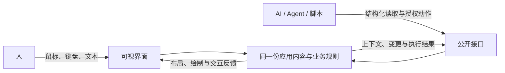

# CJGUI

**面向人和 AI 共同工作的仓颉自绘 GUI 框架。**

用仓颉构建桌面应用，以 GPU 绘制界面，让人通过窗口理解和操作，让 AI 通过与界面对应的对象、上下文和动作直接参与。双方修改同一份应用内容，能够接续彼此的工作。

CJGUI 以类似 GPUI 的低延迟桌面框架为目标：仓颉负责组件、布局和交互，macOS 是首个实现平台，Metal 负责场景合成，AppKit 提供窗口与系统文字服务。

**开发预览 · Cangjie 1.1.3 · macOS / Apple Silicon 优先 · 公共 API 持续演进**

[运行示例](#运行一个窗口) · [创建应用](#创建自己的应用) · [框架文档](runtime/cjgui/README.md) · [当前进度](runtime/cjgui/ACTIVE_DIRECTION.md)

## 人和 AI 都是一等公民

人擅长通过画面理解关系、选择和编辑；AI 擅长处理结构化信息、交换数据和批量执行。一个应用应该同时为两者提供合适的入口。

在 CJGUI 中，界面和对外接口围绕同一份应用状态建立对应关系：哪个字段属于哪条记录、当前正在编辑什么、有哪些动作、修改是否被接受，都应有明确的表达。AI 可以直接通过公开接口操作应用中的真实对象，减少截图识别、定位与反复点击的成本。

例如，在规则编辑器中，你选中一条记录修改草稿；外部 AI 可以读取当前草稿，在已有授权范围内修改其他记录，然后你继续在窗口中检查、调整。批量处理 100 条屏外记录可以通过数据操作完成；版本冲突和业务校验仍由应用处理。



框架提供这些能力，应用开发者决定具体体验。是否提供聊天窗、接入哪种模型或 Agent、怎样组织工作流，都由应用选择。界面生成也是未来可组合的能力；对外编码和连接方式可以继续演进。

## 已经具备什么

目前已实现通用运行链，并由规则集编辑器、共享文档窗口和独立消费者持续检验。

| 能力 | 当前实现 |
| --- | --- |
| **自绘与 GPU 合成** | Metal 按场景顺序合成形状、图片与文字纹理；支持裁剪、圆角、透明混合及相关资源复用。 |
| **仓颉组件与布局** | 组合容器、文字、按钮、表单、滚动区、分隔视图和弹层；布局结果同时服务绘制、命中与语义投影。 |
| **文字与交互** | 多行文档、焦点、选区、快捷键、连续拖动；复用系统文字排版和输入服务，内容修改进入应用的真实状态。 |
| **动态内容** | 固定与可变行高虚拟列表、稳定条目身份、组件作用域；持续完善动态组件与弹层引用的组合使用。 |
| **共同操作** | 公开对象与动作、授权调用、版本冲突检测、批量修改、定向读取与变更观察；提供本地 Python API / CLI。 |
| **应用宿主与消费** | 普通 macOS 应用入口、构建与 bundle 资源管理、应用模板和源码预览导出；已有同进程多窗口的受控验证。 |

这些是已有实现及不同范围的验证，框架整体仍处于开发预览阶段。源码构建、运行探针、真实窗口、外部脚本调用和实际模型接入各有独立的验收边界；最新记录见 [当前进度](runtime/cjgui/ACTIVE_DIRECTION.md)。

## 试用场景

- **规则集编辑器**：多记录列表、详情草稿、校验、撤销重做、文件保存与外部操作，用来检验结构化编辑应用如何消费框架。[源码](runtime/cjgui/examples/rule_set_window_app/)
- **共享文档窗口**：多行文字编辑、文档切换、选区与外部范围修改，用来检验人和外部系统接续编辑。[源码](runtime/cjgui/examples/shared_document_window_app/)
- **最小应用模板**：从纯 UI 应用开始，或者选择包含共享操作接入的模板，自行定义业务对象与界面。[模板](runtime/cjgui/templates/macos_application/)

## 运行一个窗口

当前试用环境为 macOS / Apple Silicon、仓颉 1.1.3，以及可用的 Xcode Command Line Tools。先安装工具链，并将下面的 SDK 路径替换为你的实际目录：

```sh
export CANGJIE_HOME=/absolute/path/to/cangjie-1.1.3
source "$CANGJIE_HOME/envsetup.sh"

git clone https://gitcode.com/aiulms/cjgui.git
cd cjgui
zsh runtime/cjgui/examples/rule_set_window_app/run.sh
```

只构建可在最后一条命令追加 `--build-only`。文档窗口的入口是 `runtime/cjgui/examples/shared_document_window_app/run.sh`。

runner 会构建平台桥接并生成本地应用 bundle。工具链和 macOS SDK 的兼容性仍需按实际版本检查；若遇到链接错误，参见 [宿主与构建说明](runtime/cjgui/MACOS_APPLICATION_HOST.md) 和 [工具链问题记录](docs/setup/CANGJIE_ISSUE_LEDGER.md)。

## 创建自己的应用

在仓库根目录，沿用上面的工具链环境：

```sh
zsh runtime/cjgui/scripts/create_macos_application.sh ui-only /tmp/MyCJGUIApp
zsh /tmp/MyCJGUIApp/run.sh
```

需要共同操作入口时，将 `ui-only` 换成 `collaboration`，并使用另一个新目录。应用通过仓颉 controller 定义界面和业务动作，平台桥接与打包由框架 runner 管理。

[应用宿主与模板指南](runtime/cjgui/MACOS_APPLICATION_HOST.md) 包含依赖、资源、源码预览导出和外部连接示例；[公开客户端说明](runtime/cjgui/shared_operation_core/README.md) 介绍授权、读取与调用。

## 性能方向与当前边界

CJGUI 追求低延迟的持续交互：减少无变化时的重绘，复用稳定布局和文字资源，只物化需要显示的列表内容，并限制队列与缓存的增长。

已有局部布局复用、文字纹理复用、连续指针合并等针对性测量。性能数字需要连同负载、构建、采样方式和测量环节一起阅读；当前尚未建立与 GPUI / Zed 的同条件性能对照，也不把 CPU 或 GPU 完成时间等同于用户看到结果的时间。

当前继续完善动态组件、正常应用消费和端到端交互证据。系统输入法只做集成；完整的系统 IME / VoiceOver 验收、真实输入到呈现延迟、多显示器以及多平台支持仍有缺口。稳定 API / ABI、安装包公证与正式发布也尚未承诺。

## 参与与深入了解

欢迎用不同业务、布局和数据规模检验框架，反馈复现步骤、环境、预期与实际结果。由应用暴露的框架问题和仓颉工具链问题都有对应记录入口。

- [框架开发文档](runtime/cjgui/README.md)：组件、布局、输入、渲染与公开消费入口。
- [设计意图与资产导航](docs/plans/DESIGN_INTENT_INDEX.md)：设计目的、已有实现与历史研究。
- [人与 AI 的共同操作设计](docs/core/AI_NATIVE_UI_SEMANTICS.md)：对象、上下文、动作与授权边界。
- [当前开发状态](runtime/cjgui/ACTIVE_DIRECTION.md)：已验证范围、进行中的工作及遗留项。
- [问题反馈与工具链记录](docs/setup/CANGJIE_ISSUE_LEDGER.md)：复现、影响与上下游跟进。
- [贡献协作入口](AGENTS.md) · [完整文档导航](docs/README.md) · [历史资料](docs/archive/2026-09-11-direction-governance/README.md)。
