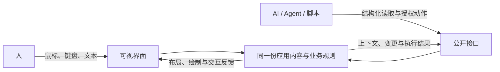

<p align="center">
  <strong>为人呈现界面，为 AI 开放理解与操作。</strong><br>
  以仓颉构建，向低延迟的桌面交互迈进。
</p>

<p align="center">
  <a href="#运行一个窗口">运行示例</a> ·
  <a href="#创建自己的应用">创建应用</a> ·
  <a href="runtime/cjgui/README.md">开发文档</a> ·
  <a href="runtime/cjgui/ACTIVE_DIRECTION.md">当前进度</a> ·
  <a href="LICENSE">Apache 2.0</a>
</p>

## 演示：人和 AI 接续编辑同一份文档


*26 秒真实录制、未加速（GIF 为 880px/10fps 衍生版，经 GitHub 镜像分发；[MP4 原片](docs/assets/demo/cjgui-shared-document-real-demo.mp4)与[素材说明](docs/assets/demo/README.md)在仓库内）：窗口内编辑先把文档推进到 `v13`；外部调用方使用应用签发的 descriptor，通过公开接口以版本 CAS 追加一段文本，窗口显示"已同步外部文档：`v14`"；窗口内继续键入到 `v20`，外部再从公开接口读回同一版本。双方始终操作同一份应用状态，互不覆盖。*

<details>
<summary>分步截图（视频无法自动播放的环境）</summary>

1. **界面编辑**：在原生文本框键入，窗口把内容、选区与版本回读为文档 `v3`。

   

2. **公开接口调用**：界面键入推进到 `v13` 后，descriptor-gated `REPLACE_RANGE` 以该版本追加文本，窗口显示"已同步外部文档：`v14`"。

   

3. **界面续接**：同一文本框继续键入到 `v20`，外部读回同一文档的版本 `20`、长度 `208`。

   

</details>

## 一个框架，两种参与方式

CJGUI 是一个面向人和 AI 共同工作的**仓颉自绘 GUI 框架**。人通过窗口选择和编辑，AI 通过结构化对象、上下文与授权动作参与；双方操作同一份应用内容，接续彼此的工作。

| 自绘与低延迟 | 人与 AI 共同操作 | 应用由你定义 |
| :--- | :--- | :--- |
| 仓颉组件与布局，Metal 场景合成。以局部更新与资源复用减少重复工作。 | 界面与公开接口对应同一业务状态，支持定向读取、批量操作与版本冲突检测。 | 自由组合界面，按需接入模型或 Agent，自行决定交流与工作流。 |

**当前为开发预览**：Cangjie 1.1.3，macOS / Apple Silicon 优先，公共 API 持续演进。

## 人和 AI 都是一等公民

你在窗口里选中一条规则，修改草稿；外部 AI 读取当前上下文，在已有授权内批量调整记录；你继续在界面里检查和编辑。处理 100 条屏外记录，可以直接通过数据操作完成，版本冲突与业务校验仍由应用处理。

关键是建立可靠的对应关系：**人看到的字段、AI 读取的对象，以及最终执行的动作，属于同一个应用。**



聊天窗、模型、Agent 与连接方式由应用开发者选择。界面生成是未来可组合的能力；对外编码保持可演进。

## 已经具备什么

目前已实现通用运行链，并由规则集编辑器、共享文档窗口和独立消费者持续检验。

| 能力 | 当前实现 |
| --- | --- |
| **自绘与 GPU 合成** | Metal 按场景顺序合成形状、图片与文字纹理；支持裁剪、圆角、透明混合及相关资源复用。 |
| **仓颉组件与布局** | 组合容器、文字、按钮、表单、滚动区、分隔视图和弹层；布局结果同时服务绘制、命中与语义投影。 |
| **文字与交互** | 多行文档、焦点、选区、快捷键、连续拖动；复用系统文字排版和输入服务，内容修改进入应用的真实状态。 |
| **动态内容** | 固定与可变行高虚拟列表、稳定条目身份、组件作用域；持续完善动态组件与弹层引用的组合使用。 |
| **共同操作** | 公开对象与动作、授权调用、版本冲突检测、批量修改、定向读取与变更观察；提供本地 Python API / CLI。 |
| **应用宿主与消费** | 普通 macOS 应用入口、构建与 bundle 资源管理、应用模板和源码预览导出；已有同进程多窗口的受控验证。 |

这些是已有实现及不同范围的验证，框架整体仍处于开发预览阶段。源码构建、运行探针、真实窗口、外部脚本调用和实际模型接入各有独立的验收边界；最新记录见 [当前进度](runtime/cjgui/ACTIVE_DIRECTION.md)。

## 和主流方案的定位差异

CJGUI 处在两个成熟品类的交界：桌面 GUI 框架，以及面向 Agent 的 UI 协议。下面的对比按**当前设计方向**描述（开发预览阶段，实际能力以上文和[当前进度](runtime/cjgui/ACTIVE_DIRECTION.md)为准），不是对等能力声明。

| 方案 | 它是什么 | 与 CJGUI 的关键差异 |
| --- | --- | --- |
| **A2UI**（Google 开源协议，及 AG-UI 等同类） | Agent 用声明式 JSON 描述 UI 意图，由宿主渲染器（React / Vue / Flutter 等）生成界面 | A2UI 让 Agent **生成界面**；CJGUI 的界面由开发者用仓颉编写，Agent 通过公开对象与授权动作**操作真实应用状态**。层次不同，可组合：未来 CJGUI 可承接 A2UI 类生成式流程作为其中一种参与方式 |
| **GPUI**（Zed） | Rust 自绘桌面框架，低延迟标杆 | 同为自绘低延迟路线（CJGUI 的延迟目标参照）；差异在语言生态（仓颉 vs Rust），以及 CJGUI 把结构化的 Agent 操作面（授权 / 版本 CAS / 变更观察）做成了框架契约，而非应用自建 |
| **Flutter** | Dart 跨平台自绘框架（Skia / Impeller） | 面向人的跨平台优先；没有框架级的 AI 共同操作层，授权与状态同步需每个应用自行实现 |
| **SwiftUI / Compose** | 平台原生声明式框架 | 为人类交互设计；外部程序化操作依赖辅助技术（Accessibility），不是一等公民接口，也无版本化冲突检测 |
| **Qt（cjqt）** | C++ 成熟框架的仓颉绑定 | 绑定路线 vs 原生仓颉自绘；Qt 无共同操作模型 |
| **Electron / Tauri** | Web 技术桌面容器 | Web 渲染 vs 原生 GPU 自绘；CJGUI 把「界面与公开接口对应同一状态」作为框架契约而不是库约定 |

一句话定位：**GUI 框架解决"界面怎么画"，A2UI 这类协议解决"Agent 怎么出界面"，CJGUI 解决"人和 Agent 怎么共同操作同一个真实应用"。**

## 试用场景

- **规则集编辑器**：多记录列表、详情草稿、校验、撤销重做、文件保存与外部操作，用来检验结构化编辑应用如何消费框架。[源码](runtime/cjgui/examples/rule_set_window_app/)
- **共享文档窗口**：多行文字编辑、文档切换、选区与外部范围修改，用来检验人和外部系统接续编辑。[源码](runtime/cjgui/examples/shared_document_window_app/)
- **最小应用模板**：从纯 UI 应用开始，或者选择包含共享操作接入的模板，自行定义业务对象与界面。[模板](runtime/cjgui/templates/macos_application/)

## 运行一个窗口

当前试用环境为 macOS / Apple Silicon、仓颉 1.1.3，以及可用的 Xcode Command Line Tools。先安装工具链，并将下面的 SDK 路径替换为你的实际目录：

```sh
export CANGJIE_HOME=/absolute/path/to/cangjie-1.1.3
source "$CANGJIE_HOME/envsetup.sh"

git clone https://gitcode.com/aiulms/cjgui.git
cd cjgui
zsh runtime/cjgui/examples/rule_set_window_app/run.sh
```

只构建可在最后一条命令追加 `--build-only`。文档窗口的入口是 `runtime/cjgui/examples/shared_document_window_app/run.sh`。

runner 会构建平台桥接并生成本地应用 bundle。工具链和 macOS SDK 的兼容性仍需按实际版本检查；若遇到链接错误，参见 [宿主与构建说明](runtime/cjgui/MACOS_APPLICATION_HOST.md) 和 [工具链问题记录](docs/setup/CANGJIE_ISSUE_LEDGER.md)。

## 创建自己的应用

在仓库根目录，沿用上面的工具链环境：

```sh
zsh runtime/cjgui/scripts/create_macos_application.sh ui-only /tmp/MyCJGUIApp
zsh /tmp/MyCJGUIApp/run.sh
```

需要共同操作入口时，将 `ui-only` 换成 `collaboration`，并使用另一个新目录。应用通过仓颉 controller 定义界面和业务动作，平台桥接与打包由框架 runner 管理。

[应用宿主与模板指南](runtime/cjgui/MACOS_APPLICATION_HOST.md) 包含依赖、资源、源码预览导出和外部连接示例；[公开客户端说明](runtime/cjgui/shared_operation_core/README.md) 介绍授权、读取与调用。

## 性能方向与当前边界

CJGUI 追求低延迟的持续交互：减少无变化时的重绘，复用稳定布局和文字资源，只物化需要显示的列表内容，并限制队列与缓存的增长。

已有局部布局复用、文字纹理复用、连续指针合并等针对性测量。性能数字需要连同负载、构建、采样方式和测量环节一起阅读；当前尚未建立与 GPUI / Zed 的同条件性能对照，也不把 CPU 或 GPU 完成时间等同于用户看到结果的时间。

当前继续完善动态组件、正常应用消费和端到端交互证据。系统输入法只做集成；完整的系统 IME / VoiceOver 验收、真实输入到呈现延迟、多显示器以及多平台支持仍有缺口。稳定 API / ABI、安装包公证与正式发布也尚未承诺。

## 参与与深入了解

欢迎用不同业务、布局和数据规模检验框架，反馈复现步骤、环境、预期与实际结果。由应用暴露的框架问题和仓颉工具链问题都有对应记录入口。

- [框架开发文档](runtime/cjgui/README.md)：组件、布局、输入、渲染与公开消费入口。
- [设计意图与资产导航](docs/plans/DESIGN_INTENT_INDEX.md)：设计目的、已有实现与历史研究。
- [人与 AI 的共同操作设计](docs/core/AI_NATIVE_UI_SEMANTICS.md)：对象、上下文、动作与授权边界。
- [当前开发状态](runtime/cjgui/ACTIVE_DIRECTION.md)：已验证范围、进行中的工作及遗留项。
- [问题反馈与工具链记录](docs/setup/CANGJIE_ISSUE_LEDGER.md)：复现、影响与上下游跟进。
- [贡献协作入口](AGENTS.md) · [完整文档导航](docs/README.md) · [历史资料](docs/archive/2026-09-11-direction-governance/README.md)。

## 许可证

Copyright 2026 CJGUI contributors。

CJGUI 原创代码、文档和随附原创资源采用 [Apache License 2.0](LICENSE)，归属声明见 [NOTICE](NOTICE)。第三方软件及平台 SDK 保持各自许可证；已有的第三方声明不受本项目许可替代。
