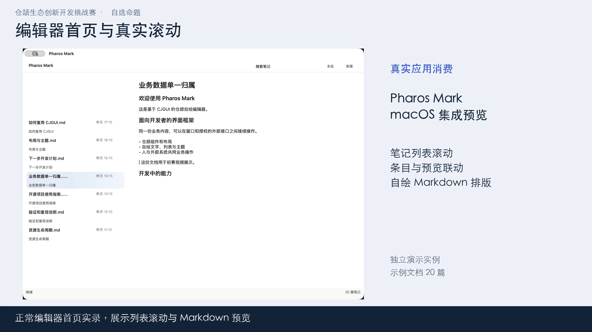

# CJGUI 初赛演示

人的操作、工具的修改和生成的面板，怎样在一个应用里接起来？本片从真实窗口展示 CJGUI 的协作入口，再看编辑器首页和鸿蒙样例。

[播放或下载参赛成片](<CJGUI 初赛参赛演示.mp4>) · [完整解说字幕](<CJGUI 初赛参赛演示.srt>) · [解说词](视频解说词.txt) · [素材与版本指纹](video-provenance.json)

成片约 2 分 15 秒，1920×1080、30 fps，H.264/AAC；包含中文合成解说、章节和画面说明。网站若不提供内嵌播放，可下载 MP4 观看。

## 公开下载

[直接下载本次成片，无需登录](https://raw.githubusercontent.com/aiulms/cjgui/8f9091c2a03cded04ac1875dfaa293987208962f/docs/contest/2026-10-07/demo/CJGUI%20%E5%88%9D%E8%B5%9B%E5%8F%82%E8%B5%9B%E6%BC%94%E7%A4%BA.mp4)。已核对下载文件与本地成片 SHA256 完全一致。服务以 application/octet-stream 返回，浏览器可下载后观看。

固定源码与素材提交为 `8f9091c2a03cded04ac1875dfaa293987208962f`，初版源码与材料归档标签 `cjgui-contest-20261007`，文字修订见 main；公开下载构建已通过，见 [源码状态](../SOURCE_STATUS.md)。

## 演示顺序

| 时间 | 内容 | 证据范围 |
| --- | --- | --- |
| 00:00 | CJGUI 面向谁、解决什么 | 项目介绍 |
| 00:16 | Pharos Mark 首页列表滚动、条目与 Markdown 预览更新 | 独立数据目录启动的既有 macOS 集成构建，真实窗口实录 |
| 00:41 | 生成与手写界面提交、外部备注同步、冻结标题拒绝 | 本次候选框架构建的普通 generated_panel_consumer，无 native 单元测试宏 |
| 01:17 | 鸿蒙温控与编辑器 | 已归档的真实模拟器截图；平台仍使用 XComponent 与 OH_Drawing |
| 01:41 | 测试与复现 | 框架 560/560、共享核心 100/100、公开 Python 客户端 96/96 |
| 02:02 | 作品入口与开发目标 | 源码、提案与验证材料导航 |

## 重点看任务面板

人点击提交，手写区和生成区的标题一起变为只读；工具追加备注，两边显示同一份新内容；再尝试修改标题，应用拒绝并保留原标题。它展示了人和 AI 工具协作所需的共同数据与规则。本次外部调用使用公开脚本客户端，模型接入后的效果另行评测。

以下读回用于核对这段实际操作：

公开结构读回 `STRUCTURE_VERSION=3`、`SCENE_STATE=scene_accepted`。人在生成区点击提交，owner v3→v4，生成与手写标题同时只读；公开客户端 `SET_NOTES` 使 v4→v5，两个区域显示相同备注。在 v5 尝试 `SET_TITLE` 被 `title_frozen_after_submit` 拒绝，`APPLIED=false`、`VERSION_BEFORE/AFTER=5`；随后读回原标题及版本不变。

原始公开读回见 [结构接受](../evidence/generated-accepted-structure.json)、[窗口提交后 owner](../evidence/generated-after-ui-submit.json)、[备注结果](../evidence/generated-notes-result.json)、[标题拒绝](../evidence/generated-frozen-title-refused.json)和[最终 owner](../evidence/generated-final-owner.json)。输入直接粘贴的失败尝试没有计为通过，见 [验证报告](../VALIDATION.md)。

## 素材版本与制作

macOS 录屏按原速播放，仅做布局缩放和章节编排；编辑器集成构建与本次候选框架分别记录二进制/源码指纹。鸿蒙段展示归档模拟器截图，各图版本见素材清单。

解说使用本机 Apple Tingting 语音合成；底部为章节摘要字幕，SRT 提供完整解说文字，句子时间按合成音频时长分配。外部调用由脚本客户端完成。

对应源码、公开同步与下载复现状态见 [SOURCE_STATUS](../SOURCE_STATUS.md)。
